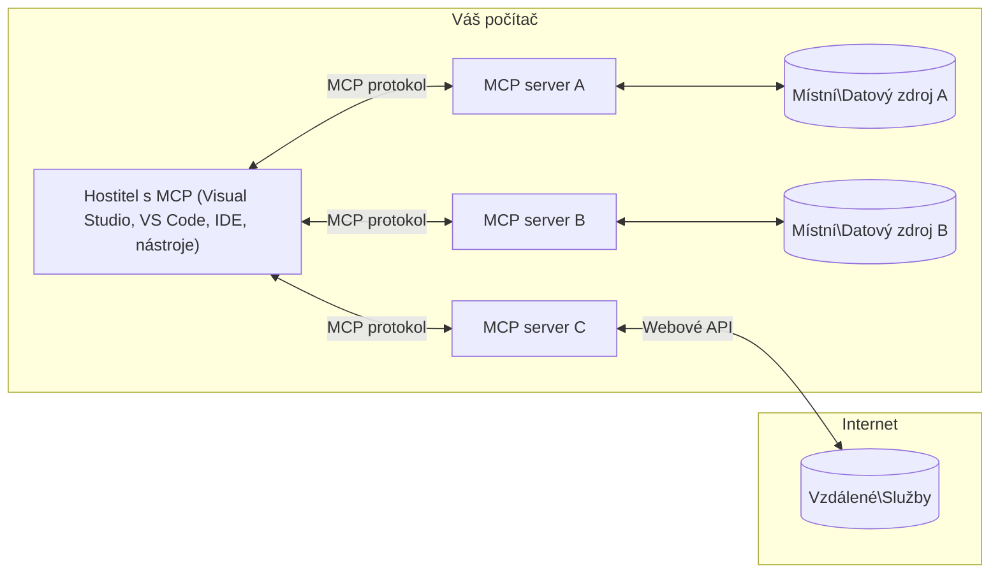

# Základní koncepty MCP: Ovládání Model Context Protocol pro integraci AI

[](https://youtu.be/earDzWGtE84)

_(Klikněte na obrázek výše pro zobrazení videa tohoto lekce)_

[Model Context Protocol (MCP)](https://github.com/modelcontextprotocol) je výkonný, standardizovaný rámec, který optimalizuje komunikaci mezi rozsáhlými jazykovými modely (LLMs) a externími nástroji, aplikacemi a zdroji dat.
Tento průvodce vás provede základními koncepty MCP. Naučíte se o jeho klient-server architektuře, základních komponentách, mechanismech komunikace a nejlepších postupech implementace.

- **Kontrola uživatele a souhlas**: Hostitelé by měli jasně zobrazit, jaká data a nástroje
  server zpřístupňuje, umožnit uživatelům odmítnout operace a získat explicitní potvrzení
  pro citlivé či zásadní akce. MCP nevyžaduje potvrzovací dialog před každým zavoláním nástroje.


- **Ochrana soukromí dat**: Uživatelská data jsou zpřístupněna pouze s explicitním souhlasem a musí být chráněna robustními kontrolami přístupu během celého životního cyklu interakce. Implementace musí zabránit neoprávněnému přenosu dat a udržovat přísné hranice soukromí.

- **Bezpečnost spouštění nástrojů**: Hostitelé by měli zobrazovat volání nástrojů a umožnit člověku je zamítnout. Citlivé operace by měly zobrazovat vstupy a dopady nástroje před spuštěním, s bezpečnostními hranicemi, které zabraňují nechtěným nebo škodlivým akcím.


- **Bezpečnost přenosu**: Vzdálená připojení by měla používat HTTPS a autorizační model MCP. Lokální stdio servery spoléhají na izolaci procesů, důvěryhodnou konfiguraci a bezpečné zacházení s děděnými přihlašovacími údaji.


#### Pokyny k implementaci:

- **Správa oprávnění**: Implementujte jemně zrnité systémy oprávnění, které umožní uživatelům kontrolovat, ke kterým serverům, nástrojům a zdrojům mají přístup
- **Autentizace a autorizace**: Používejte bezpečné metody autentizace (OAuth, API klíče) s řádnou správou tokenů a expirací  
- **Validace vstupu**: Ověřujte všechny parametry a vstupy dat podle definovaných schémat, abyste zabránili útokům typu injection
- **Auditní logování**: Vedení komplexních záznamů všech operací pro bezpečnostní monitoring a dodržování předpisů

## Přehled

Tato lekce zkoumá základní architekturu a komponenty, z nichž se skládá ekosystém Model Context Protocol (MCP). Naučíte se o klient-server architektuře, klíčových komponentách a komunikačních mechanismech, které pohánějí interakce MCP.

## Klíčové učební cíle

Na konci této lekce budete:

- Rozumět klient-server architektuře MCP.
- Identifikovat role a odpovědnosti hostitelů, klientů a serverů.
- Analyzovat hlavní funkce, které činí MCP flexibilní integrační vrstvou.
- Naučit se, jak proudí informace v rámci ekosystému MCP.
- Získat praktické poznatky prostřednictvím příkladů kódu v .NET, Javě, Pythonu a JavScriptu.

## Architektura MCP: Hlouběji

Ekosystém MCP je postaven na modelu klient-server. Tato modulární struktura umožňuje AI aplikacím efektivně komunikovat s nástroji, databázemi, API a kontextovými zdroji. Rozdělme si tuto architekturu na základní komponenty.

V jádru MCP sleduje klient-server architekturu, kde hostitelská aplikace může připojit k více serverům:


```mermaid
flowchart LR
    subgraph "Váš počítač"
        Host["Hostitel s MCP (Visual Studio, VS Code, IDE, nástroje)"]
        S1["MCP server A"]
        S2["MCP server B"]
        S3["MCP server C"]
        Host <-->|"MCP protokol"| S1
        Host <-->|"MCP protokol"| S2
        Host <-->|"MCP protokol"| S3
        S1 <--> D1[("Místní\Datový zdroj A")]
        S2 <--> D2[("Místní\Datový zdroj B")]
    end
    subgraph "Internet"
        S3 <-->|"Webové API"| D3[("Vzdálené\Služby")]
    end
```

- **MCP hostitelé**: Programy jako VSCode, Claude Desktop, IDE nebo AI nástroje, které chtějí přistupovat k datům přes MCP
- **MCP klienti**: Protokolové komponenty, které udržují jednu logickou relaci
  se serverem; požadavky MCP `2026-07-28` nezávisí na jedné trvalé
  spojení nebo relaci

- **Servery MCP**: Lehká programy, které každý zpřístupňují konkrétní schopnosti prostřednictvím standardizovaného Model Context Protocol
- **Lokální zdroje dat**: Soubory, databáze a služby vašeho počítače, ke kterým servery MCP mohou bezpečně přistupovat
- **Vzdálené služby**: Externí systémy dostupné přes internet, ke kterým se servery MCP mohou připojit přes API.

Protokol MCP je vyvíjející se standard používající verzování založené na datu
(formát RRRR-MM-DD). Aktuální verze protokolu je **2026-07-28**. Viz
[specifikace protokolu 2026-07-28](https://modelcontextprotocol.io/specification/2026-07-28/).

> **Aktuální verze:** MCP `2026-07-28` činí protokol bezstavovým na
> transportní vrstvě odstraněním inicializačního handshaku a protokolových
> relací session ID. Rovněž formalizuje rámec Extensions a označuje za zastaralé
> koncepty Roots, Sampling a Logging ve prospěch novějších vzorů. Viz
> [Co se změnilo v MCP: specifikace 2026-07-28](./mcp-2026-07-28.md)
> pro kompletní rozbor a návody k migraci. Příklady explicitně cílící na
> `2025-11-25` jsou zachovány jako lekce pro zpětnou kompatibilitu.

### 1. Hostitelé

V Model Context Protocol (MCP) jsou **Hostitelé** AI aplikace, které slouží jako primární rozhraní, skrze které uživatelé komunikují s protokolem. Hostitelé koordinují a spravují připojení k více serverům MCP vytvářením dedikovaných klientů MCP pro každé serverové připojení. Příklady hostitelů zahrnují:

- **AI aplikace**: Claude Desktop, Visual Studio Code, Claude Code
- **Vývojová prostředí**: IDE a editory kódu s integrací MCP  
- **Vlastní aplikace**: Účelově vytvoření AI agenti a nástroje

**Hostitelé** jsou aplikace, které koordinují interakce s AI modely. Oni:

- **Orchestrace AI modelů**: Spouští nebo interagují s LLM k vytvoření odpovědí a koordinují AI pracovní postupy
- **Správa klientských vztahů**: Vytvářejí a spravují jednoho klienta MCP pro každý používáný MCP
  server
- **Řízení uživatelského rozhraní**: Řídí tok konverzace, uživatelské interakce a prezentaci odpovědí  
- **Prosazování bezpečnosti**: Řídí oprávnění, bezpečnostní omezení a autentizaci
- **Řešení souhlasu uživatele**: Spravují uživatelský souhlas pro sdílení dat a spouštění nástrojů


### 2. Klienti

**Klienti** jsou komponenty protokolu vytvořené hostitelem pro konkrétní MCP
servery. Jedná se o logický vztah jeden ku jednomu, nikoliv o požadavek na
trvalé síťové spojení. V MCP `2026-07-28` je každá žádost
soběstačná a může být zpracována kteroukoliv instancí serveru.

**Klienti** jsou konektorové komponenty v aplikačním hostiteli. Oni:

- **Protokolová komunikace**: Odesílají požadavky JSON-RPC 2.0 serverům s promptami a instrukcemi
- **Zjišťování schopností**: Používají `server/discover` k získání informací o podporovaných
  verzích protokolu, schopnostech a rozšířeních serveru
- **Spouštění nástrojů**: Řídí spouštění nástrojů z modelů a zpracovávají odpovědi
- **Aktualizace v reálném čase**: Zpracovávají notifikace a aktualizace ze serverů v reálném čase
- **Zpracování odpovědí**: Zpracovávají a formátují odpovědi serveru k zobrazení uživatelům

### 3. Servery


**Servery** jsou programy, které poskytují kontext, nástroje a schopnosti klientům MCP. Mohou být spuštěny lokálně (na stejném počítači jako Hostitel) nebo vzdáleně (na externích platformách) a jsou zodpovědné za zpracování požadavků klienta a poskytování strukturovaných odpovědí. Servery zpřístupňují specifickou funkcionalitu prostřednictvím standardizovaného Model Context Protocolu.

**Servery** jsou služby, které poskytují kontext a schopnosti. Tyto:


- **Registrace funkcí**: Zaregistrovat a zpřístupnit dostupné primitivy (zdroje, výzvy, nástroje) klientům
- **Zpracování požadavků**: Přijímat a vykonávat volání nástrojů, žádosti o zdroje a žádosti o výzvy od klientů
- **Poskytování kontextu**: Poskytnout kontextové informace a data pro zlepšení odpovědí modelu
- **Správa stavu**: Udržovat stav aplikace s explicitními odkazy předávanými
  v požadavcích, pokud je to potřeba; MCP `2026-07-28` nemá protokolové relace na úrovni protokolu
- **Notifikace v reálném čase**: Odesílat oznámení o změnách schopností a aktualizacích připojeným klientům

Servery může vyvíjet kdokoliv pro rozšíření schopností modelu specializovanou funkcionalitou a podporují jak scénáře lokálního, tak vzdáleného nasazení.

### 4. Serverové primitivy

Servery v rámci Model Context Protocol (MCP) poskytují tři hlavní **primitivy**, které definují základní stavební bloky pro bohaté interakce mezi klienty, hostiteli a jazykovými modely. Tyto primitivy specifikují typy kontextových informací a akcí dostupných přes protokol.

MCP servery mohou zpřístupnit jakoukoli kombinaci následujících tří hlavních primitiv:

#### Zdroje

**Zdroje** jsou datové zdroje, které poskytují kontextové informace AI aplikacím. Představují statický nebo dynamický obsah, který může zlepšit pochopení modelu a rozhodování:

- **Kontextová data**: Strukturované informace a kontext pro spotřebu AI modelem
- **Znalostní báze**: Repozitáře dokumentů, články, manuály a výzkumné práce
- **Místní datové zdroje**: Soubory, databáze a místní systémové informace
- **Externí data**: Odpovědi API, webové služby a data vzdálených systémů
- **Dynamický obsah**: Data v reálném čase, která se aktualizují na základě vnějších podmínek

Zdroje jsou identifikovány pomocí URI a podporují vyhledávání přes metody `resources/list` a načítání přes `resources/read`:

```text
file://documents/project-spec.md
database://production/users/schema
api://weather/current
```

#### Výzvy

**Výzvy** jsou znovupoužitelné šablony, které pomáhají strukturovat interakce s jazykovými modely. Poskytují standardizované vzory interakcí a šablonované pracovní postupy:

- **Interakce založené na šablonách**: Předstrukturované zprávy a otevírače konverzací
- **Šablony pracovních postupů**: Standardizované sekvence pro běžné úkoly a interakce
- **Příklady s několika vzory**: Šablony založené na příkladech pro instrukce modelu
- **Systémové výzvy**: Základní výzvy, které definují chování a kontext modelu
- **Dynamické šablony**: Parametrizované výzvy přizpůsobující se specifickým kontextům

Výzvy podporují nahrazování proměnných a lze je nalézt přes `prompts/list` a získat přes `prompts/get`:

```markdown
Generate a {{task_type}} for {{product}} targeting {{audience}} with the following requirements: {{requirements}}
```

#### Nástroje

**Nástroje** jsou spustitelné funkce, které může AI model vyvolat k provedení konkrétních akcí. Představují „slovesa“ ekosystému MCP, umožňující modelům interagovat s externími systémy:

- **Spustitelné funkce**: Diskrétní operace, které může model vyvolat se specifickými parametry
- **Integrace s externími systémy**: API volání, dotazy do databáze, operace se soubory, výpočty
- **Jedinečná identita**: Každý nástroj má jedinečný název, popis a schéma parametrů
- **Strukturovaný vstup/výstup**: Nástroje přijímají validované parametry a vracejí strukturované, typované odpovědi
- **Akční schopnosti**: Umožňují modelům provádět reálné akce a získávat aktuální data

Nástroje jsou definovány pomocí JSON Schema pro validaci parametrů a vyhledávají se přes `tools/list` a spouštějí přes `tools/call`. Nástroje mohou také obsahovat **ikony** jako doplňkové metadata pro lepší prezentaci v uživatelském rozhraní.

**Anotace nástrojů**: Nástroje podporují behaviorální anotace (např. `readOnlyHint`, `destructiveHint`), které popisují, zda je nástroj pouze pro čtení nebo destruktivní, pomáhající klientům učinit informované rozhodnutí o provedení nástroje.

Příklad definice nástroje:

```typescript
server.tool(
  "search_products", 
  {
    query: z.string().describe("Search query for products"),
    category: z.string().optional().describe("Product category filter"),
    max_results: z.number().default(10).describe("Maximum results to return")
  }, 
  async (params) => {
    // Proveď vyhledávání a vrať strukturované výsledky
    return await productService.search(params);
  }
);
```

## Klientské primitivy

V Model Context Protocol (MCP) mohou **klienti** zpřístupnit primitivy, které umožňují serverům požadovat další schopnosti od hostitelské aplikace. Tyto klientské primitivy umožňují bohatší, interaktivnější implementace serverů, které mohou přistupovat ke schopnostem AI modelu a interakcím uživatele.

### Vzorkování

> **Zastaralé v MCP `2026-07-28`:** Vzorkování zůstává dostupné pro
> zpětnou kompatibilitu, ale nové implementace by měly přímo integrovat API poskytovatele LLM.
> Je vhodné ho odstranit v první revizi specifikace
> vydané dne nebo po 28. červenci 2027. Viz
> [Co se změnilo v MCP: Specifikace 2026-07-28](./mcp-2026-07-28.md).

**Vzorkování** umožňuje serverům požadovat dokončení jazykového modelu z AI aplikace klienta. Tento primitiv umožňuje serverům přístup k schopnostem LLM bez vkládání vlastních závislostí na modelu:

- **Nezávislý přístup k modelu**: Servery mohou požadovat dokončení bez zahrnování LLM SDK nebo správy přístupu k modelu
- **Serverem iniciovaná AI**: Umožňuje serverům autonomně generovat obsah pomocí modelu klienta
- **Rekurzivní interakce s LLM**: Podpora složitých scénářů, kde servery potřebují AI asistenci k zpracování
- **Dynamická tvorba obsahu**: Umožňuje serverům vytvářet kontextové odpovědi s využitím modelu hostitele
- **Podpora volání nástrojů**: Servery mohou zahrnout parametry `tools` a `toolChoice` pro umožnění modelu klienta vyvolávat nástroje během vzorkování

Vzorkování používá metodu `sampling/createMessage`, kde servery požadují
dokončení od klientů.

### Kořeny

> **Zastaralé v MCP `2026-07-28`:** Kořeny zůstávají dostupné pro
> zpětnou kompatibilitu, ale nové implementace by měly předávat adresáře nebo soubory prostřednictvím
> parametrů nástrojů, URI zdrojů nebo konfigurace serveru. Kořeny jsou vhodné pro
> odstranění v první revizi specifikace vydané dne nebo po
> 28. červenci 2027. Viz
> [Co se změnilo v MCP: Specifikace 2026-07-28](./mcp-2026-07-28.md).

**Kořeny** poskytují standardizovaný způsob, jak mohou klienti identifikovat umístění souborového systému
relevantní pro servery:

- **Nápovědy k souborovému systému**: Identifikují adresáře a soubory relevantní pro požadavek
- **Oddělené oprávnění**: Neudělují přístup ani nevymezují bezpečnostní hranici
- **Schopnost na požadavek**: Klienti oznamují podporu Kořenů v metadatech požadavku
- **Identifikace založená na URI**: Kořeny používají URI `file://` k identifikaci přístupných adresářů a souborů

V MCP `2026-07-28` server požaduje `roots/list` přes
`InputRequiredResult` během zpracování podporovaného požadavku klienta.
Klient vrátí kořeny při opětovném pokusu o původní požadavek.

### Vyvolání

**Vyvolání** umožňuje serverům požadovat další informace nebo potvrzení od uživatelů prostřednictvím klientského rozhraní:

- **Požadavky na vstup uživatele**: Servery mohou požadovat další informace, pokud jsou potřeba k vykonání nástroje
- **Potvrzovací dialogy**: Požádat o schválení uživatele pro citlivé nebo zásadní operace
- **Interaktivní pracovní postupy**: Umožnit serverům vytvářet krok za krokem uživatelské interakce
- **Dynamický sběr parametrů**: Shromažďovat chybějící nebo volitelné parametry během provádění nástroje

Vyvolání používá metodu `elicitation/create` uvnitř
`InputRequiredResult` k získání uživatelského vstupu přes rozhraní klienta.


**Elicitace režimu URL**: Servery mohou také požadovat interakce uživatelů založené na URL, což umožňuje serverům směrovat uživatele na externí webové stránky pro autentizaci, potvrzení nebo zadání dat.

### Protokolování

> **Zastaralé v MCP `2026-07-28`:** Protokolování zůstává dostupné pro
> zpětnou kompatibilitu, ale nové implementace by měly používat `stderr` se stdio a
> OpenTelemetry pro strukturovanou sledovatelnost. Protokolování je způsobilé k odstranění
> v první revizi specifikace vydané dne nebo po 28. červenci 2027. Viz
> [Co se změnilo v MCP: Specifikace 2026-07-28](./mcp-2026-07-28.md).

**Protokolování** umožňuje serverům odesílat strukturované logovací zprávy klientům pro ladění, monitorování a operační přehled:

- **Podpora ladění**: Umožnit serverům poskytovat podrobné výpisy běhu pro odstraňování problémů
- **Operační monitorování**: Odesílat aktualizace stavu a metriky výkonu klientům
- **Hlášení chyb**: Poskytnout podrobný kontext chyby a diagnostické informace
- **Auditní stopy**: Vytvářet komplexní záznamy o činnostech a rozhodnutích serveru

Logovací zprávy jsou odesílány klientům, aby poskytly průhlednost do operací serveru a usnadnily ladění.

## Tok informací v MCP

Protokol Model Context Protocol (MCP) definuje strukturovaný tok informací mezi hostiteli, klienty, servery a modely. Pochopení tohoto toku pomáhá objasnit, jak jsou zpracovávány uživatelské požadavky a jak jsou externí nástroje a data integrovány do odpovědí modelu.

- **Hostitel inicializuje připojení**  
  Hostitelská aplikace (např. IDE nebo chatovací rozhraní) naváže spojení se serverem MCP, obvykle přes STDIO, WebSocket nebo jiný podporovaný transport.

- **Vyjednávání schopností**  
  Klient (vložený v hostiteli) a server si vymění informace o podporovaných funkcích, nástrojích, zdrojích a verzích protokolu. To zajišťuje, že obě strany rozumí, jaké schopnosti jsou pro relaci k dispozici.

- **Uživatelský požadavek**  
  Uživatel interaguje s hostitelem (např. zadá příkaz nebo dotaz). Hostitel tento vstup sbírá a předává klientovi k zpracování.

- **Použití zdrojů nebo nástrojů**  
  - Klient může požadovat další kontext nebo zdroje ze serveru (například soubory, databázové záznamy nebo články z databáze znalostí) pro obohacení porozumění modelu.
  - Pokud model zjistí, že je potřeba nástroj (například pro získání dat, provedení výpočtu nebo volání API), klient odešle na server požadavek na vyvolání nástroje, přičemž specifikuje název nástroje a parametry.

- **Provádění na serveru**  
  Server přijme požadavek na zdroj nebo nástroj, vykoná potřebné operace (např. spuštění funkce, dotaz do databáze nebo získání souboru) a vrátí výsledky klientovi ve strukturovaném formátu.

- **Generování odpovědi**  
  Klient integruje odpovědi serveru (data ze zdrojů, výstupy nástrojů atd.) do probíhající interakce modelu. Model tyto informace využívá k vytvoření komplexní a kontextově relevantní odpovědi.

- **Prezentace výsledku**  
  Hostitel přijme finální výstup od klienta a zobrazí jej uživateli, často včetně textu vygenerovaného modelem a také výsledků z volání nástrojů nebo dotazů na zdroje.

Tento tok umožňuje MCP podporovat pokročilé, interaktivní a kontextově uvědomělé aplikace AI tím, že bezproblémově propojuje modely s externími nástroji a zdroji dat.

## Architektura protokolu a vrstvy

MCP se skládá ze dvou odlišných architektonických vrstev, které spolupracují a poskytují kompletní rámec komunikace:

### Datová vrstva

**Datová vrstva** implementuje jádro protokolu MCP pomocí **JSON-RPC 2.0** jako základu. Tato vrstva definuje strukturu zpráv, sémantiku a vzory interakcí:

#### Hlavní komponenty:

- **Protokol JSON-RPC 2.0**: Veškerá komunikace používá standardizovaný formát zpráv JSON-RPC 2.0 pro volání metod, odpovědi a oznámení
- **Správa životního cyklu**: Řídí inicializaci připojení, vyjednávání schopností a ukončení relace mezi klienty a servery
- **Primární funkce serveru**: Umožňuje serverům poskytovat základní funkce prostřednictvím nástrojů, zdrojů a výzev
- **Primární funkce klienta**: Umožňuje serverům požadovat vzorkování z LLM, získání vstupu od uživatele a zasílání logovacích zpráv
- **Notifikace v reálném čase**: Podporuje asynchronní notifikace pro dynamické aktualizace bez nutnosti opakovaného dotazování

#### Klíčové vlastnosti:

- **Vyjednávání verzí protokolu**: Používá verzování založené na datu (RRRR-MM-DD) pro zajištění kompatibility
- **Objevování schopností**: Klienti a servery si vyměňují informace o podporovaných funkcích během inicializace
- **Stavové relace**: Udržuje stav připojení napříč vícero interakcemi pro kontinuitu kontextu

### Transportní vrstva

**Transportní vrstva** spravuje komunikační kanály, rámování zpráv a autentizaci mezi účastníky MCP:

#### Podporované transportní mechanismy:

1. **STDIO transport**:
   - Používá standardní vstupní/výstupní proudy pro přímou komunikaci procesů
   - Optimální pro lokální procesy na stejném stroji bez síťové režie
   - Běžně používaný pro lokální implementace MCP serverů

2. **Streamovatelný HTTP transport**:
   - Používá HTTP POST pro zprávy klient→server  
   - Volitelné Server-Sent Events (SSE) pro streamování server→klient
   - Umožňuje vzdálenou komunikaci serverů přes sítě
   - Podporuje standardní HTTP autentizaci (bearer tokeny, API klíče, vlastní hlavičky)
   - MCP doporučuje OAuth pro bezpečnou autentizaci založenou na tokenech

#### Abstrakce transportu:

Transportní vrstva abstrahuje detaily komunikace od datové vrstvy, což umožňuje používat stejný formát zpráv JSON-RPC 2.0 přes všechny transportní mechanismy. Tato abstrakce dovoluje aplikacím plynule přepínat mezi lokálními a vzdálenými servery.

### Bezpečnostní ohledy

Implementace MCP musí dodržovat několik zásadních bezpečnostních principů, aby zajistily bezpečné, důvěryhodné a zabezpečené interakce napříč všemi operacemi protokolu:

- **Souhlas a kontrola uživatele**: Uživatelé musí poskytnout výslovný souhlas před tím, než jsou přistupována jakákoliv data nebo prováděny operace. Měli by mít jasnou kontrolu nad tím, jaká data jsou sdílena a jaké činnosti jsou autorizovány, kterou podporují intuitivní uživatelská rozhraní pro kontrolu a schvalování aktivit.

- **Ochrana soukromí dat**: Uživatelská data by měla být zpřístupněna pouze s výslovným souhlasem a musí být chráněna vhodnými přístupovými kontrolami. Implementace MCP musí zabránit neautorizovanému přenosu dat a zajistit, že soukromí je udržováno v průběhu všech interakcí.

- **Bezpečnost nástrojů**: Před vyvoláním jakéhokoliv nástroje je nutný výslovný souhlas uživatele. Uživatelé by měli mít jasné pochopení funkčnosti každého nástroje a musí být vynuceny robustní bezpečnostní hranice, aby se zabránilo neúmyslnému nebo nebezpečnému spuštění nástroje.

Dodržováním těchto bezpečnostních principů MCP zajišťuje důvěru uživatelů, ochranu soukromí a bezpečnost napříč všemi interakcemi protokolu, přičemž umožňuje výkonné AI integrace.

## Ukázky kódu: Klíčové komponenty

Níže jsou ukázky kódu v několika populárních programovacích jazycích, které ilustrují, jak implementovat klíčové komponenty a nástroje MCP serveru.

### Příklad .NET: Vytvoření jednoduchého MCP serveru s nástroji

Zde je praktický příklad kódu v .NET, který demonstruje, jak implementovat jednoduchý MCP server s vlastními nástroji. Tento příklad ukazuje, jak definovat a zaregistrovat nástroje, zpracovat požadavky a připojit server pomocí Model Context Protocol.

```csharp
using System;
using System.Threading.Tasks;
using ModelContextProtocol.Server;
using ModelContextProtocol.Server.Transport;
using ModelContextProtocol.Server.Tools;

public class WeatherServer
{
    public static async Task Main(string[] args)
    {
        // Create an MCP server
        var server = new McpServer(
            name: "Weather MCP Server",
            version: "1.0.0"
        );
        
        // Register our custom weather tool
        server.AddTool<string, WeatherData>("weatherTool", 
            description: "Gets current weather for a location",
            execute: async (location) => {
                // Call weather API (simplified)
                var weatherData = await GetWeatherDataAsync(location);
                return weatherData;
            });
        
        // Connect the server using stdio transport
        var transport = new StdioServerTransport();
        await server.ConnectAsync(transport);
        
        Console.WriteLine("Weather MCP Server started");
        
        // Keep the server running until process is terminated
        await Task.Delay(-1);
    }
    
    private static async Task<WeatherData> GetWeatherDataAsync(string location)
    {
        // This would normally call a weather API
        // Simplified for demonstration
        await Task.Delay(100); // Simulate API call
        return new WeatherData { 
            Temperature = 72.5,
            Conditions = "Sunny",
            Location = location
        };
    }
}

public class WeatherData
{
    public double Temperature { get; set; }
    public string Conditions { get; set; }
    public string Location { get; set; }
}
```

### Příklad Java: Komponenty MCP serveru

Tento příklad demonstruje stejný MCP server a registraci nástrojů jako výše uvedený příklad v .NET, ale implementovaný v Javě.

```java
import io.modelcontextprotocol.server.McpServer;
import io.modelcontextprotocol.server.McpToolDefinition;
import io.modelcontextprotocol.server.transport.StdioServerTransport;
import io.modelcontextprotocol.server.tool.ToolExecutionContext;
import io.modelcontextprotocol.server.tool.ToolResponse;

public class WeatherMcpServer {
    public static void main(String[] args) throws Exception {
        // Vytvořit MCP server
        McpServer server = McpServer.builder()
            .name("Weather MCP Server")
            .version("1.0.0")
            .build();
            
        // Zaregistrovat nástroj pro počasí
        server.registerTool(McpToolDefinition.builder("weatherTool")
            .description("Gets current weather for a location")
            .parameter("location", String.class)
            .execute((ToolExecutionContext ctx) -> {
                String location = ctx.getParameter("location", String.class);
                
                // Získat data o počasí (zjednodušeno)
                WeatherData data = getWeatherData(location);
                
                // Vrátit formátovanou odpověď
                return ToolResponse.content(
                    String.format("Temperature: %.1f°F, Conditions: %s, Location: %s", 
                    data.getTemperature(), 
                    data.getConditions(), 
                    data.getLocation())
                );
            })
            .build());
        
        // Připojit server pomocí stdio transportu
        try (StdioServerTransport transport = new StdioServerTransport()) {
            server.connect(transport);
            System.out.println("Weather MCP Server started");
            // Udržet server běžící, dokud není proces ukončen
            Thread.currentThread().join();
        }
    }
    
    private static WeatherData getWeatherData(String location) {
        // Implementace by volala API pro počasí
        // Zjednodušeno pro účely příkladu
        return new WeatherData(72.5, "Sunny", location);
    }
}

class WeatherData {
    private double temperature;
    private String conditions;
    private String location;
    
    public WeatherData(double temperature, String conditions, String location) {
        this.temperature = temperature;
        this.conditions = conditions;
        this.location = location;
    }
    
    public double getTemperature() {
        return temperature;
    }
    
    public String getConditions() {
        return conditions;
    }
    
    public String getLocation() {
        return location;
    }
}
```

### Příklad Python: Vytvoření MCP serveru

Tento příklad používá fastmcp, proto prosím nejprve jej nainstalujte:

```python
pip install fastmcp
```
Ukázka kódu:

```python
#!/usr/bin/env python3
import asyncio
from fastmcp import FastMCP
from fastmcp.transports.stdio import serve_stdio

# Vytvořit server FastMCP
mcp = FastMCP(
    name="Weather MCP Server",
    version="1.0.0"
)

@mcp.tool()
def get_weather(location: str) -> dict:
    """Gets current weather for a location."""
    return {
        "temperature": 72.5,
        "conditions": "Sunny",
        "location": location
    }

# Alternativní přístup pomocí třídy
class WeatherTools:
    @mcp.tool()
    def forecast(self, location: str, days: int = 1) -> dict:
        """Gets weather forecast for a location for the specified number of days."""
        return {
            "location": location,
            "forecast": [
                {"day": i+1, "temperature": 70 + i, "conditions": "Partly Cloudy"}
                for i in range(days)
            ]
        }

# Registrovat nástroje třídy
weather_tools = WeatherTools()

# Spustit server
if __name__ == "__main__":
    asyncio.run(serve_stdio(mcp))
```

### Příklad JavaScript: Vytvoření MCP serveru

Tento příklad ukazuje vytvoření MCP serveru v JavaScriptu a jak zaregistrovat dva nástroje související s počasím.

```javascript
// Použití oficiálního SDK pro Model Context Protocol
import { McpServer } from "@modelcontextprotocol/sdk/server/mcp.js";
import { StdioServerTransport } from "@modelcontextprotocol/sdk/server/stdio.js";
import { z } from "zod"; // Pro ověření parametrů

// Vytvořit MCP server
const server = new McpServer({
  name: "Weather MCP Server",
  version: "1.0.0"
});

// Definovat nástroj počasí
server.tool(
  "weatherTool",
  {
    location: z.string().describe("The location to get weather for")
  },
  async ({ location }) => {
    // Toto by normálně volalo API počasí
    // Zjednodušeno pro demonstraci
    const weatherData = await getWeatherData(location);
    
    return {
      content: [
        { 
          type: "text", 
          text: `Temperature: ${weatherData.temperature}°F, Conditions: ${weatherData.conditions}, Location: ${weatherData.location}` 
        }
      ]
    };
  }
);

// Definovat nástroj předpovědi
server.tool(
  "forecastTool",
  {
    location: z.string(),
    days: z.number().default(3).describe("Number of days for forecast")
  },
  async ({ location, days }) => {
    // Toto by normálně volalo API počasí
    // Zjednodušeno pro demonstraci
    const forecast = await getForecastData(location, days);
    
    return {
      content: [
        { 
          type: "text", 
          text: `${days}-day forecast for ${location}: ${JSON.stringify(forecast)}` 
        }
      ]
    };
  }
);

// Pomocné funkce
async function getWeatherData(location) {
  // Simulovat volání API
  return {
    temperature: 72.5,
    conditions: "Sunny",
    location: location
  };
}

async function getForecastData(location, days) {
  // Simulovat volání API
  return Array.from({ length: days }, (_, i) => ({
    day: i + 1,
    temperature: 70 + Math.floor(Math.random() * 10),
    conditions: i % 2 === 0 ? "Sunny" : "Partly Cloudy"
  }));
}

// Připojit server pomocí stdio transportu
const transport = new StdioServerTransport();
server.connect(transport).catch(console.error);

console.log("Weather MCP Server started");
```

Tento JavaScriptový příklad demonstruje, jak vytvořit MCP server pomocí Model Context Protocol SDK. Ukazuje, jak zaregistrovat dva nástroje nazvané `weatherTool` a `forecastTool` a zpřístupnit je klientům MCP prostřednictvím `StdioServerTransport`.

## Bezpečnost a autorizace

MCP obsahuje několik vestavěných konceptů a mechanismů pro správu bezpečnosti a autorizace napříč celým protokolem:

1. **Kontrola práv nástrojů**:  
  Klienti mohou stanovit, které nástroje může model použít pro každý požadavek nebo pracovní tok.
  To zajišťuje, že jsou přístupné pouze explicitně autorizované nástroje, což snižuje
  riziko neúmyslných nebo nebezpečných operací.

2. **Autentizace**:  
  Servery mohou vyžadovat autentizaci před udělením přístupu k nástrojům, zdrojům nebo citlivým operacím. Může se jednat o API klíče, OAuth tokeny nebo jiné autentizační schémata. Správná autentizace zajistí, že serverové schopnosti mohou vyvolávat pouze důvěryhodní klienti a uživatelé.

3. **Validace**:  
  Kontrola parametrů je vynucena u všech volání nástrojů. Každý nástroj definuje očekávané typy, formáty a omezení svých parametrů a server validuje příchozí požadavky podle toho. To zabraňuje tomu, aby do implementací nástrojů pronikl špatný nebo škodlivý vstup a pomáhá udržovat integritu operací.

4. **Omezování rychlosti**:  
  Aby se zabránilo zneužívání a zajistilo spravedlivé využití zdrojů serveru, mohou MCP servery implementovat omezování rychlosti volání nástrojů a přístupu ke zdrojům. Limitace mohou být aplikovány na uživatele, přístupové údaje, operace nebo globálně.

  Limitace mohou být aplikovány na uživatele, přístupové údaje, operace nebo globálně.

Kombinací těchto mechanismů MCP poskytuje bezpečný základ pro integraci jazykových modelů s externími nástroji a zdroji dat a současně dává uživatelům a vývojářům jemně odstupňovanou kontrolu nad přístupem a využitím.

## Zprávy protokolu a tok komunikace

Komunikace MCP používá strukturované zprávy **JSON-RPC 2.0** k usnadnění jasných a spolehlivých interakcí mezi hostiteli, klienty a servery. Protokol definuje specifické vzory zpráv pro různé typy operací:

### Základní typy zpráv

#### **Metadata požadavků a objevování**

- **Metadata na požadavek**: Každý požadavek `2026-07-28` je samostatný a
  nese verzi protokolu, identitu klienta a schopnosti klienta v `_meta`.
- **Požadavek `server/discover`**: Získává podporované verze protokolu, identitu serveru,
  schopnosti a rozšíření, kdy je klient potřebuje.
- **HTTP hlavičky pro streamování**: HTTP požadavky obsahují `MCP-Protocol-Version` a
  `Mcp-Method`; metody, které adresují pojmenovaný nástroj nebo zdroj, také obsahují
  `Mcp-Name`.

Přenos `initialize`/`initialized` a protokolové ID relací patří
k dřívějším revizím protokolu a nejsou součástí MCP `2026-07-28`.

#### **Zprávy pro objevování**
- **Požadavek `tools/list`**: Objevuje dostupné nástroje na serveru
- **Požadavek `resources/list`**: Vypisuje dostupné zdroje (datové zdroje)
- **Požadavek `prompts/list`**: Získává dostupné šablony výzev

#### **Zprávy pro vykonání**  
- **Požadavek `tools/call`**: Spouští konkrétní nástroj s předanými parametry
- **Požadavek `resources/read`**: Načítá obsah z konkrétního zdroje
- **Požadavek `prompts/get`**: Získává šablonu výzvy s nepovinnými parametry

#### **Požadavky klientského vstupu**

- **`elicitation/create`**: Server požaduje vstup uživatele prostřednictvím klientského
  rozhraní během zpracování požadavku klienta.
- **`sampling/createMessage`**: Zastaralý požadavek serveru pro dokončení LLM.
- **`roots/list`**: Zastaralý požadavek serveru pro kořenové adresáře souborového systému klienta.

Pod verzí `2026-07-28` používají vstupní požadavky ze serveru na klienta vzor vícekolového
`InputRequiredResult` namísto spoléhání se na trvalou relaci.

#### **Notifikační zprávy**
- **`notifications/tools/list_changed`**: Server upozorňuje klienta na změny v nástrojích
- **`notifications/resources/list_changed`**: Server upozorňuje klienta na změny ve zdrojích  
- **`notifications/prompts/list_changed`**: Server upozorňuje klienta na změny ve výzvách

### Struktura zpráv:

Všechny zprávy MCP dodržují formát JSON-RPC 2.0 s:
- **Požadavkové zprávy**: Obsahují `id`, `method` a nepovinné `params`
- **Odpovědní zprávy**: Obsahují `id` a buď `result` nebo `error`  
- **Notifikační zprávy**: Obsahují `method` a nepovinné `params` (žádné `id` ani očekávaná odpověď)

Tato strukturovaná komunikace zajišťuje spolehlivé, sledovatelné a rozšiřitelné interakce, které podporují pokročilé scénáře jako aktualizace v reálném čase, řetězení nástrojů a robustní zpracování chyb.

### Rozšíření Tasks

V MCP `2026-07-28` je Tasks oficiálním rozšířením místo experimentální
základní funkce. Používá přepracovaný životní cyklus `tasks/get`, `tasks/update` a
`tasks/cancel`; `tasks/list` bylo odstraněno. Experimentální
API Tasks z `2025-11-25` není zpětně kompatibilní s tímto rozšířením. Viz
[Co se změnilo v MCP: Specifikace 2026-07-28](./mcp-2026-07-28.md).

**Tasks** poskytují trvalé obaly provádění pro odložené získávání výsledků a
sledování stavu:

- **Dlouho běžící operace**: Sledují náročné výpočty, automatizaci pracovních toků a dávkové zpracování
- **Odložené výsledky**: Pollování stavu úkolu a získávání výsledků po dokončení operace
- **Sledování stavu**: Monitoruje postup úkolu přes definované fáze životního cyklu
- **Vícekrokové operace**: Podporuje složité pracovní toky zahrnující více interakcí

Tasks obalují standardní požadavky MCP, aby umožnily asynchronní vzory vykonávání u operací, které nemohou být dokončeny okamžitě.

## Klíčové poznatky

- **Architektura**: MCP používá architekturu klient-server, kde hostitelé spravují více klientských připojení k serverům
- **Účastníci**: Ekosystém zahrnuje hostitele (AI aplikace), klienty (protokolové konektory) a servery (poskytovatele schopností)
- **Transportní mechanismy**: Komunikace podporuje stdio (lokální) a Streamovatelný
  HTTP (vzdálený); verze `2026-07-28` odstraňuje samostatný GET event stream
- **Jádrové primitivy**: Servery zpřístupňují nástroje (vykonatelné funkce), zdroje (datové zdroje) a výzvy (šablony)
- **Primitiva klienta**: Elicitace podporuje uživatelský vstup, zatímco Sampling a
  Roots jsou zachovány pouze jako zastaralé funkce pro kompatibilitu
- **Rozšíření**: Oficiální rozšíření Tasks poskytuje trvalé obaly vykonávání
  pro dlouho běžící operace
- **Základ protokolu**: Postaveno na JSON-RPC 2.0 s verzováním dle data
  (aktuální: `2026-07-28`)

- **Schopnosti v reálném čase**: Podpora notifikací pro dynamické aktualizace a synchronizaci v reálném čase
- **Bezpečnost na prvním místě**: Jasný souhlas uživatele, ochrana soukromí dat a zabezpečený přenos jsou základní požadavky

## Cvičení

Navrhněte jednoduchý nástroj MCP, který by byl užitečný ve vašem oboru. Definujte:
1. Jak by se nástroj jmenoval
2. Jaké parametry by přijímal
3. Jaký výstup by vracel
4. Jak by model mohl tento nástroj použít k řešení uživatelských problémů


---

## Co bude dál

Dále: [Kapitola 2: Bezpečnost](../02-Security/README.md)

Přečtěte si [Co se změnilo v MCP: Specifikace 2026-07-28](./mcp-2026-07-28.md)
pro pokyny k migraci z `2025-11-25`.

---

<!-- CO-OP TRANSLATOR DISCLAIMER START -->
**Prohlášení o omezení odpovědnosti**:
Tento dokument byl přeložen pomocí AI překladatelské služby [Co-op Translator](https://github.com/Azure/co-op-translator). Přestože usilujeme o co největší přesnost, mějte prosím na paměti, že automatizované překlady mohou obsahovat chyby nebo nepřesnosti. Originální dokument v jeho mateřském jazyce by měl být považován za autoritativní zdroj. Pro kritické informace se doporučuje profesionální lidský překlad. Nejsme odpovědní za jakékoli nedorozumění nebo nesprávné interpretace vzniklé použitím tohoto překladu.
<!-- CO-OP TRANSLATOR DISCLAIMER END -->