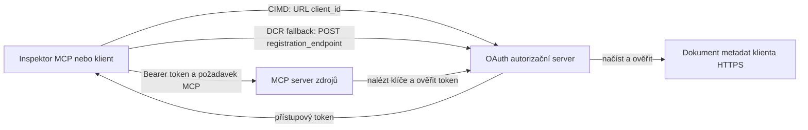

# Ukázka autorizace CIMD a DCR

Tento příklad v TypeScriptu porovnává dva způsoby, jak klient OAuth může získat identitu
před přístupem k chráněnému MCP serveru:

- **Client ID Metadata Documents (CIMD)** používají stabilní HTTPS URL jako
  `client_id`. Toto je preferovaný mechanismus pro klienty a autorizační
  servery, které nemají předchozí vztah.
- **Dynamic Client Registration (DCR)** žádá autorizační server o vytvoření
  neprůhledného client ID za běhu. MCP `2026-07-28` zachovává DCR pouze pro zpětnou
  kompatibilitu.

Ukázka používá stabilní MCP TypeScript SDK v2 a stavový
MCP `2026-07-28` model požadavků. Funguje s externím OAuth 2.1/OpenID
Connect autorizačním serverem, například Auth0. MCP server je resource
server: ověřuje přístupové tokeny, ale neověřuje uživatele ani nevydává
tokeny.

## Výukové cíle

Po dokončení tohoto příkladu budete schopni:

- Vysvětlit, proč je CIMD preferováno před DCR pro nové MCP klienty.
- Publikovat platný CIMD dokument pro veřejného nativního klienta.
- Nakonfigurovat MCP resource server pro OAuth discovery a validaci JWT.
- Vyzkoušet CIMD a DCR se stejným MCP serverem a autorizačním serverem.
- Vynutit OAuth scope v MCP nástroji.
- Identifikovat, které odpovědnosti patří klientovi, resource serveru a
  autorizačnímu serveru.

## Architektura



Autorizační server vybírá a ověřuje registrační mechanismus.
MCP server vidí pouze výslednou ověřenou deklaraci `client_id`. HTTPS URL
s cestou identifikuje CIMD. Neprůhledné ID nestačí k prokázání DCR, protože
předregistrovaný klient může také použít neprůhledné ID; volitelné
nastavení `DCR_CLIENT_ID_PREFIX` poskytuje specifický demonstrační tip poskytovatele.

## Priorita registrace

MCP klienti, kteří podporují všechny mechanismy, by měli používat tento pořádek:

1. Použijte předregistrované informace o klientovi, pokud jsou již dostupné.
2. Použijte CIMD, pokud autorizační server inzeruje
   `client_id_metadata_document_supported: true`.
3. Použijte DCR jen jako záložní možnost, když server inzeruje
   `registration_endpoint`.
4. Požádejte uživatele o předregistrované informace o klientovi, pokud žádná z výše uvedených možností není
   dostupná.

## Rozložení projektu

```text
src/
  config.ts          Environment validation
  dcr.ts             DCR compatibility request
  mcp.ts             MCP tools and scope checks
  oauth.ts           Authorization metadata and JWT verification
  register-dcr.ts    DCR command-line helper
  registration.ts    CIMD document and mechanism classification
  server.ts          Express, OAuth discovery, and MCP endpoint
test/
  dcr.test.ts
  oauth.test.ts
  registration.test.ts
  server.test.ts
```

## Požadavky

- Node.js 20.6 nebo novější. Skripty používají `--env-file` a `--import`.
- OAuth 2.1/OpenID Connect autorizační server podporující:
  - Autorizační kódové flow s S256 PKCE.
  - OAuth Protected Resource Metadata a Resource Indicators.
  - JWT přístupové tokeny a JWKS endpoint.
  - CIMD, plus DCR pokud chcete porovnat legacy fallback.
- MCP Inspector nebo jiný MCP `2026-07-28` klient.
- Veřejná HTTPS URL pro CIMD dokument. Pro laboratoř je vhodný vývojový tunel;
  pro produkci používejte stabilní doménu.

## Instalace a testování

```bash
npm install
npm run build
npm test
```

Dvanáct testů používá lokální klíče a mock HTTP endpointy. Nepotřebují
účet autorizačního serveru. Ověřují:

- Tvary CIMD dokumentu a omezení URL.
- Upřímnou klasifikaci URL a neprůhledných client ID.
- Zpracování požadavků a odpovědí DCR.
- Odmítnutí nebezpečných DCR endpointů mimo loopback.
- Validaci JWT podpisu, vydavatele, publika, expirace, client ID a scope.
- Interní MCP `2026-07-28` volání `registration-info`.

## Konfigurace autorizačního serveru

Přesné názvy ovládání se liší podle poskytovatele. Nakonfigurujte tyto schopnosti:

1. Vytvořte API nebo resource server, jehož identifikátor přesně odpovídá
   MCP URL, včetně `/mcp`, například `http://127.0.0.1:3001/mcp`.
2. Používejte RS256 access tokeny a zahrnujte deklaraci `client_id` nebo `azp`.
3. Přidejte oprávnění nebo scope `tool:greet`.
4. Povolit autorizační kódové flow s S256 PKCE pro veřejné nativní klienty.
5. Povolit Client ID Metadata Documents.
6. Pro porovnání povolit Dynamic Client Registration.
7. Zajistěte, aby meta data autorizačního serveru inzerovala:
   - `issuer`
   - `authorization_endpoint`
   - `token_endpoint`
   - `jwks_uri`
   - `client_id_metadata_document_supported: true`
   - `registration_endpoint` pokud je povolen DCR

### Příklad Auth0

Pro Auth0 povolte registraci Client ID Metadata Document, OIDC Dynamic
Application Registration a kompatibilitu s Resource Parameter. Vytvořte API,
jehož identifikátor je přesná MCP URL, a přidejte oprávnění `tool:greet`.
Umožněte testovacímu uživateli a třetím klientům požádat o toto oprávnění.

Dashboardy poskytovatelů a dostupnost funkcí se časem mění. Před použitím těchto nastavení mimo tuto laboratoř si ověřte
dokumentaci poskytovatele.

## Konfigurace příkladu

Vytvořte `.env` z příkladu:

```powershell
Copy-Item .env.example .env
```

V shellech kompatibilních s bashem:

```bash
cp .env.example .env
```

Nastavte tyto hodnoty:

```dotenv
MCP_SERVER_URL=http://127.0.0.1:3001/mcp
AUTHORIZATION_SERVER_ISSUER=https://your-tenant.example.com/
AUTHORIZATION_SERVER_METADATA_URL=https://your-tenant.example.com/.well-known/openid-configuration
CLIENT_METADATA_URL=https://your-public-host.example.com/client-metadata.json
OAUTH_REDIRECT_URIS=http://127.0.0.1:6274/oauth/callback
DCR_CLIENT_ID_PREFIX=tpc_
```

Důležité detaily:

- `AUTHORIZATION_SERVER_ISSUER` musí přesně odpovídat hodnotě `issuer` v
  objevených meta datech autorizačního serveru, včetně případného koncového lomítka.
- `MCP_SERVER_URL` musí odpovídat publiku přístupového tokenu.
- `CLIENT_METADATA_URL` musí používat HTTPS, obsahovat ne-kořenovou cestu a být
  veřejnou URL, která slouží metadatovou trasu. Dotazy a fragmenty jsou
  odmítnuty, aby trasa a `client_id` zůstaly shodné.
- `OAUTH_REDIRECT_URIS` je seznam povolených URI oddělených čárkou. Výchozí je MCP
  Inspector loopback callback.
- `DCR_CLIENT_ID_PREFIX` je volitelné a specifické pro poskytovatele. Nechte prázdné, pokud
  váš poskytovatel nemá spolehlivý DCR prefix.

## Publikujte CIMD dokument

Spusťte tunel, který přeposílá svou veřejnou HTTPS originu na `127.0.0.1:3001`.
Nastavte `CLIENT_METADATA_URL` na tuto originu plus `/client-metadata.json`, poté spusťte:

```bash
npm run build
npm start
```

Ověřte oba discovery dokumenty:

```bash
curl http://127.0.0.1:3001/health
curl http://127.0.0.1:3001/client-metadata.json
curl http://127.0.0.1:3001/.well-known/oauth-protected-resource/mcp
```

`client_id` vrácený veřejnou HTTPS metadata URL musí být byte-for-byte
identický s touto URL. Autorizační server musí validovat dokument a
jeho redirect URI před vydáním tokenu.

> [!NOTE]
> Tento příklad hostí klientský dokument i MCP resource server v jednom procesu,
> aby byla laboratoř malá. V produkci MCP klient vlastní a hostí svůj CIMD
> dokument nezávisle na resource serveru.

## Porovnání CIMD a DCR

Spusťte MCP Inspector:

```bash
npx @modelcontextprotocol/inspector
```

Používejte Streamable HTTP a připojte se na `http://127.0.0.1:3001/mcp`.

### CIMD (preferováno)

1. Zadejte veřejné `CLIENT_METADATA_URL` jako OAuth Client ID.
2. Požádejte o `tool:greet` plus jakékoliv identity scope požadované vaším poskytovatelem.
3. Dokončete přihlášení a souhlas.
4. Zavolejte `registration-info`. Vrátí `mechanism: "cimd"`.
5. Zavolejte `greet` pro ověření uplatnění scope.

### DCR (fallback kompatibility)

1. Vymažte uložený OAuth stav v Inspectoru.
2. Nechte OAuth Client ID prázdné, aby Inspector mohl použít inzerovaný
   `registration_endpoint`.
3. Dokončete přihlášení a souhlas.
4. Zavolejte `registration-info`.
5. Pokud `DCR_CLIENT_ID_PREFIX` odpovídá generovaným ID poskytovatele, nástroj
   oznámí `mechanism: "dcr"`; jinak správně oznámí
   `opaque-client-id`.

Můžete také přímo demonstrovat registrační požadavek:

```bash
npm run build
npm run register:dcr
```

Pomocník vypisuje vrácené client ID, ale nikdy nevypisuje client secret.
Jakýkoliv vrácený secret považujte za citlivý a ukládejte ho ve vhodném úložišti tajemství.

## Nástroje

| Nástroj | Požadovaný scope | Účel |
| --- | --- | --- |
| `registration-info` | Ověřený klient | Reportuje typ client ID |
| `greet` | `tool:greet` | Demonstruje autorizaci podle nástroje |

## Bezpečnostní poznámky

- Validujte JWT podpisy přes JWKS endpoint autorizačního serveru.
- Vyžadujte přesnou shodu vydavatele a publika.
- Vyžadujte platnost expirace a client ID v tvrzeních.
- Nikdy nepřijímejte token vydaný pro jiný resource.
- Token MCP nikdy nepředávejte do downstream API.
- Udržujte DCR přihlašovací údaje vázané na vydavatele, který je vytvořil.
- Validujte CIMD redirect URI přesnou shodou.
- Uplatněte SSRF kontroly, když autorizační server stahuje CIMD URL.
- Používejte HTTPS pro autorizační a metadata endpointy mimo loopback
  vývojové prostředí.
- Neodvozujte DCR z neprůhledného client ID, pokud poskytovatel nezdokumentuje
  spolehlivou konvenci identifikátorů.

## Odkazy

- [Specifikace MCP autorizace](https://modelcontextprotocol.io/specification/2026-07-28/basic/authorization)
- [Registrace MCP klientů](https://modelcontextprotocol.io/specification/2026-07-28/basic/authorization/client-registration)
- [Bezpečnostní nejlepší postupy MCP](https://modelcontextprotocol.io/specification/2026-07-28/basic/security_best_practices)
- [Průvodce autorizací MCP TypeScript SDK v2](https://ts.sdk.modelcontextprotocol.io/v2/serving/authorization)
- [OAuth Dynamic Client Registration (RFC 7591)](https://datatracker.ietf.org/doc/html/rfc7591)
- [OAuth Client ID Metadata Document draft](https://datatracker.ietf.org/doc/html/draft-ietf-oauth-client-id-metadata-document-00)

## Poděkování

Přístup vedle sebe byl inspirován
[Sambego/auth0-xmcp-cimd](https://github.com/Sambego/auth0-xmcp-cimd). Tento
příklad je originální, poskytovatelsky neutrální implementací vyvinutou s oficiálním
MCP TypeScript SDK v2 pro tento kurz.

---

<!-- CO-OP TRANSLATOR DISCLAIMER START -->
**Prohlášení o omezení odpovědnosti**:
Tento dokument byl přeložen pomocí AI překladatelské služby [Co-op Translator](https://github.com/Azure/co-op-translator). Přestože usilujeme o co největší přesnost, mějte prosím na paměti, že automatizované překlady mohou obsahovat chyby nebo nepřesnosti. Originální dokument v jeho mateřském jazyce by měl být považován za autoritativní zdroj. Pro kritické informace se doporučuje profesionální lidský překlad. Nejsme odpovědní za jakékoli nedorozumění nebo nesprávné interpretace vzniklé použitím tohoto překladu.
<!-- CO-OP TRANSLATOR DISCLAIMER END -->