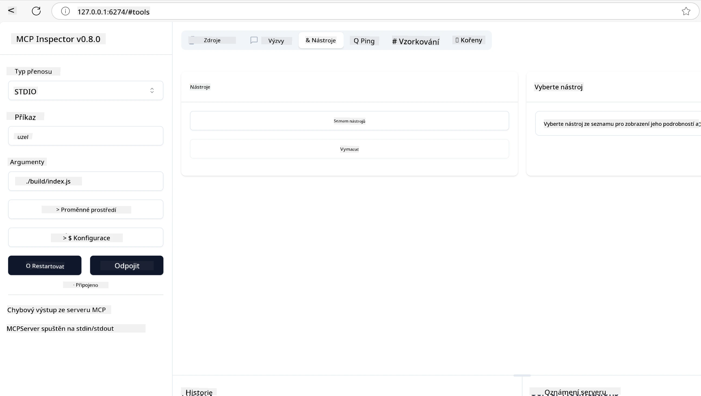
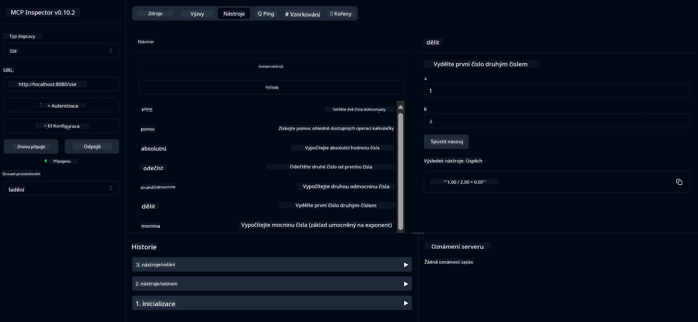
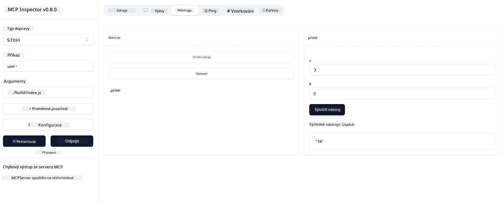

# Začínáme s MCP

> [!NOTE]
> Java HTTP příklad v této lekci používá zastaralý přenos HTTP+SSE a
> cílí na SDK kompatibilní s MCP `2025-11-25`. Pro nové vzdálené servery použijte
> přenos Streamable HTTP `2026-07-28` a ověřte podporu ve vašem SDK.

Vítejte při prvních krocích s Model Context Protocol (MCP)! Ať už jste v MCP noví nebo chcete prohloubit své znalosti, tento průvodce vás provede základním nastavením a vývojovým procesem. Objevíte, jak MCP umožňuje bezproblémovou integraci mezi AI modely a aplikacemi, a naučíte se rychle připravit své prostředí pro vytváření a testování řešení poháněných MCP.

> ZKRÁCENĚ; Pokud vytváříte AI aplikace, víte, že můžete přidávat nástroje a další zdroje do svého LLM (velkého jazykového modelu), aby byl LLM více znalý. Avšak pokud tyto nástroje a zdroje umístíte na server, schopnosti aplikace a serveru mohou využít jakýkoliv klient s/nebo bez LLM.

## Přehled

Tato lekce poskytuje praktické pokyny k nastavení MCP prostředí a vytváření vašich prvních MCP aplikací. Naučíte se, jak nastavit potřebné nástroje a frameworky, vytvořit základní MCP servery, vytvořit hostitelské aplikace a testovat vaše implementace.

Model Context Protocol (MCP) je otevřený protokol, který standardizuje způsob, jakým aplikace poskytují kontext LLM. MCP si můžete představit jako USB-C port pro AI aplikace – poskytuje standardizovaný způsob připojení AI modelů k různým zdrojům dat a nástrojům.

## Výukové cíle

Na konci této lekce budete schopni:

- Nastavit vývojová prostředí pro MCP v C#, Java, Python, TypeScript a Rust
- Vytvářet a nasazovat základní MCP servery s vlastními funkcemi (zdroje, výzvy a nástroje)
- Vytvářet hostitelské aplikace, které se připojují k MCP serverům
- Testovat a debugovat implementace MCP

## Nastavení vašeho MCP prostředí

Před začátkem práce s MCP je důležité připravit vaše vývojové prostředí a porozumět základnímu pracovnímu postupu. V této části vás provedeme úvodními kroky nastavení, aby start s MCP byl hladký.

### Předpoklady

Před ponořením do vývoje MCP zajistěte, že máte:

- **Vývojové prostředí**: Pro zvolený jazyk (C#, Java, Python, TypeScript nebo Rust)
- **IDE/Editor**: Visual Studio, Visual Studio Code, IntelliJ, Eclipse, PyCharm nebo jakýkoli moderní editor kódu
- **Správce balíčků**: NuGet, Maven/Gradle, pip, npm/yarn nebo Cargo
- **API klíče**: Pro kterékoliv AI služby, které plánujete používat ve vašich hostitelských aplikacích

## Základní struktura MCP serveru

MCP server obvykle obsahuje:

- **Konfigurace serveru**: Nastavení portu, autentizace a dalších parametrů
- **Zdroje**: Data a kontext dostupný LLM
- **Nástroje**: Funkce, které modely mohou volat
- **Výzvy**: Šablony pro generování nebo strukturování textu

Zde je zjednodušený příklad v TypeScriptu:

```typescript
import { McpServer, ResourceTemplate } from "@modelcontextprotocol/sdk/server/mcp.js";
import { StdioServerTransport } from "@modelcontextprotocol/sdk/server/stdio.js";
import { z } from "zod";

// Vytvořit MCP server
const server = new McpServer({
  name: "Demo",
  version: "1.0.0"
});

// Přidat nástroj pro sčítání
server.tool("add",
  { a: z.number(), b: z.number() },
  async ({ a, b }) => ({
    content: [{ type: "text", text: String(a + b) }]
  })
);

// Přidat dynamický zdroj pozdravu
server.resource(
  "file",
  // Parametr 'list' řídí, jak zdroj vypisuje dostupné soubory. Nastavení na undefined zakáže vypisování pro tento zdroj.
  new ResourceTemplate("file://{path}", { list: undefined }),
  async (uri, { path }) => ({
    contents: [{
      uri: uri.href,
      text: `File, ${path}!`
    }]
  })
);

// Přidat souborový zdroj, který čte obsah souboru
server.resource(
  "file",
  new ResourceTemplate("file://{path}", { list: undefined }),
  async (uri, { path }) => {
    let text;
    try {
      text = await fs.readFile(path, "utf8");
    } catch (err) {
      text = `Error reading file: ${err.message}`;
    }
    return {
      contents: [{
        uri: uri.href,
        text
      }]
    };
  }
);

server.prompt(
  "review-code",
  { code: z.string() },
  ({ code }) => ({
    messages: [{
      role: "user",
      content: {
        type: "text",
        text: `Please review this code:\n\n${code}`
      }
    }]
  })
);

// Začít přijímat zprávy na stdin a posílat zprávy na stdout
const transport = new StdioServerTransport();
await server.connect(transport);
```

V předešlém kódu jsme:

- Importovali potřebné třídy z MCP TypeScript SDK.
- Vytvořili a nakonfigurovali novou instanci MCP serveru.
- Zaregistrovali vlastní nástroj (`calculator`) s handler funkcí.
- Spustili server, aby poslouchal příchozí MCP požadavky.

## Testování a ladění

Před začátkem testování MCP serveru je důležité pochopit dostupné nástroje a nejlepší postupy ladění. Efektivní testování zajišťuje, že server funguje podle očekávání a pomáhá rychle identifikovat a řešit problémy. Následující část představuje doporučené přístupy k ověřování implementace MCP.

MCP poskytuje nástroje, které vám pomohou testovat a ladit vaše servery:

- **Nástroj Inspector**, tento grafický interface umožňuje připojit se k serveru a testovat nástroje, výzvy a zdroje.
- **curl**, můžete se také připojit k serveru pomocí příkazového nástroje jako curl nebo jiných klientů, kteří mohou vytvářet a spouštět HTTP příkazy.

### Použití MCP Inspectoru

[MCP Inspector](https://github.com/modelcontextprotocol/inspector) je vizuální testovací nástroj, který vám pomáhá:

1. **Objevovat schopnosti serveru**: Automaticky detekovat dostupné zdroje, nástroje a výzvy
2. **Testovat vykonávání nástrojů**: Vyzkoušet různé parametry a vidět odpovědi v reálném čase
3. **Prohlížet metadata serveru**: Zkoumat informace o serveru, schémata a konfigurace

```bash
# příklad TypeScript, instalace a spuštění MCP Inspektoru
npx @modelcontextprotocol/inspector node build/index.js
```

Když spustíte výše uvedené příkazy, MCP Inspector otevře lokální webové rozhraní ve vašem prohlížeči. Můžete očekávat dashboard zobrazující vaše registrované MCP servery, jejich dostupné nástroje, zdroje a výzvy. Rozhraní umožňuje interaktivně testovat vykonávání nástrojů, prohlížet metadata serveru a sledovat odpovědi v reálném čase, což usnadňuje ověřování a ladění implementací MCP serveru.

Zde je screenshot, jak by to mohlo vypadat:



## Běžné problémy při nastavování a řešení

| Problém | Možné řešení |
|--------|--------------|
| Připojení odmítnuto | Zkontrolujte, zda server běží a zda je port správný |
| Chyby při vykonávání nástroje | Zkontrolujte validaci parametrů a chybové ošetření |
| Selhání autentizace | Ověřte API klíče a oprávnění |
| Chyby validace schématu | Ujistěte se, že parametry odpovídají definovanému schématu |
| Server se nespouští | Zkontrolujte konflikt portů nebo chybějící závislosti |
| Chyby CORS | Nakonfigurujte správné CORS hlavičky pro cross-origin požadavky |
| Problémy s autentizací | Ověřte platnost tokenu a oprávnění |

## Místní vývoj

Pro místní vývoj a testování můžete spouštět MCP servery přímo na svém počítači:

1. **Spusťte proces serveru**: Spusťte svou MCP serverovou aplikaci
2. **Nastavte síťování**: Zajistěte, aby byl server dostupný na očekávaném portu
3. **Připojte klienty**: Použijte lokální připojovací URL jako `http://localhost:3000`

```bash
# Příklad: Spuštění TypeScript MCP serveru lokálně
npm run start
# Server běží na http://localhost:3000
```

## Vytvoření vašeho prvního MCP serveru

Probrali jsme [Jádrové koncepty](../../01-CoreConcepts/README.md) v předchozí lekci, nyní je čas využít tyto znalosti v praxi.

### Co server může dělat

Než začneme psát kód, připomeňme si, co všechno může server dělat:

MCP server může například:

- Přistupovat k lokálním souborům a databázím
- Připojovat se ke vzdáleným API
- Provádět výpočty
- Integrovat se s dalšími nástroji a službami
- Poskytovat uživatelské rozhraní pro interakci

Skvěle, nyní když víme, co pro něj můžeme udělat, pojďme začít kódovat.

## Cvičení: Vytvoření serveru

Pro vytvoření serveru je potřeba dodržet tyto kroky:

- Nainstalovat MCP SDK.
- Vytvořit projekt a nastavit jeho strukturu.
- Napsat kód serveru.
- Otestovat server.

### -1- Vytvoření projektu

#### TypeScript

```sh
# Vytvořte adresář projektu a inicializujte npm projekt
mkdir calculator-server
cd calculator-server
npm init -y
```

#### Python

```sh
# Vytvořte adresář projektu
mkdir calculator-server
cd calculator-server
# Otevřete složku ve Visual Studio Code – přeskočte, pokud používáte jiné IDE
code .
```

#### .NET

```sh
dotnet new console -n McpCalculatorServer
cd McpCalculatorServer
```

#### Java

Pro Javu vytvořte projekt Spring Boot:

```bash
curl https://start.spring.io/starter.zip \
  -d dependencies=web \
  -d javaVersion=21 \
  -d type=maven-project \
  -d groupId=com.example \
  -d artifactId=calculator-server \
  -d name=McpServer \
  -d packageName=com.microsoft.mcp.sample.server \
  -o calculator-server.zip
```

Rozbalte zip soubor:

```bash
unzip calculator-server.zip -d calculator-server
cd calculator-server
# volitelně odeberte nepoužitý test
rm -rf src/test/java
```

Přidejte následující kompletní konfiguraci do souboru *pom.xml*:

```xml
<?xml version="1.0" encoding="UTF-8"?>
<project xmlns="http://maven.apache.org/POM/4.0.0"
    xmlns:xsi="http://www.w3.org/2001/XMLSchema-instance"
    xsi:schemaLocation="http://maven.apache.org/POM/4.0.0 http://maven.apache.org/xsd/maven-4.0.0.xsd">
    <modelVersion>4.0.0</modelVersion>
    
    <!-- Spring Boot parent for dependency management -->
    <parent>
        <groupId>org.springframework.boot</groupId>
        <artifactId>spring-boot-starter-parent</artifactId>
        <version>3.5.0</version>
        <relativePath />
    </parent>

    <!-- Project coordinates -->
    <groupId>com.example</groupId>
    <artifactId>calculator-server</artifactId>
    <version>0.0.1-SNAPSHOT</version>
    <name>Calculator Server</name>
    <description>Basic calculator MCP service for beginners</description>

    <!-- Properties -->
    <properties>
        <java.version>21</java.version>
        <maven.compiler.source>21</maven.compiler.source>
        <maven.compiler.target>21</maven.compiler.target>
    </properties>

    <!-- Spring AI BOM for version management -->
    <dependencyManagement>
        <dependencies>
            <dependency>
                <groupId>org.springframework.ai</groupId>
                <artifactId>spring-ai-bom</artifactId>
                <version>1.0.0-SNAPSHOT</version>
                <type>pom</type>
                <scope>import</scope>
            </dependency>
        </dependencies>
    </dependencyManagement>

    <!-- Dependencies -->
    <dependencies>
        <dependency>
            <groupId>org.springframework.ai</groupId>
            <artifactId>spring-ai-starter-mcp-server-webflux</artifactId>
        </dependency>
        <dependency>
            <groupId>org.springframework.boot</groupId>
            <artifactId>spring-boot-starter-actuator</artifactId>
        </dependency>
        <dependency>
         <groupId>org.springframework.boot</groupId>
         <artifactId>spring-boot-starter-test</artifactId>
         <scope>test</scope>
      </dependency>
    </dependencies>

    <!-- Build configuration -->
    <build>
        <plugins>
            <plugin>
                <groupId>org.springframework.boot</groupId>
                <artifactId>spring-boot-maven-plugin</artifactId>
            </plugin>
            <plugin>
                <groupId>org.apache.maven.plugins</groupId>
                <artifactId>maven-compiler-plugin</artifactId>
                <configuration>
                    <release>21</release>
                </configuration>
            </plugin>
        </plugins>
    </build>

    <!-- Repositories for Spring AI snapshots -->
    <repositories>
        <repository>
            <id>spring-milestones</id>
            <name>Spring Milestones</name>
            <url>https://repo.spring.io/milestone</url>
            <snapshots>
                <enabled>false</enabled>
            </snapshots>
        </repository>
        <repository>
            <id>spring-snapshots</id>
            <name>Spring Snapshots</name>
            <url>https://repo.spring.io/snapshot</url>
            <releases>
                <enabled>false</enabled>
            </releases>
        </repository>
    </repositories>
</project>
```

#### Rust

```sh
mkdir calculator-server
cd calculator-server
cargo init
```

### -2- Přidání závislostí

Nyní, když máte vytvořený projekt, přidejme závislosti:

#### TypeScript

```sh
# Pokud ještě není nainstalován, nainstalujte TypeScript globálně
npm install typescript -g

# Nainstalujte MCP SDK a Zod pro validaci schémat
npm install @modelcontextprotocol/sdk zod
npm install -D @types/node typescript
```

#### Python

```sh
# Vytvořte virtuální prostředí a nainstalujte závislosti
python -m venv venv
venv\Scripts\activate
pip install "mcp[cli]"
```

#### Java

```bash
cd calculator-server
./mvnw clean install -DskipTests
```

#### Rust

```sh
cargo add rmcp --features server,transport-io
cargo add serde
cargo add tokio --features rt-multi-thread
```

### -3- Vytvoření souborů projektu

#### TypeScript

Otevřete soubor *package.json* a nahraďte jeho obsah následujícím pro zajištění možnosti buildu a spuštění serveru:

```json
{
  "name": "calculator-server",
  "version": "1.0.0",
  "main": "index.js",
  "type": "module",
  "scripts": {
    "build": "tsc",
    "start": "npm run build && node ./build/index.js",
  },
  "keywords": [],
  "author": "",
  "license": "ISC",
  "description": "A simple calculator server using Model Context Protocol",
  "dependencies": {
    "@modelcontextprotocol/sdk": "^1.16.0",
    "zod": "^3.25.76"
  },
  "devDependencies": {
    "@types/node": "^24.0.14",
    "typescript": "^5.8.3"
  }
}
```

Vytvořte *tsconfig.json* se následujícím obsahem:

```json
{
  "compilerOptions": {
    "target": "ES2022",
    "module": "Node16",
    "moduleResolution": "Node16",
    "outDir": "./build",
    "rootDir": "./src",
    "strict": true,
    "esModuleInterop": true,
    "skipLibCheck": true,
    "forceConsistentCasingInFileNames": true
  },
  "include": ["src/**/*"],
  "exclude": ["node_modules"]
}
```

Vytvořte adresář pro váš zdrojový kód:

```sh
mkdir src
touch src/index.ts
```

#### Python

Vytvořte soubor *server.py*

```sh
touch server.py
```

#### .NET

Nainstalujte požadované NuGet balíčky:

```sh
dotnet add package ModelContextProtocol --prerelease
dotnet add package Microsoft.Extensions.Hosting
```

#### Java

Pro Java Spring Boot projekty se struktura projektu vytváří automaticky.

#### Rust

Pro Rust je výchozí soubor *src/main.rs* vytvořen při spuštění `cargo init`. Otevřete soubor a smažte výchozí kód.

### -4- Vytvoření kódu serveru

#### TypeScript

Vytvořte soubor *index.ts* a přidejte následující kód:

```typescript
import { McpServer, ResourceTemplate } from "@modelcontextprotocol/sdk/server/mcp.js";
import { StdioServerTransport } from "@modelcontextprotocol/sdk/server/stdio.js";
import { z } from "zod";
 
// Vytvořit MCP server
const server = new McpServer({
  name: "Calculator MCP Server",
  version: "1.0.0"
});
```

Nyní máte server, ale moc toho nedělá, pojďme to opravit.

#### Python

```python
# server.py
from mcp.server.fastmcp import FastMCP

# Vytvořit MCP server
mcp = FastMCP("Demo")
```

#### .NET

```csharp
using Microsoft.Extensions.DependencyInjection;
using Microsoft.Extensions.Hosting;
using Microsoft.Extensions.Logging;
using ModelContextProtocol.Server;
using System.ComponentModel;

var builder = Host.CreateApplicationBuilder(args);
builder.Logging.AddConsole(consoleLogOptions =>
{
    // Configure all logs to go to stderr
    consoleLogOptions.LogToStandardErrorThreshold = LogLevel.Trace;
});

builder.Services
    .AddMcpServer()
    .WithStdioServerTransport()
    .WithToolsFromAssembly();
await builder.Build().RunAsync();

// add features
```

#### Java

Pro Javu vytvořte hlavní serverové komponenty. Nejprve upravte hlavní třídu aplikace:

*src/main/java/com/microsoft/mcp/sample/server/McpServerApplication.java*:

```java
package com.microsoft.mcp.sample.server;

import org.springframework.ai.tool.ToolCallbackProvider;
import org.springframework.ai.tool.method.MethodToolCallbackProvider;
import org.springframework.boot.SpringApplication;
import org.springframework.boot.autoconfigure.SpringBootApplication;
import org.springframework.context.annotation.Bean;
import com.microsoft.mcp.sample.server.service.CalculatorService;

@SpringBootApplication
public class McpServerApplication {

    public static void main(String[] args) {
        SpringApplication.run(McpServerApplication.class, args);
    }
    
    @Bean
    public ToolCallbackProvider calculatorTools(CalculatorService calculator) {
        return MethodToolCallbackProvider.builder().toolObjects(calculator).build();
    }
}
```

Vytvořte službu kalkulačky *src/main/java/com/microsoft/mcp/sample/server/service/CalculatorService.java*:

```java
package com.microsoft.mcp.sample.server.service;

import org.springframework.ai.tool.annotation.Tool;
import org.springframework.stereotype.Service;

/**
 * Service for basic calculator operations.
 * This service provides simple calculator functionality through MCP.
 */
@Service
public class CalculatorService {

    /**
     * Add two numbers
     * @param a The first number
     * @param b The second number
     * @return The sum of the two numbers
     */
    @Tool(description = "Add two numbers together")
    public String add(double a, double b) {
        double result = a + b;
        return formatResult(a, "+", b, result);
    }

    /**
     * Subtract one number from another
     * @param a The number to subtract from
     * @param b The number to subtract
     * @return The result of the subtraction
     */
    @Tool(description = "Subtract the second number from the first number")
    public String subtract(double a, double b) {
        double result = a - b;
        return formatResult(a, "-", b, result);
    }

    /**
     * Multiply two numbers
     * @param a The first number
     * @param b The second number
     * @return The product of the two numbers
     */
    @Tool(description = "Multiply two numbers together")
    public String multiply(double a, double b) {
        double result = a * b;
        return formatResult(a, "*", b, result);
    }

    /**
     * Divide one number by another
     * @param a The numerator
     * @param b The denominator
     * @return The result of the division
     */
    @Tool(description = "Divide the first number by the second number")
    public String divide(double a, double b) {
        if (b == 0) {
            return "Error: Cannot divide by zero";
        }
        double result = a / b;
        return formatResult(a, "/", b, result);
    }

    /**
     * Calculate the power of a number
     * @param base The base number
     * @param exponent The exponent
     * @return The result of raising the base to the exponent
     */
    @Tool(description = "Calculate the power of a number (base raised to an exponent)")
    public String power(double base, double exponent) {
        double result = Math.pow(base, exponent);
        return formatResult(base, "^", exponent, result);
    }

    /**
     * Calculate the square root of a number
     * @param number The number to find the square root of
     * @return The square root of the number
     */
    @Tool(description = "Calculate the square root of a number")
    public String squareRoot(double number) {
        if (number < 0) {
            return "Error: Cannot calculate square root of a negative number";
        }
        double result = Math.sqrt(number);
        return String.format("√%.2f = %.2f", number, result);
    }

    /**
     * Calculate the modulus (remainder) of division
     * @param a The dividend
     * @param b The divisor
     * @return The remainder of the division
     */
    @Tool(description = "Calculate the remainder when one number is divided by another")
    public String modulus(double a, double b) {
        if (b == 0) {
            return "Error: Cannot divide by zero";
        }
        double result = a % b;
        return formatResult(a, "%", b, result);
    }

    /**
     * Calculate the absolute value of a number
     * @param number The number to find the absolute value of
     * @return The absolute value of the number
     */
    @Tool(description = "Calculate the absolute value of a number")
    public String absolute(double number) {
        double result = Math.abs(number);
        return String.format("|%.2f| = %.2f", number, result);
    }

    /**
     * Get help about available calculator operations
     * @return Information about available operations
     */
    @Tool(description = "Get help about available calculator operations")
    public String help() {
        return "Basic Calculator MCP Service\n\n" +
               "Available operations:\n" +
               "1. add(a, b) - Adds two numbers\n" +
               "2. subtract(a, b) - Subtracts the second number from the first\n" +
               "3. multiply(a, b) - Multiplies two numbers\n" +
               "4. divide(a, b) - Divides the first number by the second\n" +
               "5. power(base, exponent) - Raises a number to a power\n" +
               "6. squareRoot(number) - Calculates the square root\n" + 
               "7. modulus(a, b) - Calculates the remainder of division\n" +
               "8. absolute(number) - Calculates the absolute value\n\n" +
               "Example usage: add(5, 3) will return 5 + 3 = 8";
    }

    /**
     * Format the result of a calculation
     */
    private String formatResult(double a, String operator, double b, double result) {
        return String.format("%.2f %s %.2f = %.2f", a, operator, b, result);
    }
}
```

**Volitelné komponenty pro produkčně připravenou službu:**

Vytvořte startup konfiguraci *src/main/java/com/microsoft/mcp/sample/server/config/StartupConfig.java*:

```java
package com.microsoft.mcp.sample.server.config;

import org.springframework.boot.CommandLineRunner;
import org.springframework.context.annotation.Bean;
import org.springframework.context.annotation.Configuration;

@Configuration
public class StartupConfig {
    
    @Bean
    public CommandLineRunner startupInfo() {
        return args -> {
            System.out.println("\n" + "=".repeat(60));
            System.out.println("Calculator MCP Server is starting...");
            System.out.println("SSE endpoint: http://localhost:8080/sse");
            System.out.println("Health check: http://localhost:8080/actuator/health");
            System.out.println("=".repeat(60) + "\n");
        };
    }
}
```

Vytvořte health kontroler *src/main/java/com/microsoft/mcp/sample/server/controller/HealthController.java*:

```java
package com.microsoft.mcp.sample.server.controller;

import org.springframework.http.ResponseEntity;
import org.springframework.web.bind.annotation.GetMapping;
import org.springframework.web.bind.annotation.RestController;
import java.time.LocalDateTime;
import java.util.HashMap;
import java.util.Map;

@RestController
public class HealthController {
    
    @GetMapping("/health")
    public ResponseEntity<Map<String, Object>> healthCheck() {
        Map<String, Object> response = new HashMap<>();
        response.put("status", "UP");
        response.put("timestamp", LocalDateTime.now().toString());
        response.put("service", "Calculator MCP Server");
        return ResponseEntity.ok(response);
    }
}
```

Vytvořte handler výjimek *src/main/java/com/microsoft/mcp/sample/server/exception/GlobalExceptionHandler.java*:

```java
package com.microsoft.mcp.sample.server.exception;

import org.springframework.http.HttpStatus;
import org.springframework.http.ResponseEntity;
import org.springframework.web.bind.annotation.ExceptionHandler;
import org.springframework.web.bind.annotation.RestControllerAdvice;

@RestControllerAdvice
public class GlobalExceptionHandler {

    @ExceptionHandler(IllegalArgumentException.class)
    public ResponseEntity<ErrorResponse> handleIllegalArgumentException(IllegalArgumentException ex) {
        ErrorResponse error = new ErrorResponse(
            "Invalid_Input", 
            "Invalid input parameter: " + ex.getMessage());
        return new ResponseEntity<>(error, HttpStatus.BAD_REQUEST);
    }

    public static class ErrorResponse {
        private String code;
        private String message;

        public ErrorResponse(String code, String message) {
            this.code = code;
            this.message = message;
        }

        // Gettery
        public String getCode() { return code; }
        public String getMessage() { return message; }
    }
}
```

Vytvořte vlastní banner *src/main/resources/banner.txt*:

```text
_____      _            _       _             
 / ____|    | |          | |     | |            
| |     __ _| | ___ _   _| | __ _| |_ ___  _ __ 
| |    / _` | |/ __| | | | |/ _` | __/ _ \| '__|
| |___| (_| | | (__| |_| | | (_| | || (_) | |   
 \_____\__,_|_|\___|\__,_|_|\__,_|\__\___/|_|   
                                                
Calculator MCP Server v1.0
Spring Boot MCP Application
```

</details>

#### Rust

Přidejte následující kód na začátek souboru *src/main.rs*. Tento kód importuje potřebné knihovny a moduly pro váš MCP server.

```rust
use rmcp::{
    handler::server::{router::tool::ToolRouter, tool::Parameters},
    model::{ServerCapabilities, ServerInfo},
    schemars, tool, tool_handler, tool_router,
    transport::stdio,
    ServerHandler, ServiceExt,
};
use std::error::Error;
```

Kalkulační server bude jednoduchý server, který umí sčítat dvě čísla. Vytvořme struct reprezentující kalkulační požadavek.

```rust
#[derive(Debug, serde::Deserialize, schemars::JsonSchema)]
pub struct CalculatorRequest {
    pub a: f64,
    pub b: f64,
}
```

Dále vytvořte struct reprezentující kalkulační server. Tento struct bude držet nástrojový router, který slouží k registraci nástrojů.

```rust
#[derive(Debug, Clone)]
pub struct Calculator {
    tool_router: ToolRouter<Self>,
}
```

Nyní implementujeme struct `Calculator`, který vytvoří novou instanci serveru a implementuje serverový handler pro poskytování informací o serveru.

```rust
#[tool_router]
impl Calculator {
    pub fn new() -> Self {
        Self {
            tool_router: Self::tool_router(),
        }
    }
}

#[tool_handler]
impl ServerHandler for Calculator {
    fn get_info(&self) -> ServerInfo {
        ServerInfo {
            instructions: Some("A simple calculator tool".into()),
            capabilities: ServerCapabilities::builder().enable_tools().build(),
            ..Default::default()
        }
    }
}
```

Nakonec implementujte hlavní funkci, která spustí server. Tato funkce vytvoří instanci struktury `Calculator` a bude ji obsluhovat přes standardní vstup/výstup.

```rust
#[tokio::main]
async fn main() -> Result<(), Box<dyn Error>> {
    let service = Calculator::new().serve(stdio()).await?;
    service.waiting().await?;
    Ok(())
}
```

Server je nyní nastaven na poskytování základních informací o sobě samém. Dále přidáme nástroj pro vykonávání sčítání.

### -5- Přidání nástroje a zdroje

Přidejte nástroj a zdroj přidáním následujícího kódu:

#### TypeScript

```typescript
server.tool(
  "add",
  { a: z.number(), b: z.number() },
  async ({ a, b }) => ({
    content: [{ type: "text", text: String(a + b) }]
  })
);

server.resource(
  "greeting",
  new ResourceTemplate("greeting://{name}", { list: undefined }),
  async (uri, { name }) => ({
    contents: [{
      uri: uri.href,
      text: `Hello, ${name}!`
    }]
  })
);
```

Váš nástroj přijímá parametry `a` a `b` a provádí funkci, která generuje odpověď ve formátu:

```typescript
{
  contents: [{
    type: "text", content: "some content"
  }]
}
```

Váš zdroj je přístupný přes řetězec "greeting", přijímá parametr `name` a produkuje podobnou odpověď jako nástroj:

```typescript
{
  uri: "<href>",
  text: "a text"
}
```

#### Python

```python
# Přidat nástroj pro sčítání
@mcp.tool()
def add(a: int, b: int) -> int:
    """Add two numbers"""
    return a + b


# Přidat zdroj pro dynamické pozdravy
@mcp.resource("greeting://{name}")
def get_greeting(name: str) -> str:
    """Get a personalized greeting"""
    return f"Hello, {name}!"
```

V předešlém kódu jsme:

- Definovali nástroj `add`, který přijímá parametry `a` a `b`, oba celá čísla.
- Vytvořili zdroj `greeting`, který přijímá parametr `name`.

#### .NET

Přidejte toto do svého souboru Program.cs:

```csharp
[McpServerToolType]
public static class CalculatorTool
{
    [McpServerTool, Description("Adds two numbers")]
    public static string Add(int a, int b) => $"Sum {a + b}";
}
```

#### Java

Nástroje byly vytvořeny již v předchozím kroku.

#### Rust

Přidejte nový nástroj do bloku `impl Calculator`:

```rust
#[tool(description = "Adds a and b")]
async fn add(
    &self,
    Parameters(CalculatorRequest { a, b }): Parameters<CalculatorRequest>,
) -> String {
    (a + b).to_string()
}
```

### -6- Konečný kód

Přidejme poslední kód, který potřebujeme, aby se server mohl spustit:

#### TypeScript

```typescript
// Začněte přijímat zprávy na stdin a odesílat zprávy na stdout
const transport = new StdioServerTransport();
await server.connect(transport);
```

Zde je kompletní kód:

```typescript
// index.ts
import { McpServer, ResourceTemplate } from "@modelcontextprotocol/sdk/server/mcp.js";
import { StdioServerTransport } from "@modelcontextprotocol/sdk/server/stdio.js";
import { z } from "zod";

// Vytvořit MCP server
const server = new McpServer({
  name: "Calculator MCP Server",
  version: "1.0.0"
});

// Přidat nástroj pro sčítání
server.tool(
  "add",
  { a: z.number(), b: z.number() },
  async ({ a, b }) => ({
    content: [{ type: "text", text: String(a + b) }]
  })
);

// Přidat dynamický zdroj pozdravů
server.resource(
  "greeting",
  new ResourceTemplate("greeting://{name}", { list: undefined }),
  async (uri, { name }) => ({
    contents: [{
      uri: uri.href,
      text: `Hello, ${name}!`
    }]
  })
);

// Začít přijímat zprávy na stdin a odesílat zprávy na stdout
const transport = new StdioServerTransport();
server.connect(transport);
```

#### Python

```python
# server.py
from mcp.server.fastmcp import FastMCP

# Vytvořit MCP server
mcp = FastMCP("Demo")


# Přidat nástroj pro sčítání
@mcp.tool()
def add(a: int, b: int) -> int:
    """Add two numbers"""
    return a + b


# Přidat dynamický zdroj pozdravu
@mcp.resource("greeting://{name}")
def get_greeting(name: str) -> str:
    """Get a personalized greeting"""
    return f"Hello, {name}!"

# Hlavní blok spuštění - toto je nutné k běhu serveru
if __name__ == "__main__":
    mcp.run()
```

#### .NET

Vytvořte soubor Program.cs s následujícím obsahem:

```csharp
using Microsoft.Extensions.DependencyInjection;
using Microsoft.Extensions.Hosting;
using Microsoft.Extensions.Logging;
using ModelContextProtocol.Server;
using System.ComponentModel;

var builder = Host.CreateApplicationBuilder(args);
builder.Logging.AddConsole(consoleLogOptions =>
{
    // Configure all logs to go to stderr
    consoleLogOptions.LogToStandardErrorThreshold = LogLevel.Trace;
});

builder.Services
    .AddMcpServer()
    .WithStdioServerTransport()
    .WithToolsFromAssembly();
await builder.Build().RunAsync();

[McpServerToolType]
public static class CalculatorTool
{
    [McpServerTool, Description("Adds two numbers")]
    public static string Add(int a, int b) => $"Sum {a + b}";
}
```

#### Java

Vaše kompletní hlavní třída aplikace by měla vypadat takto:

```java
// McpServerApplication.java
package com.microsoft.mcp.sample.server;

import org.springframework.ai.tool.ToolCallbackProvider;
import org.springframework.ai.tool.method.MethodToolCallbackProvider;
import org.springframework.boot.SpringApplication;
import org.springframework.boot.autoconfigure.SpringBootApplication;
import org.springframework.context.annotation.Bean;
import com.microsoft.mcp.sample.server.service.CalculatorService;

@SpringBootApplication
public class McpServerApplication {

    public static void main(String[] args) {
        SpringApplication.run(McpServerApplication.class, args);
    }
    
    @Bean
    public ToolCallbackProvider calculatorTools(CalculatorService calculator) {
        return MethodToolCallbackProvider.builder().toolObjects(calculator).build();
    }
}
```

#### Rust

Konečný kód pro Rust server by měl vypadat takto:

```rust
use rmcp::{
    ServerHandler, ServiceExt,
    handler::server::{router::tool::ToolRouter, tool::Parameters},
    model::{ServerCapabilities, ServerInfo},
    schemars, tool, tool_handler, tool_router,
    transport::stdio,
};
use std::error::Error;

#[derive(Debug, serde::Deserialize, schemars::JsonSchema)]
pub struct CalculatorRequest {
    pub a: f64,
    pub b: f64,
}

#[derive(Debug, Clone)]
pub struct Calculator {
    tool_router: ToolRouter<Self>,
}

#[tool_router]
impl Calculator {
    pub fn new() -> Self {
        Self {
            tool_router: Self::tool_router(),
        }
    }
    
    #[tool(description = "Adds a and b")]
    async fn add(
        &self,
        Parameters(CalculatorRequest { a, b }): Parameters<CalculatorRequest>,
    ) -> String {
        (a + b).to_string()
    }
}

#[tool_handler]
impl ServerHandler for Calculator {
    fn get_info(&self) -> ServerInfo {
        ServerInfo {
            instructions: Some("A simple calculator tool".into()),
            capabilities: ServerCapabilities::builder().enable_tools().build(),
            ..Default::default()
        }
    }
}

#[tokio::main]
async fn main() -> Result<(), Box<dyn Error>> {
    let service = Calculator::new().serve(stdio()).await?;
    service.waiting().await?;
    Ok(())
}
```

### -7- Testování serveru

Spusťte server pomocí následujícího příkazu:

#### TypeScript

```sh
npm run build
```

#### Python

```sh
mcp run server.py
```

> Pro použití MCP Inspectoru použijte `mcp dev server.py`, který automaticky spustí Inspector a poskytne požadovaný token proxy session. Při použití `mcp run server.py` je nutné Inspector spustit manuálně a nakonfigurovat připojení.

#### .NET

Ujistěte se, že jste ve složce vašeho projektu:

```sh
cd McpCalculatorServer
dotnet run
```

#### Java

```bash
./mvnw clean install -DskipTests
java -jar target/calculator-server-0.0.1-SNAPSHOT.jar
```

#### Rust

Spusťte následující příkazy pro formátování a spuštění serveru:

```sh
cargo fmt
cargo run
```

### -8- Spuštění pomocí inspectoru

Inspector je skvělý nástroj, který může spustit váš server a umožní vám s ním interagovat, abyste mohli otestovat jeho funkčnost. Spusťme ho:

> [!NOTE]
> může to v poli "command" vypadat jinak, protože obsahuje příkaz pro spuštění serveru s vaším specifickým runtime/

#### TypeScript

```sh
npx @modelcontextprotocol/inspector node build/index.js
```

nebo jej přidejte do svého *package.json* takto: `"inspector": "npx @modelcontextprotocol/inspector node build/index.js"` a potom spusťte `npm run inspector`

#### Python

Python obaluje Node.js nástroj zvaný inspector. Tento nástroj je možné volat takto:

```sh
mcp dev server.py
```


Nicméně neimplementuje všechny metody dostupné na nástroji, proto se doporučuje spustit nástroj Node.js přímo, jak je uvedeno níže:

```sh
npx @modelcontextprotocol/inspector mcp run server.py
```

Pokud používáte nástroj nebo IDE, které umožňuje konfigurovat příkazy a argumenty pro spouštění skriptů, 
ujistěte se, že v poli `Command` je nastaveno `python` a jako `Arguments` `server.py`. To zajistí správný běh skriptu.

#### .NET

Ujistěte se, že jste ve složce svého projektu:

```sh
cd McpCalculatorServer
npx @modelcontextprotocol/inspector dotnet run
```

#### Java

Ujistěte se, že váš kalkulační server běží
Poté spusťte inspektor:

```cmd
npx @modelcontextprotocol/inspector
```

V inspektoru na webovém rozhraní:

1. Vyberte typ přenosu "SSE"
2. Nastavte URL na: `http://localhost:8080/sse`
3. Klikněte na "Connect"



**Nyní jste připojeni k serveru**
**Sekce testování Java serveru je nyní dokončena**

Další sekce se týká interakce se serverem.

Měli byste vidět následující uživatelské rozhraní:


1. Připojte se k serveru výběrem tlačítka Connect
  Po připojení byste měli vidět následující:

  

1. Vyberte "Tools" a "listTools", měla by se zobrazit volba "Add", vyberte "Add" a vyplňte hodnoty parametrů.

  Měli byste vidět následující odpověď, tj. výsledek nástroje "add":

  

Gratulujeme, podařilo se vám vytvořit a spustit váš první server!

#### Rust

Pro spuštění Rust serveru s MCP Inspector CLI použijte následující příkaz:

```sh
npx @modelcontextprotocol/inspector cargo run --cli --method tools/call --tool-name add --tool-arg a=1 b=2
```

### Oficiální SDK

MCP poskytuje oficiální SDK pro více jazyků:

- [C# SDK](https://github.com/modelcontextprotocol/csharp-sdk) - Udržováno ve spolupráci s Microsoftem
- [Java SDK](https://github.com/modelcontextprotocol/java-sdk) - Udržováno ve spolupráci se Spring AI
- [TypeScript SDK](https://github.com/modelcontextprotocol/typescript-sdk) - Oficiální implementace v TypeScriptu
- [Python SDK](https://github.com/modelcontextprotocol/python-sdk) - Oficiální implementace v Pythonu
- [Kotlin SDK](https://github.com/modelcontextprotocol/kotlin-sdk) - Oficiální implementace v Kotlinu
- [Swift SDK](https://github.com/modelcontextprotocol/swift-sdk) - Udržováno ve spolupráci s Loopwork AI
- [Rust SDK](https://github.com/modelcontextprotocol/rust-sdk) - Oficiální implementace v Rustu

## Klíčové poznatky

- Nastavení vývojového prostředí MCP je jednoduché s jazykově specifickými SDK
- Vytváření MCP serverů zahrnuje vytváření a registraci nástrojů s jasnými schématy
- Testování a ladění jsou nezbytné pro spolehlivé implementace MCP

## Ukázky

- [Java Calculator](../samples/java/calculator/README.md)
- [.NET Calculator](../../../../03-GettingStarted/samples/csharp)
- [JavaScript Calculator](../samples/javascript/README.md)
- [TypeScript Calculator](../samples/typescript/README.md)
- [Python Calculator](../../../../03-GettingStarted/samples/python)
- [Rust Calculator](../../../../03-GettingStarted/samples/rust)

## Zadání

Vytvořte jednoduchý MCP server s nástrojem dle vašeho výběru:

1. Implementujte nástroj ve svém preferovaném jazyce (.NET, Java, Python, TypeScript nebo Rust).
2. Definujte vstupní parametry a návratové hodnoty.
3. Spusťte inspektor, aby se ověřilo, že server funguje správně.
4. Otestujte implementaci s různými vstupy.

## Řešení

[Řešení](./solution/README.md)

## Další zdroje

- [Vytváření agentů pomocí Model Context Protocol na Azure](https://learn.microsoft.com/azure/developer/ai/intro-agents-mcp)
- [Vzdálené MCP s Azure Container Apps (Node.js/TypeScript/JavaScript)](https://learn.microsoft.com/samples/azure-samples/mcp-container-ts/mcp-container-ts/)
- [.NET OpenAI MCP Agent](https://learn.microsoft.com/samples/azure-samples/openai-mcp-agent-dotnet/openai-mcp-agent-dotnet/)

## Co dál

Dále: [Začínáme s MCP klienty](../02-client/README.md)

---

<!-- CO-OP TRANSLATOR DISCLAIMER START -->
**Prohlášení o omezení odpovědnosti**:
Tento dokument byl přeložen pomocí AI překladatelské služby [Co-op Translator](https://github.com/Azure/co-op-translator). Přestože usilujeme o co největší přesnost, mějte prosím na paměti, že automatizované překlady mohou obsahovat chyby nebo nepřesnosti. Originální dokument v jeho mateřském jazyce by měl být považován za autoritativní zdroj. Pro kritické informace se doporučuje profesionální lidský překlad. Nejsme odpovědní za jakékoli nedorozumění nebo nesprávné interpretace vzniklé použitím tohoto překladu.
<!-- CO-OP TRANSLATOR DISCLAIMER END -->