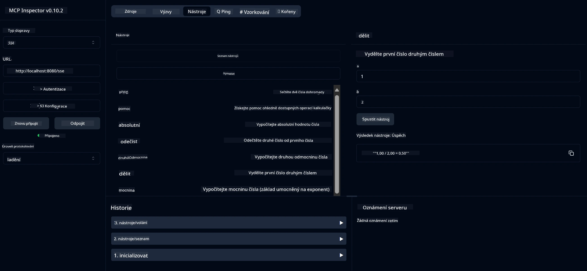

# Základní kalkulační služba MCP

> [!NOTE]
> Toto Java řešení používá starší přenos HTTP+SSE a cílí na SDK
> kompatibilní s MCP `2025-11-25`. Je zachováno pro shodu s učebním kódem;
> nové vzdálené servery by měly používat podporu Streamable HTTP `2026-07-28`.

Tato služba poskytuje základní kalkulační operace prostřednictvím Model Context Protocol (MCP) s využitím Spring Boot a transportu WebFlux. Je navržena jako jednoduchý příklad pro začátečníky, kteří se učí o implementacích MCP.

Pro více informací viz referenční dokumentaci [MCP Server Boot Starter](https://docs.spring.io/spring-ai/reference/api/mcp/mcp-server-boot-starter-docs.html).


## Použití služby

Služba zpřístupňuje následující API koncové body prostřednictvím protokolu MCP:

- `add(a, b)`: Sečte dvě čísla
- `subtract(a, b)`: Odečte druhé číslo od prvního
- `multiply(a, b)`: Vynásobí dvě čísla
- `divide(a, b)`: Vydělí první číslo druhým (s kontrolou nuly)
- `power(base, exponent)`: Vypočítá mocninu čísla
- `squareRoot(number)`: Vypočítá druhou odmocninu (s kontrolou záporného čísla)
- `modulus(a, b)`: Vypočítá zbytek po dělení
- `absolute(number)`: Vypočítá absolutní hodnotu

## Závislosti

Projekt vyžaduje následující klíčové závislosti:

```xml
<dependency>
    <groupId>org.springframework.ai</groupId>
    <artifactId>spring-ai-starter-mcp-server-webflux</artifactId>
</dependency>
```

## Sestavení projektu

Projekt sestavte pomocí Maven:
```bash
./mvnw clean install -DskipTests
```

## Spuštění serveru

### Použití Javy

```bash
java -jar target/calculator-server-0.0.1-SNAPSHOT.jar
```

### Použití MCP Inspector

MCP Inspector je užitečný nástroj pro interakci se službami MCP. Pro použití s touto kalkulační službou:

1. **Nainstalujte a spusťte MCP Inspector** v novém terminálovém okně:
   ```bash
   npx @modelcontextprotocol/inspector
   ```

2. **Přístup k webovému rozhraní** kliknutím na URL zobrazené aplikací (obvykle http://localhost:6274)

3. **Nastavte připojení**:
   - Nastavte typ transportu na "SSE"
   - Nastavte URL na SSE endpoint vašeho spuštěného serveru: `http://localhost:8080/sse`
   - Klikněte na "Connect"

4. **Použijte nástroje**:
   - Klikněte na "List Tools" pro zobrazení dostupných kalkulačních operací
   - Vyberte nástroj a klikněte na "Run Tool" pro provedení operace



---

<!-- CO-OP TRANSLATOR DISCLAIMER START -->
**Prohlášení o omezení odpovědnosti**:
Tento dokument byl přeložen pomocí AI překladatelské služby [Co-op Translator](https://github.com/Azure/co-op-translator). Přestože usilujeme o co největší přesnost, mějte prosím na paměti, že automatizované překlady mohou obsahovat chyby nebo nepřesnosti. Originální dokument v jeho mateřském jazyce by měl být považován za autoritativní zdroj. Pro kritické informace se doporučuje profesionální lidský překlad. Nejsme odpovědní za jakékoli nedorozumění nebo nesprávné interpretace vzniklé použitím tohoto překladu.
<!-- CO-OP TRANSLATOR DISCLAIMER END -->