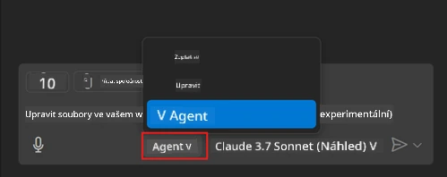
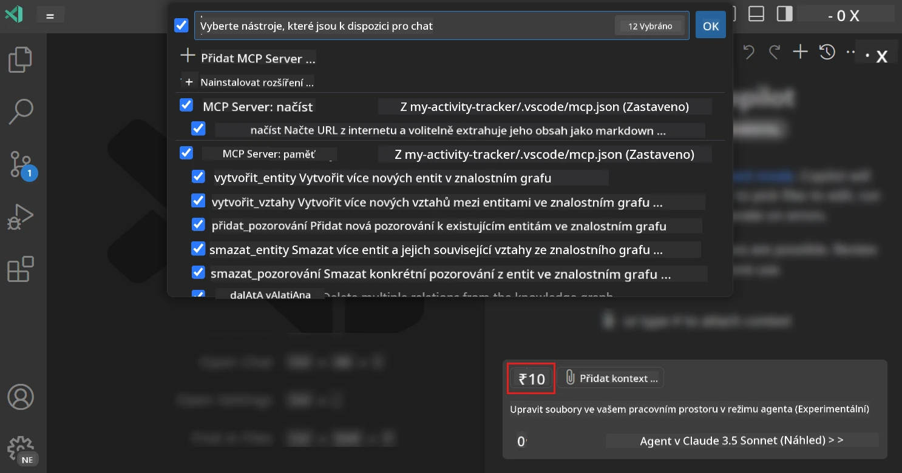
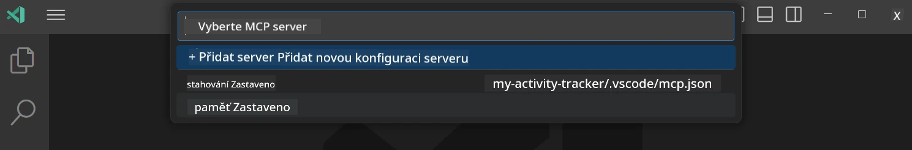
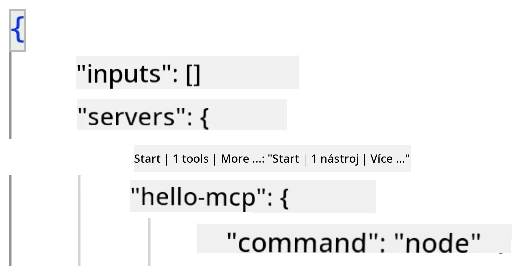
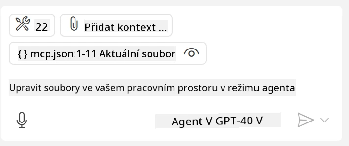
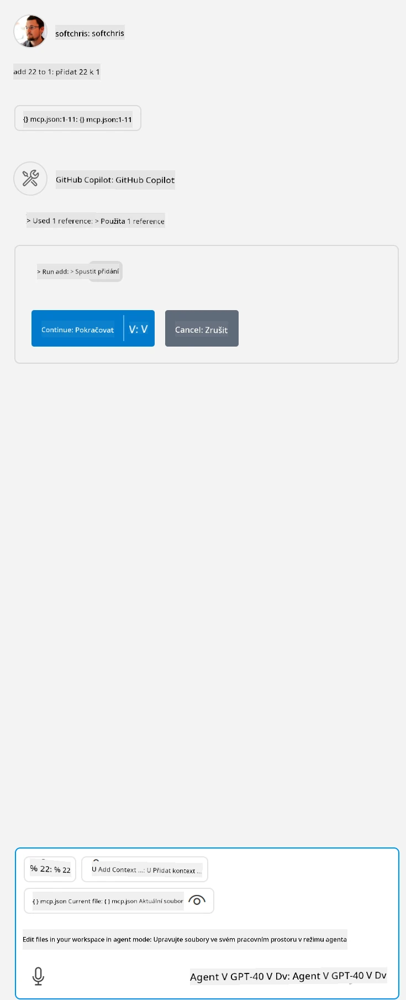

# Používání serveru v režimu GitHub Copilot Agent

Visual Studio Code a GitHub Copilot mohou fungovat jako klient a využívat MCP Server. Proč bychom to chtěli dělat, můžete se zeptat? No, to znamená, že všechny funkce MCP Serveru nyní můžete používat přímo z vašeho IDE. Představte si například přidání GitHubova MCP serveru, což by umožnilo ovládat GitHub pomocí příkazů v přirozeném jazyce místo zadávání konkrétních příkazů v terminálu. Nebo si představte cokoli obecně, co by mohlo zlepšit váš vývojářský zážitek, vše ovladatelné přirozeným jazykem. Už vidíte ten přínos, že?

## Přehled

Tato lekce popisuje, jak používat Visual Studio Code a režim GitHub Copilot Agent jako klienta pro váš MCP Server.

## Cíle učení

Na konci této lekce budete schopni:

- Spotřebovávat MCP Server přes Visual Studio Code.
- Spouštět funkce jako nástroje přes GitHub Copilot.
- Nastavit Visual Studio Code tak, aby nalezlo a spravovalo váš MCP Server.

## Použití

S vaším MCP serverem můžete ovládat dvěma různými způsoby:

- Uživatelské rozhraní, ukážeme si to později v této kapitole.
- Terminál, je možné ovládat věci z terminálu pomocí spustitelného souboru `code`:

  Pro přidání MCP serveru do uživatelského profilu použijte přepínač --add-mcp a poskytněte konfiguraci serveru ve formátu JSON ve tvaru {\"name\":\"server-name\",\"command\":...}.

  ```
  code --add-mcp "{\"name\":\"my-server\",\"command\": \"uvx\",\"args\": [\"mcp-server-fetch\"]}"
  ```

### Screenshoty





Pojďme si dál povědět, jak používáme vizuální rozhraní v dalších částech.

## Postup

Zde je, jak k tomu přistoupit z vysoké úrovně:

- Nakonfigurujte soubor, aby našel váš MCP Server.
- Spusťte/Připojte se k danému serveru, aby vám vypsal své schopnosti.
- Použijte tyto schopnosti přes rozhraní GitHub Copilot Chat.

Výborně, nyní když známe postup, pojďme zkusit použít MCP Server přes Visual Studio Code v praktickém cvičení.

## Cvičení: použití serveru

V tomto cvičení nakonfigurujeme Visual Studio Code tak, aby našel váš MCP server a umožnil jeho použití z rozhraní GitHub Copilot Chat.

### -0- Předkrok, povolení vyhledávání MCP Serveru

Možná budete muset povolit objevování MCP Serverů.

1. V Visual Studio Code jděte do `File -> Preferences -> Settings`.

1. Vyhledejte "MCP" a povolte `chat.mcp.discovery.enabled` v souboru settings.json.

### -1- Vytvoření konfiguračního souboru

Začněte vytvořením konfiguračního souboru v kořenovém adresáři projektu. Budete potřebovat soubor s názvem MCP.json umístěný ve složce .vscode. Měl by vypadat takto:

```text
.vscode
|-- mcp.json
```

Dále si ukážeme, jak přidat záznam o serveru.

### -2- Konfigurace serveru

Přidejte následující obsah do *mcp.json*:

```json
{
    "inputs": [],
    "servers": {
       "hello-mcp": {
           "command": "node",
           "args": [
               "build/index.js"
           ]
       }
    }
}
```

Výše je jednoduchý příklad, jak spustit server napsaný v Node.js, u jiných běhových prostředí uveďte správný příkaz pro spuštění serveru pomocí `command` a `args`.

### -3- Spuštění serveru

Nyní, když jste přidali záznam, pojďme server spustit:

1. Najděte svůj záznam v *mcp.json* a ujistěte se, že vidíte ikonu "play":

    

1. Klikněte na ikonu "play", měli byste vidět, že ikonka nástrojů v GitHub Copilot Chat se zvýší v počtu dostupných nástrojů. Pokud kliknete na tuto ikonu nástrojů, uvidíte seznam registrovaných nástrojů. Každý nástroj můžete zaškrtnout nebo odškrtnout podle toho, zda chcete, aby jej GitHub Copilot používal jako kontext:

  

1. Pro spuštění nástroje napište prompt, o kterém víte, že odpovídá popisu některého vašeho nástroje, například prompt „add 22 to 1“:

  

  Měli byste vidět odpověď 23.

## Úkol

Zkuste přidat záznam o serveru do souboru *mcp.json* a ujistěte se, že můžete server spustit a zastavit. Také ověřte, že můžete komunikovat s nástroji na vašem serveru přes rozhraní GitHub Copilot Chat.

## Řešení

[Řešení](./solution/README.md)

## Klíčové poznatky

Klíčové poznatky z této kapitoly jsou:

- Visual Studio Code je skvělý klient, který dovoluje pracovat s více MCP Servery a jejich nástroji.
- Rozhraní GitHub Copilot Chat je způsob interakce se servery.
- Můžete uživatele vyzvat k zadání vstupů jako API klíče, které lze předat MCP Serveru při konfiguraci záznamu v souboru *mcp.json*.

## Ukázky

- [Java Calculator](../samples/java/calculator/README.md)
- [.Net Calculator](../../../../03-GettingStarted/samples/csharp)
- [JavaScript Calculator](../samples/javascript/README.md)
- [TypeScript Calculator](../samples/typescript/README.md)
- [Python Calculator](../../../../03-GettingStarted/samples/python)

## Další zdroje

- [Visual Studio dokumentace](https://code.visualstudio.com/docs/copilot/chat/mcp-servers)

## Co dál

- Dále: [Vytvoření stdio Serveru](../05-stdio-server/README.md)

---

<!-- CO-OP TRANSLATOR DISCLAIMER START -->
**Prohlášení o omezení odpovědnosti**:
Tento dokument byl přeložen pomocí AI překladatelské služby [Co-op Translator](https://github.com/Azure/co-op-translator). Přestože usilujeme o co největší přesnost, mějte prosím na paměti, že automatizované překlady mohou obsahovat chyby nebo nepřesnosti. Originální dokument v jeho mateřském jazyce by měl být považován za autoritativní zdroj. Pro kritické informace se doporučuje profesionální lidský překlad. Nejsme odpovědní za jakékoli nedorozumění nebo nesprávné interpretace vzniklé použitím tohoto překladu.
<!-- CO-OP TRANSLATOR DISCLAIMER END -->