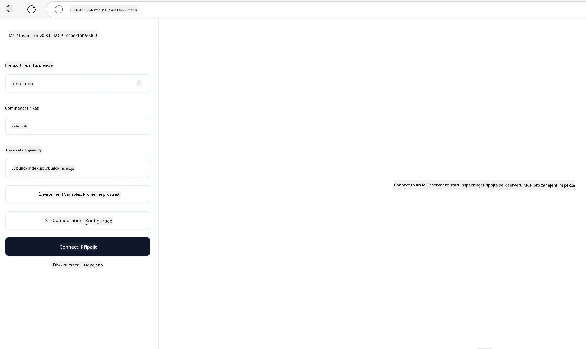

## Testování a ladění

Než začnete testovat svůj MCP server, je důležité porozumět dostupným nástrojům a nejlepším postupům pro ladění. Efektivní testování zajišťuje, že váš server se chová podle očekávání a pomáhá rychle identifikovat a řešit problémy. Následující sekce shrnuje doporučené přístupy k ověřování vaší implementace MCP.

## Přehled

Tato lekce pokrývá, jak vybrat správný přístup k testování a nejefektivnější nástroj pro testování.

## Cíle učení

Na konci této lekce budete schopni:

- Popsat různé přístupy k testování.
- Používat různé nástroje pro efektivní testování vašeho kódu.


## Testování MCP serverů

MCP poskytuje nástroje, které vám pomohou testovat a ladit vaše servery:

- **MCP Inspector**: Nástroj příkazového řádku, který lze spustit jak jako CLI nástroj, tak jako vizuální nástroj.
- **Manuální testování**: Můžete použít nástroj jako curl pro spouštění webových požadavků, ale k dispozici je jakýkoli nástroj schopný spouštět HTTP.
- **Unit testing**: Je možné použít vámi preferovaný testovací rámec k testování funkcí serveru i klienta.

### Používání MCP Inspector

Používání tohoto nástroje jsme popsali v předchozích lekcích, ale probereme ho trochu z vyšší úrovně. Je to nástroj postavený v Node.js a můžete ho použít zavoláním spustitelného souboru `npx`, který nástroj dočasně stáhne a nainstaluje a po dokončení zpracování vašeho požadavku se sám vyčistí.

[MCP Inspector](https://github.com/modelcontextprotocol/inspector) vám pomůže:

- **Objevit schopnosti serveru**: Automatické detekování dostupných zdrojů, nástrojů a promptů.
- **Testovat spouštění nástrojů**: Vyzkoušejte různé parametry a sledujte odpovědi v reálném čase.
- **Zobrazit metadata serveru**: Prohlédněte si informace o serveru, schémata a konfigurace.

Typický běh nástroje vypadá takto:

```bash
npx @modelcontextprotocol/inspector node build/index.js
```

Výše uvedený příkaz spustí MCP a jeho vizuální rozhraní a spustí lokální webové rozhraní ve vašem prohlížeči. Můžete očekávat zobrazení dashboardu ukazujícího vaše registrované MCP servery, jejich dostupné nástroje, zdroje a prompty. Rozhraní umožňuje interaktivně testovat spouštění nástrojů, prohlížet metadata serveru a sledovat odpovědi v reálném čase, což usnadňuje ověřování a ladění implementací vašeho MCP serveru.

Takhle to může vypadat: 

Můžete také spustit tento nástroj v režimu CLI, v tom případě přidejte atribut `--cli`. Zde je příklad spuštění nástroje v režimu "CLI", který vypíše všechny nástroje na serveru:

```sh
npx @modelcontextprotocol/inspector --cli node build/index.js --method tools/list
```

### Manuální testování

Kromě spuštění nástroje inspector k testování schopností serveru je další podobný přístup spuštění klienta schopného použít HTTP, například curl.

Pomocí curl můžete testovat MCP servery přímo pomocí HTTP požadavků:

```bash
# Příklad: Metadata testovacího serveru
curl http://localhost:3000/v1/metadata

# Příklad: Spustit nástroj
curl -X POST http://localhost:3000/v1/tools/execute \
  -H "Content-Type: application/json" \
  -d '{"name": "calculator", "parameters": {"expression": "2+2"}}'
```

Jak vidíte z výše uvedeného použití curl, použijete POST požadavek pro zavolání nástroje s payloadem obsahujícím název nástroje a jeho parametry. Použijte přístup, který vám nejlépe vyhovuje. Obecně jsou CLI nástroje rychlejší k použití a umožňují skriptování, což může být užitečné v prostředí CI/CD.

### Unit Testování

Vytvořte jednotkové testy pro vaše nástroje a zdroje, abyste zajistili, že fungují podle očekávání. Zde je příklad testovacího kódu.

```python
import pytest

from mcp.server.fastmcp import FastMCP
from mcp.shared.memory import (
    create_connected_server_and_client_session as create_session,
)

# Označit celý modul pro asynchronní testy
pytestmark = pytest.mark.anyio


async def test_list_tools_cursor_parameter():
    """Test that the cursor parameter is accepted for list_tools.

    Note: FastMCP doesn't currently implement pagination, so this test
    only verifies that the cursor parameter is accepted by the client.
    """

 server = FastMCP("test")

    # Vytvořit pár testovacích nástrojů
    @server.tool(name="test_tool_1")
    async def test_tool_1() -> str:
        """First test tool"""
        return "Result 1"

    @server.tool(name="test_tool_2")
    async def test_tool_2() -> str:
        """Second test tool"""
        return "Result 2"

    async with create_session(server._mcp_server) as client_session:
        # Test bez parametru cursor (vynecháno)
        result1 = await client_session.list_tools()
        assert len(result1.tools) == 2

        # Test s cursor=None
        result2 = await client_session.list_tools(cursor=None)
        assert len(result2.tools) == 2

        # Test s cursor jako řetězec
        result3 = await client_session.list_tools(cursor="some_cursor_value")
        assert len(result3.tools) == 2

        # Test s prázdným řetězcem cursor
        result4 = await client_session.list_tools(cursor="")
        assert len(result4.tools) == 2
    
```

Výše uvedený kód dělá následující:

- Využívá framework pytest, který umožňuje vytvářet testy jako funkce a používat assert příkazy.
- Vytváří MCP server se dvěma různými nástroji.
- Používá `assert` příkaz ke kontrole, že určité podmínky jsou splněné.

Podívejte se na [celý soubor zde](https://github.com/modelcontextprotocol/python-sdk/blob/main/tests/client/test_list_methods_cursor.py)

Na základě výše uvedeného souboru můžete testovat svůj vlastní server, abyste zajistili, že schopnosti jsou vytvářeny, jak mají.

Všechny hlavní SDK mají podobné sekce pro testování, takže je můžete přizpůsobit svému zvolenému runtime.

## Ukázky

- [Java kalkulačka](../samples/java/calculator/README.md)
- [.Net kalkulačka](../../../../03-GettingStarted/samples/csharp)
- [JavaScript kalkulačka](../samples/javascript/README.md)
- [TypeScript kalkulačka](../samples/typescript/README.md)
- [Python kalkulačka](../../../../03-GettingStarted/samples/python)

## Další zdroje

- [Python SDK](https://github.com/modelcontextprotocol/python-sdk)

## Co dál

- Další: [Nasazení](../09-deployment/README.md)

---

<!-- CO-OP TRANSLATOR DISCLAIMER START -->
**Prohlášení o vyloučení odpovědnosti**:  
Tento dokument byl přeložen pomocí AI překladatelské služby [Co-op Translator](https://github.com/Azure/co-op-translator). Přestože usilujeme o přesnost, mějte prosím na paměti, že automatické překlady mohou obsahovat chyby nebo nepřesnosti. Originální dokument v jeho rodném jazyce by měl být považován za závazný zdroj. Pro důležité informace se doporučuje profesionální lidský překlad. Nejsme odpovědní za jakékoliv nedorozumění nebo nesprávné výklady vyplývající z použití tohoto překladu.
<!-- CO-OP TRANSLATOR DISCLAIMER END -->