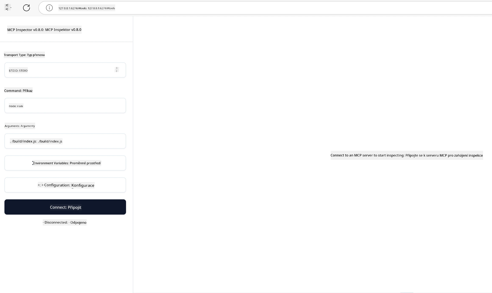

## Testování a ladění

Než začnete testovat svůj MCP server, je důležité porozumět dostupným nástrojům a osvědčeným postupům pro ladění. Efektivní testování zajišťuje, že váš server se chová podle očekávání, a pomáhá vám rychle identifikovat a vyřešit problémy. Následující sekce popisuje doporučené přístupy pro ověřování vaší implementace MCP.

## Přehled

Tato lekce se zaměřuje na výběr správného přístupu k testování a nejefektivnějšího testovacího nástroje.

## Cíle učení

Na konci této lekce budete schopni:

- Popsat různé přístupy k testování.
- Použít různé nástroje pro efektivní testování vašeho kódu.


## Testování MCP serverů

MCP poskytuje nástroje, které vám pomohou testovat a ladit vaše servery:

- **MCP Inspector**: Nástroj příkazového řádku, který lze spustit jako CLI nástroj i jako vizuální nástroj.
- **Manuální testování**: Můžete použít nástroj jako curl pro spouštění webových požadavků, ale použít můžete každý nástroj schopný provádět HTTP.
- **Jednotkové testování**: Je možné použít váš preferovaný testovací rámec pro testování funkcí serveru i klienta.

### Použití MCP Inspector

Použití tohoto nástroje jsme popsali v předchozích lekcích, ale pojďme si o něm stručně promluvit. Jedná se o nástroj vytvořený v Node.js, který můžete spustit pomocí spustitelného souboru `npx`, který dočasně stáhne a nainstaluje nástroj a po dokončení spouštění vašeho požadavku se sám odstraní.

[MCP Inspector](https://github.com/modelcontextprotocol/inspector) vám pomáhá:

- **Objevit schopnosti serveru**: Automaticky detekovat dostupné zdroje, nástroje a výzvy
- **Testovat spuštění nástroje**: Vyzkoušet různé parametry a zobrazit odpovědi v reálném čase
- **Zobrazit metadata serveru**: Prozkoumat informace o serveru, schémata a konfigurace

Typické spuštění nástroje vypadá takto:

```bash
npx @modelcontextprotocol/inspector node build/index.js
```

Výše uvedený příkaz spustí MCP a jeho vizuální rozhraní a otevře lokální webové rozhraní ve vašem prohlížeči. Můžete očekávat dashboard zobrazující vaše registrované MCP servery, jejich dostupné nástroje, zdroje a výzvy. Rozhraní vám umožňuje interaktivně testovat spouštění nástrojů, prohlížet metadata serveru a sledovat odpovědi v reálném čase, což usnadňuje ověření a ladění vašich implementací MCP serverů.

Může to vypadat následovně: 

Tento nástroj můžete také spustit v režimu CLI, kdy přidáte atribut `--cli`. Zde je příklad spuštění nástroje v režimu "CLI", který vyjmenuje všechny nástroje na serveru:

```sh
npx @modelcontextprotocol/inspector --cli node build/index.js --method tools/list
```

### Manuální testování

Kromě spuštění nástroje inspector pro testování schopností serveru můžete použít podobný přístup s klientem schopným používat HTTP, například curl.

S curl můžete přímo testovat MCP servery pomocí HTTP požadavků:

```bash
# Příklad: Metadata testovacího serveru
curl http://localhost:3000/v1/metadata

# Příklad: Spuštění nástroje
curl -X POST http://localhost:3000/v1/tools/execute \
  -H "Content-Type: application/json" \
  -d '{"name": "calculator", "parameters": {"expression": "2+2"}}'
```

Jak vidíte z výše uvedeného použití curl, používáte POST požadavek pro volání nástroje pomocí užitečného zatížení obsahujícího název nástroje a jeho parametry. Použijte přístup, který vám nejlépe vyhovuje. CLI nástroje bývají obecně rychlejší k použití a snadno se skriptují, což může být užitečné v CI/CD prostředí.

### Jednotkové testování

Vytvořte jednotkové testy pro vaše nástroje a zdroje, abyste zajistili, že pracují podle očekávání. Zde je ukázkový testovací kód.

```python
import pytest

from mcp.server.fastmcp import FastMCP
from mcp.shared.memory import (
    create_connected_server_and_client_session as create_session,
)

# Označit celý modul pro asynchronní testy
pytestmark = pytest.mark.anyio


async def test_list_tools_cursor_parameter():
    """Test that the cursor parameter is accepted for list_tools.

    Note: FastMCP doesn't currently implement pagination, so this test
    only verifies that the cursor parameter is accepted by the client.
    """

 server = FastMCP("test")

    # Vytvořit několik testovacích nástrojů
    @server.tool(name="test_tool_1")
    async def test_tool_1() -> str:
        """First test tool"""
        return "Result 1"

    @server.tool(name="test_tool_2")
    async def test_tool_2() -> str:
        """Second test tool"""
        return "Result 2"

    async with create_session(server._mcp_server) as client_session:
        # Test bez parametru cursor (vynecháno)
        result1 = await client_session.list_tools()
        assert len(result1.tools) == 2

        # Test s cursor=None
        result2 = await client_session.list_tools(cursor=None)
        assert len(result2.tools) == 2

        # Test s cursor jako řetězec
        result3 = await client_session.list_tools(cursor="some_cursor_value")
        assert len(result3.tools) == 2

        # Test s cursorem jako prázdný řetězec
        result4 = await client_session.list_tools(cursor="")
        assert len(result4.tools) == 2
    
```

Následující kód děla toto:

- Využívá testovací rámec pytest, který umožňuje vytvářet testy jako funkce a používat příkazy assert.
- Vytvoří MCP server se dvěma různými nástroji.
- Používá příkaz `assert` k ověření splnění určitých podmínek.

Podívejte se na [celý soubor zde](https://github.com/modelcontextprotocol/python-sdk/blob/main/tests/client/test_list_methods_cursor.py)

Na základě výše uvedeného souboru můžete testovat svůj vlastní server, abyste zajistili, že schopnosti jsou vytvořeny, jak mají být.

Všechny hlavní SDK mají podobné testovací sekce, takže je můžete přizpůsobit vašemu zvolenému runtime.

## Ukázky 

- [Java Calculator](../samples/java/calculator/README.md)
- [.Net Calculator](../../../../03-GettingStarted/samples/csharp)
- [JavaScript Calculator](../samples/javascript/README.md)
- [TypeScript Calculator](../samples/typescript/README.md)
- [Python Calculator](../../../../03-GettingStarted/samples/python) 

## Další zdroje

- [Python SDK](https://github.com/modelcontextprotocol/python-sdk)

## Co bude dál

- Dále: [Nasazení](../09-deployment/README.md)

---

<!-- CO-OP TRANSLATOR DISCLAIMER START -->
**Prohlášení o omezení odpovědnosti**:
Tento dokument byl přeložen pomocí AI překladatelské služby [Co-op Translator](https://github.com/Azure/co-op-translator). Přestože usilujeme o co největší přesnost, mějte prosím na paměti, že automatizované překlady mohou obsahovat chyby nebo nepřesnosti. Originální dokument v jeho mateřském jazyce by měl být považován za autoritativní zdroj. Pro kritické informace se doporučuje profesionální lidský překlad. Nejsme odpovědní za jakékoli nedorozumění nebo nesprávné interpretace vzniklé použitím tohoto překladu.
<!-- CO-OP TRANSLATOR DISCLAIMER END -->