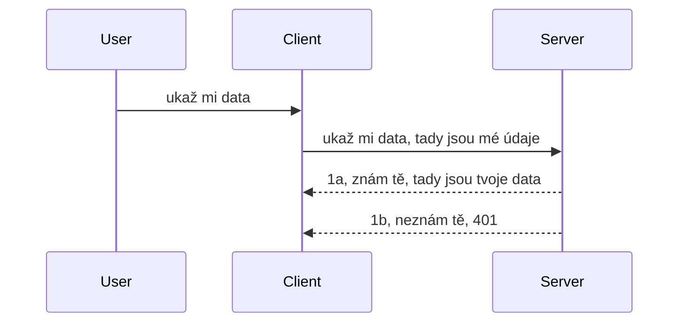

# Jednoduché ověřování

Sady MCP SDK podporují použití OAuth 2.1, což je, upřímně řečeno, poměrně složitý proces zahrnující koncepty jako autentizační server, server zdrojů, odesílání přihlašovacích údajů, získání kódu, výměnu kódu za nosičský token, dokud konečně nezískáte data zdroje. Pokud nejste zvyklí na OAuth, což je skvělá věc k implementaci, je dobré začít s nějakou základní úrovní ověřování a postupně budovat stále lepší a lepší zabezpečení. Proto tato kapitola existuje, aby vás připravila na pokročilejší ověřování.

## Ověřování, co tím myslíme?

Ověřování je zkratka pro autentizaci a autorizaci. Myšlenka je, že musíme provést dvě věci:

- **Autentizace**, což je proces zjišťování, zda osobě dovolíme vstoupit do našeho domu, že má právo být „tady“, tedy mít přístup k našemu serveru zdrojů, kde běží funkce našeho MCP serveru.
- **Autorizace**, je proces zjistit, zda by uživatel měl mít přístup ke konkrétním zdrojům, o které žádá, například k těmto objednávkám nebo produktům, anebo zda může číst obsah, ale ne mazat — jako další příklad.

## Přihlašovací údaje: jak systému říkáme, kdo jsme

Většina webových vývojářů začíná přemýšlet v termínech poskytování přihlašovacích údajů serveru, obvykle tajemství, které říká, zda mají právo být „tady“ — autentizace. Tyto přihlašovací údaje jsou obvykle base64 zakódovaná verze uživatelského jména a hesla nebo API klíč, který jednoznačně identifikuje konkrétního uživatele.

To obnáší jejich odeslání přes hlavičku nazvanou "Authorization" takto:

```json
{ "Authorization": "secret123" }
```

Tomu se obvykle říká základní autentizace (basic authentication). Celý proces pak funguje takto:


Teď když rozumíme, jak to funguje z hlediska toku, jak to implementujeme? Většina webových serverů má koncept middleware, kus kódu, který běží jako součást požadavku a může ověřit přihlašovací údaje, a pokud jsou platné, nechá požadavek projít. Pokud požadavek nemá platné přihlašovací údaje, dostanete chybu ověřování. Podívejme se, jak to lze implementovat:

**Python**

```python
class AuthMiddleware(BaseHTTPMiddleware):
    async def dispatch(self, request, call_next):

        has_header = request.headers.get("Authorization")
        if not has_header:
            print("-> Missing Authorization header!")
            return Response(status_code=401, content="Unauthorized")

        if not valid_token(has_header):
            print("-> Invalid token!")
            return Response(status_code=403, content="Forbidden")

        print("Valid token, proceeding...")
       
        response = await call_next(request)
        # přidejte jakékoliv vlastní hlavičky zákazníka nebo nějakým způsobem změňte odpověď
        return response


starlette_app.add_middleware(CustomHeaderMiddleware)
```

Tady jsme:

- Vytvořili middleware nazvaný `AuthMiddleware`, jehož metoda `dispatch` je volána webovým serverem.
- Přidali middleware do webového serveru:

    ```python
    starlette_app.add_middleware(AuthMiddleware)
    ```

- Napsali validační logiku, která kontroluje, zda je hlavička Authorization přítomná a zda je odesílané tajemství platné:

    ```python
    has_header = request.headers.get("Authorization")
    if not has_header:
        print("-> Missing Authorization header!")
        return Response(status_code=401, content="Unauthorized")

    if not valid_token(has_header):
        print("-> Invalid token!")
        return Response(status_code=403, content="Forbidden")
    ```

    pokud je tajemství přítomné a platné, necháme požadavek projít zavoláním `call_next` a vrátíme odpověď.

    ```python
    response = await call_next(request)
    # přidejte jakékoliv zákaznické hlavičky nebo nějak změňte odpověď
    return response
    ```

Jak to funguje je, že pokud je odeslán webový požadavek na server, middleware je volán a podle své implementace buď požadavek pustí dál, nebo vrátí chybu označující, že klient nemá oprávnění pokračovat.

**TypeScript**

Zde vytvoříme middleware s populárním frameworkem Express a zachytíme požadavek před tím, než dosáhne MCP serveru. Zde je ukázka kódu:

```typescript
function isValid(secret) {
    return secret === "secret123";
}

app.use((req, res, next) => {
    // 1. Je přítomen autorizační záhlaví?
    if(!req.headers["Authorization"]) {
        res.status(401).send('Unauthorized');
    }
    
    let token = req.headers["Authorization"];

    // 2. Zkontrolujte platnost.
    if(!isValid(token)) {
        res.status(403).send('Forbidden');
    }

   
    console.log('Middleware executed');
    // 3. Předá požadavek do dalšího kroku v pipeline požadavků.
    next();
});
```

V tomto kódu:

1. Kontrolujeme, zda je hlavička Authorization vůbec přítomná, pokud ne, pošleme chybu 401.
2. Zajistíme, že přihlašovací údaj/token je platný, pokud ne, pošleme chybu 403.
3. Nakonec požadavek předáme dále v pipeline a vrátíme požadovaný zdroj.

## Cvičení: Implementace ověřování

Vezměme si naše znalosti a zkuste to implementovat. Plán je následující:

Server

- Vytvořit webový server a instanci MCP.
- Implementovat middleware pro server.

Klient

- Odeslat webový požadavek s přihlašovacími údaji v hlavičce.

### -1- Vytvořit webový server a instanci MCP

V první fázi potřebujeme vytvořit instanci webového serveru a MCP server.

**Python**

Zde vytvoříme instanci MCP serveru, vytvoříme webovou aplikaci starlette a spustíme ji pomocí uvicorn.

```python
# vytváření MCP serveru

app = FastMCP(
    name="MCP Resource Server",
    instructions="Resource Server that validates tokens via Authorization Server introspection",
    host=settings["host"],
    port=settings["port"],
    debug=True
)

# vytváření webové aplikace starlette
starlette_app = app.streamable_http_app()

# provozování aplikace přes uvicorn
async def run(starlette_app):
    import uvicorn
    config = uvicorn.Config(
            starlette_app,
            host=app.settings.host,
            port=app.settings.port,
            log_level=app.settings.log_level.lower(),
        )
    server = uvicorn.Server(config)
    await server.serve()

run(starlette_app)
```

V tomto kódu:

- Vytvoříme MCP server.
- Sestavíme starlette webovou aplikaci z MCP serveru pomocí `app.streamable_http_app()`.
- Spustíme a obsluhujeme webovou aplikaci pomocí uvicorn `server.serve()`.

**TypeScript**

Zde vytvoříme instanci MCP serveru.

```typescript
const server = new McpServer({
      name: "example-server",
      version: "1.0.0"
    });

    // ... nastavit zdroje serveru, nástroje a podněty ...
```

Toto vytvoření MCP serveru musí proběhnout v rámci definice cesty POST /mcp, takže vezměme výše uvedený kód a přesuňme jej takto:

```typescript
import express from "express";
import { randomUUID } from "node:crypto";
import { McpServer } from "@modelcontextprotocol/sdk/server/mcp.js";
import { StreamableHTTPServerTransport } from "@modelcontextprotocol/sdk/server/streamableHttp.js";
import { isInitializeRequest } from "@modelcontextprotocol/sdk/types.js"

const app = express();
app.use(express.json());

// Mapa pro ukládání transportů podle ID relace
const transports: { [sessionId: string]: StreamableHTTPServerTransport } = {};

// Zpracovat POST požadavky pro komunikaci klient-server
app.post('/mcp', async (req, res) => {
  // Kontrola existujícího ID relace
  const sessionId = req.headers['mcp-session-id'] as string | undefined;
  let transport: StreamableHTTPServerTransport;

  if (sessionId && transports[sessionId]) {
    // Znovupoužít existující transport
    transport = transports[sessionId];
  } else if (!sessionId && isInitializeRequest(req.body)) {
    // Nový požadavek na inicializaci
    transport = new StreamableHTTPServerTransport({
      sessionIdGenerator: () => randomUUID(),
      onsessioninitialized: (sessionId) => {
        // Uložit transport podle ID relace
        transports[sessionId] = transport;
      },
      // Ochrana proti DNS rebindingu je ve výchozím nastavení vypnuta pro zpětnou kompatibilitu. Pokud tento server
      // provozujete lokálně, ujistěte se, že nastavíte:
      // enableDnsRebindingProtection: true,
      // allowedHosts: ['127.0.0.1'],
    });

    // Vyčistit transport při uzavření
    transport.onclose = () => {
      if (transport.sessionId) {
        delete transports[transport.sessionId];
      }
    };
    const server = new McpServer({
      name: "example-server",
      version: "1.0.0"
    });

    // ... nastavit serverové zdroje, nástroje a výzvy ...

    // Připojit se k MCP serveru
    await server.connect(transport);
  } else {
    // Neplatný požadavek
    res.status(400).json({
      jsonrpc: '2.0',
      error: {
        code: -32000,
        message: 'Bad Request: No valid session ID provided',
      },
      id: null,
    });
    return;
  }

  // Zpracovat požadavek
  await transport.handleRequest(req, res, req.body);
});

// Znovupoužitelný handler pro GET a DELETE požadavky
const handleSessionRequest = async (req: express.Request, res: express.Response) => {
  const sessionId = req.headers['mcp-session-id'] as string | undefined;
  if (!sessionId || !transports[sessionId]) {
    res.status(400).send('Invalid or missing session ID');
    return;
  }
  
  const transport = transports[sessionId];
  await transport.handleRequest(req, res);
};

// Zpracovat GET požadavky pro oznámení ze serveru klientovi přes SSE
app.get('/mcp', handleSessionRequest);

// Zpracovat DELETE požadavky na ukončení relace
app.delete('/mcp', handleSessionRequest);

app.listen(3000);
```

Nyní vidíte, že vytvoření MCP serveru bylo přesunuto dovnitř `app.post("/mcp")`.

Pokračujme k dalšímu kroku, kterým je vytvoření middleware pro validaci přicházejících přihlašovacích údajů.

### -2- Implementovat middleware pro server

Podívejme se teď na middleware část. Zde vytvoříme middleware, který hledá přihlašovací údaje v hlavičce `Authorization` a ověří je. Pokud jsou přijatelné, požadavek pokračuje k vykonání požadované akce (například vypsat nástroje, načíst zdroj nebo cokoliv z funkcí MCP klient požaduje).

**Python**

Pro vytvoření middleware vytvoříme třídu, která dědí z `BaseHTTPMiddleware`. Jsou zde dva zajímavé komponenty:

- požadavek `request`, ze kterého čteme informace z hlaviček.
- `call_next`, zpětné volání, které musíme zavolat, pokud klient přinesl přihlašovací údaje, které akceptujeme.

Nejprve je potřeba ošetřit případ, kdy hlavička `Authorization` chybí:

```python
has_header = request.headers.get("Authorization")

# žádný záhlaví není přítomno, selhat s 401, jinak pokračovat dál.
if not has_header:
    print("-> Missing Authorization header!")
    return Response(status_code=401, content="Unauthorized")
```

Zde posíláme zprávu 401 unauthorized, protože klient nezvládl autentizaci.

Dále, pokud byly přihlašovací údaje odeslány, musíme ověřit jejich platnost takto:

```python
 if not valid_token(has_header):
    print("-> Invalid token!")
    return Response(status_code=403, content="Forbidden")
```

Všimněte si, že posíláme zprávu 403 forbidden. Podívejme se na celý middleware níže implementující vše, co jsme zmínili:

```python
class AuthMiddleware(BaseHTTPMiddleware):
    async def dispatch(self, request, call_next):

        has_header = request.headers.get("Authorization")
        if not has_header:
            print("-> Missing Authorization header!")
            return Response(status_code=401, content="Unauthorized")

        if not valid_token(has_header):
            print("-> Invalid token!")
            return Response(status_code=403, content="Forbidden")

        print("Valid token, proceeding...")
        print(f"-> Received {request.method} {request.url}")
        response = await call_next(request)
        response.headers['Custom'] = 'Example'
        return response

```

Skvělé, ale co funkce `valid_token`? Zde je níže:
:

```python
# NEPOUŽÍVEJTE do výroby - vylepšete to !!
def valid_token(token: str) -> bool:
    # odeberte prefix "Bearer "
    if token.startswith("Bearer "):
        token = token[7:]
        return token == "secret-token"
    return False
```

Toto samozřejmě můžete ještě vylepšit.

DŮLEŽITÉ: Nikdy byste neměli mít taková tajemství přímo v kódu. Ideálně byste měli hodnotu pro porovnání načítat z datového zdroje nebo od IDP (poskytovatele identity) či raději nechat validaci na IDP.

**TypeScript**

Pro implementaci tohoto v Expressu je potřeba zavolat metodu `use`, která přijímá middleware funkce.

Musíme:

- Interagovat s proměnnou požadavku a zkontrolovat přihlašovací údaje v vlastnosti `Authorization`.
- Validovat přihlašovací údaje a v případě platnosti nechat požadavek pokračovat, aby klientova MCP žádost mohla vykonat, co má (např. vypsat nástroje, načíst zdroj či cokoliv dalšího vztahujícího se k MCP).

Zde kontrolujeme, zda hlavička `Authorization` je přítomna, pokud není, zastavujeme průchod požadavku:

```typescript
if(!req.headers["authorization"]) {
    res.status(401).send('Unauthorized');
    return;
}
```

Pokud hlavička není vůbec odeslána, dostanete chybu 401.

Dále kontrolujeme platnost přihlašovacích údajů, pokud neplatí, znova požadavek zastavíme, ale s jinou chybovou zprávou:

```typescript
if(!isValid(token)) {
    res.status(403).send('Forbidden');
    return;
} 
```

Všimněte si, že nyní dostanete chybu 403.

Zde je kompletní kód:

```typescript
app.use((req, res, next) => {
    console.log('Request received:', req.method, req.url, req.headers);
    console.log('Headers:', req.headers["authorization"]);
    if(!req.headers["authorization"]) {
        res.status(401).send('Unauthorized');
        return;
    }
    
    let token = req.headers["authorization"];

    if(!isValid(token)) {
        res.status(403).send('Forbidden');
        return;
    }  

    console.log('Middleware executed');
    next();
});
```

Nastavili jsme webový server tak, aby přijímal middleware pro kontrolu přihlašovacích údajů, které nám klient snad posílá. Co klient sám?

### -3- Odeslat webový požadavek s přihlašovacími údaji v hlavičce

Musíme zajistit, aby klient přihlašovací údaje předával přes hlavičku. Protože použijeme MCP klienta, musíme zjistit, jak se to dělá.

**Python**

Pro klienta je potřeba předat hlavičku s přihlašovacími údaji takto:

```python
# NEPEVNĚ zakódujte hodnotu, mějte ji alespoň v proměnné prostředí nebo v bezpečnějším úložišti
token = "secret-token"

async with streamablehttp_client(
        url = f"http://localhost:{port}/mcp",
        headers = {"Authorization": f"Bearer {token}"}
    ) as (
        read_stream,
        write_stream,
        session_callback,
    ):
        async with ClientSession(
            read_stream,
            write_stream
        ) as session:
            await session.initialize()
      
            # TODO, co chcete udělat na klientovi, např. vypsat nástroje, volat nástroje apod.
```

Všimněte si, jak vyplňujeme vlastnost `headers` takto: ` headers = {"Authorization": f"Bearer {token}"}`.

**TypeScript**

Toto můžeme vyřešit ve dvou krocích:

1. Naplnit konfigurační objekt našimi přihlašovacími údaji.
2. Předat tento konfigurační objekt transportu.

```typescript

// NEtvrdě kódujte hodnotu, jak je ukázáno zde. Minimálně ji mějte jako proměnnou prostředí a použijte něco jako dotenv (v režimu vývoje).
let token = "secret123"

// definujte objekt volby klientského transportu
let options: StreamableHTTPClientTransportOptions = {
  sessionId: sessionId,
  requestInit: {
    headers: {
      "Authorization": "secret123"
    }
  }
};

// předat objekt možností do transportu
async function main() {
   const transport = new StreamableHTTPClientTransport(
      new URL(serverUrl),
      options
   );
```

Zde vidíte výše, jak jsme museli vytvořit objekt `options` a umístit naše hlavičky pod vlastnost `requestInit`.

DŮLEŽITÉ: Jak to tedy zlepšit? Současná implementace má několik problémů. Za prvé, předávat přihlašovací údaje tímto způsobem je dost riskantní, pokud nemáte minimálně HTTPS. I pak může být přihlašovací údaj ukraden, takže potřebujete systém, kde můžete snadno token zneplatnit a přidat další kontroly, například odkud na světě požadavek přichází, zda se požadavky nestanou příliš častými (chování robota) a podobně, existuje celá řada ohledů.

Mělo by se ale říct, že pro velmi jednoduché API, kde nechcete, aby kdokoliv volal vaše API bez ověření, je to dobrý začátek.

S tím řečeno, pojďme trochu posílit bezpečnost použitím standardizovaného formátu jako JSON Web Token, známého také jako JWT nebo "JOT" tokeny.

## JSON Web Tokeny, JWT

Snažíme se zlepšit zasílání velmi jednoduchých přihlašovacích údajů. Jaké jsou okamžité výhody přijetí JWT?

- **Zlepšení bezpečnosti**. V základním ověřování posíláte uživatelské jméno a heslo jako base64 kódovaný token (nebo API klíč) znovu a znovu, což zvyšuje riziko. U JWT odešlete uživatelské jméno a heslo a dostanete token na oplátku, který má také časovou platnost, takže vyprší. JWT umožňuje snadno používat jemnozrnné řízení přístupu pomocí rolí, rozsahů a oprávnění.
- **Bezstavovost a škálovatelnost**. JWT je samostatně obsahující data, nese veškeré uživatelské informace a eliminuje potřebu serverového uložení relací. Token lze také ověřovat lokálně.
- **Interoperabilita a federace**. JWT je ústředním prvkem OpenID Connect a používá se s známými poskytovateli identity jako Entra ID, Google Identity a Auth0. Umožňují také použití single sign-on a mnoho dalšího, čímž je to řešení na úrovni podniku.
- **Modularita a flexibilita**. JWT lze použít i s API bránami jako Azure API Management, NGINX a další. Podporuje i použití v autentizačních scénářích a komunikaci server-server včetně přecpávání identity a delegace.
- **Výkon a cachování**. JWT lze kešovat po dekódování, což snižuje potřebu opakovaného parsování. To pomáhá zejména v aplikacích s velkým provozem, protože zlepšuje propustnost a snižuje zatížení infrastruktury.
- **Pokročilé funkce**. Dále podporuje introspekci (kontrola platnosti na serveru) a zneplatnění tokenů.

S tolika výhodami se podívejme, jak posunout naši implementaci na vyšší úroveň.

## Převod základního ověřování na JWT

Na velké úrovni potřebujeme:

- **Naučit se vytvořit JWT token** a připravit ho pro odeslání od klienta na server.
- **Ověřit JWT token**, a pokud je platný, nechat klientovi přístup ke zdrojům.
- **Bezpečné ukládání tokenu**. Jak tento token ukládat.
- **Ochrana cest**. Musíme chránit cesty, v našem případě tedy chránit cesty a konkrétní funkce MCP.
- **Přidat refresh tokeny**. Zajistit, že vytváříme tokeny s krátkou životností, ale také dlouhodobé refresh tokeny, které lze použít k získání nových tokenů, když vyprší platnost. Zajistit refresh endpoint a strategii rotace tokenů.

### -1- Vytvořit JWT token

JWT token má následující části:

- **hlavička**, použitý algoritmus a typ tokenu.
- **náklad (payload)**, tvrzení (claims), jako sub (uživatel nebo entita, kterou token reprezentuje, typicky uživatelské ID), exp (kdy token vyprší), role (role).
- **podpis**, podepsaný tajemstvím nebo privátním klíčem.

Potřebujeme sestavit hlavičku, payload a zakódovaný token.

**Python**

```python

import jwt
import jwt
from jwt.exceptions import ExpiredSignatureError, InvalidTokenError
import datetime

# Tajný klíč použitý pro podepsání JWT
secret_key = 'your-secret-key'

header = {
    "alg": "HS256",
    "typ": "JWT"
}

# informace o uživateli a jeho nároky a doba vypršení
payload = {
    "sub": "1234567890",               # Předmět (ID uživatele)
    "name": "User Userson",                # Vlastní nárok
    "admin": True,                     # Vlastní nárok
    "iat": datetime.datetime.utcnow(),# Vydáno v
    "exp": datetime.datetime.utcnow() + datetime.timedelta(hours=1)  # Vypršení
}

# zakódovat to
encoded_jwt = jwt.encode(payload, secret_key, algorithm="HS256", headers=header)
```

V tomto kódu jsme:

- Definovali hlavičku s algoritmem HS256 a typem JWT.
- Sestavili payload s předmětem (uživatelským ID), uživatelským jménem, rolí, časem vydání a časem expirace, čímž jsme implementovali časové omezení, které jsme zmínili dříve.

**TypeScript**

Budeme potřebovat některé závislosti, které nám pomohou sestavit JWT token.

Závislosti

```sh

npm install jsonwebtoken
npm install --save-dev @types/jsonwebtoken
```

Nyní, když to máme, vytvoříme hlavičku, payload a pomocí toho zakódovaný token.

```typescript
import jwt from 'jsonwebtoken';

const secretKey = 'your-secret-key'; // Použijte proměnné prostředí ve výrobě

// Definujte užitečné zatížení
const payload = {
  sub: '1234567890',
  name: 'User usersson',
  admin: true,
  iat: Math.floor(Date.now() / 1000), // Vydáno
  exp: Math.floor(Date.now() / 1000) + 60 * 60 // Vyprší za 1 hodinu
};

// Definujte hlavičku (volitelné, jsonwebtoken nastavuje výchozí hodnoty)
const header = {
  alg: 'HS256',
  typ: 'JWT'
};

// Vytvořte token
const token = jwt.sign(payload, secretKey, {
  algorithm: 'HS256',
  header: header
});

console.log('JWT:', token);
```

Tento token je:

Podepsaný pomocí HS256
Platný 1 hodinu
Zahrnuje claims jako sub, name, admin, iat a exp.

### -2- Ověřit token

Budeme také potřebovat token ověřit, což by se mělo dělat na serveru, abychom měli jistotu, že to, co klient posílá, je skutečně platné. Je potřeba provést mnoho kontrol od ověření struktury až po platnost. Doporučuje se také přidat další kontroly, například zda uživatel je v našem systému a další.

Pro ověření tokenu ho musíme dekódovat, abychom jej mohli přečíst, a pak začít ověřovat jeho platnost:

**Python**

```python

# Dekódujte a ověřte JWT
try:
    decoded = jwt.decode(token, secret_key, algorithms=["HS256"])
    print("✅ Token is valid.")
    print("Decoded claims:")
    for key, value in decoded.items():
        print(f"  {key}: {value}")
except ExpiredSignatureError:
    print("❌ Token has expired.")
except InvalidTokenError as e:
    print(f"❌ Invalid token: {e}")

```

V tomto kódu voláme `jwt.decode` s tokenem, tajným klíčem a zvoleným algoritmem jako vstupem. Všimněte si, že používáme try-catch konstrukci, protože neúspěšná validace vrací chybu.

**TypeScript**

Zde voláme `jwt.verify`, abychom získali dekódovanou verzi tokenu, kterou můžeme dále analyzovat. Pokud volání selže, znamená to, že struktura tokenu je nesprávná nebo již není platný.

```typescript

try {
  const decoded = jwt.verify(token, secretKey);
  console.log('Decoded Payload:', decoded);
} catch (err) {
  console.error('Token verification failed:', err);
}
```

POZNÁMKA: Jak již bylo zmíněno, měli byste provést další kontroly, abyste zajistili, že tento token ukazuje na uživatele ve vašem systému a že uživatel má práva, která token deklaruje.

Dále se podívejme na řízení přístupu založené na rolích, známé jako RBAC.
## Přidání řízení přístupu na základě rolí

Myšlenka je taková, že chceme vyjádřit, že různé role mají různá oprávnění. Například předpokládáme, že správce může dělat vše, běžní uživatelé mohou číst a zapisovat a hosté mohou pouze číst. Proto zde jsou některé možné úrovně oprávnění:

- Admin.Write 
- User.Read
- Guest.Read

Podívejme se, jak můžeme takovou kontrolu implementovat pomocí middleware. Middleware lze přidat pro konkrétní trasu, stejně jako pro všechny trasy.

**Python**

```python
from starlette.middleware.base import BaseHTTPMiddleware
from starlette.responses import JSONResponse
import jwt

# NEUCHOVÁVEJTE tajný klíč přímo v kódu, toto je pouze pro demonstrační účely. Načtěte jej z bezpečného místa.
SECRET_KEY = "your-secret-key" # vložte to do proměnné prostředí
REQUIRED_PERMISSION = "User.Read"

class JWTPermissionMiddleware(BaseHTTPMiddleware):
    async def dispatch(self, request, call_next):
        auth_header = request.headers.get("Authorization")
        if not auth_header or not auth_header.startswith("Bearer "):
            return JSONResponse({"error": "Missing or invalid Authorization header"}, status_code=401)

        token = auth_header.split(" ")[1]
        try:
            decoded = jwt.decode(token, SECRET_KEY, algorithms=["HS256"])
        except jwt.ExpiredSignatureError:
            return JSONResponse({"error": "Token expired"}, status_code=401)
        except jwt.InvalidTokenError:
            return JSONResponse({"error": "Invalid token"}, status_code=401)

        permissions = decoded.get("permissions", [])
        if REQUIRED_PERMISSION not in permissions:
            return JSONResponse({"error": "Permission denied"}, status_code=403)

        request.state.user = decoded
        return await call_next(request)


```

Existuje několik různých způsobů, jak middleware přidat, například níže:

```python

# Alt 1: přidat middleware při konstrukci starlette aplikace
middleware = [
    Middleware(JWTPermissionMiddleware)
]

app = Starlette(routes=routes, middleware=middleware)

# Alt 2: přidat middleware poté, co je starlette aplikace již zkonstruována
starlette_app.add_middleware(JWTPermissionMiddleware)

# Alt 3: přidat middleware pro každou trasu
routes = [
    Route(
        "/mcp",
        endpoint=..., # zpracovatel
        middleware=[Middleware(JWTPermissionMiddleware)]
    )
]
```

**TypeScript**

Můžeme použít `app.use` a middleware, který poběží pro všechny požadavky.

```typescript
app.use((req, res, next) => {
    console.log('Request received:', req.method, req.url, req.headers);
    console.log('Headers:', req.headers["authorization"]);

    // 1. Zkontrolujte, zda byl odeslán autorizační hlavička

    if(!req.headers["authorization"]) {
        res.status(401).send('Unauthorized');
        return;
    }
    
    let token = req.headers["authorization"];

    // 2. Zkontrolujte, zda je token platný
    if(!isValid(token)) {
        res.status(403).send('Forbidden');
        return;
    }  

    // 3. Zkontrolujte, zda uživatel tokenu existuje v našem systému
    if(!isExistingUser(token)) {
        res.status(403).send('Forbidden');
        console.log("User does not exist");
        return;
    }
    console.log("User exists");

    // 4. Ověřte, zda token má správná oprávnění
    if(!hasScopes(token, ["User.Read"])){
        res.status(403).send('Forbidden - insufficient scopes');
    }

    console.log("User has required scopes");

    console.log('Middleware executed');
    next();
});

```

Existuje celá řada věcí, které můžeme naše middleware nechat dělat a co naše middleware MĚLA DĚLAT, totiž:

1. Zkontrolovat, zda je přítomen autorizační hlavička
2. Zkontrolovat, zda je token platný, voláme `isValid`, což je metoda, kterou jsme napsali a která kontroluje integritu a platnost JWT tokenu.
3. Ověřit, že uživatel existuje v našem systému, to bychom měli ověřit.

   ```typescript
    // uživatelé v databázi
   const users = [
     "user1",
     "User usersson",
   ]

   function isExistingUser(token) {
     let decodedToken = verifyToken(token);

     // TODO, zkontrolovat, zda uživatel existuje v databázi
     return users.includes(decodedToken?.name || "");
   }
   ```

   Výše jsme vytvořili velmi jednoduchý seznam `users`, který by samozřejmě měl být v databázi.

4. Navíc bychom měli ověřit, že token má správná oprávnění.

   ```typescript
   if(!hasScopes(token, ["User.Read"])){
        res.status(403).send('Forbidden - insufficient scopes');
   }
   ```

   V tomto kódu výše v middleware kontrolujeme, že token obsahuje oprávnění User.Read, pokud ne, posíláme chybu 403. Níže je pomocná metoda `hasScopes`.

   ```typescript
   function hasScopes(scope: string, requiredScopes: string[]) {
     let decodedToken = verifyToken(scope);
    return requiredScopes.every(scope => decodedToken?.scopes.includes(scope));
  }
   ```

Have a think which additional checks you should be doing, but these are the absolute minimum of checks you should be doing.

Using Express as a web framework is a common choice. There are helpers library when you use JWT so you can write less code.

- `express-jwt`, helper library that provides a middleware that helps decode your token.
- `express-jwt-permissions`, this provides a middleware `guard` that helps check if a certain permission is on the token.

Here's what these libraries can look like when used:

```typescript
const express = require('express');
const jwt = require('express-jwt');
const guard = require('express-jwt-permissions')();

const app = express();
const secretKey = 'your-secret-key'; // put this in env variable

// Decode JWT and attach to req.user
app.use(jwt({ secret: secretKey, algorithms: ['HS256'] }));

// Check for User.Read permission
app.use(guard.check('User.Read'));

// multiple permissions
// app.use(guard.check(['User.Read', 'Admin.Access']));

app.get('/protected', (req, res) => {
  res.json({ message: `Welcome ${req.user.name}` });
});

// Error handler
app.use((err, req, res, next) => {
  if (err.code === 'permission_denied') {
    return res.status(403).send('Forbidden');
  }
  next(err);
});

```

Nyní jste viděli, jak může být middleware použito jak pro autentizaci, tak autorizaci, ale co MCP, změní se způsob autentizace? Pojďme to zjistit v další sekci.

### -3- Přidání RBAC do MCP

Doposud jste viděli, jak můžete přidat RBAC pomocí middleware, nicméně pro MCP neexistuje snadný způsob, jak přidat RBAC pro každou funkci MCP, co tedy dělat? No, musíme přidat kód jako je tento, který kontroluje, zda klient má práva ke spuštění konkrétního nástroje:

Máte několik možností, jak dosáhnout RBAC pro jednotlivé funkce, zde jsou některé:

- Přidat kontrolu pro každý nástroj, zdroj, prompt, kde je potřeba ověřit úroveň oprávnění.

   **python**

   ```python
   @tool()
   def delete_product(id: int):
      try:
          check_permissions(role="Admin.Write", request)
      catch:
        pass # klient selhal při autorizaci, vyvolejte chybu autorizace
   ```

   **typescript**

   ```typescript
   server.registerTool(
    "delete-product",
    {
      title: Delete a product",
      description: "Deletes a product",
      inputSchema: { id: z.number() }
    },
    async ({ id }) => {
      
      try {
        checkPermissions("Admin.Write", request);
        // todo, poslat id do productService a vzdáleného vstupu
      } catch(Exception e) {
        console.log("Authorization error, you're not allowed");  
      }

      return {
        content: [{ type: "text", text: `Deletected product with id ${id}` }]
      };
    }
   );
   ```


- Použít pokročilý přístup serveru a request handlery, abyste snížili počet míst, kde musíte kontrolu provádět.

   **Python**

   ```python
   
   tool_permission = {
      "create_product": ["User.Write", "Admin.Write"],
      "delete_product": ["Admin.Write"]
   }

   def has_permission(user_permissions, required_permissions) -> bool:
      # user_permissions: seznam oprávnění, která uživatel má
      # required_permissions: seznam oprávnění požadovaných pro nástroj
      return any(perm in user_permissions for perm in required_permissions)

   @server.call_tool()
   async def handle_call_tool(
     name: str, arguments: dict[str, str] | None
   ) -> list[types.TextContent]:
    # Předpokládejme, že request.user.permissions je seznam oprávnění uživatele
     user_permissions = request.user.permissions
     required_permissions = tool_permission.get(name, [])
     if not has_permission(user_permissions, required_permissions):
        # Vyvolej chybu "Nemáte oprávnění volat nástroj {name}"
        raise Exception(f"You don't have permission to call tool {name}")
     # pokračovat a zavolat nástroj
     # ...
   ```   
   

   **TypeScript**

   ```typescript
   function hasPermission(userPermissions: string[], requiredPermissions: string[]): boolean {
       if (!Array.isArray(userPermissions) || !Array.isArray(requiredPermissions)) return false;
       // Vrátí true, pokud má uživatel alespoň jedno požadované oprávnění
       
       return requiredPermissions.some(perm => userPermissions.includes(perm));
   }
  
   server.setRequestHandler(CallToolRequestSchema, async (request) => {
      const { params: { name } } = request;
  
      let permissions = request.user.permissions;
  
      if (!hasPermission(permissions, toolPermissions[name])) {
         return new Error(`You don't have permission to call ${name}`);
      }
  
      // pokračujte..
   });
   ```

   Poznámka, je třeba zajistit, aby middleware přiřadil dekódovaný token do vlastnosti user v požadavku, aby kód výše byl jednoduchý.

### Shrnutí

Nyní, když jsme probrali, jak obecně přidat podporu RBAC a konkrétně pro MCP, je čas zkoušet implementovat zabezpečení sami, abyste si ověřili, že jste pochopili představené koncepty.

## Úkol 1: Vytvořit MCP server a MCP klienta pomocí základní autentizace

Zde použijete to, co jste se naučili o zasílání přihlašovacích údajů přes hlavičky.

## Řešení 1

[Řešení 1](./code/basic/README.md)

## Úkol 2: Vylepšit řešení z Úkolu 1 a použít JWT

Vezměte první řešení, tentokrát ho ale vylepšíme.

Místo použití Basic Auth použijeme JWT.

## Řešení 2

[Řešení 2](./solution/jwt-solution/README.md)

## Výzva

Přidejte RBAC pro jednotlivé nástroje, jak popisujeme v části "Přidání RBAC do MCP".

## Shrnutí

Doufejme, že jste se v této kapitole hodně naučili, od žádného zabezpečení, přes základní zabezpečení, až po JWT a jak ho přidat do MCP.

Vybudovali jsme pevné základy s vlastním JWT, ale jak škálujeme, přecházíme k modelu identity založenému na standardech. Přijetí IdP jako Entra nebo Keycloak nám umožní delegovat vydávání tokenů, validaci a správu životního cyklu na důvěryhodnou platformu – což nám uvolní ruce pro zaměření se na logiku aplikace a uživatelskou zkušenost.

K tomu máme pokročilejší [kapitolu o Entra](../../05-AdvancedTopics/mcp-security-entra/README.md)

## Co dál

- Další: [Nastavení MCP hostitelů](../12-mcp-hosts/README.md)

---

<!-- CO-OP TRANSLATOR DISCLAIMER START -->
**Upozornění**:  
Tento dokument byl přeložen pomocí AI překladatelské služby [Co-op Translator](https://github.com/Azure/co-op-translator). I když usilujeme o přesnost, mějte prosím na paměti, že automatické překlady mohou obsahovat chyby nebo nepřesnosti. Originální dokument v jeho rodném jazyce by měl být považován za závazný zdroj. Pro zásadní informace se doporučuje profesionální lidský překlad. Nepřebíráme odpovědnost za jakékoliv nedorozumění nebo nesprávné výklady vyplývající z použití tohoto překladu.
<!-- CO-OP TRANSLATOR DISCLAIMER END -->