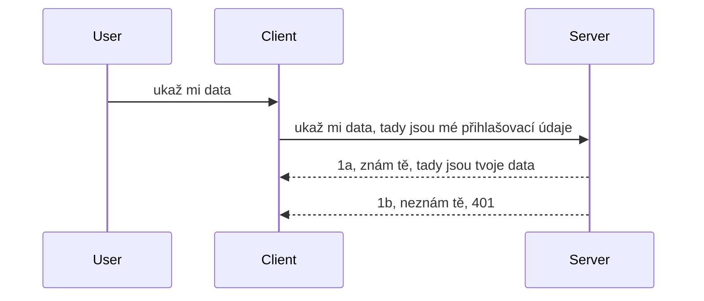

# Jednoduché ověřování

MCP SDK podporují používání OAuth 2.1, což je upřímně řečeno docela složitý proces zahrnující koncepty jako autentizační server, server zdrojů, zasílání přihlašovacích údajů, získání kódu, výměnu kódu za nosný token, až konečně můžete získat svá data ze zdroje. Pokud nejste zvyklí na OAuth, což je skvělá věc pro implementaci, je dobré začít s nějakou základní úrovní ověřování a postupně přecházet k lepší a lepší bezpečnosti. Právě proto tato kapitola existuje, aby vás připravila na pokročilejší ověřování.

## Ověření, co tím myslíme?

Ověření je zkratka pro autentizaci a autorizaci. Myšlenka je taková, že musíme udělat dvě věci:

- **Autentizace**, což je proces zjištění, jestli člověku dovolíme vstoupit do našeho domu, zda má právo být „tady“, tedy mít přístup k našemu serveru zdrojů, kde běží funkce našeho MCP Serveru.
- **Autorizace**, je proces zjišťování, zda uživatel by měl mít přístup k těmto konkrétním zdrojům, o které žádá, například tyto objednávky nebo tyto produkty, nebo jestli má například povoleno pouze číst obsah, ale ne mazat.

## Přihlašovací údaje: jak systému řekneme, kdo jsme

No, většina webových vývojářů přemýšlí o poskytování přihlašovacích údajů serveru, obvykle tajemství, které říká, zda mají právo být tady („Autentizace“). Tyto přihlašovací údaje jsou obvykle base64 kódovaná verze uživatelského jména a hesla nebo API klíč, který jedinečně identifikuje konkrétního uživatele.

To zahrnuje jejich odesílání přes hlavičku s názvem „Authorization“ takto:

```json
{ "Authorization": "secret123" }
```

Toto se obvykle nazývá základní autentizace. Celý tok pak funguje takto:


```mermaid
sequenceDiagram
   participant User
   participant Client
   participant Server

   User->>Client: ukaž mi data
   Client->>Server: ukaž mi data, tady jsou mé přihlašovací údaje
   Server-->>Client: 1a, znám tě, tady jsou tvoje data
   Server-->>Client: 1b, neznám tě, 401 
```

Teď, když chápeme, jak to funguje co do toku, jak to implementujeme? Většina webových serverů má koncept middleware, což je část kódu, která běží jako součást požadavku a může ověřit přihlašovací údaje, a pokud jsou platné, povolit průchod požadavku. Pokud požadavek nemá platné přihlašovací údaje, obdržíte chybu ověřování. Podívejme se, jak to lze implementovat:

**Python**

```python
class AuthMiddleware(BaseHTTPMiddleware):
    async def dispatch(self, request, call_next):

        has_header = request.headers.get("Authorization")
        if not has_header:
            print("-> Missing Authorization header!")
            return Response(status_code=401, content="Unauthorized")

        if not valid_token(has_header):
            print("-> Invalid token!")
            return Response(status_code=403, content="Forbidden")

        print("Valid token, proceeding...")
       
        response = await call_next(request)
        # přidejte jakékoli zákaznické hlavičky nebo nějakým způsobem změňte odpověď
        return response


starlette_app.add_middleware(CustomHeaderMiddleware)
```

Tady máme:

- Vytvořen middleware nazvaný `AuthMiddleware`, jehož metoda `dispatch` je volána webovým serverem.
- Middleware byl přidán do webového serveru:

    ```python
    starlette_app.add_middleware(AuthMiddleware)
    ```

- Napsali logiku ověřování, která kontroluje, jestli hlavička Authorization je přítomna a zda je odeslané tajemství platné:

    ```python
    has_header = request.headers.get("Authorization")
    if not has_header:
        print("-> Missing Authorization header!")
        return Response(status_code=401, content="Unauthorized")

    if not valid_token(has_header):
        print("-> Invalid token!")
        return Response(status_code=403, content="Forbidden")
    ```

    pokud je tajemství přítomno a platné, pustíme požadavek dále zavoláním `call_next` a vrátíme odpověď.

    ```python
    response = await call_next(request)
    # přidat jakékoliv zákaznické hlavičky nebo nějak změnit odpověď
    return response
    ```

Funguje to tak, že kdykoli je odeslán webový požadavek na server, middleware bude vyvolán a podle implementace buď požadavek pustí dál, nebo vrátí chybu signalizující, že klient nemá oprávnění pokračovat.

**TypeScript**

Zde vytvoříme middleware v populárním frameworku Express a zachytíme požadavek dříve, než dojde k MCP Serveru. Tady je kód:

```typescript
function isValid(secret) {
    return secret === "secret123";
}

app.use((req, res, next) => {
    // 1. Je přítomen autorizační záhlaví?
    if(!req.headers["Authorization"]) {
        res.status(401).send('Unauthorized');
    }
    
    let token = req.headers["Authorization"];

    // 2. Zkontrolujte platnost.
    if(!isValid(token)) {
        res.status(403).send('Forbidden');
    }

   
    console.log('Middleware executed');
    // 3. Přepošle požadavek do dalšího kroku v procesu zpracování.
    next();
});
```

V tomto kódu:

1. Zkontrolujeme, jestli hlavička Authorization vůbec existuje, pokud ne, pošleme chybu 401.
2. Ověříme, zda je přihlašovací údaj/token platný, pokud ne, pošleme chybu 403.
3. Nakonec požadavek pustíme dál v pipeline a vrátíme požadovaný zdroj.

## Cvičení: Implementujte autentizaci

Vezměme si naše znalosti a zkusme implementaci. Plán je následující:

Server

- Vytvoříme webový server a instanci MCP.
- Implementujeme middleware pro server.

Klient

- Pošleme webový požadavek s přihlašovacími údaji v hlavičce.

### -1- Vytvořit webový server a instanci MCP

> [!WARNING]
> Níže uvedený příklad v TypeScriptu cílí na MCP `2025-11-25`. Sleduje transporty
> pomocí `mcp-session-id` a není to příklad aktuálního transportu `2026-07-28`. MCP
> `2026-07-28` odstranil handshake `initialize` a protokol identifikátoru session; nové
> implementace používají samostatné požadavky. Viz
> [Co se změnilo v MCP: specifikace 2026-07-28](../../01-CoreConcepts/mcp-2026-07-28.md).

V prvním kroku musíme vytvořit instanci webového serveru a MCP Serveru.

**Python**

Tady vytvoříme instanci MCP serveru, vytvoříme webovou aplikaci starlette a nasadíme ji na uvicorn.

```python
# vytváření MCP serveru

app = FastMCP(
    name="MCP Resource Server",
    instructions="Resource Server that validates tokens via Authorization Server introspection",
    host=settings["host"],
    port=settings["port"],
    debug=True
)

# vytváření webové aplikace starlette
starlette_app = app.streamable_http_app()

# spuštění aplikace pomocí uvicornu
async def run(starlette_app):
    import uvicorn
    config = uvicorn.Config(
            starlette_app,
            host=app.settings.host,
            port=app.settings.port,
            log_level=app.settings.log_level.lower(),
        )
    server = uvicorn.Server(config)
    await server.serve()

run(starlette_app)
```

V tomto kódu:

- Vytvoříme MCP Server.
- Sestavíme webovou aplikaci starlette z MCP Serveru voláním `app.streamable_http_app()`.
- Hostujeme a spustíme webovou aplikaci pomocí uvicorn `server.serve()`.

**TypeScript**

Tady vytvoříme instanci MCP Serveru.

```typescript
const server = new McpServer({
      name: "example-server",
      version: "1.0.0"
    });

    // ... nastavte serverové zdroje, nástroje a podněty ...
```

Vytvoření MCP Serveru musí proběhnout uvnitř definice naší trasy POST /mcp, tak vezměme výše uvedený kód a přesuňme ho takto:

```typescript
import express from "express";
import { randomUUID } from "node:crypto";
import { McpServer } from "@modelcontextprotocol/sdk/server/mcp.js";
import { StreamableHTTPServerTransport } from "@modelcontextprotocol/sdk/server/streamableHttp.js";
import { isInitializeRequest } from "@modelcontextprotocol/sdk/types.js"

const app = express();
app.use(express.json());

// Mapa pro ukládání transportů podle ID relace
const transports: { [sessionId: string]: StreamableHTTPServerTransport } = {};

// Zpracování POST požadavků pro komunikaci klient-server
app.post('/mcp', async (req, res) => {
  // Kontrola existujícího ID relace
  const sessionId = req.headers['mcp-session-id'] as string | undefined;
  let transport: StreamableHTTPServerTransport;

  if (sessionId && transports[sessionId]) {
    // Znovu použít existující transport
    transport = transports[sessionId];
  } else if (!sessionId && isInitializeRequest(req.body)) {
    // Nový inicializační požadavek
    transport = new StreamableHTTPServerTransport({
      sessionIdGenerator: () => randomUUID(),
      onsessioninitialized: (sessionId) => {
        // Uložení transportu podle ID relace
        transports[sessionId] = transport;
      },
      // Ochrana proti DNS rebindingu je ve výchozím nastavení zakázána pro zpětnou kompatibilitu. Pokud provozujete tento server
      // lokálně, ujistěte se, že nastavíte:
      // enableDnsRebindingProtection: true,
      // allowedHosts: ['127.0.0.1'],
    });

    // Vyčistit transport při uzavření
    transport.onclose = () => {
      if (transport.sessionId) {
        delete transports[transport.sessionId];
      }
    };
    const server = new McpServer({
      name: "example-server",
      version: "1.0.0"
    });

    // ... nastavit zdroje, nástroje a výzvy serveru ...

    // Připojit se k MCP serveru
    await server.connect(transport);
  } else {
    // Neplatný požadavek
    res.status(400).json({
      jsonrpc: '2.0',
      error: {
        code: -32000,
        message: 'Bad Request: No valid session ID provided',
      },
      id: null,
    });
    return;
  }

  // Zpracovat požadavek
  await transport.handleRequest(req, res, req.body);
});

// Znovu použitelný handler pro GET a DELETE požadavky
const handleSessionRequest = async (req: express.Request, res: express.Response) => {
  const sessionId = req.headers['mcp-session-id'] as string | undefined;
  if (!sessionId || !transports[sessionId]) {
    res.status(400).send('Invalid or missing session ID');
    return;
  }
  
  const transport = transports[sessionId];
  await transport.handleRequest(req, res);
};

// Zpracovat GET požadavky pro notifikace server-klient přes SSE
app.get('/mcp', handleSessionRequest);

// Zpracovat DELETE požadavky pro ukončení relace
app.delete('/mcp', handleSessionRequest);

app.listen(3000);
```

Teď vidíte, jak bylo vytvoření MCP Serveru přesunuto do `app.post("/mcp")`.

Pokračujme na další krok, vytvoření middleware, abychom mohli ověřit přihlašovací údaje.

### -2- Implementovat middleware pro server

Pojďme k části middleware. Zde vytvoříme middleware, který vyhledává přihlašovací údaje v hlavičce `Authorization` a validuje je. Pokud jsou přijatelné, požadavek pokračuje a vykoná, co má (např. vyjmenuje nástroje, přečte zdroj nebo cokoli, co client MCP žádá).

**Python**

K vytvoření middleware musíme vytvořit třídu, která dědí z `BaseHTTPMiddleware`. Jsou tu dvě zajímavé věci:

- Požadavek `request`, z něhož čteme informace z hlaviček.
- `call_next`, callback, který musíme zavolat, pokud klient přinesl přihlašovací údaje, které akceptujeme.

Nejprve musíme vyřešit případ, kdy hlavička `Authorization` chybí:

```python
has_header = request.headers.get("Authorization")

# není přítomen záhlaví, selže s 401, jinak pokračuj.
if not has_header:
    print("-> Missing Authorization header!")
    return Response(status_code=401, content="Unauthorized")
```

Zde odesíláme zprávu 401 unauthorized, protože klient nesplnil autentizaci.

Dále pokud byly odeslány přihlašovací údaje, musíme ověřit jejich platnost takto:

```python
 if not valid_token(has_header):
    print("-> Invalid token!")
    return Response(status_code=403, content="Forbidden")
```

Všimněte si, jak nahoře odesíláme zprávu 403 forbidden. Podívejme se na kompletní middleware s implementací všeho výše:

```python
class AuthMiddleware(BaseHTTPMiddleware):
    async def dispatch(self, request, call_next):

        has_header = request.headers.get("Authorization")
        if not has_header:
            print("-> Missing Authorization header!")
            return Response(status_code=401, content="Unauthorized")

        if not valid_token(has_header):
            print("-> Invalid token!")
            return Response(status_code=403, content="Forbidden")

        print("Valid token, proceeding...")
        print(f"-> Received {request.method} {request.url}")
        response = await call_next(request)
        response.headers['Custom'] = 'Example'
        return response

```

Skvělé, ale co funkce `valid_token`? Zde je níže:

```python
# NEPOUŽÍVEJTE pro produkci - vylepšete to !!
def valid_token(token: str) -> bool:
    # odstraňte prefix "Bearer "
    if token.startswith("Bearer "):
        token = token[7:]
        return token == "secret-token"
    return False
```

Tento kód by samozřejmě šel zlepšit.

DŮLEŽITÉ: Nikdy byste neměli mít taková tajemství přímo v kódu. Ideálně byste měli hodnotu, se kterou porovnáváte, získávat z datového zdroje nebo od poskytovatele identity (IDP) nebo ještě lépe, nechat ověřování na IDP.

**TypeScript**

Pro implementaci v Expressu musíme volat metodu `use`, která přijímá middleware funkce.

Musíme:

- Interagovat s proměnnou požadavku a kontrolovat přihlašovací údaje v `Authorization` vlastnosti.
- Ověřit přihlašovací údaje a pokud jsou platné, povolit aby požadavek pokračoval a klientův MCP požadavek mohl vykonat svou funkci (např. vypsat nástroje, přečíst zdroj nebo cokoli MCP souvisejícího).

Zde zkontrolujeme, jestli je hlavička `Authorization` přítomná a pokud ne, zastavíme průchod požadavku:

```typescript
if(!req.headers["authorization"]) {
    res.status(401).send('Unauthorized');
    return;
}
```

Pokud hlavička vůbec nebyla odeslána, dostanete chybu 401.

Dále ověříme, zda jsou přihlašovací údaje platné, pokud ne, opět zastavíme požadavek ale s jinou zprávou:

```typescript
if(!isValid(token)) {
    res.status(403).send('Forbidden');
    return;
} 
```

Všimněte si, že nyní dostanete chybu 403.

Tady je celý kód:

```typescript
app.use((req, res, next) => {
    console.log('Request received:', req.method, req.url, req.headers);
    console.log('Headers:', req.headers["authorization"]);
    if(!req.headers["authorization"]) {
        res.status(401).send('Unauthorized');
        return;
    }
    
    let token = req.headers["authorization"];

    if(!isValid(token)) {
        res.status(403).send('Forbidden');
        return;
    }  

    console.log('Middleware executed');
    next();
});
```

Nastavili jsme webový server tak, že přijme middleware, který ověří přihlašovací údaje, které nám klient snad posílá. Co klient samotný?

### -3- Poslat webový požadavek s přihlašovacími údaji v hlavičce

Musíme zajistit, aby klient předával přihlašovací údaje v hlavičce. Jelikož budeme používat MCP klienta, musíme zjistit, jak se to dělá.

**Python**

Pro klienta musíme odeslat hlavičku s našimi přihlašovacími údaji takto:

```python
# NEPEVNĚ zakódujte hodnotu, mějte ji minimálně v proměnné prostředí nebo v bezpečnějším úložišti
token = "secret-token"

async with streamablehttp_client(
        url = f"http://localhost:{port}/mcp",
        headers = {"Authorization": f"Bearer {token}"}
    ) as (
        read_stream,
        write_stream,
        session_callback,
    ):
        async with ClientSession(
            read_stream,
            write_stream
        ) as session:
            await session.initialize()
      
            # TODO, co chcete udělat na klientovi, např. vypsat nástroje, zavolat nástroje atd.
```

Všimněte si, jak naplníme vlastnost `headers` takto ` headers = {"Authorization": f"Bearer {token}"}`.

**TypeScript**

Můžeme to vyřešit ve dvou krocích:

1. Naplnit konfigurační objekt našimi přihlašovacími údaji.
2. Předat konfigurační objekt transportu.

```typescript

// NEtvrdě zakódujte hodnotu, jak je zde ukázáno. Minimálně ji mějte jako proměnnou prostředí a používejte něco jako dotenv (v režimu vývoje).
let token = "secret123"

// definujte objekt s možnostmi přenosu klienta
let options: StreamableHTTPClientTransportOptions = {
  sessionId: sessionId,
  requestInit: {
    headers: {
      "Authorization": "secret123"
    }
  }
};

// předat objekt možností do přenosu
async function main() {
   const transport = new StreamableHTTPClientTransport(
      new URL(serverUrl),
      options
   );
```

Výše vidíte, že jsme museli vytvořit `options` objekt a umístit naše hlavičky pod vlastnost `requestInit`.

DŮLEŽITÉ: Jak to odtud ale zlepšit? Současná implementace má pár problémů. Za prvé, předávání přihlašovacích údajů tímto způsobem je riskantní, pokud alespoň nemáte HTTPS. I tak však mohou být údaje ukradeny, takže potřebujete systém, kde můžete snadno zrušit token a přidat další kontroly, například odkud na světě požadavek přijde, jestli se požadavky nevyskytují příliš často (chování robotů), zkrátka existuje celá řada obav.

Je však třeba říct, že pro velmi jednoduché API, kde nechcete, aby někdo volal vaše API bez autentizace, je to dobrý začátek.

S tímto na mysli zkusme trochu posílit bezpečnost použitím standardizovaného formátu jako JSON Web Token, známých také jako JWT nebo „JOT“ tokeny.

## JSON Web Tokeny, JWT

Takže se snažíme vylepšit posílání velmi jednoduchých přihlašovacích údajů. Jaké okamžité zlepšení získáme přijetím JWT?

- **Bezpečnostní vylepšení**. V základním ověřování opakovaně posíláte uživatelské jméno a heslo jako base64 kódovaný token (nebo posíláte API klíč), což zvyšuje riziko. S JWT posíláte své uživatelské jméno a heslo a získáte zpět token, který má také časové omezení platnosti. JWT umožňuje snadné použití jemně zrnitého řízení přístupu pomocí rolí, rozsahů a oprávnění.
- **Bezustavovost a škálovatelnost**. JWT jsou soběstačné, nesou veškeré informace o uživateli a eliminuje potřebu ukládat session na straně serveru. Token může být také validován lokálně.
- **Interoperabilita a federace**. JWT jsou středobodem Open ID Connect a používají se s dobře známými poskytovateli identity jako Entra ID, Google Identity a Auth0. Také umožňují použití single sign-on a mnohem více, což z nich dělá enterprise-grade řešení.
- **Modularita a flexibilita**. JWT lze použít i s API bránami jako Azure API Management, NGINX a dalšími. Podporují autentizační scénáře a komunikaci server–služba včetně imitace a delegace.
- **Výkon a kešování**. JWT lze kešovat po dekódování, což snižuje potřebu parsování. To pomáhá zvláště u aplikací s vysokým provozem, protože zvyšuje propustnost a snižuje zatížení infrastruktury.
- **Pokročilé funkce**. Podporují také introspekci (ověření platnosti na serveru) a odvolání (zneplatnění tokenu).

Se všemi těmito výhodami si ukážeme, jak může naše implementace postoupit na další úroveň.

## Přeměna základního ověřování na JWT

Změny, které musíme udělat na vysoké úrovni, jsou:

- **Naučit se vytvářet JWT token** a připravit ho pro odeslání klientem serveru.
- **Ověřit JWT token** a pokud je platný, nechat klienta získat naše zdroje.
- **Bezpečné uložení tokenu**. Jak token ukládat.
- **Zabezpečit trasy**. Musíme chránit trasy, v našem případě chránit trasy a specifické MCP funkce.
- **Přidat obnovovací tokeny**. Zajistit, aby tokeny byly krátkodobé, ale zároveň mít dlouhodobé obnovovací tokeny, které lze použít pro získání nových tokenů po vypršení platnosti. Zajistit také koncový bod pro obnovu a strategii rotace.

### -1- Vytvořit JWT token

JWT token má následující části:

- **hlavičku**, algoritmus a typ tokenu.
- **náklad (payload)**, tvrzení, jako sub (uživatel nebo entita, kterou token reprezentuje. V autentizačním scénáři je to typicky userid), exp (kdy expiruje), role (role).
- **podpis**, podepsaný tajemstvím nebo privátním klíčem.

Pro to budeme potřebovat vytvořit hlavičku, náklad a zakódovaný token.

**Python**

```python

import jwt
import jwt
from jwt.exceptions import ExpiredSignatureError, InvalidTokenError
import datetime

# Tajný klíč použitý k podepsání JWT
secret_key = 'your-secret-key'

header = {
    "alg": "HS256",
    "typ": "JWT"
}

# informace o uživateli, její tvrzení a čas vypršení
payload = {
    "sub": "1234567890",               # Předmět (ID uživatele)
    "name": "User Userson",                # Vlastní tvrzení
    "admin": True,                     # Vlastní tvrzení
    "iat": datetime.datetime.utcnow(),# Vydáno
    "exp": datetime.datetime.utcnow() + datetime.timedelta(hours=1)  # Vypršení
}

# zakódovat to
encoded_jwt = jwt.encode(payload, secret_key, algorithm="HS256", headers=header)
```

V uvedeném kódu jsme:

- Definovali hlavičku používající algoritmus HS256 a typ JWT.
- Vytvořili náklad obsahující subjekt neboli id uživatele, uživatelské jméno, roli, kdy token vznikl a kdy expiruje, čímž implementujeme časové omezení, které jsme zmínili výše.

**TypeScript**

Pro toto zatím potřebujeme nějaké závislosti, které nám pomůžou sestavit JWT token.

Závislosti

```sh

npm install jsonwebtoken
npm install --save-dev @types/jsonwebtoken
```

Nyní, když je to připravené, vytvoříme hlavičku, náklad a pak zakódovaný token.

```typescript
import jwt from 'jsonwebtoken';

const secretKey = 'your-secret-key'; // Použijte proměnné prostředí v produkci

// Definujte payload
const payload = {
  sub: '1234567890',
  name: 'User usersson',
  admin: true,
  iat: Math.floor(Date.now() / 1000), // Vydáno
  exp: Math.floor(Date.now() / 1000) + 60 * 60 // Vyprší za 1 hodinu
};

// Definujte hlavičku (volitelně, jsonwebtoken nastavuje výchozí hodnoty)
const header = {
  alg: 'HS256',
  typ: 'JWT'
};

// Vytvořte token
const token = jwt.sign(payload, secretKey, {
  algorithm: 'HS256',
  header: header
});

console.log('JWT:', token);
```

Tento token:

Je podepsaný pomocí HS256
Platí jednu hodinu
Obsahuje tvrzení jako sub, name, admin, iat, a exp.

### -2- Ověřit token

Budeme také potřebovat ověřit token, to bychom měli dělat na serveru, aby bylo jisté, že co nám klient posílá, je skutečně platné. Existuje mnoho kontrol, které bychom zde měli provést, od ověření struktury tokenu po jeho platnost. Také doporučujeme přidat další kontroly, třeba zda je uživatel v našem systému a další.

Pro ověření tokenu ho nejdříve dekódujeme, abychom ho mohli číst, a pak začneme kontrolovat jeho platnost:

**Python**

```python

# Dekódujte a ověřte JWT
try:
    decoded = jwt.decode(token, secret_key, algorithms=["HS256"])
    print("✅ Token is valid.")
    print("Decoded claims:")
    for key, value in decoded.items():
        print(f"  {key}: {value}")
except ExpiredSignatureError:
    print("❌ Token has expired.")
except InvalidTokenError as e:
    print(f"❌ Invalid token: {e}")

```


V tomto kódu voláme `jwt.decode` pomocí tokenu, tajného klíče a zvoleného algoritmu jako vstupu. Všimněte si, jak používáme konstrukci try-catch, protože selhání ověření vede k vyvolání chyby.

**TypeScript**

Zde potřebujeme zavolat `jwt.verify`, abychom získali dekódovanou verzi tokenu, kterou můžeme dále analyzovat. Pokud tento volání selže, znamená to, že struktura tokenu je nesprávná nebo už není platný.

```typescript

try {
  const decoded = jwt.verify(token, secretKey);
  console.log('Decoded Payload:', decoded);
} catch (err) {
  console.error('Token verification failed:', err);
}
```

POZNÁMKA: jak již bylo zmíněno dříve, měli bychom provádět další kontroly, abychom zajistili, že tento token odkazuje na uživatele v našem systému a že má uživatel práva, která tvrdí, že má.

Dále se podíváme na řízení přístupu založené na rolích, známé také jako RBAC.

## Přidání řízení přístupu založeného na rolích

Myšlenka je, že chceme vyjádřit, že různé role mají různá oprávnění. Například předpokládáme, že administrátor může všechno a běžný uživatel může číst/psát a host může pouze číst. Proto jsou zde některé možné úrovně oprávnění:

- Admin.Write
- User.Read
- Guest.Read

Podívejme se, jak můžeme implementovat takové řízení pomocí middleware. Middlewares lze přidat pro jednotlivé trasy i pro všechny trasy.

**Python**

```python
from starlette.middleware.base import BaseHTTPMiddleware
from starlette.responses import JSONResponse
import jwt

# NEUCHOVÁVEJTE tajný klíč přímo v kódu, toto je pouze pro demonstraci. Čtěte ho z bezpečného místa.
SECRET_KEY = "your-secret-key" # vložte to do proměnné prostředí
REQUIRED_PERMISSION = "User.Read"

class JWTPermissionMiddleware(BaseHTTPMiddleware):
    async def dispatch(self, request, call_next):
        auth_header = request.headers.get("Authorization")
        if not auth_header or not auth_header.startswith("Bearer "):
            return JSONResponse({"error": "Missing or invalid Authorization header"}, status_code=401)

        token = auth_header.split(" ")[1]
        try:
            decoded = jwt.decode(token, SECRET_KEY, algorithms=["HS256"])
        except jwt.ExpiredSignatureError:
            return JSONResponse({"error": "Token expired"}, status_code=401)
        except jwt.InvalidTokenError:
            return JSONResponse({"error": "Invalid token"}, status_code=401)

        permissions = decoded.get("permissions", [])
        if REQUIRED_PERMISSION not in permissions:
            return JSONResponse({"error": "Permission denied"}, status_code=403)

        request.state.user = decoded
        return await call_next(request)


```

Existuje několik různých způsobů, jak přidat middleware, jako je níže:

```python

# Alt 1: přidat middleware během vytváření aplikace starlette
middleware = [
    Middleware(JWTPermissionMiddleware)
]

app = Starlette(routes=routes, middleware=middleware)

# Alt 2: přidat middleware poté, co je aplikace starlette již vytvořena
starlette_app.add_middleware(JWTPermissionMiddleware)

# Alt 3: přidat middleware pro každou cestu
routes = [
    Route(
        "/mcp",
        endpoint=..., # zpracovatel
        middleware=[Middleware(JWTPermissionMiddleware)]
    )
]
```

**TypeScript**

Můžeme použít `app.use` a middleware, který poběží pro všechny požadavky.

```typescript
app.use((req, res, next) => {
    console.log('Request received:', req.method, req.url, req.headers);
    console.log('Headers:', req.headers["authorization"]);

    // 1. Zkontrolujte, zda byl odeslán autorizační hlavička

    if(!req.headers["authorization"]) {
        res.status(401).send('Unauthorized');
        return;
    }
    
    let token = req.headers["authorization"];

    // 2. Zkontrolujte, zda je token platný
    if(!isValid(token)) {
        res.status(403).send('Forbidden');
        return;
    }  

    // 3. Zkontrolujte, zda uživatel tokenu existuje v našem systému
    if(!isExistingUser(token)) {
        res.status(403).send('Forbidden');
        console.log("User does not exist");
        return;
    }
    console.log("User exists");

    // 4. Ověřte, zda má token správná oprávnění
    if(!hasScopes(token, ["User.Read"])){
        res.status(403).send('Forbidden - insufficient scopes');
    }

    console.log("User has required scopes");

    console.log('Middleware executed');
    next();
});

```

Existuje hodně věcí, které může náš middleware dělat a měl by dělat, konkrétně:

1. Zkontrolovat, zda je přítomen autorizační hlavičkový údaj
2. Zkontrolovat, zda je token platný, voláme `isValid`, což je metoda, kterou jsme napsali a která kontroluje integritu a platnost JWT tokenu.
3. Ověřit, že uživatel existuje v našem systému, to bychom měli zkontrolovat.

   ```typescript
    // uživatelé v databázi
   const users = [
     "user1",
     "User usersson",
   ]

   function isExistingUser(token) {
     let decodedToken = verifyToken(token);

     // TODO, zkontrolovat, zda uživatel existuje v databázi
     return users.includes(decodedToken?.name || "");
   }
   ```

   Výše jsme vytvořili velmi jednoduchý seznam `users`, který by samozřejmě měl být v databázi.

4. Navíc bychom měli také zkontrolovat, zda token má správná oprávnění.

   ```typescript
   if(!hasScopes(token, ["User.Read"])){
        res.status(403).send('Forbidden - insufficient scopes');
   }
   ```

   V kódu výše z middleware kontrolujeme, zda token obsahuje oprávnění User.Read, pokud ne, odešleme chybu 403. Níže je pomocná metoda `hasScopes`.

   ```typescript
   function hasScopes(scope: string, requiredScopes: string[]) {
     let decodedToken = verifyToken(scope);
    return requiredScopes.every(scope => decodedToken?.scopes.includes(scope));
  }
   ```

Have a think which additional checks you should be doing, but these are the absolute minimum of checks you should be doing.

Using Express as a web framework is a common choice. There are helpers library when you use JWT so you can write less code.

- `express-jwt`, helper library that provides a middleware that helps decode your token.
- `express-jwt-permissions`, this provides a middleware `guard` that helps check if a certain permission is on the token.

Here's what these libraries can look like when used:

```typescript
const express = require('express');
const jwt = require('express-jwt');
const guard = require('express-jwt-permissions')();

const app = express();
const secretKey = 'your-secret-key'; // put this in env variable

// Decode JWT and attach to req.user
app.use(jwt({ secret: secretKey, algorithms: ['HS256'] }));

// Check for User.Read permission
app.use(guard.check('User.Read'));

// multiple permissions
// app.use(guard.check(['User.Read', 'Admin.Access']));

app.get('/protected', (req, res) => {
  res.json({ message: `Welcome ${req.user.name}` });
});

// Error handler
app.use((err, req, res, next) => {
  if (err.code === 'permission_denied') {
    return res.status(403).send('Forbidden');
  }
  next(err);
});

```

Nyní jste viděli, jak může být middleware použit jak pro autentizaci, tak pro autorizaci. Co ale MCP, změní to způsob, jakým provádíme autentizaci? Pojďme to zjistit v další části.

### -3- Přidání RBAC do MCP

Doposud jste viděli, jak přidat RBAC pomocí middleware, ale pro MCP neexistuje jednoduchý způsob, jak přidat RBAC na úrovni jednotlivých funkcí MCP, co tedy dělat? Jednoduše přidáme kód, který v tomto případě kontroluje, zda klient má práva volat konkrétní nástroj:

Máte několik různých možností, jak dosáhnout RBAC na úrovni funkcí, zde jsou některé z nich:

- Přidat kontrolu pro každý nástroj, zdroj, prompt, kde je potřeba kontrolovat úroveň oprávnění.

   **python**

   ```python
   @tool()
   def delete_product(id: int):
      try:
          check_permissions(role="Admin.Write", request)
      catch:
        pass # klient selhal při autorizaci, vyvolat chybu autorizace
   ```

   **typescript**

   ```typescript
   server.registerTool(
    "delete-product",
    {
      title: Delete a product",
      description: "Deletes a product",
      inputSchema: { id: z.number() }
    },
    async ({ id }) => {
      
      try {
        checkPermissions("Admin.Write", request);
        // TODO, odeslat ID do productService a vzdáleného vstupu
      } catch(Exception e) {
        console.log("Authorization error, you're not allowed");  
      }

      return {
        content: [{ type: "text", text: `Deletected product with id ${id}` }]
      };
    }
   );
   ```


- Použít pokročilý přístup serveru a request handlery, abyste minimalizovali místa, kde je potřeba kontrolu provádět.

   **Python**

   ```python
   
   tool_permission = {
      "create_product": ["User.Write", "Admin.Write"],
      "delete_product": ["Admin.Write"]
   }

   def has_permission(user_permissions, required_permissions) -> bool:
      # user_permissions: seznam oprávnění, která má uživatel
      # required_permissions: seznam oprávnění požadovaných pro nástroj
      return any(perm in user_permissions for perm in required_permissions)

   @server.call_tool()
   async def handle_call_tool(
     name: str, arguments: dict[str, str] | None
   ) -> list[types.TextContent]:
    # Předpokládejte, že request.user.permissions je seznam oprávnění pro uživatele
     user_permissions = request.user.permissions
     required_permissions = tool_permission.get(name, [])
     if not has_permission(user_permissions, required_permissions):
        # Vyvolejte chybu "Nemáte oprávnění volat nástroj {name}"
        raise Exception(f"You don't have permission to call tool {name}")
     # pokračujte a zavolejte nástroj
     # ...
   ```   
   

   **TypeScript**

   ```typescript
   function hasPermission(userPermissions: string[], requiredPermissions: string[]): boolean {
       if (!Array.isArray(userPermissions) || !Array.isArray(requiredPermissions)) return false;
       // Vrátí true, pokud má uživatel alespoň jedno požadované oprávnění
       
       return requiredPermissions.some(perm => userPermissions.includes(perm));
   }
  
   server.setRequestHandler(CallToolRequestSchema, async (request) => {
      const { params: { name } } = request;
  
      let permissions = request.user.permissions;
  
      if (!hasPermission(permissions, toolPermissions[name])) {
         return new Error(`You don't have permission to call ${name}`);
      }
  
      // pokračujte..
   });
   ```

   Poznámka, budete muset zajistit, aby váš middleware přiřadil dekódovaný token do vlastnosti user požadavku, aby byl výše uvedený kód jednoduchý.

### Shrnutí

Nyní, když jsme si probrali, jak přidat podporu RBAC obecně a konkrétně pro MCP, je čas si bezpečnost zkusit implementovat sami, abyste si ověřili, že jste pochopili předložené koncepty.

## Úkol 1: Vytvořte MCP server a MCP klienta používající základní autentizaci

Zde využijete to, co jste se naučili ohledně posílání přihlašovacích údajů přes hlavičky.

## Řešení 1

[Řešení 1](./code/basic/README.md)

## Úkol 2: Vylepšete řešení z Úkolu 1 použitím JWT

Vezměte první řešení, ale tentokrát ho vylepšete.

Místo základní autentizace použijeme JWT.

## Řešení 2

[Řešení 2](./solution/jwt-solution/README.md)

## Výzva

Přidejte RBAC na úrovni jednotlivých nástrojů, které popisujeme v sekci „Přidání RBAC do MCP“.

## Shrnutí

Doufáme, že jste se v této kapitole hodně naučili, od žádné bezpečnosti přes základní bezpečnost až po JWT a způsob, jak jej přidat do MCP.

Vybudovali jsme pevný základ s vlastními JWT, ale jak škálujeme, směřujeme k modelu identity založenému na standardech. Přijetí IdP jako Entra nebo Keycloak nám umožňuje delegovat vydávání tokenů, validaci a správu životního cyklu na důvěryhodnou platformu — což nám uvolňuje ruce k zaměření na logiku aplikace a uživatelskou zkušenost.

Pro to máme pokročilejší [kapitolu o Entra](../../05-AdvancedTopics/mcp-security-entra/README.md)

## Co dál

- Další: [Nastavení MCP hostitelů](../12-mcp-hosts/README.md)

---

<!-- CO-OP TRANSLATOR DISCLAIMER START -->
**Prohlášení o omezení odpovědnosti**:
Tento dokument byl přeložen pomocí AI překladatelské služby [Co-op Translator](https://github.com/Azure/co-op-translator). Přestože usilujeme o co největší přesnost, mějte prosím na paměti, že automatizované překlady mohou obsahovat chyby nebo nepřesnosti. Originální dokument v jeho mateřském jazyce by měl být považován za autoritativní zdroj. Pro kritické informace se doporučuje profesionální lidský překlad. Nejsme odpovědní za jakékoli nedorozumění nebo nesprávné interpretace vzniklé použitím tohoto překladu.
<!-- CO-OP TRANSLATOR DISCLAIMER END -->