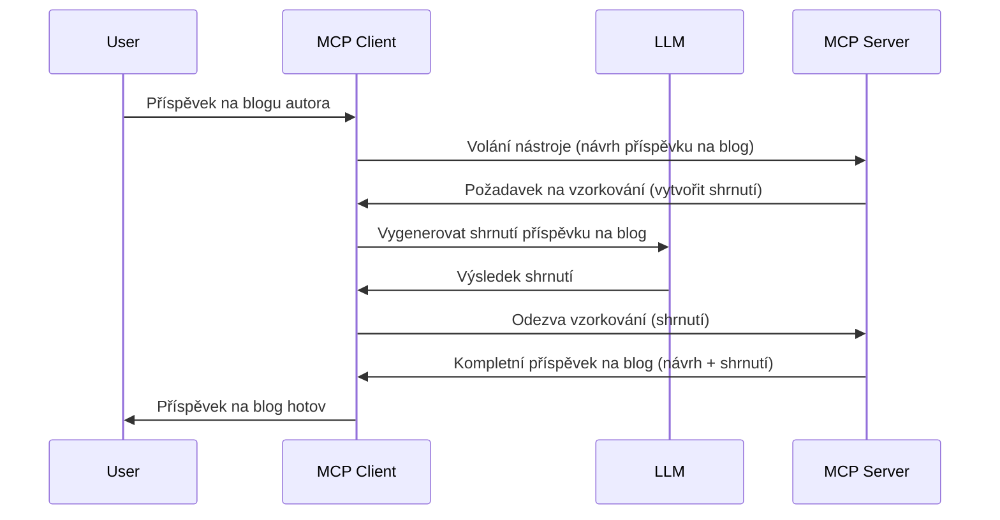

> [!WARNING]
> Odběr vzorků je v MCP `2026-07-28` zastaralý. Tato lekce je zachována pro
> starší implementace. Nové servery by měly integrovat přímo s API poskytovatele LLM.


# Odběr vzorků – delegování funkcí klientovi

> Odběr vzorků zůstává ve specifikaci `2026-07-28` pro kompatibilitu a může být
> odstraněn v první revizi vydané dne nebo po 28. červenci
> 2027. Příklady v této lekci mohou používat SDK API implementující `2025-11-25`.
> Viz [Co se změnilo v MCP: Specifikace 2026-07-28](../../01-CoreConcepts/mcp-2026-07-28.md).

V starších implementacích umožňuje odběr vzorků MCP serveru požádat o pomoc LLM
spravované klientem. U nových implementací raději volejte přímo vybraného poskytovatele LLM.


## Přehled

V této lekci se zaměříme na vysvětlení, kdy a kde používat odběr vzorků a jak jej nakonfigurovat.

## Cíle učení

V této kapitole:

- Vysvětlíme, co odběr vzorků je a kdy jej používat.
- Ukážeme, jak nakonfigurovat odběr vzorků v MCP.
- Poskytneme příklady použití odběru vzorků v praxi.

## Co je odběr vzorků a proč jej používat?

Odběr vzorků je pokročilá funkce, která funguje následujícím způsobem:



### Požadavek na odběr vzorků

Dobře, nyní máme obecný přehled věrohodného scénáře, pojďme si povědět o požadavku na odběr vzorků, který server posílá zpět klientovi. Takto může vypadat takový požadavek ve formátu JSON-RPC:

```json
{
  "jsonrpc": "2.0",
  "id": 1,
  "method": "sampling/createMessage",
  "params": {
    "messages": [
      {
        "role": "user",
        "content": {
          "type": "text",
          "text": "Create a blog post summary of the following blog post: <BLOG POST>"
        }
      }
    ],
    "modelPreferences": {
      "hints": [
        {
          "name": "claude-3-sonnet"
        }
      ],
      "intelligencePriority": 0.8,
      "speedPriority": 0.5
    },
    "systemPrompt": "You are a helpful assistant.",
    "maxTokens": 100
  }
}
```

Několik věcí je zde důležité vyzdvihnout:

- Prompt, v obsahu -> text, je náš prompt, což je instrukce pro LLM, aby shrnulo obsah blogového příspěvku.

- **modelPreferences**. Tato sekce jsou jen preference, doporučení, jaké nastavení použít u LLM. Uživatel si může vybrat, zda tyto doporučení přijme nebo změní. V tomto případě jsou doporučení ohledně modelu, rychlosti a priorit inteligence.
- **systemPrompt**, to je standardní systémový prompt, který dává vašemu LLM osobnost a obsahuje pokyny.
- **maxTokens**, další vlastnost, která říká, kolik tokenů je doporučeno použít pro tento úkol.

### Odpověď na odběr vzorků

Tato odpověď je to, co nakonec klient MCP pošle zpět MCP serveru a je výsledkem toho, že klient zavolal LLM, počkal na odpověď a pak sestavil tuto zprávu. Takto může vypadat ve formátu JSON-RPC:

```json
{
  "jsonrpc": "2.0",
  "id": 1,
  "result": {
    "role": "assistant",
    "content": {
      "type": "text",
      "text": "Here's your abstract <ABSTRACT>"
    },
    "model": "gpt-5",
    "stopReason": "endTurn"
  }
}
```

Všimněte si, že odpověď je abstrakt blogového příspěvku, přesně jak jsme požadovali. Také si všimněte, že použitý `model` není ten, o který jsme žádali, ale „gpt-5“ místo „claude-3-sonnet“. To má ukázat, že uživatel si může změnit názor na to, co použít a že váš požadavek na odběr vzorků je doporučením.

Dobře, teď když rozumíme hlavnímu toku a užitečnému úkolu „vytváření blogového příspěvku + abstrakt“, podívejme se, co musíme udělat, aby to fungovalo.

### Typy zpráv

Zprávy pro odběr vzorků nejsou omezeny jen na text, můžete také posílat obrázky a zvuk. Takto JSON-RPC vypadá jinak:

**Text**

```json
{
  "type": "text",
  "text": "The message content"
}
```

**Obsah obrázku**


```json
{
  "type": "image",
  "data": "base64-encoded-image-data",
  "mimeType": "image/jpeg"
}
```

**Zvukový obsah**

```json
{
  "type": "audio",
  "data": "base64-encoded-audio-data",
  "mimeType": "audio/wav"
}
```

> POZNÁMKA: Pro aktuální stav a pokyny k migraci viz
> [zastaralá dokumentace Sampling](https://modelcontextprotocol.io/specification/2026-07-28/client/sampling).

## Jak nakonfigurovat Sampling v klientu

> Poznámka: pokud pouze vytváříte server, nemusíte zde příliš zasahovat.

V klientu je potřeba následující funkci specifikovat takto:

```json
{
  "capabilities": {
    "sampling": {}
  }
}
```

To bude následně použito při inicializaci vámi vybraného klienta se serverem.

## Příklad Sampling v praxi - Vytvoření blogového příspěvku

Napíšeme společně sampling server, budeme muset udělat následující:

1. Vytvořit nástroj na serveru.
1. Tento nástroj by měl vytvořit sampling požadavek.
1. Nástroj by měl počkat na odpověď na sampling požadavek od klienta.
1. Poté by měl být vytvořen výsledek nástroje.

Podíváme se na kód krok za krokem:

### -1- Vytvořte nástroj

**python**

```python
@mcp.tool()
async def create_blog(title: str, content: str, ctx: Context[ServerSession, None]) -> str:
    """Create a blog post and generate a summary"""

```

### -2- Vytvořte sampling požadavek

Rozšiřte svůj nástroj o následující kód:

**python**

```python
post = BlogPost(
        id=len(posts) + 1,
        title=title,
        content=content,
        abstract=""
    )

prompt = f"Create an abstract of the following blog post: title: {title} and draft: {content} "

result = await ctx.session.create_message(
        messages=[
            SamplingMessage(
                role="user",
                content=TextContent(type="text", text=prompt),
            )
        ],
        max_tokens=100,
)

```

### -3- Počkejte na odpověď a vraťte odpověď

**python**

```python
post.abstract = result.content.text

posts.append(post)

# vraťte kompletní produkt
return json.dumps({
    "id": post.title,
    "abstract": post.abstract
})
```

### -4- Kompletní kód

**python**

```python
from starlette.applications import Starlette
from starlette.routing import Mount, Host

from mcp.server.fastmcp import Context, FastMCP

from mcp.server.session import ServerSession
from mcp.types import SamplingMessage, TextContent

import json


from uuid import uuid4
from typing import List
from pydantic import BaseModel


mcp = FastMCP("Blog post generator")

# app = FastAPI()

posts = []

class BlogPost(BaseModel):
    id: int
    title: str
    content: str
    abstract: str

posts: List[BlogPost] = []

@mcp.tool()
async def create_blog(title: str, content: str, ctx: Context[ServerSession, None]) -> str:
    """Create a blog post and generate a summary"""

    post = BlogPost(
        id=len(posts) + 1,
        title=title,
        content=content,
        abstract=""
    )

    prompt = f"Create an abstract of the following blog post: title: {title} and draft: {content} "

    result = await ctx.session.create_message(
        messages=[
            SamplingMessage(
                role="user",
                content=TextContent(type="text", text=prompt),
            )
        ],
        max_tokens=100,
    )

    post.abstract = result.content.text

    posts.append(post)

    # vraťte celý příspěvek na blog
    return json.dumps({
        "id": post.title,
        "abstract": post.abstract
    })

if __name__ == "__main__":
    print("Starting server...")
    # mcp.run()
    mcp.run(transport="streamable-http")

# spusťte aplikaci pomocí: python server.py
```

### -5- Testování ve Visual Studio Code

Pro testování ve Visual Studio Code udělejte toto:

1. Spusťte server v terminálu.
1. Přidejte jej do *mcp.json* (a ujistěte se, že je spuštěn), například takto:

   ```json
   "servers": {
      "blog-server": {
        "type": "http",
        "url": "http://localhost:8000/mcp"
      }
   }
   ```

1. Zadejte prompt:

   ```text
   create a blog post named "Where Python comes from", the content is "Python is actually named after Monty Python Flying Circus"
   ```

1. Povolit sampling. Při prvním testování budete vyzváni k přijetí dalšího dialogu, poté uvidíte normální dialog žádající vás o spuštění nástroje.

1. Zkontrolujte výsledky. Uvidíte výsledky hezky vykreslené v GitHub Copilot Chat, ale můžete si také prohlédnout syrovou odpověď v JSON.

**Bonus**. Nástroje Visual Studio Code mají skvělou podporu pro sampling. Sampling přístup k vašemu nainstalovanému serveru můžete konfigurovat takto:

1. Navigujte do sekce rozšíření.
1. Vyberte ikonu ozubeného kola u vašeho nainstalovaného serveru v sekci "MCP SERVERS - INSTALLED".
1 Vyberte "Configure Model Access", zde můžete vybrat, které modely GitHub Copilot smí používat při provádění sampling. Můžete také zobrazit všechny nedávné sampling požadavky výběrem "Show Sampling requests".

## Zadání

V tomto zadání vytvoříte trochu jiný Sampling, konkrétně integraci sampling pro generování popisu produktu. Zde je váš scénář:

**Scénář**: Zaměstnanec back office v e-commerce potřebuje pomoc, generování popisů produktů mu zabírá příliš mnoho času. Proto máte vytvořit řešení, kde zavoláte nástroj "create_product" s argumenty "title" a "keywords" a vytvoří kompletní produkt včetně pole "description", které bude vyplněno LLM klienta.

TIP: použijte, co jste se naučili dříve k vytvoření tohoto serveru a jeho nástroje pomocí sampling požadavku.

## Řešení

[Řešení](./solution/README.md)

## Klíčová poučení


Sampling je silná funkce, která umožňuje serveru delegovat úkoly klientovi, když potřebuje pomoc LLM.

## Co dál

- [Kapitola 4 - Praktická implementace](../../04-PracticalImplementation/README.md)

---

<!-- CO-OP TRANSLATOR DISCLAIMER START -->
**Prohlášení o omezení odpovědnosti**:
Tento dokument byl přeložen pomocí AI překladatelské služby [Co-op Translator](https://github.com/Azure/co-op-translator). Přestože usilujeme o co největší přesnost, mějte prosím na paměti, že automatizované překlady mohou obsahovat chyby nebo nepřesnosti. Originální dokument v jeho mateřském jazyce by měl být považován za autoritativní zdroj. Pro kritické informace se doporučuje profesionální lidský překlad. Nejsme odpovědní za jakékoli nedorozumění nebo nesprávné interpretace vzniklé použitím tohoto překladu.
<!-- CO-OP TRANSLATOR DISCLAIMER END -->