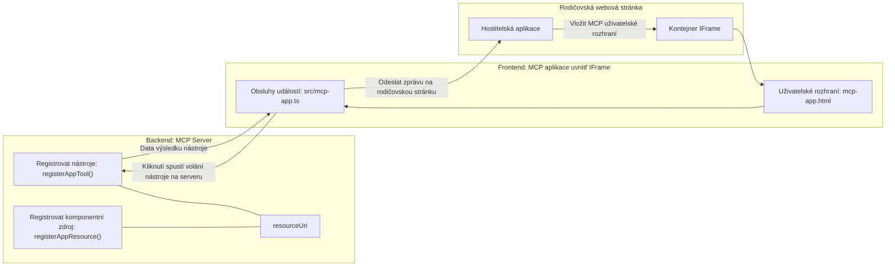
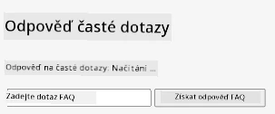
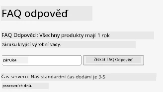
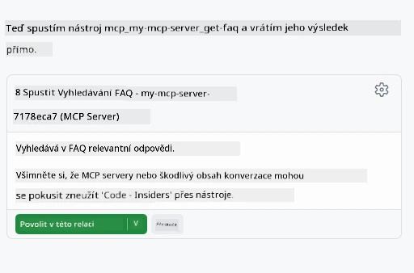
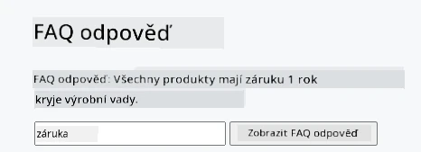

# MCP Apps

MCP Apps jsou novým paradigmatem v MCP. Myšlenka je taková, že nejenže odpovíte daty zpět z volání nástroje, ale také poskytnete informace o tom, jak by s těmito informacemi mělo být interagováno. To znamená, že výsledky nástrojů nyní mohou obsahovat informace o uživatelském rozhraní. Proč bychom to ale chtěli? No, vezměte v úvahu, jak věci děláte dnes. Pravděpodobně konzumujete výsledky MCP Serveru tím, že před něj dáte nějaký frontend, což je kód, který musíte psát a udržovat. Někdy je to, co chcete, ale jindy by bylo skvělé, kdybyste mohli prostě přinést úryvek informací, který je soběstačný a má všechno od dat po uživatelské rozhraní.

## Přehled

Tato lekce poskytuje praktické pokyny o MCP Apps, jak s nimi začít a jak je integrovat do vašich stávajících webových aplikací. MCP Apps jsou velmi novým přírůstkem do MCP Standardu.

## Výukové cíle

Na konci této lekce budete schopni:

- Vysvětlit, co jsou MCP Apps.
- Kdy použít MCP Apps.
- Vytvořit a integrovat vlastní MCP Apps.

## MCP Apps – jak to funguje

Myšlenka MCP Apps je poskytnout odpověď, která je v podstatě komponentou k vykreslení. Taková komponenta může mít jak vizuální prvky, tak interaktivitu, např. kliknutí na tlačítka, zadávání uživatele a další. Začněme na straně serveru a našeho MCP Serveru. Pro vytvoření komponenty MCP App potřebujete vytvořit nástroj, ale také zdroj aplikace. Tyto dvě části jsou propojeny pomocí resourceUri.

Tady je příklad. Pojďme si vizualizovat, co je zapojeno a která část co dělá:

```text
server.ts -- responsible for registering tools and the component as a UI component
src/
  mcp-app.ts -- wiring up event handlers
mcp-app.html -- the user interface
```

Tento obrázek popisuje architekturu pro vytvoření komponenty a její logiku.


Pojďme si nyní popsat odpovědnosti backendu a frontendu.

### Backend

Musíme zde splnit dvě věci:

- Zaregistrovat nástroje, se kterými chceme interagovat.
- Definovat komponentu.

**Registrace nástroje**

```typescript
registerAppTool(
    server,
    "get-time",
    {
      title: "Get Time",
      description: "Returns the current server time.",
      inputSchema: {},
      _meta: { ui: { resourceUri } }, // Propojí tento nástroj s jeho uživatelským rozhraním
    },
    async () => {
      const time = new Date().toISOString();
      return { content: [{ type: "text", text: time }] };
    },
  );

```

Předchozí kód popisuje chování, kde je exponován nástroj nazvaný `get-time`. Nemá žádné vstupy, ale nakonec vrací aktuální čas. Máme možnost definovat `inputSchema` pro nástroje, kde musíme být schopni přijímat vstupy od uživatele.

**Registrace komponenty**

Ve stejném souboru také musíme zaregistrovat komponentu:

```typescript
const resourceUri = "ui://get-time/mcp-app.html";

// Zaregistrujte zdroj, který vrací zabalený HTML/JavaScript pro uživatelské rozhraní.
registerAppResource(
  server,
  resourceUri,
  resourceUri,
  { mimeType: RESOURCE_MIME_TYPE },
  async () => {
    const html = await fs.readFile(path.join(DIST_DIR, "mcp-app.html"), "utf-8");

    return {
    contents: [
        { uri: resourceUri, mimeType: RESOURCE_MIME_TYPE, text: html },
    ],
    };
  },
);
```

Všimněte si, jak zmiňujeme `resourceUri`, aby se komponenta propojila se svými nástroji. Zajímavá je také zpětná volání, kde načítáme soubor uživatelského rozhraní a vracíme komponentu.

### Frontend komponenty

Stejně jako backend má i frontend dvě části:

- Frontend napsaný v čistém HTML.
- Kód, který zpracovává události a co dělat, např. volání nástrojů nebo zasílání zpráv rodičovskému oknu.

**Uživatelské rozhraní**

Podívejme se na uživatelské rozhraní.

```html
<!-- mcp-app.html -->
<!DOCTYPE html>
<html lang="en">
  <head>
    <meta charset="UTF-8" />
    <title>Get Time App</title>
  </head>
  <body>
    <p>
      <strong>Server Time:</strong> <code id="server-time">Loading...</code>
    </p>
    <button id="get-time-btn">Get Server Time</button>
    <script type="module" src="/src/mcp-app.ts"></script>
  </body>
</html>
```

**Připojení událostí**

Poslední částí je připojení událostí. To znamená, že identifikujeme, která část uživatelského rozhraní potřebuje posluchače událostí a co dělat, když jsou události vyvolány:

```typescript
// mcp-app.ts

import { App } from "@modelcontextprotocol/ext-apps";

// Získat odkazy na prvky
const serverTimeEl = document.getElementById("server-time")!;
const getTimeBtn = document.getElementById("get-time-btn")!;

// Vytvořit instanci aplikace
const app = new App({ name: "Get Time App", version: "1.0.0" });

// Zpracovat výsledky nástrojů ze serveru. Nastavte před `app.connect()`, aby se předešlo
// zmeškání počátečního výsledku nástroje.
app.ontoolresult = (result) => {
  const time = result.content?.find((c) => c.type === "text")?.text;
  serverTimeEl.textContent = time ?? "[ERROR]";
};

// Připojit kliknutí na tlačítko
getTimeBtn.addEventListener("click", async () => {
  // `app.callServerTool()` umožňuje UI požadovat čerstvá data ze serveru
  const result = await app.callServerTool({ name: "get-time", arguments: {} });
  const time = result.content?.find((c) => c.type === "text")?.text;
  serverTimeEl.textContent = time ?? "[ERROR]";
});

// Připojit se k hostiteli
app.connect();
```

Jak vidíte výše, jedná se o běžný kód k připojení prvků DOM k událostem. Stojí za zmínku volání `callServerTool`, které nakonec volá nástroj na backendu.

## Práce s uživatelským vstupem

Zatím jsme viděli komponentu, která má tlačítko, které po kliknutí volá nástroj. Podívejme se, jestli můžeme přidat další UI prvky jako vstupní pole a zda můžeme posílat argumenty do nástroje. Implementujeme funkčnost FAQ. Tady je, jak by to mělo fungovat:

- Mělo by být tlačítko a vstupní prvek, kde uživatel zadá klíčové slovo k vyhledání, například "Shipping" (doprava). To by mělo volat nástroj na backendu, který provede vyhledávání v datech FAQ.
- Nástroj, který podporuje zmíněné vyhledávání FAQ.

Nejprve přidáme potřebnou podporu na backend:

```typescript
const faq: { [key: string]: string } = {
    "shipping": "Our standard shipping time is 3-5 business days.",
    "return policy": "You can return any item within 30 days of purchase.",
    "warranty": "All products come with a 1-year warranty covering manufacturing defects.",
  }

registerAppTool(
    server,
    "get-faq",
    {
      title: "Search FAQ",
      description: "Searches the FAQ for relevant answers.",
      inputSchema: zod.object({
        query: zod.string().default("shipping"),
      }),
      _meta: { ui: { resourceUri: faqResourceUri } }, // Propojuje tento nástroj s jeho zdrojem uživatelského rozhraní
    },
    async ({ query }) => {
      const answer: string = faq[query.toLowerCase()] || "Sorry, I don't have an answer for that.";
      return { content: [{ type: "text", text: answer }] };
    },
  );
```

Co zde vidíme, je jak naplňujeme `inputSchema` a dáváme mu `zod` schéma takto:

```typescript
inputSchema: zod.object({
  query: zod.string().default("shipping"),
})
```

Ve výše uvedeném schématu deklarujeme, že máme vstupní parametr nazvaný `query`, který je nepovinný s výchozí hodnotou "shipping".

Dobře, pojďme se podívat do *mcp-app.html*, jaké UI je potřeba vytvořit:

```html
<div class="faq">
    <h1>FAQ response</h1>
    <p>FAQ Response: <code id="faq-response">Loading...</code></p>
    <input type="text" id="faq-query" placeholder="Enter FAQ query" />
    <button id="get-faq-btn">Get FAQ Response</button>
  </div>
```

Skvěle, nyní máme vstupní prvek a tlačítko. Přejděme do *mcp-app.ts* a připojme tyto události:

```typescript
const getFaqBtn = document.getElementById("get-faq-btn")!;
const faqQueryInput = document.getElementById("faq-query") as HTMLInputElement;

getFaqBtn.addEventListener("click", async () => {
  const query = faqQueryInput.value;
  const result = await app.callServerTool({ name: "get-faq", arguments: { query } });
  const faq = result.content?.find((c) => c.type === "text")?.text;
  faqResponseEl.textContent = faq ?? "[ERROR]";
});
```

V uvedeném kódu:

- Vytváříme reference na zajímavé UI prvky.
- Zpracováváme kliknutí tlačítka tak, že získáme hodnotu ze vstupního pole a voláme `app.callServerTool()` s `name` a `arguments`, kde druhý předává `query` jako hodnotu.

Co se skutečně stane, když zavoláte `callServerTool` je, že se odešle zpráva rodičovskému oknu a toto okno nakonec volá MCP Server.

### Vyzkoušejte si to

Když to vyzkoušíme, měli bychom nyní vidět následující:



a tady je příklad se vstupem jako "warranty" (záruka)



Chcete-li spustit tento kód, otevřete sekci [Code](./code/README.md)

## Testování ve Visual Studio Code

Visual Studio Code má skvělou podporu pro MVP Apps a je pravděpodobně jedním z nejjednodušších způsobů testování vašich MCP Apps. Pro použití Visual Studio Code přidejte do *mcp.json* položku serveru takto:

```json
"my-mcp-server-7178eca7": {
    "url": "http://localhost:3001/mcp",
    "type": "http"
  }
```

Pak spusťte server, měli byste být schopni komunikovat s vaší MVP App přes Chat Window za předpokladu, že máte nainstalovaný GitHub Copilot.

aktivací pomocí promptu, například "#get-faq":



a stejně jako při spuštění ve webovém prohlížeči, vykreslí se to stejným způsobem takto:



## Zadání

Vytvořte hru kámen nůžky papír. Měla by obsahovat následující:

UI:

- rozbalovací seznam s možnostmi
- tlačítko pro odeslání volby
- štítek ukazující kdo co vybral a kdo vyhrál

Server:

- měl by mít nástroj rock paper scissor, který bere "choice" jako vstup. Měl by také vygenerovat volbu počítače a určit vítěze

## Řešení

[Řešení](./assignment/README.md)

## Shrnutí

Naučili jsme se o tomto novém paradigmatě MCP Apps. Je to nové paradigma, které umožňuje MCP Serverům mít názor nejen na data, ale také na to, jak by tato data měla být prezentována.

Navíc jsme se dozvěděli, že tyto MCP Apps jsou hostovány v IFrame a pro komunikaci s MCP Servery musí posílat zprávy rodičovské webové aplikaci. Existuje několik knihoven pro čistý JavaScript, React a další, které tuto komunikaci usnadňují.

## Klíčové poznatky

Co jste se naučili:

- MCP Apps jsou nový standard, který může být užitečný, když chcete dodat jak data, tak UI funkce.
- Tento typ aplikací běží v IFrame z bezpečnostních důvodů.

## Co dál

- [Kapitola 4](../../04-PracticalImplementation/README.md)

---

<!-- CO-OP TRANSLATOR DISCLAIMER START -->
**Upozornění**:  
Tento dokument byl přeložen pomocí AI překladatelské služby [Co-op Translator](https://github.com/Azure/co-op-translator). Přestože usilujeme o přesnost, mějte prosím na paměti, že automatické překlady mohou obsahovat chyby nebo nepřesnosti. Původní dokument v jeho mateřském jazyce by měl být považován za závazný zdroj. Pro důležité informace se doporučuje využít profesionální lidský překlad. Nejsme odpovědni za jakékoli nepochopení nebo nesprávné výklady vzniklé použitím tohoto překladu.
<!-- CO-OP TRANSLATOR DISCLAIMER END -->