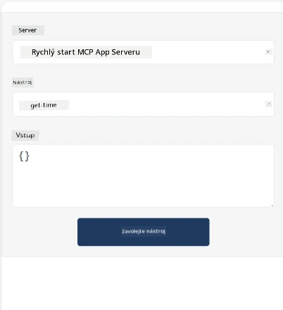
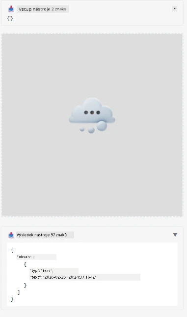

Here's a sample demonstrating MCP App

## Instalace

1. Přejděte do složky *mcp-app*  
1. Spusťte `npm install`, tím by se měly nainstalovat závislosti pro frontend i backend

Ověřte, že backend kompiluje spuštěním:

```sh
npx tsc --noEmit
```
  
Pokud je vše v pořádku, neměl by se zobrazit žádný výstup.

## Spuštění backendu

> Na Windows je potřeba udělat trochu víc práce, protože řešení MCP Apps používá knihovnu `concurrently`, pro kterou musíte najít náhradu. Zde je problematický řádek v *package.json* v MCP App:

    ```json
    "start": "concurrently \"cross-env NODE_ENV=development INPUT=mcp-app.html vite build --watch\" \"tsx watch main.ts\""
    ```

Tato aplikace má dvě části, backendovou a hostitelskou.

Spusťte backend zavoláním:

```sh
npm start
```
  
Tím by se měl backend spustit na `http://localhost:3001/mcp`.

> Poznámka: pokud jste v Codespace, možná bude potřeba nastavit viditelnost portu na veřejnou. Zkontrolujte, že můžete v prohlížeči přes https://<název Codespace>.app.github.dev/mcp endpoint dosáhnout.

## Volba -1- Testování aplikace ve Visual Studio Code

Pro otestování řešení ve Visual Studio Code proveďte následující:

- Přidejte do `mcp.json` záznam serveru takto:

    ```json
    {
        "servers": {
            "my-mcp-server-7178eca7": {
                "url": "http://localhost:3001/mcp",
                "type": "http"
            }
        },
        "inputs": []
    }
    ```
  
1. Klikněte na tlačítko „start“ v *mcp.json*  
1. Ujistěte se, že máte otevřené chat okno a napište `get-faq`, měli byste vidět výsledek jako na obrázku:

    

## Volba -2- Testování aplikace s hostem

Repozitář <https://github.com/modelcontextprotocol/ext-apps> obsahuje několik různých hostů, které můžete použít k testování vašich MVP Apps.

Zde vám představíme dvě možnosti:

### Lokální počítač

- Přejděte do složky *ext-apps* poté, co jste si repo naklonovali.

- Nainstalujte závislosti

   ```sh
   npm install
   ```
  
- V samostatném terminálu přejděte do *ext-apps/examples/basic-host*

    > Pokud jste v Codespace, je potřeba přejít do serve.ts na řádku 27 a nahradit http://localhost:3001/mcp adresou vašeho Codespace pro backend, například https://psychic-xylophone-657rpjgvxpc5g64-3001.app.github.dev/mcp

- Spusťte hosta:

    ```sh
    npm start
    ```
  
    Tím by se měl host připojit k backendu a aplikace by měla běžet takto:

    

### Codespace

Pro fungování prostředí Codespace je potřeba trochu více práce. Pro použití hostitele v Codespace:

- Prohlédněte si adresář *ext-apps* a přejděte do *examples/basic-host*.  
- Spusťte `npm install` pro instalaci závislostí  
- Spusťte `npm start` ke spuštění hosta.

## Otestování aplikace

Vyzkoušejte aplikaci následujícím způsobem:

- Vyberte tlačítko „Call Tool“ a měli byste vidět výsledky takto:

    

Skvělé, vše funguje.

---

<!-- CO-OP TRANSLATOR DISCLAIMER START -->
**Upozornění**:  
Tento dokument byl přeložen pomocí AI překladatelské služby [Co-op Translator](https://github.com/Azure/co-op-translator). Přestože usilujeme o přesnost, mějte prosím na paměti, že automatické překlady mohou obsahovat chyby nebo nepřesnosti. Originální dokument v jeho mateřském jazyce by měl být považován za autoritativní zdroj. Pro kritické informace se doporučuje profesionální lidský překlad. Nejsme odpovědni za jakákoliv nedorozumění nebo mylné interpretace vzniklé z použití tohoto překladu.
<!-- CO-OP TRANSLATOR DISCLAIMER END -->