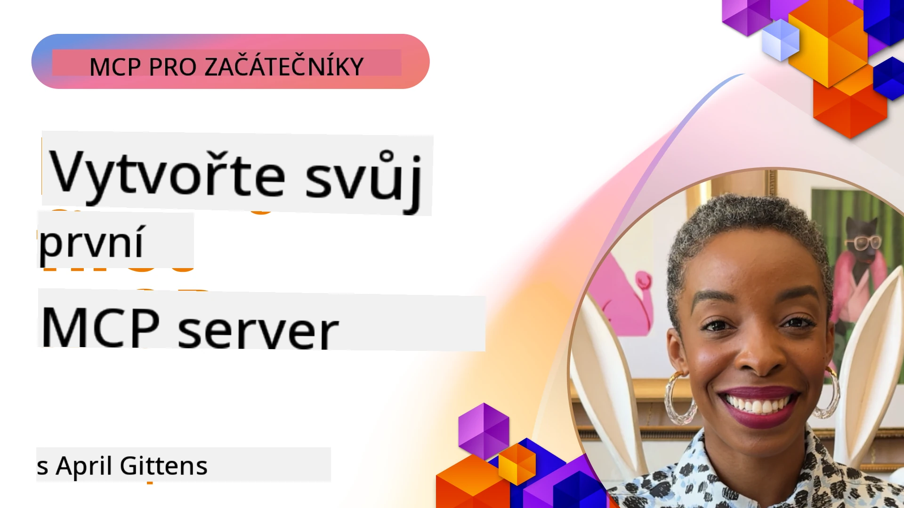

## Začínáme  

_(Klikněte na obrázek výše pro zobrazení videa této lekce)_

Tato sekce se skládá z několika lekcí:

- **1 Váš první server**, v této první lekci se naučíte, jak vytvořit svůj první server a prohlédnout si jej pomocí nástroje inspector, což je užitečný způsob, jak testovat a ladit server, [k lekci](01-first-server/README.md)

- **2 Klient**, v této lekci se naučíte, jak napsat klienta, který se dokáže připojit k vašemu serveru, [k lekci](02-client/README.md)

- **3 Klient s LLM**, ještě lepším způsobem psaní klienta je přidání LLM, takže může s vaším serverem "jednat" o tom, co dělat, [k lekci](03-llm-client/README.md)

- **4 Konzumace režimu Agenta GitHub Copilot serveru ve Visual Studio Code**. Zde se podíváme, jak spustit náš MCP Server přímo ve Visual Studio Code, [k lekci](04-vscode/README.md)

- **5 stdio Transport Server** stdio transport je doporučený standard pro lokální komunikaci MCP server-klient, poskytující bezpečnou komunikaci na bázi podprocesů s vestavěnou izolací procesů [k lekci](05-stdio-server/README.md)

- **6 HTTP Streaming s MCP (Streamable HTTP)**. Naučte se o moderním HTTP streamovacím transportu (doporučený přístup pro vzdálené MCP servery dle [MCP Specifikace 2025-11-25](https://spec.modelcontextprotocol.io/specification/2025-11-25/basic/transports/#streamable-http)), notifikacích průběhu a jak implementovat škálovatelné, real-time MCP servery a klienty pomocí Streamable HTTP. [k lekci](06-http-streaming/README.md)

- **7 Využití AI Toolkit pro VSCode** k používání a testování vašich MCP Klientů a Serverů [k lekci](07-aitk/README.md)

- **8 Testování**. Zde se zaměříme především na různé způsoby, jak testovat náš server a klienta, [k lekci](08-testing/README.md)

- **9 Nasazení**. Tato kapitola se podívá na různé způsoby nasazování vašich MCP řešení, [k lekci](09-deployment/README.md)

- **10 Pokročilé používání serveru**. Tato kapitola pokrývá pokročilé použití serveru, [k lekci](./10-advanced/README.md)

- **11 Autentizace**. Tato kapitola vysvětluje, jak přidat jednoduchou autentizaci, od Basic Auth po použití JWT a RBAC. Doporučuje se začít zde a poté se podívat na pokročilá témata v kapitole 5 a provést další zabezpečení podle doporučení v kapitole 2, [k lekci](./11-simple-auth/README.md)

- **12 MCP Hosté**. Konfigurace a používání populárních MCP host klientů včetně Claude Desktop, Cursor, Cline a Windsurf. Naučte se typy transportů a řešení problémů, [k lekci](./12-mcp-hosts/README.md)

- **13 MCP Inspector**. Interaktivně ladit a testovat vaše MCP servery pomocí nástroje MCP Inspector. Naučte se diagnostikovat nástroje, zdroje a protokolové zprávy, [k lekci](./13-mcp-inspector/README.md)

- **14 Sampling**. Vytvářejte MCP Servery, které spolupracují s MCP klienty na úlohách souvisejících s LLM. [k lekci](./14-sampling/README.md)

- **15 MCP Apps**. Stavte MCP Servery, které také odpovídají s UI instrukcemi, [k lekci](./15-mcp-apps/README.md)

Model Context Protocol (MCP) je otevřený protokol, který standardizuje, jak aplikace poskytují kontext LLM modelům. MCP si představte jako USB-C port pro AI aplikace – poskytuje standardizovaný způsob připojení AI modelů k různým zdrojům dat a nástrojům.

## Cíle učení

Na konci této lekce budete schopni:

- Nastavit vývojové prostředí pro MCP v C#, Java, Python, TypeScript a JavaScript
- Vytvářet a nasazovat základní MCP servery s vlastními funkcemi (zdroje, výzvy a nástroje)
- Vytvářet hostitelské aplikace, které se připojují k MCP serverům
- Testovat a ladit implementace MCP
- Pochopit běžné problémy při nastavení a jejich řešení
- Připojit vaše MCP implementace k populárním LLM službám

## Nastavení vašeho MCP prostředí

Než začnete pracovat s MCP, je důležité připravit si vývojové prostředí a pochopit základní workflow. Tato sekce vás provede úvodními kroky, aby byl start s MCP plynulý.

### Požadavky

Než se pustíte do vývoje MCP, ujistěte se, že máte:

- **Vývojové prostředí**: Pro vybraný jazyk (C#, Java, Python, TypeScript nebo JavaScript)
- **IDE/Editory**: Visual Studio, Visual Studio Code, IntelliJ, Eclipse, PyCharm nebo jakýkoli moderní kódový editor
- **Správce balíčků**: NuGet, Maven/Gradle, pip nebo npm/yarn
- **API klíče**: Pro všechny AI služby, které plánujete v host aplikacích používat

### Oficiální SDK

V následujících kapitolách uvidíte řešení postavená pomocí Pythonu, TypeScriptu, Javy a .NET. Zde jsou všechny oficiálně podporované SDK.

MCP poskytuje oficiální SDK pro několik jazyků (v souladu s [MCP Specifikací 2025-11-25](https://spec.modelcontextprotocol.io/specification/2025-11-25/)):
- [C# SDK](https://github.com/modelcontextprotocol/csharp-sdk) - Udržováno ve spolupráci s Microsoftem
- [Java SDK](https://github.com/modelcontextprotocol/java-sdk) - Udržováno ve spolupráci se Spring AI
- [TypeScript SDK](https://github.com/modelcontextprotocol/typescript-sdk) - Oficiální implementace TypeScriptu
- [Python SDK](https://github.com/modelcontextprotocol/python-sdk) - Oficiální implementace Pythonu (FastMCP)
- [Kotlin SDK](https://github.com/modelcontextprotocol/kotlin-sdk) - Oficiální implementace Kotlinu
- [Swift SDK](https://github.com/modelcontextprotocol/swift-sdk) - Udržováno ve spolupráci s Loopwork AI
- [Rust SDK](https://github.com/modelcontextprotocol/rust-sdk) - Oficiální implementace Rustu
- [Go SDK](https://github.com/modelcontextprotocol/go-sdk) - Oficiální implementace Go

## Hlavní poznatky

- Nastavení vývojového prostředí pro MCP je jednoduché pomocí jazykově specifických SDK
- Vytváření MCP serverů zahrnuje vytváření a registraci nástrojů s jasnými schématy
- MCP klienti se připojují k serverům a modelům, aby využili rozšířené schopnosti
- Testování a ladění jsou nezbytné pro spolehlivé MCP implementace
- Možnosti nasazení sahají od lokálního vývoje po cloudová řešení

## Procvičování

Máme sadu ukázek, které doplňují cvičení, jež uvidíte ve všech kapitolách této sekce. Každá kapitola má také své vlastní cvičení a úkoly.

- [Java Kalkulačka](./samples/java/calculator/README.md)
- [.Net Kalkulačka](../../../03-GettingStarted/samples/csharp)
- [JavaScript Kalkulačka](./samples/javascript/README.md)
- [TypeScript Kalkulačka](./samples/typescript/README.md)
- [Python Kalkulačka](../../../03-GettingStarted/samples/python)

## Další zdroje

- [Vytváření agentů pomocí Model Context Protocol na Azure](https://learn.microsoft.com/azure/developer/ai/intro-agents-mcp)
- [Vzdálený MCP s Azure Container Apps (Node.js/TypeScript/JavaScript)](https://learn.microsoft.com/samples/azure-samples/mcp-container-ts/mcp-container-ts/)
- [.NET OpenAI MCP Agent](https://learn.microsoft.com/samples/azure-samples/openai-mcp-agent-dotnet/openai-mcp-agent-dotnet/)

## Co dál

Začněte první lekcí: [Vytvoření vašeho prvního MCP serveru](01-first-server/README.md)

Jakmile dokončíte tento modul, pokračujte na: [Modul 4: Praktická implementace](../04-PracticalImplementation/README.md)

---

<!-- CO-OP TRANSLATOR DISCLAIMER START -->
**Upozornění**:  
Tento dokument byl přeložen pomocí služby automatického překladu AI [Co-op Translator](https://github.com/Azure/co-op-translator). Přestože usilujeme o přesnost, mějte prosím na paměti, že automatizované překlady mohou obsahovat chyby nebo nepřesnosti. Originální dokument v jeho mateřském jazyce by měl být považován za závazný zdroj. Pro důležité informace je doporučen profesionální lidský překlad. Nebereme žádnou odpovědnost za nedorozumění nebo nesprávné výklady vyplývající z použití tohoto překladu.
<!-- CO-OP TRANSLATOR DISCLAIMER END -->