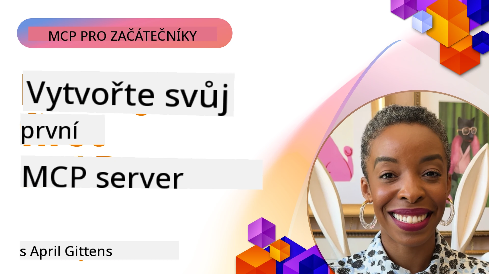

## Začínáme  

_(Klikněte na obrázek výše pro zobrazení videa k této lekci)_

Tato sekce se skládá z několika lekcí:

- **1 Váš první server**, v této první lekci se naučíte, jak vytvořit váš první server a prohlédnout ho pomocí nástroje inspector, což je cenný způsob testování a ladění vašeho serveru, [k lekci](01-first-server/README.md)

- **2 Klient**, v této lekci se naučíte, jak napsat klienta, který se může připojit k vašemu serveru, [k lekci](02-client/README.md)

- **3 Klient s LLM**, ještě lepší způsob, jak napsat klienta, je přidat k němu LLM, aby "vyjednával" se serverem, co dělat, [k lekci](03-llm-client/README.md)

- **4 Používání režimu GitHub Copilot Agenta serveru v Visual Studio Code**. Zde se podíváme, jak spustit náš MCP server přímo ve Visual Studio Code, [k lekci](04-vscode/README.md)

- **5 stdio Transport Server** stdio transport je doporučený standard pro lokální komunikaci MCP server-klient, poskytující bezpečnou komunikaci založenou na podprocesu s vestavěnou izolací procesů [k lekci](05-stdio-server/README.md)

- **6 HTTP streamování s MCP (Streamable HTTP)**. Naučte se o standardním
	vzdáleném transportu v [MCP specifikaci 2026-07-28](https://modelcontextprotocol.io/specification/2026-07-28/basic/transports/streamable-http),
	plus o zachované starší implementaci založené na sezení v lekci.
	[k lekci](06-http-streaming/README.md)

- **7 Využívání AI Toolkit pro VSCode** ke spotřebování a testování vašich MCP klientů a serverů [k lekci](07-aitk/README.md)

- **8 Testování**. Zde se zaměříme zejména na různé způsoby, jak testovat náš server a klienta, [k lekci](08-testing/README.md)

- **9 Nasazení**. Tato kapitola se zabývá různými způsoby nasazení vašich MCP řešení, [k lekci](09-deployment/README.md)

- **10 Pokročilé využití serveru**. Tato kapitola pokrývá pokročilé použití serveru, [k lekci](./10-advanced/README.md)

- **11 Autentizace**. Tato kapitola vysvětluje, jak přidat jednoduchou autentizaci, od základní autentizace po použití JWT a RBAC. Doporučujeme začít zde a pak prozkoumat Pokročilá témata v kapitole 5 a provést další zabezpečení podle doporučení v kapitole 2, [k lekci](./11-simple-auth/README.md)

- **12 MCP Hostitelé**. Konfigurace a použití populárních MCP host klientů včetně Claude Desktop, Cursor, Cline, a Windsurf. Naučte se typy transportů a řešení problémů, [k lekci](./12-mcp-hosts/README.md)

- **13 MCP Inspector**. Interaktivně laděte a testujte své MCP servery pomocí nástroje MCP Inspector. Naučte se řešit problémy s nástroji, zdroji a protokolovými zprávami, [k lekci](./13-mcp-inspector/README.md)

- **14 Sampling**. Naučte se starší primitiv Sampling pro `2025-11-25` a
	jak přejít na nové návrhy s přímou integrací poskytovatele LLM. Sampling je
	v MCP `2026-07-28` zastaralý. [k lekci](./14-sampling/README.md)

- **15 MCP Aplikace**. Vytvářejte MCP servery, které také odpovídají s UI instrukcemi, [k lekci](./15-mcp-apps/README.md)

Protokol Model Context Protocol (MCP) je otevřený protokol, který standardizuje způsob, jakým aplikace poskytují kontext LLM. MCP si představte jako USB-C port pro AI aplikace - poskytuje standardizovaný způsob propojení AI modelů s různými zdroji dat a nástroji.

## Výukové cíle

Na konci této lekce budete schopni:

- Nastavit vývojová prostředí pro MCP v C#, Java, Python, TypeScript a JavaScript
- Vytvářet a nasazovat základní MCP servery s vlastními funkcemi (zdroje, promptů a nástroje)
- Vytvářet hostitelské aplikace, které se připojují k MCP serverům
- Testovat a ladit implementace MCP
- Chápat běžné problémy s nastavením a jejich řešení
- Připojit vaše MCP implementace k populárním LLM službám

## Nastavení vašeho MCP prostředí

Než začnete pracovat s MCP, je důležité připravit si vývojové prostředí a pochopit základní pracovní postup. Tato sekce vás provede počátečními kroky nastavení, abyste měli plynulý start s MCP.

### Požadavky

Než se pustíte do vývoje MCP, ujistěte se, že máte:

- **Vývojové prostředí**: Pro vámi zvolený jazyk (C#, Java, Python, TypeScript nebo JavaScript)
- **IDE/Editor**: Visual Studio, Visual Studio Code, IntelliJ, Eclipse, PyCharm nebo jakýkoliv moderní kódový editor
- **Správce balíčků**: NuGet, Maven/Gradle, pip nebo npm/yarn
- **API klíče**: Pro jakékoliv AI služby, které plánujete používat ve vašich hostitelských aplikacích

### Oficiální SDK

V následujících kapitolách uvidíte řešení postavená pomocí Python, TypeScript,
Java a .NET. Zde jsou oficiální SDK.

Podpora SDK pro MCP `2026-07-28` se postupně zavádí nezávisle pro každý jazyk.
Před spuštěním příkladu si ověřte verzi balíčku a poznámky k vydání SDK,
zda podporuje konkrétní revize protokolu. Viz
[oficiální seznam SDK](https://modelcontextprotocol.io/docs/sdk):
- [C# SDK](https://github.com/modelcontextprotocol/csharp-sdk) - Udržováno ve spolupráci s Microsoftem
- [Java SDK](https://github.com/modelcontextprotocol/java-sdk) - Udržováno ve spolupráci se Spring AI
- [TypeScript SDK](https://github.com/modelcontextprotocol/typescript-sdk) - Oficiální implementace TypeScriptu
- [Python SDK](https://github.com/modelcontextprotocol/python-sdk) - Oficiální implementace Pythonu (FastMCP)
- [Kotlin SDK](https://github.com/modelcontextprotocol/kotlin-sdk) - Oficiální implementace Kotlinu
- [Swift SDK](https://github.com/modelcontextprotocol/swift-sdk) - Udržováno ve spolupráci s Loopwork AI
- [Rust SDK](https://github.com/modelcontextprotocol/rust-sdk) - Oficiální implementace Rustu
- [Go SDK](https://github.com/modelcontextprotocol/go-sdk) - Oficiální implementace Go

## Klíčové poznatky

- Nastavení vývojového prostředí MCP je jednoduché díky SDK pro jednotlivé jazyky
- Vytváření MCP serverů zahrnuje tvorbu a registraci nástrojů s jasnými schématy
- MCP klienti se připojují k serverům a modelům pro rozšířené možnosti
- Testování a ladění jsou nezbytné pro spolehlivé implementace MCP
- Možnosti nasazení sahají od lokálního vývoje až po cloudová řešení

## Procvičování

Máme sadu příkladů, které doplňují cvičení z všech kapitol této sekce. Navíc má každá kapitola své vlastní cvičení a zadání

- [Java Kalkulačka](./samples/java/calculator/README.md)
- [.NET Kalkulačka](../../../03-GettingStarted/samples/csharp)
- [JavaScript Kalkulačka](./samples/javascript/README.md)
- [TypeScript Kalkulačka](./samples/typescript/README.md)
- [Python Kalkulačka](../../../03-GettingStarted/samples/python)

## Další zdroje

- [Vytváření agentů pomocí Model Context Protocol na Azure](https://learn.microsoft.com/azure/developer/ai/intro-agents-mcp)
- [Vzdálené MCP s Azure Container Apps (Node.js/TypeScript/JavaScript)](https://learn.microsoft.com/samples/azure-samples/mcp-container-ts/mcp-container-ts/)
- [.NET OpenAI MCP Agent](https://learn.microsoft.com/samples/azure-samples/openai-mcp-agent-dotnet/openai-mcp-agent-dotnet/)

## Co bude dál

Začněte první lekcí: [Vytvoření vašeho prvního MCP serveru](01-first-server/README.md)

Po dokončení tohoto modulu pokračujte na: [Modul 4: Praktická implementace](../04-PracticalImplementation/README.md)

---

<!-- CO-OP TRANSLATOR DISCLAIMER START -->
**Prohlášení o omezení odpovědnosti**:
Tento dokument byl přeložen pomocí AI překladatelské služby [Co-op Translator](https://github.com/Azure/co-op-translator). Přestože usilujeme o co největší přesnost, mějte prosím na paměti, že automatizované překlady mohou obsahovat chyby nebo nepřesnosti. Originální dokument v jeho mateřském jazyce by měl být považován za autoritativní zdroj. Pro kritické informace se doporučuje profesionální lidský překlad. Nejsme odpovědní za jakékoli nedorozumění nebo nesprávné interpretace vzniklé použitím tohoto překladu.
<!-- CO-OP TRANSLATOR DISCLAIMER END -->