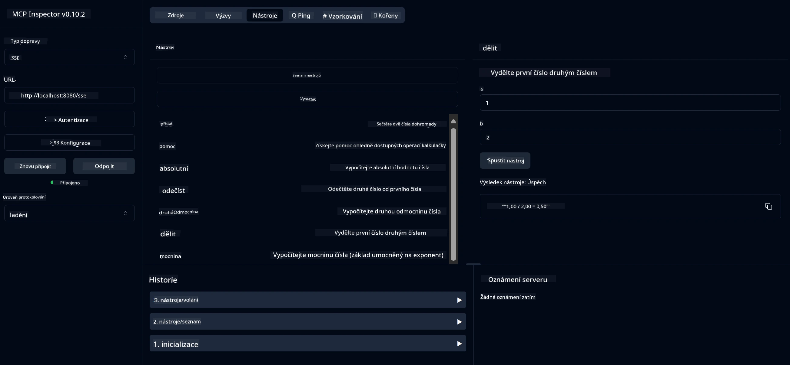

# Základní kalkulační MCP služba

> [!NOTE]
> Tento příklad používá starý transport HTTP+SSE a cílí na SDK kompatibilní
> s MCP `2025-11-25`. Nové vzdálené servery by měly používat `2026-07-28` Streamable
> HTTP podporu.

Tato služba poskytuje základní kalkulační operace prostřednictvím Model Context Protocol (MCP) za použití Spring Boot s WebFlux transportem. Je navržena jako jednoduchý příklad pro začátečníky, kteří se učí o implementacích MCP.

Pro více informací si přečtěte referenční dokumentaci [MCP Server Boot Starter](https://docs.spring.io/spring-ai/reference/api/mcp/mcp-server-boot-starter-docs.html).

## Přehled

Služba ukazuje:
- Podporu pro SSE (Server-Sent Events)
- Automatickou registraci nástrojů pomocí anotace `@Tool` ve Spring AI
- Základní kalkulační funkce:
  - Sčítání, odčítání, násobení, dělení
  - Výpočet mocniny a druhé odmocniny
  - Modulo (zbytek po dělení) a absolutní hodnota
  - Nápovědní funkce pro popisy operací

## Funkce

Tato kalkulační služba nabízí následující možnosti:

1. **Základní aritmetické operace**:
   - Sčítání dvou čísel
   - Odčítání jednoho čísla od druhého
   - Násobení dvou čísel
   - Dělení jednoho čísla druhým (s kontrolou dělení nulou)

2. **Pokročilé operace**:
   - Výpočet mocniny (umocňování základny na exponent)
   - Výpočet druhé odmocniny (s kontrolou záporných čísel)
   - Výpočet modula (zbytek po dělení)
   - Výpočet absolutní hodnoty

3. **Nápovědní systém**:
   - Vestavěná nápovědní funkce vysvětlující všechny dostupné operace

## Používání služby

Služba zpřístupňuje následující API koncové body přes MCP protokol:

- `add(a, b)`: Sečti dvě čísla dohromady
- `subtract(a, b)`: Odečti druhé číslo od prvního
- `multiply(a, b)`: Vynásob dvě čísla
- `divide(a, b)`: Vyděl první číslo druhým (s kontrolou dělení nulou)
- `power(base, exponent)`: Spočti mocninu čísla
- `squareRoot(number)`: Spočti druhou odmocninu (s kontrolou záporných čísel)
- `modulus(a, b)`: Spočti zbytek po dělení
- `absolute(number)`: Spočti absolutní hodnotu
- `help()`: Získej informace o dostupných operacích

## Testovací klient

Jednoduchý testovací klient je zahrnut v balíčku `com.microsoft.mcp.sample.client`. Třída `SampleCalculatorClient` demonstruje dostupné operace kalkulační služby.

## Použití klienta LangChain4j

Projekt obsahuje příklad klienta LangChain4j v `com.microsoft.mcp.sample.client.LangChain4jClient`, který demonstruje, jak integrovat kalkulační službu s LangChain4j a GitHub modely:

### Požadavky

1. **Nastavení GitHub tokenu**:
   
   Pro použití AI modelů GitHubu (např. phi-4) potřebujete osobní přístupový token GitHubu:

   a. Přejděte do nastavení svého GitHub účtu: https://github.com/settings/tokens
   
   b. Klikněte na "Generate new token" → "Generate new token (classic)"
   
   c. Dejte tokenu popisný název
   
   d. Vyberte následující rozsahy oprávnění:
      - `repo` (Plná kontrola nad soukromými repozitáři)
      - `read:org` (Čtení členství v organizacích a týmech, čtení projektů organizace)
      - `gist` (Vytváření gists)
      - `user:email` (Přístup ke e-mailovým adresám uživatele (pouze pro čtení))
   
   e. Klikněte na "Generate token" a zkopírujte svůj nový token
   
   f. Nastavte ho jako proměnnou prostředí:
      
      Na Windows:
      ```
      set GITHUB_TOKEN=your-github-token
      ```
      
      Na macOS/Linux:
      ```bash
      export GITHUB_TOKEN=your-github-token
      ```

   g. Pro trvalé nastavení přidejte do svých systémových proměnných prostředí

2. Přidejte závislost LangChain4j GitHub do svého projektu (již zahrnuto v pom.xml):
   ```xml
   <dependency>
       <groupId>dev.langchain4j</groupId>
       <artifactId>langchain4j-github</artifactId>
       <version>${langchain4j.version}</version>
   </dependency>
   ```

3. Ujistěte se, že kalkulační server běží na `localhost:8080`

### Spuštění klienta LangChain4j

Tento příklad předvádí:
- Připojení ke kalkulačnímu MCP serveru přes SSE transport
- Použití LangChain4j pro vytvoření chatbota, který využívá kalkulační operace
- Integraci s GitHub AI modely (nyní používá model phi-4)

Klient posílá následující ukázkové dotazy k demonstrování funkčnosti:
1. Výpočet součtu dvou čísel
2. Nalezení druhé odmocniny z čísla
3. Získání nápovědy o dostupných kalkulačních operacích

Spusťte příklad a zkontrolujte výstup v konzoli, abyste viděli, jak AI model používá kalkulační nástroje k odpovědím na dotazy.

### Konfigurace GitHub modelu

LangChain4j klient je nakonfigurován pro použití GitHub modelu phi-4 s následujícími nastaveními:

```java
ChatLanguageModel model = GitHubChatModel.builder()
    .apiKey(System.getenv("GITHUB_TOKEN"))
    .timeout(Duration.ofSeconds(60))
    .modelName("phi-4")
    .logRequests(true)
    .logResponses(true)
    .build();
```

Pro použití jiných GitHub modelů jednoduše změňte parametr `modelName` na jiný podporovaný model (např. "claude-3-haiku-20240307", "llama-3-70b-8192" atd.).

## Závislosti

Projekt vyžaduje následující klíčové závislosti:

```xml
<!-- For MCP Server -->
<dependency>
    <groupId>org.springframework.ai</groupId>
    <artifactId>spring-ai-starter-mcp-server-webflux</artifactId>
</dependency>

<!-- For LangChain4j integration -->
<dependency>
    <groupId>dev.langchain4j</groupId>
    <artifactId>langchain4j-mcp</artifactId>
    <version>${langchain4j.version}</version>
</dependency>

<!-- For GitHub models support -->
<dependency>
    <groupId>dev.langchain4j</groupId>
    <artifactId>langchain4j-github</artifactId>
    <version>${langchain4j.version}</version>
</dependency>
```

## Sestavení projektu

Sestavte projekt pomocí Maven:
```bash
./mvnw clean install -DskipTests
```

## Spuštění serveru

### Použití Java

```bash
java -jar target/calculator-server-0.0.1-SNAPSHOT.jar
```

### Použití MCP Inspectoru

MCP Inspector je užitečný nástroj pro interakci se službami MCP. Pro použití s touto kalkulační službou:

1. **Nainstalujte a spusťte MCP Inspector** v novém terminálovém okně:
   ```bash
   npx @modelcontextprotocol/inspector
   ```

2. **Přistupte k webovému UI** kliknutím na URL zobrazenou aplikací (obvykle http://localhost:6274)

3. **Nastavte připojení**:
   - Nastavte typ transportu na "SSE"
   - Nastavte URL na SSE endpoint běžícího serveru: `http://localhost:8080/sse`
   - Klikněte na "Connect"

4. **Používejte nástroje**:
   - Klikněte na "List Tools" pro zobrazení dostupných kalkulačních operací
   - Vyberte nástroj a klikněte na "Run Tool" pro spuštění operace



### Použití Dockeru

Projekt obsahuje Dockerfile pro nasazení v kontejneru:

1. **Sestavte Docker image**:
   ```bash
   docker build -t calculator-mcp-service .
   ```

2. **Spusťte Docker kontejner**:
   ```bash
   docker run -p 8080:8080 calculator-mcp-service
   ```

Tímto:
- Sestavíte multi-stage Docker image s Maven 3.9.9 a Eclipse Temurin 24 JDK
- Vytvoříte optimalizovaný image kontejneru
- Zpřístupníte službu na portu 8080
- Spustíte MCP kalkulační službu uvnitř kontejneru

Když bude kontejner spuštěn, budete moci přistupovat ke službě na `http://localhost:8080`.

## Řešení problémů

### Běžné problémy s GitHub tokenem

1. **Problémy s oprávněními tokenu**: Pokud dostanete chybu 403 Forbidden, zkontrolujte, zda má váš token správná oprávnění podle požadavků.

2. **Token nenalezen**: Pokud obdržíte chybu "No API key found", ujistěte se, že je nastavená proměnná prostředí GITHUB_TOKEN správně.

3. **Omezení rychlosti (Rate Limiting)**: GitHub API má limity na počet volání. Pokud narazíte na chybu limitu (status 429), počkejte pár minut a zkuste to znovu.

4. **Vypršení platnosti tokenu**: GitHub tokeny mohou vypršet. Pokud po čase dostáváte chyby autentizace, vygenerujte nový token a aktualizujte proměnnou prostředí.

Pokud potřebujete další pomoc, podívejte se do [dokumentace LangChain4j](https://github.com/langchain4j/langchain4j) nebo [dokumentace GitHub API](https://docs.github.com/en/rest).

---

<!-- CO-OP TRANSLATOR DISCLAIMER START -->
**Prohlášení o omezení odpovědnosti**:
Tento dokument byl přeložen pomocí AI překladatelské služby [Co-op Translator](https://github.com/Azure/co-op-translator). Přestože usilujeme o co největší přesnost, mějte prosím na paměti, že automatizované překlady mohou obsahovat chyby nebo nepřesnosti. Originální dokument v jeho mateřském jazyce by měl být považován za autoritativní zdroj. Pro kritické informace se doporučuje profesionální lidský překlad. Nejsme odpovědní za jakékoli nedorozumění nebo nesprávné interpretace vzniklé použitím tohoto překladu.
<!-- CO-OP TRANSLATOR DISCLAIMER END -->