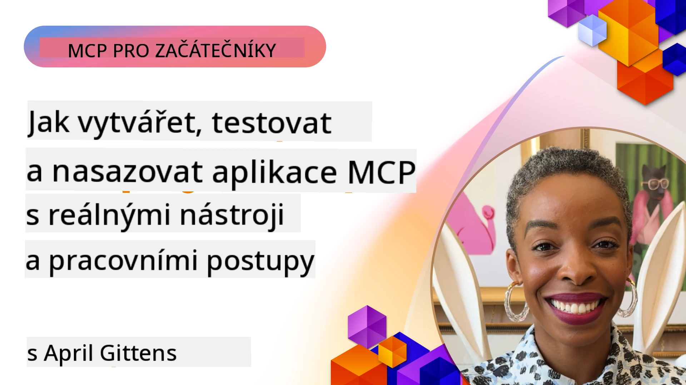

# Praktická implementace

[](https://youtu.be/vCN9-mKBDfQ)

_(Klikněte na obrázek výše pro zobrazení videa této lekce)_

Praktická implementace je místem, kde se síla Model Context Protocolu (MCP) stává hmatatelnou. Zatímco porozumění teorii a architektuře MCP je důležité, skutečná hodnota se projeví, když tyto koncepty aplikujete při vytváření, testování a nasazování řešení, která řeší reálné problémy. Tato kapitola překlene propast mezi konceptuálními znalostmi a praktickým vývojem a provede vás procesem oživení aplikací založených na MCP.

Ať už vyvíjíte inteligentní asistenty, integrujete AI do obchodních pracovních postupů nebo vytváříte vlastní nástroje pro zpracování dat, MCP poskytuje flexibilní základ. Jeho jazykově nezávislý design a oficiální SDK pro populární programovací jazyky jej zpřístupňuje širokému spektru vývojářů. Využíváním těchto SDK můžete rychle prototypovat, iterovat a škálovat svá řešení napříč různými platformami a prostředími.

V následujících sekcích najdete praktické příklady, ukázkové kódy a strategie nasazení, které demonstrují, jak implementovat MCP v C#, Java se Springem, TypeScriptu, JavaScriptu a Pythonu. Také se naučíte, jak ladit a testovat své MCP servery, spravovat API a nasazovat řešení do cloudu pomocí Azure. Tyto praktické zdroje jsou navrženy tak, aby urychlily vaše učení a pomohly vám sebejistě vyvíjet robustní MCP aplikace připravené do produkce.

## Přehled

Tato lekce se zaměřuje na praktické aspekty implementace MCP v různých programovacích jazycích. Prozkoumáme, jak používat MCP SDK v C#, Java se Springem, TypeScriptu, JavaScriptu a Pythonu k vytváření robustních aplikací, ladění a testování MCP serverů a vytváření znovupoužitelných zdrojů, promptů a nástrojů.

## Výukové cíle

Na konci této lekce budete schopni:

- Implementovat MCP řešení pomocí oficiálních SDK v různých programovacích jazycích
- Systematicky ladit a testovat MCP servery
- Vytvářet a používat funkce serveru (Resources, Prompts a Tools)
- Navrhovat efektivní MCP pracovní postupy pro složité úkoly
- Optimalizovat implementace MCP pro výkon a spolehlivost

## Oficiální SDK zdroje

Model Context Protocol nabízí oficiální SDK pro více jazyků (v souladu s [MCP Specification 2025-11-25](https://spec.modelcontextprotocol.io/specification/2025-11-25/)):

- [C# SDK](https://github.com/modelcontextprotocol/csharp-sdk)
- [Java se Springem SDK](https://github.com/modelcontextprotocol/java-sdk) **Poznámka:** vyžaduje závislost na [Project Reactor](https://projectreactor.io). (Viz [diskusní téma 246](https://github.com/orgs/modelcontextprotocol/discussions/246).)
- [TypeScript SDK](https://github.com/modelcontextprotocol/typescript-sdk)
- [Python SDK](https://github.com/modelcontextprotocol/python-sdk)
- [Kotlin SDK](https://github.com/modelcontextprotocol/kotlin-sdk)
- [Go SDK](https://github.com/modelcontextprotocol/go-sdk)

## Práce s MCP SDK

Tato sekce poskytuje praktické příklady implementace MCP v různých programovacích jazycích. Ukázkový kód najdete v adresáři `samples` uspořádaném podle jazyka.

### Dostupné ukázky

Repozitář obsahuje [ukázkové implementace](../../../04-PracticalImplementation/samples) v následujících jazycích:

- [C#](./samples/csharp/README.md)
- [Java se Springem](./samples/java/containerapp/README.md)
- [TypeScript](./samples/typescript/README.md)
- [JavaScript](./samples/javascript/README.md)
- [Python](./samples/python/README.md)

Každá ukázka demonstruje klíčové koncepty MCP a implementační vzory pro daný jazyk a ekosystém.

### Praktické průvodce

Další průvodce pro praktickou implementaci MCP:

- [Stránkování a velké datové sady](./pagination/README.md) - práce se stránkováním založeným na kurzoru pro nástroje, zdroje a velké sady dat

## Hlavní funkce serveru

MCP servery mohou implementovat libovolnou kombinaci těchto funkcí:

### Resources

Resources poskytují kontext a data pro uživatele nebo AI model k použití:

- Repozitáře dokumentů
- Znalostní báze
- Strukturované zdroje dat
- Systémy souborů

### Prompts

Prompts jsou šablonové zprávy a pracovní postupy pro uživatele:

- Předdefinované konverzační šablony
- Řízené interakční vzory
- Specializované dialogové struktury

### Tools

Tools jsou funkce pro vykonávání AI modelem:

- Nástroje pro zpracování dat
- Integrace s externími API
- Výpočetní schopnosti
- Vyhledávací funkce

## Ukázkové implementace: Implementace v C#

Oficiální repozitář C# SDK obsahuje několik ukázek implementace demonstrujících různé aspekty MCP:

- **Základní MCP klient**: jednoduchý příklad, jak vytvořit MCP klienta a volat nástroje
- **Základní MCP server**: minimální implementace serveru se základní registrací nástrojů
- **Pokročilý MCP server**: plnohodnotný server s registrací nástrojů, autentizací a zpracováním chyb
- **Integrace s ASP.NET**: příklady integrace s ASP.NET Core
- **Vzory implementace nástrojů**: různé vzory pro implementaci nástrojů s různou složitostí

MCP C# SDK je ve fázi preview a API se mohou měnit. Tento blog budeme průběžně aktualizovat dle vývoje SDK.

### Klíčové funkce

- [C# MCP Nuget ModelContextProtocol](https://www.nuget.org/packages/ModelContextProtocol)
- Vytvoření [prvního MCP serveru](https://devblogs.microsoft.com/dotnet/build-a-model-context-protocol-mcp-server-in-csharp/).

Pro kompletní ukázkové implementace v C# navštivte [oficiální repozitář C# SDK](https://github.com/modelcontextprotocol/csharp-sdk)

## Ukázková implementace: Implementace v Java se Springem

Java se Springem SDK nabízí robustní možnosti implementace MCP s podnikově zaměřenými funkcemi.

### Klíčové funkce

- Integrace Spring Frameworku
- Silná typová kontrola
- Podpora reaktivního programování
- Komplexní zpracování chyb

Pro kompletní ukázkovou implementaci v Java se Springem viz [Java se Springem ukázka](samples/java/containerapp/README.md) v adresáři s ukázkami.

## Ukázková implementace: Implementace v JavaScriptu

JavaScript SDK poskytuje lehký a flexibilní přístup k implementaci MCP.

### Klíčové funkce

- Podpora Node.js a prohlížečů
- API založené na Promise
- Snadná integrace s Express a dalšími frameworky
- Podpora WebSocket pro streamování

Pro kompletní ukázkovou implementaci v JavaScriptu viz [JavaScript ukázka](samples/javascript/README.md) v adresáři s ukázkami.

## Ukázková implementace: Implementace v Pythonu

Python SDK nabízí pythonický přístup k implementaci MCP s vynikající integrací ML frameworků.

### Klíčové funkce

- Podpora async/await s asyncio
- Integrace FastAPI
- Jednoduchá registrace nástrojů
- Nativní integrace s populárními ML knihovnami

Pro kompletní ukázkovou implementaci v Pythonu viz [Python ukázka](samples/python/README.md) v adresáři s ukázkami.

## Správa API

Azure API Management je skvělá odpověď na otázku, jak zabezpečit MCP servery. Myšlenkou je umístit instanci Azure API Management před váš MCP server a nechat ji spravovat funkce, které budete pravděpodobně chtít, jako jsou:

- omezení rychlosti (rate limiting)
- správa tokenů
- monitorování
- vyvažování zátěže
- zabezpečení

### Azure ukázka

Zde je ukázka Azure, která dělá právě to, tj. [vytvoření MCP serveru a jeho zabezpečení pomocí Azure API Management](https://github.com/Azure-Samples/remote-mcp-apim-functions-python).

Podívejte se, jak probíhá autorizační tok na následujícím obrázku:


Na obrázku výše dochází k následujícím událostem:

- Autentizace/autorizace probíhá pomocí Microsoft Entra.
- Azure API Management funguje jako brána a používá politiky pro směrování a správu provozu.
- Azure Monitor zaznamenává všechny požadavky pro další analýzu.

#### Autorizační tok

Podívejme se podrobněji na autorizační tok:


#### Specifikace MCP autorizace

Více informací o [MCP Authorization specification](https://spec.modelcontextprotocol.io/specification/2025-11-25/basic/authorization/)

## Nasazení vzdáleného MCP serveru do Azure

Podívejme se, zda dokážeme nasadit ukázku, kterou jsme zmínili dříve:

1. Naklonujte repozitář

    ```bash
    git clone https://github.com/Azure-Samples/remote-mcp-apim-functions-python.git
    cd remote-mcp-apim-functions-python
    ```

1. Zaregistrujte poskytovatele zdrojů `Microsoft.App`.

   - Pokud používáte Azure CLI, spusťte `az provider register --namespace Microsoft.App --wait`.
   - Pokud používáte Azure PowerShell, spusťte `Register-AzResourceProvider -ProviderNamespace Microsoft.App`. Poté po chvíli spusťte `(Get-AzResourceProvider -ProviderNamespace Microsoft.App).RegistrationState`, abyste ověřili, zda je registrace dokončena.

1. Spusťte tento příkaz [azd](https://aka.ms/azd) k vytvoření služby správy API, funkce (s kódem) a všech dalších potřebných Azure zdrojů

    ```shell
    azd up
    ```

    Tento příkaz by měl nasadit všechny cloudové zdroje v Azure

### Testování serveru pomocí MCP Inspector

1. V **novém terminálovém okně** nainstalujte a spusťte MCP Inspector

    ```shell
    npx @modelcontextprotocol/inspector
    ```

    Měli byste vidět rozhraní podobné:

    

1. Ctrl kliknutím načtěte webovou aplikaci MCP Inspector z URL zobrazené aplikací (např. [http://127.0.0.1:6274/#resources](http://127.0.0.1:6274/#resources))
1. Nastavte typ přenosu na `SSE`
1. Nastavte URL na váš běžící API Management SSE endpoint zobrazený po příkazu `azd up` a **Připojte se**:

    ```shell
    https://<apim-servicename-from-azd-output>.azure-api.net/mcp/sse
    ```

1. **Vypsat nástroje**. Klikněte na nástroj a **Spustit nástroj**.

Pokud všechny kroky proběhly správně, měli byste být nyní připojeni k MCP serveru a podařilo se vám zavolat nástroj.

## MCP servery pro Azure

[Remote-mcp-functions](https://github.com/Azure-Samples/remote-mcp-functions-dotnet): tato sada repozitářů je šablona rychlého startu pro vytváření a nasazování vlastních vzdálených MCP (Model Context Protocol) serverů pomocí Azure Functions v Pythonu, C# .NET nebo Node/TypeScript.

Ukázky poskytují kompletní řešení, které umožňuje vývojářům:

- Lokální vývoj a spuštění: Vyvíjet a ladit MCP server na lokálním stroji
- Nasazení do Azure: Snadné nasazení do cloudu jednoduchým příkazem azd up
- Připojení z klientů: Připojit se k MCP serveru z různých klientů včetně režimu agenta Copilot ve VS Code a nástroje MCP Inspector

### Klíčové funkce

- Bezpečnost podle návrhu: MCP server je zabezpečený pomocí klíčů a HTTPS
- Možnosti autentizace: Podpora OAuth pomocí vestavěné autentizace a/nebo API Managementu
- Izolace sítě: Umožňuje izolaci sítě pomocí Azure Virtual Networks (VNET)
- Serverless architektura: Využívá Azure Functions pro škálovatelné, událostmi řízené vykonávání
- Lokální vývoj: Komplexní podpora lokálního vývoje a ladění
- Jednoduché nasazení: Zjednodušený proces nasazení do Azure

Repozitář zahrnuje všechny potřebné konfigurační soubory, zdrojový kód a definice infrastruktury pro rychlý start s produkčně připravenou implementací MCP serveru.

- [Azure Remote MCP Functions Python](https://github.com/Azure-Samples/remote-mcp-functions-python) - ukázková implementace MCP pomocí Azure Functions s Pythonem

- [Azure Remote MCP Functions .NET](https://github.com/Azure-Samples/remote-mcp-functions-dotnet) - ukázková implementace MCP pomocí Azure Functions s C# .NET

- [Azure Remote MCP Functions Node/Typescript](https://github.com/Azure-Samples/remote-mcp-functions-typescript) - ukázková implementace MCP pomocí Azure Functions s Node/TypeScript.

## Klíčové poznatky

- MCP SDK poskytují jazykově specifické nástroje pro implementaci robustních MCP řešení
- Proces ladění a testování je klíčový pro spolehlivé MCP aplikace
- Znovupoužitelné šablony promptů umožňují konzistentní interakce s AI
- Dobře navržené pracovní postupy mohou orchestrálně řešit složité úkoly pomocí více nástrojů
- Implementace MCP řešení vyžaduje zvážení bezpečnosti, výkonu a zpracování chyb

## Cvičení

Navrhněte praktický MCP pracovní postup, který řeší reálný problém ve vašem oboru:

1. Identifikujte 3-4 nástroje, které by byly užitečné k řešení tohoto problému
2. Vytvořte diagram pracovního postupu, který ukáže, jak tyto nástroje spolupracují
3. Implementujte základní verzi jednoho z nástrojů v preferovaném jazyce
4. Vytvořte šablonu promptu, která pomůže modelu efektivně používat váš nástroj

## Další zdroje

---

## Co bude dál

Další: [Pokročilá témata](../05-AdvancedTopics/README.md)

---

<!-- CO-OP TRANSLATOR DISCLAIMER START -->
**Upozornění**:  
Tento dokument byl přeložen pomocí AI překladatelské služby [Co-op Translator](https://github.com/Azure/co-op-translator). Přestože usilujeme o přesnost, mějte prosím na paměti, že automatické překlady mohou obsahovat chyby nebo nepřesnosti. Originální dokument v jeho původním jazyce by měl být považován za závazný zdroj. Pro důležité informace se doporučuje profesionální lidský překlad. Nejsme odpovědní za žádné nedorozumění nebo nesprávné výklady vyplývající z použití tohoto překladu.
<!-- CO-OP TRANSLATOR DISCLAIMER END -->