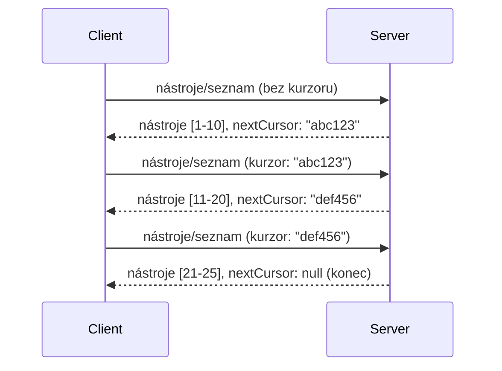

# Paginace a velké množiny výsledků v MCP

Když váš MCP server zpracovává velké datové sady - ať už jde o tisíce souborů, záznamy v databázi nebo výsledky vyhledávání - potřebujete stránkování k efektivní správě paměti a zajištění rychlé odezvy uživatelského rozhraní. Tento průvodce popisuje, jak stránkování v MCP implementovat a používat.

## Proč je stránkování důležité

Bez stránkování může docházet k:

- **Vyčerpání paměti** - Načítání milionů záznamů najednou
- **Pomalé odezvy** - Uživatelé čekají, než se načtou všechna data
- **Chyby časového limitu** - Požadavky překročí časový limit
- **Špatný výkon AI** - LLM mají problém s obrovským kontextem

MCP používá **stránkování založené na kurzorech** pro spolehlivé a konzistentní listování výsledky.

---

## Jak funguje stránkování v MCP

### Koncept kurzoru

**Kurzor** je neprůhledný řetězec, který označuje vaši pozici ve výsledkové sadě. Přemýšlejte o něm jako o záložce v dlouhé knize.



### Stránkování v MCP metodách

Tyto MCP metody podporují stránkování:

| Metoda | Vrací | Podpora kurzoru |
|--------|---------|----------------|
| `tools/list` | Definice nástrojů | ✅ |
| `resources/list` | Definice zdrojů | ✅ |
| `prompts/list` | Definice promptů | ✅ |
| `resources/templates/list` | Šablony zdrojů | ✅ |

---

## Implementace serveru

### Python (FastMCP)

```python
from mcp.server import Server
from mcp.types import Tool, ListToolsResult
import math

app = Server("paginated-server")

# Simulovaný velký dataset
ALL_TOOLS = [
    Tool(name=f"tool_{i}", description=f"Tool number {i}", inputSchema={})
    for i in range(100)
]

PAGE_SIZE = 10

@app.list_tools()
async def list_tools(cursor: str | None = None) -> ListToolsResult:
    """List tools with pagination support."""
    
    # Dekódovat kurzor pro získání počátečního indexu
    start_index = 0
    if cursor:
        try:
            start_index = int(cursor)
        except ValueError:
            start_index = 0
    
    # Získat stránku výsledků
    end_index = min(start_index + PAGE_SIZE, len(ALL_TOOLS))
    page_tools = ALL_TOOLS[start_index:end_index]
    
    # Vypočítat další kurzor
    next_cursor = None
    if end_index < len(ALL_TOOLS):
        next_cursor = str(end_index)
    
    return ListToolsResult(
        tools=page_tools,
        nextCursor=next_cursor
    )
```

### TypeScript

```typescript
import { Server } from "@modelcontextprotocol/sdk/server/index.js";
import { ListToolsResultSchema } from "@modelcontextprotocol/sdk/types.js";

const server = new Server({
  name: "paginated-server",
  version: "1.0.0"
});

// Simulovaný velký dataset
const ALL_TOOLS = Array.from({ length: 100 }, (_, i) => ({
  name: `tool_${i}`,
  description: `Tool number ${i}`,
  inputSchema: { type: "object", properties: {} }
}));

const PAGE_SIZE = 10;

server.setRequestHandler(ListToolsResultSchema, async (request) => {
  // Dekódovat kurzor
  let startIndex = 0;
  if (request.params?.cursor) {
    startIndex = parseInt(request.params.cursor, 10) || 0;
  }
  
  // Získat stránku výsledků
  const endIndex = Math.min(startIndex + PAGE_SIZE, ALL_TOOLS.length);
  const pageTools = ALL_TOOLS.slice(startIndex, endIndex);
  
  // Vypočítat další kurzor
  const nextCursor = endIndex < ALL_TOOLS.length ? String(endIndex) : undefined;
  
  return {
    tools: pageTools,
    nextCursor
  };
});
```

### Java (Spring MCP)

```java
@Service
public class PaginatedToolService {
    
    private static final int PAGE_SIZE = 10;
    private final List<Tool> allTools;
    
    public PaginatedToolService() {
        // Inicializovat velkou datovou sadu
        this.allTools = IntStream.range(0, 100)
            .mapToObj(i -> new Tool("tool_" + i, "Tool number " + i, Map.of()))
            .collect(Collectors.toList());
    }
    
    @McpMethod("tools/list")
    public ListToolsResult listTools(@Param("cursor") String cursor) {
        // Dekódovat kurzor
        int startIndex = 0;
        if (cursor != null && !cursor.isEmpty()) {
            try {
                startIndex = Integer.parseInt(cursor);
            } catch (NumberFormatException e) {
                startIndex = 0;
            }
        }
        
        // Získat stránku výsledků
        int endIndex = Math.min(startIndex + PAGE_SIZE, allTools.size());
        List<Tool> pageTools = allTools.subList(startIndex, endIndex);
        
        // Vypočítat další kurzor
        String nextCursor = endIndex < allTools.size() ? String.valueOf(endIndex) : null;
        
        return new ListToolsResult(pageTools, nextCursor);
    }
}
```

---

## Implementace klienta

### Python klient

```python
from mcp import ClientSession

async def get_all_tools(session: ClientSession) -> list:
    """Fetch all tools using pagination."""
    all_tools = []
    cursor = None
    
    while True:
        result = await session.list_tools(cursor=cursor)
        all_tools.extend(result.tools)
        
        if result.nextCursor is None:
            break
        cursor = result.nextCursor
    
    return all_tools

# Použití
async with client_session as session:
    tools = await get_all_tools(session)
    print(f"Found {len(tools)} tools")
```

### TypeScript klient

```typescript
import { Client } from "@modelcontextprotocol/sdk/client/index.js";

async function getAllTools(client: Client): Promise<Tool[]> {
  const allTools: Tool[] = [];
  let cursor: string | undefined = undefined;
  
  do {
    const result = await client.listTools({ cursor });
    allTools.push(...result.tools);
    cursor = result.nextCursor;
  } while (cursor);
  
  return allTools;
}

// Použití
const tools = await getAllTools(client);
console.log(`Found ${tools.length} tools`);
```

### Vzor Lazy Loading

Pro velmi velké datové sady načítejte stránky na požádání:

```python
class PaginatedToolIterator:
    """Lazily iterate through paginated tools."""
    
    def __init__(self, session: ClientSession):
        self.session = session
        self.cursor = None
        self.buffer = []
        self.exhausted = False
    
    async def __anext__(self):
        # Vrátit z bufferu, pokud je k dispozici
        if self.buffer:
            return self.buffer.pop(0)
        
        # Zkontrolujte, zda jsme vyčerpali všechny stránky
        if self.exhausted:
            raise StopAsyncIteration
        
        # Načíst následující stránku
        result = await self.session.list_tools(cursor=self.cursor)
        self.buffer = list(result.tools)
        self.cursor = result.nextCursor
        
        if self.cursor is None:
            self.exhausted = True
        
        if not self.buffer:
            raise StopAsyncIteration
        
        return self.buffer.pop(0)
    
    def __aiter__(self):
        return self

# Použití - efektivní z hlediska paměti pro velké datové sady
async for tool in PaginatedToolIterator(session):
    process_tool(tool)
```

---

## Stránkování pro zdroje

Zdroje často potřebují stránkování pro adresáře nebo velké datové sady:

```python
from mcp.server import Server
from mcp.types import Resource, ListResourcesResult
import os

app = Server("file-server")

@app.list_resources()
async def list_resources(cursor: str | None = None) -> ListResourcesResult:
    """List files in directory with pagination."""
    
    directory = "/data/files"
    all_files = sorted(os.listdir(directory))
    
    # Dekódovat kurzor (index souboru)
    start_index = int(cursor) if cursor else 0
    page_size = 20
    end_index = min(start_index + page_size, len(all_files))
    
    # Vytvořit seznam zdrojů pro tuto stránku
    resources = []
    for filename in all_files[start_index:end_index]:
        filepath = os.path.join(directory, filename)
        resources.append(Resource(
            uri=f"file://{filepath}",
            name=filename,
            mimeType="application/octet-stream"
        ))
    
    # Vypočítat další kurzor
    next_cursor = str(end_index) if end_index < len(all_files) else None
    
    return ListResourcesResult(
        resources=resources,
        nextCursor=next_cursor
    )
```

---

## Strategie návrhu kurzoru

### Strategie 1: Na základě indexu (jednoduchá)

```python
# Kurzor je pouze index
cursor = "50"  # Začít u položky 50
```

**Výhody:** Jednoduché, bez stavového uložení
**Nevýhody:** Výsledky se posunují při přidání nebo odebrání položek

### Strategie 2: Na základě ID (stabilní)

```python
# Kurzor je poslední zaznamenané ID
cursor = "item_abc123"  # Začněte po této položce
```

**Výhody:** Stabilní i při změně položek
**Nevýhody:** Vyžaduje řazená ID

### Strategie 3: Zakódovaný stav (komplexní)

```python
import base64
import json

def encode_cursor(state: dict) -> str:
    return base64.b64encode(json.dumps(state).encode()).decode()

def decode_cursor(cursor: str) -> dict:
    return json.loads(base64.b64decode(cursor).decode())

# Kurzor obsahuje více polí stavu
cursor = encode_cursor({
    "offset": 50,
    "filter": "active",
    "sort": "name"
})
```

**Výhody:** Může zakódovat složitý stav
**Nevýhody:** Komplexnější, delší řetězce kurzorů

---

## Nejlepší postupy

### 1. Zvolte odpovídající velikosti stránek

```python
# Zvažte velikost dat
PAGE_SIZE_SMALL_ITEMS = 100   # Jednoduchá metadata
PAGE_SIZE_MEDIUM_ITEMS = 20   # Bohatší objekty
PAGE_SIZE_LARGE_ITEMS = 5     # Komplexní obsah
```

### 2. Zvládejte neplatné kurzory elegantně

```python
@app.list_tools()
async def list_tools(cursor: str | None = None) -> ListToolsResult:
    try:
        start_index = int(cursor) if cursor else 0
        if start_index < 0 or start_index >= len(ALL_TOOLS):
            start_index = 0  # Resetovat na začátek
    except (ValueError, TypeError):
        start_index = 0  # Neplatný kurzor, začít znovu
    # ...
```

### 3. Zahrňte počet výsledků (volitelné)

```python
return ListToolsResult(
    tools=page_tools,
    nextCursor=next_cursor,
    # Některé implementace zahrnují celkový počet pro pokrok UI
    _meta={"total": len(ALL_TOOLS)}
)
```

### 4. Testujte okrajové případy

```python
async def test_pagination():
    # Prázdná množina výsledků
    result = await session.list_tools()
    assert result.tools == []
    assert result.nextCursor is None
    
    # Jedna stránka
    result = await session.list_tools()
    assert len(result.tools) <= PAGE_SIZE
    
    # Neplatný kurzor
    result = await session.list_tools(cursor="invalid")
    assert result.tools  # Měla by vrátit první stránku
```

---

## Běžné chyby

### ❌ Vrácení všech výsledků a stránky na straně klienta

```python
# ŠPATNĚ: Načítá vše do paměti
@app.list_tools()
async def list_tools() -> ListToolsResult:
    all_tools = load_all_tools()  # 1 milion nástrojů!
    return ListToolsResult(tools=all_tools)
```

### ✅ Stránkování přímo u zdroje dat

```python
# DOBRÉ: Načítá pouze to, co je potřeba
@app.list_tools()
async def list_tools(cursor: str | None = None) -> ListToolsResult:
    offset = int(cursor) if cursor else 0
    tools = await db.query_tools(offset=offset, limit=PAGE_SIZE)
    return ListToolsResult(tools=tools, nextCursor=...)
```

---

## Co dál

- [Modul 5.14 - Kontextové inženýrství](../../05-AdvancedTopics/mcp-contextengineering/README.md)
- [Modul 8 - Nejlepší postupy](../../08-BestPractices/README.md)
- [3.8 - Testování vašeho MCP serveru](../../03-GettingStarted/08-testing/README.md)

---

## Další zdroje

- [Specifikace MCP - stránkování](https://modelcontextprotocol.io/specification/2026-07-28/)
- [Vysvětlení stránkování založeného na kurzoru](https://slack.engineering/evolving-api-pagination-at-slack/)
- [Testy stránkování Python SDK](https://github.com/modelcontextprotocol/python-sdk/blob/main/tests/client/test_list_methods_cursor.py)

---

<!-- CO-OP TRANSLATOR DISCLAIMER START -->
**Prohlášení o omezení odpovědnosti**:
Tento dokument byl přeložen pomocí AI překladatelské služby [Co-op Translator](https://github.com/Azure/co-op-translator). Přestože usilujeme o co největší přesnost, mějte prosím na paměti, že automatizované překlady mohou obsahovat chyby nebo nepřesnosti. Originální dokument v jeho mateřském jazyce by měl být považován za autoritativní zdroj. Pro kritické informace se doporučuje profesionální lidský překlad. Nejsme odpovědní za jakékoli nedorozumění nebo nesprávné interpretace vzniklé použitím tohoto překladu.
<!-- CO-OP TRANSLATOR DISCLAIMER END -->