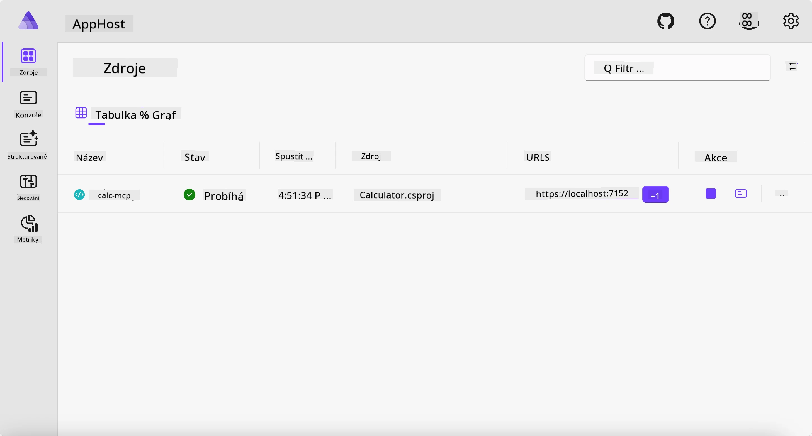
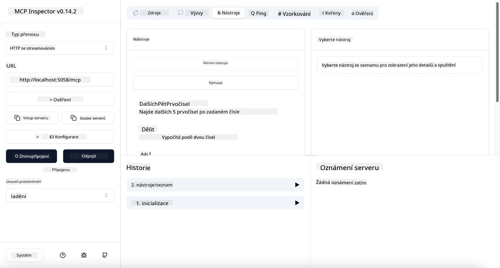
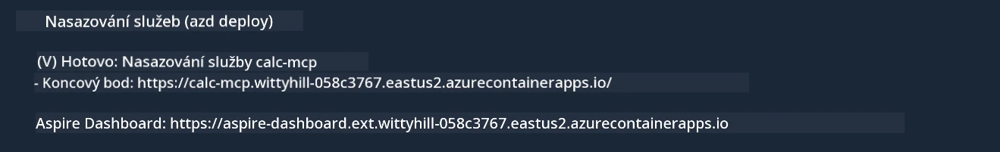

# Příklad

Předchozí příklad ukazuje, jak používat lokální .NET projekt s typem `stdio`. A jak spustit server lokálně v kontejneru. To je v mnoha situacích dobré řešení. Nicméně může být užitečné mít server spuštěný vzdáleně, například v cloudovém prostředí. Zde přichází na řadu typ `http`.

Pohled na řešení ve složce `04-PracticalImplementation` může vypadat mnohem složitěji než předchozí. Ale ve skutečnosti tomu tak není. Pokud se podíváte pozorně na projekt `src/Calculator`, uvidíte, že je to většinou stejný kód jako v předchozím příkladu. Jediný rozdíl je, že používáme jinou knihovnu `ModelContextProtocol.AspNetCore` pro zpracování HTTP požadavků. A změníme metodu `IsPrime`, aby byla privátní, jen abychom ukázali, že můžete mít v kódu privátní metody. Zbytek kódu zůstává stejný jako dříve.

Ostatní projekty jsou od [Aspire](https://aspire.dev/get-started/what-is-aspire/). Mít Aspire v řešení zlepší zkušenost vývojáře při vývoji a testování a pomůže s observabilitou. Není to nutné k běhu serveru, ale je to dobrá praxe mít to ve svém řešení.

## Spuštění serveru lokálně

1. Ve VS Code (s rozšířením C# DevKit) přejděte do adresáře `04-PracticalImplementation/samples/csharp`.
1. Spusťte následující příkaz pro start serveru:

   ```bash
    dotnet watch run --project ./src/AppHost
   ```

1. Když webový prohlížeč otevře Aspire dashboard, všimněte si URL `http`. Mělo by to být něco jako `http://localhost:5058/`.

   

## Testování Streamable HTTP pomocí MCP Inspektoru

Pokud máte Node.js verze 22.7.5 a vyšší, můžete použít MCP Inspektor k testování vašeho serveru.

Spusťte server a v terminálu spusťte následující příkaz:

```bash
npx @modelcontextprotocol/inspector http://localhost:5058
```



- Vyberte `Streamable HTTP` jako typ přenosu.
- Do pole Url zadejte URL serveru, které jste zaznamenali dříve, a přidejte `/mcp`. Mělo by to být `http` (nikoli `https`), něco jako `http://localhost:5058/mcp`.
- klikněte na tlačítko Connect.

Pěkné na Inspektoru je, že poskytuje dobrou přehlednost o tom, co se děje.

- Zkuste vypsat dostupné nástroje
- Vyzkoušejte některé z nich, mělo by to fungovat stejně jako dříve.

## Test MCP serveru s GitHub Copilot Chat ve VS Code

Pro použití přenosu Streamable HTTP s GitHub Copilot Chat změňte konfiguraci dříve vytvořeného serveru `calc-mcp` takto:

```jsonc
// .vscode/mcp.json
{
  "servers": {
    "calc-mcp": {
      "type": "http",
      "url": "http://localhost:5058/mcp"
    }
  }
}
```

Proveďte nějaké testy:

- Zeptejte se na „3 prvočísla po 6780“. Všimněte si, že Copilot použije nové nástroje `NextFivePrimeNumbers` a vrátí pouze prvních 3 prvočísel.
- Zeptejte se na „7 prvočísel po 111“, abyste viděli, co se stane.
- Zeptejte se na „John má 24 lízátek a chce je rozdělit mezi své 3 děti. Kolik lízátek má každé dítě?“, abyste viděli, co se stane.

## Nasazení serveru na Azure

Pojďme nasadit server na Azure, aby ho mohlo používat více lidí.

V terminálu přejděte do složky `04-PracticalImplementation/samples/csharp` a spusťte následující příkaz:

```bash
azd up
```

Po dokončení nasazení byste měli vidět zprávu jako tato:



Zkopírujte URL a použijte ji v MCP Inspektoru a v GitHub Copilot Chatu.

```jsonc
// .vscode/mcp.json
{
  "servers": {
    "calc-mcp": {
      "type": "http",
      "url": "https://calc-mcp.gentleriver-3977fbcf.australiaeast.azurecontainerapps.io/mcp"
    }
  }
}
```

## Co dál?

Vyzkoušeli jsme různé typy přenosů a testovací nástroje. Také nasadili váš MCP server na Azure. Ale co když náš server potřebuje přístup k soukromým zdrojům? Například databázi nebo soukromé API? V další kapitole uvidíme, jak můžeme zlepšit bezpečnost našeho serveru.

---

<!-- CO-OP TRANSLATOR DISCLAIMER START -->
**Prohlášení o omezení odpovědnosti**:
Tento dokument byl přeložen pomocí AI překladatelské služby [Co-op Translator](https://github.com/Azure/co-op-translator). Přestože usilujeme o co největší přesnost, mějte prosím na paměti, že automatizované překlady mohou obsahovat chyby nebo nepřesnosti. Originální dokument v jeho mateřském jazyce by měl být považován za autoritativní zdroj. Pro kritické informace se doporučuje profesionální lidský překlad. Nejsme odpovědní za jakékoli nedorozumění nebo nesprávné interpretace vzniklé použitím tohoto překladu.
<!-- CO-OP TRANSLATOR DISCLAIMER END -->