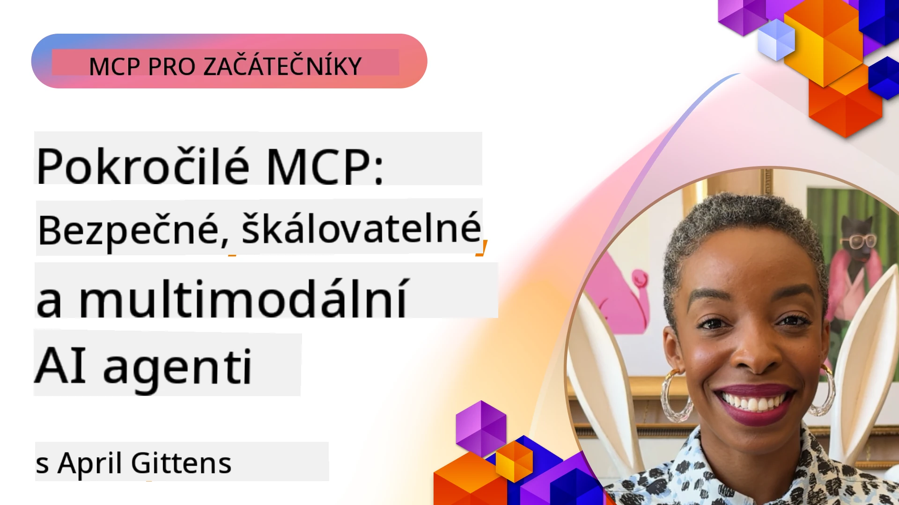

# Pokročilá témata v MCP

_(Klikněte na obrázek výše pro přehrání videa této lekce)_

Tato kapitola pokrývá řadu pokročilých témat v implementaci Model Context Protocol (MCP), včetně multimodální integrace, škálovatelnosti, osvědčených postupů bezpečnosti a integrace do podnikového prostředí. Témata jsou zásadní pro vytváření robustních a produkčních aplikací MCP, které mohou vyhovět požadavkům moderních AI systémů.

## Přehled

Tato lekce zkoumá pokročilé koncepty v implementaci Model Context Protocol, zaměřuje se na multimodální integraci, škálovatelnost, osvědčené bezpečnostní postupy a integraci do podnikových systémů. Témata jsou nezbytná pro budování produkčních MCP aplikací, které zvládnou složité požadavky v podnikovém prostředí.

> **Poznámka ke stávající specifikaci:** MCP `2026-07-28` odstraňuje primitivy Roots a  
> Sampling popsané v lekcích 5.4 a 5.6. Také přesouvá  
> experimentální funkci Tasks zmíněnou v Protocol Features (5.16) do  
> samostatného rozšíření Tasks. Tyto lekce jsou zachovány pro legacy  
> implementace `2025-11-25` a obsahují návod na migraci. Viz  
> [Co je nového v MCP: Specifikace 2026-07-28](../01-CoreConcepts/mcp-2026-07-28.md).

## Cíle učení

Na konci této lekce budete schopni:

- Implementovat multimodální schopnosti v rámci MCP
- Navrhnout škálovatelné MCP architektury pro scénáře s vysokou zátěží
- Uplatnit osvědčené bezpečnostní postupy v souladu se zásadami bezpečnosti MCP
- Integrovat MCP s podnikových AI systémy a rámci
- Optimalizovat výkon a spolehlivost v produkčním prostředí

## Lekce a ukázkové projekty

| Odkaz | Název | Popis |
|------|-------|-------------|
| [5.1 Integrace s Azure](./mcp-integration/README.md) | Integrace s Azure | Naučte se integrovat váš MCP server na Azure |
| [5.2 Multimodální příklad](./mcp-multi-modality/README.md) | MCP multimodální příklady | Ukázky pro audio, obraz a multimodální odpovědi |
| [5.3 MCP OAuth2 příklad](../../../05-AdvancedTopics/mcp-oauth2-demo) | MCP OAuth2 demo | Minimalistická Spring Boot aplikace ukazující OAuth2 s MCP, jak jako Autorizační, tak Zdrojový server. Demonstrace bezpečného vydávání tokenů, chráněných koncových bodů, nasazení na Azure Container Apps a integrace API Management. |
| [5.4 Root Contexts](./mcp-root-contexts/README.md) | Root kontexty | Naučte se legacy primitivy Roots z `2025-11-25` a současné možnosti migrace (zastaralé v `2026-07-28`) |
| [5.5 Směrování](./mcp-routing/README.md) | Směrování | Naučte se různé typy směrování |
| [5.6 Sampling](./mcp-sampling/README.md) | Sampling | Naučte se legacy primitiv Sampling z `2025-11-25` a možnosti migrace (zastaralé v `2026-07-28`) |
| [5.7 Škálování](./mcp-scaling/README.md) | Škálování | Naučte se o škálování |
| [5.8 Bezpečnost](./mcp-security/README.md) | Bezpečnost | Zabezpečte svůj MCP server |
| [5.9 Webový vyhledávač MCP](./web-search-mcp/README.md) | Webový vyhledávač MCP | Python MCP server a klient integrující se s SerpAPI pro vyhledávání na webu, zpravách, produktech a Q&A v reálném čase. Demonstruje koordinaci více nástrojů, integraci externího API a robustní zpracování chyb. |
| [5.10 Realtime Streaming](./mcp-realtimestreaming/README.md) | Streaming | Přenos dat v reálném čase se stal zásadním v dnešním světě založeném na datech, kde firmy a aplikace potřebují okamžitý přístup k informacím pro rychlá rozhodnutí. |
| [5.11 Realtime Web Search](./mcp-realtimesearch/README.md) | Webové vyhledávání v reálném čase | Jak MCP transformuje webové vyhledávání v reálném čase zajištěním standardizovaného přístupu ke správě kontextu napříč AI modely, vyhledávači a aplikacemi. | 
| [5.12 Entra ID autentizace pro Model Context Protocol Servery](./mcp-security-entra/README.md) | Entra ID autentizace | Microsoft Entra ID poskytuje robustní cloudové řešení správy identit a přístupů, které zajišťuje, že s vaším MCP serverem mohou komunikovat pouze autorizovaní uživatelé a aplikace. |
| [5.13 Integrace Microsoft Foundry Agentů](./mcp-foundry-agent-integration/README.md) | Integrace Microsoft Foundry | Naučte se integrovat MCP servery s Microsoft Foundry agenty, což umožňuje pokročilou orchestraci nástrojů a podnikové AI schopnosti se standardizovanými propojeními externích zdrojů dat. |
| [5.14 Inženýrství kontextu](./mcp-contextengineering/README.md) | Inženýrství kontextu | Budoucí možnosti technik inženýrství kontextu pro MCP servery, včetně optimalizace kontextu, dynamické správy kontextu a strategií pro efektivní návrh promptů v MCP rámcích. |
| [5.15 Vlastní transport MCP](./mcp-transport/README.md) | Vlastní transport | Naučte se implementovat vlastní mechanismy transportu pro specializované komunikační scénáře MCP. |
| [5.16 Hloubkový pohled na funkce protokolu](./mcp-protocol-features/README.md) | Funkce protokolu | Zvládněte pokročilé funkce protokolu, včetně oznámení o průběhu, rušení požadavků, šablon zdrojů a vzorů zpracování chyb. |
| [5.17 Adversariální multi-agentní uvažování](./mcp-adversarial-agents/README.md) | Adversariální agenti | Použijte dva agenty s protichůdnými postoji, sdílející jedinou sadu nástrojů MCP, aby odhalili halucinace, zvýraznili krajní případy a produkovali lépe kalibrované výsledky prostřednictvím strukturované debaty. |

> **Historická poznámka `2025-11-25`:** tato revize zavedla experimentální  
> Tasks a rozšířila několik funkcí protokolu. V `2026-07-28` byly Tasks přemístěny do  
> oficiálního rozšíření a Roots byly označeny za zastaralé. Nepoužívejte  
> stav funkcí z `2025-11-25` jako aktuální doporučení; viz  
> [changelog 2026-07-28](https://modelcontextprotocol.io/specification/2026-07-28/changelog).

## Další odkazy

Pro nejaktuálnější informace o pokročilých tématech MCP navštivte:
- [Dokumentace MCP](https://modelcontextprotocol.io/)
- [Specifikace MCP (2026-07-28)](https://modelcontextprotocol.io/specification/2026-07-28/)
- [GitHub Repozitář](https://github.com/modelcontextprotocol)
- [OWASP MCP Top 10](https://microsoft.github.io/mcp-azure-security-guide/mcp/) - Bezpečnostní rizika a mitigace
- [MCP Security Summit Workshop (Sherpa)](https://azure-samples.github.io/sherpa/) - Praktický bezpečnostní trénink

## Klíčové poznatky

- Více-modální implementace MCP rozšiřují schopnosti AI nad rámec zpracování textu
- Škálovatelnost je zásadní pro nasazení ve firmách a lze ji řešit horizontálním i vertikálním škálováním
- Komplexní bezpečnostní opatření chrání data a zajišťují správnou kontrolu přístupu
- Integrace do podniku s platformami jako Azure OpenAI a Microsoft AI Foundry zvyšuje schopnosti MCP
- Pokročilé implementace MCP těží z optimalizovaných architektur a pečlivé správy zdrojů

## Cvičení

Navrhněte podnikové řešení MCP pro konkrétní použití:

1. Identifikujte více-modální požadavky pro váš případ použití
2. Nastavte bezpečnostní opatření potřebná k ochraně citlivých dat
3. Navrhněte škálovatelnou architekturu, která zvládne různé zatížení
4. Naplánujte integraci s podnikovými AI systémy
5. Dokumentujte možné výkonnostní úzká místa a strategie jejich řešení

## Další zdroje

- [Dokumentace Azure OpenAI](https://learn.microsoft.com/en-us/azure/ai-services/openai/)
- [Dokumentace Microsoft AI Foundry](https://learn.microsoft.com/en-us/ai-services/)

---

## Co bude dál

Prozkoumejte lekce v tomto modulu začínající na: [5.1 MCP Integration](./mcp-integration/README.md)

Po dokončení tohoto modulu pokračujte na: [Modul 6: Příspěvky komunity](../06-CommunityContributions/README.md)

---

<!-- CO-OP TRANSLATOR DISCLAIMER START -->
**Prohlášení o omezení odpovědnosti**:
Tento dokument byl přeložen pomocí AI překladatelské služby [Co-op Translator](https://github.com/Azure/co-op-translator). Přestože usilujeme o co největší přesnost, mějte prosím na paměti, že automatizované překlady mohou obsahovat chyby nebo nepřesnosti. Originální dokument v jeho mateřském jazyce by měl být považován za autoritativní zdroj. Pro kritické informace se doporučuje profesionální lidský překlad. Nejsme odpovědní za jakékoli nedorozumění nebo nesprávné interpretace vzniklé použitím tohoto překladu.
<!-- CO-OP TRANSLATOR DISCLAIMER END -->