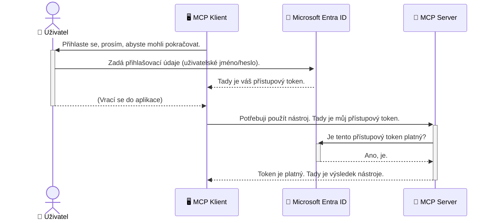

# Zabezpečení AI pracovních postupů: Autentizace Entra ID pro servery Model Context Protocol

> [!NOTE]
> Kód vzdáleného serveru v této lekci chrání zastaralé koncové body `/sse` a `/message`
> a cílí na MCP `2025-11-25`. Zachovejte jeho postupy ověřování identity a tokenu,
> ale pro nové implementace použijte kompatibilní Streamable HTTP přenos `2026-07-28`.


## Úvod
Zabezpečení vašeho Model Context Protocol (MCP) serveru je stejně důležité jako zamčení hlavních dveří vašeho domu. Otevření vašeho MCP serveru vystavuje vaše nástroje a data neautorizovanému přístupu, což může vést k bezpečnostním incidentům. Microsoft Entra ID poskytuje robustní cloudové řešení pro správu identity a přístupu, které pomáhá zajistit, že pouze autorizovaní uživatelé a aplikace mohou interagovat s vaším MCP serverem. V této sekci se naučíte, jak chránit své AI pracovní postupy pomocí autentizace Entra ID.

## Cíle učení
Na konci této sekce budete schopni:

- Pochopit důležitost zabezpečení MCP serverů.
- Vysvětlit základy Microsoft Entra ID a autentizace OAuth 2.0.
- Rozpoznat rozdíl mezi veřejnými a důvěrnými klienty.
- Implementovat autentizaci Entra ID v lokálních (veřejný klient) i vzdálených (důvěrný klient) scénářích MCP serveru.
- Uplatnit nejlepší bezpečnostní praktiky při vývoji AI pracovních postupů.

## Bezpečnost a MCP

Stejně jako byste nenechali odemčené hlavní dveře svého domu, neměli byste nechat svůj MCP server otevřený pro kohokoliv. Zabezpečení vašich AI pracovních postupů je nezbytné pro vytváření robustních, důvěryhodných a bezpečných aplikací. Tato kapitola vás seznámí s použitím Microsoft Entra ID k zabezpečení vašich MCP serverů, což zajistí, že pouze autorizovaní uživatelé a aplikace budou moci pracovat s vašimi nástroji a daty.

## Proč je bezpečnost důležitá pro MCP servery

Představte si, že váš MCP server má nástroj, který může odesílat e-maily nebo přistupovat k databázi zákazníků. Nezabezpečený server by znamenal, že kdokoliv by mohl tento nástroj použít, což může vést k neautorizovanému přístupu k datům, spamu nebo jiným škodlivým činnostem.

Implementací autentizace zajistíte, že každý požadavek na váš server je ověřený, čímž se potvrzuje identita uživatele nebo aplikace, která požadavek předkládá. To je první a nejdůležitější krok v zabezpečení vašich AI pracovních postupů.

## Úvod do Microsoft Entra ID

[**Microsoft Entra ID**](https://adoption.microsoft.com/microsoft-security/entra/) je cloudová služba pro správu identity a přístupu. Můžete si ji představit jako univerzálního bezpečnostního strážce vašich aplikací. Zpracovává složitý proces ověřování identity uživatelů (autentizace) a určuje, co smí uživatelé dělat (autorizace).

Používáním Entra ID můžete:

- Umožnit bezpečné přihlašování uživatelů.
- Chránit API a služby.
- Spravovat přístupové politiky z centrálního místa.

Pro MCP servery poskytuje Entra ID robustní a široce důvěryhodné řešení, které spravuje, kdo může přistupovat k funkcím vašeho serveru.

---

## Pochopení magie: Jak funguje autentizace Entra ID

Entra ID používá otevřené standardy jako **OAuth 2.0** k řízení autentizace. I když mohou být detaily složité, základní koncept je jednoduchý a lze jej pochopit pomocí analogie.

### Jemný úvod do OAuth 2.0: Klíč pro parkování

Představte si OAuth 2.0 jako službu parkování vašeho auta. Když přijdete do restaurace, nedáte parkovacímu váš hlavní klíč od auta. Místo toho mu dáte **valet key** (klíč pro parkování), který má omezená oprávnění – může auto nastartovat a zamknout dveře, ale nemůže otevřít kufr nebo přihrádku.

V této analogii:

- **Vy** jste **Uživatel**.
- **Vaše auto** je **MCP server** s jeho cennými nástroji a daty.
- **Parkovací služba** je **Microsoft Entra ID**.
- **Parkovací asistent** je **MCP klient** (aplikace, která se snaží přistoupit na server).
- **Klíč pro parkování** je **přístupový token**.

Přístupový token je bezpečný textový řetězec, který MCP klient obdrží od Entra ID po přihlášení uživatele. Klient pak tento token předkládá MCP serveru s každým požadavkem. Server může token ověřit, aby zajistil, že požadavek je legitimní a že klient má potřebná oprávnění, aniž by musel pracovat s vašimi skutečnými přihlašovacími údaji (například heslem).

### Průběh autentizace

Takto proces funguje v praxi:



### Představení Microsoft Authentication Library (MSAL)

Než se ponoříme do kódu, je důležité představit klíčovou součást, kterou uvidíte v příkladech: **Microsoft Authentication Library (MSAL)**.

MSAL je knihovna vyvinutá společností Microsoft, která značně usnadňuje vývojářům práci s autentizací. Místo toho, abyste psali složitý kód pro manipulaci s bezpečnostními tokeny, správu přihlášení a obnovu relací, MSAL tyto úkony vykonává za vás.

Používání knihovny jako MSAL je velmi doporučeno, protože:

- **Je bezpečná:** Implementuje standardní protokoly průmyslu a nejlepší bezpečnostní postupy, čímž snižuje riziko zranitelností ve vašem kódu.
- **Usnadňuje vývoj:** Abstrahuje složitost protokolů OAuth 2.0 a OpenID Connect, což vám umožní přidat robustní autentizaci do vaší aplikace jen několika řádky kódu.
- **Je udržovaná:** Microsoft aktivně spravuje a aktualizuje MSAL, aby reagoval na nové bezpečnostní hrozby a změny platforem.

MSAL podporuje širokou škálu jazyků a aplikačních frameworků, včetně .NET, JavaScript/TypeScript, Python, Java, Go a mobilních platforem jako iOS a Android. To znamená, že můžete používat stejné konzistentní autentizační vzory napříč celým technologickým stackem.

Více informací o MSAL naleznete v oficiální [dokumentaci přehledu MSAL](https://learn.microsoft.com/entra/identity-platform/msal-overview).

---

## Zabezpečení vašeho MCP serveru pomocí Entra ID: Průvodce krok za krokem

Nyní si ukážeme, jak zabezpečit lokální MCP server (komunikující přes `stdio`) pomocí Entra ID. Tento příklad používá **veřejného klienta**, což je vhodné pro aplikace běžící na uživatelském zařízení, jako je desktopová aplikace nebo lokální vývojový server.

### Scénář 1: Zabezpečení lokálního MCP serveru (s veřejným klientem)

V tomto scénáři se podíváme na MCP server běžící lokálně, komunikující přes `stdio` a používající Entra ID k autentizaci uživatele před umožněním přístupu k jeho nástrojům. Server bude mít jediný nástroj, který získává informace o profilu uživatele z Microsoft Graph API.

#### 1. Nastavení aplikace v Entra ID

Než začnete psát kód, je potřeba zaregistrovat vaši aplikaci v Microsoft Entra ID. To říká Entra ID o vaší aplikaci a uděluje jí oprávnění používat autentizační službu.

1. Přejděte do **[Microsoft Entra portálu](https://entra.microsoft.com/)**.
2. Jděte na **Registrace aplikací** a klikněte na **Nová registrace**.
3. Pojmenujte svou aplikaci (např. „Můj lokální MCP server“).
4. Pro **Typy podporovaných účtů** vyberte **Účty pouze v tomto organizačním adresáři**.
5. Pole **Přesměrovací URI** lze u tohoto příkladu nechat prázdné.
6. Klikněte na **Registrovat**.

Po registraci si poznamenejte **ID aplikace (klienta)** a **ID adresáře (nájemce)**, budete je potřebovat ve vašem kódu.

#### 2. Kód: Rozbor

Podívejme se na klíčové části kódu, které se starají o autentizaci. Kompletní kód tohoto příkladu je dostupný v adresáři [Entra ID - Local - WAM](https://github.com/Azure-Samples/mcp-auth-servers/tree/main/src/entra-id-local-wam) repozitáře [mcp-auth-servers GitHub](https://github.com/Azure-Samples/mcp-auth-servers).

**`AuthenticationService.cs`**

Třída zodpovědná za správu interakce s Entra ID.

- **`CreateAsync`**: Tato metoda inicializuje `PublicClientApplication` z MSAL (Microsoft Authentication Library). Je nakonfigurována s `clientId` a `tenantId` vaší aplikace.
- **`WithBroker`**: Povolení použití brokera (například Windows Web Account Manager), což poskytuje bezpečnější a plynulejší přihlašování single sign-on.
- **`AcquireTokenAsync`**: Jádro metody. Nejprve se snaží získat token tiše (tj. uživatel se nemusí znovu přihlašovat, pokud má platnou relaci). Pokud token nelze získat tiše, vyzve uživatele k interaktivnímu přihlášení.

```csharp
// Simplified for clarity
public static async Task<AuthenticationService> CreateAsync(ILogger<AuthenticationService> logger)
{
    var msalClient = PublicClientApplicationBuilder
        .Create(_clientId) // Your Application (client) ID
        .WithAuthority(AadAuthorityAudience.AzureAdMyOrg)
        .WithTenantId(_tenantId) // Your Directory (tenant) ID
        .WithBroker(new BrokerOptions(BrokerOptions.OperatingSystems.Windows))
        .Build();

    // ... cache registration ...

    return new AuthenticationService(logger, msalClient);
}

public async Task<string> AcquireTokenAsync()
{
    try
    {
        // Try silent authentication first
        var accounts = await _msalClient.GetAccountsAsync();
        var account = accounts.FirstOrDefault();

        AuthenticationResult? result = null;

        if (account != null)
        {
            result = await _msalClient.AcquireTokenSilent(_scopes, account).ExecuteAsync();
        }
        else
        {
            // If no account, or silent fails, go interactive
            result = await _msalClient.AcquireTokenInteractive(_scopes).ExecuteAsync();
        }

        return result.AccessToken;
    }
    catch (Exception ex)
    {
        _logger.LogError(ex, "An error occurred while acquiring the token.");
        throw; // Optionally rethrow the exception for higher-level handling
    }
}
```

**`Program.cs`**

Místo, kde je MCP server nastaven a integrovaná autentizační služba.

- **`AddSingleton<AuthenticationService>`**: Registruje `AuthenticationService` do kontejneru závislostí, aby mohl být použit v jiných částech aplikace (například v nástroji).
- **`GetUserDetailsFromGraph` nástroj**: Tento nástroj vyžaduje instanci `AuthenticationService`. Před jakýmkoliv využitím zavolá `authService.AcquireTokenAsync()`, aby získal platný přístupový token. Pokud je autentizace úspěšná, použije token k volání Microsoft Graph API a načte uživatelské detaily.

```csharp
// Simplified for clarity
[McpServerTool(Name = "GetUserDetailsFromGraph")]
public static async Task<string> GetUserDetailsFromGraph(
    AuthenticationService authService)
{
    try
    {
        // This will trigger the authentication flow
        var accessToken = await authService.AcquireTokenAsync();

        // Use the token to create a GraphServiceClient
        var graphClient = new GraphServiceClient(
            new BaseBearerTokenAuthenticationProvider(new TokenProvider(authService)));

        var user = await graphClient.Me.GetAsync();

        return System.Text.Json.JsonSerializer.Serialize(user);
    }
    catch (Exception ex)
    {
        return $"Error: {ex.Message}";
    }
}
```

#### 3. Jak to všechno funguje dohromady

1. Když MCP klient chce použít nástroj `GetUserDetailsFromGraph`, nejprve volá `AcquireTokenAsync`.
2. `AcquireTokenAsync` vyvolá MSAL knihovnu, která kontroluje platnost tokenu.
3. Pokud token není k dispozici, MSAL přes brokera vyzve uživatele k přihlášení pomocí účtu Entra ID.
4. Po přihlášení uživatele vydá Entra ID přístupový token.
5. Nástroj získá token a použije ho k bezpečnému volání Microsoft Graph API.
6. Uživatelské údaje jsou vráceny MCP klientovi.

Tento proces zajišťuje, že nástroj mohou používat pouze autentizovaní uživatelé, čímž efektivně zabezpečíte svůj lokální MCP server.

### Scénář 2: Zabezpečení vzdáleného MCP serveru (s důvěrným klientem)

Když váš MCP server běží na vzdáleném stroji (například v cloudu) a komunikuje přes protokol jako HTTP Streaming, požadavky na zabezpečení se liší. V takovém případě byste měli použít **důvěrného klienta** a **Authorization Code Flow**. Toto je bezpečnější metoda, protože tajemství aplikace nejsou nikdy vystavena v prohlížeči.

Tento příklad používá TypeScriptový MCP server založený na Express.js k obsluze HTTP požadavků.

#### 1. Nastavení aplikace v Entra ID

Nastavení v Entra ID je podobné jako u veřejného klienta, ale s jedním klíčovým rozdílem: musíte vytvořit **tajemství klienta**.

1. Přejděte na **[Microsoft Entra portál](https://entra.microsoft.com/)**.
2. Ve vaší registraci aplikace přejděte na záložku **Certifikáty a tajemství**.
3. Klikněte na **Nové tajemství klienta**, pojmenujte ho a klikněte na **Přidat**.
4. **Důležité:** Ihned si zkopírujte hodnotu tajemství. Už ji později neuvidíte.
5. Také musíte nastavit **Redirect URI**. Přejděte na záložku **Autentizace**, klikněte na **Přidat platformu**, vyberte **Web** a zadejte přesměrovací URI pro vaši aplikaci (např. `http://localhost:3001/auth/callback`).

> **⚠️ Důležitá bezpečnostní poznámka:** Pro produkční aplikace Microsoft důrazně doporučuje používat **autentizaci bez tajemství** jako je **Managed Identity** nebo **Workload Identity Federation** namísto tajemství klienta. Tajemství klienta představují bezpečnostní riziko, protože mohou být odhalena nebo kompromitována. Spravované identity poskytují bezpečnější přístup odstraněním potřeby ukládat přihlašovací údaje ve vašem kódu nebo konfiguraci.
>
> Pro více informací o spravovaných identitách a jejich implementaci si přečtěte [Přehled spravovaných identit pro Azure zdroje](https://learn.microsoft.com/entra/identity/managed-identities-azure-resources/overview).

#### 2. Kód: Rozbor

Tento příklad používá relační přístup. Když se uživatel autentizuje, server uloží přístupový token a obnovovací token do relace a předá uživateli token relace. Tento token relace se potom používá pro následné požadavky. Kompletní kód tohoto příkladu je dostupný v adresáři [Entra ID - Confidential client](https://github.com/Azure-Samples/mcp-auth-servers/tree/main/src/entra-id-cca-session) repozitáře [mcp-auth-servers GitHub](https://github.com/Azure-Samples/mcp-auth-servers).

**`Server.ts`**

Tento soubor nastavuje Express server a transportní vrstvu MCP.

- **`requireBearerAuth`**: Middleware, který chrání koncové body `/sse` a `/message`. Kontroluje platný bearer token v hlavičce `Authorization` požadavku.
- **`EntraIdServerAuthProvider`**: Vlastní třída implementující rozhraní `McpServerAuthorizationProvider`. Zodpovídá za správu OAuth 2.0 průběhu.
- **`/auth/callback`**: Tento koncový bod zpracovává přesměrování z Entra ID po autentizaci uživatele. Vymění autorizační kód za přístupový a obnovovací token.

```typescript
// Zjednodušeno pro přehlednost
const app = express();
const { server } = createServer();
const provider = new EntraIdServerAuthProvider();

// Chraňte SSE endpoint
app.get("/sse", requireBearerAuth({
  provider,
  requiredScopes: ["User.Read"]
}), async (req, res) => {
  // ... připojit k transportu ...
});

// Chraňte endpoint pro zprávy
app.post("/message", requireBearerAuth({
  provider,
  requiredScopes: ["User.Read"]
}), async (req, res) => {
  // ... zpracovat zprávu ...
});

// Zpracovat zpětné volání OAuth 2.0
app.get("/auth/callback", (req, res) => {
  provider.handleCallback(req.query.code, req.query.state)
    .then(result => {
      // ... zpracovat úspěch nebo neúspěch ...
    });
});
```

**`Tools.ts`**

Tento soubor definuje nástroje, které MCP server poskytuje. Nástroj `getUserDetails` je podobný jako předchozí, ale získává přístupový token z relace.

```typescript
// Zjednodušeno pro přehlednost
server.setRequestHandler(CallToolRequestSchema, async (request) => {
  const { name } = request.params;
  const context = request.params?.context as { token?: string } | undefined;
  const sessionToken = context?.token;

  if (name === ToolName.GET_USER_DETAILS) {
    if (!sessionToken) {
      throw new AuthenticationError("Authentication token is missing or invalid. Ensure the token is provided in the request context.");
    }

    // Získejte token Entra ID z úložiště relace
    const tokenData = tokenStore.getToken(sessionToken);
    const entraIdToken = tokenData.accessToken;

    const graphClient = Client.init({
      authProvider: (done) => {
        done(null, entraIdToken);
      }
    });

    const user = await graphClient.api('/me').get();

    // ... vrátit podrobnosti o uživateli ...
  }
});
```

**`auth/EntraIdServerAuthProvider.ts`**

Tato třída řeší logiku pro:

- Přesměrování uživatele na přihlašovací stránku Entra ID.
- Výměnu autorizačního kódu za přístupový token.
- Ukládání tokenů do `tokenStore`.
- Obnovu přístupového tokenu po jeho expiraci.


#### 3. Jak to všechno funguje dohromady

1. Když se uživatel poprvé pokusí připojit k serveru MCP, middleware `requireBearerAuth` zjistí, že nemá platnou relaci, a přesměruje ho na přihlašovací stránku Entra ID.
2. Uživatel se přihlásí svým účtem Entra ID.
3. Entra ID přesměruje uživatele zpět na koncový bod `/auth/callback` s autorizačním kódem.
4. Server vymění kód za přístupový token a obnovovací token, uloží je a vytvoří token relace, který je odeslán klientovi.
5. Klient nyní může používat tento token relace v hlavičce `Authorization` pro všechny budoucí požadavky na server MCP.
6. Když je zavolán nástroj `getUserDetails`, použije token relace k vyhledání přístupového tokenu Entra ID a poté jej použije k volání Microsoft Graph API.

Tento tok je složitější než tok veřejného klienta, ale je vyžadován pro veřejné koncové body. Protože vzdálené servery MCP jsou přístupné přes veřejný internet, potřebují silnější bezpečnostní opatření na ochranu proti neoprávněnému přístupu a potenciálním útokům.


## Nejlepší bezpečnostní postupy

- **Vždy používejte HTTPS**: Šifrujte komunikaci mezi klientem a serverem, aby se zabránilo zachycení tokenů.
- **Implementujte řízení přístupu založené na rolích (RBAC)**: Neověřujte jen *že* je uživatel autentizován; ověřte *co* má oprávnění dělat. Role můžete definovat v Entra ID a kontrolovat je ve svém serveru MCP.
- **Monitorujte a auditujte**: Zaznamenávejte všechny autentizační události, aby bylo možné odhalit a reagovat na podezřelé aktivity.
- **Řízení limitů a zpomalování**: Microsoft Graph a další API implementují limity pro zabránění zneužití. Ve vašem serveru MCP implementujte exponenciální zpětný odskok a logiku opakování pro správné zpracování odpovědí HTTP 429 (Příliš mnoho požadavků). Zvažte ukládání často používaných dat do keše pro snížení počtu API volání.
- **Bezpečné uložení tokenů**: Bezpečně ukládejte přístupové a obnovovací tokeny. Pro místní aplikace používejte zabezpečené úložiště systému. Pro serverové aplikace zvažte použití šifrovaného úložiště nebo zabezpečených služeb pro správu klíčů, jako je Azure Key Vault.
- **Zpracování vypršení platnosti tokenů**: Přístupové tokeny mají omezenou životnost. Implementujte automatické obnovení tokenů pomocí obnovovacích tokenů pro plynulý uživatelský zážitek bez nutnosti opětovného ověřování.
- **Zvažte použití Azure API Management**: Přestože implementace zabezpečení přímo v serveru MCP poskytuje detailní kontrolu, API brány jako Azure API Management mohou automaticky řešit mnoho těchto bezpečnostních otázek včetně autentizace, autorizace, řízení limitů a monitorování. Poskytují centralizovanou bezpečnostní vrstvu, která stojí mezi vašimi klienty a servery MCP. Pro více podrobností o použití API bran pro MCP viz náš [Azure API Management Your Auth Gateway For MCP Servers](https://techcommunity.microsoft.com/blog/integrationsonazureblog/azure-api-management-your-auth-gateway-for-mcp-servers/4402690).


## Klíčová shrnutí

- Zabezpečení vašeho serveru MCP je klíčové pro ochranu vašich dat a nástrojů.
- Microsoft Entra ID poskytuje robustní a škálovatelné řešení pro autentizaci a autorizaci.
- Používejte **veřejného klienta** pro místní aplikace a **důvěrného klienta** pro vzdálené servery.
- **Authorization Code Flow** je nejbezpečnější volba pro webové aplikace.


## Cvičení

1. Zamyslete se nad serverem MCP, který byste mohli vytvořit. Byl by to místní server nebo vzdálený server?
2. Na základě vaší odpovědi, použili byste veřejného nebo důvěrného klienta?
3. Jaké oprávnění by váš server MCP požadoval pro provádění akcí proti Microsoft Graph?


## Praktická cvičení

### Cvičení 1: Zaregistrujte aplikaci v Entra ID
Přejděte na portál Microsoft Entra.
Zaregistrujte novou aplikaci pro váš server MCP.
Zaznamenejte ID aplikace (klienta) a ID adresáře (nájemce).

### Cvičení 2: Zabezpečte místní server MCP (veřejný klient)
- Postupujte podle příkladu kódu pro integraci MSAL (Microsoft Authentication Library) pro autentizaci uživatelů.
- Otestujte autentizační tok voláním nástroje MCP, který získává podrobnosti uživatele z Microsoft Graph.

### Cvičení 3: Zabezpečte vzdálený server MCP (důvěrný klient)
- Zaregistrujte důvěrného klienta v Entra ID a vytvořte klientské tajemství.
- Nakonfigurujte svůj Express.js MCP server na použití Authorization Code Flow.
- Otestujte chráněné koncové body a potvrďte přístup založený na tokenech.

### Cvičení 4: Uplatněte nejlepší bezpečnostní postupy
- Povolte HTTPS pro váš místní nebo vzdálený server.
- Implementujte řízení přístupu založené na rolích (RBAC) v logice serveru.
- Přidejte zpracování vypršení platnosti tokenů a bezpečné uložení tokenů.

## Zdroje

1. **Přehled MSAL**  
   Naučte se, jak Microsoft Authentication Library (MSAL) umožňuje zabezpečené získávání tokenů napříč platformami:  
   [MSAL Overview on Microsoft Learn](https://learn.microsoft.com/en-gb/entra/msal/overview)

2. **GitHub repozitář Azure-Samples/mcp-auth-servers**  
   Referenční implementace serverů MCP ukazující autentizační toky:  
   [Azure-Samples/mcp-auth-servers on GitHub](https://github.com/Azure-Samples/mcp-auth-servers)

3. **Přehled spravovaných identit pro zdroje Azure**  
   Pochopte, jak odstranit tajemství pomocí systémem nebo uživatelem přiřazených spravovaných identit:  
   [Managed Identities Overview on Microsoft Learn](https://learn.microsoft.com/en-us/entra/identity/managed-identities-azure-resources/)

4. **Azure API Management: Vaše autentizační brána pro MCP servery**  
   Hloubkový pohled na použití APIM jako bezpečné OAuth2 brány pro MCP servery:  
   [Azure API Management Your Auth Gateway For MCP Servers](https://techcommunity.microsoft.com/blog/integrationsonazureblog/azure-api-management-your-auth-gateway-for-mcp-servers/4402690)

5. **Reference oprávnění Microsoft Graph**  
   Komplexní seznam delegovaných a aplikačních oprávnění pro Microsoft Graph:  
   [Microsoft Graph Permissions Reference](https://learn.microsoft.com/zh-tw/graph/permissions-reference)


## Výsledky učení
Po dokončení této části budete schopni:

- Vysvětlit, proč je autentizace kritická pro servery MCP a AI pracovní toky.
- Nastavit a konfigurovat autentizaci Entra ID pro scénáře místních i vzdálených serverů MCP.
- Vybrat vhodný typ klienta (veřejný nebo důvěrný) podle nasazení vašeho serveru.
- Implementovat bezpečné programovací praktiky, včetně ukládání tokenů a autorizace založené na rolích.
- S jistotou chránit svůj server MCP a jeho nástroje před neoprávněným přístupem.

## Co dále

- [5.13 Model Context Protocol (MCP) Integrace s Microsoft Foundry](../mcp-foundry-agent-integration/README.md)

---

<!-- CO-OP TRANSLATOR DISCLAIMER START -->
**Prohlášení o omezení odpovědnosti**:
Tento dokument byl přeložen pomocí AI překladatelské služby [Co-op Translator](https://github.com/Azure/co-op-translator). Přestože usilujeme o co největší přesnost, mějte prosím na paměti, že automatizované překlady mohou obsahovat chyby nebo nepřesnosti. Originální dokument v jeho mateřském jazyce by měl být považován za autoritativní zdroj. Pro kritické informace se doporučuje profesionální lidský překlad. Nejsme odpovědní za jakékoli nedorozumění nebo nesprávné interpretace vzniklé použitím tohoto překladu.
<!-- CO-OP TRANSLATOR DISCLAIMER END -->