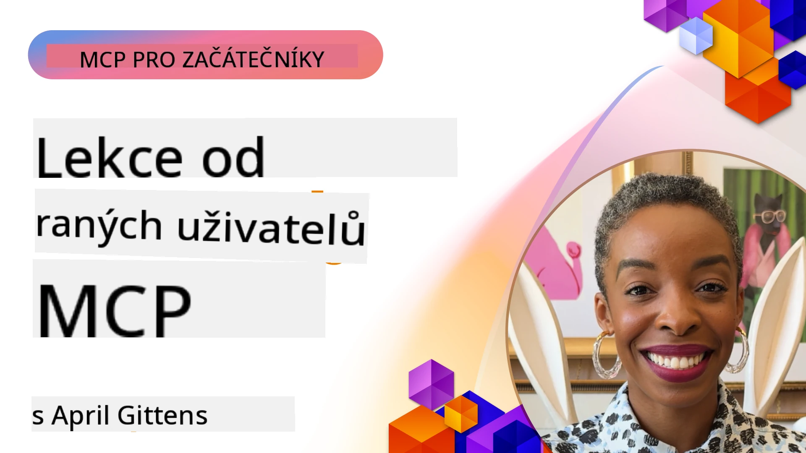

# 🌟 Lekce od prvních uživatelů

[](https://youtu.be/jds7dSmNptE)

_(Klikněte na obrázek výše pro zobrazení videa této lekce)_

## 🎯 Co tento modul pokrývá

Tento modul zkoumá, jak skutečné organizace a vývojáři využívají Model Context Protocol (MCP) k řešení reálných výzev a podpoře inovací. Díky podrobným případovým studiím, praktickým projektům a příkladům zjistíte, jak MCP umožňuje bezpečnou, škálovatelnou integraci AI, která propojuje jazykové modely, nástroje a podniková data.

### 📚 Podívejte se na MCP v akci

Chcete vidět tyto principy použité v nástrojích připravených pro produkční použití? Podívejte se na náš [**10 Microsoft MCP serverů, které mění produktivitu vývojářů**](microsoft-mcp-servers.md), které ukazují skutečné Microsoft MCP servery, které můžete používat ještě dnes.

## Přehled

Tato lekce zkoumá, jak první uživatelé využili Model Context Protocol (MCP) k řešení reálných výzev a podpoře inovací napříč průmyslovými odvětvími. Díky podrobným případovým studiím a praktickým projektům uvidíte, jak MCP umožňuje standardizovanou, bezpečnou a škálovatelnou integraci AI — propojující velké jazykové modely, nástroje a podniková data v jednotném rámci. Získáte praktické zkušenosti s návrhem a vytvářením řešení založených na MCP, naučíte se osvědčené implementační vzory a objevíte nejlepší praktiky nasazení MCP v produkčních prostředích. Lekce také zdůrazňuje nové trendy, budoucí směry a open-source zdroje, které vám pomohou zůstat na špici technologie MCP a jejího vyvíjejícího se ekosystému.

## Cíle učení

- Analyzovat implementace MCP v reálném světě v různých odvětvích
- Navrhnout a postavit kompletní aplikace založené na MCP
- Prozkoumat nové trendy a budoucí směry technologie MCP
- Uplatnit nejlepší praktiky v reálných vývojových scénářích

## Implementace MCP v reálném světě

### Případová studie 1: Automatizace zákaznické podpory ve firmě

Nadnárodní korporace implementovala řešení založené na MCP, aby standardizovala AI interakce napříč systémy zákaznické podpory. To jí umožnilo:

- Vytvořit jednotné rozhraní pro více poskytovatelů LLM
- Udržovat konzistentní správu promptů mezi odděleními
- Zavést robustní bezpečnostní a souladové kontroly
- Snadno přepínat mezi různými AI modely podle specifických potřeb

**Technická implementace:**

```python
# Implementace Python MCP serveru pro zákaznickou podporu
import logging
import asyncio
from modelcontextprotocol import create_server, ServerConfig
from modelcontextprotocol.server import MCPServer
from modelcontextprotocol.transports import create_http_transport
from modelcontextprotocol.resources import ResourceDefinition
from modelcontextprotocol.prompts import PromptDefinition
from modelcontextprotocol.tool import ToolDefinition

# Konfigurace logování
logging.basicConfig(level=logging.INFO)

async def main():
    # Vytvoření konfigurace serveru
    config = ServerConfig(
        name="Enterprise Customer Support Server",
        version="1.0.0",
        description="MCP server for handling customer support inquiries"
    )
    
    # Inicializace MCP serveru
    server = create_server(config)
    
    # Registrace zdrojů znalostní báze
    server.resources.register(
        ResourceDefinition(
            name="customer_kb",
            description="Customer knowledge base documentation"
        ),
        lambda params: get_customer_documentation(params)
    )
    
    # Registrace šablon výzev
    server.prompts.register(
        PromptDefinition(
            name="support_template",
            description="Templates for customer support responses"
        ),
        lambda params: get_support_templates(params)
    )
    
    # Registrace nástrojů podpory
    server.tools.register(
        ToolDefinition(
            name="ticketing",
            description="Create and update support tickets"
        ),
        handle_ticketing_operations
    )
    
    # Spuštění serveru s HTTP přenosem
    transport = create_http_transport(port=8080)
    await server.run(transport)

if __name__ == "__main__":
    asyncio.run(main())
```

**Výsledky:** 30% snížení nákladů na modely, 45% zlepšení konzistence odpovědí a zvýšená compliance v globálních operacích.

### Případová studie 2: Diagnostický asistent pro zdravotnictví

Poskytovatel zdravotní péče vyvinul infrastrukturu MCP pro integraci několika specializovaných lékařských AI modelů přičemž zajistil ochranu citlivých dat pacientů:

- Bezproblémové přepínání mezi generalistickými a specializovanými lékařskými modely
- Přísné kontroly soukromí a auditní stopy
- Integrace s existujícími systémy elektronických zdravotních záznamů (EHR)
- Konzistentní prompt engineering pro lékařskou terminologii

**Technická implementace:**

```csharp
// C# MCP host application implementation in healthcare application
using Microsoft.Extensions.DependencyInjection;
using ModelContextProtocol.SDK.Client;
using ModelContextProtocol.SDK.Security;
using ModelContextProtocol.SDK.Resources;

public class DiagnosticAssistant
{
    private readonly MCPHostClient _mcpClient;
    private readonly PatientContext _patientContext;
    
    public DiagnosticAssistant(PatientContext patientContext)
    {
        _patientContext = patientContext;
        
        // Configure MCP client with healthcare-specific settings
        var clientOptions = new ClientOptions
        {
            Name = "Healthcare Diagnostic Assistant",
            Version = "1.0.0",
            Security = new SecurityOptions
            {
                Encryption = EncryptionLevel.Medical,
                AuditEnabled = true
            }
        };
        
        _mcpClient = new MCPHostClientBuilder()
            .WithOptions(clientOptions)
            .WithTransport(new HttpTransport("https://healthcare-mcp.example.org"))
            .WithAuthentication(new HIPAACompliantAuthProvider())
            .Build();
    }
    
    public async Task<DiagnosticSuggestion> GetDiagnosticAssistance(
        string symptoms, string patientHistory)
    {
        // Create request with appropriate resources and tool access
        var resourceRequest = new ResourceRequest
        {
            Name = "patient_records",
            Parameters = new Dictionary<string, object>
            {
                ["patientId"] = _patientContext.PatientId,
                ["requestingProvider"] = _patientContext.ProviderId
            }
        };
        
        // Request diagnostic assistance using appropriate prompt
        var response = await _mcpClient.SendPromptRequestAsync(
            promptName: "diagnostic_assistance",
            parameters: new Dictionary<string, object>
            {
                ["symptoms"] = symptoms,
                patientHistory = patientHistory,
                relevantGuidelines = _patientContext.GetRelevantGuidelines()
            });
            
        return DiagnosticSuggestion.FromMCPResponse(response);
    }
}
```

**Výsledky:** Vylepšené diagnostické návrhy pro lékaře při plném dodržení HIPAA a výrazné snížení přepínání kontextu mezi systémy.

### Případová studie 3: Analýza rizik ve finančních službách

Finanční instituce implementovala MCP ke standardizaci svých procesů analýzy rizik v různých odděleních:

- Vytvořila jednotné rozhraní pro modely kreditního rizika, detekce podvodů a investičního rizika
- Zavedeny přísné kontroly přístupu a verze modelů
- Zajištěna auditovatelnost všech doporučení AI
- Udržováno konzistentní formátování dat napříč různorodými systémy

**Technická implementace:**

```java
// Java MCP server pro hodnocení finančního rizika
import org.mcp.server.*;
import org.mcp.security.*;

public class FinancialRiskMCPServer {
    public static void main(String[] args) {
        // Vytvořit MCP server s funkcemi finanční shody
        MCPServer server = new MCPServerBuilder()
            .withModelProviders(
                new ModelProvider("risk-assessment-primary", new AzureOpenAIProvider()),
                new ModelProvider("risk-assessment-audit", new LocalLlamaProvider())
            )
            .withPromptTemplateDirectory("./compliance/templates")
            .withAccessControls(new SOCCompliantAccessControl())
            .withDataEncryption(EncryptionStandard.FINANCIAL_GRADE)
            .withVersionControl(true)
            .withAuditLogging(new DatabaseAuditLogger())
            .build();
            
        server.addRequestValidator(new FinancialDataValidator());
        server.addResponseFilter(new PII_RedactionFilter());
        
        server.start(9000);
        
        System.out.println("Financial Risk MCP Server running on port 9000");
    }
}
```

**Výsledky:** Zvýšená regulační compliance, o 40 % rychlejší cykly nasazování modelů a lepší konzistence hodnocení rizik v odděleních.

### Případová studie 4: Microsoft Playwright MCP Server pro automatizaci prohlížeče

Microsoft vyvinul [Playwright MCP server](https://github.com/microsoft/playwright-mcp), který umožňuje bezpečnou, standardizovanou automatizaci prohlížeče prostřednictvím Model Context Protocol. Tento produkčně připravený server umožňuje AI agentům a LLM komunikovat s webovými prohlížeči kontrolovaným, auditovatelným a rozšiřitelným způsobem — podporující použití případů jako automatizované testování webu, extrakce dat a end-to-end workflow.

> **🎯 Nástroj připravený pro produkci**
> 
> Tato případová studie ukazuje skutečný MCP server, který můžete používat dnes! Více o Playwright MCP Serveru a dalších 9 produkčně připravených Microsoft MCP serverech najdete v našem [**Microsoft MCP Servers Guide**](microsoft-mcp-servers.md#8--playwright-mcp-server).

**Klíčové vlastnosti:**
- Zprostředkovává schopnosti automatizace prohlížeče (navigace, vyplňování formulářů, zachycování snímků obrazovky apod.) jako MCP nástroje
- Zavádí přísné kontroly přístupu a sandboxing, aby zabránil neoprávněným akcím
- Poskytuje podrobné auditní záznamy všech interakcí s prohlížečem
- Podporuje integraci s Azure OpenAI a dalšími poskytovateli LLM pro agentně řízenou automatizaci
- Napájí GitHub Copilot Coding Agenta schopností prohlížení webu

**Technická implementace:**

```typescript
// TypeScript: Registrace nástrojů pro automatizaci prohlížeče Playwright v serveru MCP
import { createServer, ToolDefinition } from 'modelcontextprotocol';
import { launch } from 'playwright';

const server = createServer({
  name: 'Playwright MCP Server',
  version: '1.0.0',
  description: 'MCP server for browser automation using Playwright'
});

// Registrace nástroje pro navigaci na URL a zachycení screenshotu
server.tools.register(
  new ToolDefinition({
    name: 'navigate_and_screenshot',
    description: 'Navigate to a URL and capture a screenshot',
    parameters: {
      url: { type: 'string', description: 'The URL to visit' }
    }
  }),
  async ({ url }) => {
    const browser = await launch();
    const page = await browser.newPage();
    await page.goto(url);
    const screenshot = await page.screenshot();
    await browser.close();
    return { screenshot };
  }
);

// Spuštění serveru MCP
server.listen(8080);
```

**Výsledky:**

- Umožnil bezpečnou programovatelnou automatizaci prohlížeče pro AI agenty a LLM
- Snížil manuální úsilí při testování a zlepšil pokrytí testů webových aplikací
- Poskytl znovupoužitelný a rozšiřitelný rámec pro integraci nástrojů založených na prohlížeči v podnikových prostředích
- Napájí schopnosti webového prohlížení GitHub Copilot

**Odkazy:**

- [Playwright MCP Server GitHub Repository](https://github.com/microsoft/playwright-mcp)
- [Microsoft AI and Automation Solutions](https://azure.microsoft.com/en-us/products/ai-services/)

### Případová studie 5: Azure MCP – Podnikový Model Context Protocol jako služba

Azure MCP Server ([https://aka.ms/azmcp](https://aka.ms/azmcp)) je spravovaná podnikově-grade implementace Model Context Protocol od Microsoftu, navržená tak, aby poskytovala škálovatelné, bezpečné a souladu vyhovující MCP serverové možnosti jako cloudovou službu. Azure MCP umožňuje organizacím rychle nasazovat, spravovat a integrovat MCP servery s Azure AI, daty a bezpečnostními službami, snižuje provozní náklady a urychluje adopci AI.

> **🎯 Nástroj připravený pro produkci**
> 
> Toto je reálný MCP server, který můžete používat zítra! Více o Microsoft Foundry MCP Serveru se dozvíte v našem [**Microsoft MCP Servers Guide**](microsoft-mcp-servers.md).


- Kompletně spravovaný hosting MCP serveru s vestavěným škálováním, monitorováním a zabezpečením
- Nativní integrace s Azure OpenAI, Azure AI Search a dalšími Azure službami
- Podniková autentifikace a autorizace přes Microsoft Entra ID
- Podpora vlastních nástrojů, šablon promptů a konektorů zdrojů
- Soulad s podnikový zabezpečením a regulatorními požadavky

**Technická implementace:**

```yaml
# Example: Azure MCP server deployment configuration (YAML)
apiVersion: mcp.microsoft.com/v1
kind: McpServer
metadata:
  name: enterprise-mcp-server
spec:
  modelProviders:
    - name: azure-openai
      type: AzureOpenAI
      endpoint: https://<your-openai-resource>.openai.azure.com/
      apiKeySecret: <your-azure-keyvault-secret>
  tools:
    - name: document_search
      type: AzureAISearch
      endpoint: https://<your-search-resource>.search.windows.net/
      apiKeySecret: <your-azure-keyvault-secret>
  authentication:
    type: EntraID
    tenantId: <your-tenant-id>
  monitoring:
    enabled: true
    logAnalyticsWorkspace: <your-log-analytics-id>
```

**Výsledky:**  
- Snížený čas k hodnotě pro podnikové AI projekty díky připravené, souladu vyhovující MCP serverové platformě
- Zjednodušená integrace LLM, nástrojů a podnikových datových zdrojů
- Zlepšené zabezpečení, pozorovatelnost a provozní efektivita pro MCP zátěže
- Lepší kvalita kódu díky Azure SDK nejlepším praktikám a aktuálním autentifikacím vzorům

**Odkazy:**  
- [Azure MCP Documentace](https://aka.ms/azmcp)
- [Azure MCP Server GitHub Repository](https://github.com/Azure/azure-mcp)
- [Azure AI Služby](https://azure.microsoft.com/en-us/products/ai-services/)
- [Microsoft MCP Centrum](https://mcp.azure.com)

## Případová studie 6: NLWeb 
MCP (Model Context Protocol) je nově vznikající protokol pro chatboty a AI asistenty k interakci s nástroji. Každá instance NLWeb je také MCP server, který podporuje jednu základní metodu ask, jež slouží k položení otázky na webovou stránku v přirozeném jazyce. Vrácená odpověď využívá schema.org, široce používaný slovník pro popis webových dat. Volně řečeno, MCP je NLWeb jako Http je k HTML. NLWeb kombinuje protokoly, formáty Schema.org a vzorový kód, aby pomohl webům rychle vytvořit tyto koncové body, které prospívají jak lidem díky konverzačním rozhraním, tak strojům díky přirozené agent-za-agent interakci.

NLWeb má dvě odlišné součásti.
- Protokol, velmi jednoduchý na začátek, pro rozhraní s webem v přirozeném jazyce a formát, který využívá JSON a schema.org pro vrácenou odpověď. Více v dokumentaci REST API.
- Přímou implementaci (1), která využívá existující značkování pro weby, které lze abstraktovat jako seznamy položek (produkty, recepty, atrakce, recenze atd.). Spolu se sadou uživatelských widgetů umožňuje webům snadno poskytovat konverzační rozhraní ke svému obsahu. Více v dokumentaci Life of a chat query o tom, jak to funguje.
 
**Odkazy:**  
- [Azure MCP Documentace](https://aka.ms/azmcp)
- [NLWeb](https://github.com/microsoft/NlWeb)

### Případová studie 7: Microsoft Foundry MCP Server – Integrace podnikového AI agenta

Microsoft Foundry MCP servery ukazují, jak MCP může být použito k orchestraci a správě AI agentů a workflow v podnikovém prostředí. Integrací MCP s Microsoft Foundry mohou organizace standardizovat interakce agentů, využívat správu workflow Foundry a zajistit bezpečná, škálovatelná nasazení.

> **🎯 Nástroj připravený pro produkci**
> 
> Toto je reálný MCP server, který můžete používat ještě dnes! Více o Microsoft Foundry MCP Serveru najdete v našem [**Microsoft MCP Servers Guide**](microsoft-mcp-servers.md#9--microsoft-foundry-mcp-server).

**Klíčové vlastnosti:**
- Komplexní přístup k AI ekosystému Azure včetně katalogů modelů a správy nasazení
- Indexování znalostí s Azure AI Search pro RAG aplikace
- Nástroje hodnocení výkonu AI modelů a zajištění kvality
- Integrace s Microsoft Foundry Catalog a Labs pro nejmodernější výzkumné modely
- Správa agentů a hodnotící schopnosti pro produkční scénáře

**Výsledky:**
- Rychlé prototypování a robustní monitorování workflow AI agentů
- Bezproblémová integrace s Azure AI službami pro pokročilé scénáře
- Jednotné rozhraní pro vytváření, nasazení a sledování pipelines agentů
- Lepší bezpečnost, compliance a provozní efektivita pro podniky
- Urchlení adopce AI při zachování kontroly nad složitými procesy řízenými agenty

**Odkazy:**
- [Microsoft Foundry MCP Server GitHub Repository](https://github.com/azure-ai-foundry/mcp-foundry)
- [Integrating Azure AI Agents with MCP (Microsoft Foundry Blog)](https://devblogs.microsoft.com/foundry/integrating-azure-ai-agents-mcp/)

### Případová studie 8: Foundry MCP Playground – Experimentování a prototypování

Foundry MCP Playground nabízí připravené prostředí pro experimentování s MCP servery a integracemi Microsoft Foundry. Vývojáři mohou rychle prototypovat, testovat a hodnotit AI modely a workflow agentů za použití zdrojů z Microsoft Foundry Catalog a Labs. Playground zjednodušuje nastavení, poskytuje ukázkové projekty a podporuje spolupráci, což usnadňuje prozkoumání nejlepších praktik a nových scénářů s minimálními náklady. Je zvlášť užitečný pro týmy, které chtějí validovat nápady, sdílet experimenty a urychlit učení bez potřeby složité infrastruktury. Snížením vstupní bariéry podporuje inovace a komunitní příspěvky v ekosystému MCP a Microsoft Foundry.

**Odkazy:**

- [Foundry MCP Playground GitHub Repository](https://github.com/azure-ai-foundry/foundry-mcp-playground)

### Případová studie 9: Microsoft Learn Docs MCP Server – Přístup k dokumentaci poháněné AI

Microsoft Learn Docs MCP Server je cloudová služba, která poskytuje AI asistentům přístup v reálném čase k oficiální Microsoft dokumentaci prostřednictvím Model Context Protocol. Tento produkčně připravený server se připojuje k rozsáhlému ekosystému Microsoft Learn a umožňuje sémantické vyhledávání napříč všemi oficiálními zdroji Microsoftu.

> **🎯 Nástroj připravený pro produkci**
> 
> Toto je reálný MCP server, který můžete používat dnes! Více o Microsoft Learn Docs MCP Serveru najdete v našem [**Microsoft MCP Servers Guide**](microsoft-mcp-servers.md#1--microsoft-learn-docs-mcp-server).

**Klíčové vlastnosti:**
- Přístup v reálném čase k oficiální Microsoft dokumentaci, Azure dokumentům a dokumentaci Microsoft 365
- Pokročilé sémantické vyhledávání, které chápe kontext a záměr
- Vždy aktuální informace, protože obsah Microsoft Learn je publikován průběžně
- Komplexní pokrytí Microsoft Learn, Azure dokumentace a zdrojů Microsoft 365
- Vrací až 10 vysoce kvalitních obsahových bloků s názvy článků a URL odkazy

**Proč je to kritické:**
- Řeší problém „zastaralých AI znalostí“ pro Microsoft technologie
- Zajišťuje, že AI asistenti mají přístup k nejnovějším funkcím .NET, C#, Azure a Microsoft 365
- Poskytuje autoritativní, prvotní informace pro přesnou generaci kódu
- Nezbytné pro vývojáře pracující s rychle se vyvíjejícími Microsoft technologiemi

**Výsledky:**
- Dramaticky zlepšená přesnost AI generovaného kódu pro Microsoft technologie
- Snížený čas strávený hledáním aktuální dokumentace a nejlepších praktik
- Zvýšená produktivita vývojářů díky kontextově uvědomělému vyhledávání dokumentace
- Bezproblémová integrace s vývojovými workflow bez opouštění IDE

**Odkazy:**
- [Microsoft Learn Docs MCP Server GitHub Repository](https://github.com/MicrosoftDocs/mcp)
- [Microsoft Learn Dokumentace](https://learn.microsoft.com/)

## Praktické projekty

### Projekt 1: Vytvoření MCP serveru pro více poskytovatelů

**Cíl:** Vytvořit MCP server, který dokáže směrovat požadavky na více poskytovatelů AI modelů na základě specifických kritérií.

**Požadavky:**

- Podpora minimálně tří různých poskytovatelů modelů (např. OpenAI, Anthropic, lokální modely)
- Implementovat směrovací mechanismus založený na metadatech požadavku
- Vytvořit konfigurační systém pro správu přístupových údajů poskytovatelů
- Přidat cacheování pro optimalizaci výkonu a nákladů
- Vytvořit jednoduchý dashboard pro sledování využití

**Kroky implementace:**

1. Nastavit základní infrastrukturu MCP serveru
2. Implementovat adaptéry poskytovatelů pro každou AI modelovou službu
3. Vytvořit směrovací logiku na základě atributů požadavků
4. Přidat mechanismy cacheování pro časté požadavky
5. Vyvinout dashboard pro monitorování
6. Testovat s různými vzory požadavků

**Technologie:** Vyberte Python (.NET/Java/Python dle preferencí), Redis pro cacheování a jednoduchý webový framework pro dashboard.

### Projekt 2: Podnikový systém správy promptů

**Cíl:** Vyvinout systém založený na MCP pro správu, verzování a nasazení šablon promptů v rámci organizace.

**Požadavky:**


- Vytvořit centralizovaný repozitář pro šablony promptů
- Implementovat verzování a schvalovací workflow
- Vybudovat schopnosti testování šablon se vzorovými vstupy
- Vyvinout řízení přístupu na základě rolí
- Vytvořit API pro získávání a nasazení šablon

**Kroky implementace:**

1. Navrhnout schéma databáze pro ukládání šablon
2. Vytvořit základní API pro operace CRUD se šablonami
3. Implementovat systém verzování
4. Vybudovat schvalovací workflow
5. Vyvinout testovací rámec
6. Vytvořit jednoduché webové rozhraní pro správu
7. Integrovat s MCP serverem

**Technologie:** Vámi zvolený backendový framework, SQL nebo NoSQL databáze a frontendový framework pro rozhraní správy.

### Projekt 3: Platforma pro generování obsahu založená na MCP

**Cíl:** Vybudovat platformu pro generování obsahu, která využívá MCP k zajištění konzistentních výsledků napříč různými typy obsahu.

**Požadavky:**

- Podpora více formátů obsahu (blogové příspěvky, sociální média, marketingové texty)
- Implementace generování založeného na šablonách s možností přizpůsobení
- Vytvořit systém pro kontrolu obsahu a zpětnou vazbu
- Sledovat metriky výkonu obsahu
- Podpora verzování a iterace obsahu

**Kroky implementace:**

1. Nastavit infrastrukturu MCP klienta
2. Vytvořit šablony pro různé typy obsahu
3. Vybudovat pipeline pro generování obsahu
4. Implementovat systém kontroly
5. Vyvinout systém sledování metrik
6. Vytvořit uživatelské rozhraní pro správu šablon a generování obsahu

**Technologie:** Vámi preferovaný programovací jazyk, webový framework a databázový systém.

## Budoucí směry technologie MCP

### Nově vznikající trendy

1. **Multi-modální MCP**
   - Rozšíření MCP pro standardizaci interakcí s modely obrazu, audia a videa
   - Vývoj schopností mezimodálního uvažování
   - Standardizované formáty promptů pro různé modality

2. **Federovaná infrastruktura MCP**
   - Distribuované MCP sítě sdílející zdroje mezi organizacemi
   - Standardizované protokoly pro bezpečné sdílení modelů
   - Techniky výpočtu s ochranou soukromí

3. **Tržiště MCP**
   - Ekosystémy pro sdílení a monetizaci šablon a pluginů MCP
   - Procesy zajištění kvality a certifikace
   - Integrace s tržišti modelů

4. **MCP pro edge computing**
   - Adaptace standardů MCP pro zařízení s omezenými zdroji na okraji sítě
   - Optimalizované protokoly pro prostředí s nízkou šířkou pásma
   - Specializované implementace MCP pro IoT ekosystémy

5. **Regulační rámce**
   - Vývoj rozšíření MCP pro splnění regulačních požadavků
   - Standardizované auditní stopy a rozhraní pro vysvětlitelnost
   - Integrace s nově vznikajícími rámci řízení AI

### Řešení MCP od Microsoftu

Microsoft a Azure vyvinuly několik open-source repozitářů, které pomáhají vývojářům implementovat MCP v různých scénářích:

#### Organizace Microsoft

1. [playwright-mcp](https://github.com/microsoft/playwright-mcp) - Playwright MCP server pro automatizaci a testování v prohlížeči
2. [files-mcp-server](https://github.com/microsoft/files-mcp-server) - Implementace OneDrive MCP serveru pro lokální testování a komunitní příspěvky
3. [NLWeb](https://github.com/microsoft/NlWeb) - NLWeb je kolekce otevřených protokolů a souvisejících open source nástrojů. Jejím hlavním cílem je vybudování základní vrstvy pro AI Web

#### Organizace Azure-Samples

1. [mcp](https://github.com/Azure-Samples/mcp) - Odkazy na ukázky, nástroje a zdroje pro tvorbu a integraci MCP serverů na Azure v různých jazycích
2. [mcp-auth-servers](https://github.com/Azure-Samples/mcp-auth-servers) - Referenční MCP servery demonstrující autentizaci podle současné specifikace Model Context Protocol
3. [remote-mcp-functions](https://github.com/Azure-Samples/remote-mcp-functions) - Úvodní stránka pro implementace vzdálených MCP serverů používajících Azure Functions s odkazy na repozitáře pro různé jazyky
4. [remote-mcp-functions-python](https://github.com/Azure-Samples/remote-mcp-functions-python) - Šablona quickstart pro tvorbu a nasazení vlastních vzdálených MCP serverů pomocí Azure Functions v Pythonu
5. [remote-mcp-functions-dotnet](https://github.com/Azure-Samples/remote-mcp-functions-dotnet) - Šablona quickstart pro tvorbu a nasazení vlastních vzdálených MCP serverů pomocí Azure Functions v .NET/C#
6. [remote-mcp-functions-typescript](https://github.com/Azure-Samples/remote-mcp-functions-typescript) - Šablona quickstart pro tvorbu a nasazení vlastních vzdálených MCP serverů pomocí Azure Functions v TypeScriptu
7. [remote-mcp-apim-functions-python](https://github.com/Azure-Samples/remote-mcp-apim-functions-python) - Azure API Management jako AI brána pro vzdálené MCP servery v Pythonu
8. [AI-Gateway](https://github.com/Azure-Samples/AI-Gateway) - Experimenty APIM ❤️ AI včetně schopností MCP, integrace s Azure OpenAI a AI Foundry

Tyto repozitáře nabízejí různé implementace, šablony a zdroje pro práci s Model Context Protocol napříč různými programovacími jazyky a službami Azure. Pokrývají různé použití od základních implementací serverů přes autentizaci, nasazení v cloudu až po scénáře podnikového propojení.

#### Adresář MCP zdrojů

[Adresář MCP zdrojů](https://github.com/microsoft/mcp/tree/main/Resources) v oficiálním repozitáři Microsoft MCP poskytuje kurátorskou sbírku ukázkových zdrojů, šablon promptů a definic nástrojů pro použití se servery Model Context Protocol. Tento adresář je navržen tak, aby vývojářům pomohl rychle začít s MCP tím, že nabízí znovupoužitelné stavební bloky a příklady osvědčených postupů pro:

- **Šablony promptů:** Hotové šablony promptů pro běžné AI úkoly a scénáře, které lze přizpůsobit pro vlastní implementace MCP serverů.
- **Definice nástrojů:** Ukázkové schémata nástrojů a metadata pro standardizaci integrace a vyvolávání nástrojů napříč MCP servery.
- **Ukázkové zdroje:** Ukázkové definice zdrojů pro připojení ke zdrojům dat, API a externím službám v rámci MCP.
- **Referenční implementace:** Praktické ukázky, jak strukturovat a organizovat zdroje, prompty a nástroje v reálných projektech MCP.

Tyto zdroje zrychlují vývoj, podporují standardizaci a pomáhají zajistit osvědčené postupy při tvorbě a nasazení řešení založených na MCP.

#### Adresář MCP zdrojů

- [MCP Resources (Sample Prompts, Tools, and Resource Definitions)](https://github.com/microsoft/mcp/tree/main/Resources)

### Výzkumné příležitosti

- Efektivní techniky optimalizace promptů v rámci MCP
- Bezpečnostní modely pro multi-tenant nasazení MCP
- Benchmarking výkonu mezi různými implementacemi MCP
- Formální verifikační metody pro MCP servery

## Závěr

Model Context Protocol (MCP) rychle formuje budoucnost standardizované, bezpečné a interoperabilní integrace AI napříč průmysly. Prostřednictvím případových studií a praktických projektů v této lekci jste viděli, jak průkopníci včetně Microsoftu a Azure využívají MCP k řešení reálných problémů, urychlení adopce AI a zajištění souladu, bezpečnosti a škálovatelnosti. Modulární přístup MCP umožňuje organizacím propojit velké jazykové modely, nástroje a podniková data v jednotném, auditovatelném rámci. Jak se MCP vyvíjí, bude klíčové zůstat v kontaktu s komunitou, prozkoumávat open-source zdroje a aplikovat osvědčené postupy pro budování robustních AI řešení připravených do budoucna.

## Další zdroje

- [MCP Foundry GitHub Repository](https://github.com/azure-ai-foundry/mcp-foundry)
- [Foundry MCP Playground](https://github.com/azure-ai-foundry/foundry-mcp-playground)
- [Integrace Azure AI agentů s MCP (Microsoft Foundry Blog)](https://devblogs.microsoft.com/foundry/integrating-azure-ai-agents-mcp/)
- [MCP GitHub Repository (Microsoft)](https://github.com/microsoft/mcp)
- [Adresář MCP zdrojů (ukázkové prompty, nástroje a definice zdrojů)](https://github.com/microsoft/mcp/tree/main/Resources)
- [MCP komunita & dokumentace](https://modelcontextprotocol.io/introduction)
- [Specifikace MCP (2026-07-28)](https://modelcontextprotocol.io/specification/2026-07-28/)
- [Dokumentace Azure MCP](https://aka.ms/azmcp)
- [OWASP MCP Top 10](https://microsoft.github.io/mcp-azure-security-guide/mcp/) - Bezpečnostní osvědčené postupy
- [Playwright MCP Server GitHub Repository](https://github.com/microsoft/playwright-mcp)
- [Files MCP Server (OneDrive)](https://github.com/microsoft/files-mcp-server)
- [Azure-Samples MCP](https://github.com/Azure-Samples/mcp)
- [MCP Auth Servers (Azure-Samples)](https://github.com/Azure-Samples/mcp-auth-servers)
- [Remote MCP Functions (Azure-Samples)](https://github.com/Azure-Samples/remote-mcp-functions)
- [Remote MCP Functions Python (Azure-Samples)](https://github.com/Azure-Samples/remote-mcp-functions-python)
- [Remote MCP Functions .NET (Azure-Samples)](https://github.com/Azure-Samples/remote-mcp-functions-dotnet)
- [Remote MCP Functions TypeScript (Azure-Samples)](https://github.com/Azure-Samples/remote-mcp-functions-typescript)
- [Remote MCP APIM Functions Python (Azure-Samples)](https://github.com/Azure-Samples/remote-mcp-apim-functions-python)
- [AI-Gateway (Azure-Samples)](https://github.com/Azure-Samples/AI-Gateway)
- [Microsoft AI a automatizační řešení](https://azure.microsoft.com/en-us/products/ai-services/)

## Cvičení

1. Analyzujte jednu z případových studií a navrhněte alternativní způsob implementace.
2. Vyberte jeden z projektových nápadů a vytvořte podrobnou technickou specifikaci.
3. Prozkoumejte průmyslové odvětví, které nebylo pokryto v případových studiích, a načrtněte, jak by MCP mohlo řešit jeho specifické výzvy.
4. Prozkoumejte jeden z budoucích směrů a vytvořte koncept nového rozšíření MCP je podporující.

## Co dál

Prozkoumejte více: [Microsoft MCP servery](./microsoft-mcp-servers.md)

Pokračujte na: [Modul 8: Nejlepší postupy](../08-BestPractices/README.md)

---

<!-- CO-OP TRANSLATOR DISCLAIMER START -->
**Prohlášení o omezení odpovědnosti**:
Tento dokument byl přeložen pomocí AI překladatelské služby [Co-op Translator](https://github.com/Azure/co-op-translator). Přestože usilujeme o co největší přesnost, mějte prosím na paměti, že automatizované překlady mohou obsahovat chyby nebo nepřesnosti. Originální dokument v jeho mateřském jazyce by měl být považován za autoritativní zdroj. Pro kritické informace se doporučuje profesionální lidský překlad. Nejsme odpovědní za jakékoli nedorozumění nebo nesprávné interpretace vzniklé použitím tohoto překladu.
<!-- CO-OP TRANSLATOR DISCLAIMER END -->