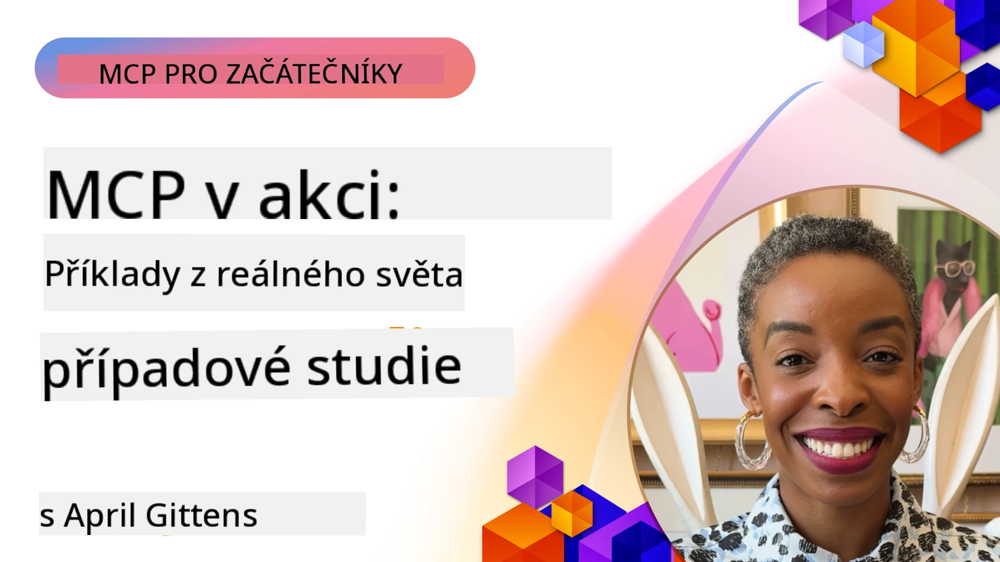

# MCP v praxi: Studie případů ze skutečného světa

_(Klikněte na obrázek výše pro zobrazení videa této lekce)_

Model Context Protocol (MCP) mění způsob, jakým aplikace AI komunikují s daty, nástroji a službami. Tato část představuje reálné studie případů, které ukazují praktické využití MCP v různých podnicích.

## Přehled

Tato sekce ukazuje konkrétní příklady implementací MCP, které zdůrazňují, jak organizace využívají tento protokol k řešení složitých obchodních výzev. Prostřednictvím analýzy těchto případových studií získáte vhled do univerzálnosti, škálovatelnosti a praktických přínosů MCP v reálných situacích.

## Hlavní cíle učení

Prozkoumáním těchto případových studií:

- Pochopíte, jak lze MCP použít k řešení konkrétních obchodních problémů
- Naučíte se o různých integračních vzorech a architektonických přístupech
- Rozpoznáte osvědčené postupy pro implementaci MCP v podnikových prostředích
- Získáte vhled do výzev a řešení setkaných v reálných implementacích
- Identifikujete příležitosti k aplikaci podobných vzorů ve vlastních projektech

## Zveřejněné případové studie

### 1. [Azure AI cestovní agenti – referenční implementace](./travelagentsample.md)

Tato případová studie zkoumá komplexní referenční řešení Microsoftu, které ukazuje, jak postavit aplikaci pro plánování cest s vícero agenty, řízenou AI pomocí MCP, Azure OpenAI a Azure AI Search. Projekt představuje:

- Orchestrace vícero agentů pomocí MCP
- Integrace podnikových dat s Azure AI Search
- Bezpečnou, škálovatelnou architekturu využívající Azure služby
- Rozšiřitelný nástrojový rámec s opakovaně použitelnými komponentami MCP
- Konverzační uživatelský zážitek poháněný Azure OpenAI

Architektura a podrobnosti implementace dávají cenné poznatky pro budování složitých systémů s více agenty s MCP jako vrstvou koordinace.

### 2. [Aktualizace Azure DevOps položek z YouTube dat](./UpdateADOItemsFromYT.md)

Tato případová studie ukazuje praktické využití MCP pro automatizaci pracovních procesů. Ukazuje, jak lze nástroje MCP použít k:

- Extrakci dat z online platforem (YouTube)
- Aktualizaci pracovních položek v systémech Azure DevOps
- Vytváření opakovatelných automatizačních pracovních toků
- Integraci dat přes rozličné systémy

Tento příklad ilustruje, jak i relativně jednoduché implementace MCP mohou významně zvýšit efektivitu automatizací rutinních úkolů a zlepšením konzistence dat napříč systémy.

### 3. [Vyhledávání dokumentace v reálném čase s MCP](./docs-mcp/README.md)

Tato případová studie vás provede připojením Python konzolového klienta k Model Context Protocol (MCP) serveru pro získání a zaznamenání dokumentace Microsoft v reálném čase a s kontextovým povědomím. Naučíte se, jak:

- Připojit se k MCP serveru pomocí Python klienta a oficiálního MCP SDK
- Používat HTTP streamingové klienty pro efektivní získávání dat v reálném čase
- Volat nástroje pro dokumentaci na serveru a zaznamenávat odezvy přímo do konzole
- Integrovat aktuální Microsoft dokumentaci do svého pracovního postupu bez opuštění terminálu

Kapitola obsahuje praktické zadání, minimální funkční vzorek kódu a odkazy na další zdroje pro hlubší studium. Viz kompletní průvodce a kód v propojené kapitole, abyste pochopili, jak MCP může transformovat přístup k dokumentaci a produktivitu vývojářů v konzolových prostředích.

### 4. [Interaktivní generátor učebních plánů Web App s MCP](./docs-mcp/README.md)

Tato případová studie ukazuje, jak postavit interaktivní webovou aplikaci pomocí Chainlit a Model Context Protocol (MCP) pro generování personalizovaných učebních plánů pro jakékoli téma. Uživatelé mohou specifikovat předmět (např. "certifikace AI-900") a dobu studia (např. 8 týdnů) a aplikace poskytne týdenní přehled doporučeného obsahu. Chainlit umožňuje konverzační chatové rozhraní, což dělá zážitek poutavým a adaptivním.

- Konverzační webová aplikace poháněná Chainlit
- Uživatelsky řízené zadání tématu a délky trvání
- Doporučení obsahu po týdnech pomocí MCP
- Realtime, adaptivní odpovědi v chatovém rozhraní

Projekt ukazuje, jak lze konverzační AI a MCP zkombinovat k vytvoření dynamických, uživatelsky řízených vzdělávacích nástrojů v moderním webovém prostředí.

### 5. [Dokumentace v editoru s MCP serverem ve VS Code](./docs-mcp/README.md)

Tato případová studie ukazuje, jak můžete přinést Microsoft Learn Docs přímo do svého prostředí VS Code pomocí MCP serveru—už žádné přepínání záložek v prohlížeči! Uvidíte, jak:

- Okamžitě vyhledávat a číst dokumentaci přímo ve VS Code pomocí panelu MCP nebo příkazové palety
- Odkazovat dokumentaci a vkládat odkazy přímo do README nebo markdown souborů kurzu
- Používat GitHub Copilot a MCP společně pro hladké, AI-poháněné pracovní toky dokumentace a kódu
- Validovat a vylepšovat svou dokumentaci s okamžitou zpětnou vazbou a přesností od Microsoftu
- Integrovat MCP s GitHub pracovními toky pro kontinuální validaci dokumentace

Implementace obsahuje:

- Příklad konfigurace `.vscode/mcp.json` pro snadné nastavení
- Průvodce s screenshoty zážitku in-editoru
- Tipy pro kombinaci Copilot a MCP pro maximální produktivitu

Tento scénář je ideální pro autory kurzů, tvůrce dokumentace a vývojáře, kteří chtějí zůstat soustředění v editoru při práci s dokumentací, Copilotem a validačními nástroji—vše poháněné MCP.

### 6. [Vytvoření APIM MCP serveru](./apimsample.md)

Tato případová studie poskytuje krok za krokem návod, jak vytvořit MCP server pomocí Azure API Management (APIM). Pokrývá:

- Nastavení MCP serveru v Azure API Management
- Zpřístupnění API operací jako MCP nástrojů
- Konfiguraci zásad pro omezení rychlosti a zabezpečení
- Testování MCP serveru pomocí Visual Studio Code a GitHub Copilot

Tento příklad ukazuje, jak využít možnosti Azure k vytvoření robustního MCP serveru, který lze využít v různých aplikacích a zlepšit integraci AI systémů s podnikových API.

### 7. [GitHub MCP Registry — zrychlení agentní integrace](https://github.com/mcp)

Tato případová studie zkoumá, jak GitHub MCP Registry, uvedený na trh v září 2025, řeší zásadní problém v AI ekosystému: fragmentované vyhledávání a nasazení Model Context Protocol (MCP) serverů.

#### Přehled
**MCP Registry** řeší rostoucí problém roztříštěných MCP serverů napříč repozitáři a registry, které dříve zpomalovaly integraci a zvyšovaly chybovost. Tyto servery umožňují AI agentům komunikovat s externími systémy, jako jsou API, databáze a zdroje dokumentace.

#### Problém
Vývojáři budující agentní workflow čelili několika výzvám:
- **Špatná dohledatelnost** MCP serverů napříč různými platformami
- **Duplicitní otázky k nastavení** rozptýlené ve fórech a dokumentaci
- **Bezpečnostní rizika** z neověřených a nedůvěryhodných zdrojů
- **Nedostatek standardizace** v kvalitě a kompatibilitě serverů

#### Architektura řešení
GitHub MCP Registry centralizuje důvěryhodné MCP servery s klíčovými vlastnostmi:
- **Jedno-klikové instalace** integrace přes VS Code pro jednoduché nastavení
- **Řazení signálu nad šumem** podle hvězdiček, aktivity a ověření komunitou
- **Přímá integrace** s GitHub Copilot a dalšími MCP kompatibilními nástroji
- **Model otevřené spolupráce** umožňující příspěvky komunity i podnikových partnerů

#### Obchodní dopad
Registr poskytl měřitelná zlepšení:
- **Rychlejší nástup** pro vývojáře používající nástroje jako Microsoft Learn MCP Server, který streamuje oficiální dokumentaci přímo do agentů
- **Zvýšená produktivita** díky specializovaným serverům jako `github-mcp-server`, umožňujícím přirozené jazykové GitHub automatizace (vytváření PR, opakování CI, skenování kódu)
- **Silnější důvěra v ekosystém** díky kurátorovaným výpisům a transparentním standardům konfigurace

#### Strategická hodnota
Pro specialisty na správu životního cyklu agentů a reprodukovatelné pracovní toky registr poskytuje:
- **Modulární nasazení agentů** s použitím standardizovaných komponent
- **Pipelines pro hodnocení podpořené registrem** pro konzistentní testování a validaci
- **Interoperabilitu napříč nástroji** umožňující bezproblémovou integraci mezi různými AI platformami

Tato případová studie ukazuje, že MCP Registry není pouze adresářem — je to základní platforma pro škálovatelnou, reálnou integraci modelů a nasazení agentních systémů.

### 8. [Publikování na sociálních sítích z agenta](./publora-social-publishing.md)

Tato případová studie vede čtenáře skrze **zapisovatelný vzdálený MCP server** — server, jehož nástroje provádějí nevratné akce jménem uživatele — s příkladem sociálního publikování. Agent vytvoří příspěvek, člověk ho schválí a server ho naplánuje na různé sítě.

Zajímavou částí jsou návrhové omezující faktory, které publikování ukládá, a platí pro jakýkoli server, který zapisuje místo čtení:

- **Otevřený dohled, autentizovaná exekuce** — `tools/list` odpovídá bez přihlašovacích údajů, aby registry a klienti mohli introspektovat, zatímco každý `tools/call` vyžaduje token a jinak vrací `401` s hlavičkou `WWW-Authenticate`
- **OAuth registrace bez kroku mimo pásmo** — dynamická registrace klienta dnes, s dokumenty metadat Client ID jako směr, kterým se specifikace `2026-07-28` ubírá
- **Anotace nástrojů** (`readOnlyHint`, `destructiveHint`, `idempotentHint`), které klienti používají k rozhodnutí, co potvrdit — náznaky, nikoli vynucení, a něco, co nyní očekávají katalogy konektorů při recenzi
- **Nezpochybnitelné identifikátory**, takže vymyšlená hodnota zruší operaci hlasitě místo akce na vypadající pravděpodobné hodnotě
- **Klíče idempotence na nástrojích vytvářejících příspěvek**, takže opakování runtime agentem nezpůsobí duplikátní publikaci
- **Nástroj se schématem popisujícím no-op cíl**, který otestuje celou cestu zápisu a nic nepublikuje, pro recenzenty a CI

Kapitola končí krátkým kontrolním seznamem, který můžete použít u serveru, který budujete.

## Závěr

Těchto osm komplexních případových studií ukazuje pozoruhodnou všestrannost a praktické využití Model Context Protocol napříč různými reálnými scénáři. Od složitých systémů plánování cest s více agenty a integrace podnikových API přes zjednodušené workflow pro dokumentaci až po revoluční GitHub MCP Registry – tyto příklady ukazují, jak MCP poskytuje standardizovaný, škálovatelný způsob propojení AI systémů s nástroji, daty a službami, které potřebují k poskytování výjimečné hodnoty.

Případové studie pokrývají různé dimenze implementace MCP:
- **Podniková integrace**: Azure API Management a Azure DevOps automatizace
- **Orchestrace více agentů**: Plánování cest s koordinovanými AI agenty
- **Produktivita vývojářů**: Integrace do VS Code a přístup k dokumentaci v reálném čase
- **Vývoj ekosystému**: GitHub MCP Registry jako základní platforma
- **Vzdělávací aplikace**: Interaktivní generátory učebních plánů a konverzační rozhraní

Studiem těchto implementací získáte klíčové poznatky o:
- **Architektonických vzorech** pro různé velikosti a případ použití
- **Strategiích implementace** vyvažujících funkčnost a udržovatelnost
- **Bezpečnostních a škálovatelnostních** úvahách pro produkční nasazení
- **Osvědčených postupech** pro vývoj MCP serverů a integraci klientů
- **Myšlení o ekosystému** pro budování propojených řešení poháněných AI

Tyto příklady společně dokazují, že MCP není pouze teoretický rámec, ale zralý, produkčně připravený protokol umožňující praktická řešení složitých obchodních výzev. Ať budujete jednoduché automatizační nástroje nebo sofistikované systémy s více agenty, vzory a přístupy zde uvedené poskytují pevný základ pro vaše vlastní MCP projekty.

## Další zdroje

- [Azure AI Travel Agents GitHub Repository](https://github.com/Azure-Samples/azure-ai-travel-agents)
- [Azure DevOps MCP Tool](https://github.com/microsoft/azure-devops-mcp)
- [Playwright MCP Tool](https://github.com/microsoft/playwright-mcp)
- [Microsoft Docs MCP Server](https://github.com/MicrosoftDocs/mcp)
- [GitHub MCP Registry — zrychlení agentní integrace](https://github.com/mcp)
- [MCP Community Examples](https://github.com/microsoft/mcp)

## Co bude dál

- Předchozí: [Modul 8: Nejlepší praxe](../08-BestPractices/README.md)
- Další: [Modul 10: Zjednodušení AI workflow: Vybudování MCP serveru s AI Toolkit](../10-StreamliningAIWorkflowsBuildingAnMCPServerWithAIToolkit/README.md)

---

<!-- CO-OP TRANSLATOR DISCLAIMER START -->
**Prohlášení o omezení odpovědnosti**:
Tento dokument byl přeložen pomocí AI překladatelské služby [Co-op Translator](https://github.com/Azure/co-op-translator). Přestože usilujeme o co největší přesnost, mějte prosím na paměti, že automatizované překlady mohou obsahovat chyby nebo nepřesnosti. Originální dokument v jeho mateřském jazyce by měl být považován za autoritativní zdroj. Pro kritické informace se doporučuje profesionální lidský překlad. Nejsme odpovědní za jakékoli nedorozumění nebo nesprávné interpretace vzniklé použitím tohoto překladu.
<!-- CO-OP TRANSLATOR DISCLAIMER END -->