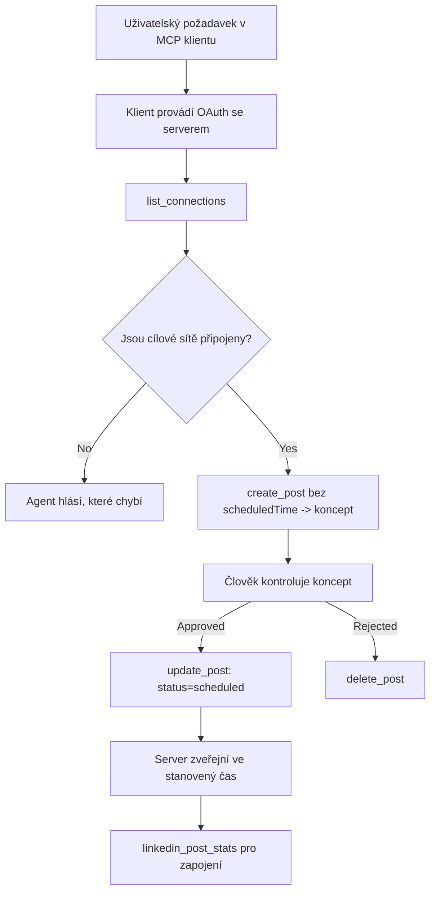

# Případová studie: Publikování do sociálních sítí z agenta s dálkovým MCP serverem

> **Prohlášení:** Několik služeb a open-source projektů umí publikovat do sociálních sítí, a tým může také integrovat API každé sítě přímo. Scénář níže je poskytnut jako jeden praktický příklad, jak lze navrhnout a využívat **dálkový MCP server s možností zápisu**. Publora je komerční služba s bezplatnou vrstvou; vzory zde popsané platí pro jakýkoli MCP server, který provádí nevratné akce jménem uživatele.

## Přehled

Agentům jde dobře vytvářet obsah, ale nikoli ho doručovat. Model dokáže během sekund napsat oznámení o vydání, a pak práce končí: publikování znamená API pro každou síť, OAuth aplikaci pro každou síť a jiné soubory pravidel pro média pro každou z nich. Většina týmů to řeší tak, že text ručně zkopírují do prohlížeče.

Tato případová studie zkoumá, jak je tento poslední krok vyřešen jedním dálkovým MCP serverem a – co je užitečnější pro kohokoli, kdo takový server buduje – jaká designová rozhodnutí musí **server s možností zápisu** správně udělat. Čtení dat je tolerantní. Publikování nikoli: špatné použití nástroje je viditelné pro publikum a nelze ho vzít zpět.

## Scénář

Malý tým pro vztahy s vývojáři připravuje příspěvky uvnitř agenta (Claude, VS Code, Cursor – klient je jedno). Chtějí, aby agent mohl:

- zjistit, které sociální účty má tým propojené,
- vytvořit příspěvek a uložit ho jako koncept k lidskému schválení,
- přiložit obrázek,
- naplánovat ho do několika sítí na vybraný čas,
- a později hlásit, jak si vedl.

Klíčové je, že chtějí, aby agent *nemohl* omylem publikovat, dokud stále experimentují.

## Použité nástroje

- [Publora MCP Server](https://github.com/publora/mcp-server) — dálkový MCP server (`streamable-http`) vystavující nástroje pro publikování, plánování, média a analytiku LinkedIn. Registrován v oficiálním MCP registru jako `com.publora/mcp-server`.

## Průběh krok za krokem

1. **Připojit server.** Klienti, kteří podporují OAuth, dokončí autorizační kódový postup s PKCE na vlastním souhlasném displeji serveru; klienti, kteří ne – například bezhlavé CLI –, použijí API klíč Publora v hlavičce. Obě cesty jsou podporovány a kterou dostanete, závisí na klientovi, nikoli na serveru.
2. **Vypsat propojení.** Agent zavolá `list_connections` a obdrží propojené účty s jejich identifikátory.
3. **Připravit koncept.** Agent zavolá `create_post` *bez* nastaveného času plánování. Příspěvek je uložen jako koncept – nic není publikováno.
4. **Připojit média.** Ve stejném volání jsou předány veřejné URL obrázků; server je stáhne a ověří.
5. **Naplánovat.** Po lidském schválení `update_post` nastaví stav na naplánováno s časem ve formátu ISO 8601.
6. **Měřit.** Pro LinkedIn vrací `linkedin_post_stats` zapojení, jakmile je příspěvek naživu.

## Příklad promptu

```text
Which social accounts do I have connected?
Draft a post announcing our new changelog page, attach the screenshot at
https://example.com/changelog.png, and keep it as a draft — do not publish it.
Once I approve, schedule it to LinkedIn and Bluesky for tomorrow at 09:00 UTC.
```

## Mermaid diagram toku



## Technická implementace

Níže uvedené lekce jsou přenosnou částí této případové studie.

### Otevřené zjišťování, autentizované vykonávání

`tools/list` je podáváno bez přihlašovacích údajů; každé `tools/call` vyžaduje token
a jinak vrací `401` s hlavičkou `WWW-Authenticate` ukazující
na metadata protected-resource. Legacy endpoint serveru také odpovídá na
neautentizovaný `initialize` pro klienty na protokolových verzích před
`2026-07-28`; aktuální klienti toto propojení nepoužívají.

Toto server-specifické rozdělení umožňuje registrům, katalogům a klientům
zkoumat názvy nástrojů, schémata a anotace bez tajemství a přitom
zabraňuje anonymnímu vykonání. Otevřené zjišťování je volbou nasazení, nikoli požadavkem MCP; chráněné nasazení může také vyžadovat autorizaci pro `tools/list`.


a podporuje autorizační kódový tok s PKCE (`S256`), obnovovací tokeny a **dynamickou registraci klienta**.

Dynamická registrace odstranila ruční krok pro legacy klienty: bez ní
potřeboval každý klient předem vydané `client_id` od poskytovatele.

Pokládejte to spíše za kompatibilitní chování než za design k napodobení. Revize specifikace `2026-07-28` označuje dynamickou registraci klienta jako zastaralou ve prospěch Dokumentů metadat klienta (Client ID Metadata Documents), kde klient hostuje metadata na stabilní HTTPS URL adrese a tato URL *je* `client_id`. DCR zatím funguje, ale server budovaný dnes by měl plánovat CIMD a DCR ponechat jen pro starší klienty.

### Anotace nástrojů nejsou jen ozdobou

Každý nástroj nese `title` a platné náznaky: `readOnlyHint`, `destructiveHint`, `idempotentHint`, `openWorldHint`.

Jsou dva důvody, proč do nich investovat. Za prvé: klienti používají náznaky k rozhodnutí, co potvrdit s uživatelem — klient může automaticky spustit pouze čtecí dotaz a zastavit se před smazáním pro schválení. Specifikace jasně říká, že anotace jsou důvěryhodné náznaky, nikoli autorizační mechanismus: formují, co klient nabídne, nezastaví nic na serveru a server musí stále prosazovat svá vlastní pravidla. Za druhé: největší adresáře konektorů je nyní *vyžadují* k přezkoumání; server, jehož nástroje postrádají tituly a náznaky, bude odmítnut bez ohledu na kvalitu funkcionality.

### Identifikátory musí být neuhádnutelné

Platformní identifikátory jsou neprůhledné řetězce vrácené `list_connections` a schéma jasně uvádí, že je musíte citovat doslovně a nikdy je nehádat. Server vše ostatní odmítá.

Modely jsou fluentní hádači. Každý server s možností zápisu by měl předpokládat, že identifikátor bude nakonec vymyšlen, a ten případ neprodleně a hlasitě zablokovat, místo aby jednal podle hodnoty, která vypadá pravděpodobně.

### Selhání před publikováním s proveditelnou zprávou

Některé sítě odmítají příspěvky obsahující jen text a vyžadují obrázek nebo video. Toto se ověřuje při plánování příspěvku a chyba jmenuje platformu i chybějící požadavek.

Agent se může zotavit z "Instagram vyžaduje média – přilož obrázek nebo video" bez dalšího zpětného volání. Nemůže se však zotavit z obecného `400`.

### Učiňte opakování bezpečné

Dva nástroje, které vytváří obsah, `create_post` a `update_post`, přijímají klíč idempotence: jeho opakování se stejným požadavkem zopakuje původní odpověď místo vytvoření dvojího příspěvku. Agentní běhy opakují na vypršení časového limitu; bez idempotence pomalá odpověď znamená duplikát publikace. Ostatní nástroje se zápisem – mazání, kroky médií, reakce a komentáře na LinkedIn – klíč nepřijímají, takže jejich opakování není automaticky bezpečné. Stojí za to vědět, které z vašich mutací jsou chráněné a které nikoli.

### Poskytněte způsob, jak testovat bez publikování

Server přijímá rezervovaný cíl `publora-playground`, který je ověřen a uznán jako skutečný cíl a následně zahoděn – nic se nedostane na živý účet. Je popsán přímo ve schématu nástroje, které může každý klient číst bez přihlašovacích údajů: pole `platforms` v `create_post` jej dokumentuje jako "testovací cíl připojení, který nevyžaduje skutečné připojení – příspěvek je přijat a zahoděn, nic není publikováno". Zavolejte jej tak, že jej předáte jako jedinou položku: `platforms: ["publora-playground"]`.

Ukázalo se, že to je jeden z nejužitečnějších detailů celé plochy. Recenzenti adresářů konektorů, přispěvatelé a CI mohou zcela bezpečně otestovat plnou cestu zápisu od začátku do konce bez rizika pro skutečné publikum. Každý MCP server s nevratnými akcemi získává výhodu z dokumentovaného cíle no-op.

## Výsledky a dopad

- Krok publikování se přesunul z prohlížeče do stejné konverzace, kde se obsah píše, a zvyk "nejprve koncept" udržuje člověka v procesu. Buďte přesní, co to znamená: koncept je dohoda, nikoli hranice. Stejný přihlašovací údaj může plánovat i publikovat, takže kdokoli, kdo potřebuje skutečné schválení, musí to prosadit mimo plochu nástroje – oddělené přihlašovací údaje nebo politickou vrstvu před serverem.
- Rozdíly mezi sítěmi – požadavky na média, vlákna, řízení odpovědí – se řeší jednou na serveru místo v každém agentovi, který s ním komunikuje.
- Jeden server podporuje několik MCP klientů bez předem vydaných přihlašovacích údajů.
    Současní klienti mohou používat Client ID Metadata Documents; DCR zůstává záložní možnost
    pro starší klienty.
- Výše uvedená návrhová omezení formovaly přezkoumání adresářů konektorů stejně jako uživatelé: anotace, OAuth a bezpečný testovací cíl byly vyžadovány alespoň jedním z nich.

## Reference

- [Publora MCP Server (zdroj)](https://github.com/publora/mcp-server)
- [Publora API a MCP dokumentace](https://docs.publora.com)
- [MCP zápis v registru: `com.publora/mcp-server`](https://registry.modelcontextprotocol.io/v0/servers?search=com.publora/mcp-server)
- [MCP specifikace — Autorizace](https://modelcontextprotocol.io/specification/2026-07-28/basic/authorization)
- [MCP specifikace — Anotace nástrojů](https://modelcontextprotocol.io/docs/concepts/tools)

## Co dál

- Vezměte MCP server, který budujete, a zkontrolujte tři nejlevnější vylepšení zde: anotace u každého nástroje, klíč idempotence u každého zápisu a dokumentovaný no-op cíl.
- Vyzkoušejte otevřené zjišťování: zavolejte `tools/list` na veřejném vzdáleném serveru bez přihlašovacích údajů a potom zavolejte nástroj a prohlédněte si výzvu `401`.
- Zvažte, co „vrátit zpět“ znamená ve vaší doméně. Publikování má koncepty a mazání; pokud vaše akce nemají ekvivalent, potvrzení patří do designu nástroje, nikoli do promptu.

---

<!-- CO-OP TRANSLATOR DISCLAIMER START -->
**Prohlášení o omezení odpovědnosti**:
Tento dokument byl přeložen pomocí AI překladatelské služby [Co-op Translator](https://github.com/Azure/co-op-translator). Přestože usilujeme o co největší přesnost, mějte prosím na paměti, že automatizované překlady mohou obsahovat chyby nebo nepřesnosti. Originální dokument v jeho mateřském jazyce by měl být považován za autoritativní zdroj. Pro kritické informace se doporučuje profesionální lidský překlad. Nejsme odpovědní za jakékoli nedorozumění nebo nesprávné interpretace vzniklé použitím tohoto překladu.
<!-- CO-OP TRANSLATOR DISCLAIMER END -->