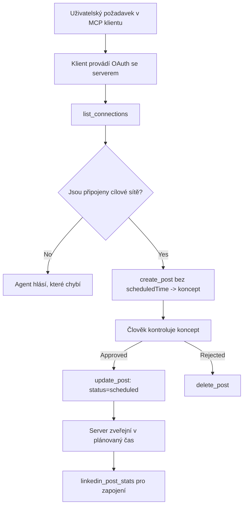

# Případová studie: Publikování na sociální sítě z agenta pomocí vzdáleného MCP serveru

> **Upozornění:** Několik služeb a open-source projektů dokáže publikovat na sociální sítě a tým může také integrovat API každé sítě přímo. Níže uvedený scénář je uveden jako jeden konkrétní příklad, jak může být navržen a používán **vzdálený MCP server s možností zápisu**. Publora je komerční služba s bezplatným tarifem; popsané vzory platí pro jakýkoli MCP server, který na uživatelově přání provádí nevratné akce.

## Přehled

Agentům jde dobře psaní obsahu, ale špatně jeho doručení. Model může během vteřin napsat oznámení zprávy a pak práce končí: publikování znamená API na každou síť, OAuth aplikaci pro každou síť a různé sady pravidel pro média pro každou. Většina týmů toto řeší ručním kopírováním textu do prohlížeče.

Tato případová studie ukazuje, jak je tento poslední krok uzavřen pomocí jediného vzdáleného MCP serveru, a — co je užitečnější pro kohokoli, kdo jeden buduje — jaká designová rozhodnutí musí **server s možností zápisu** správně udělat. Čtení dat je shovívavé. Publikování nikoli: špatný nástrojový příkaz je viditelný publiku a nelze ho vzít zpět.

## Scénář

Malý tým pro vztahy s vývojáři připravuje příspěvky v agentovi (Claude, VS Code, Cursor — klient není podstatný). Chtějí, aby agent:

- viděl, jaké sociální účty má tým připojené,
- vytvořil návrh příspěvku a uchoval ho jako návrh k lidskému schválení,
- připojil obrázek,
- naplánoval ho do několika sítí na zvolený čas,
- a později podával zprávy o jeho výkonu.

Klíčové je, že chtějí, aby agent *nemohl* omylem publikovat, zatímco stále experimentují.

## Použité nástroje

- [Publora MCP Server](https://github.com/publora/mcp-server) — vzdálený MCP server (`streamable-http`), který vystavuje nástroje pro publikování, plánování, média a analytiku LinkedIn. Registrován v oficiálním MCP registru jako `com.publora/mcp-server`.

## Postup krok za krokem

1. **Připojit server.** Klienti podporující OAuth dokončují autorizační kódový tok s PKCE proti vlastnímu oknu souhlasu serveru; klienti bez OAuth, jako například bezhlavé CLI, používají API klíč Publora v hlavičce. Oba způsoby jsou podporovány a který dostanete, závisí na klientovi, ne na serveru.
2. **Seznam připojení.** Agent zavolá `list_connections` a obdrží připojené účty s jejich identifikátory.
3. **Návrh.** Agent zavolá `create_post` *bez* naplánovaného času. Příspěvek se uloží jako návrh — nic se nezveřejní.
4. **Připojit média.** Ve stejném volání jsou předány veřejné URL obrázků; server je stáhne a ověří.
5. **Naplánovat.** Po lidském schválení `update_post` změní stav na naplánováno s časem ve formátu ISO 8601.
6. **Měření.** Pro LinkedIn vrací `linkedin_post_stats` zapojení, jakmile je příspěvek zveřejněn.

## Příklad výzvy

```text
Which social accounts do I have connected?
Draft a post announcing our new changelog page, attach the screenshot at
https://example.com/changelog.png, and keep it as a draft — do not publish it.
Once I approve, schedule it to LinkedIn and Bluesky for tomorrow at 09:00 UTC.
```

## Schéma Mermaid



## Technická implementace

Níže uvedené lekce jsou přenosnou částí této případové studie.

### Otevřený objev, autentizované vykonání

`tools/list` je poskytováno bez ověření; každý `tools/call` vyžaduje token a jinak vrací `401` s hlavičkou `WWW-Authenticate` ukazující na metadata chráněného zdroje. (Server také reaguje na neautentizovaný `initialize`, který je důležitý jen pro klienty na verzích protokolu před `2026-07-28`; tato revize handshake zcela odstranila.)

Tento rozdělení má praktický význam. Registry, katalogy a klienti mohou nahlížet povrch nástrojů — jména, schémata, anotace — bez držení tajemství, ale nic nemůže být *provedeno* anonymně. Server, který požaduje token pro `initialize`, je efektivně neviditelný pro nástroje; server, který dovoluje anonymní `tools/call`, je rizikem.

### Registrace: dynamická registrace klientů a co ji nahrazuje

Server zveřejňuje `/.well-known/oauth-protected-resource` a `/.well-known/oauth-authorization-server` a podporuje autorizační kódový tok s PKCE (`S256`), obnovovací tokeny a **dynamickou registraci klientů**.

Dynamická registrace odstraňuje ruční krok: bez ní každý klient potřebuje předem vydané `client_id`, což znamená mimořádný požadavek na dodavatele pro každého nového klienta.

Berte to jako kompatibilitní chování, nikoli jako návrh ke kopírování. Revize specifikace z `2026-07-28` označuje dynamickou registraci klientů za zastaralou ve prospěch dokumentů metadat Client ID, kde klient hostuje dokument metadat na stabilní HTTPS URL a tato URL *je* `client_id`. DCR stále funguje, ale server budovaný dnes by měl plánovat CIMD a DCR ponechat jen pro starší klienty.

### Anotace nástrojů nejsou ozdoba

Každý nástroj nese `title` a příslušné náznaky: `readOnlyHint`, `destructiveHint`, `idempotentHint`, `openWorldHint`.

Dva důvody, proč do nich investovat. Za prvé, klienti používají náznaky k rozhodnutí, co s uživatelem potvrdit — klient může automaticky spustit dotaz jen pro čtení a zastavit se k potvrzení před smazáním. Specifikace jasně uvádí, že anotace jsou nedůvěryhodné náznaky, nikoli autorizační mechanizmus: formují, co klient nabídne k provedení, nic nezabrání na serveru a server musí stále prosazovat vlastní pravidla. Za druhé, hlavní adresáře konektorů je nyní *vyžadují* pro revizi; server, jehož nástroje postrádají názvy a náznaky, bude odmítnut bez ohledu na kvalitu.

### Udělejte identifikátory nevycucatelnými z prstu

Identifikátory platforem jsou neprůhledné řetězce vrácené voláním `list_connections` a popis schématu jasně říká, že je nutné je kopírovat beze změny a nikdy nehádat. Server jinak požadavek odmítá.

Modely jsou schopné hádat plynule. Každý server s možností zápisu by měl předpokládat, že identifikátor bude nakonec vycucán z hlavy, a nechat tuto cestu zřetelně a rychle selhat místo jednání podle pravděpodobné hodnoty.

### Selhat před publikováním s konkrétní zprávou

Některé sítě odmítají příspěvky pouze s textem a vyžadují obrázek nebo video. To se ověřuje při plánování příspěvku a chyba pojmenuje platformu a chybějící požadavek.

Agent se může zotavit ze zprávy „Instagram vyžaduje média — připojte obrázek nebo video“ bez dalšího kola. Nemůže se zotavit z obecného `400`.

### Zajistěte bezpečnost opakování požadavků

Dvě nástroje, které vytvářejí obsah, `create_post` a `update_post`, přijímají klíč idempotence: opětovné použití se stejným požadavkem přehraje původní odpověď místo vytvoření druhého příspěvku. Agent runtime opakuje při timeoutu; bez idempotence pomalá odpověď způsobí duplicitní publikaci. Ostatní zápisové nástroje — mazání, kroky médií, reakce a komentáře LinkedIn — jej nepřijímají, takže tam opakování není automaticky bezpečné. Je dobré vědět, které z vlastních mutací jsou chráněné a které ne.

### Poskytněte způsob testování, který nic nepublikuje

Server akceptuje rezervovaný cíl `publora-playground`, který je ověřen a potvrzen jako skutečný cíl a pak zamítnut — nic nedojde do živého účtu. Je popsán v samotném schématu nástroje, které může každý klient číst bez přihlašovacích údajů: pole `platforms` u `create_post` ho uvádí jako „testovací cíl připojení, který nevyžaduje skutečné připojení — příspěvek je potvrzen a zamítnut, nic není publikováno“. Vyvolá se předáním jako jediný prvek: `platforms: ["publora-playground"]`.

Ukázalo se, že je to jeden z nejužitečnějších detailů celé plochy. Recenzenti adresářů konektorů, přispěvatelé a CI mohou otestovat celý zápisový proces end-to-end bez rizika pro skutečné publikum. Každý MCP server s nevratnými akcemi z toho profituje díky zdokumentovanému neakčnímu cíli.

## Výsledky a dopad

- Krok publikování se přesunul z prohlížeče do stejné konverzace, kde se obsah píše, a zvyk „nejdříve návrh“ udržuje člověka ve smyčce. Buďte přesní v tom, co to znamená: návrh je konvence, ne hranice. Stejný oprávnění může plánovat i publikovat, takže kdo potřebuje skutečné schvalovací místo, musí to vynutit mimo nástrojový povrch — samostatná oprávnění nebo policy vrstva před serverem.
- Rozdíly mezi sítěmi — požadavky na média, vlákna, kontrola odpovědí — jsou řešeny jednou na serveru místo v každém agentovi, který s ním komunikuje.
- Jeden server podporuje několik MCP klientů bez práce na klientskou stranu, protože objevování je otevřené a registrace dynamická.
- Designová omezení výše byla formována jak recenzemi adresářů konektorů, tak uživateli: anotace, OAuth a bezpečný testovací cíl byl vyžadován alespoň jedním z nich.

## Reference

- [Publora MCP Server (zdroj)](https://github.com/publora/mcp-server)
- [Publora API a dokumentace MCP](https://docs.publora.com)
- [Záznam v registru MCP: `com.publora/mcp-server`](https://registry.modelcontextprotocol.io/v0/servers?search=com.publora/mcp-server)
- [Specifikace MCP — Autorizace](https://modelcontextprotocol.io/specification/draft/basic/authorization)
- [Specifikace MCP — Anotace nástrojů](https://modelcontextprotocol.io/docs/concepts/tools)

## Co dále

- Vezměte si MCP server, který stavíte, a zkontrolujte zde tři nejlevnější vylepšení: anotace u každého nástroje, klíč idempotence u každého zápisu a popsaný neakční cíl.
- Vyzkoušejte rozdělení otevřeného objevu: zvolte `tools/list` proti veřejnému vzdálenému serveru bez přihlašovacích údajů, pak zavolejte nástroj a prohlédněte si výzvu `401`.
- Zvažte, co "zpět" znamená pro vaši doménu. Publikování má návrhy a mazání; pokud vaše akce nemají ekvivalent, potvrzení patří do návrhu nástroje, ne do výzvy.

---

<!-- CO-OP TRANSLATOR DISCLAIMER START -->
**Prohlášení o omezení odpovědnosti**:
Tento dokument byl přeložen pomocí AI překladatelské služby [Co-op Translator](https://github.com/Azure/co-op-translator). Přestože usilujeme o co největší přesnost, mějte prosím na paměti, že automatizované překlady mohou obsahovat chyby nebo nepřesnosti. Originální dokument v jeho mateřském jazyce by měl být považován za autoritativní zdroj. Pro kritické informace se doporučuje profesionální lidský překlad. Nejsme odpovědní za jakékoli nedorozumění nebo nesprávné interpretace vzniklé použitím tohoto překladu.
<!-- CO-OP TRANSLATOR DISCLAIMER END -->