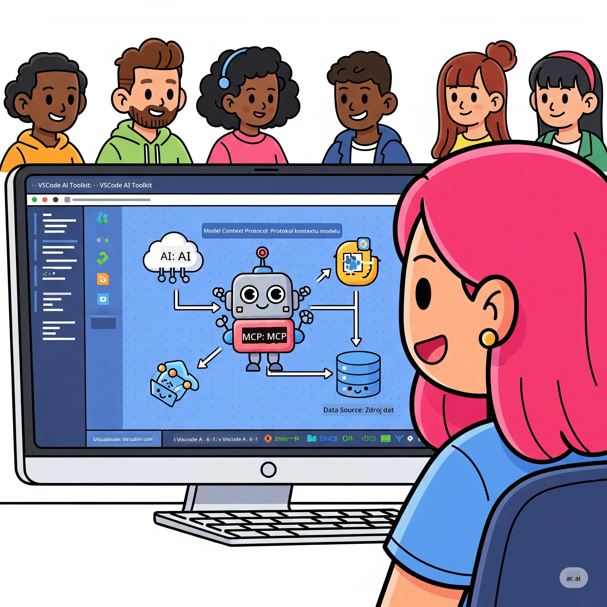
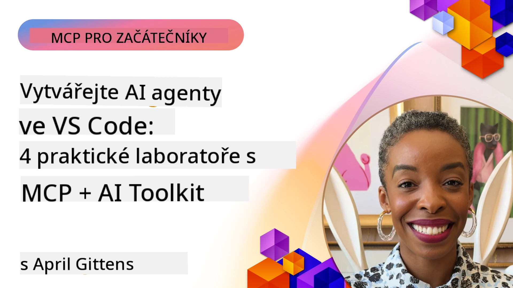

# Zjednodušení AI pracovních toků: Vytvoření MCP serveru s Microsoft Foundry Toolkit

## 🎯 Přehled

_(Klikněte na obrázek nahoře pro zobrazení videa této lekce)_

Vítejte na **Model Context Protocol (MCP) Workshopu**! Tento komplexní praktický workshop kombinuje dvě špičkové technologie, které revolučně mění vývoj AI aplikací:

> **Poznámka o kompatibilitě:** kód workshopu byl vytvořen a testován s MCP
> `2025-11-25`, jak ukazuje výše uvedená značka. Použijte
> [aktuální specifikaci `2026-07-28`](https://modelcontextprotocol.io/specification/2026-07-28/)
> pro nové implementace protokolu a před migrací workshopových úkolů si
> prostudujte poznámky k vydání SDK.

- **🔗 Model Context Protocol (MCP)**: Otevřený standard pro bezproblémovou integraci AI nástrojů
- **🛠️ Microsoft Foundry Toolkit Extension for VS Code**: Výkonný vývojový doplněk pro AI od Microsoftu

### 🎓 Co se naučíte

Na konci tohoto workshopu ovládnete umění vytváření inteligentních aplikací, které propojují AI modely s reálnými nástroji a službami. Od automatizovaného testování po vlastní integrace API získáte praktické dovednosti pro řešení složitých podnikových výzev.

## 🏗️ Technologický stack

### 🔌 Model Context Protocol (MCP)

MCP je **„USB-C pro AI“** – univerzální standard propojující AI modely s externími nástroji a zdroji dat.

**✨ Klíčové vlastnosti:**

- 🔄 **Standardizovaná integrace**: Univerzální rozhraní pro propojení AI nástrojů
- 🏛️ **Flexibilní architektura**: Lokální i vzdálené servery přes stdio/SSE přenos
- 🧰 **Bohatý ekosystém**: Nástroje, promptní prvky a zdroje v jednom protokolu
- 🔒 **Podniková připravenost**: Vestavěná bezpečnost a spolehlivost

**🎯 Proč je MCP důležitý:**
Stejně jako USB-C odstranil chaos s kabely, MCP odstraňuje složitost AI integrací. Jeden protokol, nekonečné možnosti.

### 🤖 Microsoft Foundry Toolkit Extension for VS Code

Vlajkový AI vývojový doplněk Microsoftu, který proměňuje VS Code v AI centrum.

**🚀 Hlavní schopnosti:**

- 📦 **Katalog modelů**: Přístup k modelům z Azure AI, GitHub, Hugging Face, Ollama
- ⚡ **Lokální inference**: ONNX-optimalizované CPU/GPU/NPU vykonávání
- 🏗️ **Agent Builder**: Vizualní vývoj AI agentů s integrací MCP
- 🎭 **Multi-modální**: Podpora textu, vidění a strukturovaných výstupů

**💡 Výhody vývoje:**

- Nasazení modelu bez konfigurace
- Vizualní návrh promptů
- Testovací prostředí v reálném čase
- Bezproblémová integrace MCP serveru

## 📚 Vzdělávací cesta

### [🚀 Modul 1: Základy Microsoft Foundry Toolkit](./lab1/README.md)

**Délka**: 15 minut

- 🛠️ Instalace a konfigurace Microsoft Foundry Toolkit pro VS Code
- 🗂️ Prozkoumání katalogu modelů (100+ modelů z GitHub, ONNX, OpenAI, Anthropic, Google)
- 🎮 Ovládnutí interaktivního playgroundu pro testování modelů v reálném čase
- 🤖 Vytvoření prvního AI agenta s Agent Builder
- 📊 Hodnocení výkonu modelů pomocí vestavěných metrik (F1, relevance, podobnost, koherence)
- ⚡ Naučíte se dávkové zpracování a multi-modální podporu

**🎯 Výsledek vzdělávání**: Vytvořit funkčního AI agenta s komplexním porozuměním schopnostem Microsoft Foundry Toolkit

### [🌐 Modul 2: MCP se základy Microsoft Foundry Toolkit](./lab2/README.md)

**Délka**: 20 minut

- 🧠 Ovládnutí architektury a konceptů Model Context Protocol (MCP)
- 🌐 Prozkoumání ekosystému MCP serverů Microsoftu
- 🤖 Vytvoření agenta pro automatizaci prohlížeče pomocí Playwright MCP serveru
- 🔧 Integrace MCP serverů s Microsoft Foundry Toolkit Agent Builder
- 📊 Konfigurace a testování MCP nástrojů v rámci vašich agentů
- 🚀 Export a nasazení MCP agentů pro produkční použití

**🎯 Výsledek vzdělávání**: Nasadit AI agenta s podporou externích nástrojů prostřednictvím MCP

### [🔧 Modul 3: Pokročilý vývoj MCP s Microsoft Foundry Toolkit](./lab3/README.md)

**Délka**: 20 minut

- 💻 Vytváření vlastních MCP serverů pomocí Microsoft Foundry Toolkit
- 🐍 Konfigurace a použití poslední verze MCP Python SDK (v1.9.3)
- 🔍 Nastavení a využití MCP Inspector pro ladění
- 🛠️ Vytvoření Weather MCP serveru s profesionálními ladícími workflow
- 🧪 Ladění MCP serverů v prostředí Agent Builder i Inspector

**🎯 Výsledek vzdělávání**: Vyvíjet a ladit vlastní MCP servery s moderními nástroji

### [🐙 Modul 4: Praktický vývoj MCP - Vlastní GitHub Clone Server](./lab4/README.md)

**Délka**: 30 minut

- 🏗️ Vytvoření reálného GitHub Clone MCP serveru pro vývojové pracovní toky
- 🔄 Implementace inteligentního klonování repozitářů s validací a zpracováním chyb
- 📁 Vytvoření inteligentní správy adresářů a integrace s VS Code
- 🤖 Použití režimu GitHub Copilot Agent se speciálními MCP nástroji
- 🛡️ Aplikace produkčně připravené spolehlivosti a kompatibility napříč platformami

**🎯 Výsledek vzdělávání**: Nasadit produkčně připravený MCP server, který zjednodušuje reálné vývojové procesy

## 💡 Reálné aplikace a dopady

### 🏢 Podnikové případy použití

#### 🔄 Automatizace DevOps

Proměňte svůj vývojový pracovní tok inteligentní automatizací:

- **Chytré řízení repozitářů**: AI řízená kontrola kódu a rozhodování o slučování
- **Inteligentní CI/CD**: Automatická optimalizace pipeline na základě změn kódu
- **Řízení problémů**: Automatická klasifikace a přiřazení chyb

#### 🧪 Revoluce v zajištění kvality

Zvýšte kvalitu testování pomocí AI řízené automatizace:

- **Inteligentní generování testů**: Automatické vytváření komplexních testovacích sad
- **Vizuální regresní testování**: AI řízené detekování změn UI
- **Monitorování výkonu**: Proaktivní identifikace a řešení problémů

#### 📊 Inteligence datových pipeline

Vytvářejte chytřejší pracovní postupy zpracování dat:

- **Adaptivní ETL procesy**: Samooptimalizující se transformace dat
- **Detekce anomálií**: Monitorování kvality dat v reálném čase
- **Inteligentní směrování**: Chytré řízení toku dat

#### 🎧 Zlepšení zákaznické zkušenosti

Vytvářejte výjimečné zákaznické interakce:

- **Podpora kontextově uvědomělá**: AI agenti s přístupem k historii zákazníka
- **Proaktivní řešení problémů**: Prediktivní zákaznický servis
- **Integrace více kanálů**: Jednotný AI zážitek napříč platformami

## 🛠️ Požadavky a nastavení

### 💻 Požadavky na systém

| Komponenta | Požadavek | Poznámky |
|-----------|-------------|-------|
| **Operační systém** | Windows 10+, macOS 10.15+, Linux | Jakýkoli moderní OS |
| **Visual Studio Code** | Nejnovější stabilní verze | Požadováno pro Microsoft Foundry Toolkit |
| **Node.js** | v18.0+ a npm | Pro vývoj MCP serveru |
| **Python** | 3.10+ | Volitelné pro Python MCP servery |
| **Paměť** | Minimálně 8GB RAM | Doporučeno 16GB pro lokální modely |

### 🔧 Vývojové prostředí

#### Doporučená rozšíření VS Code

- **Microsoft Foundry Toolkit** (ms-windows-ai-studio.windows-ai-studio)
- **Python** (ms-python.python)
- **Python Debugger** (ms-python.debugpy)
- **GitHub Copilot** (GitHub.copilot) - Volitelné, ale užitečné

#### Volitelné nástroje

- **uv**: Moderní správce balíčků pro Python
- **MCP Inspector**: Vizualizační ladicí nástroj pro MCP servery
- **Playwright**: Pro příklady webové automatizace

## 🎖️ Výsledky učení a certifikační cesta

### 🏆 Kontrolní seznam ovládání dovedností

Dokončením tohoto workshopu dosáhnete mistrovství v:

#### 🎯 Klíčové kompetence

- [ ] **MCP protokol – ovládání**: Hluboké porozumění architektuře a implementačním vzorům
- [ ] **Ovládání Microsoft Foundry Toolkit**: Expertní úroveň používání Microsoft Foundry Toolkit pro rychlý vývoj
- [ ] **Vývoj vlastních serverů**: Vytvářejte, nasazujte a spravujte produkční MCP servery
- [ ] **Excelence v integraci nástrojů**: Plynule propojte AI s existujícími vývojovými pracovními postupy
- [ ] **Aplikace řešení problémů**: Aplikujte naučené dovednosti na reálné obchodní výzvy

#### 🔧 Technické dovednosti

- [ ] Nastavte a nakonfigurujte Microsoft Foundry Toolkit ve VS Code
- [ ] Navrhujte a implementujte vlastní MCP servery
- [ ] Integrujte GitHub Modely s architekturou MCP
- [ ] Vytvářejte automatizované testovací pracovní postupy s Playwright
- [ ] Nasazujte AI agenty pro produkční použití
- [ ] Ladění a optimalizace výkonu MCP serveru

#### 🚀 Pokročilé schopnosti

- [ ] Navrhujte podnikové AI integrace na podnikovou úroveň
- [ ] Implementujte nejlepší bezpečnostní postupy pro AI aplikace
- [ ] Navrhujte škálovatelné architektury MCP serverů
- [ ] Vytvářejte vlastní nástrojové řetězce pro specifické obory
- [ ] Mentorujte ostatní ve vývoji s AI původem

## 📖 Další zdroje

- [MCP Specification (2026-07-28)](https://modelcontextprotocol.io/specification/2026-07-28/)
- [Microsoft Foundry Toolkit GitHub Repository](https://github.com/microsoft/vscode-ai-toolkit)
- [Sample MCP Servers Collection](https://github.com/modelcontextprotocol/servers)
- [Best Practices Guide](https://modelcontextprotocol.io/docs/best-practices)
- [OWASP MCP Top 10](https://microsoft.github.io/mcp-azure-security-guide/mcp/) - Nejlepší bezpečnostní postupy

---

**🚀 Připraveni revolučně změnit svůj vývojový pracovní postup AI?**

Pojďme společně budovat budoucnost inteligentních aplikací s MCP a Microsoft Foundry Toolkit!

## Co dál

Pokračujte na: [Modul 11: MCP Server Hands-On Labs](../11-MCPServerHandsOnLabs/README.md)

---

<!-- CO-OP TRANSLATOR DISCLAIMER START -->
**Prohlášení o omezení odpovědnosti**:
Tento dokument byl přeložen pomocí AI překladatelské služby [Co-op Translator](https://github.com/Azure/co-op-translator). Přestože usilujeme o co největší přesnost, mějte prosím na paměti, že automatizované překlady mohou obsahovat chyby nebo nepřesnosti. Originální dokument v jeho mateřském jazyce by měl být považován za autoritativní zdroj. Pro kritické informace se doporučuje profesionální lidský překlad. Nejsme odpovědní za jakékoli nedorozumění nebo nesprávné interpretace vzniklé použitím tohoto překladu.
<!-- CO-OP TRANSLATOR DISCLAIMER END -->