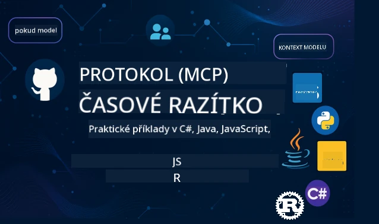

 

[](https://GitHub.com/microsoft/mcp-for-beginners/graphs/contributors)
[](https://GitHub.com/microsoft/mcp-for-beginners/issues)
[](https://GitHub.com/microsoft/mcp-for-beginners/pulls)
[](http://makeapullrequest.com)

[](https://GitHub.com/microsoft/mcp-for-beginners/watchers)
[](https://GitHub.com/microsoft/mcp-for-beginners/fork)
[](https://GitHub.com/microsoft/mcp-for-beginners/stargazers)


[](https://discord.gg/nTYy5BXMWG)

Postupujte podle těchto kroků, abyste začali používat tyto zdroje:
1. **Vytvořte Fork Repozitáře**: Klikněte na [](https://GitHub.com/microsoft/mcp-for-beginners/fork)
2. **Naklonujte Repozitář**:   `git clone https://github.com/microsoft/mcp-for-beginners.git`
3. **Připojte se k** [](https://discord.gg/nTYy5BXMWG)


### 🌐 Podpora více jazyků

#### Podporováno přes GitHub Action (Automatizováno & Vždy aktuální)

<!-- CO-OP TRANSLATOR LANGUAGES TABLE START -->
[Arabic](../ar/README.md) | [Bengali](../bn/README.md) | [Bulgarian](../bg/README.md) | [Burmese (Myanmar)](../my/README.md) | [Chinese (Simplified)](../zh-CN/README.md) | [Chinese (Traditional, Hong Kong)](../zh-HK/README.md) | [Chinese (Traditional, Macau)](../zh-MO/README.md) | [Chinese (Traditional, Taiwan)](../zh-TW/README.md) | [Croatian](../hr/README.md) | [Czech](./README.md) | [Danish](../da/README.md) | [Dutch](../nl/README.md) | [Estonian](../et/README.md) | [Finnish](../fi/README.md) | [French](../fr/README.md) | [German](../de/README.md) | [Greek](../el/README.md) | [Hebrew](../he/README.md) | [Hindi](../hi/README.md) | [Hungarian](../hu/README.md) | [Indonesian](../id/README.md) | [Italian](../it/README.md) | [Japanese](../ja/README.md) | [Kannada](../kn/README.md) | [Korean](../ko/README.md) | [Lithuanian](../lt/README.md) | [Malay](../ms/README.md) | [Malayalam](../ml/README.md) | [Marathi](../mr/README.md) | [Nepali](../ne/README.md) | [Nigerian Pidgin](../pcm/README.md) | [Norwegian](../no/README.md) | [Persian (Farsi)](../fa/README.md) | [Polish](../pl/README.md) | [Portuguese (Brazil)](../pt-BR/README.md) | [Portuguese (Portugal)](../pt-PT/README.md) | [Punjabi (Gurmukhi)](../pa/README.md) | [Romanian](../ro/README.md) | [Russian](../ru/README.md) | [Serbian (Cyrillic)](../sr/README.md) | [Slovak](../sk/README.md) | [Slovenian](../sl/README.md) | [Spanish](../es/README.md) | [Swahili](../sw/README.md) | [Swedish](../sv/README.md) | [Tagalog (Filipino)](../tl/README.md) | [Tamil](../ta/README.md) | [Telugu](../te/README.md) | [Thai](../th/README.md) | [Turkish](../tr/README.md) | [Ukrainian](../uk/README.md) | [Urdu](../ur/README.md) | [Vietnamese](../vi/README.md)

> **Raději naklonovat lokálně?**

> Tento repozitář obsahuje více než 50 jazykových překladů, které výrazně zvětšují velikost stahování. Pro klonování bez překladů použijte sparse checkout:
> ```bash
> git clone --filter=blob:none --sparse https://github.com/microsoft/mcp-for-beginners.git
> cd mcp-for-beginners
> git sparse-checkout set --no-cone '/*' '!translations' '!translated_images'
> ```
> Tím získáte vše potřebné ke splnění kurzu s mnohem rychlejším stahováním.
<!-- CO-OP TRANSLATOR LANGUAGES TABLE END -->

# 🚀 Kurikulum Model Context Protocol (MCP) pro začátečníky

## **Naučte se MCP s praktickými příklady kódu v C#, Java, JavaScript, Rust, Python a TypeScript**

## 🧠 Přehled kurikula Model Context Protocol
Vítejte na vaší cestě do světa Model Context Protocol! Pokud jste si někdy kladli otázku, jak AI aplikace komunikují s různými nástroji a službami, právě odhalíte elegantní řešení, které mění způsob, jakým vývojáři vytvářejí inteligentní systémy.

MCP si představte jako univerzální překladač pro AI aplikace – stejně jako USB porty umožňují připojit jakékoli zařízení k počítači, MCP umožňuje AI modelům připojit se ke kterémukoli nástroji či službě standardizovaným způsobem. Ať už vytváříte svůj první chatbot, nebo pracujete na složitých AI pracovních postupech, pochopení MCP vám dá sílu vytvořit schopnější a flexibilnější aplikace.

Toto kurikulum je navrženo s trpělivostí a péčí o váš vzdělávací proces. Začneme s jednoduchými koncepty, které už znáte, a postupně budeme budovat vaše znalosti skrze praktické procvičování v jazyce, který máte rádi. Každý krok obsahuje jasná vysvětlení, praktické příklady a dostatek povzbuzení.

Až tuto cestu dokončíte, budete mít důvěru vytvářet vlastní MCP servery, integrovat je do populárních AI platforem a pochopíte, jak tato technologie mění budoucnost vývoje AI. Pojďme společně začít toto vzrušující dobrodružství!

### Oficiální dokumentace a specifikace

Tyto zdroje nabývají na hodnotě, jak budete rozumět tématu lépe, ale necítíte tlak je hned všechny číst. Začněte oblastmi, které vás zajímají nejvíc!
- 📘 [Dokumentace MCP](https://modelcontextprotocol.io/) – Toto je váš hlavní zdroj s podrobnými návody a uživatelskými průvodci. Dokumentace je napsána s ohledem na začátečníky a obsahuje jasné příklady, které můžete sledovat vlastním tempem.
- 📜 [Specifikace MCP](https://modelcontextprotocol.io/docs/) – Považujte to za váš rozsáhlý referenční manuál. Jak budete procházet kurikulum, budete se sem často vracet pro hledání konkrétních detailů a zkoumání pokročilých funkcí.
- 📜 [Původní specifikace MCP](https://modelcontextprotocol.io/specification/versioning) – Obsahuje další technické detaily, které mohou být užitečné pro pokročilé implementace. Je tu, když ji potřebujete, ale na začátku se tím netrapte.
- 🧑‍💻 [MCP GitHub Repozitář](https://github.com/modelcontextprotocol) – Najdete zde SDK, nástroje a ukázky kódu v několika programovacích jazycích. Je to jako pokladnice praktických příkladů a hotových komponent.
- 🌐 [MCP Komunita](https://github.com/orgs/modelcontextprotocol/discussions) – Připojte se k ostatním studentům a zkušeným vývojářům v diskuzích o MCP. Je to podpůrná komunita, kde jsou otázky vítány a znalosti se sdílejí volně.

## Cíle učení

Na konci tohoto kurikula se budete cítit sebejistě a nadšeně z vašich nových schopností. Zde je, čeho dosáhnete:

• **Pochopíte základy MCP**: Pochopíte, co je Model Context Protocol a proč mění způsob, jakým AI aplikace spolupracují, pomocí analogií a příkladů, které dávají smysl.

• **Vytvoříte svůj první MCP server**: Vytvoříte fungující MCP server ve vašem preferovaném programovacím jazyce, začnete s jednoduchými příklady a krok za krokem si budete zvyšovat dovednosti.

• **Propojíte AI modely s reálnými nástroji**: Naučíte se překlenout propast mezi AI modely a skutečnými službami, čímž svým aplikacím dáte výkonné nové možnosti.

• **Implementujete nejlepší bezpečnostní postupy**: Pochopíte, jak udržovat vaše MCP implementace bezpečné a chránit jak aplikace, tak uživatele.

• **Nasadíte s jistotou**: Budete vědět, jak dostat své MCP projekty z vývoje do produkce s praktickými nasazovacími strategiemi, které fungují v reálném světě.

• **Připojíte se ke komunitě MCP**: Stanete se součástí rostoucí komunity vývojářů, kteří formují budoucnost vývoje AI aplikací.

## Nezbytné základy

Než se ponoříme do konkrétností MCP, ujistěme se, že vám nejsou cizí některé základní koncepty. Nemějte obavy, pokud v těchto oblastech nejste expertem – vše potřebné vysvětlíme za pochodu!

### Pochopení protokolů (Základ)

Představte si protokol jako pravidla pro konverzaci. Když voláte kamarádovi, oba víte, že řeknete „ahoj“ při zvedání, mluvíte po směru a nakonec řeknete „nashledanou“. Počítačové programy potřebují podobná pravidla, aby účinně komunikovaly.

MCP je protokol – sada dohodnutých pravidel, která pomáhají AI modelům a aplikacím vést produktivní „konverzace“ s nástroji a službami. Stejně jako pravidla konverzace usnadňují lidskou komunikaci, MCP dělá komunikaci AI aplikací spolehlivější a silnější.

### Vztahy klient-server (Jak programy spolupracují)

Každý den používáte vztahy klient-server! Když používáte webový prohlížeč (klient) k návštěvě webu, připojujete se k webovému serveru, který vám pošle obsah stránky. Prohlížeč ví, jak požádat o informace a server ví, jak odpovědět.

V MCP máme podobný vztah: AI modely fungují jako klienti, kteří požadují informace nebo akce, zatímco MCP servery tyto schopnosti poskytují. Je to jako mít pomocníka (server), kterého může AI požádat o provedení konkrétních úkolů.

### Proč je standardizace důležitá (Jak věci spolupracují)

Představte si, kdyby každý výrobce aut používal jiný tvar benzínové pumpy – potřebovali byste pro každé auto jiný adaptér! Standardizace znamená dohodnout se na společných přístupech, aby věci fungovaly bez problémů.

MCP poskytuje tuto standardizaci pro AI aplikace. Místo toho, aby každý AI model potřeboval vlastní kód pro každý nástroj, MCP vytváří univerzální způsob, jak spolu komunikovat. To znamená, že vývojáři mohou jednou postavit nástroj a fungovat s mnoha různými AI systémy.

## 🧭 Přehled vaší vzdělávací cesty

Vaše cesta MCP je pečlivě strukturována, aby postupně posilovala vaši jistotu a dovednosti. Každá fáze představuje nové koncepty a zároveň posiluje to, co jste se už naučili.

### 🌱 Fáze Základů: Pochopení základů (Moduly 0–2)

Zde začíná vaše dobrodružství! Seznámíme vás s MCP koncepty pomocí známých analogií a jednoduchých příkladů. Pochopíte, co MCP je, proč existuje a jak zapadá do širšího světa AI vývoje.

• **Modul 0 – Úvod do MCP**: Začneme tím, že prozkoumáme, co MCP je a proč je tak důležité pro moderní AI aplikace. Uvidíte reálné příklady MCP v akci a pochopíte, jak řeší běžné problémy, s nimiž se vývojáři setkávají.

• **Modul 1 – Vysvětlení základních konceptů**: Naučíte se zde klíčové stavební kameny MCP. Použijeme spoustu analogií a vizuálních příkladů, aby vám tyto koncepty působily přirozeně a byly snadno pochopitelné.

• **Modul 2 – Bezpečnost v MCP**: Bezpečnost může znít složitě, ale ukážeme vám, jak MCP obsahuje zabudované bezpečnostní funkce a naučíme vás osvědčené postupy, které ochrání vaše aplikace už od začátku.

### 🔨 Fáze Stavby: Vytváření vašich prvních implementací (Modul 3)

Teď začíná ta opravdová zábava! Získáte praktické zkušenosti s tvorbou skutečných MCP serverů a klientů. Nebojte se – začneme jednoduše a povedeme vás každým krokem.

Tento modul obsahuje několik praktických průvodců, které vám umožní procvičovat ve vašem preferovaném programovacím jazyce. Vytvoříte první server, sestavíte klienta, který se k němu připojí, a dokonce ho integrujete s populárními vývojářskými nástroji jako VS Code.
Každý průvodce obsahuje kompletní ukázky kódu, tipy na řešení problémů a vysvětlení, proč děláme konkrétní návrhová rozhodnutí. Na konci této fáze budete mít funkční implementace MCP, na které můžete být hrdí!

### 🚀 Fáze růstu: Pokročilé koncepty a reálné použití (Moduly 4-5)

Po osvojení základů jste připraveni prozkoumat pokročilejší funkce MCP. Pokryjeme praktické implementační strategie, techniky ladění a pokročilá témata, jako je multimodální integrace AI.

Naučíte se také, jak škálovat vaše MCP implementace pro produkční použití a integrovat je s cloudovými platformami jako Azure. Tyto moduly vás připraví na vytváření MCP řešení, která zvládnou požadavky reálného světa.

### 🌟 Fáze mistrovství: Komunita a specializace (Moduly 6-11)

Závěrečná fáze se zaměřuje na zapojení do komunity MCP a specializaci v oblastech, které vás nejvíce zajímají. Naučíte se, jak přispívat do open-source MCP projektů, implementovat pokročilé autentizační vzory a vytvářet komplexní řešení integrovaná s databázemi.

Modul 11 zaslouží zvláštní zmínku – je to kompletní 13-laboratorní praktická vzdělávací cesta, která vás naučí vytvářet produkčně připravené MCP servery s integrací PostgreSQL. Je to něco jako závěrečný projekt, který spojuje vše, co jste se naučili!

### 📚 Kompletní struktura kurikula

| Modul | Téma | Popis | Odkaz |
|--------|-------|-------------|------|
| **Moduly 1-3: Základy** | | | |
| 00 | Úvod do MCP | Přehled protokolu Model Context Protocol a jeho význam v AI pipelinech | [Číst více](./00-Introduction/README.md) |
| 01 | Vysvětlení základních konceptů | Hloubkové vysvětlení základních MCP konceptů | [Číst více](./01-CoreConcepts/README.md) |
| 02 | Zabezpečení v MCP | Hrozby zabezpečení a nejlepší postupy | [Číst více](./02-Security/README.md) |
| 03 | Začínáme s MCP | Nastavení prostředí, základní servery/klienti, integrace | [Číst více](./03-GettingStarted/README.md) |
| **Modul 3: Vytvoření prvního serveru & klienta** | | | |
| 3.1 | První server | Vytvořte svůj první MCP server | [Průvodce](./03-GettingStarted/01-first-server/README.md) |
| 3.2 | První klient | Vyvíjejte základního MCP klienta | [Průvodce](./03-GettingStarted/02-client/README.md) |
| 3.3 | Klient s LLM | Integrace velkých jazykových modelů | [Průvodce](./03-GettingStarted/03-llm-client/README.md) |
| 3.4 | Integrace VS Code | Používejte MCP servery ve VS Code | [Průvodce](./03-GettingStarted/04-vscode/README.md) |
| 3.5 | stdio server | Vytvářejte servery pomocí stdio transportu | [Průvodce](./03-GettingStarted/05-stdio-server/README.md) |
| 3.6 | HTTP Streaming | Implementujte HTTP streamování v MCP | [Průvodce](./03-GettingStarted/06-http-streaming/README.md) |
| 3.7 | AI Toolkit | Použijte AI Toolkit s MCP | [Průvodce](./03-GettingStarted/07-aitk/README.md) |
| 3.8 | Testování | Testujte implementaci vašeho MCP serveru | [Průvodce](./03-GettingStarted/08-testing/README.md) |
| 3.9 | Nasazení | Nasazujte MCP servery do produkce | [Průvodce](./03-GettingStarted/09-deployment/README.md) |
| 3.10 | Pokročilé použití serveru | Používejte pokročilé servery pro pokročilé funkce a lepší architekturu | [Průvodce](./03-GettingStarted/10-advanced/README.md) |
| 3.11 | Jednoduchá autentizace | Kapitola ukazující autentizaci od začátku a RBAC | [Průvodce](./03-GettingStarted/11-simple-auth/README.md) |
| **Moduly 4-5: Praktické & pokročilé** | | | |
| 04 | Praktická implementace | SDK, ladění, testování, opakovaně použitelné šablony promptů | [Číst více](./04-PracticalImplementation/README.md) |
| 05 | Pokročilá témata v MCP | Multimodální AI, škálování, podnikové použití | [Číst více](./05-AdvancedTopics/README.md) |
| 5.1 | Integrace Azure | MCP integrace s Azure | [Průvodce](./05-AdvancedTopics/mcp-integration/README.md) |
| 5.2 | Multimodalita | Práce s více modalitami | [Průvodce](./05-AdvancedTopics/mcp-multi-modality/README.md) |
| 5.3 | Ukázka OAuth2 | Implementace autentizace OAuth2 | [Průvodce](./05-AdvancedTopics/mcp-oauth2-demo/README.md) |
| 5.4 | Kořenové kontexty | Porozumění a implementace kořenových kontextů | [Průvodce](./05-AdvancedTopics/mcp-root-contexts/README.md) |
| 5.5 | Směrování | Strategie směrování v MCP | [Průvodce](./05-AdvancedTopics/mcp-routing/README.md) |
| 5.6 | Výběr vzorků | Techniky výběru vzorků v MCP | [Průvodce](./05-AdvancedTopics/mcp-sampling/README.md) |
| 5.7 | Škálování | Škálování MCP implementací | [Průvodce](./05-AdvancedTopics/mcp-scaling/README.md) |
| 5.8 | Zabezpečení | Pokročilé bezpečnostní úvahy | [Průvodce](./05-AdvancedTopics/mcp-security/README.md) |
| 5.9 | Webové vyhledávání | Implementace funkcí webového vyhledávání | [Průvodce](./05-AdvancedTopics/web-search-mcp/README.md) |
| 5.10 | Realtime streamování | Vytváření funkce realtime streamování | [Průvodce](./05-AdvancedTopics/mcp-realtimestreaming/README.md) |
| 5.11 | Realtime vyhledávání | Implementace realtime vyhledávání | [Průvodce](./05-AdvancedTopics/mcp-realtimesearch/README.md) |
| 5.12 | Autentizace Entra ID | Autentizace s Microsoft Entra ID | [Průvodce](./05-AdvancedTopics/mcp-security-entra/README.md) |
| 5.13 | Integrace Foundry | Integrace s Azure AI Foundry | [Průvodce](./05-AdvancedTopics/mcp-foundry-agent-integration/README.md) |
| 5.14 | Inženýrství kontextu | Techniky efektivního inženýrství kontextu | [Průvodce](./05-AdvancedTopics/mcp-contextengineering/README.md) |
| 5.15 | Vlastní MCP transport | Implementace vlastních transportů | [Průvodce](./05-AdvancedTopics/mcp-transport/README.md) |
| **Moduly 6-10: Komunita & nejlepší praktiky** | | | |
| 06 | Přispívání do komunity | Jak přispívat do ekosystému MCP | [Průvodce](./06-CommunityContributions/README.md) |
| 07 | Zkušenosti z raného přijetí | Příběhy z reálných implementací | [Průvodce](./07-LessonsFromEarlyAdoption/README.md) |
| 08 | Nejlepší praktiky pro MCP | Výkon, odolnost proti chybám, robustnost | [Průvodce](./08-BestPractices/README.md) |
| 09 | Případové studie MCP | Praktické příklady implementace | [Průvodce](./09-CaseStudy/README.md) |
| 10 | Praktická dílna | Vytváření MCP serveru s AI Toolkit | [Laboratoř](./10-StreamliningAIWorkflowsBuildingAnMCPServerWithAIToolkit/README.md) |
| **Modul 11: MCP server hands on laboratoř** | | | |
| 11 | Integrace MCP serveru s databází | Komplexní 13-laboratorní praktická cesta pro integraci PostgreSQL | [Laboratoře](./11-MCPServerHandsOnLabs/README.md) |
| 11.1 | Úvod | Přehled MCP s integrací databáze a případ použití retailové analytiky | [Laboratoř 00](./11-MCPServerHandsOnLabs/00-Introduction/README.md) |
| 11.2 | Základní architektura | Porozumění architektuře MCP serveru, vrstvám databáze a bezpečnostním vzorům | [Laboratoř 01](./11-MCPServerHandsOnLabs/01-Architecture/README.md) |
| 11.3 | Zabezpečení & multi-tenancy | Řízení bezpečnosti na úrovni řádků, autentizace a přístup k datům více nájemců | [Laboratoř 02](./11-MCPServerHandsOnLabs/02-Security/README.md) |
| 11.4 | Nastavení prostředí | Nastavení vývojového prostředí, Docker, Azure zdroje | [Laboratoř 03](./11-MCPServerHandsOnLabs/03-Setup/README.md) |
| 11.5 | Návrh databáze | Nastavení PostgreSQL, návrh retailového schématu a ukázková data | [Laboratoř 04](./11-MCPServerHandsOnLabs/04-Database/README.md) |
| 11.6 | Implementace MCP serveru | Vytvoření FastMCP serveru s integrací databáze | [Laboratoř 05](./11-MCPServerHandsOnLabs/05-MCP-Server/README.md) |
| 11.7 | Vývoj nástrojů | Vytváření nástrojů pro dotazy do databáze a introspekci schématu | [Laboratoř 06](./11-MCPServerHandsOnLabs/06-Tools/README.md) |
| 11.8 | Sémantické vyhledávání | Implementace vektorových embeddingů s Azure OpenAI a pgvector | [Laboratoř 07](./11-MCPServerHandsOnLabs/07-Semantic-Search/README.md) |
| 11.9 | Testování & ladění | Strategie testování, ladicí nástroje a způsoby validace | [Laboratoř 08](./11-MCPServerHandsOnLabs/08-Testing/README.md) |
| 11.10 | Integrace VS Code | Konfigurace integrace MCP ve VS Code a použití AI chatu | [Laboratoř 09](./11-MCPServerHandsOnLabs/09-VS-Code/README.md) |
| 11.11 | Nasazovací strategie | Nasazení Dockeru, Azure Container Apps a úvahy o škálování | [Laboratoř 10](./11-MCPServerHandsOnLabs/10-Deployment/README.md) |
| 11.12 | Monitorování | Application Insights, logování, sledování výkonu | [Laboratoř 11](./11-MCPServerHandsOnLabs/11-Monitoring/README.md) |
| 11.13 | Nejlepší praktiky | Optimalizace výkonu, zabezpečení a tipy pro produkci | [Laboratoř 12](./11-MCPServerHandsOnLabs/12-Best-Practices/README.md) |

### 💻 Ukázkové projekty s kódem

Jednou z nejzajímavějších částí učení MCP je vidět, jak se vaše dovednosti v kódu postupně rozvíjejí. Navrhli jsme naše ukázky kódu tak, aby začaly jednoduše a postupně se stávaly sofistikovanějšími s rostoucím porozuměním. Takto představujeme koncepty – s kódem, který je snadný pochopit, ale demonstruje skutečné principy MCP, pochopíte nejen co tento kód dělá, ale proč je strukturován tímto způsobem a jak zapadá do větších MCP aplikací.

#### Základní ukázky MCP kalkulátoru

| Jazyk | Popis | Odkaz |
|----------|-------------|------|
| C# | Příklad MCP serveru | [Zobrazit kód](./03-GettingStarted/samples/csharp/README.md) |
| Java | MCP kalkulátor | [Zobrazit kód](./03-GettingStarted/samples/java/calculator/README.md) |
| JavaScript | MCP demo | [Zobrazit kód](./03-GettingStarted/samples/javascript/README.md) |
| Python | MCP server | [Zobrazit kód](../../03-GettingStarted/samples/python/mcp_calculator_server.py) |
| TypeScript | MCP příklad | [Zobrazit kód](./03-GettingStarted/samples/typescript/README.md) |
| Rust | MCP příklad | [Zobrazit kód](./03-GettingStarted/samples/rust/README.md) |

#### Pokročilé MCP implementace

| Jazyk | Popis | Odkaz |
|----------|-------------|------|
| C# | Pokročilá ukázka | [Zobrazit kód](./04-PracticalImplementation/samples/csharp/README.md) |
| Java se Spring | Příklad Container App | [Zobrazit kód](./04-PracticalImplementation/samples/java/containerapp/README.md) |
| JavaScript | Pokročilá ukázka | [Zobrazit kód](./04-PracticalImplementation/samples/javascript/README.md) |
| Python | Komplexní implementace | [Zobrazit kód](../../04-PracticalImplementation/samples/python/READMEmd) |
| TypeScript | Ukázka Container | [Zobrazit kód](./04-PracticalImplementation/samples/typescript/README.md) |


## 🎯 Předpoklady pro učení MCP

Abyste z tohoto kurikula vytěžili co nejvíce, měli byste mít:

- Základní znalosti programování alespoň v jednom z těchto jazyků: C#, Java, JavaScript, Python nebo TypeScript
- Pochopení modelu klient-server a API
- Znalost konceptů REST a HTTP
- (Nepovinné) Základní znalosti AI/ML konceptů

- Zapojení se do diskuzí naší komunity pro podporu

## 📚 Studijní průvodce a zdroje

Toto úložiště obsahuje několik zdrojů, které vám pomohou efektivně se orientovat a učit:

### Studijní průvodce

Dostupný je komplexní [Studijní průvodce](./study_guide.md), který vám pomůže efektivně procházet toto úložiště. Tento vizuální mapový přehled kurikula ukazuje, jak jsou jednotlivá témata propojena, a poskytuje návod, jak efektivně využívat ukázkové projekty. Je to obzvláště užitečné, pokud jste vizuální typ a rádi vidíte širší souvislosti.

Průvodce zahrnuje:
- Vizuální mapu kurikula pokrývající všechna témata
- Podrobný rozpis každé části úložiště
- Návod, jak používat ukázkové projekty
- Doporučené studijní cesty pro různé úrovně dovedností
- Další zdroje na doplnění vaší studijní cesty

### Záznam změn

Udržujeme podrobný [Záznam změn](./changelog.md), který zaznamenává všechny významné aktualizace materiálů kurikula, abyste mohli být vždy v obraze o nejnovějších zlepšeních a doplněních.
- Přidání nového obsahu
- Strukturální změny
- Vylepšení funkcí
- Aktualizace dokumentace

## 🛠️ Jak efektivně používat toto kurikulum

Každá lekce v tomto průvodci obsahuje:
1. Jasná vysvětlení konceptů MCP  
2. Živé příklady kódu v několika jazycích  
3. Cvičení pro tvorbu skutečných aplikací MCP  
4. Další zdroje pro pokročilé uživatele

## Obsah na vyžádání

### [MCP Dev Days červenec 2025](https://developer.microsoft.com/en-us/reactor/series/S-1563/)
#### [➡️Sledujte na vyžádání - MCP Dev Days](https://developer.microsoft.com/en-us/reactor/series/S-1563/)
Připravte se na dva dny hlubokých technických poznatků, spojení komunity a praktického učení na MCP Dev Days, virtuální akci věnované Model Context Protocol (MCP) — novému standardu, který propojuje AI modely a nástroje, na které se spoléhají.  
MCP Dev Days můžete sledovat po registraci na naší stránce akce: https://aka.ms/mcpdevdays.

#### [Den 1: MCP produktivita, vývojové nástroje a komunita:](https://developer.microsoft.com/en-us/reactor/series/S-1563/)

Je věnován posílení developerů v používání MCP v jejich pracovním toku a oslavě úžasné komunity MCP. Připojí se k nám členové komunity a partneři jako Arcade, Block, Okta a Neon, aby ukázali, jak spolupracují s Microsoftem na tvorbě otevřeného, rozšiřitelného ekosystému MCP.  
Ukázky z reálného světa ve VS Code, Visual Studio, GitHub Copilot a oblíbených komunitních nástrojích  
Praktické, kontextem řízené vývojové workflow  
Setkání vedená komunitou a postřehy  
Ať už s MCP začínáte, nebo již s ním stavíte, den 1 vám poskytne inspiraci a praktické tipy.

#### [Den 2: Stavějte MCP servery s jistotou](https://developer.microsoft.com/en-us/reactor/series/S-1563/)

Je určen pro stavitele MCP. Půjdeme do hloubky implementačních strategií a osvědčených postupů pro vytváření MCP serverů a integraci MCP do vašich AI pracovních toků.

#### Témata zahrnují:

- Stavbu MCP serverů a jejich integraci do agentních zážitků  
- Vývoj řízený promptem  
- Bezpečnostní osvědčené postupy  
- Používání stavebních bloků jako Functions, ACA a API Management  
- Slučování registrů a nástrojů (1P + 3P)  

Jestli jste vývojář, tvůrce nástrojů nebo AI produktový stratég, tento den je nabitý poznatky, které potřebujete k výstavbě škálovatelných, bezpečných a budoucnosti připravených MCP řešení.

### MCP Boot Camp srpen 2025  
Naučte se v intenzivních video lekcích, jak vytvářet MCP servery, integrovat je s VS Code a profesionálně nasazovat na Azure podle obsahu z osnovy MCP pro začátečníky. Odnesete si praktické dovednosti v technologii, kterou již používají velké firmy.

#### [➡️Sledujte na vyžádání MCP Bootcamp | English](https://developer.microsoft.com/en-us/reactor/series/s-1568/)
#### [➡️Sledujte na vyžádání MCP Bootcamp | Brasil](https://developer.microsoft.com/en-us/reactor/series/S-1566/)
#### [➡️Sledujte na vyžádání MCP Bootcamp | Spanish](https://developer.microsoft.com/en-us/reactor/series/S-1567/)

### Naučme se MCP s C# - Série tutoriálů  
Pojďme se naučit o Model Context Protocol (MCP), moderním frameworku navrženém k standardizaci interakcí mezi AI modely a klientskými aplikacemi. V tomto lekci vhodné pro začátečníky vám představíme MCP a provedeme vás tvorbou vašeho prvního MCP serveru.  
#### C#: [https://aka.ms/letslearnmcp-csharp](https://aka.ms/letslearnmcp-csharp)  
#### Java: [https://aka.ms/letslearnmcp-java](https://aka.ms/letslearnmcp-java)  
#### JavaScript: [https://aka.ms/letslearnmcp-javascript](https://aka.ms/letslearnmcp-javascript)  
#### Python: [https://aka.ms/letslearnmcp-python](https://aka.ms/letslearnmcp-python)

## 🎓 Vaše cesta MCP začíná

Gratulujeme! Právě jste udělali první krok na vzrušující cestě, která rozšíří vaše programovací schopnosti a propojí vás s špičkovým vývojem AI.

### Co jste již dokázali

Tím, že jste si přečetli tento úvod, jste již začali budovat své základy znalostí MCP. Rozumíte, co MCP je, proč je důležitý, a jak vám tato osnova pomůže na vaší cestě učení. To je výrazný úspěch a začátek vaší expertízy v této důležité technologii.

### Dobrodružství před vámi

Jak budete postupovat moduly, pamatujte, že každý expert byl kdysi začátečník. Koncepty, které se nyní mohou zdát složité, se stanou druhou přirozeností, když je budete procvičovat a aplikovat. Každý malý krok vede k silným schopnostem, které vám budou sloužit po celou vaši kariéru vývoje.

### Vaše podpora

Připojujete se ke komunitě studentů a expertů, kteří jsou nadšení pro MCP a ochotní pomáhat ostatním uspět. Ať už uvíznete u programovací výzvy, nebo chcete sdílet průlom, komunita je tu, aby podporovala vaši cestu.

Pokud se zaseknete nebo máte dotazy ohledně tvorby AI aplikací, připojte se k dalším studentům a zkušeným vývojářům v diskusích o MCP. Je to podpůrná komunita, kde jsou otázky vítány a znalosti sdíleny otevřeně.

[](https://discord.gg/nTYy5BXMWG)

Pokud máte zpětnou vazbu nebo chyby během vývoje, navštivte:

[](https://aka.ms/foundry/forum)

### Připravení začít?

Vaše MCP dobrodružství začíná právě teď! Začněte modulem 0 a ponořte se do vašich prvních praktických MCP zkušeností, nebo prozkoumejte ukázkové projekty a podívejte se, co budete vytvářet. Pamatujte – každý expert začínal přesně tam, kde jste nyní, a s trpělivostí a praxí budete ohromeni výsledky, kterých můžete dosáhnout.

Vítejte ve světě vývoje s Model Context Protocol. Postavme společně něco úžasného!

## 🤝 Přispívání do učící komunity

Tato osnova sílí díky příspěvkům od studentů jako jste vy! Ať už opravujete překlep, navrhujete jasnější vysvětlení, nebo přidáváte nový příklad, vaše příspěvky pomáhají jiným začátečníkům uspět.

Díky Microsoft Valued Professional [Shivam Goyal](https://www.linkedin.com/in/shivam2003/) za přispění ukázkami kódu.

Proces přispívání je navržen tak, aby byl přátelský a podporující. Většina příspěvků vyžaduje Contributor License Agreement (CLA), ale automatizované nástroje vás tímto procesem provedou hladce.

## 📜 Open Source učení

Celá tato osnova je dostupná pod licencí MIT [LICENSE](../../LICENSE), což znamená, že ji můžete používat, upravovat a sdílet volně. To podporuje naši misi dělat znalosti MCP přístupné vývojářům všude.

## 🤝 Pravidla pro přispívání

Tento projekt vítá příspěvky a návrhy. Většina příspěvků vyžaduje souhlas s Contributor License Agreement (CLA), který prohlašuje, že máte právo a skutečně nám udělujete práva k používání vašeho příspěvku. Podrobnosti najdete na <https://cla.opensource.microsoft.com>.

Po odeslání pull requestu automatický CLA bot určí, zda musíte poskytnout CLA, a označí PR odpovídajícím způsobem (např. kontrola stavu, komentář). Jednoduše postupujte podle pokynů bota. Tento krok budete muset provést pouze jednou napříč všemi repozitáři používajícími náš CLA.

Tento projekt přijal [Microsoft Open Source Code of Conduct](https://opensource.microsoft.com/codeofconduct/). Více informací naleznete v [Code of Conduct FAQ](https://opensource.microsoft.com/codeofconduct/faq/) nebo kontaktujte [opencode@microsoft.com](mailto:opencode@microsoft.com) s jakýmikoliv dotazy či připomínkami.

---

*Připravení začít svou cestu MCP? Začněte s [Modulem 00 - Úvod do MCP](./00-Introduction/README.md) a udělejte první kroky do světa vývoje Model Context Protocol!*

## 🎒 Další kurzy  
Náš tým tvoří i další kurzy! Podívejte se na ně:

<!-- CO-OP TRANSLATOR OTHER COURSES START -->
### LangChain  
[](https://aka.ms/langchain4j-for-beginners)  
[](https://aka.ms/langchainjs-for-beginners?WT.mc_id=m365-94501-dwahlin)

---

### Azure / Edge / MCP / Agent  
[](https://github.com/microsoft/AZD-for-beginners?WT.mc_id=academic-105485-koreyst)  
[](https://github.com/microsoft/edgeai-for-beginners?WT.mc_id=academic-105485-koreyst)  
[](https://github.com/microsoft/mcp-for-beginners?WT.mc_id=academic-105485-koreyst)  
[](https://github.com/microsoft/ai-agents-for-beginners?WT.mc_id=academic-105485-koreyst)

---

### Generativní AI série  
[](https://github.com/microsoft/generative-ai-for-beginners?WT.mc_id=academic-105485-koreyst)  
[-9333EA?style=for-the-badge&labelColor=E5E7EB&color=9333EA)](https://github.com/microsoft/Generative-AI-for-beginners-dotnet?WT.mc_id=academic-105485-koreyst)  
[-C084FC?style=for-the-badge&labelColor=E5E7EB&color=C084FC)](https://github.com/microsoft/generative-ai-for-beginners-java?WT.mc_id=academic-105485-koreyst)  
[-E879F9?style=for-the-badge&labelColor=E5E7EB&color=E879F9)](https://github.com/microsoft/generative-ai-with-javascript?WT.mc_id=academic-105485-koreyst)

---

### Základní učení  
[](https://aka.ms/ml-beginners?WT.mc_id=academic-105485-koreyst)  
[](https://aka.ms/datascience-beginners?WT.mc_id=academic-105485-koreyst)  
[](https://aka.ms/ai-beginners?WT.mc_id=academic-105485-koreyst)  
[](https://github.com/microsoft/Security-101?WT.mc_id=academic-96948-sayoung)
[](https://aka.ms/webdev-beginners?WT.mc_id=academic-105485-koreyst)
[](https://aka.ms/iot-beginners?WT.mc_id=academic-105485-koreyst)
[](https://github.com/microsoft/xr-development-for-beginners?WT.mc_id=academic-105485-koreyst)

---
 
### Série Copilot
[](https://aka.ms/GitHubCopilotAI?WT.mc_id=academic-105485-koreyst)
[](https://github.com/microsoft/mastering-github-copilot-for-dotnet-csharp-developers?WT.mc_id=academic-105485-koreyst)
[](https://github.com/microsoft/CopilotAdventures?WT.mc_id=academic-105485-koreyst)
<!-- CO-OP TRANSLATOR OTHER COURSES END -->

---

<!-- CO-OP TRANSLATOR DISCLAIMER START -->
**Vyloučení odpovědnosti**:
Tento dokument byl přeložen pomocí AI překladatelské služby [Co-op Translator](https://github.com/Azure/co-op-translator). Přestože usilujeme o přesnost, mějte prosím na paměti, že automatické překlady mohou obsahovat chyby nebo nepřesnosti. Originální dokument v jeho původním jazyce by měl být považován za autoritativní zdroj. Pro důležité informace se doporučuje profesionální lidský překlad. Nejsme odpovědní za jakékoliv nedorozumění nebo chybné výklady vyplývající z použití tohoto překladu.
<!-- CO-OP TRANSLATOR DISCLAIMER END -->