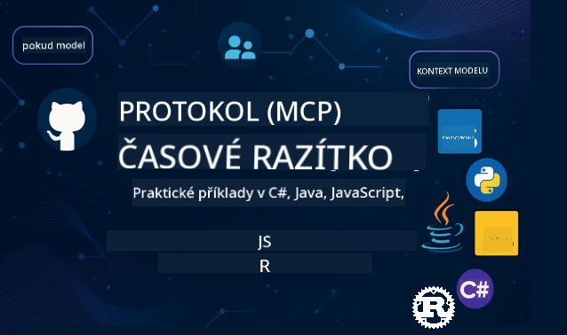

 

[](https://GitHub.com/microsoft/mcp-for-beginners/graphs/contributors)
[](https://GitHub.com/microsoft/mcp-for-beginners/issues)
[](https://GitHub.com/microsoft/mcp-for-beginners/pulls)
[](http://makeapullrequest.com)

[](https://GitHub.com/microsoft/mcp-for-beginners/watchers)
[](https://GitHub.com/microsoft/mcp-for-beginners/fork)
[](https://GitHub.com/microsoft/mcp-for-beginners/stargazers)


[](https://discord.gg/nTYy5BXMWG)

Postupujte podle těchto kroků, abyste mohli začít používat tyto zdroje:
1. **Vytvořte Fork Repozitáře**: Klikněte na [](https://GitHub.com/microsoft/mcp-for-beginners/fork)
2. **Klonujte Repozitář**:   `git clone https://github.com/microsoft/mcp-for-beginners.git`
3. **Připojte se k** [](https://discord.gg/nTYy5BXMWG)


### 🌐 Podpora vícejazyčnosti

#### Podporováno pomocí GitHub Action (automatizováno a vždy aktuální)

<!-- CO-OP TRANSLATOR LANGUAGES TABLE START -->
[Arabic](../ar/README.md) | [Bengali](../bn/README.md) | [Bulgarian](../bg/README.md) | [Burmese (Myanmar)](../my/README.md) | [Chinese (Simplified)](../zh-CN/README.md) | [Chinese (Traditional, Hong Kong)](../zh-HK/README.md) | [Chinese (Traditional, Macau)](../zh-MO/README.md) | [Chinese (Traditional, Taiwan)](../zh-TW/README.md) | [Croatian](../hr/README.md) | [Czech](./README.md) | [Danish](../da/README.md) | [Dutch](../nl/README.md) | [Estonian](../et/README.md) | [Finnish](../fi/README.md) | [French](../fr/README.md) | [German](../de/README.md) | [Greek](../el/README.md) | [Hebrew](../he/README.md) | [Hindi](../hi/README.md) | [Hungarian](../hu/README.md) | [Indonesian](../id/README.md) | [Italian](../it/README.md) | [Japanese](../ja/README.md) | [Kannada](../kn/README.md) | [Korean](../ko/README.md) | [Lithuanian](../lt/README.md) | [Malay](../ms/README.md) | [Malayalam](../ml/README.md) | [Marathi](../mr/README.md) | [Nepali](../ne/README.md) | [Nigerian Pidgin](../pcm/README.md) | [Norwegian](../no/README.md) | [Persian (Farsi)](../fa/README.md) | [Polish](../pl/README.md) | [Portuguese (Brazil)](../pt-BR/README.md) | [Portuguese (Portugal)](../pt-PT/README.md) | [Punjabi (Gurmukhi)](../pa/README.md) | [Romanian](../ro/README.md) | [Russian](../ru/README.md) | [Serbian (Cyrillic)](../sr/README.md) | [Slovak](../sk/README.md) | [Slovenian](../sl/README.md) | [Spanish](../es/README.md) | [Swahili](../sw/README.md) | [Swedish](../sv/README.md) | [Tagalog (Filipino)](../tl/README.md) | [Tamil](../ta/README.md) | [Telugu](../te/README.md) | [Thai](../th/README.md) | [Turkish](../tr/README.md) | [Ukrainian](../uk/README.md) | [Urdu](../ur/README.md) | [Vietnamese](../vi/README.md)

> **Raději klonovat lokálně?**
>
> Tento repozitář obsahuje více než 50 jazykových překladů, což značně zvětšuje velikost ke stažení. Pro klonování bez překladů použijte sparse checkout:
>
> **Bash / macOS / Linux:**
> ```bash
> git clone --filter=blob:none --sparse https://github.com/microsoft/mcp-for-beginners.git
> cd mcp-for-beginners
> git sparse-checkout set --no-cone '/*' '!translations' '!translated_images'
> ```
>
> **CMD (Windows):**
> ```cmd
> git clone --filter=blob:none --sparse https://github.com/microsoft/mcp-for-beginners.git
> cd mcp-for-beginners
> git sparse-checkout set --no-cone "/*" "!translations" "!translated_images"
> ```
>
> Tím získáte vše potřebné ke kompletnímu absolvování kurzu s mnohem rychlejším stažením.
<!-- CO-OP TRANSLATOR LANGUAGES TABLE END -->

# 🚀 Kurikulum Model Context Protocol (MCP) pro začátečníky

## **Naučte se MCP na praktických příkladech kódu v C#, Java, JavaScript, Rust, Python a TypeScript**

## 🧠 Přehled kurikula Model Context Protocol
Vítejte na vaší cestě za Model Context Protocol! Pokud jste se někdy zajímali o to, jak AI aplikace komunikují s různými nástroji a službami, chystáte se objevit elegantní řešení, které mění způsob, jakým vývojáři budují inteligentní systémy.

Představte si MCP jako univerzálního překladače pro AI aplikace – stejně jako USB porty umožňují připojit jakékoli zařízení k vašemu počítači, MCP umožňuje AI modelům připojit se k jakémukoli nástroji nebo službě standardizovaným způsobem. Ať už stavíte svého prvního chatbota, nebo pracujete na složitých AI pracovních postupech, pochopení MCP vám umožní vytvářet schopnější a flexibilnější aplikace.

Toto kurikulum je navrženo trpělivě a s péčí k vaší vzdělávací cestě. Začneme s jednoduchými koncepty, které již znáte, a postupně budeme rozvíjet vaši odbornost praktickým cvičením v programovacím jazyce dle vaší volby. Každý krok obsahuje jasná vysvětlení, praktické příklady a spoustu podpory.

Až tuto cestu dokončíte, budete mít jistotu budovat vlastní MCP servery, integrovat je s populárními AI platformami a pochopíte, jak tato technologie mění budoucnost vývoje AI. Pojďme společně začít toto vzrušující dobrodružství!

### Oficiální dokumentace a specifikace

Toto kurikulum je v souladu se **Specifikací MCP 2025-11-25** (aktuální stabilní verze). Specifikace MCP používá verzování založené na datu (formát RRRR-MM-DD) pro zajištění jednoznačné sledovatelnosti verzí protokolu.

Tyto zdroje se stanou cennějšími, jakmile porozumění poroste, ale nemusíte se cítit pod tlakem, že musíte vše ihned číst. Začněte oblastmi, které vás nejvíce zajímají!
- 📘 [Dokumentace MCP](https://modelcontextprotocol.io/) – To je váš hlavní zdroj pro krok za krokem návody a uživatelské příručky. Dokumentace je psána s ohledem na začátečníky a nabízí jasné příklady, které můžete sledovat vlastním tempem.
- 📜 [Specifikace MCP](https://modelcontextprotocol.io/specification/2025-11-25) – Považujte to za váš obsáhlý referenční manuál. Během práce s kurikulem se zde budete vracet k vyhledávání podrobných informací a zkoumání pokročilých funkcí.
- 📜 [Verzování specifikace MCP](https://modelcontextprotocol.io/specification/versioning) – Obsahuje informace o historii verzí protokolu a o tom, jak MCP používá verzování založené na datu (formát RRRR-MM-DD).
- 🧑‍💻 [GitHub repozitář MCP](https://github.com/modelcontextprotocol) – Zde najdete SDK, nástroje a ukázkový kód v několika programovacích jazycích. Je to doslova pokladnice praktických příkladů a komponent připravených k použití.
- 🌐 [MCP Komunita](https://github.com/orgs/modelcontextprotocol/discussions) – Připojte se k ostatním studentům a zkušeným vývojářům do diskuzí o MCP. Je to podpůrná komunita, kde jsou otázky vítány a znalosti se sdílí otevřeně.
  
## Cíle učení

Na konci tohoto kurikula se budete cítit sebejistě a nadšeně z nových schopností. Toto dosáhnete:

• **Porozumět základům MCP**: Pochopíte, co je Model Context Protocol a proč mění způsob, jakým AI aplikace spolupracují, pomocí analogií a příkladů, které dávají smysl.

• **Vybudovat svůj první MCP server**: Vytvoříte funkční MCP server ve svém preferovaném programovacím jazyce, začínajíc jednoduchými příklady a postupně rozšiřující své dovednosti.

• **Propojit AI modely s reálnými nástroji**: Naučíte se, jak překlenout propast mezi AI modely a skutečnými službami a získat tak silné nové možnosti pro vaše aplikace.

• **Implementovat bezpečnostní osvědčené postupy**: Pochopíte, jak udržet implementace MCP bezpečné a ochránit jak své aplikace, tak uživatele.

• **Nasazovat s jistotou**: Budete vědět, jak přenést MCP projekty z vývoje do produkčního prostředí, s praktickými strategiemi nasazení fungujícími v reálném světě.

• **Připojit se ke komunitě MCP**: Stane se součástí rostoucí komunity vývojářů, kteří formují budoucnost vývoje AI aplikací. 

## Nezbytné základní znalosti

Než se ponoříme do specifik MCP, ujistíme se, že se cítíte pohodlně se základními koncepty. Nemusíte být v těchto oblastech expertem – vše vám vysvětlíme během cesty!

### Pochopení protokolů (základ)

Představte si protokol jako pravidla pro konverzaci. Když voláte příteli, oba víte, že odpovíte "ahoj", mluvíte postupně a na konci řeknete "nashledanou". Počítačové programy potřebují podobná pravidla, aby mohly efektivně komunikovat.

MCP je protokol – sada dohodnutých pravidel, která pomáhají AI modelům a aplikacím vést produktivní "rozhovory" s nástroji a službami. Stejně jako pravidla pro lidskou konverzaci usnadňují komunikaci, MCP dělá komunikaci AI aplikací spolehlivější a silnější.

### Vztahy klient-server (jak programy spolupracují)

Klient-server vztahy používáte každý den! Když používáte webový prohlížeč (klient) a navštívíte webovou stránku, připojujete se k webovému serveru, který vám pošle obsah stránky. Prohlížeč ví, jak požádat o informace, a server ví, jak odpovědět.

V MCP máme podobný vztah: AI modely fungují jako klienti, kteří žádají o informace nebo akce, a MCP servery tyto schopnosti poskytují. Je to jako mít nápomocného asistenta (server), kterého se AI může zeptat na specifické úkoly.

### Proč je standardizace důležitá (jak zajistit spolupráci)

Představte si, že by každý výrobce automobilů používal jinak tvarované pumpy na benzín - potřebovali byste jiný adaptér pro každý vůz! Standardizace znamená dohodnout se na společných přístupech, aby věci fungovaly bez problémů spolu.

MCP poskytuje tuto standardizaci pro AI aplikace. Místo toho, aby každý AI model potřeboval vlastní kód pro každé nástroje, MCP vytváří univerzální způsob komunikace. To znamená, že vývojáři mohou vytvořit nástroje jednou a fungovat pak s mnoha různými AI systémy.

## 🧭 Přehled vaší učící cesty

Vaše cesta s MCP je pečlivě strukturovaná tak, aby postupně posilovala vaši jistotu a dovednosti. Každá fáze představuje nové koncepty a zároveň upevňuje to, co jste již poznali.

### 🌱 Fáze základy: Pochopení základů (moduly 0-2)

Zde začíná vaše dobrodružství! Seznámíme vás s koncepty MCP pomocí známých analogií a jednoduchých příkladů. Porozumíte tomu, co je MCP, proč existuje a jak zapadá do širšího světa vývoje AI.

• **Modul 0 – Úvod do MCP**: Začneme průzkumem toho, co je MCP a proč je tak důležitý pro moderní AI aplikace. Uvidíte skutečné příklady MCP v praxi a pochopíte, jak řeší běžné problémy, se kterými se vývojáři potýkají.

• **Modul 1 – Vysvětlení základních pojmů**: Naučíte se základní stavební kameny MCP. Použijeme spoustu analogií a vizuálních příkladů, aby tyto koncepty byly přirozené a snadno pochopitelné.

• **Modul 2 – Bezpečnost v MCP**: Bezpečnost může znít zastrašujícím dojmem, ale ukážeme vám, jak MCP obsahuje zabudované bezpečnostní prvky, a naučíme vás osvědčené postupy, které chrání vaše aplikace od začátku.

### 🔨 Fáze výstavby: Vytvoření vašich prvních implementací (modul 3)

Teď začíná opravdová zábava! Získáte praktické zkušenosti se stavbou skutečných MCP serverů a klientů. Nebojte se – začneme jednoduše a provedeme vás každým krokem.
Tento modul zahrnuje několik praktických průvodců, které vám umožní procvičovat ve vašem preferovaném programovacím jazyce. Vytvoříte svůj první server, sestavíte klienta, který se k němu připojí, a dokonce integrujete populární vývojové nástroje jako VS Code.

Každý průvodce obsahuje kompletní ukázky kódu, tipy pro řešení problémů a vysvětlení, proč volíme konkrétní návrhová řešení. Na konci této fáze budete mít funkční implementace MCP, na které můžete být hrdí!

### 🚀 Fáze růstu: Pokročilé koncepty a aplikace v reálném světě (Moduly 4-5)

S osvojením základů jste připraveni prozkoumat sofistikovanější funkce MCP. Pokryjeme praktické strategie implementace, techniky ladění a pokročilá témata, jako je multimodální AI integrace.

Také se naučíte, jak škálovat své MCP implementace pro produkční použití a integrovat je s cloudovými platformami jako Azure. Tyto moduly vás připraví na vytváření MCP řešení, která zvládnou požadavky reálného světa.

### 🌟 Fáze mistrovství: Komunita a specializace (Moduly 6-11)

Poslední fáze se zaměřuje na zapojení do MCP komunity a specializaci v oblastech, které vás nejvíce zajímají. Naučíte se, jak přispívat do open-source MCP projektů, implementovat pokročilé autentizační vzory a vytvářet komplexní řešení integrovaná s databázemi.

Modul 11 si zaslouží zvláštní pozornost – je to kompletní 13-laboratorní praktická výuka, která vás naučí vytvářet produkčně připravené MCP servery s integrací PostgreSQL. Je to jako závěrečný projekt, který propojuje vše, co jste se naučili!

### 📚 Kompletní struktura kurikula

| Modul | Téma | Popis | Odkaz |
|--------|-------|-------------|------|
| **Moduly 0-3: Základy** | | | |
| 00 | Úvod do MCP | Přehled Model Context Protocol a jeho význam v AI pipeleinech | [Číst více](./00-Introduction/README.md) |
| 01 | Vysvětlení základních konceptů | Podrobný průzkum základních konceptů MCP | [Číst více](./01-CoreConcepts/README.md) |
| 02 | Bezpečnost v MCP | Bezpečnostní hrozby a nejlepší postupy | [Číst více](./02-Security/README.md) |
| 03 | Začínáme s MCP | Nastavení prostředí, základní servery/klienti, integrace | [Číst více](./03-GettingStarted/README.md) |
| **Modul 3: Vytváření vašeho prvního serveru a klienta** | | | |
| 3.1 | První server | Vytvořte svůj první MCP server | [Průvodce](./03-GettingStarted/01-first-server/README.md) |
| 3.2 | První klient | Vyvíjejte základního MCP klienta | [Průvodce](./03-GettingStarted/02-client/README.md) |
| 3.3 | Klient s LLM | Integrace velkých jazykových modelů | [Průvodce](./03-GettingStarted/03-llm-client/README.md) |
| 3.4 | Integrace VS Code | Používejte MCP servery ve VS Code | [Průvodce](./03-GettingStarted/04-vscode/README.md) |
| 3.5 | stdio server | Vytvořte servery pomocí stdio transportu | [Průvodce](./03-GettingStarted/05-stdio-server/README.md) |
| 3.6 | HTTP streamování | Implementujte HTTP streamování v MCP | [Průvodce](./03-GettingStarted/06-http-streaming/README.md) |
| 3.7 | AI Toolkit | Používejte AI Toolkit s MCP | [Průvodce](./03-GettingStarted/07-aitk/README.md) |
| 3.8 | Testování | Testujte svou implementaci MCP serveru | [Průvodce](./03-GettingStarted/08-testing/README.md) |
| 3.9 | Nasazení | Nasazení MCP serverů do produkce | [Průvodce](./03-GettingStarted/09-deployment/README.md) |
| 3.10 | Pokročilé použití serverů | Použijte pokročilé servery pro pokročilé funkce a lepší architekturu | [Průvodce](./03-GettingStarted/10-advanced/README.md) |
| 3.11 | Jednoduchá autentizace | Kapitola ukazující autentizaci od základů a RBAC | [Průvodce](./03-GettingStarted/11-simple-auth/README.md) |
| 3.12 | MCP hostitelé | Konfigurace Claude Desktop, Cursor, Cline a dalších MCP hostitelů | [Průvodce](./03-GettingStarted/12-mcp-hosts/README.md) |
| 3.13 | MCP Inspektor | Ladění a testování MCP serverů nástrojem Inspector | [Průvodce](./03-GettingStarted/13-mcp-inspector/README.md) |
| 3.14 | Vzorkování | Používejte vzorkování ke spolupráci s klientem | [Průvodce](./03-GettingStarted/14-sampling/README.md) |
| 3.15 | MCP aplikace | Vytvářejte MCP aplikace | [Průvodce](./03-GettingStarted/15-mcp-apps/README.md) |
| **Moduly 4-5: Praktické a pokročilé** | | | |
| 04 | Praktická implementace | SDK, ladění, testování, znovupoužitelné šablony promptů | [Číst více](./04-PracticalImplementation/README.md) |
| 4.1 | Stránkování | Zpracování velkých sad výsledků s kurzorovým stránkováním | [Průvodce](./04-PracticalImplementation/pagination/README.md) |
| 05 | Pokročilá témata v MCP | Multimodální AI, škálování, podnikové použití | [Číst více](./05-AdvancedTopics/README.md) |
| 5.1 | Integrace Azure | MCP integrace s Azure | [Průvodce](./05-AdvancedTopics/mcp-integration/README.md) |
| 5.2 | Multimodalita | Práce s více modalitami | [Průvodce](./05-AdvancedTopics/mcp-multi-modality/README.md) |
| 5.3 | OAuth2 demo | Implementace autentizace OAuth2 | [Průvodce](./05-AdvancedTopics/mcp-oauth2-demo/README.md) |
| 5.4 | Kořenové kontexty | Porozumění a implementace kořenových kontextů | [Průvodce](./05-AdvancedTopics/mcp-root-contexts/README.md) |
| 5.5 | Směrování | Strategie směrování v MCP | [Průvodce](./05-AdvancedTopics/mcp-routing/README.md) |
| 5.6 | Vzorkování | Vzorkovací techniky v MCP | [Průvodce](./05-AdvancedTopics/mcp-sampling/README.md) |
| 5.7 | Škálování | Škálování MCP implementací | [Průvodce](./05-AdvancedTopics/mcp-scaling/README.md) |
| 5.8 | Bezpečnost | Pokročilé bezpečnostní aspekty | [Průvodce](./05-AdvancedTopics/mcp-security/README.md) |
| 5.9 | Webové vyhledávání | Implementace webového vyhledávání | [Průvodce](./05-AdvancedTopics/web-search-mcp/README.md) |
| 5.10 | Realtime streamování | Vytváření realtime streamovací funkcionality | [Průvodce](./05-AdvancedTopics/mcp-realtimestreaming/README.md) |
| 5.11 | Realtime vyhledávání | Implementace realtime vyhledávání | [Průvodce](./05-AdvancedTopics/mcp-realtimesearch/README.md) |
| 5.12 | Entra ID autentizace | Autentizace s Microsoft Entra ID | [Průvodce](./05-AdvancedTopics/mcp-security-entra/README.md) |
| 5.13 | Integrace Foundry | Integrace s Azure AI Foundry | [Průvodce](./05-AdvancedTopics/mcp-foundry-agent-integration/README.md) |
| 5.14 | Inženýrství kontextu | Techniky efektivního inženýrství kontextu | [Průvodce](./05-AdvancedTopics/mcp-contextengineering/README.md) |
| 5.15 | Vlastní transport MCP | Implementace vlastního transportu | [Průvodce](./05-AdvancedTopics/mcp-transport/README.md) |
| 5.16 | Funkce protokolu | Oznámení o průběhu, zrušení, šablony zdrojů | [Průvodce](./05-AdvancedTopics/mcp-protocol-features/README.md) |
| **Moduly 6-10: Komunita a osvědčené postupy** | | | |
| 06 | Příspěvky do komunity | Jak přispívat do MCP ekosystému | [Průvodce](./06-CommunityContributions/README.md) |
| 07 | Zkušenosti z rané adopce | Příběhy z reálných implementací | [Průvodce](./07-LessonsfromEarlyAdoption/README.md) |
| 08 | Osvědčené postupy pro MCP | Výkon, odolnost vůči chybám, resilience | [Průvodce](./08-BestPractices/README.md) |
| 09 | MCP případové studie | Praktické příklady implementací | [Průvodce](./09-CaseStudy/README.md) |
| 10 | Praktický workshop | Vytváření MCP serveru s AI Toolkit | [Lab](./10-StreamliningAIWorkflowsBuildingAnMCPServerWithAIToolkit/README.md) |
| **Modul 11: Praktické laboratoře MCP serveru** | | | |
| 11 | Integrace MCP serveru s databází | Komplexní 13-laboratorní praktický kurz pro integraci PostgreSQL | [Lab](./11-MCPServerHandsOnLabs/README.md) |
| 11.1 | Úvod | Přehled MCP s integrací databáze a případ použití retailové analytiky | [Lab 00](./11-MCPServerHandsOnLabs/00-Introduction/README.md) |
| 11.2 | Základní architektura | Porozumění architektuře MCP serveru, databázovým vrstvám a bezpečnostním vzorům | [Lab 01](./11-MCPServerHandsOnLabs/01-Architecture/README.md) |
| 11.3 | Bezpečnost a multi-tenancy | Bezpečnost na úrovni řádků, autentizace a přístup k datům více nájemců | [Lab 02](./11-MCPServerHandsOnLabs/02-Security/README.md) |
| 11.4 | Nastavení prostředí | Nastavení vývojového prostředí, Docker, Azure zdroje | [Lab 03](./11-MCPServerHandsOnLabs/03-Setup/README.md) |
| 11.5 | Návrh databáze | Nastavení PostgreSQL, návrh retailového schématu a vzorová data | [Lab 04](./11-MCPServerHandsOnLabs/04-Database/README.md) |
| 11.6 | Implementace MCP serveru | Vytváření FastMCP serveru s integrací databáze | [Lab 05](./11-MCPServerHandsOnLabs/05-MCP-Server/README.md) |
| 11.7 | Vývoj nástrojů | Vytváření nástrojů pro dotazování do databáze a introspekce schématu | [Lab 06](./11-MCPServerHandsOnLabs/06-Tools/README.md) |
| 11.8 | Sémantické vyhledávání | Implementace vektorových embeddingů s Azure OpenAI a pgvector | [Lab 07](./11-MCPServerHandsOnLabs/07-Semantic-Search/README.md) |
| 11.9 | Testování a ladění | Strategie testování, nástroje ladění a přístupy k validaci | [Lab 08](./11-MCPServerHandsOnLabs/08-Testing/README.md) |
| 11.10 | VS Code integrace | Konfigurace integrace MCP ve VS Code a používání AI chatu | [Lab 09](./11-MCPServerHandsOnLabs/09-VS-Code/README.md) |
| 11.11 | Nasazovací strategie | Nasazení pomocí Dockeru, Azure Container Apps a škálovací úvahy | [Lab 10](./11-MCPServerHandsOnLabs/10-Deployment/README.md) |
| 11.12 | Monitorování | Application Insights, logování, monitorování výkonu | [Lab 11](./11-MCPServerHandsOnLabs/11-Monitoring/README.md) |
| 11.13 | Osvědčené postupy | Optimalizace výkonu, zpevnění bezpečnosti a tipy pro produkci | [Lab 12](./11-MCPServerHandsOnLabs/12-Best-Practices/README.md) |

### 💻 Ukázkové projekty kódu

Jednou z nejzajímavějších částí učení MCP je postupný rozvoj vašich schopností v kódování. Navrhli jsme naše ukázky kódů tak, aby začínaly jednoduše a postupně se stávala sofistikovanějšími, jak se vaše porozumění zvyšuje. Zde je způsob, jakým představujeme koncepty – s kódem, který je snadno pochopitelný, ale demonstruje skutečné principy MCP, pochopíte nejen co tento kód dělá, ale i proč je strukturován tímto způsobem a jak zapadá do větších MCP aplikací.

#### Základní ukázky MCP kalkulačky

| Jazyk | Popis | Odkaz |
|----------|-------------|------|
| C# | Příklad MCP serveru | [Zobrazit kód](./03-GettingStarted/samples/csharp/README.md) |
| Java | MCP kalkulačka | [Zobrazit kód](./03-GettingStarted/samples/java/calculator/README.md) |
| JavaScript | MCP demo | [Zobrazit kód](./03-GettingStarted/samples/javascript/README.md) |
| Python | MCP server | [Zobrazit kód](../../03-GettingStarted/samples/python/mcp_calculator_server.py) |
| TypeScript | MCP příklad | [Zobrazit kód](./03-GettingStarted/samples/typescript/README.md) |
| Rust | MCP příklad | [Zobrazit kód](./03-GettingStarted/samples/rust/README.md) |

#### Pokročilé MCP implementace

| Jazyk | Popis | Odkaz |
|----------|-------------|------|
| C# | Pokročilá ukázka | [Zobrazit kód](./04-PracticalImplementation/samples/csharp/README.md) |
| Java s Spring | Příklad Container App | [Zobrazit kód](./04-PracticalImplementation/samples/java/containerapp/README.md) |
| JavaScript | Pokročilá ukázka | [Zobrazit kód](./04-PracticalImplementation/samples/javascript/README.md) |
| Python | Komplexní implementace | [Zobrazit kód](./04-PracticalImplementation/samples/python/README.md) |
| TypeScript | Ukázka kontejnery | [Zobrazit kód](./04-PracticalImplementation/samples/typescript/README.md) |


## 🎯 Předpoklady pro učení MCP

Abyste z tohoto kurikula získali maximum, měli byste mít:
- Základní znalost programování alespoň v jednom z následujících jazyků: C#, Java, JavaScript, Python nebo TypeScript  
- Porozumění modelu klient-server a API  
- Známé REST a HTTP koncepty  
- (Volitelné) Základní znalost AI/ML konceptů  

- Zapojení do diskuzí naší komunity pro podporu  

## 📚 Studijní průvodce a zdroje  

Tento repozitář obsahuje několik zdrojů, které vám pomohou efektivně se orientovat a učit:  

### Studijní průvodce  

Dostupný je komplexní [Studijní průvodce](./study_guide.md), který vám pomůže efektivně procházet tento repozitář. Tento vizuální mapový kurz ukazuje, jak jsou všechny témata propojena, a poskytuje rady, jak vzorové projekty efektivně využívat. Je to zvláště užitečné, pokud jste vizuální typ učícího se, který rád vidí celkový obrázek.  

Průvodce zahrnuje:  
- Vizuální mapový kurz zobrazující všechna probíraná témata  
- Podrobný rozpis každé části repozitáře  
- Návody, jak využívat vzorové projekty  
- Doporučené učební cesty pro různé úrovně dovedností  
- Další zdroje, které doplňují váš učební proces  

### Záznam změn  

Udržujeme podrobný [Záznam změn](./changelog.md), který sleduje všechny významné aktualizace studijních materiálů, aby jste měli přehled o nejnovějších vylepšeních a doplňcích.  
- Nové přídavky obsahu  
- Strukturální změny  
- Vylepšení funkcí  
- Aktualizace dokumentace  

## 🛠️ Jak efektivně používat tento kurz  

Každá lekce v tomto průvodci obsahuje:  

1. Jasné vysvětlení konceptů MCP  
2. Ukázky živého kódu v několika jazycích  
3. Cvičení na vytvoření reálných MCP aplikací  
4. Další zdroje pro pokročilé učící se  

### Naučme se MCP s C# - série tutoriálů  
Naučme se Model Context Protocol (MCP), moderní rámec navržený pro standardizaci interakcí mezi AI modely a klientskými aplikacemi. V této přívětivé začátečnické lekci vás seznámíme s MCP a provedeme vás vytvořením vašeho prvního MCP serveru.  
#### C#: [https://aka.ms/letslearnmcp-csharp](https://aka.ms/letslearnmcp-csharp)  
#### Java: [https://aka.ms/letslearnmcp-java](https://aka.ms/letslearnmcp-java)  
#### JavaScript: [https://aka.ms/letslearnmcp-javascript](https://aka.ms/letslearnmcp-javascript)  
#### Python: [https://aka.ms/letslearnmcp-python](https://aka.ms/letslearnmcp-python)  

## 🎓 Vaše cesta za MCP začíná  

Gratulujeme! Právě jste udělali první krok na vzrušující cestě, která rozšíří vaše programátorské schopnosti a propojí vás s špičkou vývoje AI.  

### Co jste už dokázali  

Přečtením tohoto úvodu jste již začali budovat své základy znalostí MCP. Rozumíte, co MCP je, proč je důležité a jak vás tento kurz podpoří na vaší učební cestě. To je významný úspěch a začátek vaší odbornosti v této důležité technologii.  

### Dobrodružství před vámi  

Jak budete postupovat modulem, pamatujte, že každý expert byl jednou začátečník. Koncepty, které se mohou zdát nyní složité, se stanou druhou přirozeností, jakmile je budete praktikovat a aplikovat. Každý malý krok buduje silné schopnosti, které vám budou sloužit po celou vaši vývojářskou kariéru.  

### Vaše podpora  

Připojujete se ke komunitě učících se a odborníků, kteří mají vášeň pro MCP a touží pomoci ostatním uspět. Ať už se zaseknete u programovací výzvy nebo jste nadšení z průlomu, komunita je tu, aby vás podpořila na vaší cestě.  

Pokud se zaseknete nebo máte otázky ohledně tvorby AI aplikací, připojte se ke spolužákům a zkušeným vývojářům v diskuzích o MCP. Je to podpůrná komunita, kde jsou otázky vítány a znalosti se sdílí volně.  

[](https://discord.gg/nTYy5BXMWG)  

Pokud máte zpětnou vazbu k produktu nebo chyby při tvorbě, navštivte:  

[](https://aka.ms/foundry/forum)  

### Připraven začít?  

Vaše dobrodružství s MCP začíná právě teď! Začněte modulem 0 a ponořte se do svých prvních praktických zkušeností s MCP, nebo prozkoumejte ukázkové projekty a podívejte se, co budete vytvářet. Pamatujte – každý expert začínal přesně tam, kde jste teď vy, a trpělivostí a praxí budete překvapeni, čeho dosáhnete.  

Vítejte ve světě vývoje Model Context Protocol. Postavme spolu něco úžasného!  

## 🤝 Přispívání do vzdělávací komunity  

Tento kurz sílí díky příspěvkům učících se jako jste vy! Ať už opravujete překlep, navrhujete jasnější vysvětlení nebo přidáváte nový příklad, vaše příspěvky pomáhají dalším začátečníkům uspět.  

Díky Microsoft Valued Professional [Shivam Goyal](https://www.linkedin.com/in/shivam2003/) za přínos ukázek kódu.  

Proces přispívání je navržen tak, aby byl vítající a podporující. Většina příspěvků vyžaduje podepsání Contributor License Agreement (CLA), ale automatizované nástroje vás provedou tímto procesem hladce.  

## 📜 Otevřené vzdělávání  

Celý tento kurz je dostupný pod MIT [LICENCÍ](../../LICENSE), což znamená, že jej můžete používat, upravovat a sdílet volně. To podporuje naši misi zpřístupnit znalosti o MCP všem vývojářům.  

## 🤝 Směrnice pro přispívání  

Tento projekt vítá příspěvky a návrhy. Většina příspěvků vyžaduje, abyste souhlasili s  
Contributor License Agreement (CLA), kterým potvrzujete, že máte právo a skutečně nám udělujete práva použít váš příspěvek. Podrobnosti najdete na <https://cla.opensource.microsoft.com>.  

Při odeslání pull requestu automatický CLA bot zjistí, zda musíte poskytnout CLA, a příslušně označí PR (např. kontrola stavu, komentář). Stačí postupovat podle pokynů bota. Tento proces budete muset provést jen jednou napříč všemi repozitáři používajícími náš CLA.  

Tento projekt přijal [Microsoft Open Source Code of Conduct](https://opensource.microsoft.com/codeofconduct/).  
Pro více informací viz [FAQ Kodexu chování](https://opensource.microsoft.com/codeofconduct/faq/) nebo kontaktujte [opencode@microsoft.com](mailto:opencode@microsoft.com) s jakýmikoliv dalšími dotazy či připomínkami.  

---

*Jste připraveni začít svou MCP cestu? Začněte s [Modulem 00 - Úvod do MCP](./00-Introduction/README.md) a udělejte první kroky ve světě vývoje Model Context Protocol!*  

## 🎒 Další kurzy  
Náš tým také vytváří další kurzy! Podívejte se na:  

<!-- CO-OP TRANSLATOR OTHER COURSES START -->  
### LangChain  
[](https://aka.ms/langchain4j-for-beginners)  
[](https://aka.ms/langchainjs-for-beginners?WT.mc_id=m365-94501-dwahlin)  
[](https://github.com/microsoft/langchain-for-beginners?WT.mc_id=m365-94501-dwahlin)  
---

### Azure / Edge / MCP / Agenti  
[](https://github.com/microsoft/AZD-for-beginners?WT.mc_id=academic-105485-koreyst)  
[](https://github.com/microsoft/edgeai-for-beginners?WT.mc_id=academic-105485-koreyst)  
[](https://github.com/microsoft/mcp-for-beginners?WT.mc_id=academic-105485-koreyst)  
[](https://github.com/microsoft/ai-agents-for-beginners?WT.mc_id=academic-105485-koreyst)  

---  
 
### Série Generativní AI  
[](https://github.com/microsoft/generative-ai-for-beginners?WT.mc_id=academic-105485-koreyst)  
[-9333EA?style=for-the-badge&labelColor=E5E7EB&color=9333EA)](https://github.com/microsoft/Generative-AI-for-beginners-dotnet?WT.mc_id=academic-105485-koreyst)  
[-C084FC?style=for-the-badge&labelColor=E5E7EB&color=C084FC)](https://github.com/microsoft/generative-ai-for-beginners-java?WT.mc_id=academic-105485-koreyst)  
[-E879F9?style=for-the-badge&labelColor=E5E7EB&color=E879F9)](https://github.com/microsoft/generative-ai-with-javascript?WT.mc_id=academic-105485-koreyst)  

---  
 
### Základní vzdělání  
[](https://aka.ms/ml-beginners?WT.mc_id=academic-105485-koreyst)  
[](https://aka.ms/datascience-beginners?WT.mc_id=academic-105485-koreyst)  
[](https://aka.ms/ai-beginners?WT.mc_id=academic-105485-koreyst)  
[](https://github.com/microsoft/Security-101?WT.mc_id=academic-96948-sayoung)  
[](https://aka.ms/webdev-beginners?WT.mc_id=academic-105485-koreyst)  
[](https://aka.ms/iot-beginners?WT.mc_id=academic-105485-koreyst)  
[](https://github.com/microsoft/xr-development-for-beginners?WT.mc_id=academic-105485-koreyst)  

---  
 
### Série Copilot  

[](https://aka.ms/GitHubCopilotAI?WT.mc_id=academic-105485-koreyst)
[](https://github.com/microsoft/mastering-github-copilot-for-dotnet-csharp-developers?WT.mc_id=academic-105485-koreyst)
[](https://github.com/microsoft/CopilotAdventures?WT.mc_id=academic-105485-koreyst)
<!-- CO-OP TRANSLATOR OTHER COURSES END -->

---

<!-- CO-OP TRANSLATOR DISCLAIMER START -->
**Prohlášení o vyloučení odpovědnosti**:  
Tento dokument byl přeložen pomocí automatizované překladatelské služby [Co-op Translator](https://github.com/Azure/co-op-translator). Přestože usilujeme o přesnost, mějte prosím na paměti, že automatizované překlady mohou obsahovat chyby nebo nepřesnosti. Originální dokument v jeho původním jazyce by měl být považován za autoritativní zdroj. Pro důležité informace se doporučuje profesionální lidský překlad. Nejsme odpovědní za jakékoliv nedorozumění nebo mylné výklady vzniklé v důsledku použití tohoto překladu.
<!-- CO-OP TRANSLATOR DISCLAIMER END -->