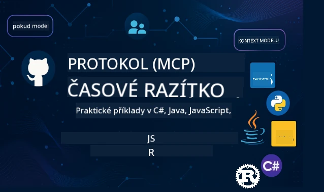

 

[](https://GitHub.com/microsoft/mcp-for-beginners/graphs/contributors)
[](https://GitHub.com/microsoft/mcp-for-beginners/issues)
[](https://GitHub.com/microsoft/mcp-for-beginners/pulls)
[](http://makeapullrequest.com)
[](https://mcptoplist.com/server/mcp.so%2Fmcp-for-beginners%2Fmicrosoft)

[](https://GitHub.com/microsoft/mcp-for-beginners/watchers)
[](https://GitHub.com/microsoft/mcp-for-beginners/fork)
[](https://GitHub.com/microsoft/mcp-for-beginners/stargazers)


[](https://discord.gg/nTYy5BXMWG)

Postupujte podle těchto kroků, abyste začali používat tyto zdroje:
1. **Vytvořte Fork Repozitáře**: Klikněte na [](https://GitHub.com/microsoft/mcp-for-beginners/fork)
2. **Naklonujte Repozitář**:   `git clone https://github.com/microsoft/mcp-for-beginners.git`
3. **Připojte se k** [](https://discord.gg/nTYy5BXMWG)


### 🌐 Podpora více jazyků

#### Podporováno pomocí GitHub Action (automatizované a vždy aktuální)

<!-- CO-OP TRANSLATOR LANGUAGES TABLE START -->
[Arabština](../ar/README.md) | [Bengálština](../bn/README.md) | [Bulharština](../bg/README.md) | [Barmština (Myanmar)](../my/README.md) | [Čínština (zjednodušená)](../zh-CN/README.md) | [Čínština (tradiční, Hong Kong)](../zh-HK/README.md) | [Čínština (tradiční, Macau)](../zh-MO/README.md) | [Čínština (tradiční, Taiwan)](../zh-TW/README.md) | [Chorvatština](../hr/README.md) | [Čeština](./README.md) | [Dánština](../da/README.md) | [Nizozemština](../nl/README.md) | [Estonština](../et/README.md) | [Finština](../fi/README.md) | [Francouzština](../fr/README.md) | [Němčina](../de/README.md) | [Řečtina](../el/README.md) | [Hebrejština](../he/README.md) | [ hindština](../hi/README.md) | [Maďarština](../hu/README.md) | [Indonéština](../id/README.md) | [Italština](../it/README.md) | [Japonština](../ja/README.md) | [Kannadština](../kn/README.md) | [Khmer](../km/README.md) | [Korejština](../ko/README.md) | [Litevština](../lt/README.md) | [Malajština](../ms/README.md) | [Malajalámština](../ml/README.md) | [Maráthština](../mr/README.md) | [Nepálština](../ne/README.md) | [Nigerijský Pidžin](../pcm/README.md) | [Norština](../no/README.md) | [Perština (Fársí)](../fa/README.md) | [Polština](../pl/README.md) | [Portugalština (Brazílie)](../pt-BR/README.md) | [Portugalština (Portugalsko)](../pt-PT/README.md) | [Pandžábština (Gurmukhi)](../pa/README.md) | [Rumunština](../ro/README.md) | [Ruština](../ru/README.md) | [Srbština (cyrilice)](../sr/README.md) | [Slovenština](../sk/README.md) | [Slovinština](../sl/README.md) | [Španělština](../es/README.md) | [Svahilština](../sw/README.md) | [Švédština](../sv/README.md) | [Tagalog (Filipínština)](../tl/README.md) | [Tamilština](../ta/README.md) | [Telugština](../te/README.md) | [Thajština](../th/README.md) | [Turečtina](../tr/README.md) | [Ukrajinština](../uk/README.md) | [Urdu](../ur/README.md) | [Vietnamština](../vi/README.md)

> **Raději klonovat lokálně?**
>
> Tento repozitář obsahuje více než 50 jazykových překladů, což výrazně zvětšuje velikost ke stažení. Pro klonování bez překladů použijte sparse checkout:
>
> **Bash / macOS / Linux:**
> ```bash
> git clone --filter=blob:none --sparse https://github.com/microsoft/mcp-for-beginners.git
> cd mcp-for-beginners
> git sparse-checkout set --no-cone '/*' '!translations' '!translated_images'
> ```
>
> **CMD (Windows):**
> ```cmd
> git clone --filter=blob:none --sparse https://github.com/microsoft/mcp-for-beginners.git
> cd mcp-for-beginners
> git sparse-checkout set --no-cone "/*" "!translations" "!translated_images"
> ```
>
> Toto vám poskytne vše, co potřebujete k dokončení kurzu s mnohem rychlejším stažením.
<!-- CO-OP TRANSLATOR LANGUAGES TABLE END -->

# 🚀 Kurikulum Model Context Protocol (MCP) pro začátečníky

## **Naučte se MCP pomocí praktických příkladů kódu v C#, Java, JavaScript, Rust, Python a TypeScript**

## 🧠 Přehled kurikula Model Context Protocol
Vítejte na své cestě do světa Model Context Protocol! Pokud jste se někdy divili, jak AI aplikace komunikují s různými nástroji a službami, chystáte se objevit elegantní řešení, které mění způsob, jakým vývojáři vytvářejí inteligentní systémy.

Představte si MCP jako univerzálního překladače pro AI aplikace - stejně jako USB porty umožňují připojit jakékoliv zařízení k vašemu počítači, MCP umožňuje AI modelům připojit se k jakémukoliv nástroji nebo službě standardizovaným způsobem. Ať už stavíte svého prvního chatbota, nebo pracujete na složitých AI pracovních tocích, pochopení MCP vám dá sílu vytvářet výkonnější a flexibilnější aplikace.

Toto kurikulum je navrženo s trpělivostí a péčí o vaši vzdělávací cestu. Začneme jednoduchými koncepty, které už znáte, a postupně budete získávat odborné znalosti prostřednictvím praktických cvičení ve vašem oblíbeném programovacím jazyce. Každý krok obsahuje jasná vysvětlení, praktické příklady a spoustu povzbuzení.

Až dokončíte tuto cestu, budete mít důvěru postavit své vlastní MCP servery, integrovat je s populárními AI platformami a porozumět tomu, jak tato technologie proměňuje budoucnost vývoje AI. Pojďme společně začít toto vzrušující dobrodružství!

### Oficiální dokumentace a specifikace

Toto kurikulum je v souladu se **Specifikací MCP 2025-11-25** (poslední stabilní vydání). Specifikace MCP používá číslování verzí založené na datu (formát RRRR-MM-DD), což zajišťuje jasné sledování verzí protokolu.

> **Výhled do budoucna:** kandidátní vydání pro další verzi specifikace, **2026-07-28**, je plánováno na 28. července 2026. Umožňuje bezstavovost protokolu na transportní vrstvě, formalizuje rámec Rozšíření (MCP Aplikace, Úkoly), zpřísňuje autorizaci a ruší kořeny, vzorkování a logování. Kompletní rozbor najdete v [Co se mění v MCP: Kandidátní vydání 2026-07-28](./01-CoreConcepts/mcp-2026-07-28-release-candidate.md).

Tyto zdroje získají na hodnotě, jak se budete učit, ale necítíte tlak na okamžité přečtení všeho. Začněte oblastmi, které vás nejvíce zajímají!
- 📘 [Dokumentace MCP](https://modelcontextprotocol.io/) – Toto je váš hlavní zdroj krok za krokem s návody a uživatelskými příručkami. Dokumentace je napsána s ohledem na začátečníky a poskytuje jasné příklady, které můžete sledovat vlastním tempem.
- 📜 [Specifikace MCP](https://modelcontextprotocol.io/specification/2025-11-25) – Považujte ji za svou komplexní referenční příručku. Jak budete procházet kurikulum, budete se sem vracet pro zjištění podrobností a prozkoumání pokročilých funkcí.
- 📜 [Verzování specifikace MCP](https://modelcontextprotocol.io/specification/versioning) – Obsahuje informace o historii verzí protokolu a o tom, jak MCP používá číslování verzí podle data (formát RRRR-MM-DD).
- 🧑‍💻 [GitHub repozitář MCP](https://github.com/modelcontextprotocol) – Zde najdete SDK, nástroje a ukázky kódu v několika programovacích jazycích. Je to jako pokladnice praktických příkladů a hotových komponent.
- 🌐 [Komunita MCP](https://github.com/orgs/modelcontextprotocol/discussions) – Připojte se k ostatním studentům i zkušeným vývojářům v diskusích o MCP. Je to podpůrná komunita, kde jsou otázky vítány a znalosti se s radostí sdílejí.
  
## Cíle učení

Na konci tohoto kurikula budete cítit důvěru a nadšení z vašich nových schopností. Zde je, čeho dosáhnete:

• **Pochopení základů MCP**: Porozumíte, co je Model Context Protocol a proč mění způsob, jakým AI aplikace spolupracují, s použitím analogií a příkladů, které dávají smysl.

• **Vytvoříte svůj první MCP server**: Vytvoříte funkční MCP server v jazyce dle vlastního výběru, začínajíc jednoduchými příklady a postupně rozvíjející své dovednosti.

• **Propojíte AI modely s reálnými nástroji**: Naučíte se, jak překlenout propast mezi AI modely a skutečnými službami, čímž svým aplikacím dáte nové výkonné schopnosti.

• **Implementujete bezpečnostní osvědčené postupy**: Porozumíte, jak udržet své MCP implementace bezpečné, chránit jak vaše aplikace, tak uživatele.

• **Nasadíte s důvěrou**: Budete vědět, jak dostat své MCP projekty z vývoje do produkce s praktickými nasazovacími strategiemi fungujícími v reálném světě.

• **Připojíte se ke komunitě MCP**: Stanete se součástí rostoucí komunity vývojářů, kteří utvářejí budoucnost vývoje AI aplikací.

## Základní znalosti

Než se pustíme do specifik MCP, ujistěme se, že se cítíte pohodlně s některými základními pojmy. Nemějte obavy, pokud v těchto oblastech nejste odborníkem – vše vysvětlíme, jak půjdeme dál!

### Pochopení protokolů (základ)

Představte si protokol jako pravidla pro konverzaci. Když zavoláte příteli, oba víte, že pozdravíte "ahoj", střídáte se v mluvení a na konci řeknete "nashledanou". Počítačové programy také potřebují podobná pravidla pro efektivní komunikaci.

MCP je protokol – soubor dohodnutých pravidel, které pomáhají AI modelům a aplikacím mít produktivní "konverzace" s nástroji a službami. Stejně jako pravidla konverzace usnadňují lidskou komunikaci, MCP dělá komunikaci AI aplikací mnohem spolehlivější a výkonnější.

### Vztah klient-server (jak programy spolupracují)

Už každý den používáte vztahy klient-server! Když používáte webový prohlížeč (klient) k návštěvě webu, připojujete se na webový server, který vám odešle obsah stránky. Prohlížeč ví, jak požádat o informace, a server ví, jak odpovědět.

V MCP máme podobný vztah: AI modely fungují jako klienti, kteří žádají o informace nebo akce, zatímco MCP servery poskytují tyto schopnosti. Je to jako mít ochotného asistenta (server), kterého může AI požádat o konkrétní úkoly.

### Proč je standardizace důležitá (jak věci fungují spolu)

Představte si, kdyby každý výrobce aut používal jiné tvary čerpacích stojanů – potřebovali byste jiný adaptér pro každé auto! Standardizace znamená dohodu na společných přístupech, takže věci fungují hladce dohromady.

MCP poskytuje tuto standardizaci pro AI aplikace. Místo toho, aby každý AI model potřeboval vlastní kód pro spolupráci s každým nástrojem, MCP vytváří univerzální způsob, jak spolu komunikovat. To znamená, že vývojáři mohou vyrobit nástroje jednou a používat je s mnoha různými AI systémy.

## 🧭 Přehled vaší učební cesty

Vaše cesta MCP je pečlivě strukturovaná, aby postupně budovala vaši důvěru a dovednosti. Každá fáze představuje nové koncepty a zároveň posiluje to, co jste se už naučili.

### 🌱 Základní fáze: Pochopení základů (moduly 0-2)

Zde začíná vaše dobrodružství! Seznámíme vás s koncepty MCP pomocí známých analogií a jednoduchých příkladů. Pochopíte, co je MCP, proč existuje a jak zapadá do širšího světa vývoje AI.


• **Modul 0 - Úvod do MCP**: Začneme zkoumáním, co je MCP a proč je tak důležité pro moderní AI aplikace. Uvidíte příklady z reálného světa, jak MCP funguje, a pochopíte, jak řeší běžné problémy, se kterými se vývojáři setkávají.

• **Modul 1 - Vysvětlení základních konceptů**: Zde se naučíte nezbytné stavební kameny MCP. Použijeme spoustu analogií a vizuálních příkladů, abychom zajistili, že tyto koncepty budou přirozené a srozumitelné.

• **Modul 2 - Bezpečnost v MCP**: Bezpečnost může znít zastrašujícím dojmem, ale ukážeme vám, jak MCP obsahuje vestavěné bezpečnostní funkce a naučíme vás osvědčené postupy, které chrání vaše aplikace od začátku.

### 🔨 Fáze tvorby: Vytvoření vašich prvních implementací (Modul 3)

Teď začíná ta pravá zábava! Získáte praktické zkušenosti s tvorbou skutečných MCP serverů a klientů. Nebojte se - začneme jednoduše a provedeme vás každým krokem.

Tento modul obsahuje několik praktických návodů, které vám umožní cvičit ve vašem preferovaném programovacím jazyce. Vytvoříte svůj první server, postavíte klienta, který se k němu připojí, a dokonce integrujete populární vývojové nástroje jako VS Code.

Každý návod obsahuje kompletní příklady kódu, tipy pro odstraňování problémů a vysvětlení, proč děláme konkrétní architektonická rozhodnutí. Na konci této fáze budete mít pracovní MCP implementace, na které můžete být hrdí!

### 🚀 Fáze růstu: Pokročilé koncepty a reálné nasazení (Moduly 4-5)

Jakmile zvládnete základy, jste připraveni prozkoumat sofistikovanější funkce MCP. Pokryjeme praktické implementační strategie, techniky ladění a pokročilá témata jako integrace multimodální AI.

Naučíte se také, jak škálovat své MCP implementace pro produkční použití a integrovat se s cloudovými platformami jako Azure. Tyto moduly vás připraví na vytváření MCP řešení, která zvládnou požadavky reálného světa.

### 🌟 Fáze mistrovství: Komunita a specializace (Moduly 6-11)

Závěrečná fáze se zaměřuje na zapojení do MCP komunity a specializaci v oblastech, které vás zajímají nejvíce. Naučíte se, jak přispívat do open-source MCP projektů, implementovat pokročilé autentizační vzory a vytvářet komplexní řešení s integrací databází.

Zvláštní zmínku si zaslouží Modul 11 - kompletní 13-laboratorní praktická učební cesta, která vás naučí stavět produkčně připravené MCP servery s integrací PostgreSQL. Je to jako závěrečný projekt, který spojuje vše, co jste se naučili!

### 📚 Kompletní struktura kurzu

| Modul | Téma | Popis | Odkaz |
|--------|-------|-------------|------|
| **Moduly 0-3: Základy** | | | |
| 00 | Úvod do MCP | Přehled Model Context Protocol a jeho význam v AI pipelinech | [Číst dál](./00-Introduction/README.md) |
| 01 | Vysvětlení základních konceptů | Podrobný průzkum hlavních konceptů MCP | [Číst dál](./01-CoreConcepts/README.md) |
| 1.1 | Co se mění v MCP (2026-07-28 RC) | Stateless protokol, rozšíření frameworku a zrušení funkcí v nadcházející verzi specifikace | [Průvodce](./01-CoreConcepts/mcp-2026-07-28-release-candidate.md) |
| 02 | Bezpečnost v MCP | Hrozby bezpečnosti a osvědčené postupy | [Číst dál](./02-Security/README.md) |
| 03 | Začínáme s MCP | Nastavení prostředí, základní servery/klienti, integrace | [Číst dál](./03-GettingStarted/README.md) |
| **Modul 3: Vytváření vašeho prvního serveru a klienta** | | | |
| 3.1 | První server | Vytvořte svůj první MCP server | [Průvodce](./03-GettingStarted/01-first-server/README.md) |
| 3.2 | První klient | Vyviněte základního MCP klienta | [Průvodce](./03-GettingStarted/02-client/README.md) |
| 3.3 | Klient s LLM | Integrace velkých jazykových modelů | [Průvodce](./03-GettingStarted/03-llm-client/README.md) |
| 3.4 | Integrace VS Code | Využití MCP serverů ve VS Code | [Průvodce](./03-GettingStarted/04-vscode/README.md) |
| 3.5 | stdio Server | Vytvořte servery pomocí stdio transportu | [Průvodce](./03-GettingStarted/05-stdio-server/README.md) |
| 3.6 | HTTP Streaming | Implementujte HTTP streaming v MCP | [Průvodce](./03-GettingStarted/06-http-streaming/README.md) |
| 3.7 | Microsoft Foundry Toolkit | Použijte Microsoft Foundry Toolkit s MCP | [Průvodce](./03-GettingStarted/07-aitk/README.md) |
| 3.8 | Testování | Otestujte svou implementaci MCP serveru | [Průvodce](./03-GettingStarted/08-testing/README.md) |
| 3.9 | Nasazení | Nasazení MCP serverů do produkce | [Průvodce](./03-GettingStarted/09-deployment/README.md) |
| 3.10 | Pokročilé využití serveru | Použijte pokročilé servery pro využití pokročilých funkcí a vylepšenou architekturu | [Průvodce](./03-GettingStarted/10-advanced/README.md) |
| 3.11 | Jednoduchá autentizace | Kapitola ukazující autentizaci od začátku a RBAC | [Průvodce](./03-GettingStarted/11-simple-auth/README.md) |
| 3.12 | MCP Hostitelé | Konfigurace Claude Desktop, Cursor, Cline a dalších MCP hostitelů | [Průvodce](./03-GettingStarted/12-mcp-hosts/README.md) |
| 3.13 | MCP Inspector | Ladění a testování MCP serverů pomocí nástroje Inspector | [Průvodce](./03-GettingStarted/13-mcp-inspector/README.md) |
| 3.14 | Sampling | Použití sampling k spolupráci s klientem | [Průvodce](./03-GettingStarted/14-sampling/README.md) |
| 3.15 | MCP Aplikace | Vytvářejte MCP aplikace | [Průvodce](./03-GettingStarted/15-mcp-apps/README.md) |
| **Moduly 4-5: Praktické a pokročilé** | | | |
| 04 | Praktická implementace | SDK, ladění, testování, znovupoužitelné šablony promptů | [Číst dál](./04-PracticalImplementation/README.md) |
| 4.1 | Stránkování | Zpracování velkých výsledkových sad pomocí stránkování s kurzorem | [Průvodce](./04-PracticalImplementation/pagination/README.md) |
| 05 | Pokročilá témata v MCP | Multimodální AI, škálování, podnikové použití | [Číst dál](./05-AdvancedTopics/README.md) |
| 5.1 | Integrace Azure | MCP integrace s Azure | [Průvodce](./05-AdvancedTopics/mcp-integration/README.md) |
| 5.2 | Multimodalita | Práce s více modality | [Průvodce](./05-AdvancedTopics/mcp-multi-modality/README.md) |
| 5.3 | OAuth2 Demo | Implementace OAuth2 autentizace | [Průvodce](./05-AdvancedTopics/mcp-oauth2-demo/README.md) |
| 5.4 | Kořenové kontexty | Pochopení a implementace kořenových kontextů | [Průvodce](./05-AdvancedTopics/mcp-root-contexts/README.md) |
| 5.5 | Směrování | Strategie směrování v MCP | [Průvodce](./05-AdvancedTopics/mcp-routing/README.md) |
| 5.6 | Sampling | Sampling techniky v MCP | [Průvodce](./05-AdvancedTopics/mcp-sampling/README.md) |
| 5.7 | Škálování | Škálování MCP implementací | [Průvodce](./05-AdvancedTopics/mcp-scaling/README.md) |
| 5.8 | Bezpečnost | Pokročilé bezpečnostní úvahy | [Průvodce](./05-AdvancedTopics/mcp-security/README.md) |
| 5.9 | Vyhledávání na webu | Implementace schopností vyhledávání na webu | [Průvodce](./05-AdvancedTopics/web-search-mcp/README.md) |
| 5.10 | Realtime streaming | Vytvoření funkcionality realtime streamingu | [Průvodce](./05-AdvancedTopics/mcp-realtimestreaming/README.md) |
| 5.11 | Realtime vyhledávání | Implementace realtime vyhledávání | [Průvodce](./05-AdvancedTopics/mcp-realtimesearch/README.md) |
| 5.12 | Entra ID autentizace | Autentizace s Microsoft Entra ID | [Průvodce](./05-AdvancedTopics/mcp-security-entra/README.md) |
| 5.13 | Foundry integrace | Integrace s Microsoft Foundry | [Průvodce](./05-AdvancedTopics/mcp-foundry-agent-integration/README.md) |
| 5.14 | Context engineering | Techniky efektivního navrhování kontextů | [Průvodce](./05-AdvancedTopics/mcp-contextengineering/README.md) |
| 5.15 | Vlastní MCP transport | Implementace vlastních transportů | [Průvodce](./05-AdvancedTopics/mcp-transport/README.md) |
| 5.16 | Funkce protokolu | Notifikace postupu, zrušení, šablony zdrojů | [Průvodce](./05-AdvancedTopics/mcp-protocol-features/README.md) |
| 5.17 | Adversariální multi-agentní uvažování | Dva agenti hájí protichůdné názory za použití sdílených MCP nástrojů, hodnoceno rozhodčím agentem | [Průvodce](./05-AdvancedTopics/mcp-adversarial-agents/README.md) |
| **Moduly 6-10: Komunita a osvědčené postupy** | | | |
| 06 | Přispění do komunity | Jak přispívat do ekosystému MCP | [Průvodce](./06-CommunityContributions/README.md) |
| 07 | Zkušenosti z raného nasazení | Příběhy z reálného života o implementaci | [Průvodce](./07-LessonsfromEarlyAdoption/README.md) |
| 08 | Osvědčené postupy pro MCP | Výkon, odolnost proti chybám, pružnost | [Průvodce](./08-BestPractices/README.md) |
| 09 | MCP případové studie | Praktické příklady implementace | [Průvodce](./09-CaseStudy/README.md) |
| 10 | Praktický workshop | Vytváření MCP serveru s Microsoft Foundry Toolkit | [Laboratoř](./10-StreamliningAIWorkflowsBuildingAnMCPServerWithAIToolkit/README.md) |
| **Modul 11: Praktická laboratoř MCP serveru** | | | |
| 11 | Integrace databáze MCP serveru | Komplexní 13-laboratorní cesta s PostgreSQL integrací | [Laboratoře](./11-MCPServerHandsOnLabs/README.md) |
| 11.1 | Úvod | Přehled MCP s integrací databáze a případ použití maloobchodní analytiky | [Laboratoř 00](./11-MCPServerHandsOnLabs/00-Introduction/README.md) |
| 11.2 | Základní architektura | Pochopení architektury MCP serveru, databázových vrstev a bezpečnostních vzorů | [Laboratoř 01](./11-MCPServerHandsOnLabs/01-Architecture/README.md) |
| 11.3 | Bezpečnost a multi-tenancy | Row Level Security, autentizace a přístup k datům vícero tenantů | [Laboratoř 02](./11-MCPServerHandsOnLabs/02-Security/README.md) |
| 11.4 | Nastavení prostředí | Nastavení vývojového prostředí, Docker, Azure zdroje | [Laboratoř 03](./11-MCPServerHandsOnLabs/03-Setup/README.md) |
| 11.5 | Návrh databáze | Nastavení PostgreSQL, návrh maloobchodního schématu a ukázková data | [Laboratoř 04](./11-MCPServerHandsOnLabs/04-Database/README.md) |
| 11.6 | Implementace MCP serveru | Vytvoření FastMCP serveru s databázovou integrací | [Laboratoř 05](./11-MCPServerHandsOnLabs/05-MCP-Server/README.md) |
| 11.7 | Vývoj nástrojů | Vytváření nástrojů pro dotazy do databáze a introspekce schématu | [Laboratoř 06](./11-MCPServerHandsOnLabs/06-Tools/README.md) |
| 11.8 | Sémantické vyhledávání | Implementace vektorových embeddingů s Azure OpenAI a pgvector | [Laboratoř 07](./11-MCPServerHandsOnLabs/07-Semantic-Search/README.md) |
| 11.9 | Testování a ladění | Strategie testování, nástroje ladění a přístupy k validaci | [Laboratoř 08](./11-MCPServerHandsOnLabs/08-Testing/README.md) |
| 11.10 | Integrace VS Code | Konfigurace VS Code MCP integrace a používání AI Chat | [Laboratoř 09](./11-MCPServerHandsOnLabs/09-VS-Code/README.md) |
| 11.11 | Nasazovací strategie | Nasazení Dockeru, Azure Container Apps a úvahy o škálování | [Laboratoř 10](./11-MCPServerHandsOnLabs/10-Deployment/README.md) |
| 11.12 | Monitorování | Application Insights, logování, monitorování výkonu | [Laboratoř 11](./11-MCPServerHandsOnLabs/11-Monitoring/README.md) |
| 11.13 | Osvědčené postupy | Optimalizace výkonu, tvrdnutí bezpečnosti a tipy pro produkci | [Laboratoř 12](./11-MCPServerHandsOnLabs/12-Best-Practices/README.md) |
| **Modul 12: Nástroje MCP** | | | |
| 12.1 | Nástroje | Použití MCP v Copilot App | [ Průvodce ](./12-tooling/README.md) |

### 💻 Ukázkové projekty s kódem

Jednou z nejzajímavějších částí učení MCP je vidět, jak se vaše schopnosti kódování postupně rozvíjejí. Naše příklady kódu jsou navrženy tak, aby začínaly jednoduše a postupně se stávaly sofistikovanějšími podle toho, jak se vaše porozumění prohlubuje. Takto představujeme koncepty – s kódem, který je snadno pochopitelný, ale demonstruje skutečné principy MCP, pochopíte nejen co tento kód dělá, ale i proč je strukturován tímto způsobem a jak zapadá do širších MCP aplikací.

#### Základní příklady kalkulačky MCP

| Jazyk | Popis | Odkaz |
|----------|-------------|------|

| C# | MCP Server Příklad | [Zobrazit kód](./03-GettingStarted/samples/csharp/README.md) |
| Java | MCP Kalkulačka | [Zobrazit kód](./03-GettingStarted/samples/java/calculator/README.md) |
| JavaScript | MCP Demo | [Zobrazit kód](./03-GettingStarted/samples/javascript/README.md) |
| Python | MCP Server | [Zobrazit kód](../../03-GettingStarted/samples/python/mcp_calculator_server.py) |
| TypeScript | MCP Příklad | [Zobrazit kód](./03-GettingStarted/samples/typescript/README.md) |
| Rust | MCP Příklad | [Zobrazit kód](./03-GettingStarted/samples/rust/README.md) |

#### Pokročilé implementace MCP

| Jazyk | Popis | Odkaz |
|----------|-------------|------|
| C# | Pokročilý příklad | [Zobrazit kód](./04-PracticalImplementation/samples/csharp/README.md) |
| Java s Springem | Příklad kontejnerové aplikace | [Zobrazit kód](./04-PracticalImplementation/samples/java/containerapp/README.md) |
| JavaScript | Pokročilý příklad | [Zobrazit kód](./04-PracticalImplementation/samples/javascript/README.md) |
| Python | Složitá implementace | [Zobrazit kód](./04-PracticalImplementation/samples/python/README.md) |
| TypeScript | Příklad kontejneru | [Zobrazit kód](./04-PracticalImplementation/samples/typescript/README.md) |


## 🎯 Požadavky pro studium MCP

Abyste z tohoto učebního plánu získali maximum, měli byste mít:

- Základní znalosti programování v alespoň jednom z těchto jazyků: C#, Java, JavaScript, Python nebo TypeScript
- Pochopení modelu klient-server a API
- Znalost konceptů REST a HTTP
- (Volitelné) Základy AI/ML konceptů

- Zapojení se do diskuzí naší komunity pro podporu

## 📚 Studijní průvodce a zdroje

Tento repozitář obsahuje několik zdrojů, které vám pomohou efektivně se orientovat a učit:

### Studijní průvodce

K dispozici je komplexní [Studijní průvodce](./study_guide.md), který vám pomůže efektivně se v repozitáři orientovat. Tento vizuální mapový plán učebního plánu ukazuje, jak jsou jednotlivá témata propojena, a poskytuje pokyny, jak efektivně používat ukázkové projekty. Je to zvláště užitečné, pokud preferujete vizuální učení a chcete vidět celkový obraz.

Průvodce obsahuje:
- Vizuální mapu učebního plánu zobrazující všechna pokrytá témata
- Podrobný rozklad každé sekce repozitáře
- Pokyny, jak používat ukázkové projekty
- Doporučené učební cesty pro různé úrovně dovedností
- Další zdroje doplňující vaši studijní cestu

### Změny v obsahu

Vede se podrobný [Seznam změn](./changelog.md), který sleduje všechny významné aktualizace učebních materiálů, abyste zůstali aktuální s nejnovějšími vylepšeními a doplňky.
- Přidávání nového obsahu
- Strukturální změny
- Vylepšení funkcí
- Aktualizace dokumentace

## 🛠️ Jak efektivně využívat tento učební plán

Každá lekce v tomto průvodci obsahuje:

1. Jasná vysvětlení konceptů MCP  
2. Živé ukázky kódu v několika jazycích  
3. Cvičení na tvorbu skutečných MCP aplikací  
4. Další zdroje pro pokročilé studenty

### Naučíme se MCP s C# - série tutoriálů
Pojďme se seznámit s Model Context Protocol (MCP), moderním rámcem určeným ke standardizaci interakcí mezi AI modely a klientskými aplikacemi. V tomto přívětivém úvodu vám představíme MCP a provedeme vás tvorbou vašeho prvního MCP serveru.
#### C#: [https://aka.ms/letslearnmcp-csharp](https://aka.ms/letslearnmcp-csharp)
#### Java: [https://aka.ms/letslearnmcp-java](https://aka.ms/letslearnmcp-java)
#### JavaScript: [https://aka.ms/letslearnmcp-javascript](https://aka.ms/letslearnmcp-javascript)
#### Python: [https://aka.ms/letslearnmcp-python](https://aka.ms/letslearnmcp-python)

## 🎓 Vaše cesta s MCP začíná

Gratulujeme! Právě jste udělali první krok na vzrušující cestě, která rozšíří vaše programátorské schopnosti a propojí vás s nejmodernějšími trendy v AI vývoji.

### Co jste již dosáhli

Pročtením tohoto úvodu jste již začali budovat svůj základ znalostí o MCP. Rozumíte, co MCP je, proč je důležité a jak vám tento učební plán pomůže ve studiu. To je významný úspěch a začátek vaší odbornosti v této důležité technologii.

### Dobrodružství před vámi

Jak budete postupovat jednotlivými moduly, pamatujte, že každý expert byl jednou začátečníkem. Koncepty, které se vám nyní mohou zdát složité, se časem stanou druhou přirozeností, jak je budete procvičovat a aplikovat. Každý malý krok směřuje k silným schopnostem, které vám poslouží po celou vaši vývojářskou kariéru.

### Vaše podpora

Připojujete se ke komunitě studentů a expertů, kteří jsou nadšeni MCP a ochotni pomoci ostatním uspět. Ať už se zaseknete na programátorském problému, nebo chcete sdílet průlom, komunita vám pomůže na vaší cestě.

Pokud budete mít potíže nebo otázky týkající se tvorby AI aplikací, zapojte se do diskuzí s ostatními studenty a zkušenými vývojáři o MCP. Je to podpůrná komunita, kde jsou otázky vítány a znalosti volně sdíleny.

[](https://discord.gg/nTYy5BXMWG)

Máte-li zpětnou vazbu k produktu nebo narazíte na chyby při tvorbě, navštivte:

[](https://aka.ms/foundry/forum)

### Připravení začít?

Vaše MCP dobrodružství začíná nyní! Začněte Modul 0 a ponořte se do prvních praktických zkušeností s MCP, nebo prozkoumejte ukázkové projekty, abyste viděli, co budete vytvářet. Pamatujte – každý expert začínal přesně tam, kde jste teď vy, a s trpělivostí a praxí budete ohromeni, čeho dosáhnete.

Vítejte ve světě vývoje Model Context Protocolu. Pojďme společně vytvořit něco úžasného!

## 🤝 Přispívání ke komunitě studentů

Tento učební plán sílí díky příspěvkům od studentů jako jste vy! Ať už opravujete překlep, navrhujete jasnější vysvětlení nebo přidáváte nový příklad, vaše příspěvky pomáhají ostatním začátečníkům uspět.

Díky Microsoft Valued Professional [Shivam Goyal](https://www.linkedin.com/in/shivam2003/) za přispění ukázkových kódů.

Proces přispívání je navržen tak, aby byl vstřícný a podporující. Většina příspěvků vyžaduje Contributor License Agreement (CLA), ale automatizované nástroje vás procesem povedou hladce.

## 📜 Open Source učení

Celý tento učební plán je dostupný pod licencí MIT [LICENSE](../../LICENSE), což znamená, že jej můžete volně používat, upravovat a sdílet. To podporuje naši misi zpřístupnit znalosti o MCP všem vývojářům.
## 🤝 Pokyny pro přispívání

Tento projekt vítá příspěvky a návrhy. Většina příspěvků vyžaduje souhlas s
Contributor License Agreement (CLA), který potvrzuje, že máte právo a skutečně udělujete
práva k využití vašeho příspěvku nám. Pro detaily navštivte <https://cla.opensource.microsoft.com>.

Když podáte pull request, CLA bot automaticky zjistí, zda musíte poskytnout
CLA a označí PR vhodně (například kontrola stavu, komentář). Stačí dodržet instrukce
poskytnuté botem. Toto je potřeba udělat jen jednou pro všechny repozitáře používající náš CLA.

Tento projekt přijal [Microsoft Open Source Code of Conduct](https://opensource.microsoft.com/codeofconduct/).
Více informací najdete v [Code of Conduct FAQ](https://opensource.microsoft.com/codeofconduct/faq/) nebo
kontaktujte [opencode@microsoft.com](mailto:opencode@microsoft.com) s případnými otázkami či připomínkami.

---

*Jste připraveni začít svou cestu s MCP? Začněte s [Module 00 - Úvod do MCP](./00-Introduction/README.md) a udělejte první kroky do světa vývoje Model Context Protocolu!*


## 🎒 Další kurzy
Náš tým vytváří i další kurzy! Podívejte se na:

<!-- CO-OP TRANSLATOR OTHER COURSES START -->
### LangChain
[](https://aka.ms/langchain4j-for-beginners)
[](https://aka.ms/langchainjs-for-beginners?WT.mc_id=m365-94501-dwahlin)
[](https://github.com/microsoft/langchain-for-beginners?WT.mc_id=m365-94501-dwahlin)
---

### Azure / Edge / MCP / Agenti
[](https://github.com/microsoft/AZD-for-beginners?WT.mc_id=academic-105485-koreyst)
[](https://github.com/microsoft/edgeai-for-beginners?WT.mc_id=academic-105485-koreyst)
[](https://github.com/microsoft/mcp-for-beginners?WT.mc_id=academic-105485-koreyst)
[](https://github.com/microsoft/ai-agents-for-beginners?WT.mc_id=academic-105485-koreyst)

---
 
### Série Generativní AI
[](https://github.com/microsoft/generative-ai-for-beginners?WT.mc_id=academic-105485-koreyst)
[-9333EA?style=for-the-badge&labelColor=E5E7EB&color=9333EA)](https://github.com/microsoft/Generative-AI-for-beginners-dotnet?WT.mc_id=academic-105485-koreyst)
[-C084FC?style=for-the-badge&labelColor=E5E7EB&color=C084FC)](https://github.com/microsoft/generative-ai-for-beginners-java?WT.mc_id=academic-105485-koreyst)
[-E879F9?style=for-the-badge&labelColor=E5E7EB&color=E879F9)](https://github.com/microsoft/generative-ai-with-javascript?WT.mc_id=academic-105485-koreyst)

---
 
### Základní učení
[](https://aka.ms/ml-beginners?WT.mc_id=academic-105485-koreyst)
[](https://aka.ms/datascience-beginners?WT.mc_id=academic-105485-koreyst)
[](https://aka.ms/ai-beginners?WT.mc_id=academic-105485-koreyst)

[](https://github.com/microsoft/Security-101?WT.mc_id=academic-96948-sayoung)
[](https://aka.ms/webdev-beginners?WT.mc_id=academic-105485-koreyst)
[](https://aka.ms/iot-beginners?WT.mc_id=academic-105485-koreyst)
[](https://github.com/microsoft/xr-development-for-beginners?WT.mc_id=academic-105485-koreyst)

---
 
### Série Copilot
[](https://aka.ms/GitHubCopilotAI?WT.mc_id=academic-105485-koreyst)
[](https://github.com/microsoft/mastering-github-copilot-for-dotnet-csharp-developers?WT.mc_id=academic-105485-koreyst)
[](https://github.com/microsoft/CopilotAdventures?WT.mc_id=academic-105485-koreyst)
<!-- CO-OP TRANSLATOR OTHER COURSES END -->

---

<!-- CO-OP TRANSLATOR DISCLAIMER START -->
**Prohlášení o omezení odpovědnosti**:
Tento dokument byl přeložen pomocí AI překladatelské služby [Co-op Translator](https://github.com/Azure/co-op-translator). Přestože usilujeme o co největší přesnost, mějte prosím na paměti, že automatizované překlady mohou obsahovat chyby nebo nepřesnosti. Originální dokument v jeho mateřském jazyce by měl být považován za autoritativní zdroj. Pro kritické informace se doporučuje profesionální lidský překlad. Nejsme odpovědní za jakékoli nedorozumění nebo nesprávné interpretace vzniklé použitím tohoto překladu.
<!-- CO-OP TRANSLATOR DISCLAIMER END -->