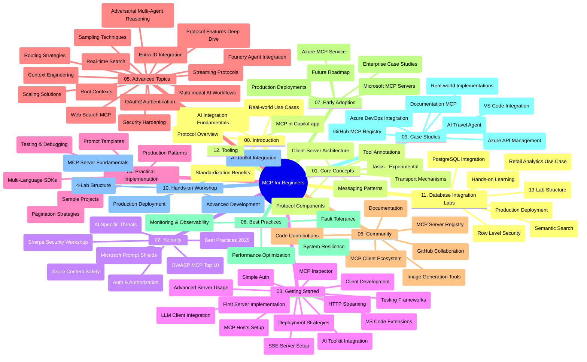

# Protokol Model Context (MCP) pro začátečníky – Studijní příručka

Tato studijní příručka poskytuje přehled struktury a obsahu repozitáře pro kurz „Protokol Model Context (MCP) pro začátečníky“. Použijte tuto příručku k efektivní navigaci v repozitáři a maximálnímu využití dostupných zdrojů.

## Přehled repozitáře

Protokol Model Context (MCP) je standardizovaný rámec pro interakce mezi AI modely a klientskými aplikacemi. Původně vytvořený společností Anthropic je MCP nyní spravován širší komunitou MCP prostřednictvím oficiální organizace na GitHubu. Tento repozitář poskytuje komplexní kurz s praktickými příklady kódu v C#, Java, JavaScript, Python a TypeScript, určený pro vývojáře AI, systémové architekty a softwarové inženýry.

## Visualizační mapa kurzu

## Struktura repozitáře

Repozitář je rozdělen do dvanácti hlavních sekcí, z nichž každá se zaměřuje na odlišné aspekty MCP:

1. **Úvod (00-Introduction/)**
   - Přehled Protokolu Model Context
   - Proč je standardizace důležitá v AI pipelinech
   - Praktické případy použití a přínosy

2. **Základní koncepty (01-CoreConcepts/)**
   - Klient-server architektura
   - Klíčové protokolové komponenty
   - Vzorové způsoby komunikace v MCP
   - Aktuální specifikace: [Co se změnilo v MCP: Specifikace 2026-07-28](./01-CoreConcepts/mcp-2026-07-28.md) — bezstavový protokolové jádro, Framework rozšíření a zrušení Roots/Sampling/Logging

3. **Bezpečnost (02-Security/)**
   - Bezpečnostní hrozby v systémech založených na MCP
   - Nejlepší postupy pro zabezpečení implementací
   - Strategie autentizace a autorizace
   - Praktický [příklad autorizace CIMD a DCR](./02-Security/samples/cimd-dcr-auth/README.md)
   - **Komplexní bezpečnostní dokumentace**:
     - Bezpečnostní nejlepší postupy MCP
     - Průvodce implementací Azure Content Safety
     - Kontroly a techniky bezpečnosti MCP
     - Rychlý přehled nejlepších postupů MCP
   - **Klíčová bezpečnostní témata**:
     - Útoky založené na injektáži příkazů a otrava nástrojů
     - Únos sezení a problémy zmateného zástupce
     - Zranitelnosti předávání tokenů
     - Nadměrná oprávnění a kontrola přístupu
     - Bezpečnost dodavatelského řetězce pro AI komponenty
     - Integrace Microsoft Prompt Shields

4. **Začínáme (03-GettingStarted/)**
   - Nastavení prostředí a konfigurace
   - Vytvoření základních MCP serverů a klientů
   - Integrace s existujícími aplikacemi
   - Obsahuje sekce pro:
     - První implementace serveru
     - Vývoj klienta
     - Integrace klienta LLM
     - Integrace do VS Code
     - Server-Sent Events (SSE) server
     - Pokročilé použití serveru
     - HTTP streaming
     - Integrace AI Toolkit
     - Testovací strategie
     - Pokyny pro nasazení

5. **Praktická implementace (04-PracticalImplementation/)**
   - Použití SDK v různých programovacích jazycích
   - Ladění, testování a validační techniky
   - Vytváření znovupoužitelných šablon promptů a pracovních toků
   - Ukázkové projekty s příklady implementace

6. **Pokročilá témata (05-AdvancedTopics/)**
   - Techniky práce s kontextem
   - Integrace agenta Foundry
   - Multi-modální AI pracovní toky
   - Ukázky autentizace OAuth2
   - Funkce vyhledávání v reálném čase
   - Streaming v reálném čase
   - Implementace Root contextů
   - Strategie směrování
   - Techniky vzorkování
   - Přístupy škálování
   - Bezpečnostní úvahy
   - Integrace bezpečnosti Entra ID
   - Integrace webového vyhledávání
   - Adverzární multi-agentní usuzování (vzor debaty)

7. **Příspěvky komunity (06-CommunityContributions/)**
   - Jak přispívat kódem a dokumentací
   - Spolupráce prostřednictvím GitHubu
   - Vylepšení a zpětná vazba řízená komunitou
   - Používání různých MCP klientů (Claude Desktop, Cline, VSCode)
   - Práce s populárními MCP servery včetně generování obrázků

8. **Lekce z raného přijetí (07-LessonsfromEarlyAdoption/)**
   - Reálné implementace a příběhy úspěchu
   - Tvorba a nasazení řešení založených na MCP
   - Trendy a budoucí plán
   - **Průvodce Microsoft MCP servery**: Komplexní průvodce deseti produkčně připravenými Microsoft MCP servery, včetně:
     - Microsoft Learn Docs MCP server
     - Azure MCP server (15+ specializovaných konektorů)
     - GitHub MCP server
     - Azure DevOps MCP server
     - MarkItDown MCP server
     - SQL Server MCP server
     - Playwright MCP server
     - Dev Box MCP server
     - Microsoft Foundry MCP server
     - Microsoft 365 Agents Toolkit MCP server

9. **Nejlepší postupy (08-BestPractices/)**
   - Ladění výkonu a optimalizace
   - Návrh odolných MCP systémů
   - Strategie testování a zotavení

10. **Případové studie (09-CaseStudy/)**
    - **Sedm komplexních případových studií** demonstrujících všestrannost MCP v různých scénářích:
    - **Azure AI Travel Agents**: Mult_agentní orchestraci s Azure OpenAI a AI Search
    - **Integrace Azure DevOps**: Automatizace workflow procesů s aktualizacemi dat z YouTube
    - **Real-time načítání dokumentace**: Python konzolový klient s HTTP streamováním
    - **Interaktivní generátor studijního plánu**: Webová aplikace Chainlit s konverzační AI
    - **Dokumentace v editoru**: Integrace VS Code s workflow GitHub Copilot
    - **Azure API Management**: Podniková integrace API s tvorbou MCP serveru
    - **GitHub MCP Registry**: Vývoj ekosystému a agentní integrační platforma
    - Ukázky implementace pokrývající podnikovou integraci, produktivitu vývojářů a vývoj ekosystému

11. **Praktický workshop (10-StreamliningAIWorkflowsBuildingAnMCPServerWithAIToolkit/)**
    - Komplexní praktický workshop kombinující MCP s AI Toolkit
    - Tvorba inteligentních aplikací spojujících AI modely s reálnými nástroji
    - Praktické moduly pokrývající základy, vývoj vlastního serveru a strategie produkčního nasazení
    - **Struktura laboratoří**:
      - Laboratoř 1: Základy MCP serveru
      - Laboratoř 2: Pokročilý vývoj MCP serveru
      - Laboratoř 3: Integrace AI Toolkit
      - Laboratoř 4: Produkční nasazení a škálování
    - Učení založené na laboratořích s krok za krokem instrukcemi

12. **Laboratoře MCP server s databází (11-MCPServerHandsOnLabs/)**
    - **Komplexní cesta 13 laboratoří** pro tvorbu produkčně připravených MCP serverů s integrací PostgreSQL
    - **Reálná implementace maloobchodní analýzy** pomocí případu použití Zava Retail
    - **Firemní vzory** zahrnující Row Level Security (RLS), sémantické vyhledávání a přístup k datům pro více zákazníků
    - **Kompletní struktura laboratoří**:
      - **Laboratoře 00-03: Základy** – Úvod, Architektura, Bezpečnost, Nastavení prostředí
      - **Laboratoře 04-06: Tvorba MCP serveru** – Návrh databáze, Implementace MCP serveru, Vývoj nástrojů
      - **Laboratoře 07-09: Pokročilé funkce** – Sémantické vyhledávání, Testování a ladění, Integrace VS Code
      - **Laboratoře 10-12: Produkce a nejlepší postupy** – Nasazení, Monitorování, Optimalizace
    - **Pokryté technologie**: framework FastMCP, PostgreSQL, Azure OpenAI, Azure Container Apps, Application Insights
    - **Výsledky učení**: Produkčně připravené MCP servery, vzory integrace databází, AI-poháněná analytika, podniková bezpečnost

13. **Nástroje (12-tooling/)**
    - Naučte se používat MCP v aplikaci Copilot a dalších nástrojích

## Další zdroje

Repozitář obsahuje podpůrné zdroje:

- **Složka obrázků**: Obsahuje diagramy a ilustrace použité v průběhu kurzu
- **Překlady**: Multijazyčná podpora s automatickými překlady dokumentace
- **Oficiální MCP zdroje**:
  - [MCP Dokumentace](https://modelcontextprotocol.io/)
  - [MCP Specifikace](https://modelcontextprotocol.io/specification/2026-07-28/)
  - [MCP GitHub Repozitář](https://github.com/modelcontextprotocol)

## Jak používat tento repozitář

1. **Sekvenční učení**: Postupujte kapitolami v pořadí (00 až 11) pro strukturované vzdělávání.
2. **Jazykový speciální fokus**: Máte-li zájem o konkrétní programovací jazyk, prozkoumejte složky příkladů pro implementace ve vámi preferovaném jazyce.
3. **Praktická implementace**: Začněte sekcí „Začínáme“ pro nastavení prostředí a vytvoření prvního MCP serveru a klienta.
4. **Pokročilé prozkoumání**: Jakmile zvládnete základy, ponořte se do pokročilých témat pro rozšíření znalostí.
5. **Zapojení komunity**: Připojte se ke komunitě MCP prostřednictvím diskusí na GitHubu a kanálů Discord, abyste se spojili s odborníky a dalšími vývojáři.

## MCP klienti a nástroje

Kurz pokrývá různé MCP klienty a nástroje:

1. **Oficiální klienti**:
   - Visual Studio Code
   - MCP ve Visual Studio Code
   - Claude Desktop
   - Claude ve VSCode
   - Claude API

2. **Klienti komunity**:
   - Cline (terminálový)
   - Cursor (editor kódu)
   - ChatMCP
   - Windsurf

3. **Nástroje pro správu MCP**:
   - MCP CLI
   - MCP Manager
   - MCP Linker
   - MCP Router

## Populární MCP servery

Repozitář představuje různé MCP servery, včetně:

1. **Oficiální Microsoft MCP servery**:
   - Microsoft Learn Docs MCP server
   - Azure MCP server (15+ specializovaných konektorů)
   - GitHub MCP server
   - Azure DevOps MCP server
   - MarkItDown MCP server
   - SQL Server MCP server
   - Playwright MCP server
   - Dev Box MCP server
   - Microsoft Foundry MCP server
   - Microsoft 365 Agents Toolkit MCP server

2. **Oficiální referenční servery**:
   - Filesystem
   - Fetch
   - Memory
   - Sequential Thinking

3. **Generování obrázků**:
   - Azure OpenAI DALL-E 3
   - Stable Diffusion WebUI
   - Replicate

4. **Vývojové nástroje**:
   - Git MCP
   - Termínálová kontrola
   - Asistent kódu

5. **Specializované servery**:
   - Salesforce
   - Microsoft Teams
   - Jira & Confluence

## Přispívání

Tento repozitář vítá příspěvky z komunity. Viz sekce Příspěvky komunity pro návod, jak efektivně přispívat do ekosystému MCP.

----

*Tato studijní příručka byla naposledy aktualizovaná 9. září 2026. Odráží specifikaci MCP
`2026-07-28`, aktuální revizi protokolu. Některé praktické
příklady zůstávají explicitně verziovány na `2025-11-25`, zatímco jejich SDK a nástroje
přecházejí na stateless protokolové API.*

---

<!-- CO-OP TRANSLATOR DISCLAIMER START -->
**Prohlášení o omezení odpovědnosti**:
Tento dokument byl přeložen pomocí AI překladatelské služby [Co-op Translator](https://github.com/Azure/co-op-translator). Přestože usilujeme o co největší přesnost, mějte prosím na paměti, že automatizované překlady mohou obsahovat chyby nebo nepřesnosti. Originální dokument v jeho mateřském jazyce by měl být považován za autoritativní zdroj. Pro kritické informace se doporučuje profesionální lidský překlad. Nejsme odpovědní za jakékoli nedorozumění nebo nesprávné interpretace vzniklé použitím tohoto překladu.
<!-- CO-OP TRANSLATOR DISCLAIMER END -->