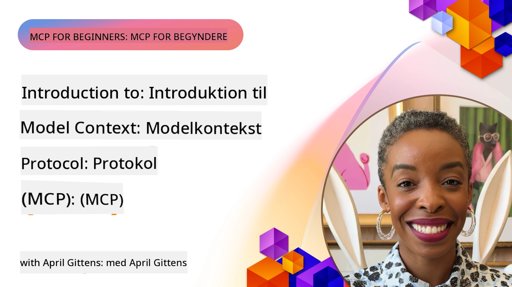
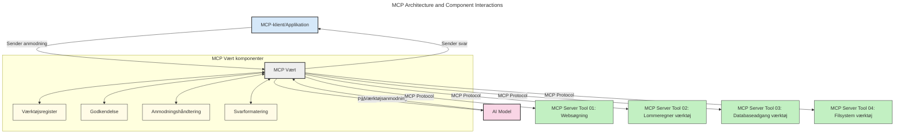
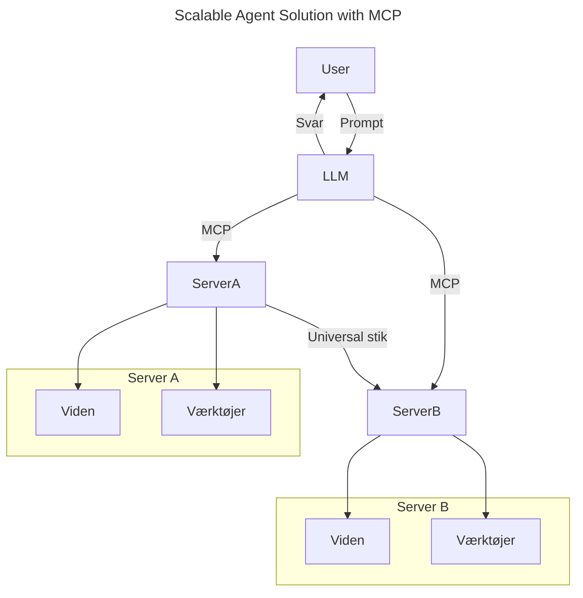
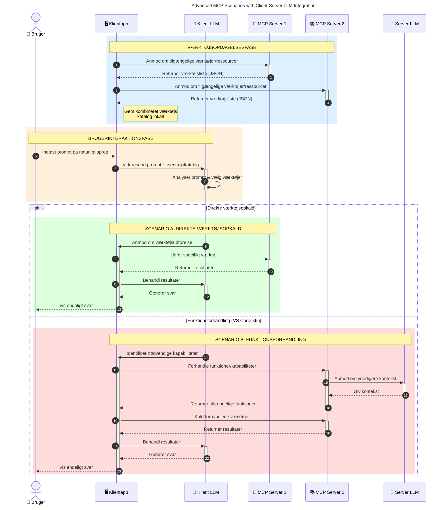

# Introduktion til Model Context Protocol (MCP): Hvorfor det er vigtigt for skalerbare AI-applikationer

_(Klik på billedet ovenfor for at se videoen til denne lektion)_

Generative AI-applikationer er et stort fremskridt, da de ofte lader brugeren interagere med appen ved hjælp af naturlige sprogkommandoer. Men efterhånden som der investeres mere tid og ressourcer i sådanne apps, vil du sikre, at du nemt kan integrere funktionaliteter og ressourcer på en måde, der gør det let at udvide, at din app kan håndtere mere end en model, og at den kan håndtere forskellige modellernes kompleksiteter. Kort sagt er det nemt at begynde at bygge Gen AI-apps, men efterhånden som de vokser og bliver mere komplekse, skal du begynde at definere en arkitektur og vil sandsynligvis skulle stole på en standard for at sikre, at dine apps bygges på en konsistent måde. Det er her, MCP kommer ind for at organisere tingene og levere en standard.

---

## **🔍 Hvad er Model Context Protocol (MCP)?**

**Model Context Protocol (MCP)** er et **åbent, standardiseret interface**, der tillader Large Language Models (LLMs) at interagere sømløst med eksterne værktøjer, API'er og datakilder. Det tilbyder en konsistent arkitektur for at forbedre AI-modellers funktionalitet ud over deres træningsdata, hvilket muliggør smartere, skalerbare og mere responsive AI-systemer.

---

## **🎯 Hvorfor standardisering i AI er vigtigt**

Efterhånden som generative AI-applikationer bliver mere komplekse, er det essentielt at adoptere standarder, der sikrer **skalerbarhed, udvidelsesmuligheder, vedligeholdelighed** og **undgåelse af leverandørlåsning**. MCP imødekommer disse behov ved at:

- Forene model-værktøjsintegrationer
- Reducere skrøbelige, éngangs tilpassede løsninger
- Muliggøre at flere modeller fra forskellige leverandører kan sameksistere inden for ét økosystem

**Bemærk:** Selvom MCP præsenterer sig som en åben standard, er der ingen planer om at standardisere MCP gennem eksisterende standardiseringsorganer som IEEE, IETF, W3C, ISO eller andre.

---

## **📚 Læringsmål**

Ved slutningen af denne artikel vil du kunne:

- Definere **Model Context Protocol (MCP)** og dens anvendelsestilfælde
- Forstå hvordan MCP standardiserer model-til-værktøj kommunikation
- Identificere kernekomponenterne i MCP-arkitekturen
- Udforske eksempler på MCP i erhvervs- og udviklingskontekster

---

## **💡 Hvorfor Model Context Protocol (MCP) er en banebryder**

### **🔗 MCP løser fragmentering i AI-interaktioner**

Før MCP krævede integration af modeller med værktøjer:

- Tilpasset kode for hvert værktøj-model par
- Ikke-standardiserede API'er for hver leverandør
- Hyppige sammenbrud ved opdateringer
- Dårlig skalerbarhed med flere værktøjer

### **✅ Fordele ved MCP-standardisering**

| **Fordel**               | **Beskrivelse**                                                               |
|--------------------------|-------------------------------------------------------------------------------|
| Interoperabilitet        | LLM'er arbejder sømløst med værktøjer på tværs af forskellige leverandører  |
| Konsistens               | Ensartet adfærd på tværs af platforme og værktøjer                           |
| Genbrug                 | Værktøjer bygget én gang kan bruges på tværs af projekter og systemer        |
| Accelereret Udvikling    | Reducer udviklingstid ved at bruge standardiserede, plug-and-play interfaces |

---

## **🧱 Overordnet MCP-arkitektur Oversigt**

MCP følger en **klient-server model**, hvor:

- **MCP Hosts** kører AI-modellerne
- **MCP Clients** initierer forespørgsler
- **MCP Servers** leverer kontekst, værktøjer og kapaciteter

### **Nøglekomponenter:**

- **Ressourcer** – Statisk eller dynamisk data til modeller  
- **Prompts** – Foruddefinerede arbejdsgange til guidet generering  
- **Værktøjer** – Eksekverbare funktioner som søgning, beregninger  
- **Sampling** – Agent-lignende adfærd via rekursive interaktioner (udgået i
    MCP `2026-07-28`; nye implementeringer bør integrere direkte med en LLM
    udbyder)
- **Elicitation** – Server-initierede forespørgsler for brugerinput
- **Roots** – Informationsfilsystemplaceringer relevante for en server
    (udgået i MCP `2026-07-28`; foretræk værktøjsparametre, resource-URI'er eller
    serverkonfiguration)

### **Protokolarkitektur:**

MCP bruger en to-lags arkitektur:
- **Datalag**: JSON-RPC 2.0-meddelelser, metadata pr. anmodning, opdagelse og
    protokolprimitive
- **Transportlag**: stdio til lokale subprocesser og Streamable HTTP til
    fjernservere. Streamable HTTP kan bruge SSE-framing til streamede svar,
    men den ældre HTTP+SSE transport er udgået.

---

## Hvordan MCP Servers fungerer

MCP-servere fungerer på følgende måde:

- **Forespørgselsflow**:
    1. En forespørgsel initieres af en slutbruger eller software, der handler på deres vegne.
    2. **MCP Client** sender forespørgslen til en **MCP Host**, som administrerer AI-model runtime.
    3. **AI-modellen** modtager brugerprompten og kan anmode om adgang til eksterne værktøjer eller data via et eller flere værktøjskald.
    4. **MCP Host**, ikke modellen direkte, kommunikerer med de passende **MCP Server(e)** ved hjælp af den standardiserede protokol.
- **MCP Host Funktionalitet**:
    - **Værktøjsregister**: Vedligeholder en katalog over tilgængelige værktøjer og deres kapaciteter.
    - **Autentificering**: Verificerer tilladelser til værktøjsadgang.
    - **Forespørgselsbehandler**: Behandler indkommende værktøjsanmodninger fra modellen.
    - **Svarformaterer**: Strukturerer værktøjsoutput i et format, modellen kan forstå.
- **MCP Server Eksekvering**:
    - **MCP Host** sender værktøjskald til en eller flere **MCP Servere**, hvor hver eksponerer specialiserede funktioner (f.eks. søgning, beregninger, databaseforespørgsler).
    - **MCP Serverne** udfører deres respektive operationer og returnerer resultater til **MCP Host** i et konsistent format.
    - **MCP Host** formaterer og videresender disse resultater til **AI-modellen**.
- **Svarfærdiggørelse**:
    - **AI-modellen** inkorporerer værktøjsoutputtene i et endeligt svar.
    - **MCP Host** sender dette svar tilbage til **MCP Client**, som leverer det til slutbrugeren eller kaldende software.
    

## 👨‍💻 Hvordan man bygger en MCP Server (med eksempler)

MCP-servere giver dig mulighed for at udvide LLM's kapaciteter ved at levere data og funktionalitet. 

Klar til at prøve? Her er sprog- og/eller stackspecifikke SDK'er med eksempler på, hvordan man opretter simple MCP-servere i forskellige sprog/stacks:

- **Python SDK**: https://github.com/modelcontextprotocol/python-sdk

- **TypeScript SDK**: https://github.com/modelcontextprotocol/typescript-sdk

- **Java SDK**: https://github.com/modelcontextprotocol/java-sdk

- **C#/.NET SDK**: https://github.com/modelcontextprotocol/csharp-sdk

## 🌍 Virkelige anvendelsestilfælde for MCP

MCP muliggør en bred vifte af applikationer ved at udvide AI-kapaciteter:

| **Anvendelse**               | **Beskrivelse**                                                               |
|-----------------------------|-------------------------------------------------------------------------------|
| Enterprise Data Integration  | Forbind LLM'er med databaser, CRM'er eller interne værktøjer                 |
| Agentiske AI Systemer        | Muliggør autonome agenter med værktøjsadgang og beslutningsarbejdsgange       |
| Multimodale Applikationer    | Kombiner tekst-, billede- og lydværktøjer inden for en enkelt samlet AI-app   |
| Real-time Data Integration   | Bring live data ind i AI-interaktioner for mere nøjagtige, opdaterede output  |

### 🧠 MCP = Universel Standard for AI-Interaktioner

Model Context Protocol (MCP) fungerer som en universel standard for AI-interaktioner, ligesom USB-C standardiserede fysiske forbindelser til enheder. I AI-verdenen tilbyder MCP et konsistent interface, der tillader modeller (klienter) at integrere sømløst med eksterne værktøjer og dataudbydere (servere). Det eliminerer behovet for forskellige, tilpassede protokoller for hver API eller datakilde.

Under MCP følger et MCP-kompatibelt værktøj (kaldet en MCP-server) en samlet standard. Disse servere kan liste de værktøjer eller handlinger, de tilbyder, og udføre disse handlinger, når de anmodes af en AI-agent. AI-agent-platforme, der understøtter MCP, kan opdage tilgængelige værktøjer fra serverne og kalde dem gennem denne standardprotokol.

### 💡 Letter adgang til viden

Udover at tilbyde værktøjer, faciliterer MCP også adgang til viden. Det muliggør, at applikationer kan give kontekst til store sprogmodeller (LLMs) ved at forbinde dem til forskellige datakilder. For eksempel kan en MCP-server repræsentere en virksomheds dokumentlager, så agenter kan hente relevant information efter behov. En anden server kan håndtere specifikke handlinger som at sende e-mails eller opdatere poster. Fra agentens perspektiv er disse blot værktøjer, den kan bruge – nogle værktøjer returnerer data (videns kontekst), mens andre udfører handlinger. MCP håndterer begge effektivt.

En agent, der forbinder til en MCP-server, lærer automatisk serverens tilgængelige kapabiliteter og tilgængelige data gennem et standardformat. Denne standardisering muliggør dynamisk værktøjstilgængelighed. For eksempel gør tilføjelsen af en ny MCP-server til en agents system dens funktioner straks brugbare uden yderligere tilpasning af agentens instruktioner.

Denne strømlinede integration stemmer overens med flowet vist i følgende diagram, hvor servere leverer både værktøjer og viden og sikrer sømløst samarbejde på tværs af systemer. 

### 👉 Eksempel: Skalerbar Agentløsning

Den universelle connector gør det muligt for MCP-servere at kommunikere og dele kapaciteter med hinanden, så ServerA kan delegere opgaver til ServerB eller få adgang til dets værktøjer og viden. Dette føderer værktøjer og data på tværs af servere, hvilket understøtter skalerbare og modulære agentarkitekturer. Fordi MCP standardiserer værktøjseksponering, kan agenter dynamisk opdage og dirigere forespørgsler mellem servere uden hårdkodede integrationer.

Værktøjs- og vidensfederation: Værktøjer og data kan tilgås på tværs af servere, hvilket muliggør mere skalerbare og modulære agentarkitekturer.

### 🔄 Avancerede MCP-scenarier med klient-side LLM-integration

Udover den grundlæggende MCP-arkitektur findes der avancerede scenarier, hvor både klient og server indeholder LLM'er, hvilket muliggør mere sofistikerede interaktioner. I følgende diagram kunne **Client App** være en IDE med en række MCP-værktøjer tilgængelige for LLM'en:

## 🔐 Praktiske Fordele ved MCP

Her er de praktiske fordele ved at bruge MCP:

- **Opdateret information**: Modeller kan få adgang til opdateret information ud over deres træningsdata
- **Kapabilitetsudvidelse**: Modeller kan udnytte specialiserede værktøjer til opgaver, de ikke er trænet til
- **Reducerede hallucinationer**: Eksterne datakilder giver faktuel forankring
- **Privatliv**: Følsomme data kan blive i sikre miljøer i stedet for at blive indlejret i prompts

## 📌 Vigtige Pointer

Følgende er vigtige pointer for brug af MCP:

- **MCP** standardiserer hvordan AI-modeller interagerer med værktøjer og data
- Fremmer **udvidelsesmuligheder, konsistens og interoperabilitet**
- MCP hjælper med at **forkorte udviklingstid, forbedre pålidelighed og udvide modelkapaciteter**
- Klient-server arkitekturen **muliggør fleksible, udvidelige AI-applikationer**

## 🧠 Øvelse

Tænk på en AI-applikation, du er interesseret i at bygge.

- Hvilke **eksterne værktøjer eller data** kunne forbedre dens kapaciteter?
- Hvordan kunne MCP gøre integrationen **simplere og mere pålidelig?**

## Yderligere Ressourcer

- [MCP GitHub Repository](https://github.com/modelcontextprotocol)

## Hvad er det næste

Næste: [Kapitel 1: Kernebegreber](../01-CoreConcepts/README.md)

---

<!-- CO-OP TRANSLATOR DISCLAIMER START -->
**Ansvarsfraskrivelse**:
Dette dokument er blevet oversat ved hjælp af AI-oversættelsestjenesten [Co-op Translator](https://github.com/Azure/co-op-translator). Selvom vi bestræber os på nøjagtighed, skal du være opmærksom på, at automatiserede oversættelser kan indeholde fejl eller unøjagtigheder. Det originale dokument på dets oprindelige sprog bør betragtes som den autoritative kilde. For kritisk information anbefales professionel menneskelig oversættelse. Vi påtager os intet ansvar for misforståelser eller fejltolkninger, der opstår som følge af brugen af denne oversættelse.
<!-- CO-OP TRANSLATOR DISCLAIMER END -->