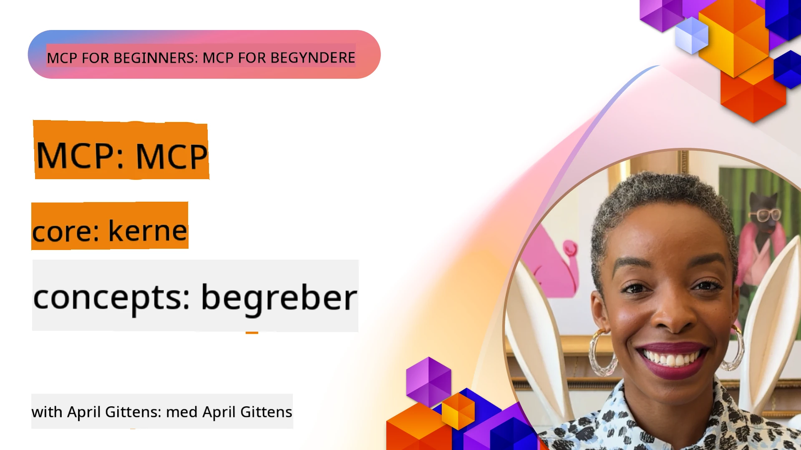
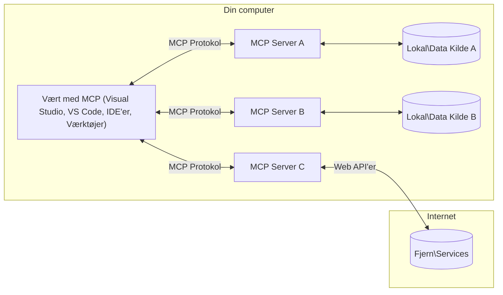

# MCP Kernbegreber: Mestring af Model Context Protocol for AI-integration

[](https://youtu.be/earDzWGtE84)

_(Klik på billedet ovenfor for at se videoen til denne lektion)_

[Model Context Protocol (MCP)](https://github.com/modelcontextprotocol) er en kraftfuld, standardiseret ramme, som optimerer kommunikationen mellem store sprogmodeller (LLM’er) og eksterne værktøjer, applikationer og datakilder. 
Denne guide vil føre dig igennem MCP's kernbegreber. Du vil lære om dens klient-server-arkitektur, væsentlige komponenter, kommunikationsmekanismer og bedste praksis for implementering.

- **Brugerkontrol og samtykke**: Værter bør tydeligt vise, hvilke data og værktøjer en
  server eksponerer, lade brugere afvise handlinger, og opnå eksplicit bekræftelse
  for følsomme eller betydningsfulde handlinger. MCP kræver ikke en bekræftelsesdialog
  før hvert værktøjskald.

- **Databeskyttelse**: Brugerdata må kun deles med eksplicit samtykke og skal beskyttes med robuste adgangskontroller gennem hele interaktionsforløbet. Implementeringer skal forhindre uautoriseret dataoverførsel og opretholde strenge privatlivsgrænser.

- **Sikker udførelse af værktøjer**: Værter bør gøre værktøjskald synlige og lade
  en person kunne afvise dem. Følsomme operationer bør vise værktøjets input
  og effekt før udførelse med sikkerhedsgrænser, der forhindrer utilsigtede
  eller ondsindede handlinger.

- **Transport­sikkerhed**: Fjernforbindelser bør bruge HTTPS og MCP's autorisationsmodel.
  Lokale stdio-servere er afhængige af procesisolation, betroet konfiguration
  og sikker håndtering af arvede legitimationsoplysninger.

#### Implementeringsretningslinjer:

- **Adgangs­styring**: Implementer detaljerede rettighedssystemer, der tillader brugere at kontrollere, hvilke servere, værktøjer og ressourcer der er tilgængelige
- **Autentifikation og autorisation**: Brug sikre autentifikationsmetoder (OAuth, API-nøgler) med korrekt token­håndtering og udløb  
- **Inputvalidering**: Valider alle parametre og data input i henhold til definerede skemaer for at forhindre injektionsangreb
- **Revisionslogning**: Vedligehold omfattende logs over alle operationer til sikkerhedsovervågning og overholdelse

## Oversigt

Denne lektion undersøger den grundlæggende arkitektur og de komponenter, som udgør Model Context Protocol (MCP) økosystemet. Du vil lære om klient-server-arkitekturen, nøglekomponenterne og kommunikationsmekanismerne, der driver MCP-interaktionerne.

## Centrale læringsmål

Når du har gennemført denne lektion, vil du:

- Forstå MCP’s klient-server-arkitektur.
- Identificere roller og ansvar for værter, klienter og servere.
- Analysere kernefunktioner, der gør MCP til et fleksibelt integrationslag.
- Lære hvordan information flyder inden for MCP-økosystemet.
- Få praktisk indsigt gennem kodeeksempler i .NET, Java, Python og JavaScript.

## MCP Arkitektur: Et dybere kig

MCP-økosystemet er bygget på en klient-server-model. Denne modulære struktur muliggør effektiv interaktion mellem AI-applikationer og værktøjer, databaser, API’er og kontekstuelle ressourcer. Lad os bryde denne arkitektur ned i dens kernekomponenter.

I sin kerne følger MCP en klient-server-arkitektur, hvor en vært kan forbinde til flere servere:



- **MCP Værter**: Programmer som VSCode, Claude Desktop, IDE’er eller AI-værktøjer, der ønsker at tilgå data gennem MCP
- **MCP Klienter**: Protokolkomponenter, som opretholder et logisk forhold
  med en server; MCP `2026-07-28` forespørgsler afhænger ikke af én vedvarende
  forbindelse eller session
- **MCP Servere**: Letvægtsprogrammer, der hver især eksponerer specifikke funktionaliteter gennem den standardiserede Model Context Protocol
- **Lokale datakilder**: Din computers filer, databaser og tjenester, som MCP-servere kan få sikker adgang til
- **Fjern­tjenester**: Eksterne systemer tilgængelige over internettet, som MCP-servere kan forbinde til via API’er.

MCP-protokollen er en standard i udvikling, der bruger datobaseret versionsnummerering
(YYYY-MM-DD format). Den nuværende protokolversion er **2026-07-28**. Se
[2026-07-28 protokolspecifikation](https://modelcontextprotocol.io/specification/2026-07-28/).

> **Nuværende udgivelse:** MCP `2026-07-28` gør protokollen stateless på
> transportlaget ved at fjerne `initialize` håndtrykket og protokolniveau-
> sessions-ID’er. Den formaliserer også en Extensions-ramme og afvikler
> Roots, Sampling og Logging til fordel for nyere mønstre. Se
> [Hvad er ændret i MCP: 2026-07-28 specifikationen](./mcp-2026-07-28.md)
> for en fuldstændig gennemgang og migrationsvejledning. Eksempler, som eksplicit
> sigter mod `2025-11-25`, bevares som ældre kompatibilitetslektioner.

### 1. Værter

I Model Context Protocol (MCP) er **værter** AI-applikationer, som fungerer som den primære grænseflade, hvorigennem brugere interagerer med protokollen. Værter koordinerer og administrerer forbindelser til flere MCP-servere ved at oprette dedikerede MCP-klienter til hver serverforbindelse. Eksempler på værter inkluderer:

- **AI-applikationer**: Claude Desktop, Visual Studio Code, Claude Code
- **Udviklingsmiljøer**: IDE’er og kodeeditorer med MCP-integration  
- **Specialbyggede applikationer**: Formålsbyggede AI-agenter og -værktøjer

**Værter** er applikationer, der koordinerer AI-modelinteraktioner. De:

- **Orkestrerer AI-modeller**: Udfører eller interagerer med LLM’er for at generere svar og koordinere AI-arbejdsgange
- **Administrerer klientforhold**: Opretter og administrerer én MCP-klient for hver MCP-
  server, som værten bruger
- **Styrer brugergrænsefladen**: Håndterer samtaleforløb, brugerinteraktioner og præsentation af svar  
- **Håndhæver sikkerhed**: Kontrollerer tilladelser, sikkerhedsbegrænsninger og autentifikation
- **Håndterer brugersamtykke**: Administrerer brugerens godkendelse til datadeling og udførelse af værktøjer


### 2. Klienter

**Klienter** er protokolkomponenter, der oprettes af en vært til særlige MCP-
servere. Dette er et logisk ét-til-ét-forhold, ikke et krav om en
vedvarende netværksforbindelse. I MCP `2026-07-28` er hver forespørgsel
selvstændig og kan håndteres af enhver serverinstans.

**Klienter** er forbindelseskomponenter inden for værtens applikation. De:

- **Protokolkommunikation**: Sender JSON-RPC 2.0-forespørgsler til servere med prompts og instruktioner
- **Kapabilitetsopdagelse**: Bruger `server/discover` til at lære en servers understøttede
  protokolversioner, kapabiliteter og udvidelser at kende
- **Værktøjsudførelse**: Administrerer udførelsesanmodninger af værktøjer fra modeller og behandler svar
- **Opdateringer i realtid**: Håndterer meddelelser og opdateringer i realtid fra servere
- **Svarbehandling**: Behandler og formaterer serversvar til visning for brugere

### 3. Servere

**Servere** er programmer, der leverer kontekst, værktøjer og funktionaliteter til MCP-klienter. De kan køre lokalt (samme maskine som værten) eller fjernstyret (på eksterne platforme) og er ansvarlige for at håndtere klientforespørgsler og give strukturerede svar. Servere eksponerer specifikke funktionaliteter gennem den standardiserede Model Context Protocol.

**Servere** er tjenester, som leverer kontekst og funktionaliteter. De:


- **Funktionsregistrering**: Registrer og eksponer tilgængelige primitiveteter (ressourcer, promptskabeloner, værktøjer) til klienter
- **Anmodningsbehandling**: Modtag og udfør værktøjsopkald, ressourceanmodninger og promptanmodninger fra klienter
- **Konteksttilvejebringelse**: Giv kontekstuel information og data til at forbedre modelresponser
- **Tilstandsstyring**: Oprethold applikationstilstand med eksplicitte håndtag videregivet
  i anmodninger efter behov; MCP `2026-07-28` har ingen sessions på protokolniveau
- **Realtidsnotifikationer**: Send notifikationer om kapabilitetsændringer og opdateringer til tilsluttede klienter

Servere kan udvikles af alle for at udvide modelkapabiliteter med specialiseret funktionalitet, og de understøtter både lokale og fjern-implementeringsscenarier.

### 4. Serverprimitiver

Servere i Model Context Protocol (MCP) leverer tre kerne-**primitiver**, som definerer de grundlæggende byggesten for rige interaktioner mellem klienter, værter og sprogmodeller. Disse primitiveteter specificerer typerne af kontekstuel information og handlinger, der er tilgængelige gennem protokollen.

MCP-servere kan eksponere enhver kombination af følgende tre kerneprimitiver:

#### Ressourcer

**Ressourcer** er datakilder, som leverer kontekstuel information til AI-applikationer. De repræsenterer statisk eller dynamisk indhold, der kan forbedre modellens forståelse og beslutningstagning:

- **Kontekstuelle Data**: Struktureret information og kontekst til AI-modellens forbrug
- **Vidensbaser**: Dokumentarkiver, artikler, manualer og forskningspapirer
- **Lokale Datakilder**: Filer, databaser og lokal systeminformation  
- **Eksterne Data**: API-svar, webtjenester og fjernsystemdata
- **Dynamisk Indhold**: Realtidsdata, der opdateres baseret på eksterne forhold

Ressourcer identificeres ved URI'er og understøtter opdagelse via `resources/list` og hentning via `resources/read` metoder:

```text
file://documents/project-spec.md
database://production/users/schema
api://weather/current
```

#### Prompter

**Prompter** er genanvendelige skabeloner, der hjælper med at strukturere interaktioner med sprogmodeller. De giver standardiserede interaktionsmønstre og skabelonbaserede arbejdsflows:

- **Skabelonbaserede Interaktioner**: Forudstrukturerede beskeder og samtalestartere
- **Arbejdsflowskabeloner**: Standardiserede sekvenser til almindelige opgaver og interaktioner
- **Few-shot Eksempler**: Eksempelbaserede skabeloner til modelinstruktion
- **Systemprompter**: Grundlæggende prompter, der definerer modeladfærd og kontekst
- **Dynamiske Skabeloner**: Parameteriserede prompter, som tilpasses specifikke kontekster

Prompter understøtter variabelsubstitution og kan opdages via `prompts/list` og hentes med `prompts/get`:

```markdown
Generate a {{task_type}} for {{product}} targeting {{audience}} with the following requirements: {{requirements}}
```

#### Værktøjer

**Værktøjer** er eksekverbare funktioner, som AI-modeller kan kalde for at udføre specifikke handlinger. De repræsenterer "udsagnsordene" i MCP-økosystemet, hvilket gør det muligt for modeller at interagere med eksterne systemer:

- **Eksekverbare Funktioner**: Diskrete operationer, som modeller kan kalde med specifikke parametre
- **Integration med Eksterne Systemer**: API-kald, databaseforespørgsler, filoperationer, beregninger
- **Unik Identitet**: Hvert værktøj har et særskilt navn, beskrivelse og parameterskema
- **Struktureret I/O**: Værktøjer accepterer validerede parametre og returnerer strukturerede, typede responser
- **Handlingskapabiliteter**: Gør det muligt for modeller at udføre handlinger i den virkelige verden og hente live data

Værktøjer defineres med JSON Schema til parameter-validering og opdages gennem `tools/list` og eksekveres via `tools/call`. Værktøjer kan også inkludere **ikoner** som yderligere metadata for bedre UI-præsentation.

**Værktøjansmærkninger**: Værktøjer understøtter adfærds-annoteringer (f.eks. `readOnlyHint`, `destructiveHint`), som beskriver, om et værktøj er skrivebeskyttet eller destruktivt, hvilket hjælper klienter med at træffe informerede beslutninger om værktøjsudførelse.

Eksempel på værktøjsdefinition:

```typescript
server.tool(
  "search_products", 
  {
    query: z.string().describe("Search query for products"),
    category: z.string().optional().describe("Product category filter"),
    max_results: z.number().default(10).describe("Maximum results to return")
  }, 
  async (params) => {
    // Udfør søgning og returner strukturerede resultater
    return await productService.search(params);
  }
);
```

## Klientprimitiver

I Model Context Protocol (MCP) kan **klienter** eksponere primitiveteter, som tillader servere at anmode om yderligere kapabiliteter fra værtens applikation. Disse klient-side primitiveteter muliggør rigere, mere interaktive server-implementeringer, der kan få adgang til AI-modelkapabiliteter og brugerinteraktioner.

### Sampling

> **Udfaset i MCP `2026-07-28`:** Sampling forbliver tilgængelig af
> kompatibilitetsårsager, men nye implementeringer bør integrere direkte med en LLM-
> udbyder-API. Det er berettiget til fjernelse i den første specifikationsrevision,
> der udgives den 28. juli 2027 eller senere. Se
> [Hvad er ændret i MCP: Specifikationen 2026-07-28](./mcp-2026-07-28.md).

**Sampling** gør det muligt for servere at anmode om sprogmodel-kompletteringer fra klientens AI-applikation. Denne primitiv tillader servere at få adgang til LLM-kapabiliteter uden at indlejre deres egne model-afhængigheder:

- **Modeluafhængig Adgang**: Servere kan anmode om kompletteringer uden at inkludere LLM SDK'er eller styre modeladgang
- **Server-Initiativ AI**: Gør det muligt for servere selvstændigt at generere indhold ved hjælp af klientens AI-model
- **Rekursive LLM-Interaktioner**: Understøtter komplekse scenarier, hvor servere behøver AI-assistance til behandling
- **Dynamisk Indholdsgenerering**: Tillader servere at skabe kontekstuelle responser ved hjælp af værtens model
- **Værktøjskaldsunderstøttelse**: Servere kan inkludere `tools` og `toolChoice` parametre for at gøre det muligt for klientens model at kalde værktøjer under sampling

Sampling bruger metoden `sampling/createMessage`, hvor servere anmoder om en
komplettering fra klienter.

### Roots

> **Udfaset i MCP `2026-07-28`:** Roots forbliver tilgængelige af
> kompatibilitetsårsager, men nye implementeringer bør videregive kataloger eller filer
> via værktøjsparametre, ressource-URI'er, eller serverkonfiguration. Roots er berettiget
> til fjernelse i den første specifikationsrevision udgivet den 28.
> juli 2027 eller senere. Se
> [Hvad er ændret i MCP: Specifikationen 2026-07-28](./mcp-2026-07-28.md).

**Roots** giver en standardiseret måde for klienter at identificere filsystem-
placeringer, som er relevante for servere:

- **Filsystemhints**: Identificer kataloger og filer, der er relevante for anmodningen
- **Separate Godkendelser**: Giver ikke adgang eller håndhæver en sikkerhedsgrænse
- **Per-anmodnings Kapabilitet**: Klienter annoncerer Roots-understøttelse i anmodningsmetadata
- **URI-baseret Identifikation**: Roots bruger `file://` URI'er til at identificere tilgængelige kataloger og filer

I MCP `2026-07-28` anmoder en server om `roots/list` gennem en
`InputRequiredResult` mens den behandler en understøttet klientanmodning. Klienten
returnerer roots, når den prøver den oprindelige anmodning igen.

### Elicitation  

**Elicitation** gør det muligt for servere at anmode om yderligere information eller bekræftelse fra brugere gennem klientgrænsefladen:

- **Brugerinputanmodninger**: Servere kan bede om yderligere information, når det er nødvendigt for værktøjsudførelse
- **Bekræftelsesdialoger**: Anmod om brugerens godkendelse til følsomme eller indflydelsesrige operationer
- **Interaktive Arbejdsflows**: Gør det muligt for servere at skabe trin-for-trin brugerinteraktioner
- **Dynamisk Parameterindsamling**: Indsaml manglende eller valgfrie parametre under værktøjsudførelse

Elicitation bruger metoden `elicitation/create` inde i en
`InputRequiredResult` til at indsamle brugerinput gennem klientgrænsefladen.


**URL-tilstandsudløsning**: Servere kan også anmode om URL-baserede brugerinteraktioner, hvilket gør det muligt for servere at dirigere brugere til eksterne websider til godkendelse, bekræftelse eller dataindtastning.

### Logning

> **Forældet i MCP `2026-07-28`:** Logning forbliver tilgængelig for
> kompatibilitet, men nye implementeringer bør bruge `stderr` med stdio og
> OpenTelemetry til struktureret observerbarhed. Logning er egnet til fjernelse
> i den første specifikationsrevision, der udgives på eller efter den 28. juli 2027. Se
> [Hvad er ændret i MCP: Specifikationen 2026-07-28](./mcp-2026-07-28.md).

**Logning** tillader servere at sende strukturerede logmeddelelser til klienter til fejlfinding, overvågning og operationel synlighed:

- **Fejlfindingsstøtte**: Muliggør, at servere kan levere detaljerede kørelogs til fejlsøgning
- **Operationel overvågning**: Sender statusopdateringer og ydeevnemålinger til klienter
- **Fejlrapportering**: Giver detaljeret fejlsammenhæng og diagnostisk information
- **Revisionsspor**: Opretter omfattende logs over serveroperationer og beslutninger

Logningsmeddelelser sendes til klienter for at give gennemsigtighed i serveroperationer og lette fejlfinding.

## Informationsflow i MCP

Model Context Protocol (MCP) definerer en struktureret informationsstrøm mellem værter, klienter, servere og modeller. Forståelse af denne strøm hjælper med at afklare, hvordan brugerforespørgsler behandles, og hvordan eksterne værktøjer og data integreres i modelrespons.

- **Værten initierer forbindelse**  
  Værtsprogrammet (såsom et IDE eller chat-interface) etablerer en forbindelse til en MCP-server, typisk via STDIO, WebSocket eller en anden understøttet transport.

- **Forhandling af muligheder**  
  Klienten (indlejret i værten) og serveren udveksler information om deres understøttede funktioner, værktøjer, ressourcer og protokolversioner. Dette sikrer, at begge sider forstår, hvilke kapaciteter der er tilgængelige under sessionen.

- **Brugerforespørgsel**  
  Brugeren interagerer med værten (fx indtaster en prompt eller kommando). Værten indsamler denne input og sender den videre til klienten til behandling.

- **Brug af ressourcer eller værktøjer**  
  - Klienten kan anmode om yderligere kontekst eller ressourcer fra serveren (såsom filer, databaseposter eller vidensbaseartikler) for at berige modellens forståelse.
  - Hvis modellen afgør, at et værktøj er nødvendigt (f.eks. til at hente data, udføre en beregning eller kalde en API), sender klienten en værktøjskaldsanmodning til serveren, hvor værktøjets navn og parametre specificeres.

- **Serverudførelse**  
  Serveren modtager ressource- eller værktøjsanmodningen, udfører de nødvendige operationer (såsom at køre en funktion, forespørge en database eller hente en fil) og returnerer resultaterne til klienten i et struktureret format.

- **Responsgenerering**  
  Klienten integrerer serverens svar (ressourcedata, værktøjsoutput osv.) i den igangværende modelinteraktion. Modellen bruger denne information til at generere et omfattende og kontekstuelt relevant svar.

- **Resultatpræsentation**  
  Værten modtager den endelige output fra klienten og præsenterer den for brugeren, ofte inklusive både modellens genererede tekst og eventuelle resultater fra værktøjsudførelser eller ressourcelookups.

Denne strøm gør det muligt for MCP at understøtte avancerede, interaktive og kontekstbevidste AI-applikationer ved problemfrit at forbinde modeller med eksterne værktøjer og datakilder.

## Protokolarkitektur & Lag

MCP består af to adskilte arkitekturlag, der arbejder sammen om at levere en komplet kommunikationsramme:

### Datalag

**Datalaget** implementerer den centrale MCP-protokol ved brug af **JSON-RPC 2.0** som fundament. Dette lag definerer beskedstruktur, semantik og interaktionsmønstre:

#### Kernekomponenter:

- **JSON-RPC 2.0 Protokol**: Al kommunikation bruger standardiseret JSON-RPC 2.0 beskedformat til metodekald, svar og notifikationer
- **Livscyklusstyring**: Håndterer forbindelsesinitiering, forhandling af kapaciteter og sessionsafslutning mellem klienter og servere
- **Serverprimitiver**: Muliggør for servere at tilbyde kernefunktionalitet gennem værktøjer, ressourcer og prompts
- **Klientprimitiver**: Muliggør for servere at anmode om prøvetagning fra LLM’er, udløse brugerinput og sende logmeddelelser
- **Realtime Notifikationer**: Understøtter asynkrone notifikationer for dynamiske opdateringer uden polling

#### Nøglefunktioner:

- **Forhandling af protokolversion**: Bruger datobaseret versionering (ÅÅÅÅ-MM-DD) for at sikre kompatibilitet
- **Kapacitetsopdagelse**: Klienter og servere udveksler understøttede funktionsoplysninger under initialisering
- **Stateful Sessions**: Vedligeholder forbindelsesstatus på tværs af flere interaktioner for kontekstkontinuitet

### Transportlag

Transportlaget styrer kommunikationskanaler, beskedindpakning og autentificering mellem MCP-deltagere:

#### Understøttede transportmekanismer:

1. **STDIO-transport**:
   - Bruger standard input/output strømme til direkte proceskommunikation
   - Optimal til lokale processer på samme maskine uden netværksoverhead
   - Almindeligt anvendt til lokale MCP-serverimplementeringer

2. **Streambar HTTP-transport**:
   - Bruger HTTP POST til klient-til-server-meddelelser  
   - Valgfri Server-Sent Events (SSE) til server-til-klient streaming
   - Muliggør fjernserverkommunikation på tværs af netværk
   - Understøtter standard HTTP-autentificering (bærer-token, API-nøgler, brugerdefinerede headers)
   - MCP anbefaler OAuth til sikker token-baseret autentificering

#### Transportabstraktion:

Transportlaget abstraherer kommunikationsdetaljer fra datalaget, hvilket muliggør samme JSON-RPC 2.0 beskedformat på tværs af alle transportmekanismer. Denne abstraktion tillader applikationer at skifte mellem lokale og fjernservere problemfrit.

### Sikkerhedsovervejelser

MCP-implementeringer skal overholde flere kritiske sikkerhedsprincipper for at sikre sikre, pålidelige og trygge interaktioner på tværs af alle protokoloperationer:

- **Brugeraccept og kontrol**: Brugere skal give eksplicit samtykke, før data tilgås eller operationer udføres. De bør have klar kontrol over, hvilke data der deles, og hvilke handlinger der autoriseres, understøttet af intuitive brugerflader til gennemgang og godkendelse af aktiviteter.

- **Databeskyttelse**: Brugerdata bør kun deles med eksplicit samtykke og skal beskyttes med passende adgangskontroller. MCP-implementeringer skal beskytte mod uautoriseret datapassage og sikre, at privatliv overholdes i alle interaktioner.

- **Værktøjssikkerhed**: Før ethvert værktøj påkaldes, kræves eksplicit brugeraccept. Brugere bør have en klar forståelse af hvert værktøjs funktionalitet, og robuste sikkerhedsgrænser skal håndhæves for at forhindre utilsigtet eller usikker eksekvering af værktøjer.

Ved at følge disse sikkerhedsprincipper sikrer MCP, at brugerens tillid, privatliv og sikkerhed opretholdes på tværs af alle protokolinteraktioner, samtidig med at kraftfulde AI-integrationer muliggøres.

## Kodeeksempler: Centrale komponenter

Nedenfor findes kodeeksempler i flere populære programmeringssprog, der illustrerer, hvordan man implementerer centrale MCP-serverkomponenter og værktøjer.

### .NET-eksempel: Oprettelse af en enkel MCP-server med værktøjer

Her er et praktisk .NET-kodeeksempel, der demonstrerer, hvordan man implementerer en enkel MCP-server med brugerdefinerede værktøjer. Dette eksempel viser, hvordan man definerer og registrerer værktøjer, håndterer anmodninger og forbinder serveren ved hjælp af Model Context Protocol.

```csharp
using System;
using System.Threading.Tasks;
using ModelContextProtocol.Server;
using ModelContextProtocol.Server.Transport;
using ModelContextProtocol.Server.Tools;

public class WeatherServer
{
    public static async Task Main(string[] args)
    {
        // Create an MCP server
        var server = new McpServer(
            name: "Weather MCP Server",
            version: "1.0.0"
        );
        
        // Register our custom weather tool
        server.AddTool<string, WeatherData>("weatherTool", 
            description: "Gets current weather for a location",
            execute: async (location) => {
                // Call weather API (simplified)
                var weatherData = await GetWeatherDataAsync(location);
                return weatherData;
            });
        
        // Connect the server using stdio transport
        var transport = new StdioServerTransport();
        await server.ConnectAsync(transport);
        
        Console.WriteLine("Weather MCP Server started");
        
        // Keep the server running until process is terminated
        await Task.Delay(-1);
    }
    
    private static async Task<WeatherData> GetWeatherDataAsync(string location)
    {
        // This would normally call a weather API
        // Simplified for demonstration
        await Task.Delay(100); // Simulate API call
        return new WeatherData { 
            Temperature = 72.5,
            Conditions = "Sunny",
            Location = location
        };
    }
}

public class WeatherData
{
    public double Temperature { get; set; }
    public string Conditions { get; set; }
    public string Location { get; set; }
}
```

### Java-eksempel: MCP-serverkomponenter

Dette eksempel demonstrerer samme MCP-server og værktøjsregistrering som .NET-eksemplet ovenfor, men implementeret i Java.

```java
import io.modelcontextprotocol.server.McpServer;
import io.modelcontextprotocol.server.McpToolDefinition;
import io.modelcontextprotocol.server.transport.StdioServerTransport;
import io.modelcontextprotocol.server.tool.ToolExecutionContext;
import io.modelcontextprotocol.server.tool.ToolResponse;

public class WeatherMcpServer {
    public static void main(String[] args) throws Exception {
        // Opret en MCP-server
        McpServer server = McpServer.builder()
            .name("Weather MCP Server")
            .version("1.0.0")
            .build();
            
        // Registrer et vejrværktøj
        server.registerTool(McpToolDefinition.builder("weatherTool")
            .description("Gets current weather for a location")
            .parameter("location", String.class)
            .execute((ToolExecutionContext ctx) -> {
                String location = ctx.getParameter("location", String.class);
                
                // Hent vejrdata (forenklet)
                WeatherData data = getWeatherData(location);
                
                // Returner formateret svar
                return ToolResponse.content(
                    String.format("Temperature: %.1f°F, Conditions: %s, Location: %s", 
                    data.getTemperature(), 
                    data.getConditions(), 
                    data.getLocation())
                );
            })
            .build());
        
        // Forbind serveren ved at bruge stdio-transport
        try (StdioServerTransport transport = new StdioServerTransport()) {
            server.connect(transport);
            System.out.println("Weather MCP Server started");
            // Hold serveren kørende indtil processen afsluttes
            Thread.currentThread().join();
        }
    }
    
    private static WeatherData getWeatherData(String location) {
        // Implementeringen ville kalde en vejr-API
        // Forenklet til eksemplificeringsformål
        return new WeatherData(72.5, "Sunny", location);
    }
}

class WeatherData {
    private double temperature;
    private String conditions;
    private String location;
    
    public WeatherData(double temperature, String conditions, String location) {
        this.temperature = temperature;
        this.conditions = conditions;
        this.location = location;
    }
    
    public double getTemperature() {
        return temperature;
    }
    
    public String getConditions() {
        return conditions;
    }
    
    public String getLocation() {
        return location;
    }
}
```

### Python-eksempel: Opbygning af en MCP-server

Dette eksempel bruger fastmcp, så sørg for at installere det først:

```python
pip install fastmcp
```
Kodeeksempel:

```python
#!/usr/bin/env python3
import asyncio
from fastmcp import FastMCP
from fastmcp.transports.stdio import serve_stdio

# Opret en FastMCP-server
mcp = FastMCP(
    name="Weather MCP Server",
    version="1.0.0"
)

@mcp.tool()
def get_weather(location: str) -> dict:
    """Gets current weather for a location."""
    return {
        "temperature": 72.5,
        "conditions": "Sunny",
        "location": location
    }

# Alternativ tilgang ved hjælp af en klasse
class WeatherTools:
    @mcp.tool()
    def forecast(self, location: str, days: int = 1) -> dict:
        """Gets weather forecast for a location for the specified number of days."""
        return {
            "location": location,
            "forecast": [
                {"day": i+1, "temperature": 70 + i, "conditions": "Partly Cloudy"}
                for i in range(days)
            ]
        }

# Registrer klasseværktøjer
weather_tools = WeatherTools()

# Start serveren
if __name__ == "__main__":
    asyncio.run(serve_stdio(mcp))
```

### JavaScript-eksempel: Oprettelse af en MCP-server

Dette eksempel viser MCP-serveroprettelse i JavaScript og hvordan man registrerer to vejrudsigtsrelaterede værktøjer.

```javascript
// Brug af den officielle Model Context Protocol SDK
import { McpServer } from "@modelcontextprotocol/sdk/server/mcp.js";
import { StdioServerTransport } from "@modelcontextprotocol/sdk/server/stdio.js";
import { z } from "zod"; // Til parameter validering

// Opret en MCP-server
const server = new McpServer({
  name: "Weather MCP Server",
  version: "1.0.0"
});

// Definer et vejrværktøj
server.tool(
  "weatherTool",
  {
    location: z.string().describe("The location to get weather for")
  },
  async ({ location }) => {
    // Dette ville normalt kalde en vejr-API
    // Forenklet til demonstration
    const weatherData = await getWeatherData(location);
    
    return {
      content: [
        { 
          type: "text", 
          text: `Temperature: ${weatherData.temperature}°F, Conditions: ${weatherData.conditions}, Location: ${weatherData.location}` 
        }
      ]
    };
  }
);

// Definer et prognoseværktøj
server.tool(
  "forecastTool",
  {
    location: z.string(),
    days: z.number().default(3).describe("Number of days for forecast")
  },
  async ({ location, days }) => {
    // Dette ville normalt kalde en vejr-API
    // Forenklet til demonstration
    const forecast = await getForecastData(location, days);
    
    return {
      content: [
        { 
          type: "text", 
          text: `${days}-day forecast for ${location}: ${JSON.stringify(forecast)}` 
        }
      ]
    };
  }
);

// Hjælpefunktioner
async function getWeatherData(location) {
  // Simuler API-opkald
  return {
    temperature: 72.5,
    conditions: "Sunny",
    location: location
  };
}

async function getForecastData(location, days) {
  // Simuler API-opkald
  return Array.from({ length: days }, (_, i) => ({
    day: i + 1,
    temperature: 70 + Math.floor(Math.random() * 10),
    conditions: i % 2 === 0 ? "Sunny" : "Partly Cloudy"
  }));
}

// Forbind serveren ved hjælp af stdio-transport
const transport = new StdioServerTransport();
server.connect(transport).catch(console.error);

console.log("Weather MCP Server started");
```

Dette JavaScript-eksempel demonstrerer, hvordan man opretter en MCP-server ved hjælp af Model Context Protocol SDK. Det viser, hvordan man registrerer to værktøjer navngivet `weatherTool` og `forecastTool` og gør dem tilgængelige for MCP-klienter via `StdioServerTransport`.

## Sikkerhed og autorisation

MCP indeholder flere indbyggede begreber og mekanismer til håndtering af sikkerhed og autorisation gennem hele protokollen:

1. **Værktøjstilladelseskontrol**:  
  Klienter kan specificere, hvilke værktøjer en model må bruge til hver anmodning eller arbejdsflow.
  Dette sikrer, at kun eksplicit autoriserede værktøjer er tilgængelige, hvilket reducerer
  risikoen for utilsigtede eller usikre operationer.

2. **Autentificering**:  
  Servere kan kræve autentificering før adgang til værktøjer, ressourcer eller følsomme operationer. Dette kan involvere API-nøgler, OAuth-tokens eller andre autentificeringsskemaer. Korrekt autentificering sikrer, at kun betroede klienter og brugere kan påkalde serverfunktioner.

3. **Validering**:  
  Parametervalidering håndhæves for alle værktøjspåkalder. Hvert værktøj definerer forventede typer, formater og restriktioner for sine parametre, og serveren validerer indkommende anmodninger derefter. Dette forhindrer fejlagtige eller skadelig input i at nå værktøjsimplementeringerne og hjælper med at bevare operationernes integritet.

4. **Ratebegrænsning**:  
  For at forhindre misbrug og sikre fair brug af serverressourcer kan MCP-servere
  implementere ratebegrænsning for værktøjskald og ressourcesøgning. Ratebegrænsninger kan
  anvendes per bruger, legitimationsoplysning, operation eller globalt.

Ved at kombinere disse mekanismer giver MCP et sikkert fundament for integration af sprogmodeller med eksterne værktøjer og datakilder, samtidig med at brugere og udviklere får detaljeret kontrol over adgang og brug.

## Protokolmeddelelser & Kommunikationsflow

MCP-kommunikation bruger strukturerede **JSON-RPC 2.0**-meddelelser for at muliggøre klare og pålidelige interaktioner mellem værter, klienter og servere. Protokollen definerer specifikke meddelelsesmønstre for forskellige typer operationer:

### Kernebeskedtyper

#### **Metadata og opdagelse for anmodninger**

- **Metadata per anmodning**: Hver `2026-07-28`-anmodning er selvstændig og
  bærer protokolversion, klientidentitet og klientkapaciteter i `_meta`.
- **`server/discover`-anmodning**: Henter understøttede protokolversioner, serveridentitet,
  kapaciteter og udvidelser når klienten har brug for dem.
- **Strømbare HTTP-headere**: HTTP-anmodninger inkluderer `MCP-Protocol-Version` og
  `Mcp-Method`; metoder, der adresserer et navn-givet værktøj eller ressource, inkluderer også
  `Mcp-Name`.

`initialize`/`initialized`-håndtrykket og protokolniveau sessions-ID’er tilhører
tidligere protokolrevisioner og er ikke en del af MCP `2026-07-28`.

#### **Opdagelsesmeddelelser**
- **`tools/list`-anmodning**: Opdager tilgængelige værktøjer fra serveren
- **`resources/list`-anmodning**: Oplistning af tilgængelige ressourcer (datakilder)
- **`prompts/list`-anmodning**: Henter tilgængelige promptskabeloner

#### **Eksekveringsmeddelelser**  
- **`tools/call`-anmodning**: Eksekverer et specifikt værktøj med angivne parametre
- **`resources/read`-anmodning**: Henter indhold fra en specifik ressource
- **`prompts/get`-anmodning**: Henter en promptskabelon med valgfrie parametre

#### **Klientside inputanmodninger**

- **`elicitation/create`**: Server anmoder om brugerinput gennem klient-
  grænsefladen under behandling af en klientanmodning.
- **`sampling/createMessage`**: Forældet serveranmodning om LLM-udførelse.
- **`roots/list`**: Forældet serveranmodning for klients filsystemrødder.

Under `2026-07-28` bruger server-til-klient inputanmodninger det multi-round-trip
`InputRequiredResult`-mønster i stedet for at stole på en persistent session.

#### **Notifikationsmeddelelser**
- **`notifications/tools/list_changed`**: Server underretter klient om ændringer i værktøjer
- **`notifications/resources/list_changed`**: Server underretter klient om ændringer i ressourcer  
- **`notifications/prompts/list_changed`**: Server underretter klient om ændringer i prompts

### Beskedstruktur:

Alle MCP-meddelelser følger JSON-RPC 2.0 format med:
- **Anmodningsmeddelelser**: Indeholder `id`, `method` og valgfrie `params`
- **Svarmeddelelser**: Indeholder `id` og enten `result` eller `error`  
- **Notifikationsmeddelelser**: Indeholder `method` og valgfrie `params` (ingen `id` eller forventet svar)

Denne strukturerede kommunikation sikrer pålidelige, sporbare og udvidelige interaktioner, der understøtter avancerede scenarier såsom realtidsopdateringer, kædning af værktøjer og robust fejlhåndtering.

### Tasks-udvidelse

I MCP `2026-07-28` er Tasks en officiel udvidelse frem for en eksperimentel
kernefunktion. Den bruger en redesignet `tasks/get`, `tasks/update` og
`tasks/cancel` livscyklus; `tasks/list` blev fjernet. Den eksperimentelle
`2025-11-25` Tasks API er ikke bagudkompatibel med denne udvidelse. Se
[Hvad er ændret i MCP: Specifikationen 2026-07-28](./mcp-2026-07-28.md).

**Tasks** leverer holdbare eksekveringswrappere til udskudt resultathentning og
statussporing:

- **Langvarige operationer**: Spor dyre beregninger, arbejdsflow-automatisering og batchbehandling
- **Udskudte resultater**: Poll for opgavestatus og hent resultater ved operationers færdiggørelse
- **Statussporing**: Overvåg opgavefremskridt gennem definerede livscyklusstadier
- **Flertrinsoperationer**: Understøtter komplekse arbejdsflow, der spænder over flere interaktioner

Tasks indrammer standard MCP-anmodninger for at muliggøre asynkrone eksekveringsmønstre for operationer, der ikke kan fuldføres med det samme.

## Vigtige punkter

- **Arkitektur**: MCP bruger en klient-server arkitektur, hvor værter håndterer flere klientforbindelser til servere
- **Deltagere**: Økosystemet inkluderer værter (AI-applikationer), klienter (protokolforbindelser) og servere (kapacitetsudbydere)
- **Transportmekanismer**: Kommunikation understøtter stdio (lokal) og streambar
  HTTP (fjern); `2026-07-28` fjerner den selvstændige GET events-strøm
- **Kerneprimitiver**: Servere eksponerer værktøjer (eksekverbare funktioner), ressourcer (datakilder) og prompts (skabeloner)
- **Klientprimitiver**: Udløsning understøtter brugerinput, mens Sampling og
  Roots kun opretholdes som forældede kompatibilitetsfunktioner
- **Udvidelser**: Den officielle Tasks-udvidelse leverer holdbare eksekveringswrappere
  til langvarige operationer
- **Protokolgrundlag**: Bygget på JSON-RPC 2.0 med datobaseret versionering
  (nuværende: `2026-07-28`)

- **Realtime funktioner**: Understøtter notifikationer for dynamiske opdateringer og realtidssynkronisering
- **Sikkerhed først**: Ekspllicit brugeraccept, databeskyttelse og sikker overførsel er kernekrav

## Øvelse

Design et simpelt MCP-værktøj, der ville være nyttigt inden for dit område. Definér:
1. Hvad værktøjet skulle hedde
2. Hvilke parametre det skulle acceptere
3. Hvilket output det skulle returnere
4. Hvordan en model kunne bruge dette værktøj til at løse brugerproblemer


---

## Hvad er det næste

Næste: [Kapitel 2: Sikkerhed](../02-Security/README.md)

Læs [Hvad er ændret i MCP: Specifikationen fra 2026-07-28](./mcp-2026-07-28.md)
for vejledning om migrering fra `2025-11-25`.

---

<!-- CO-OP TRANSLATOR DISCLAIMER START -->
**Ansvarsfraskrivelse**:
Dette dokument er blevet oversat ved hjælp af AI-oversættelsestjenesten [Co-op Translator](https://github.com/Azure/co-op-translator). Selvom vi bestræber os på nøjagtighed, skal du være opmærksom på, at automatiserede oversættelser kan indeholde fejl eller unøjagtigheder. Det originale dokument på dets oprindelige sprog bør betragtes som den autoritative kilde. For kritisk information anbefales professionel menneskelig oversættelse. Vi påtager os intet ansvar for misforståelser eller fejltolkninger, der opstår som følge af brugen af denne oversættelse.
<!-- CO-OP TRANSLATOR DISCLAIMER END -->