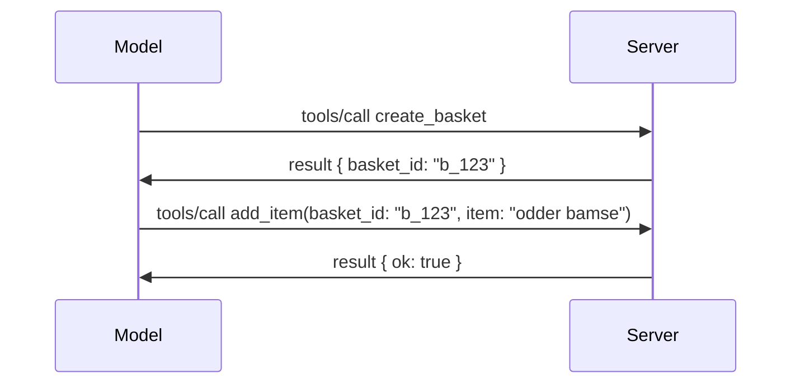

# Hvad er ændret i MCP: Specifikationen 2026-07-28

> **Status:** Endelig. MCP-specifikationen `2026-07-28` blev sendt den 28. juli 2026
> og er den aktuelle protokolrevision. Denne lektion beskriver den endelige
> specifikation. Nogle eksempler i pensum forbliver eksplicit versionerede til
> `2025-11-25`, fordi deres SDK'er endnu ikke har taget den nye statsløse API i brug;
> betragt disse eksempler som vejledning til bagudkompatibilitet.

## Oversigt

`2026-07-28` er den største revision af MCP siden lanceringen. Seks
forslag til forbedring af specifikationen (SEPs) fjerner protokolniveau-sessioner og
gør MCP statsløs på transportlaget, udvidelser bliver et førsteklasses,
versioneret mekanisme, og flere funktioner, der tidligere blev dækket i dette pensum
(Roots, Sampling, Logging) er udfaset under en ny livscykluspolitik. Denne
lektion opsummerer, hvad der er ændret, hvorfor det er vigtigt, og hvad det betyder for kode
skrevet mod `2025-11-25`.

Kilde: [The 2026-07-28 MCP Specification Release Candidate](https://blog.modelcontextprotocol.io/posts/2026-07-28-release-candidate/) (Model Context Protocol Blog, David Soria Parra og Den Delimarsky).

## Læringsmål

Ved slutningen af denne lektion vil du kunne:

- Forklare, hvorfor MCP bevæger sig mod en statsløs protokolkerne, og hvilket problem det løser for horisontalt skalerede implementeringer.
- Beskrive, hvordan `initialize`/`initialized` håndtrykket og `Mcp-Session-Id` headeren erstattes.
- Identificere de nye `Mcp-Method` og `Mcp-Name` headers og `ttlMs`/`cacheScope` cache-metadata.
- Genkende Extensions-rammeværket og de to udvidelser, der følger med denne udgivelse: MCP Apps og Tasks.
- Opsummere autorisationsforstærkningen og udfasningen af Dynamic Client Registration.

- Identificere hvilke kernefunktioner (Roots, Sampling, Logging) nu er udfasede, og hvad det betyder i praksis.
- Forklare ændringen til Full JSON Schema 2020-12 for værktøjs `inputSchema`/`outputSchema`.

## En statsløs protokol

Hovedændringen: MCP bliver statsløs på protokollaget.

### Før (2025-11-25): sessioner binder dig til en serverinstans

At kalde et værktøj over Streamable HTTP starter med et `initialize` håndtryk. Serveren svarer med en `Mcp-Session-Id` header, som alle efterfølgende anmodninger skal have med:

```http
POST /mcp HTTP/1.1
Mcp-Session-Id: 1868a90c-3a3f-4f5b
Content-Type: application/json

{"jsonrpc":"2.0","id":2,"method":"tools/call",
 "params":{"name":"search","arguments":{"q":"otters"}}}
```

Fordi sessionen er bundet til den serverinstans, der udstedte den, kræver horisontalt skalerede installationer **sticky routing** ved load balanceren og en **delt sessionslager** på tværs af instanser.

### Efter (2026-07-28): hver anmodning er selvstændig

```http
POST /mcp HTTP/1.1
MCP-Protocol-Version: 2026-07-28
Mcp-Method: tools/call
Mcp-Name: search
Content-Type: application/json

{"jsonrpc":"2.0","id":1,"method":"tools/call",
 "params":{"name":"search","arguments":{"q":"otters"},
           "_meta":{"io.modelcontextprotocol/protocolVersion":"2026-07-28",
                    "io.modelcontextprotocol/clientInfo":{"name":"my-app","version":"1.0"},
                    "io.modelcontextprotocol/clientCapabilities":{}}}}
```

Enhver serverinstans kan håndtere denne anmodning. Nøgleændringer:

- **`initialize`/`initialized` håndtrykket fjernes** ([SEP-2575](https://github.com/modelcontextprotocol/modelcontextprotocol/pull/2575)). Protokolversion, klientinfo og klientfunktioner flyttes ind i `_meta` på hver anmodning. En ny `server/discover` metode giver en klient mulighed for at hente serverfunktioner på forhånd, når de behøver dem.
- **`Mcp-Session-Id` headeren og protokolniveau-sessionen fjernes** ([SEP-2567](https://github.com/modelcontextprotocol/modelcontextprotocol/pull/2567)). Sticky routing og delte sessionslagre er ikke længere påkrævet på protokollaget.

### Statsløs protokol, tilstandsfulde applikationer

Fjernelse af protokolniveau-sessionen betyder ikke, at din server ikke kan være tilstandsfuld. Det anbefalede mønster er det samme, som HTTP API'er altid har brugt: opret et eksplicit håndtag (en `basket_id`, en `browser_id`) fra et værktøjskald, og lad modellen returnere det håndtag som et almindeligt argument ved senere kald.



Dette gør tilstanden synlig og fornuftig for modellen i stedet for at skjule den i transportmetadata, og det gør det muligt for enhver serverinstans at håndtere ethvert kald.

### Server-til-klient anmodninger, omstruktureret

En statsløs protokol har stadig brug for en måde, hvorpå en server kan bede klienten om noget midt i et kald (for eksempel en eliciteringsprompt):

- **Server-initierede anmodninger må kun udsendes, mens serveren aktivt behandler en klientanmodning** ([SEP-2260](https://github.com/modelcontextprotocol/modelcontextprotocol/pull/2260)) — tidligere en anbefaling, nu et krav. En bruger bliver aldrig spurgt ud af det blå.
- **Multi Round-Trip Requests** ([SEP-2322](https://github.com/modelcontextprotocol/modelcontextprotocol/pull/2322)) erstatter at holde en SSE-stream åben. I stedet returnerer serveren et `InputRequiredResult`:

  ```json
  {
    "resultType": "input_required",
    "inputRequests": {
      "confirm": {
        "type": "elicitation",
        "message": "Delete 3 files?",
        "schema": { "type": "boolean" }
      }
    },
    "requestState": "eyJzdGVwIjoxLCJmaWxlcyI6WyJhIiwiYiIsImMiXX0="
  }
  ```

  Klienten samler svarene og genudfører det oprindelige kald med `inputResponses` plus det ekkoede `requestState`. Enhver serverinstans kan tage genforsøget op, fordi alt nødvendigt er i payloaden.

### Ruterbar, cachebar, sporbar

Tre mindre ændringer gør statsløs trafik lettere at betjene:

- **`Mcp-Method` og `Mcp-Name` headers kræves på Streamable HTTP** ([SEP-2243](https://github.com/modelcontextprotocol/modelcontextprotocol/pull/2243)), så load balancers, gateways og rate limiters kan rute på operationen uden at inspicere JSON-bodyen. Servere afviser anmodninger, hvor headers og body er uoverensstemmende.
- **`tools/list` og resource read resultater bærer `ttlMs` og `cacheScope`** ([SEP-2549](https://github.com/modelcontextprotocol/modelcontextprotocol/pull/2549)), modelleret på HTTP `Cache-Control`. Klienter ved, hvor længe et liste-resultat er friskt, og om det er sikkert at dele på tværs af brugere, uden at skulle have en langlivet SSE-stream for at få viden om ændringer.
- **W3C Trace Context propagation i `_meta` dokumenteres** ([SEP-414](https://github.com/modelcontextprotocol/modelcontextprotocol/pull/414)), hvilket fastlægger `traceparent`, `tracestate` og `baggage` nøgle-navne, så et distribueret trace kan følge et kald på tværs af klient-SDK'en, MCP-serveren og downstream systemer i en backend kompatibel med [OpenTelemetry](https://opentelemetry.io/).

## Udvidelser bliver førsteklasses

Udvidelser eksisterede uformelt i `2025-11-25`. [SEP-2133](https://github.com/modelcontextprotocol/modelcontextprotocol/pull/2133) formaliserer dem:

- Udvidelser identificeres via reverse-DNS IDs.
- De forhandles gennem et `extensions` kort på klient- og serverfunktioner.
- De ligger i egne `ext-*` repositories med delegerede vedligeholdere og versioneres uafhængigt af kernespecifikationen.
- Et nyt Extensions Track i SEP-processen giver dem en vej fra eksperimentel til officiel.

Denne udgivelse leverer to officielle udvidelser.

### MCP Apps: servergenererede brugerflader

[MCP Apps](https://blog.modelcontextprotocol.io/posts/2026-01-26-mcp-apps/) ([SEP-1865](https://github.com/modelcontextprotocol/modelcontextprotocol/pull/1865)) gør det muligt for servere at levere interaktive HTML-interface, som værter render i et sandboxed iframe. Værktøjer deklarerer deres UI-skabeloner på forhånd, så værter kan prefetch, cache og sikkerhedsgodkende dem, før noget kører. Du har allerede dækket det grundlæggende i dette i [Lektion 15: MCP Apps](../03-GettingStarted/15-mcp-apps/README.md) — under Extensions-rammeværket er MCP Apps nu officielt en udvidelse frem for en eksperimentel kernefunktion.

### Tasks bliver en udvidelse

Tasks leveredes som en eksperimentel kernefunktion i `2025-11-25`. Produktionens brug viste behovet for en redesign, så det rigtige hjem er en udvidelse: [Tasks-udvidelsen](https://github.com/modelcontextprotocol/modelcontextprotocol/pull/2663) omformer livscyklussen omkring den statsløse model — en server kan svare `tools/call` med et task-håndtag, og klienten styrer det fremad med `tasks/get`, `tasks/update` og `tasks/cancel`. Oprettelse af opgaver styres af serveren: klienten annoncerer udvidelsen, og serveren beslutter, hvornår et kald skal køre som en opgave. `tasks/list` fjernes helt, fordi det ikke kan scopes sikkert uden sessioner.

> **Migreringsnote:** hvis du implementerede den eksperimentelle `2025-11-25` Tasks API, skal du migrere til den nye udvidelseslivscyklus — den er ikke bagudkompatibel.

## Autorisationsforstærkning

Flere SEPs forstærker
[autorisation specifikationen](https://modelcontextprotocol.io/specification/2026-07-28/basic/authorization)
for bedre at tilpasse sig virkelige OAuth 2.0 / OpenID Connect implementeringer:

| SEP | Ændring |
|---|---|
| [SEP-2468](https://github.com/modelcontextprotocol/modelcontextprotocol/pull/2468) | Klienter skal validere `iss` parameteren på autorisationssvar per [RFC 9207](https://www.rfc-editor.org/rfc/rfc9207), hvilket minimerer mix-up angreb, almindelige i MCP's single-client, many-server mønster. En fremtidig version vil kræve afvisning af svar uden `iss`. |
| [SEP-837](https://github.com/modelcontextprotocol/modelcontextprotocol/pull/837) | Kompatibilitets-klienter til Dynamic Client Registration erklærer deres OpenID Connect `application_type` og undgår forkerte `"web"` standarder for desktop og kommandolinjeklienter. |
| [SEP-2352](https://github.com/modelcontextprotocol/modelcontextprotocol/pull/2352) | Kompatibilitets-registrerede legitimationsoplysninger bindes til den udstedende autorisationsserver's `issuer`; klienter registrerer sig igen, hvis en ressource migrerer. |
| [SEP-2207](https://github.com/modelcontextprotocol/modelcontextprotocol/pull/2207) | Dokumenterer, hvordan man anmoder om refresh tokens fra OpenID Connect-stil autorisationsservere. |
| [SEP-2350](https://github.com/modelcontextprotocol/modelcontextprotocol/pull/2350) | Klargør omfangsakkumulering under step-up autorisation. |
| [SEP-2351](https://github.com/modelcontextprotocol/modelcontextprotocol/pull/2351) | Klargør `.well-known` discovery-suffiks. |

Hvis du bygger en autorisationsserver til MCP, skal du sende `iss` på
autorisationssvar og følge den endelige autorisationsspecifikation. Se
[02-Sikkerhed](../02-Security/README.md) for implementeringsvejledning.

Dynamic Client Registration er stadig tilgængelig for kompatibilitet men er også
udfaset i `2026-07-28`. Nye implementeringer bør bruge Client ID Metadata
Dokumenter.

## Udfasede funktioner

Under den nye
[funktion-livscykluspolitik](https://github.com/modelcontextprotocol/modelcontextprotocol/pull/2577),
er Roots, Sampling, Logging og Dynamic Client Registration **udfasede**:

| Funktion | Anbefalet erstatning |
|---|---|
| Roots | Værktøjsparametre, ressource-URI'er eller serverkonfiguration |
| Sampling | Direkte integration med LLM-leverandør-API'er |
| Logging | `stderr` for stdio-transport; OpenTelemetry for strukturerbar observabilitet |
| Dynamic Client Registration | Client ID Metadata Dokumenter |

Disse funktioner forbliver i `2026-07-28` for kompatibilitet. De er berettigede til
fjernelse i den første specifikationsrevision, der udgives på eller efter den 28. juli 2027;
faktisk fjernelse kan ske senere. Nye implementeringer bør bruge de
ovennævnte erstatningsmønstre.

## Fuldt JSON Schema 2020-12 for værktøjer

Værktøjs `inputSchema` og `outputSchema` løftes til fuldt [JSON Schema 2020-12](https://json-schema.org/draft/2020-12) ([SEP-2106](https://github.com/modelcontextprotocol/modelcontextprotocol/pull/2106)):

- Input-schemaer bevarer rodkontrainten `type: "object"`, men tillader nu komposition (`oneOf`, `anyOf`, `allOf`), conditionals og referencer (`$ref`, `$defs`).
- Output-schemaer er ubegrænsede, og `structuredContent` kan nu være enhver JSON-værdi og ikke kun et objekt.
- Implementeringer må ikke automatisk afreference eksterne `$ref` URLs og bør begrænse schemas dybde og valideringstid (en denial-of-service overvejelse, hvis du validerer schemas på serversiden).

Separat ændres fejlkoden for en manglende ressource fra MCP-specifikke `-32002` til JSON-RPC standarden `-32602` (Invalid Params) ([SEP-2164](https://github.com/modelcontextprotocol/modelcontextprotocol/pull/2164)). Hvis din klient matcher på den præcise værdi `-32002`, skal du opdatere den.

## Hvordan protokollen udvikler sig herfra

Denne udgivelse indeholder brydende ændringer, som MCP-vedligeholderne ikke forventer bliver normen fremover. Tre styrings-SEPs sigter mod at forhindre gentagelser:

- Den **funktion-livscykluspolitik** giver hver funktion en Aktiv → Udfaset → Fjernet vej med mindst tolv måneder mellem udfasning og den tidligst mulige fjernelse.
- Det **Extensions-rammeværk** lader nye funktioner blive leveret som frivillige udvidelser og stabilisere sig dér, før de (hvis nogensinde) flyttes ind i kernespecifikationen.
- En Standards Track SEP kan ikke længere opnå Endelig status, før et matchende scenarie lander i [conformance suite](https://github.com/modelcontextprotocol/conformance) ([SEP-2484](https://github.com/modelcontextprotocol/modelcontextprotocol/pull/2484)) — den samme suite, som [SDK tier systemet](https://github.com/modelcontextprotocol/modelcontextprotocol/pull/1777) scorer officielle SDK'er imod.

## Udgivelses-tidslinje og validering

- Release candidate var låst den 21. maj 2026.
- Den endelige specifikation blev sendt den 28. juli 2026.

- SDK-support kan være bagefter specifikationen. Tjek
  [SDK-dokumentationen](https://modelcontextprotocol.io/docs/sdk) og SDK'ens
  udgivelsesnoter, før du migrerer et eksempel.
- Følg de endelige ændringer i
  [2026-07-28 specifikationen](https://modelcontextprotocol.io/specification/2026-07-28/)
  og dens
  [ændringslog](https://modelcontextprotocol.io/specification/2026-07-28/changelog).

## Hvad dette betyder for dette pensum

Pensum går fra `2025-11-25` eksempler til den aktuelle
`2026-07-28` specifikation. Konkret:

- **Sessions og `initialize` håndtrykket** i eksempler, der eksplicit målretter
  `2025-11-25`, er gammel adfærd. `2026-07-28` protokollen erstatter dem
  med den ovenstående statsløse forespørgselsmodel.
- **Sampling og Roots** er fortsat tilgængelige for kompatibilitet, men er forældede.
  Nye designs bør bruge de erstatningsmønstre, der er nævnt ovenfor.
- **Den eksperimentelle Tasks-funktion**, hvis du har brugt den, skal migreres til Tasks-udvidelsens nye livscyklus.
- **MCP Apps** ([Lesson 15](../03-GettingStarted/15-mcp-apps/README.md)) er i praksis upåvirket; de flyttes blot under det formelle Extensions-rammeværk.

## Yderligere ressourcer

- [MCP Specifikation 2026-07-28](https://modelcontextprotocol.io/specification/2026-07-28/)
- [2026-07-28 Ændringslog](https://modelcontextprotocol.io/specification/2026-07-28/changelog)
- [2026-07-28 MCP Specifikation Release Candidate (historisk blogindlæg)](https://blog.modelcontextprotocol.io/posts/2026-07-28-release-candidate/)
- [Fremtiden for MCP Transports](https://blog.modelcontextprotocol.io/posts/2025-12-19-mcp-transport-future/)
- [SEP Retningslinjer](https://modelcontextprotocol.io/community/sep-guidelines)
- [MCP SDK Tier System](https://modelcontextprotocol.io/docs/sdk)

## Næste trin

Gå tilbage til [Kernebegreber](./README.md) eller fortsæt til
[Sikkerhed](../02-Security/README.md) for at anvende den aktuelle `2026-07-28` vejledning.

---

<!-- CO-OP TRANSLATOR DISCLAIMER START -->
**Ansvarsfraskrivelse**:
Dette dokument er blevet oversat ved hjælp af AI-oversættelsestjenesten [Co-op Translator](https://github.com/Azure/co-op-translator). Selvom vi bestræber os på nøjagtighed, skal du være opmærksom på, at automatiserede oversættelser kan indeholde fejl eller unøjagtigheder. Det originale dokument på dets oprindelige sprog bør betragtes som den autoritative kilde. For kritisk information anbefales professionel menneskelig oversættelse. Vi påtager os intet ansvar for misforståelser eller fejltolkninger, der opstår som følge af brugen af denne oversættelse.
<!-- CO-OP TRANSLATOR DISCLAIMER END -->