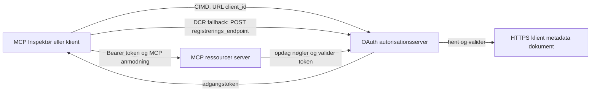

# CIMD og DCR Autorisations Eksempel

Dette TypeScript-eksempel sammenligner to måder, hvorpå en OAuth-klient kan opnå en identitet
før adgang til en beskyttet MCP-server:

- **Client ID Metadata Documents (CIMD)** bruger en stabil HTTPS-URL som
  `client_id`. Dette er den foretrukne mekanisme for klienter og autorisations-
  servere, der ikke har en forud eksisterende relation.
- **Dynamic Client Registration (DCR)** beder autorisationsserveren om at oprette
  en uigennemsigtig client ID under kørslen. MCP `2026-07-28` bevarer DCR kun af
  bagudkompatibilitetsårsager.

Eksemplet bruger den stabile MCP TypeScript SDK v2 og den statsløse
MCP `2026-07-28` forespørgsmålsmodel. Det virker med en ekstern OAuth 2.1/OpenID
Connect autorisationsserver som Auth0. MCP-serveren er en resource-
server: den validerer adgangstokener, men godkender ikke brugere eller udsteder
tokens.

## Læringsmål

Ved at gennemføre dette eksempel vil du kunne:

- Forklare hvorfor CIMD foretrækkes fremfor DCR for nye MCP-klienter.
- Publicere et gyldigt CIMD-dokument for en offentlig native klient.
- Konfigurere en MCP resource-server til OAuth-discovery og JWT-validering.
- Afprøve CIMD og DCR med samme MCP-server og autorisationsserver.
- Håndhæve en OAuth-omfang indeni et MCP-værktøj.
- Identificere hvilke ansvarsområder der tilhører klienten, resource-serveren og
  autorisationsserveren.

## Arkitektur



Autorisationsserveren vælger og validerer registreringsmekanismen.
MCP-serveren ser kun det resulterende verificerede `client_id` claim. En HTTPS-URL
med en sti identificerer CIMD. En uigennemsigtig ID er ikke nok til at bevise DCR, fordi en
forudregistreret klient også kan bruge en uigennemsigtig ID; den valgfrie
`DCR_CLIENT_ID_PREFIX` indstilling leverer et leverandørspecifikt demohint.

## Registreringsprioritet

MCP-klienter, der understøtter alle mekanismer, bør bruge denne rækkefølge:

1. Brug forudregistreret klientinformation, når det allerede er tilgængeligt.
2. Brug CIMD, når autorisationsserveren annoncerer
   `client_id_metadata_document_supported: true`.
3. Brug DCR kun som fallback, når serveren annoncerer en
   `registration_endpoint`.
4. Spørg brugeren om forudregistreret klientinformation, når ingen af ovenstående er
   tilgængelige.

## Projektlayout

```text
src/
  config.ts          Environment validation
  dcr.ts             DCR compatibility request
  mcp.ts             MCP tools and scope checks
  oauth.ts           Authorization metadata and JWT verification
  register-dcr.ts    DCR command-line helper
  registration.ts    CIMD document and mechanism classification
  server.ts          Express, OAuth discovery, and MCP endpoint
test/
  dcr.test.ts
  oauth.test.ts
  registration.test.ts
  server.test.ts
```

## Forudsætninger

- Node.js 20.6 eller nyere. Script bruger `--env-file` og `--import`.
- En OAuth 2.1/OpenID Connect autorisationsserver, der understøtter:
  - Autorisationskode-flow med S256 PKCE.
  - OAuth Protected Resource Metadata og Resource Indicators.
  - JWT adgangstokener og en JWKS-endpoint.
  - CIMD, plus DCR, hvis du vil sammenligne det ældre fallback.
- MCP Inspector eller en anden MCP `2026-07-28` klient.
- En offentlig HTTPS-URL for CIMD-dokumentet. En udviklingstunnel er egnet
  til labben; brug et stabilt domæne i produktion.

## Installér og test

```bash
npm install
npm run build
npm test
```

De tolv tests bruger lokale nøgler og simulerede HTTP-endpoints. De kræver ikke en
konto på autorisationsserveren. De verificerer:

- CIMD dokumentform og URL-begrænsninger.
- Ærlig klassifikation af URL og uigennemsigtige client IDs.
- Håndtering af DCR-forespørgsler og svar.
- Afvisning af usikre ikke-loopback DCR endpoints.
- JWT signatur, issuer, audience, udløb, client ID og omfangsvalidering.
- Et in-process MCP `2026-07-28` kald til `registration-info`.

## Konfigurer autorisationsserveren

De nøjagtige kontrollnavne varierer efter leverandør. Konfigurer disse funktioner:

1. Opret en API eller resource-server, hvis identifikator præcist matcher din MCP
   URL, inklusive `/mcp`, for eksempel `http://127.0.0.1:3001/mcp`.
2. Brug RS256 adgangstokener og inkluder et `client_id` eller `azp` claim.
3. Tilføj `tool:greet` tilladelse eller omfang.
4. Aktivér autorisationskode-flow med S256 PKCE for offentlige native klienter.
5. Aktivér Client ID Metadata Documents.
6. Kun for sammenligningen, aktivér Dynamic Client Registration.
7. Sørg for at autorisationsserverens metadata annoncerer:
   - `issuer`
   - `authorization_endpoint`
   - `token_endpoint`
   - `jwks_uri`
   - `client_id_metadata_document_supported: true`
   - `registration_endpoint` når DCR er aktiveret

### Eksempel med Auth0

For Auth0, aktiver Client ID Metadata Document Registration, OIDC Dynamic
Application Registration, og Resource Parameter kompatibilitet. Opret en API,
hvis identifikator er den præcise MCP URL, og tilføj tilladelsen `tool:greet`.
Tillad testbrugeren og tredjepartsklienter at anmode om den tilladelse.

Leverandørernes dashboards og funktioners tilgængelighed ændres over tid. Tjek
leverandørdokumentationen, før du anvender disse indstillinger uden for denne lab.

## Konfigurer eksemplet

Opret `.env` fra eksemplet:

```powershell
Copy-Item .env.example .env
```

På bash-kompatible shells:

```bash
cp .env.example .env
```

Indstil disse værdier:

```dotenv
MCP_SERVER_URL=http://127.0.0.1:3001/mcp
AUTHORIZATION_SERVER_ISSUER=https://your-tenant.example.com/
AUTHORIZATION_SERVER_METADATA_URL=https://your-tenant.example.com/.well-known/openid-configuration
CLIENT_METADATA_URL=https://your-public-host.example.com/client-metadata.json
OAUTH_REDIRECT_URIS=http://127.0.0.1:6274/oauth/callback
DCR_CLIENT_ID_PREFIX=tpc_
```

Vigtige detaljer:

- `AUTHORIZATION_SERVER_ISSUER` skal præcist matche `issuer` i den opdagede
  autorisationsservermetadata, inklusive eventuel efterfølgende skråstreg.
- `MCP_SERVER_URL` skal matche adgangstokenets audience.
- `CLIENT_METADATA_URL` skal bruge HTTPS, indeholde en ikke-rodbaseret sti, og være
  den offentlige URL, der serverer metadata-ruten. Forespørgselsstrenge og fragmenter afvises,
  så ruten og `client_id` forbliver identiske.
- `OAUTH_REDIRECT_URIS` er en kommasepareret whitelist. Standard er MCP
  Inspector loopback callback.
- `DCR_CLIENT_ID_PREFIX` er valgfri og leverandørspecifik. Lad den være tom når
  din leverandør ikke har et pålideligt DCR-præfiks.

## Publicer CIMD-dokumentet

Start en tunnel, der videresender sin offentlige HTTPS-ursprung til `127.0.0.1:3001`.
Sæt `CLIENT_METADATA_URL` til den origin plus `/client-metadata.json`, og kør derefter:

```bash
npm run build
npm start
```

Verificer begge discovery-dokumenter:

```bash
curl http://127.0.0.1:3001/health
curl http://127.0.0.1:3001/client-metadata.json
curl http://127.0.0.1:3001/.well-known/oauth-protected-resource/mcp
```

Den `client_id`, som returneres af den offentlige HTTPS-metadata-URL, skal være byte-for-byte
identisk med den URL. Autorisationsserveren skal validere dokumentet og
dets redirect URI før udstedelse af token.

> [!NOTE]
> Eksemplet hoster klientdokumentet og MCP resource-serveren i én proces
> for at holde labben lille. I produktion ejer og hoster MCP-klienten sit CIMD
> dokument uafhængigt af resource-serveren.

## Sammenlign CIMD og DCR

Start MCP Inspector:

```bash
npx @modelcontextprotocol/inspector
```

Brug Streamable HTTP og forbind til `http://127.0.0.1:3001/mcp`.

### CIMD (Foretrukket)

1. Indtast den offentlige `CLIENT_METADATA_URL` som OAuth Client ID.
2. Anmod om `tool:greet` plus ethvert identitetsomfang, som din leverandør kræver.
3. Fuldfør login og samtykke.
4. Kald `registration-info`. Den rapporterer `mechanism: "cimd"`.
5. Kald `greet` for at verificere håndhævelsen af omfang.

### DCR (Fallback for kompatibilitet)

1. Ryd Inspectors gemte OAuth-tilstand.
2. Lad OAuth Client ID være tom, så Inspector kan bruge den annoncerede
   `registration_endpoint`.
3. Fuldfør login og samtykke.
4. Kald `registration-info`.
5. Hvis `DCR_CLIENT_ID_PREFIX` matcher leverandørens genererede IDs, rapporterer værktøjet
   `mechanism: "dcr"`; ellers rapporterer det korrekt
   `opaque-client-id`.

Du kan også demonstrere registreringsforespørgslen direkte:

```bash
npm run build
npm run register:dcr
```

Hjælperen printer den returnerede client ID men printer aldrig en client secret.
Behandl enhver returneret secret som følsom og gem den i et ordentligt hemmeligt lager.

## Værktøjer

| Værktøj | Krævet omfang | Formål |
| --- | --- | --- |
| `registration-info` | Verificeret klient | Rapportér client ID typen |
| `greet` | `tool:greet` | Demonstrér autorisation per værktøj |

## Sikkerhedsnoter

- Validér JWT-signaturer via autorisationsserverens JWKS endpoint.
- Kræv præcis match på issuer og audience.
- Kræv expiration og client ID claims.
- Accepter aldrig en token udstedt til en anden resource.
- Videregiv aldrig MCP-tokenet til en downstream API.
- Bind DCR credentials til issuer, som oprettede dem.
- Validér CIMD redirect URIs med præcist match.
- Anvend SSRF-kontroller når en autorisationsserver henter CIMD-URLs.
- Brug HTTPS for autorisations- og metadata endpoints udenfor loopback
  udvikling.
- Antag ikke DCR ud fra en uigennemsigtig client ID, medmindre leverandøren dokumenterer en
  pålidelig identifikator-konvention.

## Referencer

- [MCP autorisationsspecifikation](https://modelcontextprotocol.io/specification/2026-07-28/basic/authorization)
- [MCP klientregistrering](https://modelcontextprotocol.io/specification/2026-07-28/basic/authorization/client-registration)
- [MCP sikkerheds bedste praksis](https://modelcontextprotocol.io/specification/2026-07-28/basic/security_best_practices)
- [MCP TypeScript SDK v2's autorisationsguide](https://ts.sdk.modelcontextprotocol.io/v2/serving/authorization)
- [OAuth Dynamic Client Registration (RFC 7591)](https://datatracker.ietf.org/doc/html/rfc7591)
- [OAuth Client ID Metadata Document draft](https://datatracker.ietf.org/doc/html/draft-ietf-oauth-client-id-metadata-document-00)

## Anerkendelse

Den side-om-side undervisningstilgang var inspireret af
[Sambego/auth0-xmcp-cimd](https://github.com/Sambego/auth0-xmcp-cimd). Dette
eksempel er en original, leverandørneutral implementering bygget med den officielle
MCP TypeScript SDK v2 til dette læseplan.

---

<!-- CO-OP TRANSLATOR DISCLAIMER START -->
**Ansvarsfraskrivelse**:
Dette dokument er blevet oversat ved hjælp af AI-oversættelsestjenesten [Co-op Translator](https://github.com/Azure/co-op-translator). Selvom vi bestræber os på nøjagtighed, skal du være opmærksom på, at automatiserede oversættelser kan indeholde fejl eller unøjagtigheder. Det originale dokument på dets oprindelige sprog bør betragtes som den autoritative kilde. For kritisk information anbefales professionel menneskelig oversættelse. Vi påtager os intet ansvar for misforståelser eller fejltolkninger, der opstår som følge af brugen af denne oversættelse.
<!-- CO-OP TRANSLATOR DISCLAIMER END -->