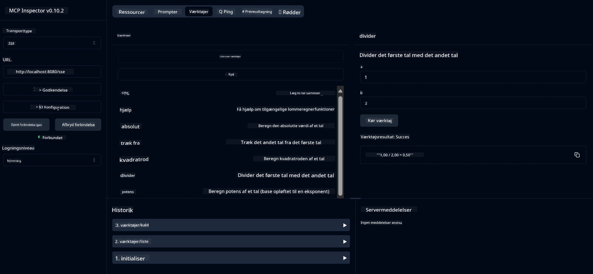

# Grundlæggende lommeregner MCP-tjeneste

> [!NOTE]
> Denne Java-løsning bruger den ældre HTTP+SSE-transport og retter sig mod et SDK
> kompatibelt med MCP `2025-11-25`. Den bevares for at matche kursuskoden;
> nye fjernservere bør anvende `2026-07-28` Streamable HTTP-understøttelse.

Denne tjeneste leverer grundlæggende lommeregneroperationer gennem Model Context Protocol (MCP) ved brug af Spring Boot med WebFlux-transport. Den er designet som et enkelt eksempel for begyndere, der lærer om MCP-implementeringer.

For flere oplysninger, se [MCP Server Boot Starter](https://docs.spring.io/spring-ai/reference/api/mcp/mcp-server-boot-starter-docs.html) reference-dokumentationen.


## Brug af tjenesten

Tjenesten tilbyder følgende API-endpoints via MCP-protokollen:

- `add(a, b)`: Læg to tal sammen
- `subtract(a, b)`: Træk det andet tal fra det første
- `multiply(a, b)`: Ganger to tal
- `divide(a, b)`: Divider det første tal med det andet (med nul-tjek)
- `power(base, exponent)`: Beregn en tals potens
- `squareRoot(number)`: Beregn kvadratroden (med tjek for negative tal)
- `modulus(a, b)`: Beregn resten ved division
- `absolute(number)`: Beregn den absolutte værdi

## Afhængigheder

Projektet kræver følgende nøgle-afhængigheder:

```xml
<dependency>
    <groupId>org.springframework.ai</groupId>
    <artifactId>spring-ai-starter-mcp-server-webflux</artifactId>
</dependency>
```

## Byg projektet

Byg projektet ved hjælp af Maven:
```bash
./mvnw clean install -DskipTests
```

## Kør serveren

### Brug af Java

```bash
java -jar target/calculator-server-0.0.1-SNAPSHOT.jar
```

### Brug af MCP Inspector

MCP Inspector er et nyttigt værktøj til at interagere med MCP-tjenester. For at bruge det med denne lommeregner-tjeneste:

1. **Installer og kør MCP Inspector** i et nyt terminalvindue:
   ```bash
   npx @modelcontextprotocol/inspector
   ```

2. **Åbn web-UI** ved at klikke på URL'en vist af appen (typisk http://localhost:6274)

3. **Konfigurer forbindelsen**:
   - Sæt transporttypen til "SSE"
   - Sæt URL'en til din kørende servers SSE-endpoint: `http://localhost:8080/sse`
   - Klik på "Connect"

4. **Brug værktøjerne**:
   - Klik på "List Tools" for at se tilgængelige lommeregnerfunktioner
   - Vælg et værktøj og klik "Run Tool" for at udføre en operation



---

<!-- CO-OP TRANSLATOR DISCLAIMER START -->
**Ansvarsfraskrivelse**:
Dette dokument er blevet oversat ved hjælp af AI-oversættelsestjenesten [Co-op Translator](https://github.com/Azure/co-op-translator). Selvom vi bestræber os på nøjagtighed, skal du være opmærksom på, at automatiserede oversættelser kan indeholde fejl eller unøjagtigheder. Det originale dokument på dets oprindelige sprog bør betragtes som den autoritative kilde. For kritisk information anbefales professionel menneskelig oversættelse. Vi påtager os intet ansvar for misforståelser eller fejltolkninger, der opstår som følge af brugen af denne oversættelse.
<!-- CO-OP TRANSLATOR DISCLAIMER END -->