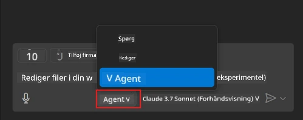
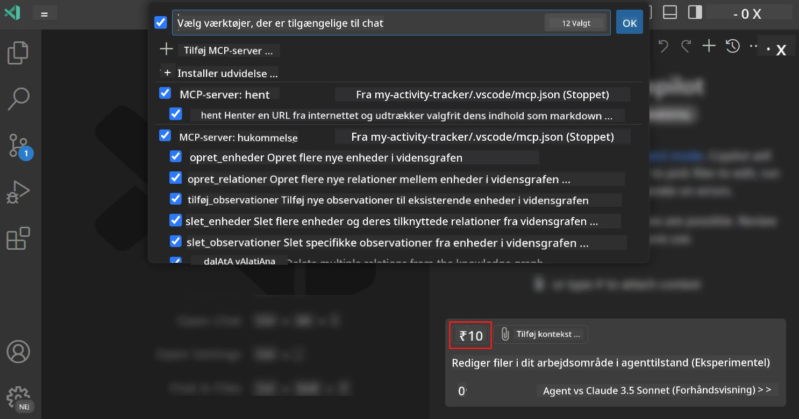
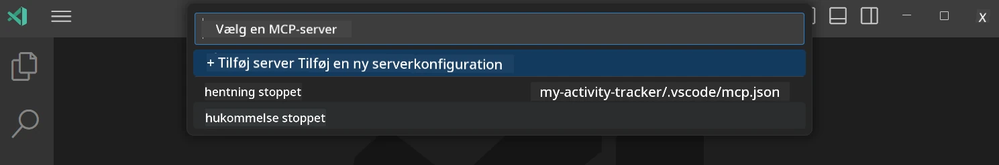
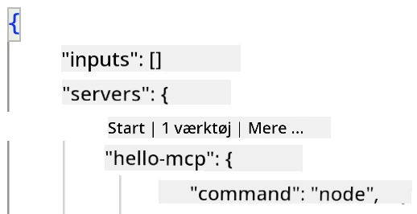
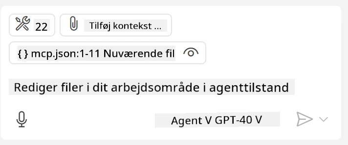
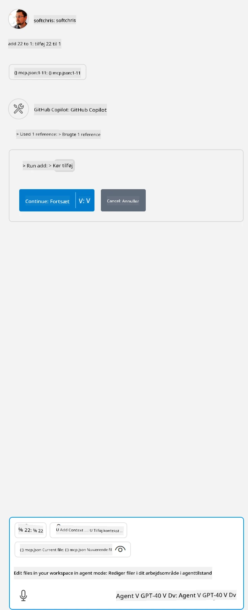

# Forbruge en server fra GitHub Copilot Agent-tilstand

Visual Studio Code og GitHub Copilot kan fungere som en klient og forbruge en MCP Server. Hvorfor skulle vi ønske at gøre det, kunne du spørge? Nå, det betyder, at hvilke som helst funktioner MCP Serveren har, nu kan bruges fra inden for din IDE. Forestil dig for eksempel at tilføje GitHubs MCP-server, det ville tillade at styre GitHub via prompts frem for at skrive specifikke kommandoer i terminalen. Eller forestil dig generelt noget, der kunne forbedre din udvikleroplevelse, alt styret via naturligt sprog. Nu begynder du at se fordelen, ikke?

## Oversigt

Denne lektion dækker, hvordan man bruger Visual Studio Code og GitHub Copilot's Agent-tilstand som en klient for din MCP Server.

## Læringsmål

Når du er færdig med denne lektion, vil du kunne:

- Forbruge en MCP Server via Visual Studio Code.
- Køre funktioner som værktøjer via GitHub Copilot.
- Konfigurere Visual Studio Code til at finde og administrere din MCP Server.

## Brug

Du kan kontrollere din MCP server på to forskellige måder:

- Brugergrænseflade, du vil se, hvordan dette gøres senere i dette kapitel.
- Terminal, det er muligt at styre ting fra terminalen ved brug af `code` eksekverbaren:

  For at tilføje en MCP server til din brugerprofil, brug --add-mcp kommandolinjeoptionen, og giv JSON serverkonfigurationen i formen {\"name\":\"server-navn\",\"command\":...}.

  ```
  code --add-mcp "{\"name\":\"my-server\",\"command\": \"uvx\",\"args\": [\"mcp-server-fetch\"]}"
  ```

### Skærmbilleder





Lad os tale mere om, hvordan vi bruger den visuelle grænseflade i de næste afsnit.

## Fremgangsmåde

Her er hvordan vi skal gribe dette an på højt niveau:

- Konfigurer en fil til at finde vores MCP Server.
- Start/tilslut til nævnte server for at få den til at liste sine funktioner.
- Brug de nævnte funktioner gennem GitHub Copilot Chat-grænsefladen.

Fint, nu hvor vi forstår flowet, lad os prøve at bruge en MCP Server via Visual Studio Code gennem en øvelse.

## Øvelse: Forbruge en server

I denne øvelse vil vi konfigurere Visual Studio Code til at finde din MCP server, så den kan bruges fra GitHub Copilot Chat-grænsefladen.

### -0- Forberedelse, aktiver MCP Server opdage

Du skal muligvis aktivere opdagelse af MCP Servere.

1. Gå til `File -> Preferences -> Settings` i Visual Studio Code.

1. Søg efter "MCP" og aktiver `chat.mcp.discovery.enabled` i settings.json filen.

### -1- Opret konfigurationsfil

Start med at oprette en konfigurationsfil i din projektrod, du får brug for en fil kaldet MCP.json og placere den i en mappe kaldet .vscode. Den skal se sådan ud:

```text
.vscode
|-- mcp.json
```

Lad os nu se, hvordan vi kan tilføje en serverpost.

### -2- Konfigurer en server

Tilføj følgende indhold til *mcp.json*:

```json
{
    "inputs": [],
    "servers": {
       "hello-mcp": {
           "command": "node",
           "args": [
               "build/index.js"
           ]
       }
    }
}
```

Ovenfor er et simpelt eksempel på, hvordan man starter en server skrevet i Node.js, for andre runtime-miljøer angiv den korrekte kommando for at starte serveren ved brug af `command` og `args`.

### -3- Start serveren

Nu hvor du har tilføjet en post, lad os starte serveren:

1. Find din post i *mcp.json* og sørg for at finde "play"-ikonet:

    

1. Klik på "play"-ikonet, du burde se værktøjsikonet i GitHub Copilot Chat øge antallet af tilgængelige værktøjer. Hvis du klikker på nævnte værktøjsikon, vil du se en liste over registrerede værktøjer. Du kan tjekke/afmarkere hvert værktøj afhængigt af, om du vil have GitHub Copilot til at bruge dem som kontekst:

  

1. For at køre et værktøj, skriv en prompt, som du ved vil matche beskrivelsen af et af dine værktøjer, for eksempel en prompt som "add 22 to 1":

  

  Du burde se et svar, der siger 23.

## Opgave

Prøv at tilføje en serverpost til din *mcp.json* fil og sikr dig, at du kan starte/stoppe serveren. Sørg også for, at du kan kommunikere med værktøjerne på din server via GitHub Copilot Chat-grænsefladen.

## Løsning

[Løsning](./solution/README.md)

## Centrale pointer

De vigtigste pointer fra dette kapitel er følgende:

- Visual Studio Code er en fremragende klient, der lader dig forbruge flere MCP Servere og deres værktøjer.
- GitHub Copilot Chat-grænsefladen er hvordan du interagerer med serverne.
- Du kan spørge brugeren om input som API-nøgler, der kan videregives til MCP Serveren, når du konfigurerer serverposten i *mcp.json* filen.

## Eksempler

- [Java Calculator](../samples/java/calculator/README.md)
- [.Net Calculator](../../../../03-GettingStarted/samples/csharp)
- [JavaScript Calculator](../samples/javascript/README.md)
- [TypeScript Calculator](../samples/typescript/README.md)
- [Python Calculator](../../../../03-GettingStarted/samples/python)

## Yderligere ressourcer

- [Visual Studio docs](https://code.visualstudio.com/docs/copilot/chat/mcp-servers)

## Hvad er næste skridt

- Næste: [Oprettelse af en stdio Server](../05-stdio-server/README.md)

---

<!-- CO-OP TRANSLATOR DISCLAIMER START -->
**Ansvarsfraskrivelse**:
Dette dokument er blevet oversat ved hjælp af AI-oversættelsestjenesten [Co-op Translator](https://github.com/Azure/co-op-translator). Selvom vi bestræber os på nøjagtighed, skal du være opmærksom på, at automatiserede oversættelser kan indeholde fejl eller unøjagtigheder. Det originale dokument på dets oprindelige sprog bør betragtes som den autoritative kilde. For kritisk information anbefales professionel menneskelig oversættelse. Vi påtager os intet ansvar for misforståelser eller fejltolkninger, der opstår som følge af brugen af denne oversættelse.
<!-- CO-OP TRANSLATOR DISCLAIMER END -->