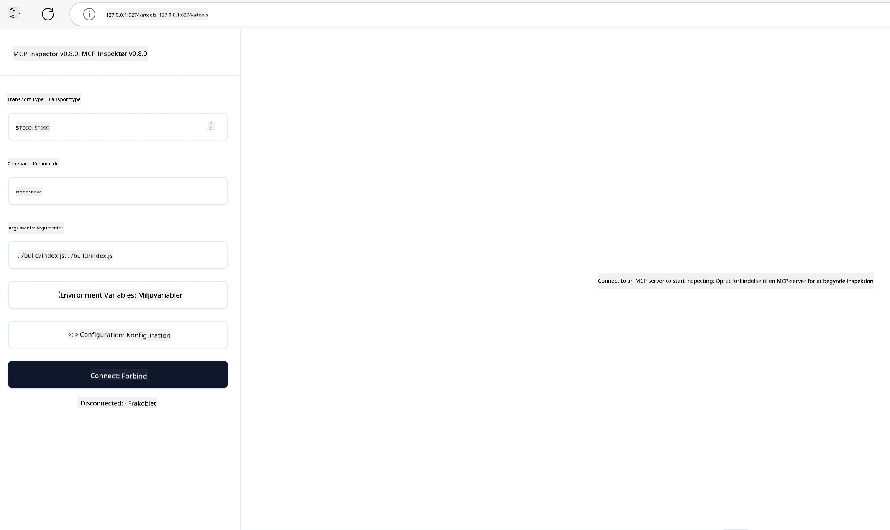

## Testning og fejlfinding

Før du begynder at teste din MCP-server, er det vigtigt at forstå de tilgængelige værktøjer og bedste praksis for fejlfinding. Effektiv testning sikrer, at din server opfører sig som forventet og hjælper dig med hurtigt at identificere og løse problemer. Følgende afsnit skitserer anbefalede metoder til validering af din MCP-implementering.

## Oversigt

Denne lektion dækker, hvordan du vælger den rette testmetode og det mest effektive testværktøj.

## Læringsmål

Når du har gennemført denne lektion, vil du kunne:

- Beskrive forskellige tilgange til testning.
- Bruge forskellige værktøjer til effektivt at teste din kode.


## Testning af MCP-servere

MCP tilbyder værktøjer til at hjælpe dig med at teste og fejlsøge dine servere:

- **MCP Inspector**: Et kommandolinjeværktøj, der kan køres både som CLI-værktøj og som et visuelt værktøj.
- **Manuel testning**: Du kan bruge et værktøj som curl til at køre web-forespørgsler, men ethvert værktøj, der kan køre HTTP, vil gøre det.
- **Unit testing**: Det er muligt at bruge dit foretrukne testframework til at teste funktionerne i både server og klient.

### Brug af MCP Inspector

Vi har beskrevet brugen af dette værktøj i tidligere lektioner, men lad os tale lidt om det på et overordnet niveau. Det er et værktøj bygget i Node.js, og du kan bruge det ved at kalde den `npx` eksekverbare fil, som vil downloade og installere værktøjet midlertidigt og rydde op, når det er færdigt med at køre din forespørgsel.

[MCP Inspector](https://github.com/modelcontextprotocol/inspector) hjælper dig med:

- **Opdagelse af server-kapaciteter**: Automatisk at opdage tilgængelige ressourcer, værktøjer og prompts
- **Test af værktøjsudførelse**: Prøv forskellige parametre og se svar i realtid
- **Visning af servermetadata**: Undersøg serverinfo, skemaer og konfigurationer

En typisk kørsel af værktøjet ser således ud:

```bash
npx @modelcontextprotocol/inspector node build/index.js
```

Ovenstående kommando starter en MCP og dets visuelle interface og åbner en lokal webgrænseflade i din browser. Du kan forvente at se et dashboard, der viser dine registrerede MCP-servere, deres tilgængelige værktøjer, ressourcer og prompts. Interfacet giver dig mulighed for interaktivt at teste værktøjsudførelse, inspicere servermetadata og se svar i realtid, hvilket gør det nemmere at validere og fejlsøge dine MCP-serverimplementeringer.

Sådan kan det se ud: 

Du kan også køre dette værktøj i CLI-tilstand, hvor du tilføjer attributten `--cli`. Her er et eksempel på at køre værktøjet i "CLI"-tilstand, som viser alle værktøjerne på serveren:

```sh
npx @modelcontextprotocol/inspector --cli node build/index.js --method tools/list
```

### Manuel testning

Ud over at køre inspectortool'et til at teste serverkapaciteter, er en anden lignende tilgang at køre en klient, der kan bruge HTTP, som for eksempel curl.

Med curl kan du teste MCP-servere direkte ved hjælp af HTTP-forespørgsler:

```bash
# Eksempel: Test server metadata
curl http://localhost:3000/v1/metadata

# Eksempel: Udfør et værktøj
curl -X POST http://localhost:3000/v1/tools/execute \
  -H "Content-Type: application/json" \
  -d '{"name": "calculator", "parameters": {"expression": "2+2"}}'
```

Som du kan se fra ovenstående brug af curl, bruger du en POST-forespørgsel til at påkalde et værktøj ved hjælp af en belastning bestående af værktøjets navn og dets parametre. Brug den tilgang, der passer dig bedst. CLI-værktøjer har generelt tendens til at være hurtigere at bruge og egner sig til at blive scripted, hvilket kan være nyttigt i et CI/CD-miljø.

### Unit testing

Opret enhedstest for dine værktøjer og ressourcer for at sikre, at de fungerer som forventet. Her er noget eksempelkode til testning.

```python
import pytest

from mcp.server.fastmcp import FastMCP
from mcp.shared.memory import (
    create_connected_server_and_client_session as create_session,
)

# Marker hele modulet for asynkrone tests
pytestmark = pytest.mark.anyio


async def test_list_tools_cursor_parameter():
    """Test that the cursor parameter is accepted for list_tools.

    Note: FastMCP doesn't currently implement pagination, so this test
    only verifies that the cursor parameter is accepted by the client.
    """

 server = FastMCP("test")

    # Opret et par testværktøjer
    @server.tool(name="test_tool_1")
    async def test_tool_1() -> str:
        """First test tool"""
        return "Result 1"

    @server.tool(name="test_tool_2")
    async def test_tool_2() -> str:
        """Second test tool"""
        return "Result 2"

    async with create_session(server._mcp_server) as client_session:
        # Test uden cursor-parameter (udeladt)
        result1 = await client_session.list_tools()
        assert len(result1.tools) == 2

        # Test med cursor=None
        result2 = await client_session.list_tools(cursor=None)
        assert len(result2.tools) == 2

        # Test med cursor som streng
        result3 = await client_session.list_tools(cursor="some_cursor_value")
        assert len(result3.tools) == 2

        # Test med tom streng som cursor
        result4 = await client_session.list_tools(cursor="")
        assert len(result4.tools) == 2
    
```

Den forrige kode gør følgende:

- Udnytter pytest-frameworket, som lader dig oprette test som funktioner og bruge assert-sætninger.
- Opretter en MCP-server med to forskellige værktøjer.
- Bruger `assert`-sætningen til at kontrollere, at visse betingelser er opfyldt.

Tag et kig på [den fulde fil her](https://github.com/modelcontextprotocol/python-sdk/blob/main/tests/client/test_list_methods_cursor.py)

Med den ovenstående fil kan du teste din egen server for at sikre, at kapaciteter oprettes som de skal.

Alle større SDK'er har lignende testsektioner, så du kan tilpasse til dit valgte runtime.

## Eksempler

- [Java Calculator](../samples/java/calculator/README.md)
- [.Net Calculator](../../../../03-GettingStarted/samples/csharp)
- [JavaScript Calculator](../samples/javascript/README.md)
- [TypeScript Calculator](../samples/typescript/README.md)
- [Python Calculator](../../../../03-GettingStarted/samples/python) 

## Yderligere ressourcer

- [Python SDK](https://github.com/modelcontextprotocol/python-sdk)

## Hvad er næste skridt

- Næste: [Deployment](../09-deployment/README.md)

---

<!-- CO-OP TRANSLATOR DISCLAIMER START -->
**Ansvarsfraskrivelse**:
Dette dokument er blevet oversat ved hjælp af AI-oversættelsestjenesten [Co-op Translator](https://github.com/Azure/co-op-translator). Selvom vi bestræber os på nøjagtighed, bedes du være opmærksom på, at automatiserede oversættelser kan indeholde fejl eller unøjagtigheder. Det originale dokument på dets oprindelige sprog bør betragtes som den autoritative kilde. For kritisk information anbefales professionel menneskelig oversættelse. Vi påtager os intet ansvar for eventuelle misforståelser eller fejltolkninger, der opstår ved brug af denne oversættelse.
<!-- CO-OP TRANSLATOR DISCLAIMER END -->