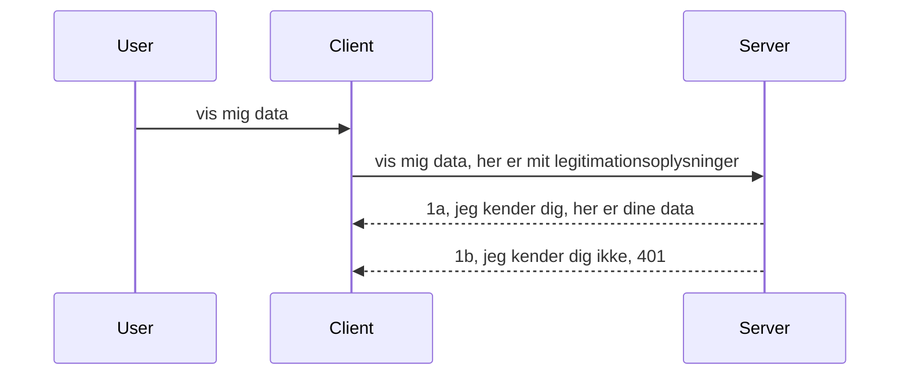

# Simple auth

MCP SDK'er understøtter brugen af OAuth 2.1, som for at være retfærdig er en ret involveret proces, der involverer koncepter som auth-server, ressource-server, afsendelse af legitimationsoplysninger, modtagelse af en kode, udveksling af koden for en bearer-token, indtil du endelig kan få dine ressource-data. Hvis du ikke er vant til OAuth, som er en fantastisk ting at implementere, er det en god idé at starte med et grundlæggende niveau af auth og bygge op til bedre og bedre sikkerhed. Det er derfor, dette kapitel findes, for at opbygge dig op til mere avanceret auth.

## Auth, hvad mener vi?

Auth er en forkortelse for authentication og authorization. Ideen er, at vi skal gøre to ting:

- **Authentication**, som er processen med at finde ud af, om vi lader en person komme ind i vores hus, at de har ret til at være "her", altså have adgang til vores ressourcer-server, hvor vores MCP Server-funktioner bor.
- **Authorization**, er processen med at finde ud af, om en bruger skal have adgang til disse specifikke ressourcer, de spørger efter, for eksempel disse ordrer eller disse produkter, eller om de få lov til at læse indholdet men ikke slette som et andet eksempel.

## Credentials: hvordan vi fortæller systemet hvem vi er

Nå, de fleste webudviklere tænker i termer af at levere en legitimationsoplysning til serveren, normalt en hemmelighed, som siger, om de har lov til at være her "Authentication". Denne legitimationsoplysning er normalt en base64-kodet version af brugernavn og adgangskode eller en API-nøgle, der entydigt identificerer en specifik bruger.

Dette involverer at sende det via en header kaldet "Authorization" således:

```json
{ "Authorization": "secret123" }
```

Dette kaldes normalt basic authentication. Hvordan den samlede flow så virker, er på følgende måde:


Nu hvor vi forstår, hvordan det fungerer fra et flow-synspunkt, hvordan implementerer vi det? Nå, de fleste webservere har et koncept kaldet middleware, et stykke kode, der kører som en del af anmodningen og kan verificere legitimationsoplysninger, og hvis legitimationsoplysninger er gyldige, kan lade anmodningen passere igennem. Hvis anmodningen ikke har gyldige legitimationsoplysninger, får du en auth-fejl. Lad os se, hvordan dette kan implementeres:

**Python**

```python
class AuthMiddleware(BaseHTTPMiddleware):
    async def dispatch(self, request, call_next):

        has_header = request.headers.get("Authorization")
        if not has_header:
            print("-> Missing Authorization header!")
            return Response(status_code=401, content="Unauthorized")

        if not valid_token(has_header):
            print("-> Invalid token!")
            return Response(status_code=403, content="Forbidden")

        print("Valid token, proceeding...")
       
        response = await call_next(request)
        # tilføj eventuelle brugerdefinerede headers eller ændringer i svaret på en eller anden måde
        return response


starlette_app.add_middleware(CustomHeaderMiddleware)
```

Her har vi:

- Oprettet en middleware kaldet `AuthMiddleware`, hvor dens `dispatch` metode bliver kaldt af webserveren.
- Tilføjet middleware'en til webserveren:

    ```python
    starlette_app.add_middleware(AuthMiddleware)
    ```

- Skrevet valideringslogik, der tjekker om Authorization header er til stede og om den hemmelighed, der bliver sendt, er gyldig:

    ```python
    has_header = request.headers.get("Authorization")
    if not has_header:
        print("-> Missing Authorization header!")
        return Response(status_code=401, content="Unauthorized")

    if not valid_token(has_header):
        print("-> Invalid token!")
        return Response(status_code=403, content="Forbidden")
    ```

    hvis hemmeligheden er til stede og gyldig, lader vi anmodningen passere ved at kalde `call_next` og returnere svaret.

    ```python
    response = await call_next(request)
    # tilføj eventuelle brugerdefinerede overskrifter eller ændringer i svaret på en eller anden måde
    return response
    ```

Sådan virker det, at hvis en webanmodning bliver lavet mod serveren, bliver middleware'en kaldt, og baseret på dens implementering vil den enten lade anmodningen passere eller ende med at returnere en fejl, der indikerer, at klienten ikke har tilladelse til at fortsætte.

**TypeScript**

Her opretter vi en middleware med det populære framework Express og aflytter anmodningen, før den når MCP Serveren. Her er koden til det:

```typescript
function isValid(secret) {
    return secret === "secret123";
}

app.use((req, res, next) => {
    // 1. Autorisationshoved findes?
    if(!req.headers["Authorization"]) {
        res.status(401).send('Unauthorized');
    }
    
    let token = req.headers["Authorization"];

    // 2. Tjek gyldighed.
    if(!isValid(token)) {
        res.status(403).send('Forbidden');
    }

   
    console.log('Middleware executed');
    // 3. Sender forespørgslen videre til næste trin i forespørgselsprocessen.
    next();
});
```

I denne kode:

1. Tjekker vi, om Authorization header overhovedet er til stede; hvis ikke, sender vi en 401-fejl.
2. Sikrer vi, at legitimationsoplysninger/token er gyldige; hvis ikke, sender vi en 403-fejl.
3. Videre-vider vi til sidst anmodningen i pipeline og returnerer den ønskede ressource.

## Øvelse: Implementer authentication

Lad os tage vores viden og prøve at implementere det. Her er planen:

Server

- Opret en webserver og MCP-instans.
- Implementer en middleware til serveren.

Klient

- Send webanmodning med legitimationsoplysninger via header.

### -1- Opret en webserver og MCP-instans

I første trin skal vi oprette webserverinstansen og MCP Serveren.

**Python**

Her opretter vi en MCP serverinstans, laver en starlette web-app og hoster den med uvicorn.

```python
# opretter MCP-server

app = FastMCP(
    name="MCP Resource Server",
    instructions="Resource Server that validates tokens via Authorization Server introspection",
    host=settings["host"],
    port=settings["port"],
    debug=True
)

# opretter starlette webapp
starlette_app = app.streamable_http_app()

# serverer app via uvicorn
async def run(starlette_app):
    import uvicorn
    config = uvicorn.Config(
            starlette_app,
            host=app.settings.host,
            port=app.settings.port,
            log_level=app.settings.log_level.lower(),
        )
    server = uvicorn.Server(config)
    await server.serve()

run(starlette_app)
```

I denne kode:

- Opretter vi MCP Serveren.
- Konstruerer starlette web-appen fra MCP Serveren, `app.streamable_http_app()`.
- Host og server web-appen ved brug af uvicorn `server.serve()`.

**TypeScript**

Her opretter vi en MCP Server-instans.

```typescript
const server = new McpServer({
      name: "example-server",
      version: "1.0.0"
    });

    // ... opsæt serverressourcer, værktøjer og prompt ...
```

Denne MCP Server-oprettelse skal ske inden for vores POST /mcp rute-definition, så lad os tage ovenstående kode og flytte den sådan her:

```typescript
import express from "express";
import { randomUUID } from "node:crypto";
import { McpServer } from "@modelcontextprotocol/sdk/server/mcp.js";
import { StreamableHTTPServerTransport } from "@modelcontextprotocol/sdk/server/streamableHttp.js";
import { isInitializeRequest } from "@modelcontextprotocol/sdk/types.js"

const app = express();
app.use(express.json());

// Kort til at gemme transporter efter sessions-ID
const transports: { [sessionId: string]: StreamableHTTPServerTransport } = {};

// Håndter POST-anmodninger til klient-til-server kommunikation
app.post('/mcp', async (req, res) => {
  // Tjek for eksisterende sessions-ID
  const sessionId = req.headers['mcp-session-id'] as string | undefined;
  let transport: StreamableHTTPServerTransport;

  if (sessionId && transports[sessionId]) {
    // Genbrug eksisterende transport
    transport = transports[sessionId];
  } else if (!sessionId && isInitializeRequest(req.body)) {
    // Ny initialiseringsanmodning
    transport = new StreamableHTTPServerTransport({
      sessionIdGenerator: () => randomUUID(),
      onsessioninitialized: (sessionId) => {
        // Gem transporten efter sessions-ID
        transports[sessionId] = transport;
      },
      // DNS-rebinding beskyttelse er som standard deaktiveret for bagudkompatibilitet. Hvis du kører denne server
      // lokalt, skal du sørge for at sætte:
      // enableDnsRebindingProtection: true,
      // allowedHosts: ['127.0.0.1'],
    });

    // Ryd op i transporten, når den lukkes
    transport.onclose = () => {
      if (transport.sessionId) {
        delete transports[transport.sessionId];
      }
    };
    const server = new McpServer({
      name: "example-server",
      version: "1.0.0"
    });

    // ... opsæt serverressourcer, værktøjer og prompts ...

    // Forbind til MCP-serveren
    await server.connect(transport);
  } else {
    // Ugyldig anmodning
    res.status(400).json({
      jsonrpc: '2.0',
      error: {
        code: -32000,
        message: 'Bad Request: No valid session ID provided',
      },
      id: null,
    });
    return;
  }

  // Håndter anmodningen
  await transport.handleRequest(req, res, req.body);
});

// Genanvendelig håndtering for GET og DELETE anmodninger
const handleSessionRequest = async (req: express.Request, res: express.Response) => {
  const sessionId = req.headers['mcp-session-id'] as string | undefined;
  if (!sessionId || !transports[sessionId]) {
    res.status(400).send('Invalid or missing session ID');
    return;
  }
  
  const transport = transports[sessionId];
  await transport.handleRequest(req, res);
};

// Håndter GET-anmodninger for server-til-klient notifikationer via SSE
app.get('/mcp', handleSessionRequest);

// Håndter DELETE-anmodninger for session afslutning
app.delete('/mcp', handleSessionRequest);

app.listen(3000);
```

Nu kan du se, hvordan MCP Server-oprettelsen blev flyttet indenfor `app.post("/mcp")`.

Lad os gå videre til næste trin med at oprette middleware, så vi kan validere de indkommende legitimationsoplysninger.

### -2- Implementer middleware til serveren

Lad os komme til middleware-delen nu. Her vil vi oprette en middleware, der leder efter en legitimationsoplysning i `Authorization` headeren og validerer denne. Hvis den er acceptabel, vil anmodningen fortsætte med at gøre, hvad der skal gøres (f.eks. liste værktøjer, læse en ressource eller hvad MCP-funktionaliteten nu var, klienten bad om).

**Python**

For at oprette middleware, skal vi lave en klasse, der arver fra `BaseHTTPMiddleware`. Der er to interessante dele:

- Anmodningen `request`, som vi læser header-infoen fra.
- `call_next` callback'en, vi skal kalde, hvis klienten har bragt en legitimationsoplysning, vi accepterer.

Først skal vi håndtere tilfældet, hvis `Authorization` header mangler:

```python
has_header = request.headers.get("Authorization")

# intet header til stede, fejl med 401, ellers fortsæt.
if not has_header:
    print("-> Missing Authorization header!")
    return Response(status_code=401, content="Unauthorized")
```

Her sender vi en 401 Unauthorized besked, da klienten fejler i authentication.

Dernæst, hvis en legitimationsoplysning blev sendt, skal vi tjekke dens gyldighed sådan her:

```python
 if not valid_token(has_header):
    print("-> Invalid token!")
    return Response(status_code=403, content="Forbidden")
```

Bemærk hvordan vi sender en 403 Forbidden besked ovenfor. Lad os se den fulde middleware nedenfor, der implementerer alt, vi nævnte ovenfor:

```python
class AuthMiddleware(BaseHTTPMiddleware):
    async def dispatch(self, request, call_next):

        has_header = request.headers.get("Authorization")
        if not has_header:
            print("-> Missing Authorization header!")
            return Response(status_code=401, content="Unauthorized")

        if not valid_token(has_header):
            print("-> Invalid token!")
            return Response(status_code=403, content="Forbidden")

        print("Valid token, proceeding...")
        print(f"-> Received {request.method} {request.url}")
        response = await call_next(request)
        response.headers['Custom'] = 'Example'
        return response

```

Godt, men hvad med `valid_token` funktionen? Her er den nedenfor:

```python
# BRUG IKKE til produktion - forbedr det !!
def valid_token(token: str) -> bool:
    # fjern "Bearer " præfikset
    if token.startswith("Bearer "):
        token = token[7:]
        return token == "secret-token"
    return False
```

Dette bør åbenlyst forbedres.

VIGTIGT: Du bør ALDRIG have hemmeligheder som denne i koden. Ideelt set skal du hente værdien til sammenligning fra en datakilde eller fra en IDP (identity service provider) eller endnu bedre, lade IDP’en foretage valideringen.

**TypeScript**

For at implementere dette med Express, skal vi kalde `use` metoden, som tager middleware-funktioner.

Vi skal:

- Interagere med anmodningsvariablen for at tjekke den passerede legitimationsoplysning i `Authorization` egenskaben.
- Validere legitimationsoplysningen, og hvis gyldig, lade anmodningen fortsætte og lade klientens MCP-anmodning gøre, hvad den skal (f.eks. liste værktøjer, læse ressource eller andet MCP-relateret).

Her tjekker vi, om `Authorization` header er til stede, og hvis ikke, stopper vi anmodningen:

```typescript
if(!req.headers["authorization"]) {
    res.status(401).send('Unauthorized');
    return;
}
```

Hvis headeren ikke sendes i første omgang, modtager du en 401.

Dernæst tjekker vi, om legitimationsoplysningen er gyldig; hvis ikke, stopper vi igen anmodningen, men med en lidt anden besked:

```typescript
if(!isValid(token)) {
    res.status(403).send('Forbidden');
    return;
} 
```

Bemærk, at du nu får en 403-fejl.

Her er den fulde kode:

```typescript
app.use((req, res, next) => {
    console.log('Request received:', req.method, req.url, req.headers);
    console.log('Headers:', req.headers["authorization"]);
    if(!req.headers["authorization"]) {
        res.status(401).send('Unauthorized');
        return;
    }
    
    let token = req.headers["authorization"];

    if(!isValid(token)) {
        res.status(403).send('Forbidden');
        return;
    }  

    console.log('Middleware executed');
    next();
});
```

Vi har sat webserveren op til at acceptere en middleware, der tjekker legitimationsoplysningen, som klienten forhåbentlig sender os. Hvad med klienten selv?

### -3- Send webanmodning med legitimationsoplysning via header

Vi skal sikre, at klienten sender legitimationsoplysningerne via headeren. Da vi vil bruge en MCP-klient til det, skal vi finde ud af, hvordan det gøres.

**Python**

For klienten skal vi sende en header med vores legitimationsoplysning således:

```python
# UNDLADE at hardkode værdien, lad den mindst være i en miljøvariabel eller en mere sikker lagerplads
token = "secret-token"

async with streamablehttp_client(
        url = f"http://localhost:{port}/mcp",
        headers = {"Authorization": f"Bearer {token}"}
    ) as (
        read_stream,
        write_stream,
        session_callback,
    ):
        async with ClientSession(
            read_stream,
            write_stream
        ) as session:
            await session.initialize()
      
            # TODO, hvad du ønsker gjort i klienten, f.eks. liste værktøjer, kalde værktøjer osv.
```

Bemærk, hvordan vi udfylder `headers`-egenskaben sådan her ` headers = {"Authorization": f"Bearer {token}"}`.

**TypeScript**

Vi kan løse dette i to trin:

1. Udfyld et konfigurationsobjekt med vores legitimationsoplysning.
2. Send konfigurationsobjektet til transporten.

```typescript

// DON’T hårdkod værdien som vist her. Hav den som minimum som en miljøvariabel og brug noget som dotenv (i udviklingstilstand).
let token = "secret123"

// definer et objekt for klienttransportindstillinger
let options: StreamableHTTPClientTransportOptions = {
  sessionId: sessionId,
  requestInit: {
    headers: {
      "Authorization": "secret123"
    }
  }
};

// send options-objektet til transporten
async function main() {
   const transport = new StreamableHTTPClientTransport(
      new URL(serverUrl),
      options
   );
```

Her kan du se ovenfor, hvordan vi måtte oprette et `options` objekt og placere vores headers under `requestInit` egenskaben.

VIGTIGT: Hvordan forbedrer vi det herfra? Nå, den nuværende implementering har nogle problemer. For det første er det ret risikabelt at sende legitimationsoplysninger på denne måde, medmindre du minimum har HTTPS. Selv da kan legitimationsoplysningerne blive stjålet, så du har brug for et system, hvor du nemt kan tilbagekalde token og tilføje ekstra kontroller som hvor i verden den kommer fra, om anmodningen sker alt for ofte (bot-lignende adfærd), kort sagt, der er en hel række bekymringer.

Det skal siges, at for meget simple API’er, hvor du ikke ønsker nogen skal kalde dit API uden at være autentificeret, er det vi har her et godt udgangspunkt.

Med det sagt, lad os prøve at styrke sikkerheden lidt ved at bruge et standardiseret format som JSON Web Token, også kendt som JWT eller "JOT" tokens.

## JSON Web Tokens, JWT

Så, vi prøver at forbedre tingene fra at sende meget simple legitimationsoplysninger. Hvilke umiddelbare forbedringer får vi ved at adoptere JWT?

- **Sikkerhedsforbedringer**. I basic auth sender du brugernavn og adgangskode som en base64-kodet token (eller du sender en API-nøgle) igen og igen, hvilket øger risikoen. Med JWT sender du dit brugernavn og adgangskode og får en token til gengæld, og den er også tidsbegrænset, hvilket betyder, at den udløber. JWT lader dig nemt bruge finmasket adgangskontrol vha. roller, scopes og tilladelser.
- **Statelessness og skalerbarhed**. JWT’er er selvstændige, de bærer alle brugeroplysninger og fjerner behovet for at gemme sessionsdata på serveren. Token kan også valideres lokalt.
- **Interoperabilitet og federation**. JWT’er er centrale i Open ID Connect og bruges med kendte identitetsudbydere som Entra ID, Google Identity og Auth0. De gør det også muligt at bruge single sign on og meget mere, hvilket gør det enterprise-grade.
- **Modularitet og fleksibilitet**. JWT’er kan også bruges med API Gateways som Azure API Management, NGINX og mere. De understøtter også brugergodkendelsesscenarier og server-til-service kommunikation inklusive impersonation og delegeringsscenarier.
- **Performance og caching**. JWT’er kan caches efter dekodning, hvilket reducerer behovet for parsig. Dette hjælper især med højttrafik-apps, da det forbedrer gennemløb og reducerer belastningen på din valgte infrastruktur.
- **Avancerede funktioner**. Det understøtter også introspektion (tjek af gyldighed på server) og tilbagekaldelse (gøre en token ugyldig).

Med alle disse fordele, lad os se, hvordan vi kan tage vores implementering til næste niveau.

## Gør basic auth til JWT

Så de ændringer vi skal foretage på overordnet plan er:

- **Lær at konstruere en JWT token** og gøre den klar til at blive sendt fra klient til server.
- **Validér en JWT token**, og hvis den er gyldig, lad klienten få vores ressourcer.
- **Sikker token-lagring**. Hvordan vi gemmer denne token.
- **Beskyt ruterne**. Vi skal beskytte ruterne, i vores tilfælde skal vi beskytte ruter og specifikke MCP-funktioner.
- **Tilføj refresh tokens**. Sørg for at lave tokens, der er kortvarige, men refresh tokens, som er langvarige, som kan bruges til at få nye tokens, hvis de udløber. Sørg også for, at der er et refresh endpoint og en rotationsstrategi.

### -1- Konstruer en JWT token

Først har en JWT token følgende dele:

- **header**, algoritme brugt og token-type.
- **payload**, claims, som sub (brugeren eller entiteten tokenen repræsenterer. I et auth-scenarie er dette typisk brugerid), exp (hvornår den udløber), role (rollen)
- **signature**, signeret med en hemmelighed eller privat nøgle.

Til dette skal vi konstruere header, payload og den kodede token.

**Python**

```python

import jwt
import jwt
from jwt.exceptions import ExpiredSignatureError, InvalidTokenError
import datetime

# Hemmelig nøgle brugt til at signere JWT'en
secret_key = 'your-secret-key'

header = {
    "alg": "HS256",
    "typ": "JWT"
}

# brugerinformationen og dens krav og udløbstid
payload = {
    "sub": "1234567890",               # Emne (bruger-ID)
    "name": "User Userson",                # Brugerdefineret krav
    "admin": True,                     # Brugerdefineret krav
    "iat": datetime.datetime.utcnow(),# Udstedt på
    "exp": datetime.datetime.utcnow() + datetime.timedelta(hours=1)  # Udløb
}

# kod det
encoded_jwt = jwt.encode(payload, secret_key, algorithm="HS256", headers=header)
```

I ovenstående kode har vi:

- Defineret en header med HS256 som algoritme og type JWT.
- Konstrueret en payload, der indeholder en subject eller bruger-id, et brugernavn, en rolle, hvornår den blev udstedt, og hvornår den udløber, hvilket implementerer den tidsbegrænsede aspekt, vi nævnte tidligere.

**TypeScript**

Her vil vi have brug for nogle afhængigheder, der hjælper os med at konstruere JWT token.

Afhængigheder

```sh

npm install jsonwebtoken
npm install --save-dev @types/jsonwebtoken
```

Nu hvor vi har det på plads, lad os skabe header, payload og gennem det skabe den kodede token.

```typescript
import jwt from 'jsonwebtoken';

const secretKey = 'your-secret-key'; // Brug miljøvariabler i produktion

// Definer payload
const payload = {
  sub: '1234567890',
  name: 'User usersson',
  admin: true,
  iat: Math.floor(Date.now() / 1000), // Udstedt den
  exp: Math.floor(Date.now() / 1000) + 60 * 60 // Udløber om 1 time
};

// Definer headeren (valgfrit, jsonwebtoken sætter standarder)
const header = {
  alg: 'HS256',
  typ: 'JWT'
};

// Opret tokenet
const token = jwt.sign(payload, secretKey, {
  algorithm: 'HS256',
  header: header
});

console.log('JWT:', token);
```

Denne token er:

Signeret med HS256
Gyldig i 1 time
Inkluderer claims som sub, name, admin, iat og exp.

### -2- Validér en token

Vi vil også skulle validere en token, dette er noget, vi bør gøre på serveren for at sikre, at det, klienten sender os, faktisk er gyldigt. Der er mange checks, vi bør lave her fra at validere dens struktur til dens gyldighed. Du opfordres også til at tilføje andre checks for at se, om brugeren findes i dit system og mere.

For at validere en token skal vi dekode den, så vi kan læse den og herefter begynde at tjekke dens gyldighed:

**Python**

```python

# Dekod og bekræft JWT'en
try:
    decoded = jwt.decode(token, secret_key, algorithms=["HS256"])
    print("✅ Token is valid.")
    print("Decoded claims:")
    for key, value in decoded.items():
        print(f"  {key}: {value}")
except ExpiredSignatureError:
    print("❌ Token has expired.")
except InvalidTokenError as e:
    print(f"❌ Invalid token: {e}")

```

I denne kode kalder vi `jwt.decode` med token, den hemmelige nøgle og den valgte algoritme som input. Bemærk, at vi bruger en try-catch-konstruktion, da en mislykket validering fører til en fejl.

**TypeScript**

Her skal vi kalde `jwt.verify` for at få en dekodet version af token, som vi kan analysere yderligere. Hvis dette kald fejler, betyder det, at strukturen af token er forkert eller ikke længere gyldig.

```typescript

try {
  const decoded = jwt.verify(token, secretKey);
  console.log('Decoded Payload:', decoded);
} catch (err) {
  console.error('Token verification failed:', err);
}
```

BEMÆRK: Som tidligere nævnt, bør vi udføre yderligere checks for at sikre, at denne token peger på en bruger i vores system, og sikre at brugeren har de rettigheder, den påstår at have.

Næste, lad os se på rollebaseret adgangskontrol, også kendt som RBAC.
## Tilføjelse af rollebaseret adgangskontrol

Ideen er, at vi vil udtrykke, at forskellige roller har forskellige tilladelser. For eksempel antager vi, at en admin kan gøre alt, en normal bruger kan læse/skrive, og at en gæst kun kan læse. Derfor er her nogle mulige tilladelsesniveauer:

- Admin.Write 
- User.Read
- Guest.Read

Lad os se på, hvordan vi kan implementere sådan en kontrol med middleware. Middleware kan tilføjes per rute såvel som for alle ruter.

**Python**

```python
from starlette.middleware.base import BaseHTTPMiddleware
from starlette.responses import JSONResponse
import jwt

# HAV IKKE hemmeligheden i koden som, dette er kun til demonstrationsformål. Læs det fra et sikkert sted.
SECRET_KEY = "your-secret-key" # sæt dette i en miljøvariabel
REQUIRED_PERMISSION = "User.Read"

class JWTPermissionMiddleware(BaseHTTPMiddleware):
    async def dispatch(self, request, call_next):
        auth_header = request.headers.get("Authorization")
        if not auth_header or not auth_header.startswith("Bearer "):
            return JSONResponse({"error": "Missing or invalid Authorization header"}, status_code=401)

        token = auth_header.split(" ")[1]
        try:
            decoded = jwt.decode(token, SECRET_KEY, algorithms=["HS256"])
        except jwt.ExpiredSignatureError:
            return JSONResponse({"error": "Token expired"}, status_code=401)
        except jwt.InvalidTokenError:
            return JSONResponse({"error": "Invalid token"}, status_code=401)

        permissions = decoded.get("permissions", [])
        if REQUIRED_PERMISSION not in permissions:
            return JSONResponse({"error": "Permission denied"}, status_code=403)

        request.state.user = decoded
        return await call_next(request)


```

Der er flere forskellige måder at tilføje middleware på som nedenfor:

```python

# Mulighed 1: tilføj middleware under konstruktion af starlette app
middleware = [
    Middleware(JWTPermissionMiddleware)
]

app = Starlette(routes=routes, middleware=middleware)

# Mulighed 2: tilføj middleware efter starlette app allerede er konstrueret
starlette_app.add_middleware(JWTPermissionMiddleware)

# Mulighed 3: tilføj middleware pr. rute
routes = [
    Route(
        "/mcp",
        endpoint=..., # håndterer
        middleware=[Middleware(JWTPermissionMiddleware)]
    )
]
```

**TypeScript**

Vi kan bruge `app.use` og en middleware, som vil køre for alle forespørgsler.

```typescript
app.use((req, res, next) => {
    console.log('Request received:', req.method, req.url, req.headers);
    console.log('Headers:', req.headers["authorization"]);

    // 1. Tjek om autorisationsheaderen er sendt

    if(!req.headers["authorization"]) {
        res.status(401).send('Unauthorized');
        return;
    }
    
    let token = req.headers["authorization"];

    // 2. Tjek om token er gyldigt
    if(!isValid(token)) {
        res.status(403).send('Forbidden');
        return;
    }  

    // 3. Tjek om tokenbrugeren findes i vores system
    if(!isExistingUser(token)) {
        res.status(403).send('Forbidden');
        console.log("User does not exist");
        return;
    }
    console.log("User exists");

    // 4. Bekræft at token har de rigtige tilladelser
    if(!hasScopes(token, ["User.Read"])){
        res.status(403).send('Forbidden - insufficient scopes');
    }

    console.log("User has required scopes");

    console.log('Middleware executed');
    next();
});

```

Der er en del ting, vi kan lade vores middleware gøre, og som vores middleware BØR gøre, nemlig:

1. Tjekke om autorisationsheaderen er til stede
2. Tjekke om token er gyldigt, vi kalder `isValid`, som er en metode vi har skrevet, der tjekker integritet og gyldighed af JWT-token.
3. Verificere at brugeren findes i vores system, det bør vi tjekke.

   ```typescript
    // brugere i DB
   const users = [
     "user1",
     "User usersson",
   ]

   function isExistingUser(token) {
     let decodedToken = verifyToken(token);

     // TODO, tjek om brugeren findes i DB
     return users.includes(decodedToken?.name || "");
   }
   ```

   Ovenfor har vi oprettet en meget simpel `users`-liste, som naturligvis burde være i en database.

4. Derudover bør vi også tjekke, at token har de rigtige tilladelser.

   ```typescript
   if(!hasScopes(token, ["User.Read"])){
        res.status(403).send('Forbidden - insufficient scopes');
   }
   ```

   I koden ovenfor fra middleware tjekker vi, at token indeholder User.Read tilladelse, hvis ikke sender vi en 403 fejl. Nedenfor er `hasScopes` hjælpe-metoden.

   ```typescript
   function hasScopes(scope: string, requiredScopes: string[]) {
     let decodedToken = verifyToken(scope);
    return requiredScopes.every(scope => decodedToken?.scopes.includes(scope));
  }
   ```

Have a think which additional checks you should be doing, but these are the absolute minimum of checks you should be doing.

Using Express as a web framework is a common choice. There are helpers library when you use JWT so you can write less code.

- `express-jwt`, helper library that provides a middleware that helps decode your token.
- `express-jwt-permissions`, this provides a middleware `guard` that helps check if a certain permission is on the token.

Here's what these libraries can look like when used:

```typescript
const express = require('express');
const jwt = require('express-jwt');
const guard = require('express-jwt-permissions')();

const app = express();
const secretKey = 'your-secret-key'; // put this in env variable

// Decode JWT and attach to req.user
app.use(jwt({ secret: secretKey, algorithms: ['HS256'] }));

// Check for User.Read permission
app.use(guard.check('User.Read'));

// multiple permissions
// app.use(guard.check(['User.Read', 'Admin.Access']));

app.get('/protected', (req, res) => {
  res.json({ message: `Welcome ${req.user.name}` });
});

// Error handler
app.use((err, req, res, next) => {
  if (err.code === 'permission_denied') {
    return res.status(403).send('Forbidden');
  }
  next(err);
});

```

Nu har du set, hvordan middleware kan bruges til både autentifikation og autorisation, men hvad med MCP, ændrer det hvordan vi gør auth? Lad os finde ud af det i næste sektion.

### -3- Tilføj RBAC til MCP

Indtil videre har du set, hvordan du kan tilføje RBAC via middleware, men for MCP er der ikke nogen nem måde at tilføje RBAC per MCP-funktion, så hvad gør vi? Vi må bare tilføje kode som denne, der tjekker om klienten i dette tilfælde har rettigheder til at kalde et bestemt værktøj:

Du har nogle forskellige valg til, hvordan du kan opnå RBAC per funktion, her er nogle:

- Tilføj en tjek for hvert værktøj, ressource, prompt hvor du skal tjekke tilladelsesniveau.

   **python**

   ```python
   @tool()
   def delete_product(id: int):
      try:
          check_permissions(role="Admin.Write", request)
      catch:
        pass # klienten mislykkedes med godkendelse, udløs godkendelsesfejl
   ```

   **typescript**

   ```typescript
   server.registerTool(
    "delete-product",
    {
      title: Delete a product",
      description: "Deletes a product",
      inputSchema: { id: z.number() }
    },
    async ({ id }) => {
      
      try {
        checkPermissions("Admin.Write", request);
        // todo, send id til productService og remote entry
      } catch(Exception e) {
        console.log("Authorization error, you're not allowed");  
      }

      return {
        content: [{ type: "text", text: `Deletected product with id ${id}` }]
      };
    }
   );
   ```


- Brug en avanceret servertilgang og request handlers så du minimerer, hvor mange steder du skal lave tjekket.

   **Python**

   ```python
   
   tool_permission = {
      "create_product": ["User.Write", "Admin.Write"],
      "delete_product": ["Admin.Write"]
   }

   def has_permission(user_permissions, required_permissions) -> bool:
      # bruger_tilladelser: liste over de tilladelser brugeren har
      # nødvendige_tilladelser: liste over tilladelser krævet for værktøjet
      return any(perm in user_permissions for perm in required_permissions)

   @server.call_tool()
   async def handle_call_tool(
     name: str, arguments: dict[str, str] | None
   ) -> list[types.TextContent]:
    # Antag at request.user.permissions er en liste over tilladelser for brugeren
     user_permissions = request.user.permissions
     required_permissions = tool_permission.get(name, [])
     if not has_permission(user_permissions, required_permissions):
        # Kald fejl "Du har ikke tilladelse til at kalde værktøj {name}"
        raise Exception(f"You don't have permission to call tool {name}")
     # fortsæt og kald værktøj
     # ...
   ```   
   

   **TypeScript**

   ```typescript
   function hasPermission(userPermissions: string[], requiredPermissions: string[]): boolean {
       if (!Array.isArray(userPermissions) || !Array.isArray(requiredPermissions)) return false;
       // Returner sandt, hvis brugeren har mindst én af de nødvendige tilladelser
       
       return requiredPermissions.some(perm => userPermissions.includes(perm));
   }
  
   server.setRequestHandler(CallToolRequestSchema, async (request) => {
      const { params: { name } } = request;
  
      let permissions = request.user.permissions;
  
      if (!hasPermission(permissions, toolPermissions[name])) {
         return new Error(`You don't have permission to call ${name}`);
      }
  
      // fortsæt..
   });
   ```

   Bemærk, du skal sikre, at din middleware tildeler et dekodet token til anmodningens user-egenskab, så koden ovenfor gøres simpel.

### Opsummering

Nu hvor vi har diskuteret, hvordan man tilføjer støtte for RBAC generelt og for MCP specifikt, er det tid til at prøve at implementere sikkerhed på egen hånd for at sikre, at du har forstået de præsenterede koncepter.

## Opgave 1: Byg en mcp-server og mcp-klient ved hjælp af grundlæggende autentifikation

Her vil du tage det, du har lært om at sende legitimationsoplysninger gennem headers.

## Løsning 1

[Løsning 1](./code/basic/README.md)

## Opgave 2: Opgradér løsningen fra Opgave 1 til at bruge JWT

Tag den første løsning, men denne gang, lad os forbedre den.

I stedet for at bruge Basic Auth, lad os bruge JWT.

## Løsning 2

[Løsning 2](./solution/jwt-solution/README.md)

## Udfordring

Tilføj RBAC per værktøj som vi beskriver i sektionen "Tilføj RBAC til MCP".

## Resumé

Forhåbentlig har du lært meget i dette kapitel, fra ingen sikkerhed overhovedet, til grundlæggende sikkerhed, til JWT og hvordan det kan tilføjes til MCP.

Vi har bygget et solidt fundament med tilpassede JWT'er, men efterhånden som vi skalerer, bevæger vi os mod en standardbaseret identitetsmodel. At adoptere en IdP som Entra eller Keycloak lader os uddelegere token-udstedelse, validering og livscyklus-håndtering til en betroet platform — hvilket frigør os til at fokusere på applogik og brugeroplevelse.

For det har vi et mere [avanceret kapitel om Entra](../../05-AdvancedTopics/mcp-security-entra/README.md)

## Hvad kommer næste

- Næste: [Opsætning af MCP Hosts](../12-mcp-hosts/README.md)

---

<!-- CO-OP TRANSLATOR DISCLAIMER START -->
**Ansvarsfraskrivelse**:
Dette dokument er oversat ved hjælp af AI-oversættelsestjenesten [Co-op Translator](https://github.com/Azure/co-op-translator). Selvom vi bestræber os på nøjagtighed, skal du være opmærksom på, at automatiserede oversættelser kan indeholde fejl eller unøjagtigheder. Det oprindelige dokument på dets modersmål bør betragtes som den autoritative kilde. For kritisk information anbefales professionel menneskelig oversættelse. Vi påtager os intet ansvar for misforståelser eller fejltolkninger, der opstår på grund af brugen af denne oversættelse.
<!-- CO-OP TRANSLATOR DISCLAIMER END -->