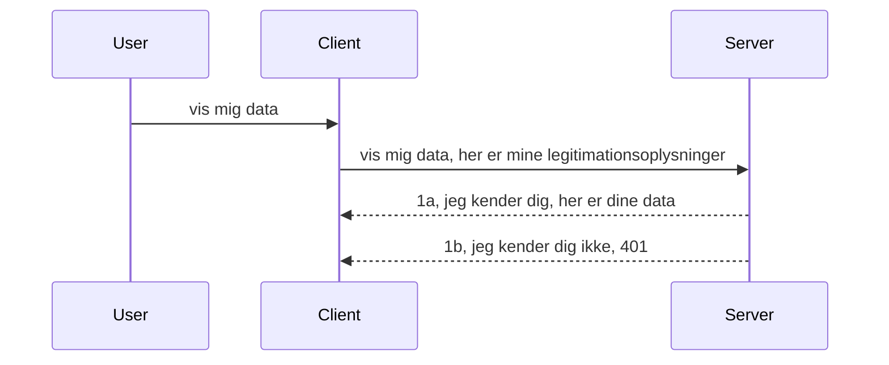

# Simpel auth

MCP SDK'er understøtter brugen af OAuth 2.1, hvilket for at være fair er en ret involveret proces, der involverer koncepter som auth-server, ressource-server, afsendelse af legitimationsoplysninger, modtagelse af en kode, ombytning af koden til en bearer-token, indtil du endelig kan få dine ressource-data. Hvis du ikke er vant til OAuth, som er en fantastisk ting at implementere, er det en god idé at starte med et grundlæggende niveau af autentificering og opbygge til bedre og bedre sikkerhed. Det er grunden til, at dette kapitel eksisterer, for at opbygge dig til mere avanceret auth.

## Auth, hvad mener vi?

Auth er en forkortelse for autentificering og autorisation. Ideen er, at vi skal gøre to ting:

- **Autentificering**, som er processen med at finde ud af, om vi lader en person komme ind i vores hus, at de har ret til at være "her" det vil sige have adgang til vores ressource-server, hvor vores MCP Server-funktioner bor.
- **Autorisation**, er processen med at finde ud af, om en bruger skal have adgang til disse specifikke ressourcer, de beder om, for eksempel disse ordrer eller disse produkter, eller om de kun må læse indholdet men ikke slette som et andet eksempel.

## Legitimationsoplysninger: hvordan vi fortæller systemet hvem vi er

De fleste webudviklere tænker i termer af at levere legitimationsoplysninger til serveren, normalt en hemmelighed, der siger, om de har lov til at være her "Autentificering". Denne legitimationsoplysning er normalt en base64-kodet version af brugernavn og adgangskode eller en API-nøgle, der entydigt identificerer en bestemt bruger.

Dette involverer at sende den via en header kaldet "Authorization" sådan her:

```json
{ "Authorization": "secret123" }
```

Dette kaldes normalt basic authentication. Hvordan det overordnede flow så fungerer, er på følgende måde:


```mermaid
sequenceDiagram
   participant User
   participant Client
   participant Server

   User->>Client: vis mig data
   Client->>Server: vis mig data, her er mine legitimationsoplysninger
   Server-->>Client: 1a, jeg kender dig, her er dine data
   Server-->>Client: 1b, jeg kender dig ikke, 401 
```

Nu hvor vi forstår, hvordan det fungerer fra et flow-synspunkt, hvordan implementerer vi det så? De fleste webservere har et koncept kaldet middleware, et stykke kode, der kører som en del af anmodningen, som kan verificere legitimationsoplysninger, og hvis legitimationsoplysningerne er gyldige, kan lade anmodningen passere igennem. Hvis anmodningen ikke har gyldige legitimationsoplysninger, får du en auth-fejl. Lad os se, hvordan dette kan implementeres:

**Python**

```python
class AuthMiddleware(BaseHTTPMiddleware):
    async def dispatch(self, request, call_next):

        has_header = request.headers.get("Authorization")
        if not has_header:
            print("-> Missing Authorization header!")
            return Response(status_code=401, content="Unauthorized")

        if not valid_token(has_header):
            print("-> Invalid token!")
            return Response(status_code=403, content="Forbidden")

        print("Valid token, proceeding...")
       
        response = await call_next(request)
        # tilføj eventuelle brugerdefinerede hovedpunkter eller ændr svaret på en eller anden måde
        return response


starlette_app.add_middleware(CustomHeaderMiddleware)
```

Her har vi:

- Oprettet en middleware kaldet `AuthMiddleware`, hvor dens `dispatch` metode bliver kaldt af webserveren.
- Tilføjet middleware til webserveren:

    ```python
    starlette_app.add_middleware(AuthMiddleware)
    ```

- Skrevet valideringslogik, som tjekker om Authorization-headeren er til stede og om den hemmelighed, der sendes, er gyldig:

    ```python
    has_header = request.headers.get("Authorization")
    if not has_header:
        print("-> Missing Authorization header!")
        return Response(status_code=401, content="Unauthorized")

    if not valid_token(has_header):
        print("-> Invalid token!")
        return Response(status_code=403, content="Forbidden")
    ```

    hvis hemmeligheden er til stede og gyldig, lader vi anmodningen passere ved at kalde `call_next` og returnere svaret.

    ```python
    response = await call_next(request)
    # tilføj eventuelle kundeoverskrifter eller ændringer i svaret på en eller anden måde
    return response
    ```

Det virker sådan, at hvis en webanmodning laves mod serveren, vil middleware blive kaldt, og med dens implementering vil den enten lade anmodningen passere eller ende med at returnere en fejl, der indikerer, at klienten ikke har tilladelse til at fortsætte.

**TypeScript**

Her opretter vi en middleware med det populære framework Express og afbryder anmodningen, inden den når MCP Server. Her er koden til det:

```typescript
function isValid(secret) {
    return secret === "secret123";
}

app.use((req, res, next) => {
    // 1. Autorisationshoved til stede?
    if(!req.headers["Authorization"]) {
        res.status(401).send('Unauthorized');
    }
    
    let token = req.headers["Authorization"];

    // 2. Kontroller gyldighed.
    if(!isValid(token)) {
        res.status(403).send('Forbidden');
    }

   
    console.log('Middleware executed');
    // 3. Videregiver forespørgslen til næste trin i forespørgselsrøret.
    next();
});
```

I denne kode:

1. Tjekker vi, om Authorization-headeren overhovedet er til stede; hvis ikke, sender vi en 401-fejl.
2. Sikrer vi, at legitimationsoplysninger/token er gyldigt; hvis ikke, sender vi en 403-fejl.
3. Endelig sender vi anmodningen videre i request-pipelinen og returnerer den ønskede ressource.

## Øvelse: Implementer autentificering

Lad os tage vores viden og prøve at implementere det. Her er planen:

Server

- Opret en webserver og MCP instans.
- Implementer en middleware til serveren.

Client

- Send webanmodning med legitimationsoplysninger via header.

### -1- Opret en webserver og MCP instans

> [!WARNING]
> TypeScript-eksemplet nedenfor retter sig mod MCP `2025-11-25`. Det sporer transports
> via `mcp-session-id` og er ikke et aktuelt `2026-07-28` transport-eksempel. MCP
> `2026-07-28` fjerner `initialize` handshake og protokol-session ID; nye
> implementeringer bruger selvstændige anmodninger. Se
> [Hvad er ændret i MCP: Specifikationen fra 2026-07-28](../../01-CoreConcepts/mcp-2026-07-28.md).

I vores første skridt skal vi oprette en webserver-instans og MCP Server.

**Python**

Her opretter vi en MCP serverinstans, opretter appen starlette web og hoster den med uvicorn.

```python
# opretter MCP-server

app = FastMCP(
    name="MCP Resource Server",
    instructions="Resource Server that validates tokens via Authorization Server introspection",
    host=settings["host"],
    port=settings["port"],
    debug=True
)

# opretter starlette webapp
starlette_app = app.streamable_http_app()

# serverer app via uvicorn
async def run(starlette_app):
    import uvicorn
    config = uvicorn.Config(
            starlette_app,
            host=app.settings.host,
            port=app.settings.port,
            log_level=app.settings.log_level.lower(),
        )
    server = uvicorn.Server(config)
    await server.serve()

run(starlette_app)
```

I denne kode:

- Oprettes MCP Server.
- Konstrueres starlette web-app'en fra MCP Server, `app.streamable_http_app()`.
- Hostes og serviceres web-appen med uvicorn `server.serve()`.

**TypeScript**

Her opretter vi en MCP Server instans.

```typescript
const server = new McpServer({
      name: "example-server",
      version: "1.0.0"
    });

    // ... opsæt serverressourcer, værktøjer og prompts ...
```

Denne oprettelse af MCP Server skal ske inden for vores POST /mcp route-definition, så lad os tage ovenstående kode og flytte den sådan her:

```typescript
import express from "express";
import { randomUUID } from "node:crypto";
import { McpServer } from "@modelcontextprotocol/sdk/server/mcp.js";
import { StreamableHTTPServerTransport } from "@modelcontextprotocol/sdk/server/streamableHttp.js";
import { isInitializeRequest } from "@modelcontextprotocol/sdk/types.js"

const app = express();
app.use(express.json());

// Kort til at gemme transporter efter sessions-ID
const transports: { [sessionId: string]: StreamableHTTPServerTransport } = {};

// Håndter POST-anmodninger til klient-til-server kommunikation
app.post('/mcp', async (req, res) => {
  // Tjek for eksisterende sessions-ID
  const sessionId = req.headers['mcp-session-id'] as string | undefined;
  let transport: StreamableHTTPServerTransport;

  if (sessionId && transports[sessionId]) {
    // Genbrug eksisterende transport
    transport = transports[sessionId];
  } else if (!sessionId && isInitializeRequest(req.body)) {
    // Ny initialiseringsanmodning
    transport = new StreamableHTTPServerTransport({
      sessionIdGenerator: () => randomUUID(),
      onsessioninitialized: (sessionId) => {
        // Gem transporten efter sessions-ID
        transports[sessionId] = transport;
      },
      // DNS rebinding beskyttelse er som standard deaktiveret for bagudkompatibilitet. Hvis du kører denne server
      // lokalt, skal du sørge for at sætte:
      // enableDnsRebindingProtection: true,
      // allowedHosts: ['127.0.0.1'],
    });

    // Ryd op i transporten når den lukkes
    transport.onclose = () => {
      if (transport.sessionId) {
        delete transports[transport.sessionId];
      }
    };
    const server = new McpServer({
      name: "example-server",
      version: "1.0.0"
    });

    // ... opsæt serverressourcer, værktøjer og prompt ...

    // Forbind til MCP-serveren
    await server.connect(transport);
  } else {
    // Ugyldig anmodning
    res.status(400).json({
      jsonrpc: '2.0',
      error: {
        code: -32000,
        message: 'Bad Request: No valid session ID provided',
      },
      id: null,
    });
    return;
  }

  // Håndter anmodningen
  await transport.handleRequest(req, res, req.body);
});

// Genanvendelig handler for GET- og DELETE-anmodninger
const handleSessionRequest = async (req: express.Request, res: express.Response) => {
  const sessionId = req.headers['mcp-session-id'] as string | undefined;
  if (!sessionId || !transports[sessionId]) {
    res.status(400).send('Invalid or missing session ID');
    return;
  }
  
  const transport = transports[sessionId];
  await transport.handleRequest(req, res);
};

// Håndter GET-anmodninger for server-til-klient notifikationer via SSE
app.get('/mcp', handleSessionRequest);

// Håndter DELETE-anmodninger for sessionsafslutning
app.delete('/mcp', handleSessionRequest);

app.listen(3000);
```

Nu kan du se, hvordan MCP Server-oprettelsen blev flyttet ind i `app.post("/mcp")`.

Lad os gå videre til næste skridt med at oprette middleware, så vi kan validere de indkommende legitimationsoplysninger.

### -2- Implementer en middleware til serveren

Lad os komme videre til middleware-delen nu. Her vil vi oprette en middleware, der leder efter legitimationsoplysninger i `Authorization` headeren og validerer dem. Hvis det accepteres, går anmodningen videre for at gøre, hvad den skal (f.eks. liste værktøjer, læse en ressource eller hvilken som helst MCP funktionalitet klienten bad om).

**Python**

For at oprette middleware skal vi lave en klasse, der arver fra `BaseHTTPMiddleware`. Der er to interessante dele:

- Anmodningen `request`, hvorfra vi læser header info.
- `call_next`, callback-funktionen vi skal kalde, hvis klienten har medbragt legitimationsoplysninger, vi accepterer.

Først skal vi håndtere tilfælde, hvor `Authorization` headeren mangler:

```python
has_header = request.headers.get("Authorization")

# ingen header til stede, fejler med 401, ellers fortsæt.
if not has_header:
    print("-> Missing Authorization header!")
    return Response(status_code=401, content="Unauthorized")
```

Her sender vi en 401 unauthorized besked, da klienten fejler autentificeringen.

Derefter, hvis en legitimationsoplysning blev sendt, skal vi tjekke dens gyldighed sådan her:

```python
 if not valid_token(has_header):
    print("-> Invalid token!")
    return Response(status_code=403, content="Forbidden")
```

Bemærk, hvordan vi sender en 403 forbidden besked ovenfor. Lad os se på hele middleware nedenfor, som implementerer alt, hvad vi nævnte ovenfor:

```python
class AuthMiddleware(BaseHTTPMiddleware):
    async def dispatch(self, request, call_next):

        has_header = request.headers.get("Authorization")
        if not has_header:
            print("-> Missing Authorization header!")
            return Response(status_code=401, content="Unauthorized")

        if not valid_token(has_header):
            print("-> Invalid token!")
            return Response(status_code=403, content="Forbidden")

        print("Valid token, proceeding...")
        print(f"-> Received {request.method} {request.url}")
        response = await call_next(request)
        response.headers['Custom'] = 'Example'
        return response

```

Fremragende, men hvad med `valid_token` funktionen? Her er den nedenfor:

```python
# BRUG IKKE til produktion - forbedr det !!
def valid_token(token: str) -> bool:
    # fjern "Bearer " præfikset
    if token.startswith("Bearer "):
        token = token[7:]
        return token == "secret-token"
    return False
```

Denne bør selvfølgelig forbedres.

VIGTIGT: Du bør ALDRIG have hemmeligheder som disse i kode. Du bør ideelt set hente værdien til sammenligning fra en datakilde eller en IDP (identity service provider) eller endnu bedre, lade IDP'en stå for valideringen.

**TypeScript**

For at implementere dette med Express, skal vi kalde `use` metoden, som tager middleware-funktioner.

Vi skal:

- Interagere med request-variablen for at tjekke den passerede legitimationsoplysning i `Authorization` egenskaben.
- Validere legitimationsoplysningerne, og hvis det er gyldigt, lade anmodningen fortsætte og få klientens MCP-anmodning til at gøre, hvad den skal (f.eks. liste værktøjer, læse ressource eller andet MCP-relateret).

Her tjekker vi, om `Authorization` headeren er til stede, og hvis ikke, stopper vi anmodningen fra at gå igennem:

```typescript
if(!req.headers["authorization"]) {
    res.status(401).send('Unauthorized');
    return;
}
```

Hvis headeren slet ikke sendes, får du en 401.

Dernæst tjekker vi, om legitimationsoplysningerne er gyldige; hvis ikke, stopper vi igen anmodningen, men med en lidt anderledes besked:

```typescript
if(!isValid(token)) {
    res.status(403).send('Forbidden');
    return;
} 
```

Bemærk, hvordan du nu får en 403 fejl.

Her er hele koden:

```typescript
app.use((req, res, next) => {
    console.log('Request received:', req.method, req.url, req.headers);
    console.log('Headers:', req.headers["authorization"]);
    if(!req.headers["authorization"]) {
        res.status(401).send('Unauthorized');
        return;
    }
    
    let token = req.headers["authorization"];

    if(!isValid(token)) {
        res.status(403).send('Forbidden');
        return;
    }  

    console.log('Middleware executed');
    next();
});
```

Vi har sat webserveren op til at acceptere en middleware til at tjekke legitimationsoplysningerne, som klienten forhåbentlig sender os. Hvad med klienten selv?

### -3- Send webanmodning med legitimationsoplysninger via header

Vi skal sikre os, at klienten sender legitimationsoplysningerne gennem headeren. Da vi vil bruge en MCP-klient til det, skal vi finde ud af, hvordan det gøres.

**Python**

For klienten skal vi sende en header med vores legitimationsoplysninger sådan her:

```python
# INDSKRIV IKKE værdien direkte, hav den minimum i en miljøvariabel eller en mere sikker opbevaring
token = "secret-token"

async with streamablehttp_client(
        url = f"http://localhost:{port}/mcp",
        headers = {"Authorization": f"Bearer {token}"}
    ) as (
        read_stream,
        write_stream,
        session_callback,
    ):
        async with ClientSession(
            read_stream,
            write_stream
        ) as session:
            await session.initialize()
      
            # TODO, hvad du vil have gjort i klienten, f.eks. liste værktøjer, kalde værktøjer osv.
```

Bemærk, hvordan vi fylder egenskaben `headers` sådan her ` headers = {"Authorization": f"Bearer {token}"}`.

**TypeScript**

Vi kan løse dette i to trin:

1. Udfyld et konfigurationsobjekt med vores legitimationsoplysninger.
2. Send konfigurationsobjektet til transporten.

```typescript

// Skriv IKKE værdien direkte ind som vist her. Hav det mindst som en miljøvariabel og brug noget som dotenv (i udviklingstilstand).
let token = "secret123"

// definer en klient transport optionsobjekt
let options: StreamableHTTPClientTransportOptions = {
  sessionId: sessionId,
  requestInit: {
    headers: {
      "Authorization": "secret123"
    }
  }
};

// send optionsobjektet til transporten
async function main() {
   const transport = new StreamableHTTPClientTransport(
      new URL(serverUrl),
      options
   );
```

Her kan du ovenfor se, hvordan vi måtte oprette et `options` objekt og placere vores headers under egenskaben `requestInit`.

VIGTIGT: Hvordan forbedrer vi det så herfra? Nå, den nuværende implementering har nogle problemer. For det første er det ganske risikabelt at sende legitimationsoplysninger således, medmindre du mindst har HTTPS. Selv da kan legitimationsoplysningerne blive stjålet, så du har brug for et system, hvor du let kan tilbagekalde token og tilføje yderligere tjek som f.eks. hvor i verden det kommer fra, om anmodningen sker for ofte (bot-lignende opførsel), kort sagt, der er en hel del bekymringer.

Det skal dog siges, at for meget simple API'er, hvor du ikke ønsker, at nogen kalder din API uden at være autentificeret, er det vi har her et godt udgangspunkt.

Med det sagt, lad os prøve at styrke sikkerheden lidt ved at bruge et standardiseret format som JSON Web Token, også kendt som JWT eller "JOT" tokens.

## JSON Web Tokens, JWT

Så, vi prøver at forbedre tingene fra at sende meget simple legitimationsoplysninger. Hvad er de umiddelbare forbedringer, vi får ved at adoptere JWT?

- **Sikkerhedsforbedringer**. I basic auth sender du brugernavn og adgangskode som en base64-kodet token (eller du sender en API-nøgle) igen og igen, hvilket øger risikoen. Med JWT sender du dit brugernavn og adgangskode og får en token til gengæld, og den er også tidsbegrænset, hvilket betyder, at den udløber. JWT lader dig nemt bruge fint-granuleret adgangskontrol ved hjælp af roller, scopes og tilladelser.
- **Statelessness og skalerbarhed**. JWT'er er selvstændige, de bærer alle brugerinfo og eliminerer behovet for server-side session storage. Token kan også valideres lokalt.
- **Interoperabilitet og federation**. JWT'er er kernebestanddel af Open ID Connect og bruges med kendte identitetsudbydere som Entra ID, Google Identity og Auth0. De gør det også muligt at bruge single sign-on og meget mere, hvilket gør det enterprise-grade.
- **Modularitet og fleksibilitet**. JWT'er kan også bruges med API Gateways som Azure API Management, NGINX og flere. Det understøtter også brugerscenarier med autentificering og server-til-service kommunikation inklusive impersonation og delegation.
- **Ydeevne og caching**. JWT'er kan caches efter dekodning, hvilket reducerer behovet for parsing. Dette hjælper specielt med højtrafikerede apps, da det forbedrer gennemstrømningen og reducerer belastningen på dit valgte infrastruktur.
- **Avancerede funktioner**. Det understøtter også introspektion (tjek af gyldighed på serveren) og tilbagekaldelse (gøre en token ugyldig).

Med alle disse fordele, lad os se, hvordan vi kan tage vores implementering til næste niveau.

## At gøre basic auth til JWT

Så, de ændringer, vi skal lave på et overordnet niveau, er at:

- **Lære at konstruere en JWT token** og gøre den klar til at blive sendt fra klient til server.
- **Validere en JWT token**, og hvis det er gyldigt, lade klienten få vores ressourcer.
- **Sikker lagring af token**. Hvordan vi lagrer denne token.
- **Beskytte ruterne**. Vi skal beskytte ruterne, i vores tilfælde skal vi beskytte ruter og specifikke MCP funktioner.
- **Tilføje refresh tokens**. Sikre, at vi skaber tokens, der er kortlivede, men refresh tokens, der er langlivede, som kan bruges til at skaffe nye tokens, hvis de udløber. Sørg også for, at der er et refresh-endpoint og en rotationsstrategi.

### -1- Konstruer en JWT token

Først har en JWT token følgende dele:

- **header**, den algoritme, der bruges, og token-typen.
- **payload**, krav, som sub (brugeren eller entiteten token repræsenterer. I et auth-scenarie er dette typisk bruger-id), exp (når den udløber), role (rollen)
- **signature**, underskrevet med en hemmelighed eller privat nøgle.

Til dette vil vi skulle konstruere headeren, payload og den kodede token.

**Python**

```python

import jwt
import jwt
from jwt.exceptions import ExpiredSignatureError, InvalidTokenError
import datetime

# Hemmelig nøgle brugt til at signere JWT
secret_key = 'your-secret-key'

header = {
    "alg": "HS256",
    "typ": "JWT"
}

# brugeroplysningerne og dets påstande og udløbstid
payload = {
    "sub": "1234567890",               # Emne (bruger-ID)
    "name": "User Userson",                # Tilpasset påstand
    "admin": True,                     # Tilpasset påstand
    "iat": datetime.datetime.utcnow(),# Udstedt ved
    "exp": datetime.datetime.utcnow() + datetime.timedelta(hours=1)  # Udløb
}

# kod det
encoded_jwt = jwt.encode(payload, secret_key, algorithm="HS256", headers=header)
```

I ovenstående kode har vi:

- Defineret en header der bruger HS256 som algoritme og type som JWT.
- Konstrueret en payload, der indeholder et subject eller bruger-id, et brugernavn, en rolle, hvornår den blev udstedt og hvornår den er sat til at udløbe, altså implementerer den tidsbegrænsede del, vi nævnte tidligere.

**TypeScript**

Her skal vi bruge nogle afhængigheder, der hjælper os med at konstruere JWT-tokenen.

Afhængigheder

```sh

npm install jsonwebtoken
npm install --save-dev @types/jsonwebtoken
```

Nu hvor vi har det på plads, lad os oprette header, payload og gennem det skabe den kodede token.

```typescript
import jwt from 'jsonwebtoken';

const secretKey = 'your-secret-key'; // Brug miljøvariabler i produktion

// Definer payload
const payload = {
  sub: '1234567890',
  name: 'User usersson',
  admin: true,
  iat: Math.floor(Date.now() / 1000), // Udstedt kl
  exp: Math.floor(Date.now() / 1000) + 60 * 60 // Udløber om 1 time
};

// Definer headeren (valgfri, jsonwebtoken sætter standarder)
const header = {
  alg: 'HS256',
  typ: 'JWT'
};

// Opret tokenet
const token = jwt.sign(payload, secretKey, {
  algorithm: 'HS256',
  header: header
});

console.log('JWT:', token);
```

Denne token er:

Underskrevet med HS256
Gyldig i 1 time
Indeholder krav som sub, name, admin, iat og exp.

### -2- Validér en token

Vi skal også validere en token; dette skal vi gøre på serveren for at sikre, at det, klienten sender os, faktisk er gyldigt. Der er mange tjek, vi bør lave her, fra at validere dens struktur til dens gyldighed. Du opfordres også til at tilføje andre tjek for at se, om brugeren findes i dit system og mere.

For at validere en token skal vi dekode den, så vi kan læse den, og så gå i gang med at tjekke dens gyldighed:

**Python**

```python

# Dekod og verificer JWT'en
try:
    decoded = jwt.decode(token, secret_key, algorithms=["HS256"])
    print("✅ Token is valid.")
    print("Decoded claims:")
    for key, value in decoded.items():
        print(f"  {key}: {value}")
except ExpiredSignatureError:
    print("❌ Token has expired.")
except InvalidTokenError as e:
    print(f"❌ Invalid token: {e}")

```


I denne kode kalder vi `jwt.decode` med tokenet, den hemmelige nøgle og den valgte algoritme som input. Bemærk, hvordan vi bruger en try-catch konstruktion, da en mislykket validering fører til, at der kastes en fejl.

**TypeScript**

Her skal vi kalde `jwt.verify` for at få en dekodet version af tokenet, som vi kan analysere yderligere. Hvis dette kald fejler, betyder det, at strukturen af tokenet er forkert eller ikke længere gyldig.

```typescript

try {
  const decoded = jwt.verify(token, secretKey);
  console.log('Decoded Payload:', decoded);
} catch (err) {
  console.error('Token verification failed:', err);
}
```

BEMÆRK: som nævnt tidligere, bør vi udføre yderligere kontroller for at sikre, at dette token peger på en bruger i vores system og sikre, at brugeren har de rettigheder, det påstår at have.

Lad os nu se på rollebaseret adgangskontrol, også kendt som RBAC.

## Tilføjelse af rollebaseret adgangskontrol

Ideen er, at vi ønsker at udtrykke, at forskellige roller har forskellige tilladelser. For eksempel antager vi, at en admin kan gøre alt, at en almindelig bruger kan læse/skrive, og at en gæst kun kan læse. Derfor er her nogle mulige tilladelsesniveauer:

- Admin.Write 
- User.Read
- Guest.Read

Lad os se på, hvordan vi kan implementere sådan en kontrol med middleware. Middleware kan tilføjes pr. rute såvel som for alle ruter.

**Python**

```python
from starlette.middleware.base import BaseHTTPMiddleware
from starlette.responses import JSONResponse
import jwt

# HAV IKKE hemmeligheden i koden, dette er kun til demonstrationsformål. Læs den fra et sikkert sted.
SECRET_KEY = "your-secret-key" # sæt dette i en miljøvariabel
REQUIRED_PERMISSION = "User.Read"

class JWTPermissionMiddleware(BaseHTTPMiddleware):
    async def dispatch(self, request, call_next):
        auth_header = request.headers.get("Authorization")
        if not auth_header or not auth_header.startswith("Bearer "):
            return JSONResponse({"error": "Missing or invalid Authorization header"}, status_code=401)

        token = auth_header.split(" ")[1]
        try:
            decoded = jwt.decode(token, SECRET_KEY, algorithms=["HS256"])
        except jwt.ExpiredSignatureError:
            return JSONResponse({"error": "Token expired"}, status_code=401)
        except jwt.InvalidTokenError:
            return JSONResponse({"error": "Invalid token"}, status_code=401)

        permissions = decoded.get("permissions", [])
        if REQUIRED_PERMISSION not in permissions:
            return JSONResponse({"error": "Permission denied"}, status_code=403)

        request.state.user = decoded
        return await call_next(request)


```

Der er flere forskellige måder at tilføje middleware på, som vist nedenfor:

```python

# Mulighed 1: tilføj middleware under opbygning af starlette app
middleware = [
    Middleware(JWTPermissionMiddleware)
]

app = Starlette(routes=routes, middleware=middleware)

# Mulighed 2: tilføj middleware efter starlette app allerede er opbygget
starlette_app.add_middleware(JWTPermissionMiddleware)

# Mulighed 3: tilføj middleware per rute
routes = [
    Route(
        "/mcp",
        endpoint=..., # håndteringsfunktion
        middleware=[Middleware(JWTPermissionMiddleware)]
    )
]
```

**TypeScript**

Vi kan bruge `app.use` og en middleware, der kører for alle forespørgsler.

```typescript
app.use((req, res, next) => {
    console.log('Request received:', req.method, req.url, req.headers);
    console.log('Headers:', req.headers["authorization"]);

    // 1. Tjek om godkendelsesheaderen er sendt

    if(!req.headers["authorization"]) {
        res.status(401).send('Unauthorized');
        return;
    }
    
    let token = req.headers["authorization"];

    // 2. Tjek om token er gyldig
    if(!isValid(token)) {
        res.status(403).send('Forbidden');
        return;
    }  

    // 3. Tjek om tokenbruger findes i vores system
    if(!isExistingUser(token)) {
        res.status(403).send('Forbidden');
        console.log("User does not exist");
        return;
    }
    console.log("User exists");

    // 4. Bekræft at token har de rette tilladelser
    if(!hasScopes(token, ["User.Read"])){
        res.status(403).send('Forbidden - insufficient scopes');
    }

    console.log("User has required scopes");

    console.log('Middleware executed');
    next();
});

```

Der er flere ting, vi kan lade vores middleware gøre, og som vores middleware BØR gøre, nemlig:

1. Tjekke om authorizations-header er til stede
2. Tjekke om tokenet er gyldigt, vi kalder `isValid`, som er en metode vi har skrevet, der tjekker integriteten og gyldigheden af JWT-tokenet.
3. Verificere at brugeren findes i vores system, det bør vi tjekke.

   ```typescript
    // brugere i DB
   const users = [
     "user1",
     "User usersson",
   ]

   function isExistingUser(token) {
     let decodedToken = verifyToken(token);

     // TODO, tjek om bruger findes i DB
     return users.includes(decodedToken?.name || "");
   }
   ```

   Ovenfor har vi oprettet en meget simpel `users` liste, som selvfølgelig burde ligge i en database.

4. Derudover bør vi også tjekke, at tokenet har de rette tilladelser.

   ```typescript
   if(!hasScopes(token, ["User.Read"])){
        res.status(403).send('Forbidden - insufficient scopes');
   }
   ```

   I denne kode ovenfor fra middleware tjekker vi, at tokenet indeholder User.Read tilladelse, hvis ikke sender vi en 403 fejl. Nedenfor er `hasScopes` hjælpefunktionen.

   ```typescript
   function hasScopes(scope: string, requiredScopes: string[]) {
     let decodedToken = verifyToken(scope);
    return requiredScopes.every(scope => decodedToken?.scopes.includes(scope));
  }
   ```

Have a think which additional checks you should be doing, but these are the absolute minimum of checks you should be doing.

Using Express as a web framework is a common choice. There are helpers library when you use JWT so you can write less code.

- `express-jwt`, helper library that provides a middleware that helps decode your token.
- `express-jwt-permissions`, this provides a middleware `guard` that helps check if a certain permission is on the token.

Here's what these libraries can look like when used:

```typescript
const express = require('express');
const jwt = require('express-jwt');
const guard = require('express-jwt-permissions')();

const app = express();
const secretKey = 'your-secret-key'; // put this in env variable

// Decode JWT and attach to req.user
app.use(jwt({ secret: secretKey, algorithms: ['HS256'] }));

// Check for User.Read permission
app.use(guard.check('User.Read'));

// multiple permissions
// app.use(guard.check(['User.Read', 'Admin.Access']));

app.get('/protected', (req, res) => {
  res.json({ message: `Welcome ${req.user.name}` });
});

// Error handler
app.use((err, req, res, next) => {
  if (err.code === 'permission_denied') {
    return res.status(403).send('Forbidden');
  }
  next(err);
});

```

Nu har du set, hvordan middleware kan bruges til både autentificering og autorisation, hvad med MCP, ændrer det hvordan vi laver auth? Lad os finde ud af det i næste sektion.

### -3- Tilføj RBAC til MCP

Du har nu set, hvordan du kan tilføje RBAC via middleware, men for MCP er der ingen nem måde at tilføje RBAC pr. MCP-funktion, så hvad gør vi? Vi bliver nødt til blot at tilføje kode som denne, der tjekker om klienten i dette tilfælde har rettigheder til at kalde et specifikt værktøj:

Du har flere forskellige muligheder for at opnå RBAC pr. funktion, her er nogle:

- Tilføj en kontrol for hvert værktøj, ressource, prompt hvor du skal tjekke tilladelsesniveau.

   **python**

   ```python
   @tool()
   def delete_product(id: int):
      try:
          check_permissions(role="Admin.Write", request)
      catch:
        pass # klienten mislykkedes med autorisation, kast autorisationsfejl
   ```

   **typescript**

   ```typescript
   server.registerTool(
    "delete-product",
    {
      title: Delete a product",
      description: "Deletes a product",
      inputSchema: { id: z.number() }
    },
    async ({ id }) => {
      
      try {
        checkPermissions("Admin.Write", request);
        // todo, send id til productService og fjernindgang
      } catch(Exception e) {
        console.log("Authorization error, you're not allowed");  
      }

      return {
        content: [{ type: "text", text: `Deletected product with id ${id}` }]
      };
    }
   );
   ```


- Brug en avanceret servertilgang og request-handlere, så du minimerer, hvor mange steder du skal lave tjekket.

   **Python**

   ```python
   
   tool_permission = {
      "create_product": ["User.Write", "Admin.Write"],
      "delete_product": ["Admin.Write"]
   }

   def has_permission(user_permissions, required_permissions) -> bool:
      # brugerrettigheder: liste over tilladelser brugeren har
      # nødvendige_tilladelser: liste over tilladelser der kræves for værktøjet
      return any(perm in user_permissions for perm in required_permissions)

   @server.call_tool()
   async def handle_call_tool(
     name: str, arguments: dict[str, str] | None
   ) -> list[types.TextContent]:
    # Antag at request.user.permissions er en liste over brugerens tilladelser
     user_permissions = request.user.permissions
     required_permissions = tool_permission.get(name, [])
     if not has_permission(user_permissions, required_permissions):
        # Kast fejlen "Du har ikke tilladelse til at anvende værktøjet {name}"
        raise Exception(f"You don't have permission to call tool {name}")
     # fortsæt og kald værktøjet
     # ...
   ```   
   

   **TypeScript**

   ```typescript
   function hasPermission(userPermissions: string[], requiredPermissions: string[]): boolean {
       if (!Array.isArray(userPermissions) || !Array.isArray(requiredPermissions)) return false;
       // Returner sandt hvis brugeren har mindst én påkrævet tilladelse
       
       return requiredPermissions.some(perm => userPermissions.includes(perm));
   }
  
   server.setRequestHandler(CallToolRequestSchema, async (request) => {
      const { params: { name } } = request;
  
      let permissions = request.user.permissions;
  
      if (!hasPermission(permissions, toolPermissions[name])) {
         return new Error(`You don't have permission to call ${name}`);
      }
  
      // fortsæt..
   });
   ```

   Bemærk, du bliver nødt til at sikre, at din middleware tildeler et dekodet token til request’s user-egenskab, så koden ovenfor bliver enkel.

### Opsummering

Nu hvor vi har diskuteret, hvordan man tilføjer support for RBAC generelt og for MCP i særdeleshed, er det tid til at prøve at implementere sikkerhed selv for at sikre, at du har forstået de præsenterede koncepter.

## Opgave 1: Byg en mcp-server og mcp-klient med grundlæggende autentificering

Her vil du anvende det, du har lært om at sende legitimationsoplysninger gennem headers.

## Løsning 1

[Løsning 1](./code/basic/README.md)

## Opgave 2: Opgrader løsningen fra Opgave 1 til at bruge JWT

Tag den første løsning, men denne gang lad os forbedre den.

I stedet for at bruge Basic Auth, lad os bruge JWT.

## Løsning 2

[Løsning 2](./solution/jwt-solution/README.md)

## Udfordring

Tilføj RBAC pr. værktøj, som vi beskriver i sektionen "Tilføj RBAC til MCP".

## Resumé

Du har forhåbentlig lært meget i dette kapitel, fra intet sikkerhed overhovedet, til grundlæggende sikkerhed, til JWT og hvordan det kan tilføjes til MCP.

Vi har bygget et solidt fundament med brugerdefinerede JWT’er, men når vi skalerer, bevæger vi os mod en standardbaseret identitetsmodel. Ved at adoptere en IdP som Entra eller Keycloak kan vi overlade udstedelse, validering og livscyklusstyring af tokens til en betroet platform — hvilket frigør os til at fokusere på applikationslogik og brugeroplevelse.

Til dette har vi et mere [avanceret kapitel om Entra](../../05-AdvancedTopics/mcp-security-entra/README.md)

## Hvad er Næste

- Næste: [Opsætning af MCP-værter](../12-mcp-hosts/README.md)

---

<!-- CO-OP TRANSLATOR DISCLAIMER START -->
**Ansvarsfraskrivelse**:
Dette dokument er blevet oversat ved hjælp af AI-oversættelsestjenesten [Co-op Translator](https://github.com/Azure/co-op-translator). Selvom vi bestræber os på nøjagtighed, skal du være opmærksom på, at automatiserede oversættelser kan indeholde fejl eller unøjagtigheder. Det originale dokument på dets oprindelige sprog bør betragtes som den autoritative kilde. For kritisk information anbefales professionel menneskelig oversættelse. Vi påtager os intet ansvar for misforståelser eller fejltolkninger, der opstår som følge af brugen af denne oversættelse.
<!-- CO-OP TRANSLATOR DISCLAIMER END -->