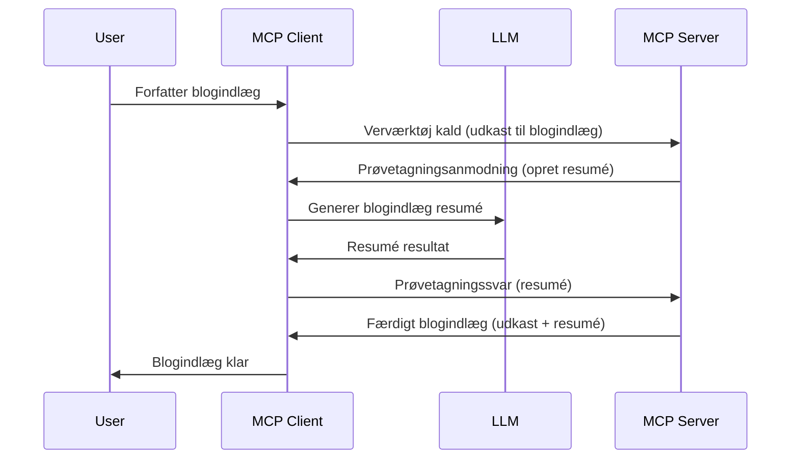

> [!WARNING]
> Sampling er udfaset i MCP `2026-07-28`. Denne lektion bevares for
> ældre implementeringer. Nye servere bør integrere direkte med en LLM
> leverandør-API.

# Sampling - deleger funktioner til klienten

> Sampling forbliver i `2026-07-28` specifikationen for kompatibilitet og
> kan fjernes i den første revision udgivet den 28. juli 2027 eller senere.
> Eksempler i denne lektion kan bruge SDK APIs, der implementerer `2025-11-25`.
> Se [What's Changed in MCP: The 2026-07-28 Specification](../../01-CoreConcepts/mcp-2026-07-28.md).

I ældre implementeringer lader Sampling en MCP-server anmode om hjælp fra en LLM,
der styres af klienten. For nye implementeringer skal du i stedet kalde den valgte LLM-leverandør
direkte.

Lad os udforske nogle brugsscenarier og hvordan man bygger en løsning med sampling.

## Oversigt

I denne lektion fokuserer vi på at forklare hvornår og hvor Sampling skal bruges, og hvordan den konfigureres.

## Læringsmål

I dette kapitel vil vi:

- Forklare hvad Sampling er, og hvornår det skal bruges.
- Vise hvordan Sampling konfigureres i MCP.
- Give eksempler på Sampling i praksis.

## Hvad er Sampling og hvorfor bruge det?

Sampling er en avanceret funktion, der fungerer på følgende måde:



### Sampling-forespørgsel

Ok, nu hvor vi har et overblik over et troværdigt scenarie, lad os tale om den sampling-forespørgsel serveren sender tilbage til klienten. Sådan kan en sådan forespørgsel se ud i JSON-RPC format:

```json
{
  "jsonrpc": "2.0",
  "id": 1,
  "method": "sampling/createMessage",
  "params": {
    "messages": [
      {
        "role": "user",
        "content": {
          "type": "text",
          "text": "Create a blog post summary of the following blog post: <BLOG POST>"
        }
      }
    ],
    "modelPreferences": {
      "hints": [
        {
          "name": "claude-3-sonnet"
        }
      ],
      "intelligencePriority": 0.8,
      "speedPriority": 0.5
    },
    "systemPrompt": "You are a helpful assistant.",
    "maxTokens": 100
  }
}
```

Der er et par ting værd at nævne her:

- Prompt, under content -> text, er vores prompt, en instruktion til LLM om at opsummere indholdet af et blogindlæg.

- **modelPreferences**. Denne sektion er netop det, en præference, en anbefaling om hvilken konfiguration, der skal bruges med LLM’en. Brugeren kan vælge at følge disse anbefalinger eller ændre dem. Her er anbefalinger om model, hastighed og intelligensprioritet.
- **systemPrompt**, dette er din normale system-prompt, som giver din LLM en personlighed og indeholder vejledende instruktioner.
- **maxTokens**, dette er en anden egenskab, der angiver, hvor mange tokens der anbefales brugt til opgaven.

### Sampling-svar

Dette svar er det, MCP-klienten ender med at sende tilbage til MCP-serveren og er resultatet af klientens kald til LLM, vente på svaret og derefter konstruere denne besked. Sådan kan det se ud i JSON-RPC:

```json
{
  "jsonrpc": "2.0",
  "id": 1,
  "result": {
    "role": "assistant",
    "content": {
      "type": "text",
      "text": "Here's your abstract <ABSTRACT>"
    },
    "model": "gpt-5",
    "stopReason": "endTurn"
  }
}
```

Bemærk, hvordan svaret er et abstrakt af blogindlægget, præcis som vi bad om. Bemærk også, hvordan den brugte `model` ikke er den, vi bad om, men "gpt-5" frem for "claude-3-sonnet". Dette illustrerer, at brugeren kan ændre mening om, hvad der skal bruges, og at din sampling-forespørgsel blot er en anbefaling.

Ok, nu hvor vi forstår hovedflowet, og nyttige opgaver at bruge det til, "oprettelse af blogindlæg + abstrakt", lad os se på hvad der skal til for at få det til at virke.

### Beskedyper

Sampling-beskeder er ikke begrænset til kun tekst, men du kan også sende billeder og lyd. Her er hvordan JSON-RPC ser anderledes ud:

**Tekst**

```json
{
  "type": "text",
  "text": "The message content"
}
```

**Billedindhold**

```json
{
  "type": "image",
  "data": "base64-encoded-image-data",
  "mimeType": "image/jpeg"
}
```

**Lydindhold**

```json
{
  "type": "audio",
  "data": "base64-encoded-audio-data",
  "mimeType": "audio/wav"
}
```

> NOTE: For aktuel status og migrationsvejledning, se
> [udfaset Sampling dokumentation](https://modelcontextprotocol.io/specification/2026-07-28/client/sampling).

## Sådan konfigureres Sampling i klienten

> Bemærk: hvis du kun bygger en server, behøver du ikke gøre meget her.

I en klient skal du specificere følgende feature på denne måde:

```json
{
  "capabilities": {
    "sampling": {}
  }
}
```

Dette vil så blive opfanget, når din valgte klient initialiseres med serveren.

## Eksempel på Sampling i praksis - Opret et blogindlæg

Lad os kode en sampling-server sammen, vi skal gøre følgende:

1. Opret et værktøj på serveren.
1. Dette værktøj skal lave en sampling-forespørgsel.
1. Værktøjet skal vente på, at klientens sampling-forespørgsel besvares.
1. Derefter skal værktøjsresultatet produceres.

Lad os se koden trin for trin:

### -1- Opret værktøjet

**python**

```python
@mcp.tool()
async def create_blog(title: str, content: str, ctx: Context[ServerSession, None]) -> str:
    """Create a blog post and generate a summary"""

```

### -2- Opret en sampling-forespørgsel

Udvid dit værktøj med følgende kode:

**python**

```python
post = BlogPost(
        id=len(posts) + 1,
        title=title,
        content=content,
        abstract=""
    )

prompt = f"Create an abstract of the following blog post: title: {title} and draft: {content} "

result = await ctx.session.create_message(
        messages=[
            SamplingMessage(
                role="user",
                content=TextContent(type="text", text=prompt),
            )
        ],
        max_tokens=100,
)

```

### -3- Vent på svar og returner svaret

**python**

```python
post.abstract = result.content.text

posts.append(post)

# returner det komplette produkt
return json.dumps({
    "id": post.title,
    "abstract": post.abstract
})
```

### -4- Fuld kode

**python**

```python
from starlette.applications import Starlette
from starlette.routing import Mount, Host

from mcp.server.fastmcp import Context, FastMCP

from mcp.server.session import ServerSession
from mcp.types import SamplingMessage, TextContent

import json


from uuid import uuid4
from typing import List
from pydantic import BaseModel


mcp = FastMCP("Blog post generator")

# app = FastAPI()

posts = []

class BlogPost(BaseModel):
    id: int
    title: str
    content: str
    abstract: str

posts: List[BlogPost] = []

@mcp.tool()
async def create_blog(title: str, content: str, ctx: Context[ServerSession, None]) -> str:
    """Create a blog post and generate a summary"""

    post = BlogPost(
        id=len(posts) + 1,
        title=title,
        content=content,
        abstract=""
    )

    prompt = f"Create an abstract of the following blog post: title: {title} and draft: {content} "

    result = await ctx.session.create_message(
        messages=[
            SamplingMessage(
                role="user",
                content=TextContent(type="text", text=prompt),
            )
        ],
        max_tokens=100,
    )

    post.abstract = result.content.text

    posts.append(post)

    # returner det komplette blogindlæg
    return json.dumps({
        "id": post.title,
        "abstract": post.abstract
    })

if __name__ == "__main__":
    print("Starting server...")
    # mcp.kør()
    mcp.run(transport="streamable-http")

# kør app med: python server.py
```

### -5- Test i Visual Studio Code

For at teste dette i Visual Studio Code, gør følgende:

1. Start serveren i terminalen.
1. Tilføj den til *mcp.json* (og sørg for den er startet), f.eks. sådan:

   ```json
   "servers": {
      "blog-server": {
        "type": "http",
        "url": "http://localhost:8000/mcp"
      }
   }
   ```

1. Skriv en prompt:

   ```text
   create a blog post named "Where Python comes from", the content is "Python is actually named after Monty Python Flying Circus"
   ```

1. Tillad sampling. Første gang du tester dette, vil du få en ekstra dialog, som du skal acceptere, derefter vil du se den normale dialog, der beder dig køre et værktøj.

1. Undersøg resultaterne. Du vil se resultaterne flot gengivet i GitHub Copilot Chat, men du kan også inspicere det rå JSON-svar.

**Bonus**. Visual Studio Code-værktøjer har god støtte for sampling. Du kan konfigurere Sampling-adgang på din installerede server ved at navigere til den på denne måde:

1. Gå til udvidelsessektionen.
1. Vælg tandhjulsikonet for din installerede server i sektionen "MCP SERVERS - INSTALLED".
1 Vælg "Configure Model Access", her kan du vælge hvilke modeller GitHub Copilot må bruge ved sampling. Du kan også se alle nylige sampling-forespørgsler ved at vælge "Show Sampling requests".

## Opgave

I denne opgave skal du bygge en lidt anden Sampling, nemlig en sampling-integration, der understøtter generering af en produktbeskrivelse. Her er dit scenarie:

**Scenarie**: Backoffice-medarbejderen hos en e-handelsvirksomhed har brug for hjælp, det tager alt for lang tid at generere produktbeskrivelser. Derfor skal du bygge en løsning, hvor du kan kalde et værktøj "create_product" med "title" og "keywords" som argumenter, og det skal producere et komplet produkt inklusive et "description" felt, som skal udfyldes af en LLM styret af klienten.

TIP: brug det, du lærte tidligere, til at konstruere denne server og værktøj ved hjælp af en sampling-forespørgsel.

## Løsning

[Solution](./solution/README.md)

## Vigtige takeaways

Sampling er en kraftfuld funktion, der tillader serveren at delegere opgaver til klienten, når den har brug for hjælp fra en LLM.

## Hvad er næste skridt

- [Kapitel 4 - Praktisk implementering](../../04-PracticalImplementation/README.md)

---

<!-- CO-OP TRANSLATOR DISCLAIMER START -->
**Ansvarsfraskrivelse**:
Dette dokument er blevet oversat ved hjælp af AI-oversættelsestjenesten [Co-op Translator](https://github.com/Azure/co-op-translator). Selvom vi bestræber os på nøjagtighed, skal du være opmærksom på, at automatiserede oversættelser kan indeholde fejl eller unøjagtigheder. Det originale dokument på dets oprindelige sprog bør betragtes som den autoritative kilde. For kritisk information anbefales professionel menneskelig oversættelse. Vi påtager os intet ansvar for misforståelser eller fejltolkninger, der opstår som følge af brugen af denne oversættelse.
<!-- CO-OP TRANSLATOR DISCLAIMER END -->