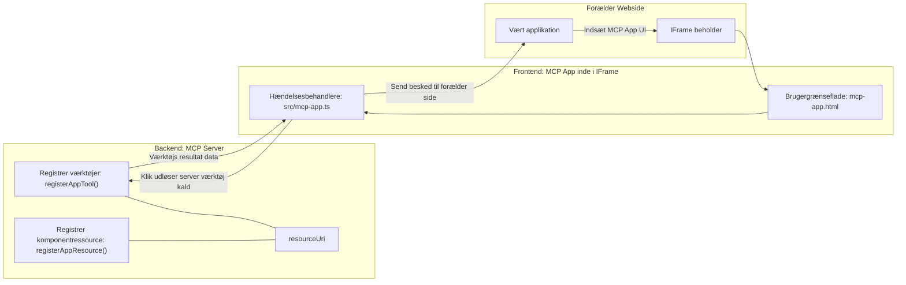
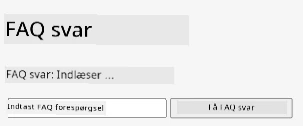
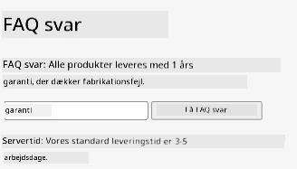
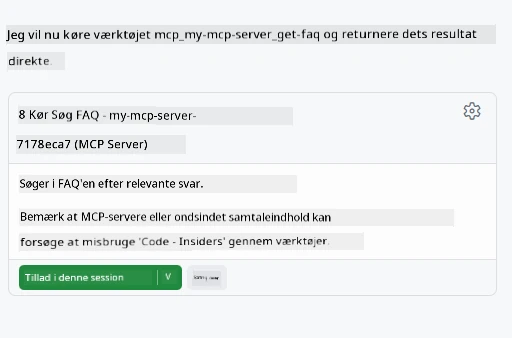

# MCP Apps

MCP Apps er et nyt paradigme inden for MCP. Idéen er, at du ikke kun svarer med data tilbage fra et værktøjskald, men du giver også information om, hvordan denne information skal interageres med. Det betyder, at værktøjsresultater nu kan indeholde UI-information. Men hvorfor skulle vi dog ønske det? Tja, tænk på, hvordan du gør ting i dag. Du bruger sandsynligvis resultaterne af en MCP Server ved at sætte en slags frontend foran, det er kode, du skal skrive og vedligeholde. Nogle gange er det, hvad du vil, men nogle gange ville det være fantastisk, hvis du bare kunne bringe et uddrag af information, der er selvstændigt og har det hele fra data til brugerflade.

## Oversigt

Denne lektion giver praktisk vejledning om MCP Apps, hvordan du kommer i gang med det, og hvordan du integrerer det i dine eksisterende Web Apps. MCP Apps er en meget ny tilføjelse til MCP-standarden.

## Læringsmål

Ved slutningen af denne lektion vil du kunne:

- Forklare hvad MCP Apps er.
- Hvornår man skal bruge MCP Apps.
- Bygge og integrere dine egne MCP Apps.

## MCP Apps - hvordan fungerer det

Idéen med MCP Apps er at levere et svar, som dybest set er en komponent, der skal gengives. En sådan komponent kan have både visuelle elementer og interaktivitet, f.eks. knapklik, brugerinput og mere. Lad os starte med serversiden og vores MCP Server. For at skabe en MCP App-komponent skal du både oprette et værktøj og applikationsressourcen. Disse to dele forbindes via en resourceUri.

Her er et eksempel. Lad os prøve at visualisere, hvad der er involveret, og hvilke dele der gør hvad:

```text
server.ts -- responsible for registering tools and the component as a UI component
src/
  mcp-app.ts -- wiring up event handlers
mcp-app.html -- the user interface
```

Denne visuelle fremstilling beskriver arkitekturen for at skabe en komponent og dens logik.


Lad os prøve at beskrive ansvarsområderne næste for backend og frontend henholdsvis.

### Backend

Der er to ting, vi skal opnå her:

- Registrere de værktøjer, vi ønsker at interagere med.
- Definere komponenten.

**Registrering af værktøjet**

```typescript
registerAppTool(
    server,
    "get-time",
    {
      title: "Get Time",
      description: "Returns the current server time.",
      inputSchema: {},
      _meta: { ui: { resourceUri } }, // Binder dette værktøj til dets UI-ressource
    },
    async () => {
      const time = new Date().toISOString();
      return { content: [{ type: "text", text: time }] };
    },
  );

```

Den foregående kode beskriver adfærden, hvor den eksponerer et værktøj kaldet `get-time`. Det tager ingen input, men producerer den aktuelle tid. Vi har mulighed for at definere et `inputSchema` for værktøjer, hvor vi skal kunne acceptere brugerinput.

**Registrering af komponenten**

I den samme fil skal vi også registrere komponenten:

```typescript
const resourceUri = "ui://get-time/mcp-app.html";

// Registrer ressourcen, som returnerer den pakkede HTML/JavaScript til brugergrænsefladen.
registerAppResource(
  server,
  resourceUri,
  resourceUri,
  { mimeType: RESOURCE_MIME_TYPE },
  async () => {
    const html = await fs.readFile(path.join(DIST_DIR, "mcp-app.html"), "utf-8");

    return {
    contents: [
        { uri: resourceUri, mimeType: RESOURCE_MIME_TYPE, text: html },
    ],
    };
  },
);
```

Bemærk, hvordan vi nævner `resourceUri` for at forbinde komponenten med dens værktøjer. Interessant er også callback-funktionen, hvor vi loader UI-filen og returnerer komponenten.

### Frontend for komponenten

Ligesom backend er der to dele her:

- En frontend skrevet i ren HTML.
- Kode, der håndterer events og hvad der skal ske, f.eks. kald til værktøjer eller beskeder til forældrevinduet.

**Brugergrænseflade**

Lad os se på brugergrænsefladen.

```html
<!-- mcp-app.html -->
<!DOCTYPE html>
<html lang="en">
  <head>
    <meta charset="UTF-8" />
    <title>Get Time App</title>
  </head>
  <body>
    <p>
      <strong>Server Time:</strong> <code id="server-time">Loading...</code>
    </p>
    <button id="get-time-btn">Get Server Time</button>
    <script type="module" src="/src/mcp-app.ts"></script>
  </body>
</html>
```

**Event-opsætning**

Den sidste del er event-opsætningen. Det betyder, at vi identificerer, hvilken del af vores UI der skal have event handlers, og hvad der skal ske, hvis events udløses:

```typescript
// mcp-app.ts

import { App } from "@modelcontextprotocol/ext-apps";

// Hent elementreferencer
const serverTimeEl = document.getElementById("server-time")!;
const getTimeBtn = document.getElementById("get-time-btn")!;

// Opret app-instans
const app = new App({ name: "Get Time App", version: "1.0.0" });

// Håndter værktøjsresultater fra serveren. Sæt før `app.connect()` for at undgå
// at gå glip af det indledende værktøjsresultat.
app.ontoolresult = (result) => {
  const time = result.content?.find((c) => c.type === "text")?.text;
  serverTimeEl.textContent = time ?? "[ERROR]";
};

// Tilknyt knapklik
getTimeBtn.addEventListener("click", async () => {
  // `app.callServerTool()` lader UI anmode om frisk data fra serveren
  const result = await app.callServerTool({ name: "get-time", arguments: {} });
  const time = result.content?.find((c) => c.type === "text")?.text;
  serverTimeEl.textContent = time ?? "[ERROR]";
});

// Forbind til vært
app.connect();
```

Som du kan se fra ovenstående, er dette normal kode til at koble DOM-elementer til events. Værd at fremhæve er kaldet til `callServerTool`, som ender med at kalde et værktøj på backend.

## Håndtering af brugerinput

Indtil videre har vi set en komponent, der har en knap, som ved klik kalder et værktøj. Lad os se, om vi kan tilføje flere UI-elementer som et inputfelt og se, om vi kan sende argumenter til et værktøj. Lad os implementere en FAQ-funktionalitet. Sådan skal det fungere:

- Der skal være en knap og et inputelement, hvor brugeren skriver et nøgleord for at søge efter for eksempel "Shipping". Dette skal kalde et værktøj på backend, der laver et søg i FAQ-data.
- Et værktøj, der understøtter den nævnte FAQ-søgning.

Lad os tilføje den nødvendige support til backend først:

```typescript
const faq: { [key: string]: string } = {
    "shipping": "Our standard shipping time is 3-5 business days.",
    "return policy": "You can return any item within 30 days of purchase.",
    "warranty": "All products come with a 1-year warranty covering manufacturing defects.",
  }

registerAppTool(
    server,
    "get-faq",
    {
      title: "Search FAQ",
      description: "Searches the FAQ for relevant answers.",
      inputSchema: zod.object({
        query: zod.string().default("shipping"),
      }),
      _meta: { ui: { resourceUri: faqResourceUri } }, // Binder dette værktøj til dets UI-ressource
    },
    async ({ query }) => {
      const answer: string = faq[query.toLowerCase()] || "Sorry, I don't have an answer for that.";
      return { content: [{ type: "text", text: answer }] };
    },
  );
```

Det, vi ser her, er, hvordan vi udfylder `inputSchema` og giver det et `zod`-skema som sådan:

```typescript
inputSchema: zod.object({
  query: zod.string().default("shipping"),
})
```

I ovenstående skema erklærer vi, at vi har en inputparameter kaldet `query`, og at den er valgfri med en standardværdi på "shipping".

Okay, lad os gå videre til *mcp-app.html* for at se, hvilket UI vi skal oprette til dette:

```html
<div class="faq">
    <h1>FAQ response</h1>
    <p>FAQ Response: <code id="faq-response">Loading...</code></p>
    <input type="text" id="faq-query" placeholder="Enter FAQ query" />
    <button id="get-faq-btn">Get FAQ Response</button>
  </div>
```

Fantastisk, nu har vi et inputelement og en knap. Lad os gå videre til *mcp-app.ts* for at forbinde disse events:

```typescript
const getFaqBtn = document.getElementById("get-faq-btn")!;
const faqQueryInput = document.getElementById("faq-query") as HTMLInputElement;

getFaqBtn.addEventListener("click", async () => {
  const query = faqQueryInput.value;
  const result = await app.callServerTool({ name: "get-faq", arguments: { query } });
  const faq = result.content?.find((c) => c.type === "text")?.text;
  faqResponseEl.textContent = faq ?? "[ERROR]";
});
```

I koden ovenfor:

- Opretter vi referencer til de interessante UI-elementer.
- Håndterer vi et knapklik for at udtrække værdien fra inputelementet, og vi kalder også `app.callServerTool()` med `name` og `arguments`, hvor sidstnævnte sender `query` som værdi.

Hvad der faktisk sker, når du kalder `callServerTool`, er, at det sender en besked til forældrevinduet, og det vindue ender med at kalde MCP Serveren.

### Prøv det af

Når vi prøver dette, bør vi nu se følgende:



og her prøver vi med input som "warranty"



For at køre denne kode, gå til [Kodeafsnittet](./code/README.md)

## Test i Visual Studio Code

Visual Studio Code har god støtte for MVP Apps og er sandsynligvis en af de nemmeste måder at teste dine MCP Apps på. For at bruge Visual Studio Code skal du tilføje en serverpost til *mcp.json* sådan her:

```json
"my-mcp-server-7178eca7": {
    "url": "http://localhost:3001/mcp",
    "type": "http"
  }
```

Start derefter serveren, og du skulle kunne kommunikere med din MVP App gennem Chat-vinduet, forudsat at du har installeret GitHub Copilot.

ved at udløse via prompt, for eksempel "#get-faq":



og ligesom når du kørte den gennem en webbrowser, gengiver den på samme måde således:


## Opgave

Lav et sten-saks-papir spil. Det skal bestå af følgende:

UI:

- en dropdown-liste med valgmuligheder
- en knap til at indsende et valg
- en etiket, der viser, hvem der valgte hvad, og hvem der vandt

Server:

- skal have et værktøj rock paper scissor, der tager "choice" som input. Det skal også gengive et computer-valg og afgøre vinderen

## Løsning

[Løsning](./assignment/README.md)

## Resumé

Vi lærte om dette nye paradigme MCP Apps. Det er et nyt paradigme, der tillader MCP Servere at have en mening ikke kun om dataene, men også om hvordan disse data skal præsenteres.

Derudover lærte vi, at disse MCP Apps hostes i en IFrame, og for at kommunikere med MCP Servere skal de sende beskeder til den overordnede webapp. Der findes flere biblioteker både til almindelig JavaScript og React med flere, som gør denne kommunikation nemmere.

## Vigtige pointer

Her er, hvad du lærte:

- MCP Apps er en ny standard, der kan være nyttig, når du vil sende både data og UI-funktioner.
- Disse typer apps kører i en IFrame af sikkerhedsmæssige årsager.

## Hvad er næste skridt

- [Kapitel 4](../../04-PracticalImplementation/README.md)

---

<!-- CO-OP TRANSLATOR DISCLAIMER START -->
**Ansvarsfraskrivelse**:
Dette dokument er blevet oversat ved hjælp af AI-oversættelsestjenesten [Co-op Translator](https://github.com/Azure/co-op-translator). Selvom vi bestræber os på nøjagtighed, skal du være opmærksom på, at automatiske oversættelser kan indeholde fejl eller unøjagtigheder. Det oprindelige dokument på dets oprindelige sprog bør betragtes som den autoritative kilde. For kritisk information anbefales professionel menneskelig oversættelse. Vi påtager os ikke ansvar for eventuelle misforståelser eller fejltolkninger, der måtte opstå som følge af brugen af denne oversættelse.
<!-- CO-OP TRANSLATOR DISCLAIMER END -->