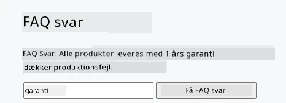
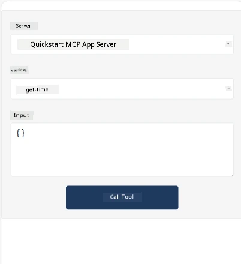
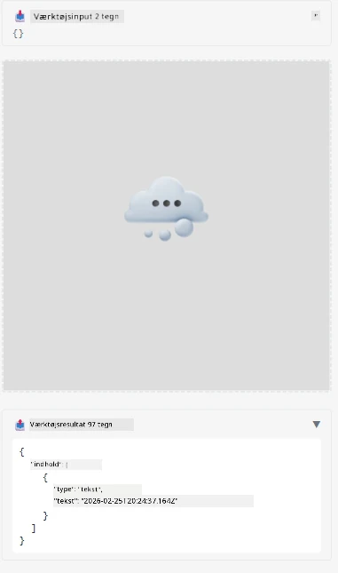

Her er et eksempel, der demonstrerer MCP App

## Installer

1. Naviger til mappen *mcp-app*
1. Kør `npm install`, dette skulle installere frontend- og backend-afhængigheder

Bekræft at backend kompilerer ved at køre:

```sh
npx tsc --noEmit
```

Der bør ikke være nogen output, hvis alt er i orden.

## Kør backend

> Dette kræver lidt ekstra arbejde, hvis du er på en Windows-maskine, da MCP Apps-løsningen bruger `concurrently` biblioteket, som du skal finde et alternativ til. Her er den problematiske linje i *package.json* på MCP App:

    ```json
    "start": "concurrently \"cross-env NODE_ENV=development INPUT=mcp-app.html vite build --watch\" \"tsx watch main.ts\""
    ```

Denne app har to dele, en backend-del og en host-del.

Start backend ved at kalde:

```sh
npm start
```

Dette skulle starte backenden på `http://localhost:3001/mcp`.

> Bemærk, hvis du er i en Codespace, skal du muligvis sætte portens synlighed til offentlig. Tjek at du kan nå endpointet i browseren via https://<navn på Codespace>.app.github.dev/mcp

## Valgmulighed -1 Test appen i Visual Studio Code

For at teste løsningen i Visual Studio Code, gør følgende:

- Tilføj en serverpost i `mcp.json` som følger:

    ```json
    {
        "servers": {
            "my-mcp-server-7178eca7": {
                "url": "http://localhost:3001/mcp",
                "type": "http"
            }
        },
        "inputs": []
    }
    ```

1. Klik på "start" knappen i *mcp.json*
1. Sørg for, at et chatvindue er åbent og skriv `get-faq`, du bør se et resultat som følger:

    

## Valgmulighed -2- Test appen med en host

Repoet <https://github.com/modelcontextprotocol/ext-apps> indeholder flere forskellige hosts, som du kan bruge til at teste dine MVP Apps.

Vi præsenterer to forskellige muligheder her:

### Lokal maskine

- Naviger til *ext-apps* efter du har klonet repoet.

- Installer afhængigheder

   ```sh
   npm install
   ```

- I et separat terminalvindue, naviger til *ext-apps/examples/basic-host*

    > Hvis du er i Codespace, skal du navigere til serve.ts og linje 27 og erstatte http://localhost:3001/mcp med din Codespace URL til backenden, for eksempel https://psychic-xylophone-657rpjgvxpc5g64-3001.app.github.dev/mcp

- Kør hosten:

    ```sh
    npm start
    ```

    Dette skulle forbinde hosten med backenden, og du skulle se appen køre som følger:

    

### Codespace

Det kræver lidt ekstra arbejde at få et Codespace-miljø til at fungere. For at bruge en host gennem Codespace:

- Se mappen *ext-apps* og naviger til *examples/basic-host*.
- Kør `npm install` for at installere afhængigheder
- Kør `npm start` for at starte hosten.

## Test appen

Prøv appen på følgende måde:

- Vælg "Call Tool" knappen, og du skulle se resultater som følger:

    

Fantastisk, det fungerer alt sammen.

---

<!-- CO-OP TRANSLATOR DISCLAIMER START -->
**Ansvarsfraskrivelse**:
Dette dokument er blevet oversat ved hjælp af AI-oversættelsestjenesten [Co-op Translator](https://github.com/Azure/co-op-translator). Selvom vi bestræber os på nøjagtighed, bedes du være opmærksom på, at automatiserede oversættelser kan indeholde fejl eller unøjagtigheder. Det oprindelige dokument på dets modersmål bør betragtes som den autoritative kilde. For kritisk information anbefales professionel menneskelig oversættelse. Vi påtager os intet ansvar for misforståelser eller fejltolkninger, der måtte opstå som følge af brugen af denne oversættelse.
<!-- CO-OP TRANSLATOR DISCLAIMER END -->