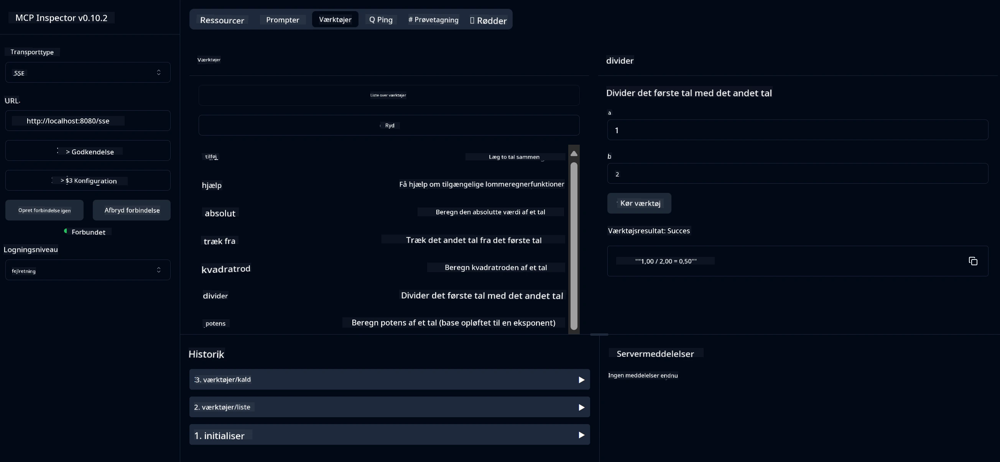

# Grundlæggende Lommeregner MCP Service

> [!NOTE]
> Dette eksempel bruger den ældre HTTP+SSE transport og retter sig mod et SDK kompatibelt
> med MCP `2025-11-25`. Nye fjernservere bør benytte `2026-07-28` Streamable
> HTTP support.

Denne service leverer grundlæggende lommeregneroperationer gennem Model Context Protocol (MCP) ved hjælp af Spring Boot med WebFlux transport. Det er designet som et enkelt eksempel for begyndere, der lærer om MCP-implementeringer.

For mere information, se [MCP Server Boot Starter](https://docs.spring.io/spring-ai/reference/api/mcp/mcp-server-boot-starter-docs.html) reference dokumentationen.

## Oversigt

Servicen demonstrerer:
- Support til SSE (Server-Sent Events)
- Automatisk værktøjsregistrering ved hjælp af Spring AI's `@Tool` annotation
- Grundlæggende lommeregnerfunktioner:
  - Addition, subtraktion, multiplikation, division
  - Eksponentberegning og kvadratrod
  - Modulus (rest) og absolut værdi
  - Hjælpefunktion til operationbeskrivelser

## Funktioner

Denne lommeregner-service tilbyder følgende funktionaliteter:

1. **Grundlæggende Aritmetiske Operationer**:
   - Addition af to tal
   - Subtraktion af et tal fra et andet
   - Multiplikation af to tal
   - Division af et tal med et andet (med nul divisionskontrol)

2. **Avancerede Operationer**:
   - Eksponentberegning (ophævning af en base til en eksponent)
   - Kvadratrodsberegning (med kontrol for negative tal)
   - Modulus (rest) beregning
   - Beregning af absolut værdi

3. **Hjælpesystem**:
   - Indbygget hjælpefunktion, der forklarer alle tilgængelige operationer

## Brug af Servicen

Servicen udstiller følgende API endpoints gennem MCP protokollen:

- `add(a, b)`: Læg to tal sammen
- `subtract(a, b)`: Træk det andet tal fra det første
- `multiply(a, b)`: Gange to tal
- `divide(a, b)`: Divider det første tal med det andet (med nul-kontrol)
- `power(base, exponent)`: Beregn potens af et tal
- `squareRoot(number)`: Beregn kvadratroden (med kontrol for negative tal)
- `modulus(a, b)`: Beregn resten ved division
- `absolute(number)`: Beregn den absolutte værdi
- `help()`: Få information om tilgængelige operationer

## Testklient

En simpel testklient er inkluderet i pakken `com.microsoft.mcp.sample.client`. Klassen `SampleCalculatorClient` demonstrerer de tilgængelige operationer i lommeregner-servicen.

## Brug af LangChain4j Klient

Projektet inkluderer et eksempel på en LangChain4j klient i `com.microsoft.mcp.sample.client.LangChain4jClient`, som demonstrerer integration af lommeregner-servicen med LangChain4j og GitHub modeller:

### Forudsætninger

1. **GitHub Tokenopsætning**:
   
   For at bruge GitHubs AI modeller (som phi-4), behøver du et personlig adgangstoken fra GitHub:

   a. Gå til dine GitHub kontoindstillinger: https://github.com/settings/tokens
   
   b. Klik på "Generate new token" → "Generate new token (classic)"
   
   c. Giv dit token et beskrivende navn
   
   d. Vælg følgende scopes:
      - `repo` (Fuld kontrol med private repositories)
      - `read:org` (Læs organisations- og teammedlemskab, læs organisationsprojekter)
      - `gist` (Opret gists)
      - `user:email` (Adgang til brugerens email adresser (read-only))
   
   e. Klik på "Generate token" og kopier dit nye token
   
   f. Sæt det som en miljøvariabel:
      
      På Windows:
      ```
      set GITHUB_TOKEN=your-github-token
      ```
      
      På macOS/Linux:
      ```bash
      export GITHUB_TOKEN=your-github-token
      ```

   g. For permanent opsætning, tilføj det til dine miljøvariabler via systemindstillinger

2. Tilføj LangChain4j GitHub afhængigheden til dit projekt (allerede inkluderet i pom.xml):
   ```xml
   <dependency>
       <groupId>dev.langchain4j</groupId>
       <artifactId>langchain4j-github</artifactId>
       <version>${langchain4j.version}</version>
   </dependency>
   ```

3. Sørg for at lommeregner serveren kører på `localhost:8080`

### Kørsel af LangChain4j Klient

Dette eksempel demonstrerer:
- Forbindelse til lommeregner MCP serveren via SSE transport
- Brug af LangChain4j til at skabe en chatbot, der udnytter lommeregnerfunktioner
- Integration med GitHub AI modeller (nu med phi-4 modellen)

Klienten sender følgende eksempelspørgsmål for at demonstrere funktionalitet:
1. Beregning af summen af to tal
2. Find kvadratroden af et tal
3. Få hjælpeinformation om tilgængelige lommeregneroperationer

Kør eksemplet og tjek konsoloutputtet for at se, hvordan AI-modellen bruger lommeregner-værktøjerne til at svare på forespørgsler.

### GitHub Modelkonfiguration

LangChain4j klienten er konfigureret til at bruge GitHubs phi-4 model med følgende indstillinger:

```java
ChatLanguageModel model = GitHubChatModel.builder()
    .apiKey(System.getenv("GITHUB_TOKEN"))
    .timeout(Duration.ofSeconds(60))
    .modelName("phi-4")
    .logRequests(true)
    .logResponses(true)
    .build();
```

For at bruge andre GitHub modeller, skift blot `modelName` parameteren til en anden understøttet model (f.eks. "claude-3-haiku-20240307", "llama-3-70b-8192", osv.).

## Afhængigheder

Projektet kræver følgende nøgleafhængigheder:

```xml
<!-- For MCP Server -->
<dependency>
    <groupId>org.springframework.ai</groupId>
    <artifactId>spring-ai-starter-mcp-server-webflux</artifactId>
</dependency>

<!-- For LangChain4j integration -->
<dependency>
    <groupId>dev.langchain4j</groupId>
    <artifactId>langchain4j-mcp</artifactId>
    <version>${langchain4j.version}</version>
</dependency>

<!-- For GitHub models support -->
<dependency>
    <groupId>dev.langchain4j</groupId>
    <artifactId>langchain4j-github</artifactId>
    <version>${langchain4j.version}</version>
</dependency>
```

## Bygning af Projektet

Byg projektet med Maven:
```bash
./mvnw clean install -DskipTests
```

## Kørsel af Serveren

### Brug af Java

```bash
java -jar target/calculator-server-0.0.1-SNAPSHOT.jar
```

### Brug af MCP Inspector

MCP Inspector er et nyttigt værktøj til at interagere med MCP services. For at bruge det med denne lommeregner service:

1. **Installer og kør MCP Inspector** i et nyt terminalvindue:
   ```bash
   npx @modelcontextprotocol/inspector
   ```

2. **Adgang til web UI** ved at klikke på den URL, som appen viser (typisk http://localhost:6274)

3. **Konfigurer forbindelsen**:
   - Sæt transporttypen til "SSE"
   - Sæt URL til din kørende servers SSE endpoint: `http://localhost:8080/sse`
   - Klik på "Connect"

4. **Brug værktøjerne**:
   - Klik på "List Tools" for at se tilgængelige lommeregneroperationer
   - Vælg et værktøj og klik "Run Tool" for at udføre en operation



### Brug af Docker

Projektet inkluderer en Dockerfile til containeriseret udrulning:

1. **Byg Docker-billedet**:
   ```bash
   docker build -t calculator-mcp-service .
   ```

2. **Kør Docker-containere**:
   ```bash
   docker run -p 8080:8080 calculator-mcp-service
   ```

Dette vil:
- Bygge et multi-stage Docker-billede med Maven 3.9.9 og Eclipse Temurin 24 JDK
- Oprette et optimeret containerbillede
- Eksponere servicen på port 8080
- Starte MCP lommeregner-servicen inde i containeren

Du kan tilgå servicen på `http://localhost:8080` når containeren kører.

## Fejlfinding

### Almindelige Problemer med GitHub Token

1. **Token Tilladelsesproblemer**: Hvis du får en 403 Forbidden fejl, tjek om dit token har de korrekte rettigheder som angivet i forudsætningerne.

2. **Token Ikke Fundet**: Hvis du får en "No API key found" fejl, sikre at miljøvariablen GITHUB_TOKEN er sat korrekt.

3. **Rate Begrænsning**: GitHub API har begrænsninger for antal kald. Hvis du rammer en rate limit fejl (statuskode 429), vent et par minutter og prøv igen.

4. **Token Udløb**: GitHub tokens kan udløbe. Hvis du modtager autentificeringsfejl efter noget tid, generer et nyt token og opdater din miljøvariabel.

Hvis du har brug for yderligere hjælp, se [LangChain4j dokumentationen](https://github.com/langchain4j/langchain4j) eller [GitHub API dokumentationen](https://docs.github.com/en/rest).

---

<!-- CO-OP TRANSLATOR DISCLAIMER START -->
**Ansvarsfraskrivelse**:
Dette dokument er blevet oversat ved hjælp af AI-oversættelsestjenesten [Co-op Translator](https://github.com/Azure/co-op-translator). Selvom vi bestræber os på nøjagtighed, skal du være opmærksom på, at automatiserede oversættelser kan indeholde fejl eller unøjagtigheder. Det originale dokument på dets oprindelige sprog bør betragtes som den autoritative kilde. For kritisk information anbefales professionel menneskelig oversættelse. Vi påtager os intet ansvar for misforståelser eller fejltolkninger, der opstår som følge af brugen af denne oversættelse.
<!-- CO-OP TRANSLATOR DISCLAIMER END -->