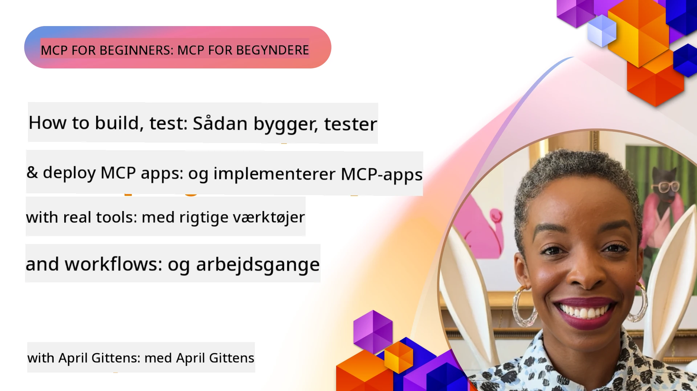

# Praktisk Implementering

[](https://youtu.be/vCN9-mKBDfQ)

_(Klik på billedet ovenfor for at se videoen af denne lektion)_

Praktisk implementering er, hvor kraften i Model Context Protocol (MCP) bliver håndgribelig. Selvom det er vigtigt at forstå teorien og arkitekturen bag MCP, opstår den reelle værdi, når du anvender disse koncepter til at bygge, teste og deployere løsninger, der løser virkelige problemer. Dette kapitel bygger bro mellem konceptuel viden og praktisk udvikling og guider dig gennem processen med at bringe MCP-baserede applikationer til live.

Uanset om du udvikler intelligente assistenter, integrerer AI i forretningsarbejdsprocesser eller bygger skræddersyede værktøjer til databehandling, giver MCP en fleksibel basis. Dets sprog-agnostiske design og officielle SDK’er til populære programmeringssprog gør det tilgængeligt for en bred vifte af udviklere. Ved at udnytte disse SDK’er kan du hurtigt prototype, iterere og skalere dine løsninger på tværs af forskellige platforme og miljøer.

I de følgende afsnit finder du praktiske eksempler, eksempel-kode og deployeringsstrategier, der demonstrerer, hvordan man implementerer MCP i C#, Java med Spring, TypeScript, JavaScript og Python. Du vil også lære, hvordan du debugger og tester dine MCP-servere, administrerer API’er og deployer løsninger til skyen ved hjælp af Azure. Disse praktiske ressourcer er designet til at accelerere din læring og hjælpe dig med trygt at bygge robuste, produktionsklare MCP-applikationer.

## Oversigt

Denne lektion fokuserer på praktiske aspekter af MCP-implementering på tværs af flere programmeringssprog. Vi vil udforske, hvordan man bruger MCP SDK’er i C#, Java med Spring, TypeScript, JavaScript og Python til at bygge robuste applikationer, debugge og teste MCP-servere samt skabe genanvendelige ressourcer, prompts og værktøjer.

## Læringsmål

Ved slutningen af denne lektion vil du kunne:

- Implementere MCP-løsninger ved hjælp af officielle SDK’er i forskellige programmeringssprog
- Debugge og teste MCP-servere systematisk
- Oprette og bruge serverfunktioner (Ressourcer, Prompts og Værktøjer)
- Designe effektive MCP-arbejdsprocesser til komplekse opgaver
- Optimere MCP-implementeringer for ydeevne og pålidelighed

## Officielle SDK-ressourcer

Model Context Protocol tilbyder officielle SDK’er til flere sprog (i overensstemmelse med [MCP Specification 2025-11-25](https://spec.modelcontextprotocol.io/specification/2025-11-25/)):

- [C# SDK](https://github.com/modelcontextprotocol/csharp-sdk)
- [Java med Spring SDK](https://github.com/modelcontextprotocol/java-sdk) **Bemærk:** kræver afhængighed af [Project Reactor](https://projectreactor.io). (Se [diskussionssag 246](https://github.com/orgs/modelcontextprotocol/discussions/246).)
- [TypeScript SDK](https://github.com/modelcontextprotocol/typescript-sdk)
- [Python SDK](https://github.com/modelcontextprotocol/python-sdk)
- [Kotlin SDK](https://github.com/modelcontextprotocol/kotlin-sdk)
- [Go SDK](https://github.com/modelcontextprotocol/go-sdk)

## Arbejde med MCP SDK’er

Dette afsnit giver praktiske eksempler på implementering af MCP på tværs af flere programmeringssprog. Du kan finde eksempel-kode i `samples`-mappen organiseret efter sprog.

### Tilgængelige eksempler

Repository'et indeholder [prøveimplementeringer](../../../04-PracticalImplementation/samples) i følgende sprog:

- [C#](./samples/csharp/README.md)
- [Java med Spring](./samples/java/containerapp/README.md)
- [TypeScript](./samples/typescript/README.md)
- [JavaScript](./samples/javascript/README.md)
- [Python](./samples/python/README.md)

Hver prøve demonstrerer nøglekoncepter og implementationsmønstre for MCP for det specifikke sprog og økosystem.

### Praktiske guider

Yderligere guider til praktisk MCP-implementering:

- [Pagination og store resultatsæt](./pagination/README.md) - Håndterer cursor-baseret paginering for værktøjer, ressourcer og store datamængder

## Centrale serverfunktioner

MCP-servere kan implementere enhver kombination af disse funktioner:

### Ressourcer

Ressourcer leverer kontekst og data, som brugeren eller AI-modellen kan bruge:

- Dokumentarkiver
- Vidensbaser
- Strukturerede datakilder
- Filsystemer

### Prompts

Prompts er skabelonbaserede beskeder og arbejdsprocesser til brugere:

- Foruddefinerede samtaleskabeloner
- Guidede interaktionsmønstre
- Specialiserede dialogstrukturer

### Værktøjer

Værktøjer er funktioner, som AI-modellen kan udføre:

- Data-behandlingsværktøjer
- Eksterne API-integrationer
- Beregningskapaciteter
- Søgningfunktionalitet

## Eksempelinplementeringer: C# implementering

Det officielle C# SDK-repository indeholder flere prøveimplementeringer, der demonstrerer forskellige aspekter af MCP:

- **Basic MCP Client**: Simpelt eksempel der viser, hvordan man opretter en MCP-klient og kalder værktøjer
- **Basic MCP Server**: Minimal serverimplementering med grundlæggende værktøjsregistrering
- **Advanced MCP Server**: Fuldt udstyret server med værktøjsregistrering, godkendelse og fejlhåndtering
- **ASP.NET-integration**: Eksempler der demonstrerer integration med ASP.NET Core
- **Værktøjsimplementeringsmønstre**: Forskellige mønstre til implementering af værktøjer med varierende kompleksitet

MCP C# SDK er i preview, og API’er kan ændre sig. Vi vil løbende opdatere denne blog, efterhånden som SDK’en udvikler sig.

### Nøglefunktioner

- [C# MCP Nuget ModelContextProtocol](https://www.nuget.org/packages/ModelContextProtocol)
- Byg din [første MCP Server](https://devblogs.microsoft.com/dotnet/build-a-model-context-protocol-mcp-server-in-csharp/).

For komplette C# implementationsprøver, besøg det [officielle C# SDK eksempelsrepository](https://github.com/modelcontextprotocol/csharp-sdk)

## Eksempelinplementering: Java med Spring implementering

Java med Spring SDK tilbyder robuste MCP-implementeringsmuligheder med enterprise-grade funktioner.

### Nøglefunktioner

- Spring Framework-integration
- Stærk typesikkerhed
- Support for reaktiv programmering
- Omfattende fejlhåndtering

For et komplet Java med Spring implementeringseksempel, se [Java med Spring eksempel](samples/java/containerapp/README.md) i mappen med prøver.

## Eksempelinplementering: JavaScript implementering

JavaScript SDK tilbyder en letvægts og fleksibel tilgang til MCP-implementering.

### Nøglefunktioner

- Node.js og browser support
- Promise-baseret API
- Let integration med Express og andre frameworks
- WebSocket support til streaming

For et komplet JavaScript implementeringseksempel, se [JavaScript eksempel](samples/javascript/README.md) i mappen med prøver.

## Eksempelinplementering: Python implementering

Python SDK tilbyder en pythonisk tilgang til MCP-implementering med fremragende integrationsmuligheder til ML-rammer.

### Nøglefunktioner

- Async/await support med asyncio
- FastAPI integration
- Enkel værktøjsregistrering
- Naturlig integration med populære ML-biblioteker

For et komplet Python implementeringseksempel, se [Python eksempel](samples/python/README.md) i mappen med prøver.

## API-administration

Azure API Management er et godt svar på, hvordan vi kan sikre MCP-servere. Ideen er at placere en Azure API Management-forekomst foran din MCP-server og lade den håndtere funktioner, du sandsynligvis vil ønske som:

- ratebegrænsning
- tokenhåndtering
- overvågning
- load balancing
- sikkerhed

### Azure-eksempel

Her er et Azure-eksempel, der gør netop det, dvs. [opretter en MCP-server og sikrer den med Azure API Management](https://github.com/Azure-Samples/remote-mcp-apim-functions-python).

Se, hvordan autorisationsflowet foregår i nedenstående billede:


I det foregående billede sker følgende:

- Authentication/Authorization foregår via Microsoft Entra.
- Azure API Management fungerer som en gateway og bruger politikker til at dirigere og administrere trafik.
- Azure Monitor logger alle anmodninger til yderligere analyse.

#### Autorisationsflow

Lad os kigge nærmere på autorisationsflowet:


#### MCP autorisationsspecifikation

Læs mere om [MCP Authorization specification](https://spec.modelcontextprotocol.io/specification/2025-11-25/basic/authorization/)

## Deploy fjern-MCP-server til Azure

Lad os se, om vi kan deployere det eksempel, vi nævnte tidligere:

1. Klon repo’en

    ```bash
    git clone https://github.com/Azure-Samples/remote-mcp-apim-functions-python.git
    cd remote-mcp-apim-functions-python
    ```

1. Registrer `Microsoft.App` resource provider.

   - Hvis du bruger Azure CLI, kør `az provider register --namespace Microsoft.App --wait`.
   - Hvis du bruger Azure PowerShell, kør `Register-AzResourceProvider -ProviderNamespace Microsoft.App`. Kør derefter `(Get-AzResourceProvider -ProviderNamespace Microsoft.App).RegistrationState` efter noget tid for at tjekke, om registreringen er fuldført.

1. Kør denne [azd](https://aka.ms/azd) kommando for at provisionere API Management-servicen, function app (med kode) og alle andre nødvendige Azure-ressourcer

    ```shell
    azd up
    ```

    Denne kommando bør deployere alle cloud-ressourcer på Azure

### Test din server med MCP Inspector

1. I et **nyt terminalvindue**, installer og kør MCP Inspector

    ```shell
    npx @modelcontextprotocol/inspector
    ```

    Du burde se et interface lignende:

    

1. CTRL-klik for at indlæse MCP Inspector web-app’en fra den URL, som app’en viser (f.eks. [http://127.0.0.1:6274/#resources](http://127.0.0.1:6274/#resources))
1. Sæt transporttypen til `SSE`
1. Sæt URL’en til din kørende API Management SSE-endpoint, som vises efter `azd up`, og klik på **Connect**:

    ```shell
    https://<apim-servicename-from-azd-output>.azure-api.net/mcp/sse
    ```

1. **List Tools**. Klik på et værktøj og **Run Tool**.

Hvis alle trin er gennemført korrekt, bør du nu være forbundet til MCP-serveren, og du har kunne kalde et værktøj.

## MCP-servere til Azure

[Remote-mcp-functions](https://github.com/Azure-Samples/remote-mcp-functions-dotnet): Denne samling af repositories er en hurtigstartskabelon til at bygge og deploye tilpassede fjern-MCP (Model Context Protocol) servere ved brug af Azure Functions med Python, C# .NET eller Node/TypeScript.

Prøverne leverer en komplet løsning, der gør det muligt for udviklere at:

- Bygge og køre lokalt: Udvikle og debugge en MCP-server på en lokal maskine
- Deployere til Azure: Let deployere til skyen med en simpel azd up-kommando
- Forbinde fra klienter: Forbinde til MCP-serveren fra forskellige klienter inklusive VS Code’s Copilot agent mode og MCP Inspector værktøjet

### Nøglefunktioner

- Sikkerhed by design: MCP-serveren sikres med nøgler og HTTPS
- Godkendelsesmuligheder: Understøtter OAuth via indbygget auth og/eller API Management
- Netværksisolation: Muliggjort ved brug af Azure Virtual Networks (VNET)
- Serverless arkitektur: Udnytter Azure Functions til skalerbar, event-drevet eksekvering
- Lokal udvikling: Omfattende lokal udviklings- og debug-support
- Enkel deployment: Strømlinet deployeringsproces til Azure

Repository indeholder alle nødvendige konfigurationsfiler, kildekode og infrastrukturdefinitioner for hurtigt at komme i gang med en produktionsklar MCP-serverimplementering.

- [Azure Remote MCP Functions Python](https://github.com/Azure-Samples/remote-mcp-functions-python) - Eksempelinplementering af MCP ved brug af Azure Functions med Python

- [Azure Remote MCP Functions .NET](https://github.com/Azure-Samples/remote-mcp-functions-dotnet) - Eksempelinplementering af MCP ved brug af Azure Functions med C# .NET

- [Azure Remote MCP Functions Node/Typescript](https://github.com/Azure-Samples/remote-mcp-functions-typescript) - Eksempelinplementering af MCP ved brug af Azure Functions med Node/TypeScript.

## Vigtige pointer

- MCP SDK’er tilbyder sprogspecifikke værktøjer til implementering af robuste MCP-løsninger
- Debugging og testproces er kritisk for pålidelige MCP-applikationer
- Genanvendelige promptskabeloner muliggør konsistente AI-interaktioner
- Veludformede workflows kan orkestrere komplekse opgaver med flere værktøjer
- Implementering af MCP-løsninger kræver hensyntagen til sikkerhed, ydeevne og fejlhåndtering

## Øvelse

Design en praktisk MCP-workflow, der adresserer et virkeligt problem inden for dit område:

1. Identificer 3-4 værktøjer, der ville være nyttige til at løse dette problem
2. Lav et workflowdiagram, der viser, hvordan disse værktøjer interagerer
3. Implementer en grundlæggende version af et af værktøjerne ved hjælp af dit foretrukne sprog
4. Opret en promptskabelon, der kan hjælpe modellen med effektivt at bruge dit værktøj

## Yderligere ressourcer

---

## Hvad kommer nu

Næste: [Avancerede Emner](../05-AdvancedTopics/README.md)

---

<!-- CO-OP TRANSLATOR DISCLAIMER START -->
**Ansvarsfraskrivelse**:
Dette dokument er blevet oversat ved hjælp af AI-oversættelsestjenesten [Co-op Translator](https://github.com/Azure/co-op-translator). Selvom vi bestræber os på nøjagtighed, bedes du være opmærksom på, at automatiserede oversættelser kan indeholde fejl eller unøjagtigheder. Det oprindelige dokument på dets modersmål bør betragtes som den autoritative kilde. For kritisk information anbefales professionel menneskelig oversættelse. Vi påtager os intet ansvar for misforståelser eller fejltolkninger, der måtte opstå ved brug af denne oversættelse.
<!-- CO-OP TRANSLATOR DISCLAIMER END -->