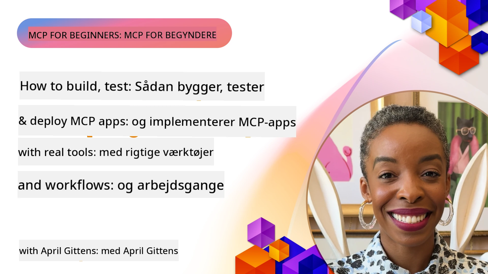
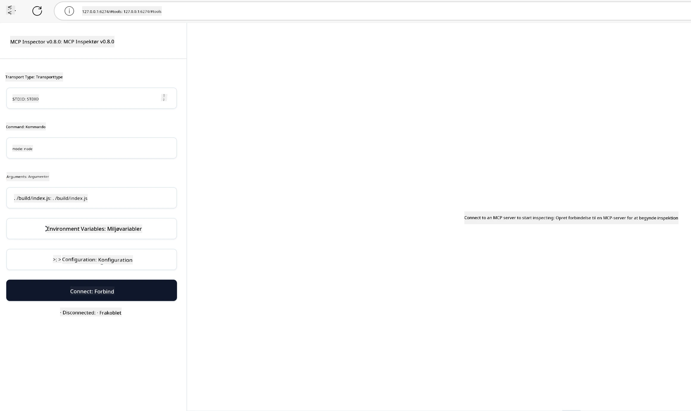

# Praktisk Implementering

[](https://youtu.be/vCN9-mKBDfQ)

_(Klik på billedet ovenfor for at se videoen til denne lektion)_

Praktisk implementering er, hvor kraften i Model Context Protocol (MCP) bliver håndgribelig. Mens forståelsen af teorien og arkitekturen bag MCP er vigtig, opstår den reelle værdi, når du anvender disse koncepter til at bygge, teste og deploye løsninger, der løser virkelige problemer. Dette kapitel bygger bro mellem konceptuel viden og praktisk udvikling og guider dig gennem processen med at bringe MCP-baserede applikationer til live.

Uanset om du udvikler intelligente assistenter, integrerer AI i forretningsarbejdsgange eller bygger skræddersyede værktøjer til databehandling, giver MCP et fleksibelt fundament. Dets sprog-agnostiske design og officielle SDK’er til populære programmeringssprog gør det tilgængeligt for en bred vifte af udviklere. Ved at udnytte disse SDK’er kan du hurtigt prototype, iterere og skalere dine løsninger på tværs af forskellige platforme og miljøer.

I de følgende sektioner finder du praktiske eksempler, eksempel-kode og deployeringsstrategier, der demonstrerer, hvordan du implementerer MCP i C#, Java med Spring, TypeScript, JavaScript og Python. Du vil også lære, hvordan du debugger og tester dine MCP-servere, administrerer API’er og deployer løsninger til skyen ved hjælp af Azure. Disse praktiske ressourcer er designet til at accelerere din læring og hjælpe dig med trygt at bygge robuste, produktionsklare MCP-applikationer.

## Oversigt

Denne lektion fokuserer på praktiske aspekter af MCP-implementering på tværs af flere programmeringssprog. Vi vil udforske, hvordan man bruger MCP SDK’er i C#, Java med Spring, TypeScript, JavaScript og Python til at bygge robuste applikationer, debugge og teste MCP-servere og skabe genanvendelige ressourcer, prompts og værktøjer.

## Læringsmål

Ved slutningen af denne lektion vil du kunne:

- Implementere MCP-løsninger ved hjælp af officielle SDK’er på forskellige programmeringssprog
- Debugge og teste MCP-servere systematisk
- Oprette og bruge serverfunktioner (Ressourcer, Prompts og Værktøjer)
- Designe effektive MCP-arbejdsgange til komplekse opgaver
- Optimere MCP-implementeringer for ydeevne og pålidelighed

## Officielle SDK-ressourcer

Model Context Protocol tilbyder officielle SDK’er til flere sprog. SDK
understøttelse for MCP `2026-07-28` udgives uafhængigt, så tjek hver SDK’s
udgivelsesnoter og eksempel-pakkens version, før du antager protokol
kompatibilitet. Se den [officielle SDK-liste](https://modelcontextprotocol.io/docs/sdk):

- [C# SDK](https://github.com/modelcontextprotocol/csharp-sdk)
- [Java med Spring SDK](https://github.com/modelcontextprotocol/java-sdk) **Bemærk:** kræver afhængighed til [Project Reactor](https://projectreactor.io). (Se [diskussionsspørgsmål 246](https://github.com/orgs/modelcontextprotocol/discussions/246).)
- [TypeScript SDK](https://github.com/modelcontextprotocol/typescript-sdk)
- [Python SDK](https://github.com/modelcontextprotocol/python-sdk)
- [Kotlin SDK](https://github.com/modelcontextprotocol/kotlin-sdk)
- [Go SDK](https://github.com/modelcontextprotocol/go-sdk)

## Arbejde med MCP SDK’er

Denne sektion giver praktiske eksempler på implementering af MCP på tværs af flere programmeringssprog. Du kan finde eksempel-kode i `samples`-mappen organiseret efter sprog.

### Tilgængelige eksempler

Repositoryet indeholder [eksempelformål](../../../04-PracticalImplementation/samples) i følgende sprog:

- [C#](./samples/csharp/README.md)
- [Java med Spring](./samples/java/containerapp/README.md)
- [TypeScript](./samples/typescript/README.md)
- [JavaScript](./samples/javascript/README.md)
- [Python](./samples/python/README.md)

Hvert eksempel demonstrerer nøglekoncepter og implementeringsmønstre for MCP for det specifikke sprog og økosystem.

### Praktiske vejledninger

Yderligere vejledninger til praktisk MCP-implementering:

- [Pagination og store resultatsæt](./pagination/README.md) - Håndter cursor-baseret pagination for værktøjer, ressourcer og store datasæt

## Kerne-Serverfunktioner

MCP-servere kan implementere enhver kombination af disse funktioner:

### Ressourcer

Ressourcer giver kontekst og data til brugeren eller AI-modellen:

- Dokumentrepositories
- Vidensbaser
- Strukturerede datakilder
- Filsystemer

### Prompts

Prompts er skabelonbaserede beskeder og arbejdsgange til brugere:

- Foruddefinerede samtaleskabeloner
- Guidede interaktionsmønstre
- Specialiserede dialogstrukturer

### Værktøjer

Værktøjer er funktioner, som AI-modellen kan udføre:

- Databehandlingsværktøjer
- Eksterne API-integrationer
- Beregningskapaciteter
- Søgefunktionalitet

## Eksempelimprenteringer: C# Implementering

Det officielle C# SDK-repo indeholder flere eksempelimprenteringer, der demonstrerer forskellige aspekter af MCP:

- **Grundlæggende MCP-klient**: Simpelt eksempel, der viser, hvordan man opretter en MCP-klient og kalder værktøjer
- **Grundlæggende MCP-server**: Minimal serverimplementering med grundlæggende værktøjsregistrering
- **Avanceret MCP-server**: Full-featured server med værktøjsregistrering, autentificering og fejlhåndtering
- **ASP.NET-integration**: Eksempler, der demonstrerer integration med ASP.NET Core
- **Værktøjsimplementeringsmønstre**: Forskellige mønstre til at implementere værktøjer med varierende kompleksitetsniveauer

MCP C# SDK’et er i preview, og API’er kan ændre sig. Vi vil løbende opdatere denne blog, efterhånden som SDK’et udvikler sig.

### Nøglefunktioner

- [C# MCP Nuget ModelContextProtocol](https://www.nuget.org/packages/ModelContextProtocol)
- Byg din [første MCP-server](https://devblogs.microsoft.com/dotnet/build-a-model-context-protocol-mcp-server-in-csharp/).

For komplette eksempler på C#-implementering, besøg det [officielle C# SDK-eksemperepository](https://github.com/modelcontextprotocol/csharp-sdk)

## Eksempelimprentering: Java med Spring Implementering

Java med Spring SDK tilbyder robuste MCP-implementeringsmuligheder med enterprise-klare funktioner.

### Nøglefunktioner

- Spring Framework-integration
- Stark typesikkerhed
- Support for reaktiv programmering
- Omfattende fejlhåndtering

For et komplet eksempel på Java med Spring implementering, se [Java med Spring eksempel](samples/java/containerapp/README.md) i sample-mappen.

## Eksempelimprentering: JavaScript Implementering

JavaScript SDK’et tilbyder en letvægts- og fleksibel tilgang til MCP-implementering.

### Nøglefunktioner

- Node.js og browser-support
- Promise-baseret API
- Nem integration med Express og andre frameworks
- WebSocket support til streaming

For et komplet eksempel på JavaScript implementering, se [JavaScript eksempel](samples/javascript/README.md) i sample-mappen.

## Eksempelimprentering: Python Implementering

Python SDK’et tilbyder en pythonisk tilgang til MCP-implementering med fremragende ML-framework-integrationer.

### Nøglefunktioner

- Async/await support med asyncio
- FastAPI-integration``
- Enkel værktøjsregistrering
- Native integration med populære ML-biblioteker

For et komplet eksempel på Python implementering, se [Python eksempel](samples/python/README.md) i sample-mappen.

## API-administration

Azure API Management er et fremragende svar på, hvordan vi kan sikre MCP-servere. Ideen er at sætte en Azure API Management-instanse foran din MCP-server og lade den håndtere funktioner, du sandsynligvis vil have, som:

- ratebegrænsning
- token-administration
- overvågning
- load balancing
- sikkerhed

### Azure-eksempel

Her er et Azure-eksempel, der gør præcis det, dvs. [opretter en MCP-server og sikrer den med Azure API Management](https://github.com/Azure-Samples/remote-mcp-apim-functions-python).

Se, hvordan autorisationsflowet foregår i billedet nedenfor:


I det foregående billede sker følgende:

- Autentificering/Autorisation foregår ved hjælp af Microsoft Entra.
- Azure API Management fungerer som en gateway og bruger politikker til at dirigere og styre trafik.
- Azure Monitor logger alle forespørgsler til yderligere analyse.

#### Autorisationsflow

Lad os se nærmere på autorisationsflowet:


#### MCP autorisationsspecifikation

Læs mere om
[MCP Autorisationsspecifikation](https://modelcontextprotocol.io/specification/2026-07-28/basic/authorization/).

## Deploy fjern-MCP-server til Azure

Lad os se, om vi kan deploye det eksempel, vi nævnte tidligere:

1. Klon repoen

    ```bash
    git clone https://github.com/Azure-Samples/remote-mcp-apim-functions-python.git
    cd remote-mcp-apim-functions-python
    ```

1. Registrer `Microsoft.App` resource provider.

   - Hvis du bruger Azure CLI, kør `az provider register --namespace Microsoft.App --wait`.
   - Hvis du bruger Azure PowerShell, kør `Register-AzResourceProvider -ProviderNamespace Microsoft.App`. Derefter kør `(Get-AzResourceProvider -ProviderNamespace Microsoft.App).RegistrationState` efter noget tid for at tjekke, om registreringen er fuldført.

1. Kør denne [azd](https://aka.ms/azd) kommando for at provisionere apihanteringsservicen, function app (med kode) og alle andre nødvendige Azure-ressourcer

    ```shell
    azd up
    ```

    Denne kommando skal deploye alle skyressourcer på Azure

### Test af din server med MCP Inspector

1. I et **nyt terminalvindue**, installer og kør MCP Inspector

    ```shell
    npx @modelcontextprotocol/inspector
    ```

    Du bør se en grænseflade, der ligner:

    

1. CTRL-klik for at indlæse MCP Inspector webapp fra den URL, der vises af appen (f.eks. [http://127.0.0.1:6274/#resources](http://127.0.0.1:6274/#resources))
1. Sæt transporttypen til `SSE`
1. Sæt URL’en til dit kørende API Management SSE-endpoint, som vises efter `azd up`, og **Forbind**:

    ```shell
    https://<apim-servicename-from-azd-output>.azure-api.net/mcp/sse
    ```

1. **Liste Værktøjer**. Klik på et værktøj og **Kør værktøj**.  

Hvis alle trin har virket, burde du nu være forbundet til MCP-serveren, og du har været i stand til at kalde et værktøj.

## MCP-servere til Azure

[Remote-mcp-functions](https://github.com/Azure-Samples/remote-mcp-functions-dotnet): Dette sæt af repositorier er quickstart-skabeloner til at bygge og deploye brugerdefinerede fjern-MCP (Model Context Protocol) servere ved hjælp af Azure Functions med Python, C# .NET eller Node/TypeScript.

Eksemplerne giver en komplet løsning, der gør det muligt for udviklere at:

- Bygge og køre lokalt: Udvikle og debugge en MCP-server på en lokal maskine
- Deploye til Azure: Nem deployering til skyen med en simpel azd up-kommando
- Forbinde fra klienter: Forbind til MCP-serveren fra forskellige klienter, herunder VS Code’s Copilot agent-tilstand og MCP Inspector-værktøjet

### Nøglefunktioner

- Sikkerhed ved design: MCP-serveren sikres med nøgler og HTTPS
- Autentificeringsmuligheder: Understøtter OAuth med indbygget autentificering og/eller API Management
- Netværksisolation: Tillader netværksisolation ved hjælp af Azure Virtual Networks (VNET)
- Serverløs arkitektur: Udnytter Azure Functions for skalerbar, begivenhedsdrevet eksekvering
- Lokal udvikling: Omfattende lokal udvikling og debugging-support
- Enkel deployering: Forenklet deployeringsproces til Azure

Repositoryet indeholder alle nødvendige konfigurationsfiler, kildekode og infrastrukturdefinitioner for hurtigt at komme i gang med en produktionsklar MCP-serverimplementering.

- [Azure Remote MCP Functions Python](https://github.com/Azure-Samples/remote-mcp-functions-python) - Eksempellimplementering af MCP ved hjælp af Azure Functions med Python

- [Azure Remote MCP Functions .NET](https://github.com/Azure-Samples/remote-mcp-functions-dotnet) - Eksempellimplementering af MCP ved hjælp af Azure Functions med C# .NET

- [Azure Remote MCP Functions Node/Typescript](https://github.com/Azure-Samples/remote-mcp-functions-typescript) - Eksempellimplementering af MCP ved hjælp af Azure Functions med Node/TypeScript.

## Vigtige pointer

- MCP SDK’er leverer sprog-specifikke værktøjer til implementering af robuste MCP-løsninger
- Debugging- og testprocessen er kritisk for pålidelige MCP-applikationer
- Genanvendelige promptskabeloner muliggør konsistente AI-interaktioner
- Veludformede arbejdsgange kan orkestrere komplekse opgaver ved brug af flere værktøjer
- Implementering af MCP-løsninger kræver overvejelse af sikkerhed, ydeevne og fejlhåndtering

## Øvelse

Design en praktisk MCP-arbejdsgang, der adresserer et virkeligt problem inden for dit domæne:

1. Identificér 3-4 værktøjer, der ville være nyttige til at løse dette problem
2. Opret et arbejdsgangsdiagram, der viser, hvordan disse værktøjer interagerer
3. Implementer en grundlæggende version af et af værktøjerne med dit foretrukne sprog
4. Opret en promptskabelon, der hjælper modellen med effektivt at anvende dit værktøj

## Yderligere ressourcer

---

## Hvad er næste

Næste: [Avancerede Emner](../05-AdvancedTopics/README.md)

---

<!-- CO-OP TRANSLATOR DISCLAIMER START -->
**Ansvarsfraskrivelse**:
Dette dokument er blevet oversat ved hjælp af AI-oversættelsestjenesten [Co-op Translator](https://github.com/Azure/co-op-translator). Selvom vi bestræber os på nøjagtighed, skal du være opmærksom på, at automatiserede oversættelser kan indeholde fejl eller unøjagtigheder. Det originale dokument på dets oprindelige sprog bør betragtes som den autoritative kilde. For kritisk information anbefales professionel menneskelig oversættelse. Vi påtager os intet ansvar for misforståelser eller fejltolkninger, der opstår som følge af brugen af denne oversættelse.
<!-- CO-OP TRANSLATOR DISCLAIMER END -->