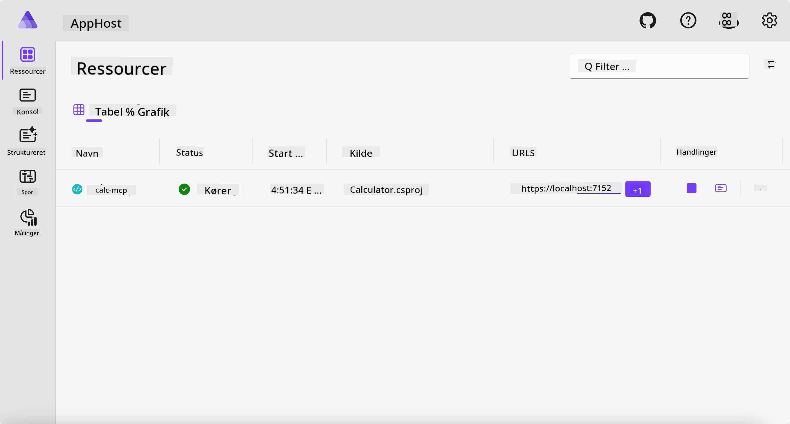
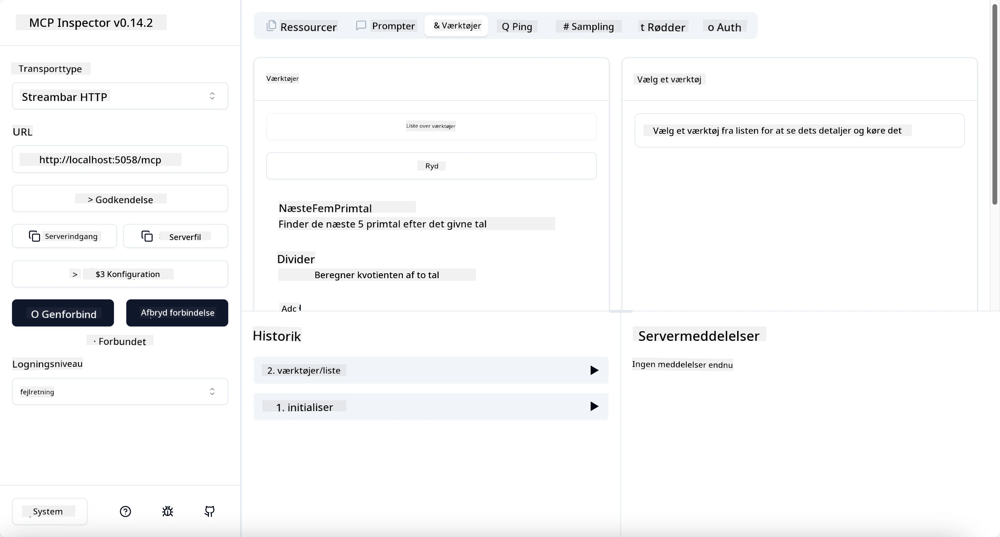
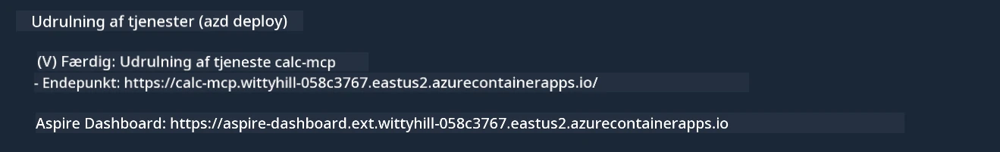

# Eksempel

Det tidligere eksempel viser, hvordan man bruger et lokalt .NET-projekt med `stdio` typen. Og hvordan man kører serveren lokalt i en container. Dette er en god løsning i mange situationer. Det kan dog være nyttigt at have serveren kørende eksternt, som i et cloud-miljø. Det er her, at `http` typen kommer ind.

Hvis man kigger på løsningen i mappen `04-PracticalImplementation`, kan det se meget mere komplekst ud end det tidligere eksempel. Men i virkeligheden er det det ikke. Hvis man ser nærmere på projektet `src/Calculator`, vil man se, at det stort set er den samme kode som i det tidligere eksempel. Den eneste forskel er, at vi bruger et andet bibliotek `ModelContextProtocol.AspNetCore` til at håndtere HTTP-forespørgslerne. Og vi ændrer metoden `IsPrime` til at være privat, bare for at vise, at man kan have private metoder i sin kode. Resten af koden er den samme som før.

De andre projekter kommer fra [Aspire](https://aspire.dev/get-started/what-is-aspire/). At have Aspire i løsningen vil forbedre udviklerens oplevelse under udvikling og test og hjælpe med observerbarhed. Det er ikke nødvendigt for at køre serveren, men det er god praksis at have det i sin løsning.

## Start serveren lokalt

1. Fra VS Code (med C# DevKit-udvidelsen) skal du navigere ned til mappen `04-PracticalImplementation/samples/csharp`.
1. Udfør følgende kommando for at starte serveren:

   ```bash
    dotnet watch run --project ./src/AppHost
   ```

1. Når en webbrowser åbner Aspire-dashboardet, skal du bemærke `http`-URL'en. Den burde være noget i stil med `http://localhost:5058/`.

   

## Test Streamable HTTP med MCP Inspector

Hvis du har Node.js 22.7.5 eller nyere, kan du bruge MCP Inspector til at teste din server.

Start serveren og kør følgende kommando i en terminal:

```bash
npx @modelcontextprotocol/inspector http://localhost:5058
```



- Vælg `Streamable HTTP` som transporttype.
- Indtast i Url-feltet den URL, som du noterede tidligere, og tilføj `/mcp`. Det skal være `http` (ikke `https`), noget i stil med `http://localhost:5058/mcp`.
- Vælg knappen Connect.

En god ting ved Inspector er, at den giver et godt overblik over, hvad der sker.

- Prøv at liste de tilgængelige værktøjer
- Prøv nogle af dem, det skulle virke på samme måde som før.

## Test MCP-server med GitHub Copilot Chat i VS Code

For at bruge Streamable HTTP-transporten med GitHub Copilot Chat skal du ændre konfigurationen af `calc-mcp` serveren, som du tidligere oprettede, så den ser sådan ud:

```jsonc
// .vscode/mcp.json
{
  "servers": {
    "calc-mcp": {
      "type": "http",
      "url": "http://localhost:5058/mcp"
    }
  }
}
```

Foretag nogle tests:

- Spørg efter "3 primtal efter 6780". Bemærk at Copilot vil bruge de nye værktøjer `NextFivePrimeNumbers` og kun returnere de første 3 primtal.
- Spørg efter "7 primtal efter 111" for at se, hvad der sker.
- Spørg efter "John har 24 slikkepinde og vil fordele dem alle til sine 3 børn. Hvor mange slikkepinde har hvert barn?", for at se, hvad der sker.

## Udrul serveren til Azure

Lad os udrulle serveren til Azure, så flere kan bruge den.

Fra en terminal skal du navigere til mappen `04-PracticalImplementation/samples/csharp` og køre følgende kommando:

```bash
azd up
```

Når udrulningen er færdig, bør du se en besked som denne:



Tag URL'en og brug den i MCP Inspector og i GitHub Copilot Chat.

```jsonc
// .vscode/mcp.json
{
  "servers": {
    "calc-mcp": {
      "type": "http",
      "url": "https://calc-mcp.gentleriver-3977fbcf.australiaeast.azurecontainerapps.io/mcp"
    }
  }
}
```

## Hvad så nu?

Vi prøver forskellige transporttyper og testværktøjer. Vi udruller også din MCP-server til Azure. Men hvad hvis vores server har brug for adgang til private ressourcer? For eksempel en database eller en privat API? I det næste kapitel vil vi se, hvordan vi kan forbedre sikkerheden for vores server.

---

<!-- CO-OP TRANSLATOR DISCLAIMER START -->
**Ansvarsfraskrivelse**:
Dette dokument er blevet oversat ved hjælp af AI-oversættelsestjenesten [Co-op Translator](https://github.com/Azure/co-op-translator). Selvom vi bestræber os på nøjagtighed, skal du være opmærksom på, at automatiserede oversættelser kan indeholde fejl eller unøjagtigheder. Det originale dokument på dets oprindelige sprog bør betragtes som den autoritative kilde. For kritisk information anbefales professionel menneskelig oversættelse. Vi påtager os intet ansvar for misforståelser eller fejltolkninger, der opstår som følge af brugen af denne oversættelse.
<!-- CO-OP TRANSLATOR DISCLAIMER END -->