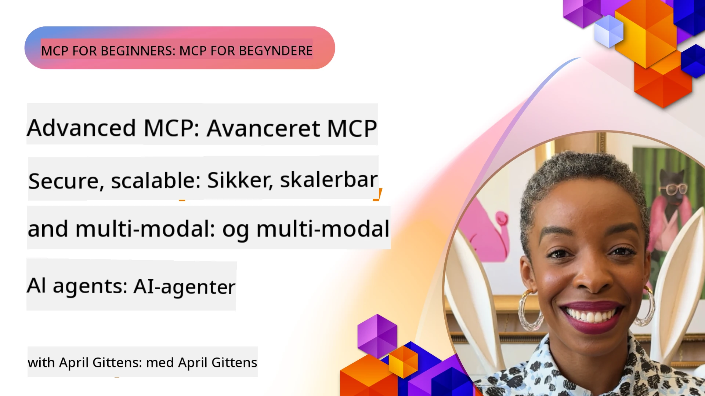

# Avancerede emner i MCP

_(Klik på billedet ovenfor for at se videoen af denne lektion)_

Dette kapitel dækker en række avancerede emner inden for Model Context Protocol (MCP) implementering, herunder multimodal integration, skalerbarhed, bedste sikkerhedspraksis og virksomhedsintegration. Disse emner er afgørende for at bygge robuste og produktionsklare MCP-applikationer, der kan imødekomme kravene fra moderne AI-systemer.

## Oversigt

Denne lektion udforsker avancerede koncepter i Model Context Protocol-implementering med fokus på multimodal integration, skalerbarhed, bedste sikkerhedspraksis og virksomhedsintegration. Disse emner er nødvendige for at bygge produktionsmodne MCP-applikationer, der kan håndtere komplekse krav i virksomhedsmiljøer.

> **Nuværende specifikationsnote:** MCP `2026-07-28` udfaser Roots- og
> Sampling-primitiverne, som blev gennemgået i lektion 5.4 og 5.6. Den flytter også
> den eksperimentelle Tasks-funktion nævnt i Protocol Features (5.16) til en
> dedikeret Tasks-udvidelse. Disse lektioner beholdes til legacy
> `2025-11-25` implementeringer og inkluderer migrationsvejledning. Se
> [Hvad er ændret i MCP: Specifikationen 2026-07-28](../01-CoreConcepts/mcp-2026-07-28.md).

## Læringsmål

Når du har afsluttet denne lektion, vil du kunne:

- Implementere multimodale funktioner inden for MCP-rammer
- Designe skalerbare MCP-arkitekturer til scenarier med høje krav
- Anvende bedste sikkerhedspraksis i overensstemmelse med MCP's sikkerhedsprincipper
- Integrere MCP med virksomheders AI-systemer og -rammer
- Optimere ydeevne og pålidelighed i produktionsmiljøer

## Lektioner og eksempler på projekter

| Link | Titel | Beskrivelse |
|------|-------|-------------|
| [5.1 Integration med Azure](./mcp-integration/README.md) | Integration med Azure | Lær hvordan du integrerer din MCP-server på Azure |
| [5.2 Multimodalt eksempel](./mcp-multi-modality/README.md) | MCP multimodale eksempler | Eksempler på lyd, billede og multimodalt svar |
| [5.3 MCP OAuth2 eksempel](../../../05-AdvancedTopics/mcp-oauth2-demo) | MCP OAuth2 demo | Minimal Spring Boot-app der viser OAuth2 med MCP, både som autorisations- og ressourceserver. Demonstrerer sikker token-udstedelse, beskyttede endepunkter, Azure Container Apps-udrulning og API Management-integration. |
| [5.4 Root Contexts](./mcp-root-contexts/README.md) | Root contexts | Lær legacy `2025-11-25` Roots-primitivet og aktuelle migrationsmuligheder (udfaset i `2026-07-28`) |
| [5.5 Routing](./mcp-routing/README.md) | Routing | Lær forskellige typer routing |
| [5.6 Sampling](./mcp-sampling/README.md) | Sampling | Lær legacy `2025-11-25` Sampling-primitivet og aktuelle migrationsmuligheder (udfaset i `2026-07-28`) |
| [5.7 Skalering](./mcp-scaling/README.md) | Skalering | Lær om skalering |
| [5.8 Sikkerhed](./mcp-security/README.md) | Sikkerhed | Sikr din MCP-server |
| [5.9 Websøgnings-eksempel](./web-search-mcp/README.md) | Web Search MCP | Python MCP-server og klient, der integrerer med SerpAPI til realtidsweb-, nyheds-, produkt-søgning og Q&A. Demonstrerer multi-tool orkestrering, ekstern API-integration og robust fejlhåndtering. |
| [5.10 Realtidsstreaming](./mcp-realtimestreaming/README.md) | Streaming | Realtids data streaming er blevet essentielt i dagens datadrevne verden, hvor virksomheder og applikationer har brug for øjeblikkelig adgang til information for at træffe rettidige beslutninger. |
| [5.11 Realtids websøgnings](./mcp-realtimesearch/README.md) | Web Search | Realtids websøgnings – hvordan MCP transformerer realtids websøgning ved at tilbyde en standardiseret tilgang til kontekststyring på tværs af AI-modeller, søgemaskiner og applikationer. |
| [5.12 Entra ID Authentication for Model Context Protocol Servers](./mcp-security-entra/README.md) | Entra ID Authentication | Microsoft Entra ID tilbyder en robust cloudbaseret identitets- og adgangsstyringsløsning, som sikrer, at kun autoriserede brugere og applikationer kan interagere med din MCP-server. |
| [5.13 Microsoft Foundry Agent Integration](./mcp-foundry-agent-integration/README.md) | Microsoft Foundry Integration | Lær hvordan du integrerer Model Context Protocol-servere med Microsoft Foundry-agenter, hvilket muliggør kraftfuld værktøjsorkestrering og virksomhedens AI-muligheder med standardiserede eksterne datakildeforbindelser. |
| [5.14 Context Engineering](./mcp-contextengineering/README.md) | Context Engineering | Fremtidige muligheder for kontekstteknikker til MCP-servere, herunder kontekstoptimering, dynamisk kontekststyring og strategier til effektiv prompt engineering inden for MCP-rammer. |
| [5.15 MCP Custom Transport](./mcp-transport/README.md) | Custom Transport | Lær hvordan man implementerer tilpassede transportmekanismer til specialiserede MCP-kommunikationsscenarier. |
| [5.16 Protocol Features Deep Dive](./mcp-protocol-features/README.md) | Protocol Features | Mestre avancerede protokolfunktioner inklusive fremskridtsnotifikationer, annullering af forespørgsler, ressourcetemplater og mønstre for fejlhåndtering. |
| [5.17 Adversarial Multi-Agent Reasoning](./mcp-adversarial-agents/README.md) | Adversarial Agents | Brug to agenter med modstridende positioner, der deler et enkelt MCP værktøjssæt, for at fange hallucinationer, afdække kanttilfælde og producere bedre kalibrerede output gennem struktureret debat. |

> **Historisk `2025-11-25` note:** denne revision introducerede eksperimentelle
> Tasks og udvidede flere protokolfunktioner. I `2026-07-28` blev Tasks
> flyttet til en officiel udvidelse og Roots blev udfaset. Brug ikke
> `2025-11-25` funktionsstatus som aktuel vejledning; se
> [2026-07-28 changelog](https://modelcontextprotocol.io/specification/2026-07-28/changelog).

## Yderligere referencer

For den mest opdaterede information om avancerede MCP-emner, se:
- [MCP Dokumentation](https://modelcontextprotocol.io/)
- [MCP Specifikation (2026-07-28)](https://modelcontextprotocol.io/specification/2026-07-28/)
- [GitHub Repository](https://github.com/modelcontextprotocol)
- [OWASP MCP Top 10](https://microsoft.github.io/mcp-azure-security-guide/mcp/) - Sikkerhedsrisici og afbødning
- [MCP Security Summit Workshop (Sherpa)](https://azure-samples.github.io/sherpa/) - Praktisk sikkerhedstræning

## Vigtige pointer

- Multimodale MCP-implementeringer udvider AI-kapaciteter ud over tekstbehandling
- Skalerbarhed er essentielt for virksomheders udrulning og kan adresseres gennem horisontal og vertikal skalerbarhed
- Omfattende sikkerhedsforanstaltninger beskytter data og sikrer korrekt adgangskontrol
- Virksomhedsintegration med platforme som Azure OpenAI og Microsoft AI Foundry forbedrer MCP-kapaciteter
- Avancerede MCP-implementeringer drager fordel af optimerede arkitekturer og omhyggelig ressourcestyring

## Øvelse

Design en MCP-implementering i virksomhedsklasse til et specifikt brugstilfælde:

1. Identificer multimodale krav til dit brugstilfælde
2. Skitser de nødvendige sikkerhedskontroller for at beskytte følsomme data
3. Design en skalerbar arkitektur, der kan håndtere varierende belastning
4. Planlæg integrationspunkter med virksomhedens AI-systemer
5. Dokumenter potentielle ydeevneflaskehalse og afbødningsstrategier

## Yderligere ressourcer

- [Azure OpenAI Dokumentation](https://learn.microsoft.com/en-us/azure/ai-services/openai/)
- [Microsoft AI Foundry Dokumentation](https://learn.microsoft.com/en-us/ai-services/)

---

## Hvad nu?

Udforsk lektionerne i denne modul begyndende med: [5.1 MCP Integration](./mcp-integration/README.md)

Når du har gennemført denne modul, fortsæt til: [Modul 6: Community Bidrag](../06-CommunityContributions/README.md)

---

<!-- CO-OP TRANSLATOR DISCLAIMER START -->
**Ansvarsfraskrivelse**:
Dette dokument er blevet oversat ved hjælp af AI-oversættelsestjenesten [Co-op Translator](https://github.com/Azure/co-op-translator). Selvom vi bestræber os på nøjagtighed, skal du være opmærksom på, at automatiserede oversættelser kan indeholde fejl eller unøjagtigheder. Det originale dokument på dets oprindelige sprog bør betragtes som den autoritative kilde. For kritisk information anbefales professionel menneskelig oversættelse. Vi påtager os intet ansvar for misforståelser eller fejltolkninger, der opstår som følge af brugen af denne oversættelse.
<!-- CO-OP TRANSLATOR DISCLAIMER END -->