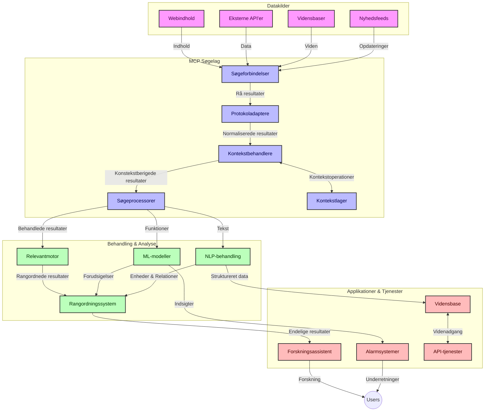
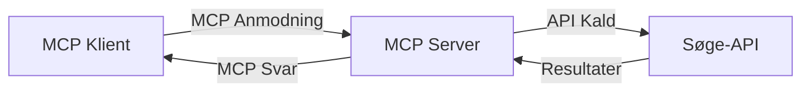
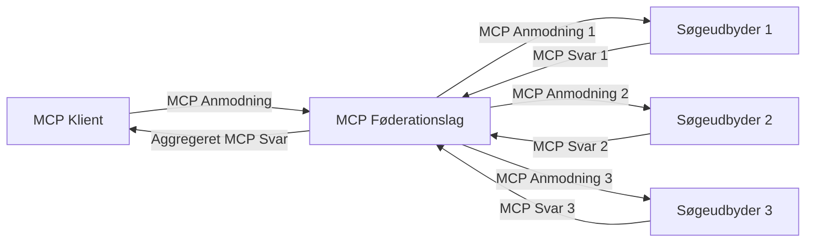
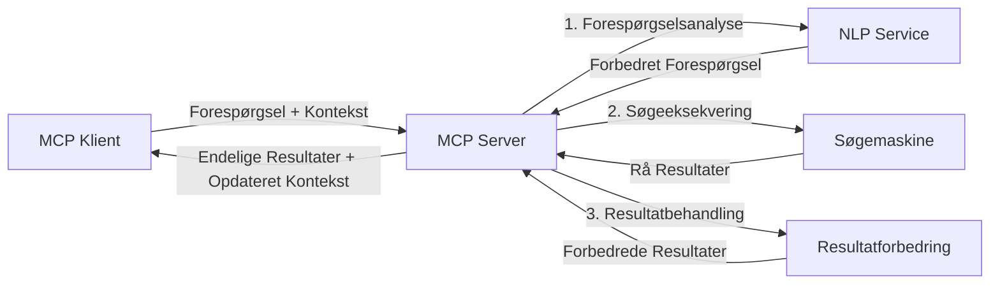

# Model Context Protocol for Real-Time Web Search

## Oversigt

Realtidssøgning på nettet er blevet essentielt i dagens informationsdrevne miljø, hvor applikationer har brug for øjeblikkelig adgang til opdaterede oplysninger på internettet for at levere relevante og rettidige svar. Model Context Protocol (MCP) repræsenterer et betydeligt fremskridt i optimering af disse realtime søgeprocesser, der forbedrer søgeeffektivitet, opretholder kontekstuel integritet og forbedrer den samlede systemydelse.

Denne modul udforsker, hvordan MCP transformerer realtime søgning på nettet ved at tilbyde en standardiseret tilgang til kontekststyring på tværs af AI-modeller, søgemaskiner og applikationer.

### Det vil du lære

I denne omfattende vejledning vil du opdage:

- Hvordan MCP skaber en sømløs bro mellem AI-modeller og realtime web-søgefunktioner
- Arkitekturprincipper for implementering af effektive og skalerbare søgeløsninger med MCP
- Teknikker til bevarelse af søgekontekst på tværs af flere forespørgsler og interaktioner
- Praktiske kodeimplementeringer i Python og JavaScript til forskellige søgescenarier
- Metoder til at balancere relevans, aktualitet og ydeevne i MCP-drevne søgesystemer

## Introduktion til Real-Time Web Search

Realtidssøgning på nettet er en teknologisk tilgang, der muliggør kontinuerlig forespørgsel, behandling og analyse af webbaserede oplysninger, efterhånden som de publiceres eller opdateres, hvilket tillader systemer at levere frisk og relevant information med minimal forsinkelse. I modsætning til traditionelle søgesystemer, der opererer på indekserede data, som kan være timer eller dage gamle, bearbejder realtime søgning levende data fra nettet og leverer indsigt og information, der afspejler den aktuelle tilstand af online indhold.

### Kernebegreber i Realtidssøgning på nettet:

- **Kontinuerlig forespørgselsbehandling**: Søgeforespørgsler behandles mod konstant opdaterende datakilder
- **Aktualitetsprioritering**: Systemer er designet til at prioritere frisk information
- **Relevansbalance**: Opretholdelse af en balance mellem relevans og aktualitet
- **Skalerbar arkitektur**: Systemer skal kunne håndtere variable belastninger af forespørgsler og datamængder
- **Kontekstuel forståelse**: Opretholdelse af brugerkontekst på tværs af søgeiterationer er afgørende for meningsfulde resultater
- **Dynamisk forespørgselsomformulering**: Adaptiv ændring af forespørgsler baseret på kontekst og tidligere resultater
- **Multi-kilde integration**: Kombinering af resultater fra flere søgeudbydere og webkilder
- **Semantisk forståelse**: Behandling af forespørgsler og indhold baseret på mening frem for kun nøgleord
- **Realtidsrangering**: Kontinuerlig justering af resultatrangeringer, efterhånden som ny information bliver tilgængelig

### Model Context Protocol og Realtidswebsøgning

Model Context Protocol (MCP) håndterer flere kritiske udfordringer i realtime web-søgningsmiljøer:

1. **Bevarelse af søgekontekst**: MCP standardiserer, hvordan kontekst opretholdes på tværs af distribuerede søgekomponenter, og sikrer, at AI-modeller og behandlingsnoder har adgang til relevant forespørgselshistorik og brugerpræferencer.

2. **Effektiv forespørgselsstyring**: Ved at tilbyde strukturerede mekanismer til konteksttransmission reducerer MCP overhead ved at gentage kontekst i hver søgeiteration.

3. **Interoperabilitet**: MCP skaber et fælles sprog til kontekstdeling mellem forskellige søgeteknologier og AI-modeller, hvilket muliggør mere fleksible og udvidelige arkitekturer.

4. **Søgeoptimeret kontekst**: MCP-implementeringer kan prioritere, hvilke kontekstelementer der er mest relevante for effektiv søgning, og optimere både ydeevne og præcision.

5. **Adaptiv søgebehandling**: Med korrekt kontekststyring gennem MCP kan søgesystemer dynamisk tilpasse behandlingen baseret på brugerbehov og informationslandskaber i udvikling.

I moderne applikationer fra nyhedsaggregatorer til forskningsassistenter muliggør integrationen af MCP med web-søgning mere intelligente, kontekstbevidste søgninger, der kan levere stadig mere relevante resultater i takt med brugerinteraktionerne fortsætter.

## Læringsmål

Ved slutningen af denne lektion vil du være i stand til at:

- Forstå grundlæggende principper i realtime websøgning og dens udfordringer i moderne applikationer
- Forklare, hvordan Model Context Protocol (MCP) forbedrer realtime websøgningsfunktioner
- Implementere MCP-baserede søgeløsninger ved hjælp af populære frameworks og API'er
- Designe og implementere skalerbare, højtydende søgearkitekturer med MCP
- Anvende MCP-koncepter på forskellige anvendelsestilfælde inklusive semantisk søgning, forskningsassistance og AI-forstærket browsing
- Evaluere nye tendenser og fremtidige innovationer inden for MCP-baserede søgeteknologier
- Udvikle kontekstbevidste søgesystemer, der lærer af brugerinteraktioner
- Integrere websøgningsfunktioner i AI-assistenter ved hjælp af standardiserede MCP-protokoller
- Skabe flertrins søgeprocesser, der gradvist forfiner resultater baseret på kontekst
- Optimere søgeydelse samtidig med at opretholde omfattende kontekstbevidsthed

### Definition og betydning

Realtidssøgning på nettet involverer kontinuerlig forespørgsel, hentning og levering af webbaseret information med minimal forsinkelse. Modsat traditionelle søgemaskiner, der periodisk crawler og indekserer nettet, sigter realtime søgning efter at bringe information op til overfladen, så snart den bliver tilgængelig, og dermed give øjeblikkelig adgang til det mest aktuelle indhold.

Nøglekarakteristika ved realtime websøgning inkluderer:

- **Friskhed**: Prioritering af nyere indhold og opdateringer
- **Kontinuerlig behandling**: Konstant overvågning for ny information
- **Forespørgselsjustering**: Forfining af søgeforespørgsler baseret på kontekst og feedback
- **Øjeblikkelig levering**: Levering af søgeresultater med minimal forsinkelse
- **Kontekstbevarelse**: Opbygning videre på tidligere forespørgsler for forbedret relevans

### Udfordringer i traditionel websøgning

Traditionelle websøgningsmetoder står over for flere begrænsninger, når de anvendes i realtime scenarier:

1. **Kontekstfragmentering**: Vanskeligheder ved at opretholde søgekontekst på tværs af flere forespørgsler
2. **Informationsfriskhed**: Udfordringer med at få adgang til og prioritere den mest nylige information
3. **Integrationskompleksitet**: Problemer med interoperabilitet mellem søgesystemer og applikationer
4. **Forsinkelsesproblemer**: Balancering mellem omfattende søgning og svartider
5. **Relevansjustering**: Sikring af nøjagtighed og relevans samtidig med prioritering af aktualitet

## Forståelse af Model Context Protocol (MCP) til søgning

### Hvad er MCP i søgekontekster?

Model Context Protocol (MCP) er en standardiseret kommunikationsprotokol designet til at lette effektiv interaktion mellem AI-modeller og applikationer. I forbindelse med realtime websøgning tilbyder MCP en ramme til:

- Bevarelse af søgekontekst gennem forespørgselssekvenser
- Standardisering af søgeforespørgsels- og resultatformater
- Optimering af overførsel af søgeparametre og resultater
- Forbedring af kommunikation mellem model og søgemaskine

### Kernekomponenter og arkitektur

MCP-arkitekturen for realtime websøgning består af flere nøglekomponenter:

1. **Query Context Handlers**: Håndterer og opretholder søgekontekst på tværs af flere forespørgsler
2. **Search Processors**: Behandler indkommende søgeforespørgsler ved hjælp af kontekstbevidste teknikker
3. **Protocol Adapters**: Konverterer mellem forskellige søge-API'er mens konteksten bevares
4. **Context Store**: Effektiv lagring og hentning af søgehistorik og præferencer
5. **Search Connectors**: Forbinder til forskellige søgemotorer og web-API'er



### Hvordan MCP forbedrer realtime websøgning

MCP håndterer udfordringer ved traditionel websøgning ved:

- **Kontekstuel kontinuitet**: Opretholder relationer mellem forespørgsler gennem hele søgesessionen
- **Optimeret transmission**: Reducerer redundans i søgeparametre gennem intelligent kontekststyring
- **Standardiserede grænseflader**: Tilbyder konsistente API'er til søgekomponenter
- **Reduceret latenstid**: Minimerer behandlingsomkostninger gennem effektiv konteksthåndtering
- **Forbedret relevans**: Forbedrer søgerelevans ved at bevare brugerens intention på tværs af flere forespørgsler

## Integration og implementering

Realtids websøgningssystemer kræver omhyggeligt arkitekturdesign og implementering for at bevare både ydelse og kontekstuel integritet. Model Context Protocol tilbyder en standardiseret tilgang til integration af AI-modeller og søgeteknologier, hvilket muliggør mere sofistikerede, kontekstbevidste søgeprocesser.

### Oversigt over MCP-integration i søgearkitekturer

Implementering af MCP i realtime websøgningsmiljøer involverer flere nøgleovervejelser:

1. **Søgekontekst-serialisering**: MCP tilbyder effektive mekanismer til kodning af kontekstuel information inden for søgeforespørgsler for at sikre, at væsentlig kontekst følger forespørgslen gennem hele behandlingspipeline. Dette inkluderer standardiserede serialiseringsformater optimeret til søgerelateret metadata.

2. **Stateful søgebehandling**: MCP muliggør mere intelligent stateful behandling ved at opretholde en konsistent kontekstrepræsentation gennem søgeiterationer. Dette er særligt værdifuldt i flertrins søgeprocesser, hvor kontekstforfining forbedrer resultater.

3. **Forespørgselsudvidelse og forfining**: MCP-implementeringer i søgesystemer kan muliggøre sofistikeret udvidelse og forfining af forespørgsler baseret på opsamlet kontekst, hvilket tillader stadig mere relevante resultater, efterhånden som søgesessionen skrider frem.

4. **Resultatcache og prioritering**: Ved at standardisere kontekststyring hjælper MCP med at håndtere caching og prioritering af resultater, så komponenter kan tilpasse sig baseret på den udviklende søgekontekst.

5. **Søgefederation og aggregering**: MCP faciliterer mere sofistikeret federation af søgning på tværs af flere backend-systemer ved at tilbyde strukturerede repræsentationer af søgekontekst, der muliggør mere meningsfuld aggregering af resultater fra diverse kilder.

Implementeringen af MCP på tværs af forskellige søgeteknologier skaber en samlet tilgang til kontekststyring, hvilket reducerer behovet for tilpasset integrationskode samtidig med at systemets evne til at opretholde meningsfuld kontekst efterhånden som søgeforespørgsler udvikler sig forbedres.

### MCP i forskellige implementationer af websøgning

Disse eksempler følger den nuværende MCP-specifikation, der fokuserer på en JSON-RPC-baseret protokol med forskellige transportmekanismer. Koden viser, hvordan du kan implementere brugerdefinerede søgeintegrationer, mens du bevarer fuld kompatibilitet med MCP-protokollen.


<details>
<summary>Python-implementering med generisk søge-API</summary>

```python
import asyncio
import json
import aiohttp
from typing import Dict, Any, Optional, List
from contextlib import asynccontextmanager
from collections.abc import AsyncIterator

# Importer standard MCP biblioteker
from mcp.client.session import ClientSession
from mcp.client.streamable_http import streamablehttp_client
from mcp.types import TextContent, CreateMessageRequestParams, CreateMessageResult
from mcp.server.fastmcp import FastMCP

# Opret en FastMCP server til websøgning
search_server = FastMCP("WebSearch")

# Klasse til at håndtere websøgningsoperationer
class WebSearchHandler:
    def __init__(self, api_endpoint: str, api_key: str):
        self.api_endpoint = api_endpoint
        self.api_key = api_key
        self.session = None
        
    async def initialize(self):
        """Initialize the HTTP session"""
        self.session = aiohttp.ClientSession(
            headers={"Authorization": f"Bearer {self.api_key}"}
        )
    
    async def close(self):
        """Close the HTTP session"""
        if self.session:
            await self.session.close()
            
    async def perform_search(self, query: str, max_results: int = 5, 
                           include_domains: List[str] = None, 
                           exclude_domains: List[str] = None,
                           time_period: str = "any") -> Dict[str, Any]:
        """Perform web search using the search API"""
        # Konstruer søgeparametre
        search_params = {
            "q": query,
            "limit": max_results,
            "time": time_period
        }
        
        if include_domains:
            search_params["site"] = ",".join(include_domains)
            
        if exclude_domains:
            search_params["exclude_site"] = ",".join(exclude_domains)
        
        # Udfør søgeforespørgslen
        try:
            async with self.session.get(
                self.api_endpoint,
                params=search_params
            ) as response:
                if response.status != 200:
                    error_text = await response.text()
                    raise Exception(f"Search API error: {response.status} - {error_text}")
                
                search_data = await response.json()
                
                # Omform API-specifikke svar til et standardformat
                results = []
                for item in search_data.get("results", []):
                    results.append({
                        "title": item.get("title", ""),
                        "url": item.get("url", ""),
                        "snippet": item.get("snippet", ""),
                        "date": item.get("published_date", ""),
                        "source": item.get("source", "")
                    })
                
                return {
                    "query": query,
                    "totalResults": len(results),
                    "results": results
                }
        except Exception as e:
            print(f"Search API request error: {e}")
            raise

# Initialiser søgehåndteringen
search_handler = WebSearchHandler(
    api_endpoint="https://api.search-service.example/search",
    api_key="your-api-key-here"
)

# Opsæt livscyklus for at styre søgehåndteringen
@asyncio.asynccontextmanager
async def app_lifespan(server: FastMCP):
    """Manage application lifecycle"""
    await search_handler.initialize()
    try:
        yield {"search_handler": search_handler}
    finally:
        await search_handler.close()

# Indstil livscyklus for serveren
search_server = FastMCP("WebSearch", lifespan=app_lifespan)

# Registrer et websøgningsværktøj
@search_server.tool()
async def web_search(query: str, max_results: int = 5, 
                   include_domains: List[str] = None,
                   exclude_domains: List[str] = None,
                   time_period: str = "any") -> Dict[str, Any]:
    """
    Search the web for information
    
    Args:
        query: The search query
        max_results: Maximum number of results to return (default: 5)
        include_domains: List of domains to include in search results
        exclude_domains: List of domains to exclude from search results
        time_period: Time period for results ("day", "week", "month", "any")
        
    Returns:
        Dictionary containing search results
    """
    ctx = search_server.get_context()
    search_handler = ctx.request_context.lifespan_context["search_handler"]
    
    results = await search_handler.perform_search(
        query=query,
        max_results=max_results,
        include_domains=include_domains,
        exclude_domains=exclude_domains,
        time_period=time_period
    )
    
    return results

# Eksempel på klientbrug
async def client_example():
    # Opret forbindelse til søgeserveren ved hjælp af Streamable HTTP transport
    async with streamablehttp_client("http://localhost:8000/mcp") as (read, write, _):
        async with ClientSession(read, write) as session:
            # Initialiser forbindelsen
            await session.initialize()
            
            # Kald websøgningsværktøjet
            search_results = await session.call_tool(
                "web_search", 
                {
                    "query": "latest developments in AI and Model Context Protocol",
                    "max_results": 5,
                    "time_period": "day",
                    "include_domains": ["github.com", "microsoft.com"]
                }
            )
            
            print(f"Search results: {search_results}")

# Servereksempel på kørsel
if __name__ == "__main__":
    # Kør serveren med Streamable HTTP transport
    search_server.run(transport="streamable-http")
```
</details> 

<details>
<summary>JavaScript-implementering med browserbaseret søgning</summary>


```javascript
// MCP serverimplementering til websøgning
import { McpServer, ResourceTemplate } from '@modelcontextprotocol/sdk/server/mcp.js';
import { StreamableHTTPServerTransport } from '@modelcontextprotocol/sdk/server/streamableHttp.js';
import { z } from 'zod';

// Opret en MCP-server til websøgning
const searchServer = new McpServer({
    name: "BrowserSearch",
    description: "A server that provides web search capabilities"
});

// Søgetjenesteklasse
class SearchService {
    constructor(searchApiUrl, apiKey) {
        this.searchApiUrl = searchApiUrl;
        this.apiKey = apiKey;
    }

    async performSearch(parameters) {
        const {
            query = '',
            maxResults = 5,
            includeDomains = [],
            excludeDomains = [],
            timePeriod = 'any'
        } = parameters;
        
        // Konstruer søge-URL med parametre
        const url = new URL(this.searchApiUrl);
        url.searchParams.append('q', query);
        url.searchParams.append('limit', maxResults);
        url.searchParams.append('time', timePeriod);
        
        if (includeDomains.length > 0) {
            url.searchParams.append('site', includeDomains.join(','));
        }
        
        if (excludeDomains.length > 0) {
            url.searchParams.append('exclude_site', excludeDomains.join(','));
        }
        
        try {
            const response = await fetch(url.toString(), {
                method: 'GET',
                headers: {
                    'Authorization': `Bearer ${this.apiKey}`,
                    'Content-Type': 'application/json'
                }
            });
            
            if (!response.ok) {
                const errorText = await response.text();
                throw new Error(`Search API error: ${response.status} - ${errorText}`);
            }
            
            const searchData = await response.json();
            
            // Transformér API-specifik respons til et standardformat
            const results = searchData.results?.map(item => ({
                title: item.title || '',
                url: item.url || '',
                snippet: item.snippet || '',
                date: item.published_date || '',
                source: item.source || ''
            })) || [];
            
            return {
                query,
                totalResults: results.length,
                results
            };
        } catch (error) {
            console.error('Search API request error:', error);
            throw error;
        }
    }
}

// Initialiser søgetjenesten
const searchService = new SearchService(
    'https://api.search-service.example/search',
    'your-api-key-here'
);

// Opsæt kontekstudbyder for serveren
searchServer.setContextProvider(() => {
    return {
        searchService
    };
});

// Registrer websøgeværktøj
searchServer.tool({
    name: 'web_search',
    description: 'Search the web for information',
    parameters: {
        type: 'object',
        properties: {
            query: {
                type: 'string',
                description: 'The search query'
            },
            maxResults: {
                type: 'integer',
                description: 'Maximum number of results to return',
                default: 5
            },
            includeDomains: {
                type: 'array',
                items: { type: 'string' },
                description: 'List of domains to include in search results'
            },
            excludeDomains: {
                type: 'array',
                items: { type: 'string' },
                description: 'List of domains to exclude from search results'
            },
            timePeriod: {
                type: 'string',
                description: 'Time period for results',
                enum: ['day', 'week', 'month', 'any'],
                default: 'any'
            }
        },
        required: ['query']
    },
    handler: async (params, context) => {
        const { searchService } = context;
        return await searchService.performSearch(params);
    }
});

// Eksempel på klientkode til at forbinde til søgeserveren
import { Client } from '@modelcontextprotocol/sdk/client/index.js';
import { StreamableHTTPClientTransport } from '@modelcontextprotocol/sdk/client/streamableHttp.js';

async function connectToSearchServer() {
    // Forbind til søgeserveren
    const transport = new StreamableHTTPClientTransport(
        new URL('http://localhost:8000/mcp')
    );
    
    const client = new Client({
        name: 'search-client',
        version: '1.0.0'
    });
    
    await client.connect(transport);
    
    // Udfør søgeværktøjet
    const searchResults = await client.callTool({
        name: 'web_search',
        arguments: {
            query: 'Model Context Protocol implementation examples',
            maxResults: 10,
            timePeriod: 'week',
            includeDomains: ['github.com', 'docs.microsoft.com']
        }
    });
    
    console.log('Search results:', searchResults);
    
    // Ryd op
    await client.disconnect();
}

// Start serveren
const transport = new StreamableHTTPServerTransport();
await searchServer.connect(transport);
console.log('Search server running at http://localhost:8000/mcp');

// I en separat proces eller efter serveren er startet
// connectToSearchServer().catch(console.error);
```
</details> 


## Ansvarsfraskrivelse vedrørende kodeeksempler

> **Vigtig bemærkning**: Kodeeksemplerne nedenfor demonstrerer integrationen af Model Context Protocol (MCP) med websøgningsfunktionalitet. Selvom de følger mønstrene og strukturerne i de officielle MCP SDK'er, er de forenklet til uddannelsesformål.
> 
> Disse eksempler viser:
> 
> 1. **Python-implementering**: En FastMCP-serverimplementering, der tilbyder et websøgerværktøj og forbinder til en ekstern søge-API. Dette eksempel demonstrerer korrekt levetidsstyring, kontekstbehandling og værktøjsimplementering efter mønstrene i [den officielle MCP Python SDK](https://github.com/modelcontextprotocol/python-sdk). Serveren benytter den anbefalede Streamable HTTP-transport, som har afløst den ældre SSE-transport til produktionsmiljøer.
> 
> 2. **JavaScript-implementering**: En TypeScript/JavaScript-implementering, der bruger FastMCP-mønsteret fra [den officielle MCP TypeScript SDK](https://github.com/modelcontextprotocol/typescript-sdk) til at oprette en søgeserver med korrekte værktøjsdefinitioner og klientforbindelser. Den følger de nyeste anbefalede mønstre for sessionstyring og kontekstbevarelse.
> 
> Disse eksempler ville kræve yderligere fejlhåndtering, autentificering og specifik API-integration for produktionsbrug. De viste søge-API endpoints (`https://api.search-service.example/search`) er pladsholdere og skal erstattes med faktiske søgeserviceendpoints.
> 
> For komplette implementeringsdetaljer og de mest opdaterede tilgange,
> se den [officielle MCP-specifikation](https://modelcontextprotocol.io/specification/2026-07-28/)
> og SDK-dokumentation.

## Kernebegreber

### Model Context Protocol (MCP)-rammen

I sin grundform tilbyder Model Context Protocol en standardiseret måde for AI-modeller, applikationer og tjenester til at udveksle kontekst. I realtime websøgning er denne ramme essentiel for at skabe sammenhængende, multi-turn søgeoplevelser. Nøglekomponenter inkluderer:

1. **Client-Server Arkitektur**: MCP etablerer en klar adskillelse mellem søgeklienter (anmodere) og søgeservere (udbydere), hvilket muliggør fleksible implementeringsmodeller.

2. **JSON-RPC Kommunikation**: Protokollen anvender JSON-RPC til beskedudveksling, hvilket gør den kompatibel med webteknologier og let at implementere på tværs af platforme.

3. **Kontekststyring**: MCP definerer strukturerede metoder til at opretholde, opdatere og udnytte søgekontekst gennem flere interaktioner.

4. **Værktøjsdefinitioner**: Søgefunktioner eksponeres som standardiserede værktøjer med veldokumenterede parametre og returværdier.

5. **Streaming-understøttelse**: Protokollen understøtter streaming af resultater, hvilket er nødvendigt for realtime søgning, hvor resultater kan ankomme gradvist.

### Integrationsmønstre for websøgning

Når MCP integreres med websøgning, opstår flere mønstre:

#### 1. Direkte integration med søgeudbyder



I dette mønster interfacer MCP-serveren direkte med en eller flere søge-API'er, oversætter MCP-forespørgsler til API-specifikke kald og formaterer resultaterne som MCP-respons.

#### 2. Federeret søgning med bevarelse af kontekst



Dette mønster distribuerer søgeforespørgsler på tværs af flere MCP-kompatible søgeudbydere, som potentielt specialiserer sig i forskellige typer indhold eller søgemuligheder, samtidig med at konteksten bevares samlet.

#### 3. Kontekstberiget søgekæde



I dette mønster opdeles søgeprocessen i flere trin, hvor konteksten beriges ved hvert trin, hvilket resulterer i gradvist mere relevante resultater.

### Søgekontekstkomponenter

I MCP-baseret websøgning inkluderer kontekst typisk:

- **Forespørgsels Historik**: Tidligere søgninger i sessionen
- **Brugerpræferencer**: Sprog, region, indstillinger for sikker søgning
- **Interaktionshistorik**: Hvilke resultater der blev klikket på, tid brugt på resultater
- **Søgeparametre**: Filtre, sorteringsordrer og andre søgemodifikatorer
- **Domænekendskab**: Emnespecifik kontekst relevant for søgningen
- **Temporær kontekst**: Tidsbaserede relevansfaktorer
- **Kildepræferencer**: Betroede eller foretrukne informationskilder

## Anvendelsestilfælde og applikationer

### Forskning og informationsindsamling

MCP forbedrer forskningsarbejdsgange ved:

- At bevare forskningskontekst på tværs af søgesessioner
- At muliggøre mere sofistikerede og kontekstuelt relevante forespørgsler
- At understøtte multi-kilde søgefederation
- At lette vidensekstraktion fra søgeresultater

### Realtidsnyheder og trendovervågning

MCP-drevet søgning tilbyder fordele til nyhedsovervågning:

- Næsten realtids opdagelse af fremspirende nyhedshistorier
- Kontekstuel filtrering af relevant information
- Emne- og entitetsopsporing på tværs af flere kilder
- Personlige nyhedsalarmer baseret på brugerkontekst

### AI-forstærket browsing og forskning

MCP skaber nye muligheder for AI-forstærket browsing:

- Kontekstuelle søgeforslag baseret på aktuelle browseraktiviteter
- Sømløs integration af websøgning med LLM-drevne assistenter
- Flerturnssøgeforfining med bevaret kontekst
- Forbedret faktatjek og informationsverifikation

## Fremtidige tendenser og innovationer

### Udviklingen af MCP i websøgning

Med blikket rettet fremad forventer vi, at MCP vil udvikle sig til at adressere:


- **Multimodal Søgning**: Integrering af tekst-, billede-, lyd- og videosøgning med bevaret kontekst
- **Decentraliseret Søgning**: Understøttelse af distribuerede og fødererede søgeøkosystemer
- **Søgeprivatliv**: Kontekstbevidste privatlivsbevarende søgemekanismer
- **Forespørgselsforståelse**: Dyb semantisk parsing af naturlige sprogs søgeforespørgsler

### Potentielle fremskridt inden for teknologi

Fremvoksende teknologier, der vil forme fremtiden for MCP-søgning:

1. **Neurale Søgearkitekturer**: Indlejringsbaserede søgesystemer optimeret til MCP
2. **Personliggjort Søgekontekst**: Læring af individuelle bruger-søgemønstre over tid
3. **Videnstofintegrering**: Kontekstuel søgning forbedret af domænespecifikke vidensgrafer
4. **Tværmodal Kontekst**: Opretholdelse af kontekst på tværs af forskellige søgemodaliteter

## Praktiske Øvelser

### Øvelse 1: Opsætning af en Grundlæggende MCP-Søgepipeline

I denne øvelse lærer du hvordan du:
- Konfigurerer et grundlæggende MCP-søgemiljø
- Implementerer kontekstbehandlere til websøgning
- Tester og validerer kontekstbevarelse på tværs af søgeiterationer

### Øvelse 2: Bygning af en Forskningsassistent med MCP-søgning

Skab en komplet applikation, som:
- Behandler naturligesprogs forskningsspørgsmål
- Udfører kontekstbevidste websøgninger
- Syntheserer information fra flere kilder
- Præsenterer organiserede forskningsresultater

### Øvelse 3: Implementering af Multi-Kilde Søgefederation med MCP

Avanceret øvelse der omfatter:
- Kontekstbevidst forespørgselsdistribuering til flere søgemaskiner
- Resultatrangering og -aggregering
- Kontekstuel deduplikation af søgeresultater
- Håndtering af kilde-specifik metadata

## Yderligere ressourcer

- [Model Context Protocol Specification](https://modelcontextprotocol.io/specification/2026-07-28/) - Officiel MCP-specifikation og detaljeret protokoldokumentation
- [Model Context Protocol Documentation](https://modelcontextprotocol.io/) - Detaljerede tutorials og implementeringsguider
- [MCP Python SDK](https://github.com/modelcontextprotocol/python-sdk) - Officiel Python-implementering af MCP-protokollen
- [MCP TypeScript SDK](https://github.com/modelcontextprotocol/typescript-sdk) - Officiel TypeScript-implementering af MCP-protokollen
- [MCP Reference Servers](https://github.com/modelcontextprotocol/servers) - Referenceimplementeringer af MCP-servere
- [Bing Web Search API Documentation](https://learn.microsoft.com/en-us/bing/search-apis/bing-web-search/overview) - Microsofts websøge-API
- [Google Custom Search JSON API](https://developers.google.com/custom-search/v1/overview) - Googles programmerbare søgemaskine
- [SerpAPI Documentation](https://serpapi.com/search-api) - API til søgeresultatside
- [Meilisearch Documentation](https://www.meilisearch.com/docs) - Open source søgemaskine
- [Elasticsearch Documentation](https://www.elastic.co/guide/index.html) - Distribueret søge- og analysemotor
- [LangChain Documentation](https://python.langchain.com/docs/get_started/introduction) - Bygning af applikationer med LLM'er

## Læringsmål

Ved at gennemføre denne modul vil du kunne:

- Forstå grundlæggende principper for realtids websøgning og dens udfordringer
- Forklare hvordan Model Context Protocol (MCP) forbedrer realtids websøgningsfunktioner
- Implementere MCP-baserede søgeløsninger ved brug af populære rammer og API'er
- Designe og implementere skalerbare, højtydende søgearkitekturer med MCP
- Anvende MCP-konceptet på forskellige anvendelsestilfælde inklusive semantisk søgning, forskningsassistance og AI-augmenteret browsing
- Vurdere nye trends og fremtidige innovationer inden for MCP-baserede søgeteknologier


### Tillids- og sikkerhedsovervejelser

Når du implementerer MCP-baserede websøgeløsninger, husk disse vigtige principper fra MCP-specifikationen:

1. **Bruger Samtykke og Kontrol**: Brugere skal udtrykkeligt give samtykke til og forstå al dataadgang og operationer. Dette er særligt vigtigt for implementeringer af websøgning, der kan tilgå eksterne datakilder.

2. **Dataprivatliv**: Sikr korrekt håndtering af søgeforespørgsler og resultater, især når de kan indeholde følsomme oplysninger. Implementer passende adgangskontroller for at beskytte brugerdata.

3. **Tool Sikkerhed**: Implementer korrekt autorisation og validering for søgeværktøjer, da de repræsenterer potentielle sikkerhedsrisici gennem arbitrær kodeudførelse. Beskrivelser af værktøjsadfærd bør betragtes som utroværdige, medmindre de er opnået fra en betroet server.

4. **Klar Dokumentation**: Giv klar dokumentation om kapaciteter, begrænsninger og sikkerhedsovervejelser ved din MCP-baserede søgeimplementering, i overensstemmelse med implementeringsretningslinjerne fra MCP-specifikationen.

5. **Robuste Samtykkeforløb**: Byg robuste samtykke- og autorisationsflows, der tydeligt forklarer hvad hvert værktøj gør, inden brugen godkendes, især for værktøjer der interagerer med eksterne webressourcer.

For fulde detaljer om MCP-sikkerhed og tillidsovervejelser, henvises til
[den officielle dokumentation](https://modelcontextprotocol.io/specification/2026-07-28/basic/security_best_practices).

## Hvad er det næste

- [5.12 Entra ID Authentication for Model Context Protocol Servers](../mcp-security-entra/README.md)

---

<!-- CO-OP TRANSLATOR DISCLAIMER START -->
**Ansvarsfraskrivelse**:
Dette dokument er blevet oversat ved hjælp af AI-oversættelsestjenesten [Co-op Translator](https://github.com/Azure/co-op-translator). Selvom vi bestræber os på nøjagtighed, skal du være opmærksom på, at automatiserede oversættelser kan indeholde fejl eller unøjagtigheder. Det originale dokument på dets oprindelige sprog bør betragtes som den autoritative kilde. For kritisk information anbefales professionel menneskelig oversættelse. Vi påtager os intet ansvar for misforståelser eller fejltolkninger, der opstår som følge af brugen af denne oversættelse.
<!-- CO-OP TRANSLATOR DISCLAIMER END -->