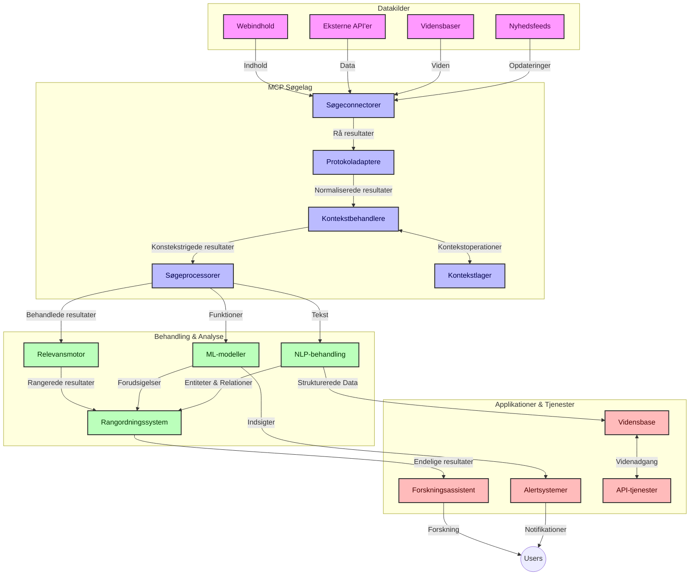
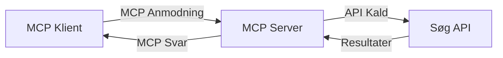
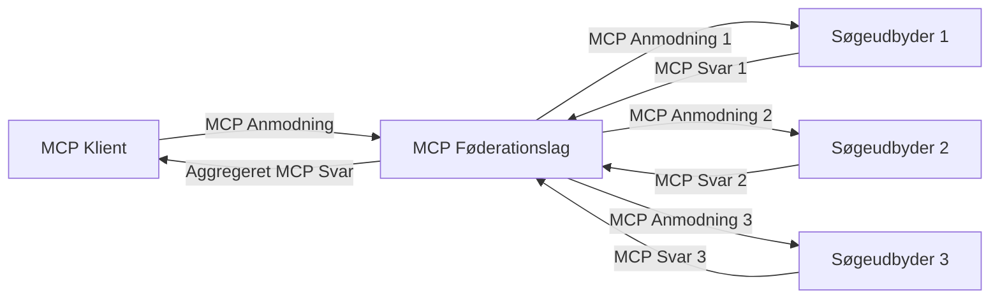
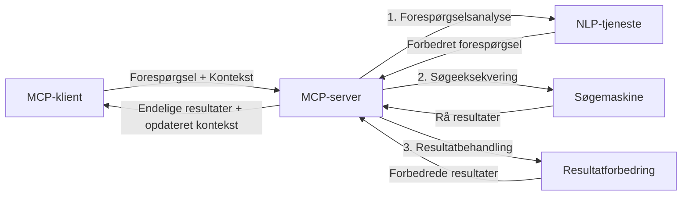

# Model Context Protocol for Realtids Websøgning

## Oversigt

Realtids websøgning er blevet uundværlig i dagens informationsdrevne miljø, hvor applikationer behøver øjeblikkelig adgang til opdaterede oplysninger på tværs af internettet for at levere relevante og rettidige svar. Model Context Protocol (MCP) repræsenterer et betydeligt fremskridt i optimeringen af disse realtids søgeprocesser, forbedring af søgeeffektivitet, opretholdelse af kontekstens integritet og forbedring af den samlede systemydelse.

Denne modul udforsker, hvordan MCP transformerer realtids websøgning ved at tilbyde en standardiseret tilgang til kontekststyring på tværs af AI-modeller, søgemaskiner og applikationer.

### Hvad Du Vil Lære

I denne omfattende guide vil du opdage:

- Hvordan MCP skaber en sømløs bro mellem AI-modeller og realtids websøgningsmuligheder
- Arkitektoniske mønstre til implementering af effektive og skalerbare søgeløsninger med MCP
- Teknikker til at bevare søgekontekst på tværs af flere forespørgsler og interaktioner
- Praktiske kodeimplementeringer i Python og JavaScript til forskellige søgescenarier
- Metoder til at balancere relevans, aktualitet og ydeevne i MCP-drevne søgesystemer

## Introduktion til Realtids Websøgning

Realtids websøgning er en teknologisk tilgang, der muliggør kontinuerlig forespørgsel, behandling og analyse af webbaserede oplysninger, efterhånden som de bliver offentliggjort eller opdateret, hvilket gør det muligt for systemer at levere frisk og relevant information med minimal forsinkelse. I modsætning til traditionelle søgesystemer, der opererer på indekserede data, som kan være timer eller dage gamle, behandler realtids søgning levende data fra nettet og leverer indsigter og informationer, der afspejler den aktuelle tilstand af online-indhold.

### Kernebegreber for Realtids Websøgning:

- **Kontinuerlig Forespørgselsbehandling**: Søgeforespørgsler behandles mod konstant opdaterede datakilder
- **Aktualitetsprioritering**: Systemer er designet til at prioritere frisk information
- **Relevansbalance**: Opretholdelse af balance mellem relevans og aktualitet
- **Skalerbar Arkitektur**: Systemer skal kunne håndtere variable forespørgselbelastninger og datamængder
- **Kontekstuel Forståelse**: Opretholdelse af brugerkontekst på tværs af søgeiterationer er afgørende for meningsfulde resultater
- **Dynamisk Forespørgselsreformulering**: Adaptiv tilpasning af forespørgsler baseret på kontekst og forudgående resultater
- **Multi-Kilde Integration**: Kombinering af resultater fra flere søgeudbydere og webkilder
- **Semantisk Forståelse**: Behandling af forespørgsler og indhold baseret på mening frem for blot nøgleord
- **Realtids Rangering**: Kontinuerlig justering af resultatrangering, når nye oplysninger bliver tilgængelige

### Model Context Protocol og Realtids Websøgning

Model Context Protocol (MCP) adresserer flere kritiske udfordringer i realtids websøgningsmiljøer:

1. **Bevarelse af Søgekontekst**: MCP standardiserer, hvordan kontekst opretholdes på tværs af distribuerede søgekomponenter, hvilket sikrer, at AI-modeller og behandlingsnoder har adgang til relevant forespørgselshistorik og brugerpræferencer.

2. **Effektiv Forespørgselsstyring**: Ved at tilbyde strukturerede mekanismer for kontekstovertagelse reducerer MCP overhead ved gentagelse af kontekst i hver søgeiteration.

3. **Interoperabilitet**: MCP skaber et fælles sprog for kontekstdeling mellem forskellige søgeteknologier og AI-modeller, hvilket muliggør mere fleksible og udvidelige arkitekturer.

4. **Søgeoptimeret Kontekst**: MCP-implementeringer kan prioritere hvilke kontekstelementer der er mest relevante for effektiv søgning, optimeret for både ydeevne og nøjagtighed.

5. **Adaptiv Søgebehandling**: Med korrekt kontekststyring gennem MCP kan søgesystemer dynamisk justere behandlingen baseret på udviklende brugerbehov og informationslandskaber.

I moderne applikationer, der spænder fra nyhedsaggregering til forskningsassistenter, muliggør integrationen af MCP med websøgningsteknologier mere intelligente, kontekstbevidste søgninger, som kan levere stadig mere relevante resultater efterhånden som brugerinteraktioner fortsætter.

## Læringsmål

Ved slutningen af denne lektion vil du kunne:

- Forstå grundlæggende om realtids websøgning og dets udfordringer i moderne applikationer
- Forklare, hvordan Model Context Protocol (MCP) forbedrer realtids websøgningsmuligheder
- Implementere MCP-baserede søgeløsninger ved hjælp af populære frameworks og API'er
- Designe og implementere skalerbare, højtydende søgearkitekturer med MCP
- Anvende MCP-koncepter til forskellige brugssager, inklusive semantisk søgning, forskningsassistance og AI-forstærket browsing
- Vurdere nye trends og fremtidige innovationer inden for MCP-baserede søgeteknologier
- Udvikle kontekstbevidste søgesystemer, der lærer af brugerinteraktioner
- Integrere websøgningsevner i AI-assistenter ved brug af standardiserede MCP-protokoller
- Skabe flerstadie søgepipeline, der progressivt forfiner resultater baseret på kontekst
- Optimere søgeydelse samtidig med opretholdelse af omfattende kontekstbevidsthed

### Definition og Betydning

Realtids websøgning involverer kontinuerlig forespørgsel, hentning og levering af webbaseret information med minimal forsinkelse. I modsætning til traditionelle søgemaskiner, der periodisk crawler og indekserer nettet, sigter realtids søgning mod at bringe information frem, efterhånden som den bliver tilgængelig, hvilket muliggør øjeblikkelig adgang til det mest aktuelle indhold.

Nøglekarakteristika for realtids websøgning inkluderer:

- **Friskhed**: Prioritering af nyligt indhold og opdateringer
- **Kontinuerlig Behandling**: Konstant overvågning efter nye informationer
- **Forespørgsels Tilpasning**: Forfining af søgeforespørgsler baseret på kontekst og feedback
- **Øjeblikkelig Levering**: Tilvejebringelse af søgeresultater med minimal forsinkelse
- **Kontekst Retention**: Opbygning på tidligere forespørgsler for forbedret relevans

### Udfordringer i Traditionel Websøgning

Traditionelle websøgningsmetoder står over for flere begrænsninger, når de anvendes i realtidsscenarier:

1. **Kontekstfragmentering**: Vanskeligheder ved at opretholde søgekontekst på tværs af flere forespørgsler
2. **Informationsfriskhed**: Udfordringer med adgang og prioritering af den mest nylige information
3. **Integrationskompleksitet**: Problemer med interoperabilitet mellem søgesystemer og applikationer
4. **Forsinkelsesproblemer**: Balancering af omfattende søgning med responstidskrav
5. **Relevansjustering**: Sikring af nøjagtighed og relevans samtidig med prioritering af aktualitet

## Forståelse af Model Context Protocol (MCP) til Søgning

### Hvad er MCP i Søgekontekster?

Model Context Protocol (MCP) er en standardiseret kommunikationsprotokol designet til at lette effektiv interaktion mellem AI-modeller og applikationer. I konteksten af realtids websøgning giver MCP en ramme til:

- At bevare søgekontekst gennem forespørgselssekvenser
- At standardisere søgeforespørgsels- og resultatformater
- At optimere transmissionen af søgeparametre og resultater
- At forbedre kommunikation mellem model og søgemaskine

### Centrale Komponenter og Arkitektur

MCP-arkitektur for realtids websøgning består af flere nøglekomponenter:

1. **Forespørgselskontekst Håndterere**: Administrerer og vedligeholder søgekontekst på tværs af multiple forespørgsler
2. **Søgeprocessorer**: Behandler indkommende søgeanmodninger ved brug af kontekstbevidste teknikker
3. **Protokoladaptere**: Konverterer mellem forskellige søge-API'er mens konteksten bevares
4. **Kontekstlager**: Effektivt lagrer og henter søgehistorik og præferencer
5. **Søgeconnectorer**: Forbinder til forskellige søgemaskiner og web-API'er



### Hvordan MCP Forbedrer Realtids Websøgning

MCP adresserer traditionelle udfordringer i websøgning gennem:

- **Kontekstuel Kontinuitet**: Opretholdelse af relationer mellem forespørgsler gennem hele søgesessionen
- **Optimeret Transmission**: Reducering af redundans i søgeparametre gennem intelligent kontekststyring
- **Standardiserede Interfaces**: Tilvejebringelse af konsistente API'er for søgekomponenter
- **Reduceret Forsinkelse**: Minimere behandlings-overhead via effektiv konteksthåndtering
- **Forbedret Relevans**: Forbedring af søgerelevans ved at bevare brugerens intention på tværs af flere forespørgsler

## Integration og Implementering

Realtids websøgningssystemer kræver omhyggelig arkitektonisk design og implementering for at opretholde både ydeevne og kontekstuelt integritet. Model Context Protocol tilbyder en standardiseret tilgang til integration af AI-modeller og søgeteknologier, hvilket muliggør mere sofistikerede, kontekstbevidste søgepipelines.

### Oversigt over MCP-Integration i Søgearkitekturer

Implementering af MCP i realtids websøgningsmiljøer involverer flere nøgleovervejelser:

1. **Søgekontekst-Serialisering**: MCP tilbyder effektive mekanismer til kodning af kontekstuel information inden for søgeforespørgsler og sikrer, at essentiel kontekst følger forespørgslen gennem hele behandlingspipeline. Dette inkluderer standardiserede serialiseringsformater optimeret til søgerelateret metadata.

2. **Stateful Søgebehandling**: MCP muliggør mere intelligent stateful behandling ved at opretholde konsistent kontekstrepræsentation på tværs af søgeiterationer. Dette er særligt værdifuldt i flerstadie søgepipelines, hvor kontekstforfining forbedrer resultater.

3. **Forespørgselsudvidelse og Forfining**: MCP-implementeringer i søgesystemer kan facilitere avanceret forespørgselsudvidelse og -forfining baseret på akkumuleret kontekst, hvilket tillader stadigt mere relevante resultater efterhånden som søgesessionen skrider frem.

4. **Resultatcache og Prioritering**: Ved at standardisere kontekstbehandling hjælper MCP med at håndtere resultatcache og prioritering, hvilket gør det muligt for komponenter at tilpasse sig baseret på den udviklende søgekontekst.

5. **Søgefederation og Aggregation**: MCP muliggør mere sofistikeret federation af søgning på tværs af flere backend-systemer ved at tilbyde strukturerede repræsentationer af søgekontekst, hvilket muliggør mere meningsfuld aggregering af resultater fra forskellige kilder.

Implementeringen af MCP på tværs af forskellige søgeteknologier skaber en ensartet tilgang til kontekststyring, reducerer behovet for tilpasset integrationskode samtidig med at systemets evne til at opretholde meningsfuld kontekst under udvikling af søgeforespørgsler forbedres.

### MCP i Forskellige Websøgningsimplementeringer

Disse eksempler følger den nuværende MCP-specifikation, som fokuserer på en JSON-RPC-baseret protokol med forskellige transportmekanismer. Koden demonstrerer, hvordan du kan implementere brugerdefinerede søgeintegrationer, mens du bevarer fuld kompatibilitet med MCP-protokollen.


<details>
<summary>Python-implementering med Generisk Søge-API</summary>

```python
import asyncio
import json
import aiohttp
from typing import Dict, Any, Optional, List
from contextlib import asynccontextmanager
from collections.abc import AsyncIterator

# Importer standard MCP-biblioteker
from mcp.client.session import ClientSession
from mcp.client.streamable_http import streamablehttp_client
from mcp.types import TextContent, CreateMessageRequestParams, CreateMessageResult
from mcp.server.fastmcp import FastMCP

# Opret en FastMCP-server til web-søgning
search_server = FastMCP("WebSearch")

# Klasse til håndtering af web-søgningsoperationer
class WebSearchHandler:
    def __init__(self, api_endpoint: str, api_key: str):
        self.api_endpoint = api_endpoint
        self.api_key = api_key
        self.session = None
        
    async def initialize(self):
        """Initialize the HTTP session"""
        self.session = aiohttp.ClientSession(
            headers={"Authorization": f"Bearer {self.api_key}"}
        )
    
    async def close(self):
        """Close the HTTP session"""
        if self.session:
            await self.session.close()
            
    async def perform_search(self, query: str, max_results: int = 5, 
                           include_domains: List[str] = None, 
                           exclude_domains: List[str] = None,
                           time_period: str = "any") -> Dict[str, Any]:
        """Perform web search using the search API"""
        # Konstruer søgeparametre
        search_params = {
            "q": query,
            "limit": max_results,
            "time": time_period
        }
        
        if include_domains:
            search_params["site"] = ",".join(include_domains)
            
        if exclude_domains:
            search_params["exclude_site"] = ",".join(exclude_domains)
        
        # Udfør søgeforespørgslen
        try:
            async with self.session.get(
                self.api_endpoint,
                params=search_params
            ) as response:
                if response.status != 200:
                    error_text = await response.text()
                    raise Exception(f"Search API error: {response.status} - {error_text}")
                
                search_data = await response.json()
                
                # Omform API-specifik respons til et standardformat
                results = []
                for item in search_data.get("results", []):
                    results.append({
                        "title": item.get("title", ""),
                        "url": item.get("url", ""),
                        "snippet": item.get("snippet", ""),
                        "date": item.get("published_date", ""),
                        "source": item.get("source", "")
                    })
                
                return {
                    "query": query,
                    "totalResults": len(results),
                    "results": results
                }
        except Exception as e:
            print(f"Search API request error: {e}")
            raise

# Initialiser søgehåndteringen
search_handler = WebSearchHandler(
    api_endpoint="https://api.search-service.example/search",
    api_key="your-api-key-here"
)

# Opsæt levetid til at styre søgehåndteringen
@asyncio.asynccontextmanager
async def app_lifespan(server: FastMCP):
    """Manage application lifecycle"""
    await search_handler.initialize()
    try:
        yield {"search_handler": search_handler}
    finally:
        await search_handler.close()

# Indstil levetid for serveren
search_server = FastMCP("WebSearch", lifespan=app_lifespan)

# Registrer et web-søgning værktøj
@search_server.tool()
async def web_search(query: str, max_results: int = 5, 
                   include_domains: List[str] = None,
                   exclude_domains: List[str] = None,
                   time_period: str = "any") -> Dict[str, Any]:
    """
    Search the web for information
    
    Args:
        query: The search query
        max_results: Maximum number of results to return (default: 5)
        include_domains: List of domains to include in search results
        exclude_domains: List of domains to exclude from search results
        time_period: Time period for results ("day", "week", "month", "any")
        
    Returns:
        Dictionary containing search results
    """
    ctx = search_server.get_context()
    search_handler = ctx.request_context.lifespan_context["search_handler"]
    
    results = await search_handler.perform_search(
        query=query,
        max_results=max_results,
        include_domains=include_domains,
        exclude_domains=exclude_domains,
        time_period=time_period
    )
    
    return results

# Eksempel på klientbrug
async def client_example():
    # Forbind til søgeserveren ved hjælp af Streamable HTTP-transport
    async with streamablehttp_client("http://localhost:8000/mcp") as (read, write, _):
        async with ClientSession(read, write) as session:
            # Initialiser forbindelsen
            await session.initialize()
            
            # Kald web_search-værktøjet
            search_results = await session.call_tool(
                "web_search", 
                {
                    "query": "latest developments in AI and Model Context Protocol",
                    "max_results": 5,
                    "time_period": "day",
                    "include_domains": ["github.com", "microsoft.com"]
                }
            )
            
            print(f"Search results: {search_results}")

# Server eksekveringseksempel
if __name__ == "__main__":
    # Kør serveren med Streamable HTTP-transport
    search_server.run(transport="streamable-http")
```
</details> 

<details>
<summary>JavaScript-implementering med Browser-baseret Søgning</summary>


```javascript
// MCP serverimplementering til websøgnig
import { McpServer, ResourceTemplate } from '@modelcontextprotocol/sdk/server/mcp.js';
import { StreamableHTTPServerTransport } from '@modelcontextprotocol/sdk/server/streamableHttp.js';
import { z } from 'zod';

// Opret en MCP-server til websøgnig
const searchServer = new McpServer({
    name: "BrowserSearch",
    description: "A server that provides web search capabilities"
});

// Søgetjenesteklasse
class SearchService {
    constructor(searchApiUrl, apiKey) {
        this.searchApiUrl = searchApiUrl;
        this.apiKey = apiKey;
    }

    async performSearch(parameters) {
        const {
            query = '',
            maxResults = 5,
            includeDomains = [],
            excludeDomains = [],
            timePeriod = 'any'
        } = parameters;
        
        // Konstruer søge-URL med parametre
        const url = new URL(this.searchApiUrl);
        url.searchParams.append('q', query);
        url.searchParams.append('limit', maxResults);
        url.searchParams.append('time', timePeriod);
        
        if (includeDomains.length > 0) {
            url.searchParams.append('site', includeDomains.join(','));
        }
        
        if (excludeDomains.length > 0) {
            url.searchParams.append('exclude_site', excludeDomains.join(','));
        }
        
        try {
            const response = await fetch(url.toString(), {
                method: 'GET',
                headers: {
                    'Authorization': `Bearer ${this.apiKey}`,
                    'Content-Type': 'application/json'
                }
            });
            
            if (!response.ok) {
                const errorText = await response.text();
                throw new Error(`Search API error: ${response.status} - ${errorText}`);
            }
            
            const searchData = await response.json();
            
            // Transformér API-specifik svar til et standardformat
            const results = searchData.results?.map(item => ({
                title: item.title || '',
                url: item.url || '',
                snippet: item.snippet || '',
                date: item.published_date || '',
                source: item.source || ''
            })) || [];
            
            return {
                query,
                totalResults: results.length,
                results
            };
        } catch (error) {
            console.error('Search API request error:', error);
            throw error;
        }
    }
}

// Initialiser søgetjenesten
const searchService = new SearchService(
    'https://api.search-service.example/search',
    'your-api-key-here'
);

// Opsæt kontekstudbyderen for serveren
searchServer.setContextProvider(() => {
    return {
        searchService
    };
});

// Registrer websøgningsværktøj
searchServer.tool({
    name: 'web_search',
    description: 'Search the web for information',
    parameters: {
        type: 'object',
        properties: {
            query: {
                type: 'string',
                description: 'The search query'
            },
            maxResults: {
                type: 'integer',
                description: 'Maximum number of results to return',
                default: 5
            },
            includeDomains: {
                type: 'array',
                items: { type: 'string' },
                description: 'List of domains to include in search results'
            },
            excludeDomains: {
                type: 'array',
                items: { type: 'string' },
                description: 'List of domains to exclude from search results'
            },
            timePeriod: {
                type: 'string',
                description: 'Time period for results',
                enum: ['day', 'week', 'month', 'any'],
                default: 'any'
            }
        },
        required: ['query']
    },
    handler: async (params, context) => {
        const { searchService } = context;
        return await searchService.performSearch(params);
    }
});

// Eksempel på klientkode til at oprette forbindelse til søgeserveren
import { Client } from '@modelcontextprotocol/sdk/client/index.js';
import { StreamableHTTPClientTransport } from '@modelcontextprotocol/sdk/client/streamableHttp.js';

async function connectToSearchServer() {
    // Opret forbindelse til søgeserveren
    const transport = new StreamableHTTPClientTransport(
        new URL('http://localhost:8000/mcp')
    );
    
    const client = new Client({
        name: 'search-client',
        version: '1.0.0'
    });
    
    await client.connect(transport);
    
    // Udfør søgeværktøjet
    const searchResults = await client.callTool({
        name: 'web_search',
        arguments: {
            query: 'Model Context Protocol implementation examples',
            maxResults: 10,
            timePeriod: 'week',
            includeDomains: ['github.com', 'docs.microsoft.com']
        }
    });
    
    console.log('Search results:', searchResults);
    
    // Ryd op
    await client.disconnect();
}

// Start serveren
const transport = new StreamableHTTPServerTransport();
await searchServer.connect(transport);
console.log('Search server running at http://localhost:8000/mcp');

// I en separat proces eller efter serveren er startet
// connectToSearchServer().catch(console.error);
```
</details> 


## Ansvarsfraskrivelse for Kodeeksempler

> **Vigtig Bemærkning**: Kodeeksemplerne nedenfor demonstrerer integrationen af Model Context Protocol (MCP) med websøgningsfunktionalitet. Selvom de følger mønstre og strukturer fra de officielle MCP SDK'er, er de blevet forenklet til uddannelsesmæssige formål.
> 
> Disse eksempler viser:
> 
> 1. **Python Implementering**: En FastMCP-serverimplementering, der leverer et websøgeværktøj og forbinder til en ekstern søge-API. Dette eksempel viser korrekt livscyklusstyring, kontekstbehandling og værktøjsimplementering i henhold til mønstrene i [den officielle MCP Python SDK](https://github.com/modelcontextprotocol/python-sdk). Serveren anvender den anbefalede Streamable HTTP-transport, som har erstattet den ældre SSE-transport til produktionsudrulninger.
> 
> 2. **JavaScript Implementering**: En TypeScript/JavaScript-implementering, der bruger FastMCP-mønstret fra [den officielle MCP TypeScript SDK](https://github.com/modelcontextprotocol/typescript-sdk) for at skabe en søgeserver med korrekte værktøjsdefinitioner og klientforbindelser. Den følger de seneste anbefalede mønstre for sessionsstyring og kontekstbevarelse.
> 
> Disse eksempler kræver yderligere fejlhåndtering, autentificering og specifik API-integration til produktionsbrug. De viste søge-API-endpoints (`https://api.search-service.example/search`) er pladsholdere og skal udskiftes med faktiske søgetjenesteendpoints.
> 
> For fuldstændige implementeringsdetaljer og de nyeste tilgange henvises til [den officielle MCP-specifikation](https://spec.modelcontextprotocol.io/) og SDK-dokumentation.

## Kernebegreber

### Model Context Protocol (MCP) Framework

Fundamentalt set tilbyder Model Context Protocol en standardiseret måde for AI-modeller, applikationer og tjenester at udveksle kontekst. I realtids websøgning er denne ramme essentiel for at skabe sammenhængende, flergangssøgeoplevelser. Nøglekomponenter inkluderer:

1. **Klient-Server Arkitektur**: MCP etablerer en klar adskillelse mellem søgeklienter (anmodere) og søgeservere (udbydere), hvilket muliggør fleksible implementeringsmodeller.

2. **JSON-RPC Kommunikation**: Protokollen bruger JSON-RPC til meddelelsesudveksling, hvilket gør den kompatibel med webteknologier og nem at implementere på tværs af forskellige platforme.

3. **Kontekststyring**: MCP definerer strukturerede metoder til at vedligeholde, opdatere og udnytte søgekontekst på tværs af flere interaktioner.

4. **Værktøjsdefinitioner**: Søgefunktionaliteter eksponeres som standardiserede værktøjer med veldefinerede parametre og returværdier.

5. **Streaming Support**: Protokollen understøtter streaming af resultater, essentielt for realtids søgning, hvor resultater kan ankomme løbende.

### Mønstre for Websøgningsintegration

Når MCP integreres med websøgning, fremkommer flere mønstre:

#### 1. Direkte Integration med Søgeudbyder



I dette mønster interfacer MCP-serveren direkte med en eller flere søge-API'er, oversætter MCP-anmodninger til API-specifikke kald og formaterer resultaterne som MCP-svar.

#### 2. Fødereret Søgning med Kontextbevarelse



Dette mønster distribuerer søgeforespørgsler på tværs af flere MCP-kompatible søgeudbydere, der hver potentielt specialiserer sig i forskellige typer indhold eller søgemuligheder, mens en samlet kontekst bevares.

#### 3. Kontekstforstærket Søgekæde



I dette mønster opdeles søgeprocessen i flere faser, hvor konteksten beriges i hvert trin, hvilket resulterer i gradvist mere relevante resultater.

### Søgekontektskomponenter

I MCP-baseret websøgning inkluderer kontekst typisk:

- **Forespørgsels Historik**: Tidligere søgeforespørgsler i sessionen
- **Brugerpræferencer**: Sprog, region, sikker søgning-indstillinger
- **Interaktions Historik**: Hvilke resultater der blev klikket på, tid brugt på resultater
- **Søgeparametre**: Filtre, sorteringsordrer og andre søgemodifikatorer
- **Domæneviden**: Fagspecifik kontekst relevant for søgningen
- **Tidsmæssig Kontekst**: Tidsbaserede relevansfaktorer
- **Kildepræferencer**: Betroede eller foretrukne informationskilder

## Brugssager og Anvendelser

### Forskning og Informationsindsamling

MCP forbedrer forskningsarbejdsgange ved:

- At bevare forskningskontekst på tværs af søgesessioner
- At muliggøre mere sofistikerede og kontekstrelevante forespørgsler
- At understøtte multi-kilde søgefederation
- At lette videnudtræk fra søgeresultater

### Realtids Nyheds- og Trendovervågning

MCP-drevet søgning tilbyder fordele til nyhedsovervågning:

- Nær-realtime opdagelse af nye nyhedshistorier
- Kontextuel filtrering af relevant information
- Emne- og entitets-sporing på tværs af flere kilder
- Personlige nyhedsalarmer baseret på brugerens kontekst

### AI-forstærket Browsing og Forskning

MCP skaber nye muligheder for AI-forstærket browsing:

- Kontextuelle søgeforslag baseret på aktuel browseraktivitet
- Sømløs integration af websøgning med LLM-drevne assistenter
- Flergangssøgsforfining med opretholdt kontekst
- Forbedret faktatjek og informationsverifikation

## Fremtidige Trends og Innovationer

### Udvikling af MCP i Websøgning

Fremadskuende forventer vi, at MCP vil udvikle sig til at adressere:


- **Multimodal søgning**: Integration af tekst-, billede-, lyd- og videosøgning med bevaret kontekst
- **Decentraliseret søgning**: Understøttelse af distribuerede og fødererede søgeøkosystemer
- **Søgeprivatliv**: Kontekstbevidste privatlivsbevarende søgemekanismer
- **Forespørgselsforståelse**: Dyb semantisk parsing af søgeforespørgsler i naturligt sprog

### Potentielle teknologiske fremskridt

Fremvoksende teknologier, der vil forme fremtiden for MCP-søgning:

1. **Neurale søgearkitekturer**: Søgesystemer baseret på indlejringer optimeret til MCP
2. **Personliggjort søgekontekst**: Læring af individuelle brugeres søgemønstre over tid
3. **Integration af vidensgraf**: Kontekstuel søgning forbedret af domænespecifikke vidensgrafer
4. **Tværmodal kontekst**: Opretholdelse af kontekst på tværs af forskellige søgemodaliteter

## Praktiske øvelser

### Øvelse 1: Opsætning af en grundlæggende MCP-søgepipeline

I denne øvelse lærer du at:
- Konfigurere et grundlæggende MCP-søgemiljø
- Implementere kontekststyring for websøgning
- Teste og validere kontekstbevarelse på tværs af søgeiterationer

### Øvelse 2: Bygge en forskningsassistent med MCP-søgning

Lav en komplet applikation, der:
- Behandler spørgsmål i naturligt sprog inden for forskning
- Udfører kontekstbevidste websøgninger
- Syntetiserer information fra flere kilder
- Præsenterer organiserede forskningsresultater

### Øvelse 3: Implementering af multi-kilde søgefederation med MCP

Avanceret øvelse, der dækker:
- Kontekstbevidst forespørgselsstyring til flere søgemaskiner
- Resultatrangering og aggregering
- Kontekstuel deduplikation af søgeresultater
- Håndtering af kilde-specifik metadata

## Yderligere ressourcer

- [Model Context Protocol Specification](https://spec.modelcontextprotocol.io/) - Officiel MCP-specifikation og detaljeret protokoldokumentation
- [Model Context Protocol Documentation](https://modelcontextprotocol.io/) - Detaljerede vejledninger og implementeringsguider
- [MCP Python SDK](https://github.com/modelcontextprotocol/python-sdk) - Officiel Python-implementation af MCP-protokollen
- [MCP TypeScript SDK](https://github.com/modelcontextprotocol/typescript-sdk) - Officiel TypeScript-implementation af MCP-protokollen
- [MCP Reference Servers](https://github.com/modelcontextprotocol/servers) - Referenceimplementeringer af MCP-servere
- [Bing Web Search API Documentation](https://learn.microsoft.com/en-us/bing/search-apis/bing-web-search/overview) - Microsofts websøge-API
- [Google Custom Search JSON API](https://developers.google.com/custom-search/v1/overview) - Googles programmerbare søgemaskine
- [SerpAPI Documentation](https://serpapi.com/search-api) - API til søgemaskineresultatside
- [Meilisearch Documentation](https://www.meilisearch.com/docs) - Open source søgemaskine
- [Elasticsearch Documentation](https://www.elastic.co/guide/index.html) - Distribueret søge- og analysemotor
- [LangChain Documentation](https://python.langchain.com/docs/get_started/introduction) - Opbygning af applikationer med LLM'er

## Læringsmål

Ved at gennemføre denne modul vil du kunne:

- Forstå grundlæggende principper for realtids-websøgning og dens udfordringer
- Forklare hvordan Model Context Protocol (MCP) forbedrer realtids-websøgningskapaciteter
- Implementere MCP-baserede søgeløsninger ved hjælp af populære frameworks og API'er
- Designe og implementere skalerbare, højtydende søgearkitekturer med MCP
- Anvende MCP-koncepter til forskellige brugstilfælde, herunder semantisk søgning, forskningsassistance og AI-augmented browsing
- Evaluere nye trends og fremtidige innovationer inden for MCP-baserede søgeteknologier


### Overvejelser om tillid og sikkerhed

Når du implementerer MCP-baserede websøgningløsninger, skal du huske disse vigtige principper fra MCP-specifikationen:

1. **Brugersamtykke og kontrol**: Brugere skal eksplicit give samtykke til og forstå al dataadgang og operationer. Dette er særligt vigtigt for websøgningsimplementeringer, der kan få adgang til eksterne datakilder.

2. **Dataprivatliv**: Sørg for passende håndtering af søgeforespørgsler og resultater, især når de kan indeholde følsomme oplysninger. Implementer passende adgangskontroller for at beskytte brugerdata.

3. **Værktøjssikkerhed**: Implementer korrekt autorisation og validering for søgeværktøjer, da de kan udgøre sikkerhedsrisici gennem arbitrær kodekørsel. Beskrivelser af værktøjets adfærd bør betragtes som uvederhæftige, medmindre de stammer fra en betroet server.

4. **Klar dokumentation**: Giv klar dokumentation om kapaciteter, begrænsninger og sikkerhedsovervejelser ved din MCP-baserede søgeimplementering, i overensstemmelse med implementeringsvejledningerne i MCP-specifikationen.

5. **Robuste samtykkeforløb**: Udvikl robuste samtykke- og autorisationsflow, der tydeligt forklarer, hvad hvert værktøj gør, før det autoriseres til brug, især for værktøjer, der interagerer med eksterne webressourcer.

For fuldstændige oplysninger om MCP-sikkerhed og tillidsovervejelser, henvises til den [officielle dokumentation](https://modelcontextprotocol.io/specification/2025-11-25/basic/security_best_practices).

## Hvad er næste skridt

- [5.12 Entra ID Authentication for Model Context Protocol Servers](../mcp-security-entra/README.md)

---

<!-- CO-OP TRANSLATOR DISCLAIMER START -->
**Ansvarsfraskrivelse**:
Dette dokument er blevet oversat ved hjælp af AI-oversættelsestjenesten [Co-op Translator](https://github.com/Azure/co-op-translator). Selvom vi bestræber os på nøjagtighed, skal du være opmærksom på, at automatiserede oversættelser kan indeholde fejl eller unøjagtigheder. Det originale dokument på dets oprindelige sprog bør betragtes som den autoritative kilde. For kritisk information anbefales professionel menneskelig oversættelse. Vi påtager os intet ansvar for misforståelser eller fejltolkninger, der opstår som følge af brugen af denne oversættelse.
<!-- CO-OP TRANSLATOR DISCLAIMER END -->