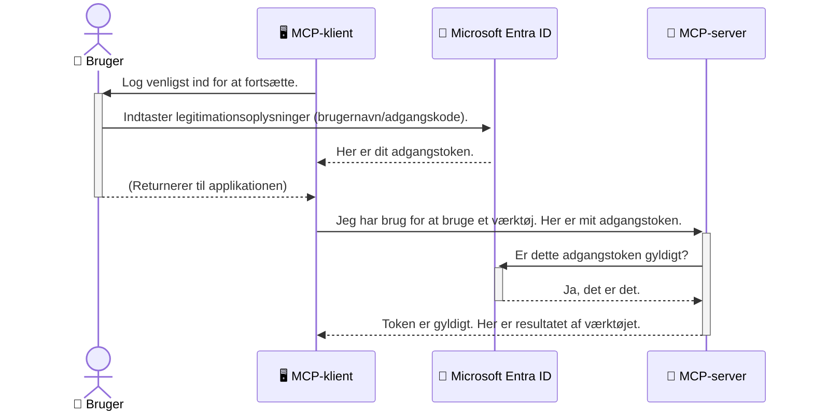

# Sikring af AI-workflows: Entra ID-godkendelse for Model Context Protocol-servere

> [!NOTE]
> Fjernserverkoden i denne lektion beskytter legacy `/sse` og `/message`
> endpoints og retter sig mod MCP `2025-11-25`. Behold dets identitets- og tokenvaliderings-
> praksisser, men brug et `2026-07-28`-kompatibelt Streamable HTTP-transportsystem til nye
> implementeringer.

## Introduktion
At sikre din Model Context Protocol (MCP) server er lige så vigtigt som at låse hoveddøren til dit hus. Hvis du lader din MCP-server stå åben, udsætter du dine værktøjer og data for uautoriseret adgang, hvilket kan føre til sikkerhedsbrud. Microsoft Entra ID tilbyder en robust skybaseret identitets- og adgangshåndteringsløsning, som hjælper med at sikre, at kun autoriserede brugere og applikationer kan interagere med din MCP-server. I denne sektion lærer du, hvordan du beskytter dine AI-workflows ved hjælp af Entra ID-godkendelse.

## Læringsmål
Når du har gennemgået denne sektion, vil du kunne:

- Forstå vigtigheden af at sikre MCP-servere.
- Forklare grundlæggende om Microsoft Entra ID og OAuth 2.0-godkendelse.
- Genkende forskellen mellem offentlige og fortrolige klienter.
- Implementere Entra ID-godkendelse i både lokale (offentlige klient) og fjernbetjente (fortrolige klient) MCP-server scenarier.
- Anvende sikkerhedspraksis ved udvikling af AI-workflows.

## Sikkerhed og MCP

Ligesom du ikke ville lade hoveddøren til dit hus stå ulåst, bør du ikke lade din MCP-server være åben for alle at få adgang til. Det er essentielt at sikre dine AI-workflows for at bygge robuste, pålidelige og sikre applikationer. Dette kapitel introducerer dig for anvendelsen af Microsoft Entra ID til at sikre dine MCP-servere, så kun autoriserede brugere og applikationer kan interagere med dine værktøjer og data.

## Hvorfor sikkerhed betyder noget for MCP-servere

Forestil dig, at din MCP-server har et værktøj, der kan sende e-mails eller få adgang til en kundedatabase. En usikret server betyder, at alle potentielt kan bruge det værktøj, hvilket kan føre til uautoriseret adgang til data, spam eller andre ondsindede handlinger.

Ved at implementere godkendelse sikrer du, at hver anmodning til din server verificeres, og identiteten af den bruger eller applikation, der laver anmodningen, bekræftes. Dette er det første og mest afgørende skridt til at sikre dine AI-workflows.

## Introduktion til Microsoft Entra ID

[**Microsoft Entra ID**](https://adoption.microsoft.com/microsoft-security/entra/) er en skybaseret tjeneste til identitets- og adgangsstyring. Tænk på det som en universel sikkerhedsvagt for dine applikationer. Den håndterer den komplekse proces med at verificere brugeridentiteter (godkendelse) og fastlægge, hvad de har lov til at gøre (autorisation).

Ved at bruge Entra ID kan du:

- Muliggøre sikker tilmelding for brugere.
- Beskytte API'er og tjenester.
- Administrere adgangspolitikker fra et centralt sted.

For MCP-servere tilbyder Entra ID en robust og bredt betroet løsning til at styre, hvem der kan få adgang til serverens funktioner.

---

## Forstå magien: Hvordan Entra ID-godkendelse fungerer

Entra ID benytter åbne standarder som **OAuth 2.0** til at håndtere godkendelse. Selvom detaljerne kan være komplekse, er kernekonceptet enkelt og kan forstås gennem en analogi.

### En blid introduktion til OAuth 2.0: Valet-nøglen

Tænk på OAuth 2.0 som en parkeringsservice til din bil. Når du ankommer til en restaurant, giver du ikke parkeringsvagten din hovednøgle. I stedet giver du en **valet-nøgle**, som har begrænsede tilladelser – den kan starte bilen og låse dørene, men kan ikke åbne bagagerummet eller handskerummet.

I denne analogi:

- **Du** er **Brugeren**.
- **Din bil** er **MCP-serveren** med dens værdifulde værktøjer og data.
- **Parkeringvagten** er **Microsoft Entra ID**.
- **Parkeringshjælperen** er **MCP-klienten** (applikationen der forsøger at få adgang til serveren).
- **Valet-nøglen** er **Access Token**.

Access token er en sikker tekststreng, som MCP-klienten modtager fra Entra ID efter din tilmelding. Klienten præsenterer derefter dette token til MCP-serveren med hver anmodning. Serveren kan verificere tokenet for at sikre, at anmodningen er legitim, og at klienten har de nødvendige rettigheder, alt sammen uden nogensinde at skulle håndtere dine faktiske legitimationsoplysninger (som dit kodeord).

### Godkendelsesflowet

Sådan fungerer processen i praksis:



### Introduktion til Microsoft Authentication Library (MSAL)

Før vi dykker ned i koden, er det vigtigt at introducere en nøglekomponent, som du vil se i eksemplerne: **Microsoft Authentication Library (MSAL)**.

MSAL er et bibliotek udviklet af Microsoft, som gør det meget nemmere for udviklere at håndtere godkendelse. I stedet for at du skal skrive al den komplekse kode til at håndtere sikkerhedstokens, administrere tilmeldinger og opdatere sessioner, tager MSAL sig af det tunge arbejde.

Det anbefales kraftigt at bruge et bibliotek som MSAL, fordi:

- **Det er sikkert:** Det implementerer industri-standardprotokoller og sikkerhedspraksisser, hvilket reducerer risikoen for sårbarheder i din kode.
- **Det forenkler udviklingen:** Det abstraherer kompleksiteten af OAuth 2.0 og OpenID Connect-protokollerne, så du kan tilføje robust godkendelse til din applikation med blot få kodelinjer.
- **Det vedligeholdes:** Microsoft vedligeholder aktivt og opdaterer MSAL for at adressere nye sikkerhedstrusler og platformændringer.

MSAL understøtter et bredt udvalg af sprog og applikationsrammer, inklusiv .NET, JavaScript/TypeScript, Python, Java, Go og mobile platforme som iOS og Android. Det betyder, at du kan bruge de samme konsistente godkendelsesmønstre på tværs af hele din teknologistak.

For at lære mere om MSAL kan du tjekke den officielle [MSAL-oversigtsdokumentation](https://learn.microsoft.com/entra/identity-platform/msal-overview).

---

## Sikring af din MCP-server med Entra ID: En trin-for-trin guide

Lad os nu gennemgå, hvordan du sikrer en lokal MCP-server (en der kommunikerer over `stdio`) med Entra ID. Dette eksempel bruger en **offentlig klient**, som er egnet til applikationer, der kører på en brugers maskine, som for eksempel en desktop-app eller en lokal udviklingsserver.

### Scenario 1: Sikring af en lokal MCP-server (med en offentlig klient)

I dette scenarie ser vi på en MCP-server, der kører lokalt, kommunikerer over `stdio` og bruger Entra ID til at godkende brugeren, før adgang til dets værktøjer tillades. Serveren har et enkelt værktøj, som henter brugerens profilinformation fra Microsoft Graph API.

#### 1. Opsætning af applikationen i Entra ID

Før du skriver kode, skal du registrere din applikation i Microsoft Entra ID. Dette fortæller Entra ID om din applikation og giver tilladelse til at bruge godkendelsestjenesten.

1. Gå til **[Microsoft Entra-portalen](https://entra.microsoft.com/)**.
2. Gå til **App registrations** og klik på **New registration**.
3. Giv din applikation et navn (f.eks. "My Local MCP Server").
4. For **Supported account types**, vælg **Accounts in this organizational directory only**.
5. Du kan lade **Redirect URI** stå tom for dette eksempel.
6. Klik på **Register**.

Når registreringen er gennemført, skal du notere **Application (client) ID** og **Directory (tenant) ID**. Du får brug for dem i din kode.

#### 2. Koden: En gennemgang

Lad os se på nøgledele af koden, som håndterer godkendelse. Den fulde kode til dette eksempel findes i mappen [Entra ID - Local - WAM](https://github.com/Azure-Samples/mcp-auth-servers/tree/main/src/entra-id-local-wam) i [mcp-auth-servers GitHub repositoryet](https://github.com/Azure-Samples/mcp-auth-servers).

**`AuthenticationService.cs`**

Denne klasse er ansvarlig for at håndtere interaktionen med Entra ID.

- **`CreateAsync`**: Denne metode initialiserer `PublicClientApplication` fra MSAL (Microsoft Authentication Library). Den konfigureres med applikationens `clientId` og `tenantId`.
- **`WithBroker`**: Denne aktiverer brugen af en broker (som Windows Web Account Manager), som giver en mere sikker og gnidningsfri single sign-on oplevelse.
- **`AcquireTokenAsync`**: Dette er metoden i centrum. Den forsøger først stille og roligt at hente et token (dvs. brugeren behøver ikke at logge ind igen, hvis der allerede er en gyldig session). Hvis et stille token ikke kan hentes, vil den bede brugeren om at logge ind interaktivt.

```csharp
// Simplified for clarity
public static async Task<AuthenticationService> CreateAsync(ILogger<AuthenticationService> logger)
{
    var msalClient = PublicClientApplicationBuilder
        .Create(_clientId) // Your Application (client) ID
        .WithAuthority(AadAuthorityAudience.AzureAdMyOrg)
        .WithTenantId(_tenantId) // Your Directory (tenant) ID
        .WithBroker(new BrokerOptions(BrokerOptions.OperatingSystems.Windows))
        .Build();

    // ... cache registration ...

    return new AuthenticationService(logger, msalClient);
}

public async Task<string> AcquireTokenAsync()
{
    try
    {
        // Try silent authentication first
        var accounts = await _msalClient.GetAccountsAsync();
        var account = accounts.FirstOrDefault();

        AuthenticationResult? result = null;

        if (account != null)
        {
            result = await _msalClient.AcquireTokenSilent(_scopes, account).ExecuteAsync();
        }
        else
        {
            // If no account, or silent fails, go interactive
            result = await _msalClient.AcquireTokenInteractive(_scopes).ExecuteAsync();
        }

        return result.AccessToken;
    }
    catch (Exception ex)
    {
        _logger.LogError(ex, "An error occurred while acquiring the token.");
        throw; // Optionally rethrow the exception for higher-level handling
    }
}
```

**`Program.cs`**

Her opsættes MCP-serveren, og godkendelsestjenesten integreres.

- **`AddSingleton<AuthenticationService>`**: Dette registrerer `AuthenticationService` i dependency injection-containeren, så den kan bruges af andre dele af applikationen (som vores værktøj).
- **`GetUserDetailsFromGraph` værktøj**: Dette værktøj kræver en instans af `AuthenticationService`. Før det gør noget, kalder det `authService.AcquireTokenAsync()` for at få et gyldigt adgangstoken. Hvis godkendelsen lykkes, bruger det tokenet til at kalde Microsoft Graph API og hente brugerens detaljer.

```csharp
// Simplified for clarity
[McpServerTool(Name = "GetUserDetailsFromGraph")]
public static async Task<string> GetUserDetailsFromGraph(
    AuthenticationService authService)
{
    try
    {
        // This will trigger the authentication flow
        var accessToken = await authService.AcquireTokenAsync();

        // Use the token to create a GraphServiceClient
        var graphClient = new GraphServiceClient(
            new BaseBearerTokenAuthenticationProvider(new TokenProvider(authService)));

        var user = await graphClient.Me.GetAsync();

        return System.Text.Json.JsonSerializer.Serialize(user);
    }
    catch (Exception ex)
    {
        return $"Error: {ex.Message}";
    }
}
```

#### 3. Sådan fungerer det hele sammen

1. Når MCP-klienten prøver at bruge `GetUserDetailsFromGraph`-værktøjet, kalder værktøjet først `AcquireTokenAsync`.
2. `AcquireTokenAsync` aktiverer MSAL-biblioteket til at tjekke for et gyldigt token.
3. Hvis der ikke findes noget token, vil MSAL gennem brokeren bede brugeren om at logge ind med sin Entra ID-konto.
4. Når brugeren logger ind, udsteder Entra ID et adgangstoken.
5. Værktøjet modtager tokenet og bruger det til at lave et sikkert kald til Microsoft Graph API.
6. Brugerens oplysninger returneres til MCP-klienten.

Denne proces sikrer, at kun godkendte brugere kan bruge værktøjet og sikrer effektivt din lokale MCP-server.

### Scenario 2: Sikring af en fjern MCP-server (med en fortrolig klient)

Når din MCP-server kører på en fjern maskine (som en cloud-server) og kommunikerer over et protokol som HTTP Streaming, er sikkerhedskravene anderledes. Her bør du bruge en **fortrolig klient** og **Authorization Code Flow**. Dette er en mere sikker metode, fordi applikationens hemmeligheder aldrig eksponeres til browseren.

Dette eksempel bruger en TypeScript-baseret MCP-server, der anvender Express.js til at håndtere HTTP-anmodninger.

#### 1. Opsætning af applikationen i Entra ID

Opsætningen i Entra ID minder om den offentlige klient, men med en vigtig forskel: du skal oprette en **client secret**.

1. Gå til **[Microsoft Entra-portalen](https://entra.microsoft.com/)**.
2. I din app-registrering, gå til fanen **Certificates & secrets**.
3. Klik på **New client secret**, giv den en beskrivelse, og klik på **Add**.
4. **Vigtigt:** Kopiér hemmelighedsværdien med det samme. Du vil ikke kunne se den igen.
5. Du skal også konfigurere en **Redirect URI**. Gå til fanen **Authentication**, klik på **Add a platform**, vælg **Web**, og indtast redirect URI for din applikation (f.eks. `http://localhost:3001/auth/callback`).

> **⚠️ Vigtig sikkerhedsnote:** For produktionsapplikationer anbefaler Microsoft kraftigt at bruge **godkendelse uden hemmeligheder** som **Managed Identity** eller **Workload Identity Federation** i stedet for client secrets. Client secrets udgør sikkerhedsrisici, da de kan blive eksponeret eller kompromitteret. Managed identities giver en sikrere tilgang ved at eliminere behovet for at gemme legitimationsoplysninger i din kode eller konfiguration.
>
> For mere information om managed identities og hvordan man implementerer dem, se [Managed identities for Azure resources overview](https://learn.microsoft.com/entra/identity/managed-identities-azure-resources/overview).

#### 2. Koden: En gennemgang

Dette eksempel bruger en sessionsbaseret tilgang. Når brugeren godkender sig, gemmer serveren access token og refresh token i en session og giver brugeren et session token. Dette token bruges derefter til efterfølgende anmodninger. Den fulde kode til dette eksempel findes i mappen [Entra ID - Confidential client](https://github.com/Azure-Samples/mcp-auth-servers/tree/main/src/entra-id-cca-session) i [mcp-auth-servers GitHub repositoryet](https://github.com/Azure-Samples/mcp-auth-servers).

**`Server.ts`**

Denne fil opsætter Express-serveren og MCP-transportlaget.

- **`requireBearerAuth`**: Dette er middleware, der beskytter `/sse` og `/message` endpoints. Den tjekker for et gyldigt bearer token i `Authorization` headeren på anmodningen.
- **`EntraIdServerAuthProvider`**: Dette er en brugerdefineret klasse, som implementerer `McpServerAuthorizationProvider`-interfacet. Den er ansvarlig for at håndtere OAuth 2.0-flowet.
- **`/auth/callback`**: Dette endpoint håndterer redirect fra Entra ID efter at brugeren har godkendt sig. Den bytter autorisationskoden til et access token og et refresh token.

```typescript
// Forenklet for klarhed
const app = express();
const { server } = createServer();
const provider = new EntraIdServerAuthProvider();

// Beskyt SSE-endpointet
app.get("/sse", requireBearerAuth({
  provider,
  requiredScopes: ["User.Read"]
}), async (req, res) => {
  // ... forbind til transporten ...
});

// Beskyt besked-endpointet
app.post("/message", requireBearerAuth({
  provider,
  requiredScopes: ["User.Read"]
}), async (req, res) => {
  // ... håndter beskeden ...
});

// Håndter OAuth 2.0 callback
app.get("/auth/callback", (req, res) => {
  provider.handleCallback(req.query.code, req.query.state)
    .then(result => {
      // ... håndter succes eller fejl ...
    });
});
```

**`Tools.ts`**

Denne fil definerer de værktøjer, som MCP-serveren tilbyder. `getUserDetails`-værktøjet ligner det i det forrige eksempel, men henter access tokenet fra sessionen.

```typescript
// Forenklet for klarhed
server.setRequestHandler(CallToolRequestSchema, async (request) => {
  const { name } = request.params;
  const context = request.params?.context as { token?: string } | undefined;
  const sessionToken = context?.token;

  if (name === ToolName.GET_USER_DETAILS) {
    if (!sessionToken) {
      throw new AuthenticationError("Authentication token is missing or invalid. Ensure the token is provided in the request context.");
    }

    // Hent Entra ID-tokenet fra sessionslageret
    const tokenData = tokenStore.getToken(sessionToken);
    const entraIdToken = tokenData.accessToken;

    const graphClient = Client.init({
      authProvider: (done) => {
        done(null, entraIdToken);
      }
    });

    const user = await graphClient.api('/me').get();

    // ... returner brugeroplysninger ...
  }
});
```

**`auth/EntraIdServerAuthProvider.ts`**

Denne klasse håndterer logikken for:

- At redirecte brugeren til Entra ID's tilmeldingsside.
- At bytte autorisationskoden for et access token.
- At gemme tokenene i `tokenStore`.
- At opdatere access token, når det udløber.


#### 3. Hvordan det hele fungerer sammen

1. Når en bruger første gang forsøger at oprette forbindelse til MCP-serveren, vil `requireBearerAuth` middleware se, at de ikke har en gyldig session og omdirigere dem til Entra ID's loginside.
2. Brugeren logger ind med deres Entra ID-konto.
3. Entra ID omdirigerer brugeren tilbage til `/auth/callback` endepunktet med en autorisationskode.
4. Serveren bytter koden til et adgangstoken og et opfriskningstoken, gemmer dem og opretter en sessionstoken, som sendes til klienten.
5. Klienten kan nu bruge denne sessionstoken i `Authorization` headeren for alle fremtidige forespørgsler til MCP-serveren.
6. Når `getUserDetails` værktøjet kaldes, bruger det sessionstoken til at slå Entra ID adgangstoken op og bruger dette til at kalde Microsoft Graph API.

Denne flow er mere kompleks end flowet for offentlige klienter, men er påkrævet for internettilgængelige endepunkter. Da fjern-MCP-servere er tilgængelige over det offentlige internet, har de brug for stærkere sikkerhedsforanstaltninger for at beskytte mod uautoriseret adgang og potentielle angreb.


## Bedste sikkerhedspraksis

- **Brug altid HTTPS**: Krypter kommunikationen mellem klient og server for at beskytte tokens mod at blive opsnappet.
- **Implementer rollebaseret adgangskontrol (RBAC)**: Tjek ikke blot *om* en bruger er autentificeret; tjek *hvad* de er autoriseret til at gøre. Du kan definere roller i Entra ID og tjekke for dem på din MCP-server.
- **Overvåg og auditér**: Log alle autentificeringsbegivenheder, så du kan opdage og reagere på mistænkelig aktivitet.
- **Håndter hastighedsbegrænsning og throttle**: Microsoft Graph og andre API'er implementerer hastighedsbegrænsning for at forhindre misbrug. Implementer eksponentiel backoff og retry-logik i din MCP-server for elegant at håndtere HTTP 429 (Too Many Requests) svar. Overvej caching af ofte benyttede data for at reducere API-kald.
- **Sikker tokenopbevaring**: Gem adgangstokens og opfriskningstokens sikkert. For lokale applikationer, brug systemets sikre lagringsmekanismer. For serverapplikationer, overvej at bruge krypteret lagring eller sikre nøglerestyringstjenester som Azure Key Vault.
- **Håndtering af token-udløb**: Adgangstokens har en begrænset levetid. Implementer automatisk tokenopdatering ved brug af opfriskningstokens for at opretholde en sømløs brugeroplevelse uden behov for ny login.
- **Overvej at bruge Azure API Management**: Selvom implementering af sikkerhed direkte i din MCP-server giver dig fin kontrol, kan API-gateways som Azure API Management håndtere mange af disse sikkerhedsmæssige aspekter automatisk, herunder autentificering, autorisation, hastighedsbegrænsning og overvågning. De tilbyder et centraliseret sikkerhedslag mellem dine klienter og dine MCP-servere. For flere detaljer om brug af API-gateways med MCP, se vores [Azure API Management Your Auth Gateway For MCP Servers](https://techcommunity.microsoft.com/blog/integrationsonazureblog/azure-api-management-your-auth-gateway-for-mcp-servers/4402690).


## Vigtigste konklusioner

- Sikring af din MCP-server er afgørende for at beskytte dine data og værktøjer.
- Microsoft Entra ID tilbyder en robust og skalerbar løsning til autentificering og autorisation.
- Brug en **offentlig klient** til lokale applikationer og en **fortrolig klient** til fjernservere.
- **Authorization Code Flow** er den mest sikre mulighed for webapplikationer.


## Øvelse

1. Tænk på en MCP-server, du kunne bygge. Ville det være en lokal eller en fjernserver?
2. Baseret på dit svar, ville du så bruge en offentlig eller fortrolig klient?
3. Hvilket tilladelse ville din MCP-server anmode om til at udføre handlinger mod Microsoft Graph?


## Praktiske øvelser

### Øvelse 1: Registrer en applikation i Entra ID
Navigér til Microsoft Entra-portalen.
Registrer en ny applikation til din MCP-server.
Notér Application (client) ID og Directory (tenant) ID.

### Øvelse 2: Sikr en lokal MCP-server (offentlig klient)
- Følg kodeeksemplet for at integrere MSAL (Microsoft Authentication Library) til brugerautentificering.
- Test autentificeringsflowet ved at kalde MCP-værktøjet, der henter brugeroplysninger fra Microsoft Graph.

### Øvelse 3: Sikr en fjern MCP-server (fortrolig klient)
- Registrer en fortrolig klient i Entra ID og opret en klienthemmelighed.
- Konfigurer din Express.js MCP-server til at bruge Authorization Code Flow.
- Test de beskyttede endepunkter og bekræft tokenbaseret adgang.

### Øvelse 4: Anvend bedste sikkerhedspraksis
- Aktiver HTTPS for din lokale eller fjernserver.
- Implementer rollebaseret adgangskontrol (RBAC) i din serverlogik.
- Tilføj håndtering af token-udløb og sikker tokenopbevaring.

## Ressourcer

1. **MSAL Oversigtsdokumentation**  
   Lær hvordan Microsoft Authentication Library (MSAL) muliggør sikker tokenindhentning på tværs af platforme:  
   [MSAL Overview on Microsoft Learn](https://learn.microsoft.com/en-gb/entra/msal/overview)

2. **Azure-Samples/mcp-auth-servers GitHub Repository**  
   Referenceimplementeringer af MCP-servere, der demonstrerer autentificeringsflows:  
   [Azure-Samples/mcp-auth-servers on GitHub](https://github.com/Azure-Samples/mcp-auth-servers)

3. **Managed Identities for Azure Resources Oversigt**  
   Forstå, hvordan man eliminerer hemmeligheder ved brug af system- eller bruger-tildelte Managed Identities:  
   [Managed Identities Overview on Microsoft Learn](https://learn.microsoft.com/en-us/entra/identity/managed-identities-azure-resources/)

4. **Azure API Management: Din Auth Gateway for MCP Servere**  
   En dybdegående gennemgang af brugen af APIM som en sikker OAuth2-gateway for MCP-servere:  
   [Azure API Management Your Auth Gateway For MCP Servers](https://techcommunity.microsoft.com/blog/integrationsonazureblog/azure-api-management-your-auth-gateway-for-mcp-servers/4402690)

5. **Microsoft Graph Tilladelsesoversigt**  
   Omfattende liste over delegerede og applikationstilladelser for Microsoft Graph:  
   [Microsoft Graph Permissions Reference](https://learn.microsoft.com/zh-tw/graph/permissions-reference)


## Læringsmål
Efter at have gennemført denne sektion vil du kunne:

- Forklare hvorfor autentificering er kritisk for MCP-servere og AI-workflows.
- Opsætte og konfigurere Entra ID-autentificering til både lokale og fjern-MCP-server scenarier.
- Vælge den rette klienttype (offentlig eller fortrolig) baseret på din servers udrulning.
- Implementere sikre kodningspraksisser, herunder tokenopbevaring og rollebaseret autorisation.
- Sikkert beskytte din MCP-server og dens værktøjer mod uautoriseret adgang.

## Hvad er det næste 

- [5.13 Model Context Protocol (MCP) Integration med Microsoft Foundry](../mcp-foundry-agent-integration/README.md)

---

<!-- CO-OP TRANSLATOR DISCLAIMER START -->
**Ansvarsfraskrivelse**:
Dette dokument er blevet oversat ved hjælp af AI-oversættelsestjenesten [Co-op Translator](https://github.com/Azure/co-op-translator). Selvom vi bestræber os på nøjagtighed, skal du være opmærksom på, at automatiserede oversættelser kan indeholde fejl eller unøjagtigheder. Det originale dokument på dets oprindelige sprog bør betragtes som den autoritative kilde. For kritisk information anbefales professionel menneskelig oversættelse. Vi påtager os intet ansvar for misforståelser eller fejltolkninger, der opstår som følge af brugen af denne oversættelse.
<!-- CO-OP TRANSLATOR DISCLAIMER END -->