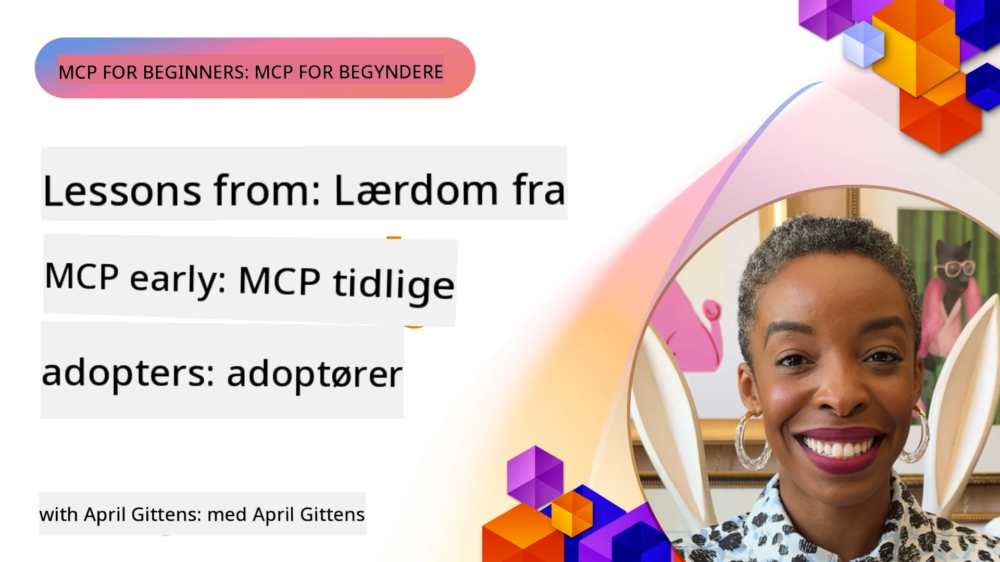

# 🌟 Lektioner fra tidlige brugere

[](https://youtu.be/jds7dSmNptE)

_(Klik på billedet ovenfor for at se videoen af denne lektion)_

## 🎯 Hvad dette modul dækker

Dette modul udforsker, hvordan rigtige organisationer og udviklere udnytter Model Context Protocol (MCP) til at løse faktiske udfordringer og drive innovation. Gennem detaljerede casestudier, praktiske projekter og konkrete eksempler vil du opdage, hvordan MCP muliggør sikker, skalerbar AI-integration, der forbinder sprogmodeller, værktøjer og virksomhedsdata.

### 📚 Se MCP i aktion

Vil du se disse principper anvendt på produktionsklare værktøjer? Tjek vores [**10 Microsoft MCP-servere, der transformerer udviklerproduktiviteten**](microsoft-mcp-servers.md), som viser rigtige Microsoft MCP-servere, du kan bruge i dag.

## Oversigt

Denne lektion udforsker, hvordan tidlige brugere har udnyttet Model Context Protocol (MCP) til at løse virkelige udfordringer og drive innovation på tværs af brancher. Gennem detaljerede casestudier og praktiske projekter vil du se, hvordan MCP muliggør standardiseret, sikker og skalerbar AI-integration — der forbinder store sprogmodeller, værktøjer og virksomhedsdata i en samlet ramme. Du vil opnå praktisk erfaring med at designe og bygge MCP-baserede løsninger, lære af gennemprøvede implementeringsmønstre og opdage bedste praksis til udrulning af MCP i produktionsmiljøer. Lektionen fremhæver også nye tendenser, fremtidige retninger og open source-ressourcer, som hjælper dig med at forblive i front på MCP-teknologi og dens udviklende økosystem.

## Læringsmål

- Analysere virkelige MCP-implementeringer på tværs af forskellige brancher
- Designe og bygge fuldstændige MCP-baserede applikationer
- Udforske nye tendenser og fremtidige retninger inden for MCP-teknologi
- Anvende bedste praksis i faktiske udviklingsscenarier

## Virkelige MCP-implementeringer

### Casestudie 1: Enterprise Kunde Support Automatisering

En multinational virksomhed implementerede en MCP-baseret løsning for at standardisere AI-interaktioner på tværs af deres kundesupportsystemer. Dette gjorde dem i stand til at:

- Oprette en samlet grænseflade for flere LLM-udbydere
- Opretholde konsistent promptstyring på tværs af afdelinger
- Implementere robuste sikkerheds- og overholdelseskontroller
- Let skifte mellem forskellige AI-modeller baseret på specifikke behov

**Teknisk implementering:**

```python
# Python MCP serverimplementering til kundesupport
import logging
import asyncio
from modelcontextprotocol import create_server, ServerConfig
from modelcontextprotocol.server import MCPServer
from modelcontextprotocol.transports import create_http_transport
from modelcontextprotocol.resources import ResourceDefinition
from modelcontextprotocol.prompts import PromptDefinition
from modelcontextprotocol.tool import ToolDefinition

# Konfigurer logning
logging.basicConfig(level=logging.INFO)

async def main():
    # Opret serverkonfiguration
    config = ServerConfig(
        name="Enterprise Customer Support Server",
        version="1.0.0",
        description="MCP server for handling customer support inquiries"
    )
    
    # Initialiser MCP-server
    server = create_server(config)
    
    # Registrer vidensbaseressourcer
    server.resources.register(
        ResourceDefinition(
            name="customer_kb",
            description="Customer knowledge base documentation"
        ),
        lambda params: get_customer_documentation(params)
    )
    
    # Registrer promptskabeloner
    server.prompts.register(
        PromptDefinition(
            name="support_template",
            description="Templates for customer support responses"
        ),
        lambda params: get_support_templates(params)
    )
    
    # Registrer supportværktøjer
    server.tools.register(
        ToolDefinition(
            name="ticketing",
            description="Create and update support tickets"
        ),
        handle_ticketing_operations
    )
    
    # Start server med HTTP-transporter
    transport = create_http_transport(port=8080)
    await server.run(transport)

if __name__ == "__main__":
    asyncio.run(main())
```

**Resultater:** 30% reduktion i modelomkostninger, 45% forbedring i responssammenhæng og forbedret overholdelse på tværs af globale operationer.

### Casestudie 2: Sundhedsdiagnostisk Assistent

En sundhedsudbyder udviklede en MCP-infrastruktur for at integrere flere specialiserede medicinske AI-modeller, samtidig med at følsomme patientdata blev beskyttet:

- Problemfri skiftning mellem generalist- og specialistmedicinske modeller
- Strenge privatlivskontroller og revisionsspor
- Integration med eksisterende elektroniske journaler (EHR-systemer)
- Konsistent prompt engineering for medicinsk terminologi

**Teknisk implementering:**

```csharp
// C# MCP host application implementation in healthcare application
using Microsoft.Extensions.DependencyInjection;
using ModelContextProtocol.SDK.Client;
using ModelContextProtocol.SDK.Security;
using ModelContextProtocol.SDK.Resources;

public class DiagnosticAssistant
{
    private readonly MCPHostClient _mcpClient;
    private readonly PatientContext _patientContext;
    
    public DiagnosticAssistant(PatientContext patientContext)
    {
        _patientContext = patientContext;
        
        // Configure MCP client with healthcare-specific settings
        var clientOptions = new ClientOptions
        {
            Name = "Healthcare Diagnostic Assistant",
            Version = "1.0.0",
            Security = new SecurityOptions
            {
                Encryption = EncryptionLevel.Medical,
                AuditEnabled = true
            }
        };
        
        _mcpClient = new MCPHostClientBuilder()
            .WithOptions(clientOptions)
            .WithTransport(new HttpTransport("https://healthcare-mcp.example.org"))
            .WithAuthentication(new HIPAACompliantAuthProvider())
            .Build();
    }
    
    public async Task<DiagnosticSuggestion> GetDiagnosticAssistance(
        string symptoms, string patientHistory)
    {
        // Create request with appropriate resources and tool access
        var resourceRequest = new ResourceRequest
        {
            Name = "patient_records",
            Parameters = new Dictionary<string, object>
            {
                ["patientId"] = _patientContext.PatientId,
                ["requestingProvider"] = _patientContext.ProviderId
            }
        };
        
        // Request diagnostic assistance using appropriate prompt
        var response = await _mcpClient.SendPromptRequestAsync(
            promptName: "diagnostic_assistance",
            parameters: new Dictionary<string, object>
            {
                ["symptoms"] = symptoms,
                patientHistory = patientHistory,
                relevantGuidelines = _patientContext.GetRelevantGuidelines()
            });
            
        return DiagnosticSuggestion.FromMCPResponse(response);
    }
}
```

**Resultater:** Forbedrede diagnostiske forslag til læger samtidig med fuld HIPAA-overholdelse og betydelig reduktion i kontekstskift mellem systemer.

### Casestudie 3: Finansielle Tjenester Risikostyring

En finansiel institution implementerede MCP for at standardisere deres risikostyringsprocesser på tværs af forskellige afdelinger:

- Oprettede en samlet grænseflade for kreditrisiko, bedrageridetektion og investeringsrisikomodeller
- Implementerede strenge adgangskontroller og modelversionering
- Sikrede revisionsmulighed for alle AI-anbefalinger
- Opretholdt konsistent dataformatering på tværs af forskellige systemer

**Teknisk implementering:**

```java
// Java MCP-server til finansiel risikovurdering
import org.mcp.server.*;
import org.mcp.security.*;

public class FinancialRiskMCPServer {
    public static void main(String[] args) {
        // Opret MCP-server med finansielle overholdelsesfunktioner
        MCPServer server = new MCPServerBuilder()
            .withModelProviders(
                new ModelProvider("risk-assessment-primary", new AzureOpenAIProvider()),
                new ModelProvider("risk-assessment-audit", new LocalLlamaProvider())
            )
            .withPromptTemplateDirectory("./compliance/templates")
            .withAccessControls(new SOCCompliantAccessControl())
            .withDataEncryption(EncryptionStandard.FINANCIAL_GRADE)
            .withVersionControl(true)
            .withAuditLogging(new DatabaseAuditLogger())
            .build();
            
        server.addRequestValidator(new FinancialDataValidator());
        server.addResponseFilter(new PII_RedactionFilter());
        
        server.start(9000);
        
        System.out.println("Financial Risk MCP Server running on port 9000");
    }
}
```

**Resultater:** Forbedret overholdelse, 40% hurtigere modeludrulningscyklusser og øget konsistens i risikovurderinger på tværs af afdelinger.

### Casestudie 4: Microsoft Playwright MCP Server til Browserautomatisering

Microsoft udviklede [Playwright MCP serveren](https://github.com/microsoft/playwright-mcp) for at muliggøre sikker, standardiseret browserautomatisering via Model Context Protocol. Denne produktionsklare server tillader AI-agenter og LLM'er at interagere med webbrowsere på en kontrolleret, reviderbar og udvidelsesbar måde — hvilket muliggør anvendelser som automatiseret webtest, dataudtræk og end-to-end workflows.

> **🎯 Produktionsklart værktøj**
> 
> Dette casestudie viser en rigtig MCP-server, du kan bruge i dag! Lær mere om Playwright MCP Server og 9 andre produktionsklare Microsoft MCP-servere i vores [**Microsoft MCP Servers Guide**](microsoft-mcp-servers.md#8--playwright-mcp-server).

**Nøglefunktioner:**
- Eksponerer browserautomationsfunktioner (navigation, formularudfyldning, screenshot-tagning osv.) som MCP-værktøjer
- Implementerer strenge adgangskontroller og sandkassemiljøer for at forhindre uautoriserede handlinger
- Leverer detaljerede revisionslogfiler for alle browserinteraktioner
- Understøtter integration med Azure OpenAI og andre LLM-udbydere til agentdreven automatisering
- Driver GitHub Copilots Coding Agent med webbrowsingkapaciteter

**Teknisk implementering:**

```typescript
// TypeScript: Registrering af Playwright browser automatiseringsværktøjer i en MCP-server
import { createServer, ToolDefinition } from 'modelcontextprotocol';
import { launch } from 'playwright';

const server = createServer({
  name: 'Playwright MCP Server',
  version: '1.0.0',
  description: 'MCP server for browser automation using Playwright'
});

// Registrer et værktøj til at navigere til en URL og tage et screenshot
server.tools.register(
  new ToolDefinition({
    name: 'navigate_and_screenshot',
    description: 'Navigate to a URL and capture a screenshot',
    parameters: {
      url: { type: 'string', description: 'The URL to visit' }
    }
  }),
  async ({ url }) => {
    const browser = await launch();
    const page = await browser.newPage();
    await page.goto(url);
    const screenshot = await page.screenshot();
    await browser.close();
    return { screenshot };
  }
);

// Start MCP-serveren
server.listen(8080);
```

**Resultater:**

- Muliggjorde sikker, programmatisk browserautomatisering for AI-agenter og LLM'er
- Reducerede manuelt testarbejde og forbedrede testdækning for webapplikationer
- Leverede en genanvendelig, udvidelsesbar ramme for browserbaseret værktøjsintegration i virksomheds miljøer
- Driver GitHub Copilots webbrowsingkapaciteter

**Referencer:**

- [Playwright MCP Server GitHub Repository](https://github.com/microsoft/playwright-mcp)
- [Microsoft AI and Automation Solutions](https://azure.microsoft.com/en-us/products/ai-services/)

### Casestudie 5: Azure MCP – Enterprise-Grade Model Context Protocol som en Service

Azure MCP Server ([https://aka.ms/azmcp](https://aka.ms/azmcp)) er Microsofts administrerede, enterprise-grade implementering af Model Context Protocol, designet til at tilbyde skalerbare, sikre og compliant MCP-serverfunktioner som en cloud-tjeneste. Azure MCP gør det muligt for organisationer hurtigt at udrulle, administrere og integrere MCP-servere med Azure AI, data og sikkerhedstjenester, hvilket reducerer operationel overhead og fremskynder AI-adoption.

> **🎯 Produktionsklart værktøj**
> 
> Dette er en rigtig MCP-server, du kan bruge i dag! Lær mere om Microsoft Foundry MCP Server i vores [**Microsoft MCP Servers Guide**](microsoft-mcp-servers.md).


- Fuldt administreret MCP-serverhosting med indbygget skalering, overvågning og sikkerhed
- Naturlig integration med Azure OpenAI, Azure AI Search og andre Azure-tjenester
- Enterprise-godkendelse og autorisation via Microsoft Entra ID
- Understøttelse af brugerdefinerede værktøjer, promptskabeloner og ressourcetilslutninger
- Overholdelse af virksomhedens sikkerheds- og regulatoriske krav

**Teknisk implementering:**

```yaml
# Example: Azure MCP server deployment configuration (YAML)
apiVersion: mcp.microsoft.com/v1
kind: McpServer
metadata:
  name: enterprise-mcp-server
spec:
  modelProviders:
    - name: azure-openai
      type: AzureOpenAI
      endpoint: https://<your-openai-resource>.openai.azure.com/
      apiKeySecret: <your-azure-keyvault-secret>
  tools:
    - name: document_search
      type: AzureAISearch
      endpoint: https://<your-search-resource>.search.windows.net/
      apiKeySecret: <your-azure-keyvault-secret>
  authentication:
    type: EntraID
    tenantId: <your-tenant-id>
  monitoring:
    enabled: true
    logAnalyticsWorkspace: <your-log-analytics-id>
```

**Resultater:**  
- Reduceret time-to-value for enterprise AI-projekter ved at tilbyde en klar-til-brug, compliant MCP-serverplatform
- Forenklet integration af LLM'er, værktøjer og virksomhedens datakilder
- Forbedret sikkerhed, observerbarhed og operationel effektivitet for MCP-arbejdsbelastninger
- Forbedret kodekvalitet med Azure SDKs bedste praksis og aktuelle godkendelsesmønstre

**Referencer:**  
- [Azure MCP Documentation](https://aka.ms/azmcp)
- [Azure MCP Server GitHub Repository](https://github.com/Azure/azure-mcp)
- [Azure AI Services](https://azure.microsoft.com/en-us/products/ai-services/)
- [Microsoft MCP Center](https://mcp.azure.com)

## Casestudie 6: NLWeb 
MCP (Model Context Protocol) er en ny protokol for chatbots og AI-assistenter til at interagere med værktøjer. Hver NLWeb-instans er også en MCP-server, der understøtter én kerne metode, ask, som bruges til at stille et spørgsmål til et websted i almindeligt sprog. Det returnerede svar bruger schema.org, et bredt anvendt vokabularium til at beskrive webdata. Løst sagt er MCP NLWeb som Http er til HTML. NLWeb kombinerer protokoller, Schema.org-formater og eksempel kode til at hjælpe websteder med hurtigt at skabe disse endpoints, til gavn for både mennesker gennem konverserende grænseflader og maskiner via naturlig agent-til-agent interaction.

Der er to forskellige komponenter i NLWeb.
- En protokol, meget enkel at komme i gang med, til at grænseflade med et websted i almindeligt sprog og et format, der udnytter json og schema.org for det returnerede svar. Se dokumentationen om REST API for flere detaljer.
- En ligetil implementering af (1), som udnytter eksisterende markup, for websteder der kan abstraheres som lister over elementer (produkter, opskrifter, attraktioner, anmeldelser osv.). Sammen med et sæt brugergrænseflade-widgets kan websteder nemt levere konverserende grænseflader til deres indhold. Se dokumentationen om Life of a chat query for flere detaljer om hvordan det fungerer.
 
**Referencer:**  
- [Azure MCP Documentation](https://aka.ms/azmcp)
- [NLWeb](https://github.com/microsoft/NlWeb)

### Casestudie 7: Microsoft Foundry MCP Server – Enterprise AI Agent Integration

Microsoft Foundry MCP-servere demonstrerer, hvordan MCP kan bruges til at orkestrere og styre AI-agenter og workflows i virksomheds miljøer. Ved at integrere MCP med Microsoft Foundry kan organisationer standardisere agentinteraktioner, udnytte Foundrys workflow management og sikre sikre, skalerbare udrulninger.

> **🎯 Produktionsklart værktøj**
> 
> Dette er en rigtig MCP-server, du kan bruge i dag! Lær mere om Microsoft Foundry MCP Server i vores [**Microsoft MCP Servers Guide**](microsoft-mcp-servers.md#9--microsoft-foundry-mcp-server).

**Nøglefunktioner:**
- Omfattende adgang til Azures AI-økosystem, inklusive modelkataloger og udrulningsstyring
- Videnindeksering med Azure AI Search til RAG-applikationer
- Evalueringsværktøjer for AI-modelpræstation og kvalitetskontrol
- Integration med Microsoft Foundry Catalog og Labs for banebrydende forskningsmodeller
- Agentstyring og evalueringsfunktioner til produktionsscenarier

**Resultater:**
- Hurtig prototyping og robust overvågning af AI-agent workflows
- Problemfri integration med Azure AI-tjenester til avancerede scenarier
- Samlet grænseflade til at bygge, udrulle og overvåge agent pipelines
- Forbedret sikkerhed, overholdelse og operationel effektivitet for virksomheder
- Accelereret AI-adoption samtidig med kontrol over komplekse agentdrevne processer

**Referencer:**
- [Microsoft Foundry MCP Server GitHub Repository](https://github.com/azure-ai-foundry/mcp-foundry)
- [Integrating Azure AI Agents with MCP (Microsoft Foundry Blog)](https://devblogs.microsoft.com/foundry/integrating-azure-ai-agents-mcp/)

### Casestudie 8: Foundry MCP Playground – Eksperimentering og Prototyping

Foundry MCP Playground tilbyder et klart-til-brug-miljø til eksperimenter med MCP-servere og Microsoft Foundry-integrationer. Udviklere kan hurtigt prototype, teste og evaluere AI-modeller og agent-workflows ved brug af ressourcer fra Microsoft Foundry Catalog og Labs. Playgrounden forenkler opsætningen, leverer prøveprojekter og understøtter samarbejdsudvikling, hvilket gør det nemt at udforske bedste praksis og nye scenarier med minimal indsats. Det er især nyttigt for teams, der ønsker at validere idéer, dele eksperimenter og fremskynde læring uden behov for kompleks infrastruktur. Ved at sænke adgangsbarrieren hjælper playgrounden med at fremme innovation og fællesskabsbidrag i MCP- og Microsoft Foundry-økosystemet.

**Referencer:**

- [Foundry MCP Playground GitHub Repository](https://github.com/azure-ai-foundry/foundry-mcp-playground)

### Casestudie 9: Microsoft Learn Docs MCP Server – AI-drevet dokumentationsadgang 

Microsoft Learn Docs MCP Server er en cloud-hostet tjeneste, der giver AI-assistenter realtidsadgang til officiel Microsoft-dokumentation via Model Context Protocol. Denne produktionsklare server forbinder med det omfattende Microsoft Learn-økosystem og muliggør semantisk søgning på tværs af alle officielle Microsoft-kilder.

> **🎯 Produktionsklart værktøj**
> 
> Dette er en rigtig MCP-server, du kan bruge i dag! Lær mere om Microsoft Learn Docs MCP Server i vores [**Microsoft MCP Servers Guide**](microsoft-mcp-servers.md#1--microsoft-learn-docs-mcp-server).

**Nøglefunktioner:**
- Realtidsadgang til officiel Microsoft-dokumentation, Azure-dokumenter og Microsoft 365-dokumentation
- Avancerede semantiske søgefunktioner, der forstår kontekst og intention
- Altid opdaterede oplysninger efterhånden som Microsoft Learn-indhold offentliggøres
- Omfattende dækning på tværs af Microsoft Learn, Azure-dokumentation og Microsoft 365-kilder
- Returnerer op til 10 højkvalitets indholdsstykker med artikeltitler og URLs

**Hvorfor det er kritisk:**
- Løser problemet med "forældet AI-viden" for Microsoft-teknologier
- Sikrer, at AI-assistenter har adgang til den nyeste .NET, C#, Azure og Microsoft 365 funktioner
- Leverer autoritativ, førsteparts information for præcis kodegenerering
- Vigtig for udviklere, der arbejder med hurtigt udviklende Microsoft-teknologier

**Resultater:**
- Markant forbedret nøjagtighed af AI-genereret kode for Microsoft-teknologier
- Reduceret tid brugt på at søge efter opdateret dokumentation og bedste praksis
- Forbedret udviklerproduktivitet med kontekstbevidst dokumentationshentning
- Problemfri integration i udviklingsarbejdsgange uden at forlade IDE'en

**Referencer:**
- [Microsoft Learn Docs MCP Server GitHub Repository](https://github.com/MicrosoftDocs/mcp)
- [Microsoft Learn Documentation](https://learn.microsoft.com/)

## Praktiske projekter

### Projekt 1: Byg en Multi-Provider MCP Server

**Mål:** Opret en MCP-server, der kan rute anmodninger til flere AI-modeludbydere baseret på specifikke kriterier.

**Krav:**

- Understøt mindst tre forskellige modeludbydere (f.eks. OpenAI, Anthropic, lokale modeller)
- Implementer en routingmekanisme baseret på anmodningsmetadata
- Opret et konfigurationssystem til håndtering af udbyderlegitimationsoplysninger
- Tilføj caching for at optimere ydeevne og omkostninger
- Byg et simpelt dashboard til overvågning af brug

**Implementeringstrin:**

1. Opsæt den grundlæggende MCP-serverinfrastruktur
2. Implementer udbyderadaptere for hver AI-modelservice
3. Opret routinglogik baseret på anmodningsegenskaber
4. Tilføj cachingmekanismer til hyppige anmodninger
5. Udvikl overvågningsdashboardet
6. Test med forskellige anmodningsmønstre

**Teknologier:** Vælg mellem Python (.NET/Java/Python baseret på din præference), Redis til caching og et simpelt webrammeværk til dashboardet.

### Projekt 2: Enterprise Prompt Management System

**Mål:** Udvikl et MCP-baseret system til håndtering, versionering og udrulning af promptskabeloner på tværs af en organisation.

**Krav:**


- Opret et centraliseret repository for promptskabeloner
- Implementer versionsstyring og godkendelsesarbejdsgange
- Byg testmuligheder for skabeloner med eksempelinput
- Udvikl rollebaserede adgangskontroller
- Opret et API til skabelonindhentning og udrulning

**Implementeringstrin:**

1. Design databaseskemaet til skabelonlagring
2. Opret kerne-API’en til skabelon-CRUD-operationer
3. Implementer versionsstyringssystemet
4. Byg godkendelsesarbejdsgangen
5. Udvikl testframeworket
6. Opret en simpel webgrænseflade til administration
7. Integrer med en MCP-server

**Teknologier:** Dit valg af backend-framework, SQL- eller NoSQL-database og et frontend-framework til administrationsgrænsefladen.

### Projekt 3: MCP-baseret platform til indholdsgenerering

**Mål:** Byg en platform til indholdsgenerering, der udnytter MCP til at levere konsistente resultater på tværs af forskellige indholdstyper.

**Krav:**

- Understøt flere indholdsformater (blogindlæg, sociale medier, marketingtekst)
- Implementer skabelonbaseret generering med tilpasningsmuligheder
- Opret et system til indholdsrevision og feedback
- Spor indholdsperformance-målinger
- Understøt versionsstyring og iteration af indhold

**Implementeringstrin:**

1. Opsæt MCP-klientinfrastrukturen
2. Opret skabeloner til forskellige indholdstyper
3. Byg indholdsgenereringspipeline
4. Implementer revisionssystemet
5. Udvikl metrics-sporingssystemet
6. Opret en brugergrænseflade til skabelonadministration og indholdsgenerering

**Teknologier:** Dit foretrukne programmeringssprog, web-framework og databasesystem.

## Fremtidige retninger for MCP-teknologi

### Fremvoksende trends

1. **Multi-modal MCP**
   - Udvidelse af MCP til at standardisere interaktioner med billed-, lyd- og videomodeller
   - Udvikling af tværmodal ræsonneringsevne
   - Standardiserede promptformater til forskellige modaliteter

2. **Federeret MCP-infrastruktur**
   - Distribuerede MCP-netværk, der kan dele ressourcer på tværs af organisationer
   - Standardiserede protokoller til sikker deling af modeller
   - Privatlivsbevarende beregningsteknikker

3. **MCP-markedspladser**
   - Økosystemer til deling og monetarisering af MCP-skabeloner og plugins
   - Kvalitetssikring og certificeringsprocesser
   - Integration med modelmarkedspladser

4. **MCP til edge computing**
   - Tilpasning af MCP-standarder til ressourcebegrænsede edge-enheder
   - Optimerede protokoller til lavbåndsbreddemiljøer
   - Specialiserede MCP-implementeringer til IoT-økosystemer

5. **Regulatoriske rammer**
   - Udvikling af MCP-udvidelser til regulatorisk overholdelse
   - Standardiserede revisionsspor og forklaringsgrænseflader
   - Integration med fremvoksende AI-governance-rammer

### MCP-løsninger fra Microsoft

Microsoft og Azure har udviklet flere open source-repositorier for at hjælpe udviklere med at implementere MCP i forskellige scenarier:

#### Microsoft-organisationen

1. [playwright-mcp](https://github.com/microsoft/playwright-mcp) - En Playwright MCP-server til browserautomatisering og test
2. [files-mcp-server](https://github.com/microsoft/files-mcp-server) - En OneDrive MCP-serverimplementering til lokal test og fællesskabsbidrag
3. [NLWeb](https://github.com/microsoft/NlWeb) - NLWeb er en samling af åbne protokoller og tilhørende open source-værktøjer. Hovedfokus er at etablere et fundamentalt lag for AI-webben

#### Azure-Samples-organisationen

1. [mcp](https://github.com/Azure-Samples/mcp) - Links til eksempler, værktøjer og ressourcer til at bygge og integrere MCP-servere på Azure med flere sprog
2. [mcp-auth-servers](https://github.com/Azure-Samples/mcp-auth-servers) - Reference MCP-servere, der demonstrerer autentificering med den nuværende Model Context Protocol-specifikation
3. [remote-mcp-functions](https://github.com/Azure-Samples/remote-mcp-functions) - Landingsside for Remote MCP-serverimplementeringer i Azure Functions med links til sprogspecifikke repositorier
4. [remote-mcp-functions-python](https://github.com/Azure-Samples/remote-mcp-functions-python) - Hurtigstartsskabelon til at bygge og udrulle brugerdefinerede remote MCP-servere med Azure Functions i Python
5. [remote-mcp-functions-dotnet](https://github.com/Azure-Samples/remote-mcp-functions-dotnet) - Hurtigstartsskabelon til at bygge og udrulle brugerdefinerede remote MCP-servere med Azure Functions i .NET/C#
6. [remote-mcp-functions-typescript](https://github.com/Azure-Samples/remote-mcp-functions-typescript) - Hurtigstartsskabelon til at bygge og udrulle brugerdefinerede remote MCP-servere med Azure Functions i TypeScript
7. [remote-mcp-apim-functions-python](https://github.com/Azure-Samples/remote-mcp-apim-functions-python) - Azure API Management som AI-gateway til Remote MCP-servere med Python
8. [AI-Gateway](https://github.com/Azure-Samples/AI-Gateway) - APIM ❤️ AI-eksperimenter inklusive MCP-funktioner, integration med Azure OpenAI og AI Foundry

Disse repositorier tilbyder forskellige implementeringer, skabeloner og ressourcer til arbejde med Model Context Protocol på tværs af forskellige programmeringssprog og Azure-tjenester. De dækker en række anvendelsestilfælde fra grundlæggende serverimplementeringer til autentificering, cloud-udrulning og enterprise-integrationsscenarier.

#### MCP Resource Directory

[MCP Resource Directory](https://github.com/microsoft/mcp/tree/main/Resources) i den officielle Microsoft MCP-repository tilbyder en kurateret samling af eksempler på ressourcer, promptskabeloner og værktøjsdefinitioner til brug med Model Context Protocol-servere. Dette bibliotek er designet til at hjælpe udviklere med hurtigt at komme i gang med MCP ved at tilbyde genanvendelige byggesten og bedste praksiseksempler for:

- **Promptskabeloner:** Klar-til-brug-skabeloner til almindelige AI-opgaver og scenarier, som kan tilpasses til dine egne MCP-serverimplementeringer.
- **Værktøjsdefinitioner:** Eksempler på værktøjsskemaer og metadata for at standardisere værktøjsintegration og -kald på tværs af forskellige MCP-servere.
- **Ressourceeksempler:** Eksempelressourcedefinitioner til tilslutning til datakilder, API’er og eksterne services inden for MCP-rammen.
- **Referenceimplementeringer:** Praktiske eksempler, der demonstrerer, hvordan ressourcer, prompts og værktøjer struktureres og organiseres i virkelige MCP-projekter.

Disse ressourcer fremskynder udviklingen, fremmer standardisering og hjælper med at sikre bedste praksis ved opbygning og udrulning af MCP-baserede løsninger.

#### MCP Resource Directory

- [MCP Resources (Sample Prompts, Tools, and Resource Definitions)](https://github.com/microsoft/mcp/tree/main/Resources)

### Forskningsmuligheder

- Effektive promptoptimeringsteknikker inden for MCP-rammer
- Sikkerhedsmodeller for multi-tenant MCP-udrulninger
- Ydeevnemålinger på tværs af forskellige MCP-implementeringer
- Formelle verifikationsmetoder for MCP-servere

## Konklusion

Model Context Protocol (MCP) former hurtigt fremtiden for standardiseret, sikker og interoperabel AI-integration på tværs af industrier. Gennem casestudierne og de praktiske projekter i denne lektion har du set, hvordan tidlige adoptanter—including Microsoft og Azure—udnytter MCP til at løse virkelige udfordringer, accelerere AI-adoption og sikre overholdelse, sikkerhed og skalerbarhed. MCP’s modulære tilgang gør det muligt for organisationer at forbinde store sprogmodeller, værktøjer og virksomheders data i en samlet, reviderbar ramme. Efterhånden som MCP fortsætter med at udvikle sig, vil det være vigtigt at engagere sig i fællesskabet, udforske open source-ressourcer og anvende bedste praksis for at bygge robuste fremtidssikrede AI-løsninger.

## Yderligere ressourcer

- [MCP Foundry GitHub Repository](https://github.com/azure-ai-foundry/mcp-foundry)
- [Foundry MCP Playground](https://github.com/azure-ai-foundry/foundry-mcp-playground)
- [Integration af Azure AI-agenter med MCP (Microsoft Foundry Blog)](https://devblogs.microsoft.com/foundry/integrating-azure-ai-agents-mcp/)
- [MCP GitHub Repository (Microsoft)](https://github.com/microsoft/mcp)
- [MCP Resources Directory (Sample Prompts, Tools, and Resource Definitions)](https://github.com/microsoft/mcp/tree/main/Resources)
- [MCP-fællesskab & dokumentation](https://modelcontextprotocol.io/introduction)
- [MCP-specifikation (2026-07-28)](https://modelcontextprotocol.io/specification/2026-07-28/)
- [Azure MCP-dokumentation](https://aka.ms/azmcp)
- [OWASP MCP Top 10](https://microsoft.github.io/mcp-azure-security-guide/mcp/) - Sikkerhedens bedste praksis
- [Playwright MCP Server GitHub Repository](https://github.com/microsoft/playwright-mcp)
- [Files MCP Server (OneDrive)](https://github.com/microsoft/files-mcp-server)
- [Azure-Samples MCP](https://github.com/Azure-Samples/mcp)
- [MCP Auth Servers (Azure-Samples)](https://github.com/Azure-Samples/mcp-auth-servers)
- [Remote MCP Functions (Azure-Samples)](https://github.com/Azure-Samples/remote-mcp-functions)
- [Remote MCP Functions Python (Azure-Samples)](https://github.com/Azure-Samples/remote-mcp-functions-python)
- [Remote MCP Functions .NET (Azure-Samples)](https://github.com/Azure-Samples/remote-mcp-functions-dotnet)
- [Remote MCP Functions TypeScript (Azure-Samples)](https://github.com/Azure-Samples/remote-mcp-functions-typescript)
- [Remote MCP APIM Functions Python (Azure-Samples)](https://github.com/Azure-Samples/remote-mcp-apim-functions-python)
- [AI-Gateway (Azure-Samples)](https://github.com/Azure-Samples/AI-Gateway)
- [Microsoft AI og automatiseringsløsninger](https://azure.microsoft.com/en-us/products/ai-services/)

## Øvelser

1. Analyser et af casestudierne og foreslå en alternativ implementeringstilgang.
2. Vælg et af projektideerne og lav en detaljeret teknisk specifikation.
3. Undersøg en branche, der ikke er dækket i casestudierne, og skitser hvordan MCP kan tackle dens specifikke udfordringer.
4. Udforsk en af fremtidige retninger og udvikl et koncept for en ny MCP-udvidelse til understøttelse af denne.

## Hvad nu?

Udforsk mere: [Microsoft MCP Servers](./microsoft-mcp-servers.md)

Fortsæt til: [Modul 8: Bedste Praksis](../08-BestPractices/README.md)

---

<!-- CO-OP TRANSLATOR DISCLAIMER START -->
**Ansvarsfraskrivelse**:
Dette dokument er blevet oversat ved hjælp af AI-oversættelsestjenesten [Co-op Translator](https://github.com/Azure/co-op-translator). Selvom vi bestræber os på nøjagtighed, skal du være opmærksom på, at automatiserede oversættelser kan indeholde fejl eller unøjagtigheder. Det originale dokument på dets oprindelige sprog bør betragtes som den autoritative kilde. For kritisk information anbefales professionel menneskelig oversættelse. Vi påtager os intet ansvar for misforståelser eller fejltolkninger, der opstår som følge af brugen af denne oversættelse.
<!-- CO-OP TRANSLATOR DISCLAIMER END -->